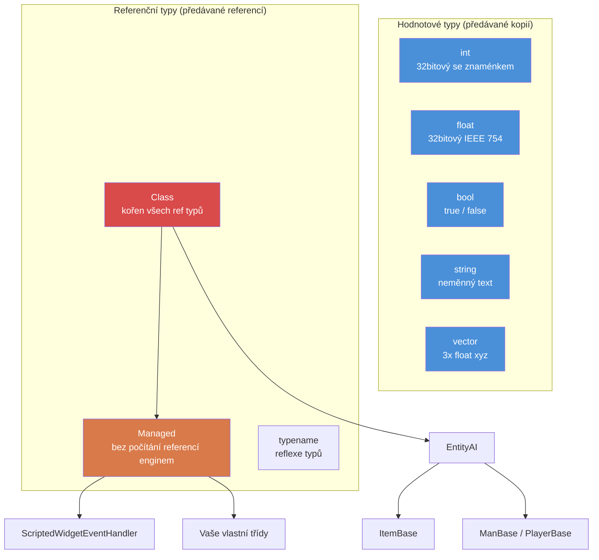

# Kapitola 1.1: Proměnné a typy

[Domů](../../README.md) | **Proměnné a typy** | [Další: Pole, mapy a množiny >>](02-arrays-maps-sets.md)

---

## Úvod

Enforce Script je skriptovací jazyk enginu Enfusion, který používá DayZ Standalone. Jedná se o objektově orientovaný jazyk se syntaxí podobnou jazyku C, v mnoha ohledech podobný C#, ale s vlastní sadou typů, pravidel a omezení. Pokud máte zkušenosti s C#, Javou nebo C++, budete se rychle cítit jako doma --- ale věnujte pozornost rozdílům, protože právě tam, kde se Enforce Script od těchto jazyků odchyluje, se skrývají chyby.

Tato kapitola pokrývá základní stavební kameny: primitivní typy, jak deklarovat a inicializovat proměnné a jak funguje konverze typů. Každý řádek kódu DayZ modu začíná právě zde.

---

## Primitivní typy

Enforce Script má malou, pevnou sadu primitivních typů. Nemůžete definovat nové hodnotové typy --- pouze třídy (viz [Kapitola 1.3](03-classes-inheritance.md)).

| Typ | Velikost | Výchozí hodnota | Popis |
|------|------|---------------|-------------|
| `int` | 32bitový se znaménkem | `0` | Celá čísla od -2 147 483 648 do 2 147 483 647 |
| `float` | 32bitový IEEE 754 | `0.0` | Čísla s plovoucí řádovou čárkou |
| `bool` | 1 bit logický | `false` | `true` nebo `false` |
| `string` | Proměnlivá | `""` (prázdný) | Text. Neměnný hodnotový typ --- předávaný hodnotou, ne referencí |
| `vector` | 3x float | `"0 0 0"` | Tříkomponentový float (x, y, z). Předávaný hodnotou |
| `typename` | Reference enginu | `null` | Reference na samotný typ, používaná pro reflexi |
| `void` | N/A | N/A | Používán pouze jako návratový typ k označení "nevrací nic" |

### Diagram hierarchie typů



### Typové konstanty

Některé typy nabízejí užitečné konstanty:

```c
// hranice int
int maxInt = int.MAX;    // 2147483647
int minInt = int.MIN;    // -2147483648

// hranice float
float smallest = float.MIN;     // nejmenší kladný float (~1.175e-38)
float largest  = float.MAX;     // největší float (~3.403e+38)
float lowest   = float.LOWEST;  // nejzápornější float (-3.403e+38)
```

---

## Deklarace proměnných

Proměnné se deklarují uvedením typu následovaného názvem. Můžete deklarovat a přiřadit v jednom příkazu nebo odděleně.

```c
void MyFunction()
{
    // Pouze deklarace (inicializováno na výchozí hodnotu)
    int health;          // health == 0
    float speed;         // speed == 0.0
    bool isAlive;        // isAlive == false
    string name;         // name == ""

    // Deklarace s inicializací
    int maxPlayers = 60;
    float gravity = 9.81;
    bool debugMode = true;
    string serverName = "My DayZ Server";
}
```

### Klíčové slovo `auto`

Když je typ zřejmý z pravé strany výrazu, můžete použít `auto`, aby kompilátor typ odvodil:

```c
void Example()
{
    auto count = 10;           // int
    auto ratio = 0.75;         // float
    auto label = "Hello";      // string
    auto player = GetGame().GetPlayer();  // DayZPlayer (nebo cokoliv GetPlayer vrátí)
}
```

Toto je čistě pro pohodlí --- kompilátor vyhodnotí typ při kompilaci. Neexistuje žádný rozdíl ve výkonu.

### Konstanty

Použijte klíčové slovo `const` pro hodnoty, které by se po inicializaci nikdy neměly měnit:

```c
const int MAX_SQUAD_SIZE = 8;
const float SPAWN_RADIUS = 150.0;
const string MOD_PREFIX = "[MyMod]";

void Example()
{
    int a = MAX_SQUAD_SIZE;  // OK: čtení konstanty
    MAX_SQUAD_SIZE = 10;     // CHYBA: nelze přiřadit konstantě
}
```

Konstanty se obvykle deklarují na úrovni souboru (mimo jakoukoli funkci) nebo jako členy třídy. Konvence pojmenování: `UPPER_SNAKE_CASE`.

---

## Práce s `int`

Celá čísla jsou nejpoužívanějším typem. DayZ je používá pro počty předmětů, ID hráčů, hodnoty zdraví (při diskretizaci), hodnoty výčtů, bitové příznaky a další.

```c
void IntExamples()
{
    int count = 5;
    int total = count + 10;     // 15
    int doubled = count * 2;    // 10
    int remainder = 17 % 5;     // 2 (modulo)

    // Inkrementace a dekrementace
    count++;    // count je nyní 6
    count--;    // count je opět 5

    // Složené přiřazení
    count += 3;  // count je nyní 8
    count -= 2;  // count je nyní 6
    count *= 4;  // count je nyní 24
    count /= 6;  // count je nyní 4

    // Celočíselné dělení ořezává (nezaokrouhluje)
    int result = 7 / 2;    // result == 3, ne 3.5

    // Bitové operace (používané pro příznaky)
    int flags = 0;
    flags = flags | 0x01;   // nastavit bit 0
    flags = flags | 0x04;   // nastavit bit 2
    bool hasBit0 = (flags & 0x01) != 0;  // true
}
```

### Příklad z praxe: Počet hráčů

```c
void PrintPlayerCount()
{
    array<Man> players = new array<Man>;
    GetGame().GetPlayers(players);
    int count = players.Count();
    Print(string.Format("Players online: %1", count));
}
```

---

## Práce s `float`

Čísla s plovoucí řádovou čárkou představují desetinná čísla. DayZ je hojně používá pro pozice, vzdálenosti, procenta zdraví, hodnoty poškození a časovače.

```c
void FloatExamples()
{
    float health = 100.0;
    float damage = 25.5;
    float remaining = health - damage;   // 74.5

    // Specifické pro DayZ: násobitel poškození
    float headMultiplier = 3.0;
    float actualDamage = damage * headMultiplier;  // 76.5

    // Dělení floatů dává desetinné výsledky
    float ratio = 7.0 / 2.0;   // 3.5

    // Užitečná matematika
    float dist = 150.7;
    float rounded = Math.Round(dist);    // 151
    float floored = Math.Floor(dist);    // 150
    float ceiled  = Math.Ceil(dist);     // 151
    float clamped = Math.Clamp(dist, 0.0, 100.0);  // 100
}
```

### Příklad z praxe: Kontrola vzdálenosti

```c
bool IsPlayerNearby(PlayerBase player, vector targetPos, float radius)
{
    if (!player)
        return false;

    vector playerPos = player.GetPosition();
    float distance = vector.Distance(playerPos, targetPos);
    return distance <= radius;
}
```

---

## Práce s `bool`

Booleovské proměnné obsahují `true` nebo `false`. Používají se v podmínkách, příznacích a sledování stavů.

```c
void BoolExamples()
{
    bool isAdmin = true;
    bool isBanned = false;

    // Logické operátory
    bool canPlay = isAdmin || !isBanned;    // true (OR, NOT)
    bool isSpecial = isAdmin && !isBanned;  // true (AND)

    // Negace
    bool notAdmin = !isAdmin;   // false

    // Výsledky porovnání jsou bool
    int health = 50;
    bool isLow = health < 25;       // false
    bool isHurt = health < 100;     // true
    bool isDead = health == 0;      // false
    bool isAlive = health != 0;     // true
}
```

### Pravdivost v podmínkách

V Enforce Scriptu můžete v podmínkách používat i hodnoty, které nejsou typu bool. Následující jsou považovány za `false`:
- `0` (int)
- `0.0` (float)
- `""` (prázdný řetězec)
- `null` (nulová reference na objekt)

Vše ostatní je `true`. To se běžně používá pro kontrolu null:

```c
void SafeCheck(PlayerBase player)
{
    // Tyto dva zápisy jsou ekvivalentní:
    if (player != null)
        Print("Player exists");

    if (player)
        Print("Player exists");

    // A tyto dva také:
    if (player == null)
        Print("No player");

    if (!player)
        Print("No player");
}
```

---

## Práce s `string`

Řetězce v Enforce Scriptu jsou **hodnotové typy** --- jsou kopírovány při přiřazení nebo předání do funkce, stejně jako `int` nebo `float`. To se liší od C# nebo Javy, kde jsou řetězce referenčními typy.

```c
void StringExamples()
{
    string greeting = "Hello";
    string name = "Survivor";

    // Zřetězení pomocí +
    string message = greeting + ", " + name + "!";  // "Hello, Survivor!"

    // Formátování řetězců (zástupné znaky indexované od 1)
    string formatted = string.Format("Player %1 has %2 health", name, 75);
    // Výsledek: "Player Survivor has 75 health"

    // Délka
    int len = message.Length();    // 17

    // Porovnání
    bool same = (greeting == "Hello");  // true

    // Konverze z jiných typů
    string fromInt = "Score: " + 42;     // NEFUNGUJE -- je nutné explicitně převést
    string correct = "Score: " + 42.ToString();  // "Score: 42"

    // Použití Format je preferovaný přístup
    string best = string.Format("Score: %1", 42);  // "Score: 42"
}
```

### Escape sekvence

Řetězce podporují standardní escape sekvence:

| Sekvence | Význam |
|----------|---------|
| `\n` | Nový řádek |
| `\r` | Návrat na začátek řádku |
| `\t` | Tabulátor |
| `\\` | Literální zpětné lomítko |
| `\"` | Literální uvozovka |

**Varování:** Ačkoli jsou tyto sekvence zdokumentovány, zpětné lomítko (`\\`) a escapované uvozovky (`\"`) jsou známy tím, že v některých kontextech způsobují problémy s CParserem, zejména při operacích souvisejících s JSON. Při práci s cestami k souborům nebo řetězci JSON se zpětným lomítkům pokud možno vyhněte. Pro cesty používejte lomítka --- DayZ je akceptuje na všech platformách.

### Příklad z praxe: Zpráva v chatu

```c
void SendAdminMessage(string adminName, string text)
{
    string msg = string.Format("[ADMIN] %1: %2", adminName, text);
    Print(msg);
}
```

---

## Práce s `vector`

Typ `vector` obsahuje tři `float` komponenty (x, y, z). Je to základní typ DayZ pro pozice, směry, rotace a rychlosti. Stejně jako řetězce a primitivní typy jsou vektory **hodnotové typy** --- jsou kopírovány při přiřazení.

### Inicializace

Vektory lze inicializovat dvěma způsoby:

```c
void VectorInit()
{
    // Způsob 1: Inicializace řetězcem (tři čísla oddělená mezerami)
    vector pos1 = "100.5 0 200.3";

    // Způsob 2: Konstruktorová funkce Vector()
    vector pos2 = Vector(100.5, 0, 200.3);

    // Výchozí hodnota je "0 0 0"
    vector empty;   // empty == <0, 0, 0>
}
```

**Důležité:** Formát inicializace řetězcem používá jako oddělovače **mezery**, ne čárky. `"1 2 3"` je platný; `"1,2,3"` ne.

### Přístup ke komponentám

K jednotlivým komponentám se přistupuje pomocí indexování ve stylu pole:

```c
void VectorComponents()
{
    vector pos = Vector(100.5, 25.0, 200.3);

    // Čtení komponent
    float x = pos[0];   // 100.5  (Východ/Západ)
    float y = pos[1];   // 25.0   (Nahoru/Dolů, nadmořská výška)
    float z = pos[2];   // 200.3  (Sever/Jih)

    // Zápis komponent
    pos[1] = 50.0;      // Změnit nadmořskou výšku na 50
}
```

Souřadnicový systém DayZ:
- `[0]` = X = Východ(+) / Západ(-)
- `[1]` = Y = Nahoru(+) / Dolů(-) (nadmořská výška)
- `[2]` = Z = Sever(+) / Jih(-)

### Statické konstanty

```c
vector zero    = vector.Zero;      // "0 0 0"
vector up      = vector.Up;        // "0 1 0"
vector right   = vector.Aside;     // "1 0 0"
vector forward = vector.Forward;   // "0 0 1"
```

### Běžné vektorové operace

```c
void VectorOps()
{
    vector pos1 = Vector(100, 0, 200);
    vector pos2 = Vector(150, 0, 250);

    // Vzdálenost mezi dvěma body
    float dist = vector.Distance(pos1, pos2);

    // Kvadrát vzdálenosti (rychlejší, vhodný pro porovnání)
    float distSq = vector.DistanceSq(pos1, pos2);

    // Směr z pos1 do pos2
    vector dir = vector.Direction(pos1, pos2);

    // Normalizace vektoru (délka = 1)
    vector norm = dir.Normalized();

    // Délka vektoru
    float len = dir.Length();

    // Lineární interpolace (50 % mezi pos1 a pos2)
    vector midpoint = vector.Lerp(pos1, pos2, 0.5);

    // Skalární součin
    float dot = vector.Dot(dir, vector.Up);
}
```

### Příklad z praxe: Pozice spawnu

```c
// Získat pozici na zemi na daných souřadnicích X, Z
vector GetGroundPosition(float x, float z)
{
    vector pos = Vector(x, 0, z);
    pos[1] = GetGame().SurfaceY(x, z);  // Nastavit Y na výšku terénu
    return pos;
}

// Získat náhodnou pozici v okruhu od středového bodu
vector GetRandomPositionAround(vector center, float radius)
{
    float angle = Math.RandomFloat(0, Math.PI2);
    float dist = Math.RandomFloat(0, radius);

    vector offset = Vector(Math.Cos(angle) * dist, 0, Math.Sin(angle) * dist);
    vector pos = center + offset;
    pos[1] = GetGame().SurfaceY(pos[0], pos[2]);
    return pos;
}
```

---

## Práce s `typename`

Typ `typename` uchovává referenci na samotný typ. Používá se pro reflexi --- zkoumání a práci s typy za běhu. Setkáte se s ním při psaní generických systémů, načítačů konfigurací a továrních vzorů.

```c
void TypenameExamples()
{
    // Získat typename třídy
    typename t = PlayerBase;

    // Získat typename z řetězce
    typename t2 = t.StringToEnum(PlayerBase, "PlayerBase");

    // Porovnat typy
    if (t == PlayerBase)
        Print("It's PlayerBase!");

    // Získat typename instance objektu
    PlayerBase player;
    // ... předpokládejme, že player je platný ...
    typename objType = player.Type();

    // Zkontrolovat dědičnost
    bool isMan = objType.IsInherited(Man);

    // Převést typename na řetězec
    string name = t.ToString();  // "PlayerBase"

    // Vytvořit instanci z typename (tovární vzor)
    Class instance = t.Spawn();
}
```

### Konverze výčtu s typename

```c
enum DamageType
{
    MELEE = 0,
    BULLET = 1,
    EXPLOSION = 2
};

void EnumConvert()
{
    // Výčet na řetězec
    string name = typename.EnumToString(DamageType, DamageType.BULLET);
    // name == "BULLET"

    // Řetězec na výčet
    int value;
    typename.StringToEnum(DamageType, "EXPLOSION", value);
    // value == 2
}
```

---

## Třída Managed

`Managed` je speciální základní třída, která **vypíná počítání referencí enginem**. Třídy rozšiřující `Managed` nejsou sledovány garbage collectorem enginu --- jejich životnost je plně řízena skriptovými `ref` referencemi.

```c
class MyScriptHandler : Managed
{
    // Tato třída nebude garbage collectována enginem
    // Bude smazána teprve když je uvolněna poslední ref
}
```

Většina čistě skriptových tříd (které nepředstavují herní entity) by měla rozšiřovat `Managed`. Třídy entit jako `PlayerBase`, `ItemBase` rozšiřují `EntityAI` (což je řízeno enginem, NE `Managed`).

### Kdy použít Managed

| Použijte `Managed` pro... | NEpoužívejte `Managed` pro... |
|----------------------|-----------------------------|
| Datové třídy konfigurace | Předměty (`ItemBase`) |
| Singletonové manažery | Zbraně (`Weapon_Base`) |
| UI kontrolery | Vozidla (`CarScript`) |
| Objekty obsluhy událostí | Hráče (`PlayerBase`) |
| Pomocné/utilitní třídy | Jakoukoliv třídu rozšiřující `EntityAI` |

Pokud vaše třída nepředstavuje fyzickou entitu v herním světě, měla by téměř jistě rozšiřovat `Managed`.

---

## Konverze typů

Enforce Script podporuje implicitní i explicitní konverze mezi typy.

### Implicitní konverze

Některé konverze probíhají automaticky:

```c
void ImplicitConversions()
{
    // int na float (vždy bezpečné, žádná ztráta dat)
    int count = 42;
    float fCount = count;    // 42.0

    // float na int (OŘEZÁVÁ, nezaokrouhluje!)
    float precise = 3.99;
    int truncated = precise;  // 3, NE 4

    // int/float na bool
    bool fromInt = 5;      // true (nenulové)
    bool fromZero = 0;     // false
    bool fromFloat = 0.1;  // true (nenulové)

    // bool na int
    int fromBool = true;   // 1
    int fromFalse = false; // 0
}
```

### Explicitní konverze (parsování)

Pro konverzi mezi řetězci a číselnými typy použijte metody parsování:

```c
void ExplicitConversions()
{
    // Řetězec na int
    int num = "42".ToInt();           // 42
    int bad = "hello".ToInt();        // 0 (selže tiše)

    // Řetězec na float
    float f = "3.14".ToFloat();       // 3.14

    // Řetězec na vector
    vector v = "100 25 200".ToVector();  // <100, 25, 200>

    // Číslo na řetězec (pomocí Format)
    string s1 = string.Format("%1", 42);       // "42"
    string s2 = string.Format("%1", 3.14);     // "3.14"

    // int/float .ToString()
    string s3 = (42).ToString();     // "42"
}
```

### Přetypování objektů

Pro typy tříd použijte `Class.CastTo()` nebo `ClassName.Cast()`. Toto je podrobně pokryto v [Kapitole 1.3](03-classes-inheritance.md), ale zde je základní vzor:

```c
void CastExample()
{
    Object obj = GetSomeObject();

    // Bezpečné přetypování (preferované)
    PlayerBase player;
    if (Class.CastTo(player, obj))
    {
        // player je platný a bezpečný k použití
        string name = player.GetIdentity().GetName();
    }

    // Alternativní syntaxe přetypování
    PlayerBase player2 = PlayerBase.Cast(obj);
    if (player2)
    {
        // player2 je platný
    }
}
```

---

## Rozsah platnosti proměnných

Proměnné existují pouze v bloku kódu (složených závorkách), kde byly deklarovány. Enforce Script **neumožňuje** opětovnou deklaraci stejného názvu proměnné ve vnořených nebo sourozených blocích.

```c
void ScopeExample()
{
    int x = 10;

    if (true)
    {
        // int x = 20;  // CHYBA: opětovná deklarace 'x' ve vnořeném bloku
        x = 20;         // OK: úprava vnějšího x
        int y = 30;     // OK: nová proměnná v tomto bloku
    }

    // y zde NENÍ přístupné (deklarováno ve vnitřním bloku)
    // Print(y);  // CHYBA: nedeklarovaný identifikátor 'y'

    // DŮLEŽITÉ: toto platí i pro cykly for
    for (int i = 0; i < 5; i++)
    {
        // i existuje zde
    }
    // for (int i = 0; i < 3; i++)  // CHYBA v DayZ: 'i' již deklarováno
    // Použijte jiný název:
    for (int j = 0; j < 3; j++)
    {
        // j existuje zde
    }
}
```

### Past sourozených bloků

Toto je jeden z nejznámějších zvláštností Enforce Scriptu. Deklarace stejného názvu proměnné v blocích `if` a `else` způsobí chybu kompilace:

```c
void SiblingTrap()
{
    if (someCondition)
    {
        int result = 10;    // Deklarováno zde
        Print(result);
    }
    else
    {
        // int result = 20; // CHYBA: vícenásobná deklarace 'result'
        // I přesto, že se jedná o sourozený blok, ne stejný blok
    }

    // OPRAVA: deklarujte nad if/else
    int result;
    if (someCondition)
    {
        result = 10;
    }
    else
    {
        result = 20;
    }
}
```

---

## Priorita operátorů

Od nejvyšší po nejnižší prioritu:

| Priorita | Operátor | Popis | Asociativita |
|----------|----------|-------------|---------------|
| 1 | `()` `[]` `.` | Seskupení, přístup k poli, přístup ke členům | Zleva doprava |
| 2 | `!` `-` (unární) `~` | Logický NOT, negace, bitový NOT | Zprava doleva |
| 3 | `*` `/` `%` | Násobení, dělení, modulo | Zleva doprava |
| 4 | `+` `-` | Sčítání, odčítání | Zleva doprava |
| 5 | `<<` `>>` | Bitový posun | Zleva doprava |
| 6 | `<` `<=` `>` `>=` | Relační | Zleva doprava |
| 7 | `==` `!=` | Rovnost | Zleva doprava |
| 8 | `&` | Bitový AND | Zleva doprava |
| 9 | `^` | Bitový XOR | Zleva doprava |
| 10 | `\|` | Bitový OR | Zleva doprava |
| 11 | `&&` | Logický AND | Zleva doprava |
| 12 | `\|\|` | Logický OR | Zleva doprava |
| 13 | `=` `+=` `-=` `*=` `/=` `%=` `&=` `\|=` `^=` `<<=` `>>=` | Přiřazení | Zprava doleva |

> **Tip:** Pokud si nejste jistí, použijte závorky. Enforce Script dodržuje pravidla priority podobná jazyku C, ale explicitní seskupení zabraňuje chybám a zlepšuje čitelnost.

---

## Osvědčené postupy

- Vždy explicitně inicializujte proměnné při deklaraci, i když výchozí hodnota odpovídá vašemu záměru -- sděluje to záměr budoucím čtenářům.
- Používejte `const` pro jakoukoli hodnotu, která by se nikdy neměla měnit; umísťujte konstanty na úroveň souboru nebo třídy s pojmenováním `UPPER_SNAKE_CASE`.
- Preferujte `string.Format()` před zřetězením pomocí `+` při míchání typů -- vyhnete se problémům s implicitní konverzí a je to lépe čitelné.
- Používejte `vector.DistanceSq()` místo `vector.Distance()` při porovnávání vzdáleností -- vyhnete se drahé odmocnině.
- Nikdy neporovnávejte floaty pomocí `==`; vždy použijte epsilon toleranci přes `Math.AbsFloat(a - b) < 0.001`.

---

## Pozorováno v reálných modech

> Vzory potvrzené studiem zdrojového kódu profesionálních DayZ modů.

| Vzor | Mod | Detail |
|---------|-----|--------|
| `const string LOG_PREFIX` na úrovni třídy | COT / Expansion | Každý modul definuje řetězcovou konstantu pro prefixy logů, aby se předešlo překlepům |
| Pojmenování členů `m_PascalCase` | VPP / Dabs Framework | Všechny členské proměnné konzistentně používají prefix `m_`, i pro primitivní typy |
| `string.Format` pro veškerý výstup logů | Expansion Market | Nikdy nepoužívá zřetězení `+` s čísly -- vždy zástupné znaky `%1`..`%9` |
| `vector.Zero` místo literálu `"0 0 0"` | COT Admin Tools | Používá pojmenované konstanty pro čitelnost a aby se vyhnul režii parsování řetězce |

---

## Teorie vs. praxe

| Koncept | Teorie | Realita |
|---------|--------|---------|
| Klíčové slovo `auto` | Mělo by odvodit jakýkoli typ | Funguje pro jednoduchá přiřazení, ale může zmást čtenáře -- většina modů typy deklaruje explicitně |
| Ořezávání `float` na `int` | Zdokumentováno jako "zaokrouhluje směrem k nule" | Nachytá téměř každého alespoň jednou; `3.99` se stane `3`, ne `4` |
| `string` je hodnotový typ | Předáván kopií jako `int` | Překvapuje vývojáře v C#/Java, kteří očekávají referenční sémantiku; úpravy kopie nikdy neovlivní originál |

---

## Časté chyby

### 1. Neinicializované proměnné používané v logice

Primitivní typy dostávají výchozí hodnoty (`0`, `0.0`, `false`, `""`), ale spoléhání na to činí kód křehkým a špatně čitelným. Vždy inicializujte explicitně.

```c
// ŠPATNĚ: spoléhání na implicitní nulu
int count;
if (count > 0)  // Toto funguje, protože count == 0, ale záměr je nejasný
    DoThing();

// SPRÁVNĚ: explicitní inicializace
int count = 0;
if (count > 0)
    DoThing();
```

### 2. Ořezávání float na int

Konverze float na int ořezává (zaokrouhluje směrem k nule), ne zaokrouhluje k nejbližšímu:

```c
float f = 3.99;
int i = f;         // i == 3, NE 4

// Pokud chcete zaokrouhlení:
int rounded = Math.Round(f);  // 4
```

### 3. Přesnost float při porovnávání

Nikdy neporovnávejte floaty na přesnou rovnost:

```c
float a = 0.1 + 0.2;
// ŠPATNĚ: může selhat kvůli reprezentaci s plovoucí řádovou čárkou
if (a == 0.3)
    Print("Equal");

// SPRÁVNĚ: použijte toleranci (epsilon)
if (Math.AbsFloat(a - 0.3) < 0.001)
    Print("Close enough");
```

### 4. Zřetězení řetězců s čísly

Nemůžete jednoduše přidat číslo k řetězci pomocí `+`. Použijte `string.Format()`:

```c
int kills = 5;
// Potenciálně problematické:
// string msg = "Kills: " + kills;

// SPRÁVNĚ: použijte Format
string msg = string.Format("Kills: %1", kills);
```

### 5. Formát vektorového řetězce

Inicializace vektoru řetězcem vyžaduje mezery, ne čárky:

```c
vector good = "100 25 200";     // SPRÁVNĚ
// vector bad = "100, 25, 200"; // ŠPATNĚ: čárky nejsou správně parsovány
// vector bad2 = "100,25,200";  // ŠPATNĚ
```

### 6. Zapomenutí, že řetězce a vektory jsou hodnotové typy

Na rozdíl od objektů tříd jsou řetězce a vektory při přiřazení kopírovány. Úprava kopie neovlivní originál:

```c
vector posA = "10 20 30";
vector posB = posA;       // posB je KOPIE
posB[1] = 99;             // Změní se pouze posB
// posA je stále "10 20 30"
```

---

## Praktická cvičení

### Cvičení 1: Základy proměnných
Deklarujte proměnné pro uložení:
- Jména hráče (string)
- Jeho procenta zdraví (float, 0-100)
- Jeho počtu zabití (int)
- Zda je administrátor (bool)
- Jeho pozice ve světě (vector)

Vytiskněte formátovaný přehled pomocí `string.Format()`.

### Cvičení 2: Převodník teploty
Napište funkci `float CelsiusToFahrenheit(float celsius)` a její inverzi `float FahrenheitToCelsius(float fahrenheit)`. Otestujte s bodem varu (100C = 212F) a bodem mrazu (0C = 32F).

### Cvičení 3: Kalkulačka vzdálenosti
Napište funkci, která přijme dva vektory a vrátí:
- 3D vzdálenost mezi nimi
- 2D vzdálenost (ignorující výšku / osu Y)
- Výškový rozdíl

Nápověda: Pro 2D vzdálenost vytvořte nové vektory s `[1]` nastaveným na `0` před výpočtem vzdálenosti.

### Cvičení 4: Žonglování s typy
Máte řetězec `"42"`, převeďte ho na:
1. `int`
2. `float`
3. Zpět na `string` pomocí `string.Format()`
4. `bool` (mělo by být `true`, protože hodnota int je nenulová)

### Cvičení 5: Pozice na zemi
Napište funkci `vector SnapToGround(vector pos)`, která přijme libovolnou pozici a vrátí ji s komponentou Y nastavenou na výšku terénu na daném místě X, Z. Použijte `GetGame().SurfaceY()`.

---

## Shrnutí

| Koncept | Klíčový bod |
|---------|-----------|
| Typy | `int`, `float`, `bool`, `string`, `vector`, `typename`, `void` |
| Výchozí hodnoty | `0`, `0.0`, `false`, `""`, `"0 0 0"`, `null` |
| Konstanty | Klíčové slovo `const`, konvence `UPPER_SNAKE_CASE` |
| Vektory | Inicializace řetězcem `"x y z"` nebo `Vector(x,y,z)`, přístup přes `[0]`, `[1]`, `[2]` |
| Rozsah | Proměnné omezeny na bloky `{}`; žádná opětovná deklarace ve vnořených/sourozených blocích |
| Konverze | `float` na `int` ořezává; pro parsování řetězců použijte `.ToInt()`, `.ToFloat()`, `.ToVector()` |
| Formátování | Vždy používejte `string.Format()` pro sestavování řetězců ze smíšených typů |

---

[Domů](../../README.md) | **Proměnné a typy** | [Další: Pole, mapy a množiny >>](02-arrays-maps-sets.md)
