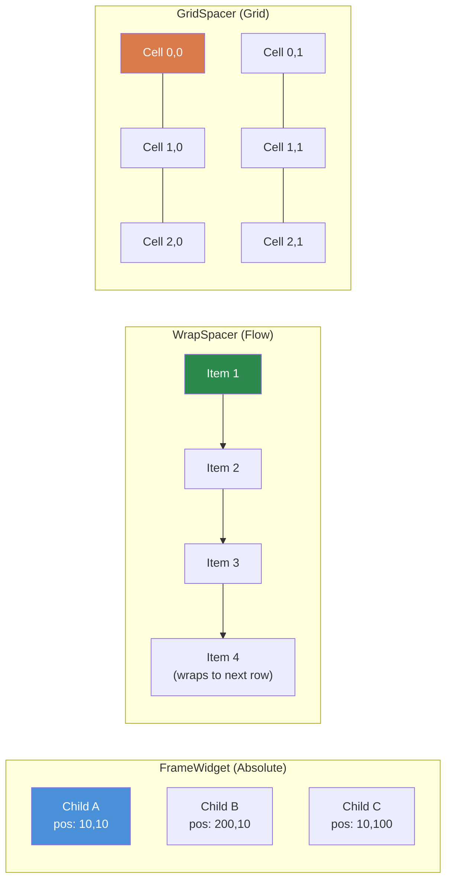
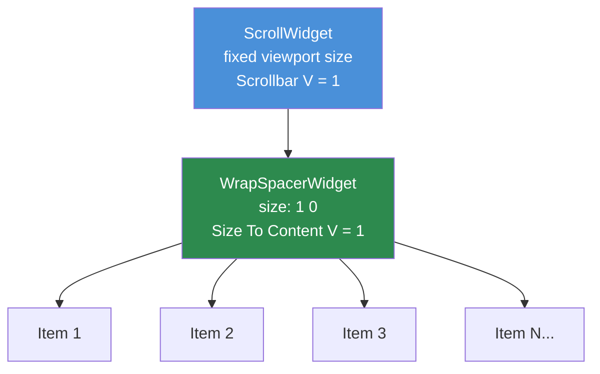

# Kapitola 3.4: Kontejnerové widgety

[Domů](../README.md) | [<< Předchozí: Rozměry a pozicování](03-sizing-positioning.md) | **Kontejnerové widgety** | [Další: Programatické vytváření widgetů >>](05-programmatic-widgets.md)

---

Kontejnerové widgety organizují potomkovské widgety uvnitř sebe. Zatímco `FrameWidget` je nejjednodušší (neviditelný box, ruční pozicování), DayZ poskytuje tři specializované kontejnery, které zpracovávají rozložení automaticky: `WrapSpacerWidget`, `GridSpacerWidget` a `ScrollWidget`.




---

## FrameWidget -- Strukturální kontejner

`FrameWidget` je nejzákladnější kontejner. Na obrazovku nic nevykresluje a nerozmisťuje své potomky -- každý potomek musíte pozicovat ručně.

**Kdy použít:**
- Seskupení souvisejících widgetů, aby mohly být zobrazeny/skryty dohromady
- Kořenový widget panelu nebo dialogu
- Jakékoli strukturální seskupení, kde pozicování řešíte sami

```
FrameWidgetClass MyPanel {
 size 0.5 0.5
 halign center_ref
 valign center_ref
 hexactpos 1
 vexactpos 1
 hexactsize 0
 vexactsize 0
 {
  TextWidgetClass Header {
   position 0 0
   size 1 0.1
   text "Panel Title"
   "text halign" center
  }
  PanelWidgetClass Divider {
   position 0 0.1
   size 1 2
   hexactsize 0
   vexactsize 1
   color 1 1 1 0.3
  }
  FrameWidgetClass Content {
   position 0 0.12
   size 1 0.88
  }
 }
}
```

**Klíčové vlastnosti:**
- Žádný vizuální vzhled (průhledný)
- Potomci pozicováni relativně k hranicím rámce
- Žádné automatické rozložení -- každý potomek potřebuje explicitní pozici/velikost
- Lehký -- nulové náklady na vykreslení nad rámec svých potomků

---

## WrapSpacerWidget -- Proudové rozložení

`WrapSpacerWidget` automaticky rozmisťuje své potomky v proudové sekvenci. Potomci jsou umísťováni jeden za druhým horizontálně a zalamují se na další řádek, když přesáhnou dostupnou šířku. Toto je widget, který použijete pro dynamické seznamy, kde se počet potomků mění za běhu.

### Atributy layoutu
| Atribut | Hodnoty | Popis |
|---|---|---|
| `Padding` | celé číslo (pixely) | Mezera mezi hranou spaceru a jeho potomky |
| `Margin` | celé číslo (pixely) | Mezera mezi jednotlivými potomky |
| `"Size To Content H"` | `0` nebo `1` | Přizpůsobit šířku všem potomkům |
| `"Size To Content V"` | `0` nebo `1` | Přizpůsobit výšku všem potomkům |
| `content_halign` | `left`, `center`, `right` | Horizontální zarovnání skupiny potomků |
| `content_valign` | `top`, `center`, `bottom` | Vertikální zarovnání skupiny potomků |

### Základní proudové rozložení

```
WrapSpacerWidgetClass TagList {
 size 1 0
 hexactsize 0
 "Size To Content V" 1
 Padding 5
 Margin 3
 {
  ButtonWidgetClass Tag1 {
   size 80 24
   hexactsize 1
   vexactsize 1
   text "Weapons"
  }
  ButtonWidgetClass Tag2 {
   size 60 24
   hexactsize 1
   vexactsize 1
   text "Food"
  }
  ButtonWidgetClass Tag3 {
   size 90 24
   hexactsize 1
   vexactsize 1
   text "Medical"
  }
 }
}
```

V tomto příkladu:
- Spacer má celou šířku rodiče (`size 1`), ale jeho výška se přizpůsobí potomkům (`"Size To Content V" 1`).
- Potomci jsou tlačítka široká 80px, 60px a 90px.
- Pokud dostupná šířka nepojme všechna tři na jeden řádek, spacer je zalomí na další řádek.
- `Padding 5` přidá 5px mezery uvnitř hran spaceru.
- `Margin 3` přidá 3px mezi každého potomka.

### Vertikální seznam s WrapSpacerem

Pro vytvoření vertikálního seznamu (jedna položka na řádek) nastavte potomkům plnou šířku:

```
WrapSpacerWidgetClass ItemList {
 size 1 0
 hexactsize 0
 "Size To Content V" 1
 Margin 2
 {
  FrameWidgetClass Item1 {
   size 1 30
   hexactsize 0
   vexactsize 1
  }
  FrameWidgetClass Item2 {
   size 1 30
   hexactsize 0
   vexactsize 1
  }
 }
}
```

Každý potomek má 100% šířku (`size 1` s `hexactsize 0`), takže se na řádek vejde pouze jeden, čímž vzniká vertikální sloupec.

### Dynamičtí potomci

`WrapSpacerWidget` je ideální pro programaticky přidávané potomky. Když přidáte nebo odeberete potomky, zavolejte `Update()` na spaceru pro vynucení přepočtu rozložení:

```c
WrapSpacerWidget spacer;

// Přidání potomka ze souboru layoutu
Widget child = GetGame().GetWorkspace().CreateWidgets("MyMod/gui/layouts/ListItem.layout", spacer);

// Vynucení přepočtu spaceru
spacer.Update();
```

---

## GridSpacerWidget -- Mřížkové rozložení

`GridSpacerWidget` rozmisťuje potomky v uniformní mřížce. Definujete počet sloupců a řádků a každá buňka dostane stejný prostor.

### Atributy layoutu

| Atribut | Hodnoty | Popis |
|---|---|---|
| `Columns` | celé číslo | Počet sloupců mřížky |
| `Rows` | celé číslo | Počet řádků mřížky |
| `Margin` | celé číslo (pixely) | Mezera mezi buňkami mřížky |
| `"Size To Content V"` | `0` nebo `1` | Přizpůsobit výšku obsahu |

### Základní mřížka

```
GridSpacerWidgetClass InventoryGrid {
 size 0.5 0.5
 hexactsize 0
 vexactsize 0
 Columns 4
 Rows 3
 Margin 2
 {
  // 12 buněk (4 sloupce x 3 řádky)
  // Potomci jsou umísťováni v pořadí: zleva doprava, shora dolů
  FrameWidgetClass Slot1 { }
  FrameWidgetClass Slot2 { }
  FrameWidgetClass Slot3 { }
  FrameWidgetClass Slot4 { }
  FrameWidgetClass Slot5 { }
  FrameWidgetClass Slot6 { }
  FrameWidgetClass Slot7 { }
  FrameWidgetClass Slot8 { }
  FrameWidgetClass Slot9 { }
  FrameWidgetClass Slot10 { }
  FrameWidgetClass Slot11 { }
  FrameWidgetClass Slot12 { }
 }
}
```

### Jednosloupcová mřížka (vertikální seznam)

Nastavení `Columns 1` vytvoří jednoduchý vertikální sloupec, kde každý potomek dostane celou šířku:

```
GridSpacerWidgetClass SettingsList {
 size 1 0
 hexactsize 0
 "Size To Content V" 1
 Columns 1
 {
  FrameWidgetClass Setting1 {
   size 150 30
   hexactsize 1
   vexactsize 1
  }
  FrameWidgetClass Setting2 {
   size 150 30
   hexactsize 1
   vexactsize 1
  }
  FrameWidgetClass Setting3 {
   size 150 30
   hexactsize 1
   vexactsize 1
  }
 }
}
```

### GridSpacer vs. WrapSpacer

| Vlastnost | GridSpacer | WrapSpacer |
|---|---|---|
| Velikost buňky | Uniformní (stejná) | Každý potomek si zachovává svou vlastní velikost |
| Režim rozložení | Pevná mřížka (sloupce x řádky) | Proud se zalamováním |
| Nejlepší pro | Inventářové sloty, uniformní galerie | Dynamické seznamy, oblaky štítků |
| Rozměry potomků | Ignorovány (mřížka je řídí) | Respektovány (velikost potomka záleží) |

---

## ScrollWidget -- Posuvný viewport

`ScrollWidget` obaluje obsah, který může být vyšší (nebo širší) než viditelná oblast, a poskytuje posuvníky pro navigaci.

### Atributy layoutu

| Atribut | Hodnoty | Popis |
|---|---|---|
| `"Scrollbar V"` | `0` nebo `1` | Zobrazit vertikální posuvník |
| `"Scrollbar H"` | `0` nebo `1` | Zobrazit horizontální posuvník |

### Skriptové API

```c
ScrollWidget sw;
sw.VScrollToPos(float pos);     // Posunutí na vertikální pozici (0 = nahoře)
sw.GetVScrollPos();             // Získání aktuální pozice posunu
sw.GetContentHeight();          // Získání celkové výšky obsahu
sw.VScrollStep(int step);       // Posunutí o krokovou hodnotu
```

### Základní posuvný seznam

```
ScrollWidgetClass ListScroll {
 size 1 300
 hexactsize 0
 vexactsize 1
 "Scrollbar V" 1
 {
  WrapSpacerWidgetClass ListContent {
   size 1 0
   hexactsize 0
   "Size To Content V" 1
   {
    // Mnoho potomků zde...
    FrameWidgetClass Item1 {
     size 1 30
     hexactsize 0
     vexactsize 1
    }
    FrameWidgetClass Item2 {
     size 1 30
     hexactsize 0
     vexactsize 1
    }
    // ... další položky
   }
  }
 }
}
```

---

## Vzor ScrollWidget + WrapSpacer



Toto je **ten** vzor pro posuvné dynamické seznamy v DayZ modech. Kombinuje `ScrollWidget` s pevnou výškou a `WrapSpacerWidget`, který roste, aby pojal své potomky.

```
// Posuvný viewport s pevnou výškou
ScrollWidgetClass DialogScroll {
 size 0.97 235
 hexactsize 0
 vexactsize 1
 "Scrollbar V" 1
 {
  // Obsah roste vertikálně, aby pojal všechny potomky
  WrapSpacerWidgetClass DialogContent {
   size 1 0
   hexactsize 0
   "Size To Content V" 1
  }
 }
}
```

Jak to funguje:

1. `ScrollWidget` má **pevnou** výšku (235 pixelů v tomto příkladu).
2. Uvnitř `WrapSpacerWidget` má `"Size To Content V" 1`, takže jeho výška roste s přidáváním potomků.
3. Když obsah spaceru přesáhne 235 pixelů, objeví se posuvník a uživatel může posouvat.

Tento vzor se objevuje v celém DabsFrameworku, DayZ Editoru, Expansion a prakticky v každém profesionálním DayZ modu.

### Programatické přidávání položek

```c
ScrollWidget m_Scroll;
WrapSpacerWidget m_Content;

void AddItem(string text)
{
    // Vytvoření nového potomka uvnitř WrapSpaceru
    Widget item = GetGame().GetWorkspace().CreateWidgets(
        "MyMod/gui/layouts/ListItem.layout", m_Content);

    // Konfigurace nové položky
    TextWidget tw = TextWidget.Cast(item.FindAnyWidget("Label"));
    tw.SetText(text);

    // Vynucení přepočtu rozložení
    m_Content.Update();
}

void ScrollToBottom()
{
    m_Scroll.VScrollToPos(m_Scroll.GetContentHeight());
}

void ClearAll()
{
    // Odstranění všech potomků
    Widget child = m_Content.GetChildren();
    while (child)
    {
        Widget next = child.GetSibling();
        child.Unlink();
        child = next;
    }
    m_Content.Update();
}
```

---

## Pravidla vnořování

Kontejnery lze vnořovat pro vytváření složitých rozložení. Některé pokyny:

1. **FrameWidget uvnitř čehokoli** -- Vždy funguje. Používejte rámce pro seskupení podsekcí uvnitř spacerů nebo mřížek.

2. **WrapSpacer uvnitř ScrollWidgetu** -- Standardní vzor pro posuvné seznamy. Spacer roste; scroll ořezává.

3. **GridSpacer uvnitř WrapSpaceru** -- Funguje. Užitečné pro umístění pevné mřížky jako jedné položky v proudovém rozložení.

4. **ScrollWidget uvnitř WrapSpaceru** -- Možné, ale vyžaduje pevnou výšku na scroll widgetu (`vexactsize 1`). Bez pevné výšky se scroll widget pokusí růst, aby pojal svůj obsah (čímž maří účel posouvání).

5. **Vyhněte se hlubokému vnořování** -- Každá úroveň vnořování přidává výpočetní náklady na rozložení. Tři nebo čtyři úrovně hluboko jsou typické pro složitá UI; překročení šesti úrovní naznačuje, že by rozložení mělo být přestrukturováno.

---

## Kdy použít který kontejner

| Scénář | Nejlepší kontejner |
|---|---|
| Statický panel s ručně pozicovanými prvky | `FrameWidget` |
| Dynamický seznam položek s různými velikostmi | `WrapSpacerWidget` |
| Uniformní mřížka (inventář, galerie) | `GridSpacerWidget` |
| Vertikální seznam s jednou položkou na řádek | `WrapSpacerWidget` (potomci na celou šířku) nebo `GridSpacerWidget` (`Columns 1`) |
| Obsah vyšší než dostupný prostor | `ScrollWidget` obalující spacer |
| Oblast obsahu záložek | `FrameWidget` (přepínání viditelnosti potomků) |
| Tlačítka panelu nástrojů | `WrapSpacerWidget` nebo `GridSpacerWidget` |

---

## Kompletní příklad: Posuvný panel nastavení

Panel nastavení s titulkovým pruhem, posuvnou oblastí obsahu obsahující mřížkově uspořádané volby a spodním pruhem tlačítek:

```
FrameWidgetClass SettingsPanel {
 size 0.4 0.6
 halign center_ref
 valign center_ref
 hexactpos 1
 vexactpos 1
 hexactsize 0
 vexactsize 0
 {
  // Titulkový pruh
  PanelWidgetClass TitleBar {
   position 0 0
   size 1 30
   hexactsize 0
   vexactsize 1
   color 0.2 0.4 0.8 1
  }

  // Posuvná oblast nastavení
  ScrollWidgetClass SettingsScroll {
   position 0 30
   size 1 0
   hexactpos 0
   vexactpos 1
   hexactsize 0
   vexactsize 0
   "Scrollbar V" 1
   {
    GridSpacerWidgetClass SettingsGrid {
     size 1 0
     hexactsize 0
     "Size To Content V" 1
     Columns 1
     Margin 2
    }
   }
  }

  // Pruh tlačítek dole
  FrameWidgetClass ButtonBar {
   size 1 40
   halign left_ref
   valign bottom_ref
   hexactpos 0
   vexactpos 1
   hexactsize 0
   vexactsize 1
  }
 }
}
```

---

## Osvědčené postupy

- Vždy volejte `Update()` na `WrapSpacerWidget` nebo `GridSpacerWidget` po programatickém přidání nebo odebrání potomků. Bez tohoto volání spacer nepřepočítá své rozložení a potomci se mohou překrývat nebo být neviditelní.
- Používejte `ScrollWidget` + `WrapSpacerWidget` jako standardní vzor pro jakýkoli dynamický seznam. Nastavte scroll na pevnou pixelovou výšku a vnitřní spacer na `"Size To Content V" 1`.
- Upřednostňujte `WrapSpacerWidget` s potomky na celou šířku před `GridSpacerWidget Columns 1` pro vertikální seznamy, kde položky mají různé výšky. GridSpacer vynucuje uniformní velikosti buněk.
- Vždy nastavte `clipchildren 1` na `ScrollWidget`. Bez toho se přetékající obsah vykresluje mimo hranice posuvného viewportu.
- Vyhněte se vnořování více než 4-5 úrovní kontejnerů hluboko. Každá úroveň přidává výpočetní náklady na rozložení a výrazně ztěžuje ladění.

---

## Teorie vs. praxe

> Co říká dokumentace versus jak věci skutečně fungují za běhu.

| Koncept | Teorie | Realita |
|---------|--------|---------|
| `WrapSpacerWidget.Update()` | Rozložení se automaticky přepočítá při změně potomků | Musíte ručně volat `Update()` po `CreateWidgets()` nebo `Unlink()`. Zapomenutí je nejčastější chybou spaceru |
| `"Size To Content V"` | Spacer roste, aby pojal potomky | Funguje pouze pokud mají potomci explicitní velikosti (pixelová výška nebo známý proporcionální rodič). Pokud jsou potomci také `Size To Content`, dostanete nulovou výšku |
| Rozměry buněk `GridSpacerWidget` | Mřížka řídí velikost buněk uniformně | Vlastní atributy velikosti potomků jsou ignorovány -- mřížka je přepíše. Nastavení `size` na potomka mřížky nemá žádný efekt |
| Pozice posunu `ScrollWidget` | `VScrollToPos(0)` posouvá nahoru | Po přidání potomků může být nutné odložit `VScrollToPos()` o jeden snímek (přes `CallLater`), protože výška obsahu ještě nebyla přepočítána |
| Vnořené spacery | Spacery se mohou volně vnořovat | `WrapSpacer` uvnitř `WrapSpacer` funguje, ale `Size To Content` na obou úrovních může způsobit nekonečné smyčky rozložení, které zamrazí UI |

---

## Kompatibilita a dopad

- **Více modů:** Kontejnerové widgety jsou per-layout a nekolidují mezi mody. Nicméně pokud dva mody vkládají potomky do stejného vanilla `ScrollWidget` (přes `modded class`), pořadí potomků je nepředvídatelné.
- **Výkon:** `WrapSpacerWidget.Update()` přepočítá pozice všech potomků. Pro seznamy se 100+ položkami volejte `Update()` jednou po dávkových operacích, ne po každém jednotlivém přidání. GridSpacer je rychlejší pro uniformní mřížky, protože pozice buněk se počítají aritmeticky.
- **Verze:** `WrapSpacerWidget` a `GridSpacerWidget` jsou dostupné od DayZ 1.0. Atributy `"Size To Content H/V"` byly přítomny od začátku, ale jejich chování s hluboce vnořenými rozloženími bylo stabilizováno kolem DayZ 1.10.

---

## Pozorováno v reálných modech

| Vzor | Mod | Detail |
|---------|-----|--------|
| `ScrollWidget` + `WrapSpacerWidget` pro dynamické seznamy | DabsFramework, Expansion, COT | Posuvný viewport s pevnou výškou a automaticky rostoucím vnitřním spacerem -- univerzální vzor posuvného seznamu |
| `GridSpacerWidget Columns 10` pro inventář | Vanilla DayZ | Inventářová mřížka používá GridSpacer s pevným počtem sloupců odpovídajícím rozložení slotů |
| Sdružení potomci ve WrapSpaceru | VPP Admin Tools | Předem vytváří pool widgetů položek seznamu, zobrazuje/skrývá je místo vytváření/ničení pro vyhnutí se režii `Update()` |
| `WrapSpacerWidget` jako kořen dialogu | COT, DayZ Editor | Kořen dialogu používá `Size To Content V/H`, takže dialog automaticky přizpůsobuje velikost kolem svého obsahu bez pevně daných rozměrů |

---

## Další kroky

- [3.5 Programatické vytváření widgetů](05-programmatic-widgets.md) -- Vytváření widgetů z kódu
- [3.6 Zpracování událostí](06-event-handling.md) -- Reagování na kliknutí, změny a další události
