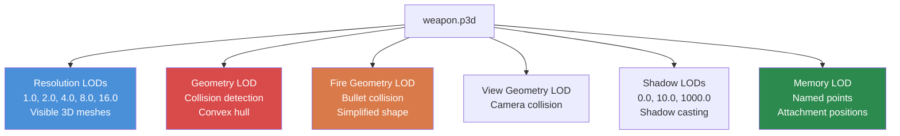

# Kapitola 4.2: 3D modely (.p3d)

[Domů](../README.md) | [<< Předchozí: Textury](01-textures.md) | **3D modely** | [Další: Materiály >>](03-materials.md)

---

## Úvod

Každý fyzický objekt v DayZ -- zbraně, oblečení, budovy, vozidla, stromy, kameny -- je 3D model uložený v proprietárním formátu **P3D** společnosti Bohemia. Formát P3D je daleko více než jen kontejner meshe: kóduje více úrovní detailu, kolizní geometrii, animační selekce, paměťové body pro příslušenství a efekty a proxy pozice pro připojitelné předměty. Pochopení fungování souborů P3D a jak je vytvářet pomocí **Object Builderu** je nezbytné pro jakýkoli mod, který přidává fyzické předměty do herního světa.

Tato kapitola pokrývá strukturu formátu P3D, systém LOD, pojmenované selekce, paměťové body, systém proxy, konfiguraci animací přes `model.cfg` a pracovní postup importu ze standardních 3D formátů.

---

## Obsah

- [Přehled formátu P3D](#přehled-formátu-p3d)
- [Object Builder](#object-builder)
- [Systém LOD](#systém-lod)
- [Pojmenované selekce](#pojmenované-selekce)
- [Paměťové body](#paměťové-body)
- [Systém proxy](#systém-proxy)
- [Model.cfg pro animace](#modelcfg-pro-animace)
- [Import z FBX/OBJ](#import-z-fbxobj)
- [Běžné typy modelů](#běžné-typy-modelů)
- [Časté chyby](#časté-chyby)
- [Osvědčené postupy](#osvědčené-postupy)

---

## Přehled formátu P3D

**P3D** (Point 3D) je binární formát 3D modelů společnosti Bohemia Interactive, zděděný z enginu Real Virtuality a přenesený do Enfusion. Je to kompilovaný, pro engine připravený formát -- soubory P3D nepíšete ručně.

### Klíčové vlastnosti

- **Binární formát:** Není čitelný člověkem. Vytvářen a upravován výhradně pomocí Object Builderu.
- **Multi-LOD kontejner:** Jeden soubor P3D obsahuje více LOD (úrovní detailu) meshí, každý s jiným účelem.
- **Nativní pro engine:** DayZ engine načítá P3D přímo. Nedochází k žádné runtime konverzi.
- **Binarizovaný vs. nebinarizovaný:** Zdrojové soubory P3D z Object Builderu jsou "MLOD" (editovatelné). Binarize je převádí na "ODOL" (optimalizované, pouze pro čtení). Hra může načíst obojí, ale ODOL se načítá rychleji a je menší.

### Typy souborů, se kterými se setkáte

| Přípona | Popis |
|-----------|-------------|
| `.p3d` | 3D model (jak MLOD zdrojový, tak ODOL binarizovaný) |
| `.rtm` | Runtime Motion -- data keyframů animací |
| `.bisurf` | Soubor vlastností povrchu (používaný společně s P3D) |

### MLOD vs. ODOL

| Vlastnost | MLOD (zdrojový) | ODOL (binarizovaný) |
|----------|---------------|-------------------|
| Vytvořen | Object Builder | Binarize |
| Editovatelný | Ano | Ne |
| Velikost souboru | Větší | Menší |
| Rychlost načítání | Pomalejší | Rychlejší |
| Používán během | Vývoje | Vydání |
| Obsahuje | Plná editační data, pojmenované selekce | Optimalizovaná data meshe |

> **Důležité:** Když balíte PBO s povolenou binarizací, vaše MLOD P3D soubory jsou automaticky převedeny na ODOL. Pokud balíte s `-packonly`, MLOD soubory jsou zahrnuty tak, jak jsou. Obojí funguje ve hře, ale pro produkční sestavení je preferován ODOL.

---

## Object Builder

**Object Builder** je nástroj poskytovaný Bohemií pro vytváření a úpravu modelů P3D. Je součástí sady DayZ Tools na Steamu.

### Základní schopnosti

- Vytváření a úprava 3D meshí s vrcholy, hranami a plochami.
- Definování více LOD v rámci jednoho souboru P3D.
- Přiřazování **pojmenovaných selekcí** (skupin vrcholů/ploch) pro animace a řízení textur.
- Umisťování **paměťových bodů** pro pozice příslušenství, počátky částic a zdroje zvuku.
- Přidávání **proxy objektů** pro připojitelné předměty (zásobníky, optiku atd.).
- Přiřazování materiálů (`.rvmat`) a textur (`.paa`) plochám.
- Import meshí z formátů FBX, OBJ a 3DS.
- Export validovaných souborů P3D pro Binarize.

### Nastavení pracovního prostoru

Object Builder vyžaduje nastavení **disku P:** (workdrive). Tento virtuální disk poskytuje sjednocený prefix cest, který engine používá k lokalizaci assets.

```
P:\
  DZ\                        <-- Vanilla data DayZ (extrahovaná)
  DayZ Tools\                <-- Instalace nástrojů
  MyMod\                     <-- Zdrojový adresář vašeho modu
    data\
      models\
        my_item.p3d
      textures\
        my_item_co.paa
```

Všechny cesty v souborech P3D a materiálech jsou relativní ke kořeni disku P:. Například odkaz na materiál uvnitř modelu by byl `MyMod\data\textures\my_item_co.paa`.

### Základní pracovní postup v Object Builderu

1. **Vytvořte nebo importujte** vaši geometrii meshe.
2. **Definujte LOD** -- minimálně vytvořte LOD Resolution, Geometry a Fire Geometry.
3. **Přiřaďte materiály** plochám v Resolution LOD.
4. **Pojmenujte selekce** pro jakékoli části, které se animují, mění textury nebo potřebují interakci z kódu.
5. **Umístěte paměťové body** pro příslušenství, pozice záblesku ústí, vyhazovací otvory atd.
6. **Přidejte proxy** pro předměty, které lze připojit (optika, zásobníky, tlumiče).
7. **Validujte** pomocí vestavěné validace Object Builderu (Structure --> Validate).
8. **Uložte** jako P3D.
9. **Sestavte** přes Binarize nebo AddonBuilder.

---

## Systém LOD

Soubor P3D obsahuje více **LOD** (úrovní detailu), každý sloužící specifickému účelu. Engine vybírá, který LOD použít, na základě situace -- vzdálenost od kamery, fyzikální výpočty, vykreslování stínů atd.

### Typy LOD

| LOD | Hodnota rozlišení | Účel |
|-----|-----------------|---------|
| **Resolution 0** | 1.000 | Vizuální mesh s nejvyšším detailem. Vykresluje se, když je objekt blízko kamery. |
| **Resolution 1** | 1.100 | Střední detail. Vykresluje se ve střední vzdálenosti. |
| **Resolution 2** | 1.200 | Nízký detail. Vykresluje se ve velké vzdálenosti. |
| **Resolution 3+** | 1.300+ | Další LOD pro vzdálenost. |
| **View Geometry** | Speciální | Určuje, co blokuje pohled hráče (první osoba). Zjednodušený mesh. |
| **Fire Geometry** | Speciální | Kolize pro kulky a projektily. Musí být konvexní nebo složená z konvexních částí. |
| **Geometry** | Speciální | Fyzikální kolize. Používá se pro kolize pohybu, gravitaci, umístění. Musí být konvexní nebo složená z konvexní dekompozice. |
| **Shadow 0** | Speciální | Mesh pro vrhání stínů (blízký dosah). |
| **Shadow 1000** | Speciální | Mesh pro vrhání stínů (velký dosah). Jednodušší než Shadow 0. |
| **Memory** | Speciální | Obsahuje pouze pojmenované body (žádná viditelná geometrie). Používá se pro pozice příslušenství, počátky zvuku atd. |
| **Roadway** | Speciální | Definuje pochozí povrchy na objektech (vozidla, budovy s přístupnými interiéry). |
| **Paths** | Speciální | Nápovědy pro pathfinding AI pro budovy. |

### Hodnoty rozlišení LOD (vizuální LOD)



Engine používá vzorec založený na vzdálenosti a velikosti objektu k určení, který vizuální LOD vykreslovat:

```
Vybraný LOD = (vzdálenost_k_objektu * LOD_faktor) / poloměr_ohraničující_koule_objektu
```

Nižší hodnoty = bližší kamera. Engine najde LOD, jehož hodnota rozlišení je nejbližší shodou s vypočtenou hodnotou.

### Vytváření LOD v Object Builderu

1. **File --> New LOD** nebo klikněte pravým na seznam LOD.
2. Vyberte typ LOD z rozbalovacího seznamu.
3. Pro vizuální LOD (Resolution) zadejte hodnotu rozlišení.
4. Modelujte geometrii pro daný LOD.

### Požadavky LOD podle typu předmětu

| Typ předmětu | Povinné LOD | Doporučené další LOD |
|-----------|---------------|----------------------------|
| **Ruční předmět** | Resolution 0, Geometry, Fire Geometry, Memory | Shadow 0, Resolution 1 |
| **Oblečení** | Resolution 0, Geometry, Fire Geometry, Memory | Shadow 0, Resolution 1, Resolution 2 |
| **Zbraň** | Resolution 0, Geometry, Fire Geometry, View Geometry, Memory | Shadow 0, Resolution 1, Resolution 2 |
| **Budova** | Resolution 0, Geometry, Fire Geometry, View Geometry, Memory | Shadow 0, Shadow 1000, Roadway, Paths |
| **Vozidlo** | Resolution 0, Geometry, Fire Geometry, View Geometry, Memory | Shadow 0, Roadway, Resolution 1+ |

### Pravidla Geometry LOD

Geometry a Fire Geometry LOD mají přísné požadavky:

- **Musí být konvexní** nebo složené z více konvexních komponent. Fyzikální systém enginu vyžaduje konvexní kolizní tvary.
- **Pojmenované selekce musí odpovídat** těm v Resolution LOD (pro animované části).
- **Hmotnost musí být definována.** Vyberte všechny vrcholy v Geometry LOD a přiřaďte hmotnost přes **Structure --> Mass**. To určuje fyzickou váhu objektu.
- **Udržujte to jednoduché.** Méně trojúhelníků = lepší fyzikální výkon. Geometry LOD zbraně může mít 20-50 trojúhelníků oproti tisícům ve vizuálním LOD.

---

## Pojmenované selekce

Pojmenované selekce jsou skupiny vrcholů, hran nebo ploch v rámci LOD, které jsou označeny názvem. Slouží jako rukojetě, které engine a skripty používají k manipulaci s částmi modelu.

### Co pojmenované selekce dělají

| Účel | Příklad názvu selekce | Používáno |
|---------|----------------------|---------|
| **Animace** | `bolt`, `trigger`, `magazine` | Zdroje animací `model.cfg` |
| **Výměna textur** | `camo`, `camo1`, `body` | `hiddenSelections[]` v config.cpp |
| **Textury poškození** | `zbytek` | Systém poškození enginu, výměny materiálů |
| **Body příslušenství** | `magazine`, `optics`, `suppressor` | Systém proxy a příslušenství |

### hiddenSelections (výměna textur)

Nejběžnější použití pojmenovaných selekcí pro moddery je **hiddenSelections** -- schopnost zaměňovat textury za běhu přes config.cpp.

**V P3D modelu (Resolution LOD):**
1. Vyberte plochy, které by měly být retexturovatelné.
2. Pojmenujte selekci (např. `camo`).

**V config.cpp:**
```cpp
class MyRifle: Rifle_Base
{
    hiddenSelections[] = {"camo"};
    hiddenSelectionsTextures[] = {"MyMod\data\my_rifle_co.paa"};
    hiddenSelectionsMaterials[] = {"MyMod\data\my_rifle.rvmat"};
};
```

To umožňuje různé varianty stejného modelu s různými texturami bez duplikace souboru P3D.

### Vytváření pojmenovaných selekcí

V Object Builderu:

1. Vyberte vrcholy nebo plochy, které chcete seskupit.
2. Přejděte na **Structure --> Named Selections** (nebo stiskněte Ctrl+N).
3. Klikněte na **New**, zadejte název selekce.
4. Klikněte na **Assign** pro označení vybrané geometrie tímto názvem.

> **Tip:** Názvy selekcí rozlišují velká a malá písmena. `Camo` a `camo` jsou různé selekce. Konvence je používat malá písmena.

### Selekce napříč LOD

Pojmenované selekce musí být konzistentní napříč LOD, aby animace fungovaly:

- Pokud selekce `bolt` existuje v Resolution 0, musí také existovat v LOD Geometry a Fire Geometry (pokrývající odpovídající kolizní geometrii).
- Shadow LOD by měly také mít selekci, pokud má animovaná část vrhat správné stíny.

---

## Paměťové body

Paměťové body jsou pojmenované pozice definované v **Memory LOD**. Ve hře nemají vizuální reprezentaci -- definují prostorové souřadnice, které engine a skripty odkazují pro pozicování efektů, příslušenství, zvuků a dalšího.

### Běžné paměťové body

| Název bodu | Účel |
|------------|---------|
| `usti hlavne` | Pozice ústí (kde vznikají kulky, objevuje se záblesk ústí) |
| `konec hlavne` | Konec hlavně (použitý s `usti hlavne` pro definici směru hlavně) |
| `nabojnicestart` | Začátek vyhazovacího otvoru (kde vylétávají nábojnice) |
| `nabojniceend` | Konec vyhazovacího otvoru (směr vyhazování) |
| `handguard` | Bod příslušenství předpažbí |
| `magazine` | Pozice zásobníkové šachty |
| `optics` | Pozice lišty optiky |
| `suppressor` | Pozice montáže tlumiče |
| `trigger` | Pozice spouště (pro IK ruky) |
| `pistolgrip` | Pozice pistolové rukojeti (pro IK ruky) |
| `lefthand` | Pozice úchopu levou rukou |
| `righthand` | Pozice úchopu pravou rukou |
| `eye` | Pozice oka (pro zarovnání pohledu první osoby) |
| `pilot` | Pozice sedadla řidiče/pilota (vozidla) |
| `light_l` / `light_r` | Pozice levého/pravého světlometu (vozidla) |

### Směrové paměťové body

Mnoho efektů potřebuje jak pozici, tak směr. To je dosaženo párovými paměťovými body:

```
usti hlavne  ------>  konec hlavne
(začátek ústí)        (konec ústí)

Směrový vektor je: konec hlavne - usti hlavne
```

### Vytváření paměťových bodů v Object Builderu

1. Přepněte na **Memory LOD** v seznamu LOD.
2. Vytvořte vrchol na požadované pozici.
3. Pojmenujte ho přes **Structure --> Named Selections**: vytvořte selekci s názvem bodu a přiřaďte k ní jeden vrchol.

> **Poznámka:** Memory LOD by měl obsahovat POUZE pojmenované body (jednotlivé vrcholy). Nevytvářejte plochy ani hrany v Memory LOD.

---

## Systém proxy

Proxy definují pozice, kde mohou být připojeny jiné modely P3D. Když vidíte zásobník vložený ve zbrani, optiku namontovanou na liště nebo tlumič přišroubovaný na hlavni -- to jsou proxy-připojené modely.

### Jak proxy fungují

Proxy je speciální odkaz umístěný v Resolution LOD, který ukazuje na jiný soubor P3D. Engine vykresluje model odkazovaný proxy na pozici a orientaci proxy.

### Konvence pojmenování proxy

Názvy proxy sledují vzor: `proxy:\cesta\k\modelu.p3d`

Pro proxy příslušenství na zbraních jsou standardní názvy:

| Cesta proxy | Typ příslušenství |
|------------|----------------|
| `proxy:\dz\weapons\attachments\magazine\mag_placeholder.p3d` | Slot zásobníku |
| `proxy:\dz\weapons\attachments\optics\optic_placeholder.p3d` | Lišta optiky |
| `proxy:\dz\weapons\attachments\suppressor\sup_placeholder.p3d` | Montáž tlumiče |
| `proxy:\dz\weapons\attachments\handguard\handguard_placeholder.p3d` | Slot předpažbí |
| `proxy:\dz\weapons\attachments\stock\stock_placeholder.p3d` | Slot pažby |

### Přidávání proxy v Object Builderu

1. V Resolution LOD umístěte 3D kurzor tam, kde se má příslušenství objevit.
2. Přejděte na **Structure --> Proxy --> Create**.
3. Zadejte cestu proxy (např. `dz\weapons\attachments\magazine\mag_placeholder.p3d`).
4. Proxy se objeví jako malá šipka indikující pozici a orientaci.
5. Otočte a umístěte proxy tak, aby správně odpovídala geometrii příslušenství.

---

## Model.cfg pro animace

Soubor `model.cfg` definuje animace pro modely P3D. Mapuje zdroje animací (řízené herní logikou) na transformace pojmenovaných selekcí.

### Základní struktura

```cpp
class CfgModels
{
    class Default
    {
        sectionsInherit = "";
        sections[] = {};
        skeletonName = "";
    };

    class MyRifle: Default
    {
        skeletonName = "MyRifle_skeleton";
        sections[] = {"camo"};

        class Animations
        {
            class bolt_move
            {
                type = "translation";
                source = "reload";        // Zdroj animace enginu
                selection = "bolt";       // Pojmenovaná selekce v P3D
                axis = "bolt_axis";       // Pár paměťových bodů osy
                memory = 1;               // Osa definovaná v Memory LOD
                minValue = 0;
                maxValue = 1;
                offset0 = 0;
                offset1 = 0.05;           // Translace 5cm
            };

            class trigger_move
            {
                type = "rotation";
                source = "trigger";
                selection = "trigger";
                axis = "trigger_axis";
                memory = 1;
                minValue = 0;
                maxValue = 1;
                angle0 = 0;
                angle1 = -0.4;            // Radiány
            };
        };
    };
};

class CfgSkeletons
{
    class Default
    {
        isDiscrete = 0;
        skeletonInherit = "";
        skeletonBones[] = {};
    };

    class MyRifle_skeleton: Default
    {
        skeletonBones[] =
        {
            "bolt", "",          // "název_kosti", "rodičovská_kost" ("" = kořen)
            "trigger", "",
            "magazine", ""
        };
    };
};
```

### Typy animací

| Typ | Klíčové slovo | Pohyb | Řízeno |
|------|---------|----------|---------------|
| **Translace** | `translation` | Lineární pohyb podél osy | `offset0` / `offset1` (metry) |
| **Rotace** | `rotation` | Rotace kolem osy | `angle0` / `angle1` (radiány) |
| **RotaceX/Y/Z** | `rotationX` | Rotace kolem pevné světové osy | `angle0` / `angle1` |
| **Skrytí** | `hide` | Zobrazení/skrytí selekce | Práh `hideValue` |

### Zdroje animací

Zdroje animací jsou hodnoty poskytované enginem, které řídí animace:

| Zdroj | Rozsah | Popis |
|--------|-------|-------------|
| `reload` | 0-1 | Fáze přebíjení zbraně |
| `trigger` | 0-1 | Stisk spouště |
| `zeroing` | 0-N | Nastavení nástřelu zbraně |
| `isFlipped` | 0-1 | Stav překlápění mířidla |
| `door` | 0-1 | Otevření/zavření dveří |
| `rpm` | 0-N | Otáčky motoru vozidla |
| `speed` | 0-N | Rychlost vozidla |
| `fuel` | 0-1 | Úroveň paliva vozidla |
| `damper` | 0-1 | Odpružení vozidla |

---

## Import z FBX/OBJ

Většina modderů vytváří 3D modely v externích nástrojích (Blender, 3ds Max, Maya) a importuje je do Object Builderu.

### Podporované importní formáty

| Formát | Přípona | Poznámky |
|--------|-----------|-------|
| **FBX** | `.fbx` | Nejlepší kompatibilita. Exportujte jako FBX 2013 nebo novější (binární). |
| **OBJ** | `.obj` | Wavefront OBJ. Pouze jednoduchá data meshe (žádné animace). |
| **3DS** | `.3ds` | Starší formát 3ds Max. Omezen na 65K vrcholů na mesh. |

### Pracovní postup importu

**Krok 1: Příprava ve vašem 3D softwaru**
- Model by měl být vycentrován v počátku.
- Aplikujte všechny transformace (poloha, rotace, měřítko).
- Měřítko: 1 jednotka = 1 metr. DayZ používá metry.
- Triangulujte mesh (Object Builder pracuje s trojúhelníky).
- UV rozbalte model.
- Exportujte jako FBX (binární, bez animace, Y-up nebo Z-up -- Object Builder zvládne obojí).

**Krok 2: Import do Object Builderu**
1. Otevřete Object Builder.
2. **File --> Import --> FBX** (nebo OBJ/3DS).
3. Zkontrolujte nastavení importu:
   - Faktor měřítka (měl by být 1.0, pokud je váš zdroj v metrech).
   - Konverze os (Z-up na Y-up pokud je potřeba).
4. Mesh se objeví v novém Resolution LOD.

**Krok 3: Nastavení po importu**
1. Přiřaďte materiály plochám (vyberte plochy, klikněte pravým --> **Face Properties**).
2. Vytvořte další LOD (Geometry, Fire Geometry, Memory, Shadow).
3. Zjednodušte geometrii pro kolizní LOD (odstraňte malé detaily, zajistěte konvexnost).
4. Přidejte pojmenované selekce, paměťové body a proxy.
5. Validujte a uložte.

### Tipy specifické pro Blender

- Použijte komunitní addon **Blender DayZ Toolbox**, pokud je dostupný -- zjednodušuje nastavení exportu.
- Exportujte s: **Apply Modifiers**, **Triangulate Faces**, **Apply Scale**.
- Nastavte **Forward: -Z Forward**, **Up: Y Up** v dialogu exportu FBX.
- Pojmenujte mesh objekty v Blenderu tak, aby odpovídaly zamýšleným pojmenovaným selekcím -- některé importéry zachovávají názvy objektů.

---

## Běžné typy modelů

### Zbraně

Zbraně jsou nejsložitější modely P3D, vyžadující:
- Resolution LOD s vysokým počtem polygonů (5 000-20 000 trojúhelníků)
- Více pojmenovaných selekcí (bolt, trigger, magazine, camo atd.)
- Kompletní sadu paměťových bodů (ústí, vyhazování, pozice úchopu)
- Více proxy (zásobník, optika, tlumič, předpažbí, pažba)
- Skeleton a animace v model.cfg
- View Geometry pro zablokování pohledu v první osobě

### Oblečení

Modely oblečení jsou rigovány na skeleton postavy:
- Resolution LOD sleduje strukturu kostí postavy
- Pojmenované selekce pro varianty textur (`camo`, `camo1`)
- Jednodušší kolizní geometrie
- Bez proxy (obvykle)
- hiddenSelections pro barevné/kamuflážní varianty

### Budovy

Budovy mají unikátní požadavky:
- Velké, detailní Resolution LOD
- Roadway LOD pro pochozí povrchy (podlahy, schodiště)
- Paths LOD pro navigaci AI
- View Geometry pro zabránění průhledu zdmi
- Více Shadow LOD pro výkon na různých vzdálenostech
- Pojmenované selekce pro dveře a okna, která se otevírají

### Vozidla

Vozidla kombinují mnoho systémů:
- Detailní Resolution LOD s animovanými částmi (kola, dveře, kapota)
- Složitý skeleton s mnoha kostmi
- Roadway LOD pro pasažéry stojící v korbách nákladních aut
- Paměťové body pro světla, výfuk, pozici řidiče, sedadla spolujezdců
- Více proxy pro příslušenství (kola, dveře)

---

## Časté chyby

### 1. Chybějící Geometry LOD

**Příznak:** Objekt nemá kolizi. Hráči a kulky jím procházejí.
**Oprava:** Vytvořte Geometry LOD se zjednodušeným konvexním meshem. Přiřaďte hmotnost vrcholům.

### 2. Nekonvexní kolizní tvary

**Příznak:** Fyzikální závady, objekty se nepředvídatelně odrážejí, předměty propadávají povrchy.
**Oprava:** Rozdělte složité tvary na více konvexních komponent v Geometry LOD. Každá komponenta musí být uzavřený konvexní solid.

### 3. Nekonzistentní pojmenované selekce

**Příznak:** Animace fungují pouze vizuálně, ale ne pro kolizi, nebo stín se neanimuje.
**Oprava:** Zajistěte, aby každá pojmenovaná selekce, která existuje v Resolution LOD, existovala také v LOD Geometry, Fire Geometry a Shadow.

### 4. Špatné měřítko

**Příznak:** Objekt je ve hře obrovský nebo mikroskopický.
**Oprava:** Ověřte, že váš 3D software používá metry jako jednotku. Postava DayZ je přibližně 1,8 metru vysoká.

### 5. Chybějící paměťové body

**Příznak:** Záblesk ústí se objevuje na špatné pozici, příslušenství se vznáší v prostoru.
**Oprava:** Vytvořte Memory LOD a přidejte všechny povinné pojmenované body na správné pozice.

### 6. Nedefinovaná hmotnost

**Příznak:** Objekt nelze zvednout nebo se fyzikální interakce chová podivně.
**Oprava:** Vyberte všechny vrcholy v Geometry LOD a přiřaďte hmotnost přes **Structure --> Mass**.

---

## Osvědčené postupy

1. **Začněte s Geometry LOD.** Nejdříve vytvořte blokový kolizní tvar, pak na něm budujte vizuální detail. To předchází běžné chybě vytvoření krásného modelu, který nemůže správně kolidovat.

2. **Používejte referenční modely.** Extrahujte vanilla soubory P3D z herních dat a studujte je v Object Builderu. Ukazují přesně, co engine očekává pro každý typ předmětu.

3. **Validujte často.** Používejte **Structure --> Validate** Object Builderu po každé významné změně. Opravte varování dříve, než se stanou záhadnými chybami ve hře.

4. **Udržujte počty trojúhelníků LOD proporcionální.** Resolution 0 může mít 10 000 trojúhelníků; Resolution 1 by měl mít ~5 000; Geometry by měla mít ~100-500. Dramatické snížení na každé úrovni.

5. **Pojmenovávejte selekce popisně.** Používejte `bolt_carrier` místo `sel01`. Vaše budoucí já (a ostatní moddeři) vám poděkují.

6. **Testujte nejdříve s file patchingem.** Načtěte svůj nebinarizovaný P3D přes režim file patching před zaváděním do plného PBO sestavení. To zachytí většinu problémů rychleji.

7. **Dokumentujte paměťové body.** Udržujte referenční obrázek nebo textový soubor se seznamem všech paměťových bodů a jejich zamýšlených pozic. Složité zbraně mohou mít 20+ bodů.

---

## Pozorováno v reálných modech

| Vzor | Mod | Detail |
|---------|-----|--------|
| Kompletní řetězec LOD s 5+ úrovněmi rozlišení | DayZ-Samples (Test_Weapon) | Ukazuje kompletní hierarchii LOD: Resolution 1.0 až 16.0, plus Geometry, Fire Geometry, Memory, Shadow |
| Složité skeletony s 20+ kostmi | Expansion Vehicles | Modely helikoptér a lodí používají rozsáhlé hierarchie kostí pro dveře, rotory, kormidla a střelecké věžičky |
| Vrstvení proxy pro modulární zbraně | Dabs Framework (zbraně RFCP) | Zbraně používají více proxy slotů pro příslušenství na lištu, umožňující kombinace optika + laser + rukojeť |

---

## Kompatibilita a dopad

- **Více modů:** Dva mody mohou bezpečně odkazovat na různé modely P3D bez konfliktu. Konflikty vznikají pouze tehdy, když se oba mody pokusí o `modded class` stejné entity a změní její cestu `model` v config.cpp.
- **Výkon:** Každý viditelný P3D přidává draw calls úměrné počtu jeho materiálů. Modely s 10+ materiály na LOD mohou být nákladné ve scénách s mnoha instancemi. Udržujte počet materiálů pod 4 na vizuální LOD, kdy je to možné.
- **Verze:** Formát P3D (MLOD/ODOL) zůstal stabilní napříč aktualizacemi DayZ. Object Builder příležitostně dostává drobné aktualizace přes DayZ Tools, ale samotný formát se nezměnil od DayZ 1.0.

---

## Navigace

| Předchozí | Nahoru | Další |
|----------|----|------|
| [4.1 Textury](01-textures.md) | [Část 4: Formáty souborů a DayZ Tools](01-textures.md) | [4.3 Materiály](03-materials.md) |
