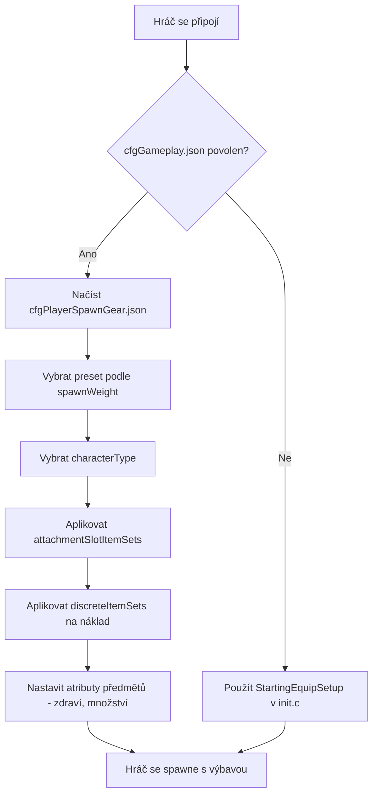

# Kapitola 5.6: Konfigurace výbavy při spawnu

[Domů](../README.md) | [<< Předchozí: Konfigurační soubory serveru](05-server-configs.md) | **Konfigurace výbavy při spawnu**

---

> **Shrnutí:** DayZ má dva doplňující se systémy, které řídí, jak hráči vstupují do světa: **body spawnu** určují, *kde* se postava objeví na mapě, a **výbava při spawnu** určuje, *jakou výbavu* nese. Tato kapitola podrobně pokrývá oba systémy včetně struktury souborů, referenční příručky polí, praktických presetů a integrace s mody.

---

## Obsah

- [Přehled](#overview)
- [Dva systémy](#the-two-systems)
- [Výbava při spawnu: cfgPlayerSpawnGear.json](#spawn-gear-cfgplayerspawngearjson)
  - [Povolení presetů výbavy při spawnu](#enabling-spawn-gear-presets)
  - [Struktura presetu](#preset-structure)
  - [attachmentSlotItemSets](#attachmentslotitemsets)
  - [DiscreteItemSets](#discreteitemsets)
  - [discreteUnsortedItemSets](#discreteunsorteditemsets)
  - [ComplexChildrenTypes](#complexchildrentypes)
  - [SimpleChildrenTypes](#simplechildrentypes)
  - [Attributes](#attributes)
- [Body spawnu: cfgplayerspawnpoints.xml](#spawn-points-cfgplayerspawnpointsxml)
  - [Struktura souboru](#file-structure)
  - [spawn_params](#spawn_params)
  - [generator_params](#generator_params)
  - [Skupiny spawnů](#spawning-groups)
  - [Konfigurace specifické pro mapy](#map-specific-configs)
- [Praktické příklady](#practical-examples)
  - [Výchozí loadout přeživšího](#default-survivor-loadout)
  - [Vojenský spawn kit](#military-spawn-kit)
  - [Zdravotnický spawn kit](#medical-spawn-kit)
  - [Náhodný výběr výbavy](#random-gear-selection)
- [Integrace s mody](#integration-with-mods)
- [Doporučené postupy](#best-practices)
- [Časté chyby](#common-mistakes)

---

## Přehled



Když se hráč spawne jako nová postava v DayZ, server odpovídá na dvě otázky:

1. **Kde se postava objeví?** --- Řízeno souborem `cfgplayerspawnpoints.xml`.
2. **Co postava nese?** --- Řízeno JSON soubory presetů výbavy při spawnu, registrovanými přes `cfggameplay.json`.

Oba systémy jsou pouze na straně serveru. Klienti tyto konfigurační soubory nikdy nevidí a nemohou s nimi manipulovat. Systém výbavy při spawnu byl zaveden jako alternativa ke skriptování loadoutů v `init.c`, umožňující správcům serverů definovat více vážených presetů v JSON bez psaní jakéhokoliv kódu v Enforce Scriptu.

> **Důležité:** Systém presetů výbavy při spawnu **zcela přepisuje** metodu `StartingEquipSetup()` ve vašem `init.c` mise. Pokud povolíte presety výbavy při spawnu v `cfggameplay.json`, váš skriptovaný kód loadoutu bude ignorován. Stejně tak typy postav definované v presetech přepíší model postavy zvolený v hlavním menu.

---

## Dva systémy

| Systém | Soubor | Formát | Řídí |
|--------|------|--------|----------|
| Body spawnu | `cfgplayerspawnpoints.xml` | XML | **Kde** --- pozice na mapě, bodování vzdálenosti, skupiny spawnů |
| Výbava při spawnu | Vlastní JSON soubory presetů | JSON | **Co** --- model postavy, oblečení, zbraně, náklad, quickbar |

Oba systémy jsou nezávislé. Můžete používat vlastní body spawnu s vanilla výbavou, vlastní výbavu s vanilla body spawnu, nebo si přizpůsobit obojí.

---

## Výbava při spawnu: cfgPlayerSpawnGear.json

### Povolení presetů výbavy při spawnu

Presety výbavy při spawnu **nejsou** povoleny ve výchozím nastavení. Pro jejich použití musíte:

1. Vytvořit jeden nebo více JSON souborů presetů ve složce mise (např. `mpmissions/dayzOffline.chernarusplus/`).
2. Zaregistrovat je v `cfggameplay.json` pod `PlayerData.spawnGearPresetFiles`.
3. Zajistit, aby v `serverDZ.cfg` bylo nastaveno `enableCfgGameplayFile = 1`.

```json
{
  "version": 122,
  "PlayerData": {
    "spawnGearPresetFiles": [
      "survivalist.json",
      "casual.json",
      "military.json"
    ]
  }
}
```

Soubory presetů mohou být vnořeny v podadresářích ve složce mise:

```json
"spawnGearPresetFiles": [
  "custom/survivalist.json",
  "custom/casual.json",
  "custom/military.json"
]
```

Každý JSON soubor obsahuje jeden objekt presetu. Všechny registrované presety jsou sdruženy dohromady a server vybírá jeden na základě `spawnWeight` pokaždé, když se spawne nová postava.

### Struktura presetu

Preset je JSON objekt nejvyšší úrovně s těmito poli:

| Pole | Typ | Popis |
|-------|------|-------------|
| `name` | string | Lidsky čitelný název presetu (libovolný řetězec, pouze pro identifikaci) |
| `spawnWeight` | integer | Váha pro náhodný výběr. Minimum je `1`. Vyšší hodnoty činí tento preset pravděpodobnějším |
| `characterTypes` | array | Pole classnames typů postav (např. `"SurvivorM_Mirek"`). Jeden je vybrán náhodně při spawnu tohoto presetu |
| `attachmentSlotItemSets` | array | Pole struktur `AttachmentSlots` definujících, co postava nosí (oblečení, zbraně na ramenou atd.) |
| `discreteUnsortedItemSets` | array | Pole struktur `DiscreteUnsortedItemSets` definujících předměty nákladu umístěné do jakéhokoliv dostupného místa v inventáři |

> **Poznámka:** Pokud je `characterTypes` prázdné nebo vynechané, bude pro tento preset použit model postavy naposledy zvolený na obrazovce vytváření postav v hlavním menu.

Minimální příklad:

```json
{
  "spawnWeight": 1,
  "name": "Basic Survivor",
  "characterTypes": [
    "SurvivorM_Mirek",
    "SurvivorF_Eva"
  ],
  "attachmentSlotItemSets": [],
  "discreteUnsortedItemSets": []
}
```

### attachmentSlotItemSets

Toto pole definuje předměty, které jdou do specifických slotů příslušenství postavy --- tělo, nohy, nohy, hlava, záda, vesta, ramena, brýle atd.

Každá položka cílí na jeden slot:

| Pole | Typ | Popis |
|-------|------|-------------|
| `slotName` | string | Název slotu příslušenství. Odvozen z CfgSlots. Běžné hodnoty: `"Body"`, `"Legs"`, `"Feet"`, `"Head"`, `"Back"`, `"Vest"`, `"Eyewear"`, `"Gloves"`, `"Hips"`, `"shoulderL"`, `"shoulderR"` |
| `discreteItemSets` | array | Pole variant předmětů, které mohou tento slot vyplnit (jeden je vybrán na základě `spawnWeight`) |

> **Zkratky ramen:** Můžete použít `"shoulderL"` a `"shoulderR"` jako názvy slotů. Engine je automaticky přeloží na správné interní názvy CfgSlots.

```json
{
  "slotName": "Body",
  "discreteItemSets": [
    {
      "itemType": "TShirt_Beige",
      "spawnWeight": 1,
      "attributes": {
        "healthMin": 0.45,
        "healthMax": 0.65,
        "quantityMin": 1.0,
        "quantityMax": 1.0
      },
      "quickBarSlot": -1
    },
    {
      "itemType": "TShirt_Black",
      "spawnWeight": 1,
      "attributes": {
        "healthMin": 0.45,
        "healthMax": 0.65,
        "quantityMin": 1.0,
        "quantityMax": 1.0
      },
      "quickBarSlot": -1
    }
  ]
}
```

### DiscreteItemSets

Každá položka v `discreteItemSets` představuje jeden možný předmět pro daný slot. Server vybere jednu položku náhodně, váženě podle `spawnWeight`. Tato struktura se používá uvnitř `attachmentSlotItemSets` (pro předměty ve slotech) a je mechanismem pro náhodný výběr.

| Pole | Typ | Popis |
|-------|------|-------------|
| `itemType` | string | Classname předmětu (typename). Použijte `""` (prázdný řetězec) pro reprezentaci "ničeho" --- slot zůstane prázdný |
| `spawnWeight` | integer | Váha pro výběr. Minimum `1`. Vyšší = pravděpodobnější |
| `attributes` | object | Rozsahy zdraví a množství pro tento předmět. Viz [Attributes](#attributes) |
| `quickBarSlot` | integer | Přiřazení slotu quickbaru (od 0). Použijte `-1` pro žádné přiřazení quickbaru |
| `complexChildrenTypes` | array | Předměty ke spawnu vnořené uvnitř tohoto předmětu. Viz [ComplexChildrenTypes](#complexchildrentypes) |
| `simpleChildrenTypes` | array | Classnames předmětů ke spawnu uvnitř tohoto předmětu s výchozími nebo rodičovskými atributy |
| `simpleChildrenUseDefaultAttributes` | bool | Pokud `true`, jednoduché potomky používají `attributes` rodiče. Pokud `false`, používají konfigurační výchozí hodnoty |

**Trik s prázdným předmětem:** Pro 50/50 šanci, že bude slot prázdný nebo vyplněný, použijte prázdný `itemType`:

```json
{
  "slotName": "Eyewear",
  "discreteItemSets": [
    {
      "itemType": "AviatorGlasses",
      "spawnWeight": 1,
      "attributes": {
        "healthMin": 1.0,
        "healthMax": 1.0
      },
      "quickBarSlot": -1
    },
    {
      "itemType": "",
      "spawnWeight": 1
    }
  ]
}
```

### discreteUnsortedItemSets

Toto pole nejvyšší úrovně definuje předměty, které jdou do **nákladu** postavy --- jakékoliv dostupné místo v inventáři ve veškerém připojeném oblečení a kontejnerech. Na rozdíl od `attachmentSlotItemSets` tyto předměty nejsou umísťovány do specifického slotu; engine automaticky najde místo.

Každá položka představuje jednu variantu nákladu a server ji vybírá na základě `spawnWeight`.

| Pole | Typ | Popis |
|-------|------|-------------|
| `name` | string | Lidsky čitelný název (pouze pro identifikaci) |
| `spawnWeight` | integer | Váha pro výběr. Minimum `1` |
| `attributes` | object | Výchozí rozsahy zdraví/množství. Používány potomky, když je `simpleChildrenUseDefaultAttributes` `true` |
| `complexChildrenTypes` | array | Předměty ke spawnu do nákladu, každý s vlastními atributy a vnořením |
| `simpleChildrenTypes` | array | Classnames předmětů ke spawnu do nákladu |
| `simpleChildrenUseDefaultAttributes` | bool | Pokud `true`, jednoduché potomky používají `attributes` této struktury. Pokud `false`, používají konfigurační výchozí hodnoty |

```json
{
  "name": "Cargo1",
  "spawnWeight": 1,
  "attributes": {
    "healthMin": 1.0,
    "healthMax": 1.0,
    "quantityMin": 1.0,
    "quantityMax": 1.0
  },
  "complexChildrenTypes": [
    {
      "itemType": "BandageDressing",
      "attributes": {
        "healthMin": 1.0,
        "healthMax": 1.0,
        "quantityMin": 1.0,
        "quantityMax": 1.0
      },
      "quickBarSlot": 2
    }
  ],
  "simpleChildrenUseDefaultAttributes": false,
  "simpleChildrenTypes": [
    "Rag",
    "Apple"
  ]
}
```

### ComplexChildrenTypes

Komplexní potomci jsou předměty spawnované **uvnitř** rodičovského předmětu s plnou kontrolou nad jejich atributy, přiřazením quickbaru a vlastními vnořenými potomky. Hlavní případ použití je spawning předmětů s obsahem --- například zbraň s příslušenstvím nebo hrnec s jídlem uvnitř.

| Pole | Typ | Popis |
|-------|------|-------------|
| `itemType` | string | Classname předmětu |
| `attributes` | object | Rozsahy zdraví/množství pro tento konkrétní předmět |
| `quickBarSlot` | integer | Přiřazení slotu quickbaru. `-1` = nepřiřazovat |
| `simpleChildrenUseDefaultAttributes` | bool | Zda jednoduché potomky dědí tyto atributy |
| `simpleChildrenTypes` | array | Classnames předmětů ke spawnu uvnitř tohoto předmětu |

Příklad --- zbraň s příslušenstvím a zásobníkem:

```json
{
  "itemType": "AKM",
  "attributes": {
    "healthMin": 0.5,
    "healthMax": 1.0,
    "quantityMin": 1.0,
    "quantityMax": 1.0
  },
  "quickBarSlot": 1,
  "complexChildrenTypes": [
    {
      "itemType": "AK_PlasticBttstck",
      "attributes": {
        "healthMin": 0.4,
        "healthMax": 0.6
      },
      "quickBarSlot": -1
    },
    {
      "itemType": "PSO1Optic",
      "attributes": {
        "healthMin": 0.1,
        "healthMax": 0.2
      },
      "quickBarSlot": -1,
      "simpleChildrenUseDefaultAttributes": true,
      "simpleChildrenTypes": [
        "Battery9V"
      ]
    },
    {
      "itemType": "Mag_AKM_30Rnd",
      "attributes": {
        "healthMin": 0.5,
        "healthMax": 0.5,
        "quantityMin": 1.0,
        "quantityMax": 1.0
      },
      "quickBarSlot": -1
    }
  ],
  "simpleChildrenUseDefaultAttributes": false,
  "simpleChildrenTypes": [
    "AK_PlasticHndgrd",
    "AK_Bayonet"
  ]
}
```

V tomto příkladu se AKM spawne s pažbou, optikou (s baterií uvnitř) a nabitým zásobníkem jako komplexní potomci, plus předpažbí a bajonet jako jednoduché potomky. Jednoduché potomky používají konfigurační výchozí hodnoty, protože `simpleChildrenUseDefaultAttributes` je `false`.

### SimpleChildrenTypes

Jednoduché potomky jsou zkratkou pro spawning předmětů uvnitř rodiče bez specifikace individuálních atributů. Jsou to pole classnames předmětů (řetězce).

Jejich atributy jsou určeny příznakem `simpleChildrenUseDefaultAttributes`:

- **`true`** --- Předměty používají `attributes` definované na rodičovské struktuře.
- **`false`** --- Předměty používají konfigurační výchozí hodnoty enginu (typicky plné zdraví a množství).

Jednoduché potomky nemohou mít vlastní vnořené potomky ani přiřazení quickbaru. Pro tyto schopnosti použijte místo toho `complexChildrenTypes`.

### Attributes

Atributy řídí stav a množství spawnovaných předmětů. Všechny hodnoty jsou čísla s plovoucí desetinnou čárkou mezi `0.0` a `1.0`:

| Pole | Typ | Popis |
|-------|------|-------------|
| `healthMin` | float | Minimální procento zdraví. `1.0` = nedotčený, `0.0` = zničený |
| `healthMax` | float | Maximální procento zdraví. Náhodná hodnota mezi min a max je aplikována |
| `quantityMin` | float | Minimální procento množství. Pro zásobníky: úroveň naplnění. Pro jídlo: zbývající kousky |
| `quantityMax` | float | Maximální procento množství |

Když jsou specifikovány jak min, tak max, engine vybere náhodnou hodnotu v daném rozsahu. To vytváří přirozenou variaci --- například zdraví mezi `0.45` a `0.65` znamená, že se předměty spawnou v opotřebeném až poškozeném stavu.

```json
"attributes": {
  "healthMin": 0.45,
  "healthMax": 0.65,
  "quantityMin": 1.0,
  "quantityMax": 1.0
}
```

---

## Body spawnu: cfgplayerspawnpoints.xml

Tento XML soubor definuje, kde se hráči objeví na mapě. Nachází se ve složce mise (např. `mpmissions/dayzOffline.chernarusplus/cfgplayerspawnpoints.xml`).

### Struktura souboru

Kořenový element obsahuje až tři sekce:

| Sekce | Účel |
|---------|---------|
| `<fresh>` | **Povinná.** Body spawnu pro nově vytvořené postavy |
| `<hop>` | Body spawnu pro hráče přeskakující z jiného serveru na stejné mapě (pouze oficiální servery) |
| `<travel>` | Body spawnu pro hráče cestující z jiné mapy (pouze oficiální servery) |

Každá sekce obsahuje stejné tři podelementy: `<spawn_params>`, `<generator_params>` a `<generator_posbubbles>`.

```xml
<?xml version="1.0" encoding="UTF-8" standalone="yes" ?>
<playerspawnpoints>
    <fresh>
        <spawn_params>...</spawn_params>
        <generator_params>...</generator_params>
        <generator_posbubbles>...</generator_posbubbles>
    </fresh>
    <hop>
        <spawn_params>...</spawn_params>
        <generator_params>...</generator_params>
        <generator_posbubbles>...</generator_posbubbles>
    </hop>
    <travel>
        <spawn_params>...</spawn_params>
        <generator_params>...</generator_params>
        <generator_posbubbles>...</generator_posbubbles>
    </travel>
</playerspawnpoints>
```

### spawn_params

Parametry za běhu, které hodnotí kandidátní body spawnu vzhledem k blízkým entitám. Body pod `min_dist` jsou zneplatněny. Body mezi `min_dist` a `max_dist` jsou preferovány před body za `max_dist`.

```xml
<spawn_params>
    <min_dist_infected>30</min_dist_infected>
    <max_dist_infected>70</max_dist_infected>
    <min_dist_player>65</min_dist_player>
    <max_dist_player>150</max_dist_player>
    <min_dist_static>0</min_dist_static>
    <max_dist_static>2</max_dist_static>
</spawn_params>
```

| Parametr | Popis |
|-----------|-------------|
| `min_dist_infected` | Minimální metry od infikovaných. Body blíže než toto jsou penalizovány |
| `max_dist_infected` | Maximální bodovací vzdálenost od infikovaných |
| `min_dist_player` | Minimální metry od ostatních hráčů. Zabraňuje, aby se čerstvé spawny objevily na existujících hráčích |
| `max_dist_player` | Maximální bodovací vzdálenost od ostatních hráčů |
| `min_dist_static` | Minimální metry od budov/objektů |
| `max_dist_static` | Maximální bodovací vzdálenost od budov/objektů |

Mapa Sakhal také přidává parametry `min_dist_trigger` a `max_dist_trigger` se 6x násobkem váhy pro vzdálenosti triggerových zón.

**Logika bodování:** Engine vypočítá skóre pro každý kandidátní bod. Vzdálenost `0` až `min_dist` hodnotí `-1` (téměř zneplatněno). Vzdálenost `min_dist` až střed hodnotí až `1.1`. Vzdálenost střed až `max_dist` klesá z `1.1` na `0.1`. Za `max_dist` hodnotí `0`. Vyšší celkové skóre = pravděpodobnější místo spawnu.

### generator_params

Řídí, jak se generuje mřížka kandidátních bodů spawnu kolem každé pozice:

```xml
<generator_params>
    <grid_density>4</grid_density>
    <grid_width>200</grid_width>
    <grid_height>200</grid_height>
    <min_dist_static>0</min_dist_static>
    <max_dist_static>2</max_dist_static>
    <min_steepness>-45</min_steepness>
    <max_steepness>45</max_steepness>
</generator_params>
```

| Parametr | Popis |
|-----------|-------------|
| `grid_density` | Frekvence vzorkování. `4` znamená mřížku 4x4 kandidátních bodů. Vyšší = více kandidátů, vyšší náklady na CPU. Musí být alespoň `1`. Při `0` se použije pouze středový bod |
| `grid_width` | Celková šířka vzorkovacího obdélníku v metrech |
| `grid_height` | Celková výška vzorkovacího obdélníku v metrech |
| `min_dist_static` | Minimální vzdálenost od budov pro platný kandidátní bod |
| `max_dist_static` | Maximální vzdálenost od budov použitá pro bodování |
| `min_steepness` | Minimální sklon terénu ve stupních. Body na strmějším terénu jsou vyřazeny |
| `max_steepness` | Maximální sklon terénu ve stupních |

Kolem každé `<pos>` definované v `generator_posbubbles` engine vytvoří obdélník o rozměrech `grid_width` x `grid_height` metrů, vzorkuje ho s frekvencí `grid_density` a vyřadí body, které se překrývají s objekty, vodou nebo překračují limity sklonu.

### Skupiny spawnů

Skupiny umožňují seskupit body spawnu a rotovat je v průběhu času. To zabraňuje tomu, aby se všichni hráči vždy spawnovali na stejných místech.

Skupiny se povolují přes `<group_params>` uvnitř každé sekce:

```xml
<group_params>
    <enablegroups>true</enablegroups>
    <groups_as_regular>true</groups_as_regular>
    <lifetime>240</lifetime>
    <counter>-1</counter>
</group_params>
```

| Parametr | Popis |
|-----------|-------------|
| `enablegroups` | `true` pro povolení rotace skupin, `false` pro plochý seznam bodů |
| `groups_as_regular` | Když je `enablegroups` `false`, zacházet s body skupin jako s běžnými body spawnu místo jejich ignorování. Výchozí: `true` |
| `lifetime` | Sekundy, po které skupina zůstává aktivní před rotací na jinou. Použijte `-1` pro vypnutí časovače |
| `counter` | Počet spawnů, které resetují životnost. Každý hráč spawnující se ve skupině resetuje časovač. Použijte `-1` pro vypnutí počítadla |

Pozice jsou organizovány do pojmenovaných skupin uvnitř `<generator_posbubbles>`:

```xml
<generator_posbubbles>
    <group name="WestCherno">
        <pos x="6063.018555" z="1931.907227" />
        <pos x="5933.964844" z="2171.072998" />
        <pos x="6199.782715" z="2241.805176" />
    </group>
    <group name="EastCherno">
        <pos x="8040.858398" z="3332.236328" />
        <pos x="8207.115234" z="3115.650635" />
    </group>
</generator_posbubbles>
```

Jednotlivé skupiny mohou přepsat globální hodnoty lifetime a counter:

```xml
<group name="Tents" lifetime="300" counter="25">
    <pos x="4212.421875" z="11038.256836" />
</group>
```

**Bez skupin** se pozice uvádějí přímo pod `<generator_posbubbles>`:

```xml
<generator_posbubbles>
    <pos x="4212.421875" z="11038.256836" />
    <pos x="4712.299805" z="10595" />
    <pos x="5334.310059" z="9850.320313" />
</generator_posbubbles>
```

> **Formát pozic:** Atributy `x` a `z` používají souřadnice světa DayZ. `x` je východ-západ, `z` je sever-jih. Souřadnice `y` (výška) se neuvádí --- engine umístí bod na povrch terénu. Souřadnice můžete zjistit pomocí herního debug monitoru nebo modu DayZ Editor.

### Konfigurace specifické pro mapy

Každá mapa má svůj vlastní `cfgplayerspawnpoints.xml` ve složce mise:

| Mapa | Složka mise | Poznámky |
|-----|----------------|-------|
| Chernarus | `dayzOffline.chernarusplus/` | Pobřežní spawny: Cherno, Elektro, Kamyshovo, Berezino, Svetlojarsk |
| Livonia | `dayzOffline.enoch/` | Rozprostřeny po mapě s různými názvy skupin |
| Sakhal | `dayzOffline.sakhal/` | Přidány parametry `min_dist_trigger`/`max_dist_trigger`, podrobnější komentáře |

Při vytváření vlastní mapy nebo úpravě míst spawnu vždy začněte od vanilla souboru a upravte pozice tak, aby odpovídaly geografii vaší mapy.

---

## Praktické příklady

### Výchozí loadout přeživšího

Vanilla preset dává čerstvým spawnům náhodné tričko, plátěné kalhoty, sportovní boty, plus náklad obsahující obvaz, chemlight (náhodná barva) a ovoce (náhodně hruška, švestka nebo jablko). Všechny předměty se spawnují v opotřebeném až poškozeném stavu.

```json
{
  "spawnWeight": 1,
  "name": "Player",
  "characterTypes": [
    "SurvivorM_Mirek",
    "SurvivorM_Boris",
    "SurvivorM_Denis",
    "SurvivorF_Eva",
    "SurvivorF_Frida",
    "SurvivorF_Gabi"
  ],
  "attachmentSlotItemSets": [
    {
      "slotName": "Body",
      "discreteItemSets": [
        {
          "itemType": "TShirt_Beige",
          "spawnWeight": 1,
          "attributes": {
            "healthMin": 0.45,
            "healthMax": 0.65,
            "quantityMin": 1.0,
            "quantityMax": 1.0
          },
          "quickBarSlot": -1
        },
        {
          "itemType": "TShirt_Black",
          "spawnWeight": 1,
          "attributes": {
            "healthMin": 0.45,
            "healthMax": 0.65,
            "quantityMin": 1.0,
            "quantityMax": 1.0
          },
          "quickBarSlot": -1
        }
      ]
    },
    {
      "slotName": "Legs",
      "discreteItemSets": [
        {
          "itemType": "CanvasPantsMidi_Beige",
          "spawnWeight": 1,
          "attributes": {
            "healthMin": 0.45,
            "healthMax": 0.65,
            "quantityMin": 1.0,
            "quantityMax": 1.0
          },
          "quickBarSlot": -1
        }
      ]
    },
    {
      "slotName": "Feet",
      "discreteItemSets": [
        {
          "itemType": "AthleticShoes_Black",
          "spawnWeight": 1,
          "attributes": {
            "healthMin": 0.45,
            "healthMax": 0.65,
            "quantityMin": 1.0,
            "quantityMax": 1.0
          },
          "quickBarSlot": -1
        }
      ]
    }
  ],
  "discreteUnsortedItemSets": [
    {
      "name": "Cargo1",
      "spawnWeight": 1,
      "attributes": {
        "healthMin": 1.0,
        "healthMax": 1.0,
        "quantityMin": 1.0,
        "quantityMax": 1.0
      },
      "complexChildrenTypes": [
        {
          "itemType": "BandageDressing",
          "attributes": {
            "healthMin": 1.0,
            "healthMax": 1.0,
            "quantityMin": 1.0,
            "quantityMax": 1.0
          },
          "quickBarSlot": 2
        },
        {
          "itemType": "Chemlight_Red",
          "attributes": {
            "healthMin": 1.0,
            "healthMax": 1.0,
            "quantityMin": 1.0,
            "quantityMax": 1.0
          },
          "quickBarSlot": 1
        },
        {
          "itemType": "Pear",
          "attributes": {
            "healthMin": 1.0,
            "healthMax": 1.0,
            "quantityMin": 1.0,
            "quantityMax": 1.0
          },
          "quickBarSlot": 3
        }
      ]
    }
  ]
}
```

### Vojenský spawn kit

Těžce vybavený preset s AKM (s příslušenstvím), plate carrierem, gorka uniformou, batohem s extra zásobníky a nesetříděným nákladem včetně pistole a jídla. Tento preset používá různé hodnoty `spawnWeight` pro vytvoření úrovní vzácnosti variant zbraní.

```json
{
  "spawnWeight": 1,
  "name": "Military - AKM",
  "characterTypes": [
    "SurvivorF_Judy",
    "SurvivorM_Lewis"
  ],
  "attachmentSlotItemSets": [
    {
      "slotName": "shoulderL",
      "discreteItemSets": [
        {
          "itemType": "AKM",
          "spawnWeight": 3,
          "attributes": {
            "healthMin": 0.5,
            "healthMax": 1.0,
            "quantityMin": 1.0,
            "quantityMax": 1.0
          },
          "quickBarSlot": 1,
          "complexChildrenTypes": [
            {
              "itemType": "AK_PlasticBttstck",
              "attributes": { "healthMin": 0.4, "healthMax": 0.6 },
              "quickBarSlot": -1
            },
            {
              "itemType": "PSO1Optic",
              "attributes": { "healthMin": 0.1, "healthMax": 0.2 },
              "quickBarSlot": -1,
              "simpleChildrenUseDefaultAttributes": true,
              "simpleChildrenTypes": ["Battery9V"]
            },
            {
              "itemType": "Mag_AKM_30Rnd",
              "attributes": {
                "healthMin": 0.5,
                "healthMax": 0.5,
                "quantityMin": 1.0,
                "quantityMax": 1.0
              },
              "quickBarSlot": -1
            }
          ],
          "simpleChildrenUseDefaultAttributes": false,
          "simpleChildrenTypes": ["AK_PlasticHndgrd", "AK_Bayonet"]
        },
        {
          "itemType": "AKM",
          "spawnWeight": 1,
          "attributes": {
            "healthMin": 1.0,
            "healthMax": 1.0,
            "quantityMin": 1.0,
            "quantityMax": 1.0
          },
          "quickBarSlot": 1,
          "complexChildrenTypes": [
            {
              "itemType": "AK_WoodBttstck",
              "attributes": { "healthMin": 1.0, "healthMax": 1.0 },
              "quickBarSlot": -1
            },
            {
              "itemType": "Mag_AKM_30Rnd",
              "attributes": {
                "healthMin": 1.0,
                "healthMax": 1.0,
                "quantityMin": 1.0,
                "quantityMax": 1.0
              },
              "quickBarSlot": -1
            }
          ],
          "simpleChildrenUseDefaultAttributes": false,
          "simpleChildrenTypes": ["AK_WoodHndgrd"]
        }
      ]
    },
    {
      "slotName": "Vest",
      "discreteItemSets": [
        {
          "itemType": "PlateCarrierVest",
          "spawnWeight": 1,
          "attributes": { "healthMin": 1.0, "healthMax": 1.0 },
          "quickBarSlot": -1,
          "simpleChildrenUseDefaultAttributes": false,
          "simpleChildrenTypes": ["PlateCarrierHolster"]
        }
      ]
    },
    {
      "slotName": "Back",
      "discreteItemSets": [
        {
          "itemType": "TaloonBag_Blue",
          "spawnWeight": 1,
          "attributes": { "healthMin": 0.5, "healthMax": 0.8 },
          "quickBarSlot": 3,
          "simpleChildrenUseDefaultAttributes": false,
          "simpleChildrenTypes": ["Mag_AKM_Drum75Rnd"]
        },
        {
          "itemType": "TaloonBag_Orange",
          "spawnWeight": 1,
          "attributes": { "healthMin": 0.5, "healthMax": 0.8 },
          "quickBarSlot": 3,
          "simpleChildrenUseDefaultAttributes": true,
          "simpleChildrenTypes": ["Mag_AKM_30Rnd", "Mag_AKM_30Rnd"]
        }
      ]
    },
    {
      "slotName": "Body",
      "discreteItemSets": [
        {
          "itemType": "GorkaEJacket_Flat",
          "spawnWeight": 1,
          "attributes": { "healthMin": 1.0, "healthMax": 1.0 },
          "quickBarSlot": -1
        }
      ]
    },
    {
      "slotName": "Legs",
      "discreteItemSets": [
        {
          "itemType": "GorkaPants_Flat",
          "spawnWeight": 1,
          "attributes": { "healthMin": 1.0, "healthMax": 1.0 },
          "quickBarSlot": -1
        }
      ]
    },
    {
      "slotName": "Feet",
      "discreteItemSets": [
        {
          "itemType": "MilitaryBoots_Bluerock",
          "spawnWeight": 1,
          "attributes": { "healthMin": 1.0, "healthMax": 1.0 },
          "quickBarSlot": -1
        }
      ]
    }
  ],
  "discreteUnsortedItemSets": [
    {
      "name": "Military Cargo",
      "spawnWeight": 1,
      "attributes": {
        "healthMin": 0.5,
        "healthMax": 1.0,
        "quantityMin": 0.6,
        "quantityMax": 0.8
      },
      "complexChildrenTypes": [
        {
          "itemType": "Mag_AKM_30Rnd",
          "attributes": {
            "healthMin": 0.1,
            "healthMax": 0.8,
            "quantityMin": 1.0,
            "quantityMax": 1.0
          },
          "quickBarSlot": -1
        }
      ],
      "simpleChildrenUseDefaultAttributes": false,
      "simpleChildrenTypes": [
        "Rag",
        "BoarSteakMeat",
        "FNX45",
        "Mag_FNX45_15Rnd",
        "AmmoBox_45ACP_25rnd"
      ]
    }
  ]
}
```

Klíčové body tohoto příkladu:

- **Dvě varianty zbraní** pro stejný slot ramene: varianta s `spawnWeight: 3` (plastové díly, optika PSO1) se spawnuje 3x častěji než varianta s `spawnWeight: 1` (dřevěné díly, bez optiky).
- **Vnořené potomky**: PSO1Optic má `simpleChildrenTypes: ["Battery9V"]`, takže se optika spawnuje s baterií uvnitř.
- **Obsah batohu**: modrý batoh dostane bubnový zásobník, zatímco oranžový dostane dva standardní zásobníky.

### Zdravotnický spawn kit

Preset s tématem zdravotníka se scrubs, lékárničkou obsahující zdravotnické zásoby a zbraní na blízko pro obranu.

```json
{
  "spawnWeight": 1,
  "name": "Medic",
  "attachmentSlotItemSets": [
    {
      "slotName": "shoulderR",
      "discreteItemSets": [
        {
          "itemType": "PipeWrench",
          "spawnWeight": 2,
          "attributes": { "healthMin": 0.5, "healthMax": 0.8 },
          "quickBarSlot": 2
        },
        {
          "itemType": "Crowbar",
          "spawnWeight": 1,
          "attributes": { "healthMin": 0.5, "healthMax": 0.8 },
          "quickBarSlot": 2
        }
      ]
    },
    {
      "slotName": "Vest",
      "discreteItemSets": [
        {
          "itemType": "PressVest_LightBlue",
          "spawnWeight": 1,
          "attributes": { "healthMin": 1.0, "healthMax": 1.0 },
          "quickBarSlot": -1
        }
      ]
    },
    {
      "slotName": "Back",
      "discreteItemSets": [
        {
          "itemType": "TortillaBag",
          "spawnWeight": 1,
          "attributes": { "healthMin": 0.5, "healthMax": 0.8 },
          "quickBarSlot": 1
        },
        {
          "itemType": "CoyoteBag_Green",
          "spawnWeight": 1,
          "attributes": { "healthMin": 0.5, "healthMax": 0.8 },
          "quickBarSlot": 1
        }
      ]
    },
    {
      "slotName": "Body",
      "discreteItemSets": [
        {
          "itemType": "MedicalScrubsShirt_Blue",
          "spawnWeight": 1,
          "attributes": { "healthMin": 1.0, "healthMax": 1.0 },
          "quickBarSlot": -1
        }
      ]
    },
    {
      "slotName": "Legs",
      "discreteItemSets": [
        {
          "itemType": "MedicalScrubsPants_Blue",
          "spawnWeight": 1,
          "attributes": { "healthMin": 1.0, "healthMax": 1.0 },
          "quickBarSlot": -1
        }
      ]
    },
    {
      "slotName": "Feet",
      "discreteItemSets": [
        {
          "itemType": "WorkingBoots_Yellow",
          "spawnWeight": 1,
          "attributes": { "healthMin": 1.0, "healthMax": 1.0 },
          "quickBarSlot": -1
        }
      ]
    }
  ],
  "discreteUnsortedItemSets": [
    {
      "name": "Medic Cargo 1",
      "spawnWeight": 1,
      "attributes": {
        "healthMin": 0.5,
        "healthMax": 1.0,
        "quantityMin": 0.6,
        "quantityMax": 0.8
      },
      "complexChildrenTypes": [
        {
          "itemType": "FirstAidKit",
          "attributes": {
            "healthMin": 0.7,
            "healthMax": 0.8,
            "quantityMin": 0.05,
            "quantityMax": 0.1
          },
          "quickBarSlot": 3,
          "simpleChildrenUseDefaultAttributes": false,
          "simpleChildrenTypes": ["BloodBagIV", "BandageDressing"]
        }
      ],
      "simpleChildrenUseDefaultAttributes": false,
      "simpleChildrenTypes": ["Rag", "SheepSteakMeat"]
    },
    {
      "name": "Medic Cargo 2",
      "spawnWeight": 1,
      "attributes": {
        "healthMin": 0.5,
        "healthMax": 1.0,
        "quantityMin": 0.6,
        "quantityMax": 0.8
      },
      "complexChildrenTypes": [
        {
          "itemType": "FirstAidKit",
          "attributes": {
            "healthMin": 0.7,
            "healthMax": 0.8,
            "quantityMin": 0.05,
            "quantityMax": 0.1
          },
          "quickBarSlot": 3,
          "simpleChildrenUseDefaultAttributes": false,
          "simpleChildrenTypes": ["TetracyclineAntibiotics", "BandageDressing"]
        }
      ],
      "simpleChildrenUseDefaultAttributes": false,
      "simpleChildrenTypes": ["Canteen", "Rag", "Apple"]
    }
  ]
}
```

Všimněte si, že `characterTypes` je vynecháno --- tento preset používá postavu, kterou si hráč vybral v hlavním menu. Dvě varianty nákladu nabízejí různý obsah lékárničky (krevní vak vs. antibiotika), vybrané podle `spawnWeight`.

### Náhodný výběr výbavy

Můžete vytvářet náhodné loadouty pomocí více presetů s různými váhami, a v rámci každého presetu používáním více `discreteItemSets` na slot:

**Soubor: `cfggameplay.json`**

```json
"spawnGearPresetFiles": [
  "presets/common_survivor.json",
  "presets/rare_military.json",
  "presets/uncommon_hunter.json"
]
```

**Příklad výpočtu pravděpodobnosti:**

| Soubor presetu | spawnWeight | Šance |
|-------------|------------|--------|
| `common_survivor.json` | 5 | 5/8 = 62,5 % |
| `uncommon_hunter.json` | 2 | 2/8 = 25,0 % |
| `rare_military.json` | 1 | 1/8 = 12,5 % |

V rámci každého presetu má každý slot také svou vlastní randomizaci. Pokud má slot Body tři varianty triček s `spawnWeight: 1` každý, každý má 33% šanci. Tričko s `spawnWeight: 3` v poolu se dvěma předměty `spawnWeight: 1` by mělo 60% šanci (3/5).

---

## Integrace s mody

### Použití systému JSON presetů z modů

Systém presetů výbavy při spawnu je navržen pro konfiguraci na úrovni mise. Mody, které chtějí poskytovat vlastní loadouty, by měly:

1. **Dodávat šablonový JSON** soubor s dokumentací modu, nikoliv vložený v PBO.
2. **Dokumentovat classnames**, aby správci serverů mohli přidávat předměty modů do svých vlastních souborů presetů.
3. Nechat správce serverů zaregistrovat soubor presetu přes jejich `cfggameplay.json`.

### Přepsání pomocí init.c

Pokud potřebujete programatickou kontrolu nad spawningem (např. výběr role, loadouty řízené databází, nebo podmíněná výbava na základě stavu hráče), přepište `StartingEquipSetup()` v `init.c` místo toho:

```c
override void StartingEquipSetup(PlayerBase player, bool clothesChosen)
{
    player.RemoveAllItems();

    EntityAI jacket = player.GetInventory().CreateInInventory("GorkaEJacket_Flat");
    player.GetInventory().CreateInInventory("GorkaPants_Flat");
    player.GetInventory().CreateInInventory("MilitaryBoots_Bluerock");

    if (jacket)
    {
        jacket.GetInventory().CreateInInventory("BandageDressing");
        jacket.GetInventory().CreateInInventory("Rag");
    }

    EntityAI weapon = player.GetHumanInventory().CreateInHands("AKM");
    if (weapon)
    {
        weapon.GetInventory().CreateInInventory("Mag_AKM_30Rnd");
        weapon.GetInventory().CreateInInventory("AK_PlasticBttstck");
        weapon.GetInventory().CreateInInventory("AK_PlasticHndgrd");
    }
}
```

> **Pamatujte:** Pokud je `spawnGearPresetFiles` nakonfigurováno v `cfggameplay.json`, JSON presety mají prioritu a `StartingEquipSetup()` nebude voláno.

### Předměty modů v presetech

Předměty z modů fungují identicky jako vanilla předměty v souborech presetů. Použijte classname předmětu tak, jak je definováno v `config.cpp` modu:

```json
{
  "itemType": "MyMod_CustomRifle",
  "spawnWeight": 1,
  "attributes": {
    "healthMin": 1.0,
    "healthMax": 1.0
  },
  "quickBarSlot": 1,
  "simpleChildrenUseDefaultAttributes": false,
  "simpleChildrenTypes": [
    "MyMod_CustomMag_30Rnd",
    "MyMod_CustomOptic"
  ]
}
```

Pokud mod není na serveru načten, předměty s neznámými classnames se tiše nespawní. Zbytek presetu se stále aplikuje.

---

## Doporučené postupy

1. **Začněte od vanilla.** Zkopírujte vanilla preset z oficiální dokumentace jako základ a upravujte ho, místo psaní od nuly.

2. **Používejte více souborů presetů.** Oddělte presety podle tématu (přeživší, vojenský, zdravotník) do jednotlivých JSON souborů. To usnadňuje údržbu oproti jednomu monolitickému souboru.

3. **Testujte postupně.** Přidávejte jeden preset najednou a ověřujte ve hře. Chyba syntaxe JSON v jakémkoliv souboru presetu způsobí tiché selhání všech presetů.

4. **Používejte vážené pravděpodobnosti záměrně.** Naplánujte si rozdělení spawn weight na papíře. S 5 presety bude `spawnWeight: 10` na jednom dominovat nad všemi ostatními.

5. **Ověřujte syntaxi JSON.** Použijte validátor JSON před nasazením. Engine DayZ neposkytuje užitečné chybové zprávy pro chybný JSON --- soubor jednoduše ignoruje.

6. **Přiřazujte sloty quickbaru záměrně.** Sloty quickbaru jsou indexovány od 0. Přiřazení více předmětů do stejného slotu přepíše předchozí. Použijte `-1` pro předměty, které by neměly být na quickbaru.

7. **Udržujte body spawnu mimo vodu.** Generátor vyřazuje body ve vodě, ale body velmi blízko pobřeží mohou umístit hráče v nevhodných pozicích. Posuňte pozice o pár metrů do vnitrozemí.

8. **Používejte skupiny pro pobřežní mapy.** Skupiny spawnů na Chernarusu rozloží čerstvé spawny podél pobřeží, čímž se zabrání přeplnění na oblíbených místech jako je Elektro.

9. **Slaďte oblečení a kapacitu nákladu.** Nesetříděné předměty nákladu se mohou spawnout pouze tehdy, pokud má hráč místo v inventáři. Pokud definujete příliš mnoho předmětů nákladu, ale hráči dáte pouze tričko (malý inventář), přebytečné předměty se nespawní.

---

## Časté chyby

| Chyba | Důsledek | Řešení |
|---------|-------------|-----|
| Zapomenutí `enableCfgGameplayFile = 1` v `serverDZ.cfg` | `cfggameplay.json` není načten, presety jsou ignorovány | Přidejte příznak a restartujte server |
| Neplatná syntaxe JSON (čárka na konci, chybějící závorka) | Všechny presety v daném souboru tiše selžou | Ověřte JSON externím nástrojem před nasazením |
| Použití `spawnGearPresetFiles` bez odstranění kódu `StartingEquipSetup()` | Skriptovaný loadout je tiše přepsán JSON presetem. Kód init.c se spustí, ale jeho předměty jsou nahrazeny | Toto je očekávané chování, nikoliv chyba. Odstraňte nebo zakomentujte kód loadoutu v init.c, abyste předešli zmatkům |
| Nastavení `spawnWeight: 0` | Hodnota pod minimem. Chování je nedefinované | Vždy používejte `spawnWeight: 1` nebo vyšší |
| Odkazování na classname, který neexistuje | Konkrétní předmět se tiše nespawní, ale zbytek presetu funguje | Zkontrolujte classnames oproti `config.cpp` modu nebo types.xml |
| Přiřazení předmětu do slotu, který nemůže obsadit | Předmět se nespawní. Žádná chyba v logu | Ověřte, že `inventorySlot[]` předmětu v config.cpp odpovídá `slotName` |
| Spawning příliš mnoha předmětů nákladu pro dostupný prostor inventáře | Přebytečné předměty jsou tiše zahozeny (nespawněny) | Zajistěte, aby oblečení mělo dostatečnou kapacitu, nebo snižte počet předmětů nákladu |
| Použití classnames `characterTypes`, které neexistují | Vytvoření postavy selže, hráč se může spawnout jako výchozí model | Používejte pouze platné classnames přeživších z CfgVehicles |
| Umístění bodů spawnu ve vodě nebo na strmých útesech | Body jsou vyřazeny, čímž se snižuje počet dostupných spawnů. Pokud je příliš mnoho neplatných, hráči se nemusejí moci spawnout | Testujte souřadnice ve hře s debug monitorem |
| Záměna souřadnic `x`/`z` v bodech spawnu | Hráči se spawnují na špatných místech mapy | `x` = východ-západ, `z` = sever-jih. V definicích bodů spawnu není `y` (výška) |

---

## Shrnutí datového toku

```
serverDZ.cfg
  └─ enableCfgGameplayFile = 1
       └─ cfggameplay.json
            └─ PlayerData.spawnGearPresetFiles: ["preset1.json", "preset2.json"]
                 ├─ preset1.json  (spawnWeight: 3)  ── 75% šance
                 └─ preset2.json  (spawnWeight: 1)  ── 25% šance
                      ├─ characterTypes[]         → náhodný model postavy
                      ├─ attachmentSlotItemSets[] → výbava podle slotů
                      │    └─ discreteItemSets[]  → vážený náhodný výběr na slot
                      │         ├─ complexChildrenTypes[] → vnořené předměty s atributy
                      │         └─ simpleChildrenTypes[]  → vnořené předměty, jednoduché
                      └─ discreteUnsortedItemSets[] → předměty nákladu
                           ├─ complexChildrenTypes[]
                           └─ simpleChildrenTypes[]

cfgplayerspawnpoints.xml
  ├─ <fresh>   → nové postavy (povinné)
  ├─ <hop>     → přeskoky serverů (pouze oficiální)
  └─ <travel>  → cestovatelé map (pouze oficiální)
       ├─ spawn_params   → bodování vs infikovaní/hráči/budovy
       ├─ generator_params → hustota mřížky, velikost, limity sklonu
       └─ generator_posbubbles → pozice (volitelně v pojmenovaných skupinách)
```

---

[Domů](../README.md) | [<< Předchozí: Konfigurační soubory serveru](05-server-configs.md) | **Konfigurace výbavy při spawnu**
