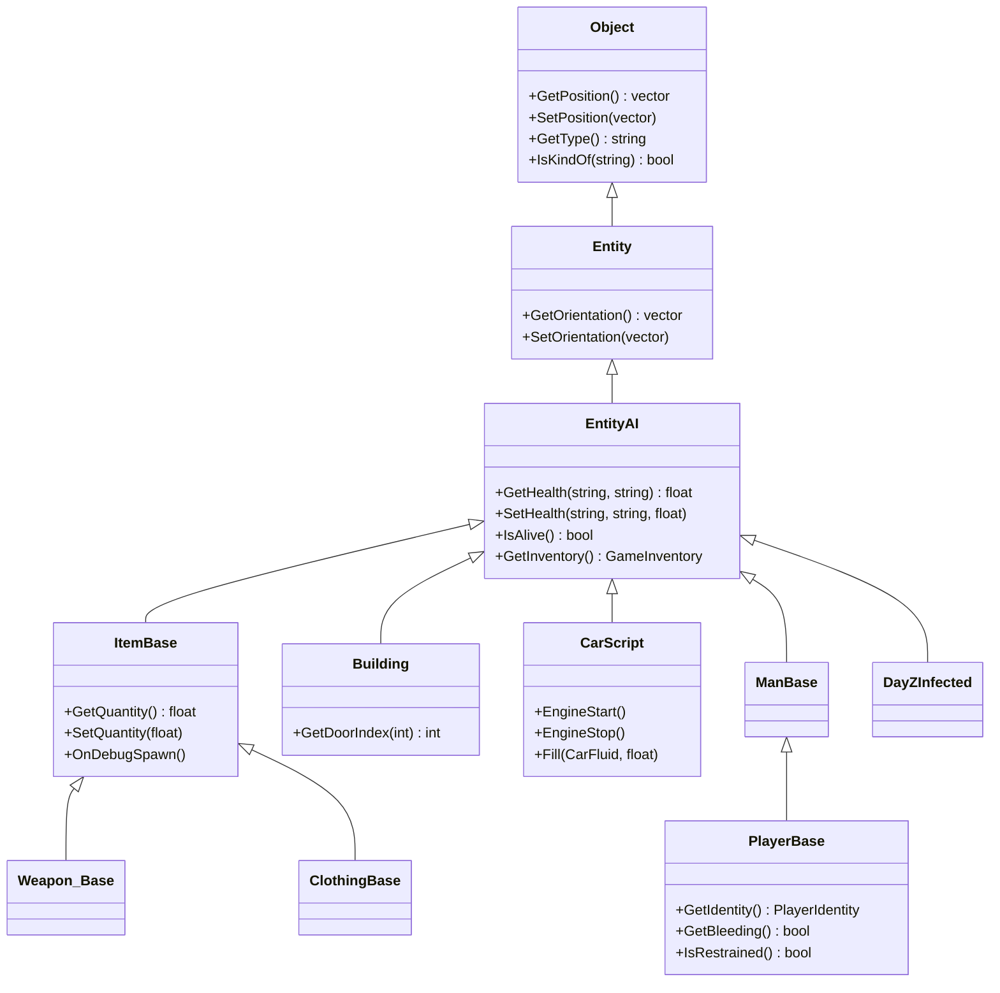

# Kapitel 1.3: Klassen & Vererbung

[Startseite](../README.md) | [<< Zurück: Arrays, Maps & Sets](02-arrays-maps-sets.md) | **Klassen & Vererbung** | [Weiter: Modded-Klassen >>](04-modded-classes.md)

---

## Einführung

Alles in DayZ ist eine Klasse. Jede Waffe, jedes Fahrzeug, jeder Zombie, jedes UI-Panel, jeder Config-Manager und jeder Spieler ist eine Instanz einer Klasse. Zu verstehen, wie man Klassen in Enforce Script deklariert, erweitert und damit arbeitet, ist die Grundlage jedes DayZ-Moddings.

Das Klassensystem von Enforce Script ist einfachvererbend, objektorientiert, mit Zugriffsmodifikatoren, Konstruktoren, Destruktoren, statischen Mitgliedern und Methoden-Überschreibung. Wenn Sie C# oder Java kennen, sind die Konzepte vertraut --- aber die Syntax hat ihren eigenen Charakter, und es gibt wichtige Unterschiede, die in diesem Kapitel behandelt werden.

---

## Eine Klasse deklarieren

Eine Klasse gruppiert zusammengehörige Daten (Felder) und Verhalten (Methoden).

```c
class ZombieTracker
{
    // Felder (Mitgliedsvariablen)
    int m_ZombieCount;
    float m_SpawnRadius;
    string m_ZoneName;
    bool m_IsActive;
    vector m_CenterPos;

    // Methoden (Mitgliedsfunktionen)
    void Activate(vector center, float radius)
    {
        m_CenterPos = center;
        m_SpawnRadius = radius;
        m_IsActive = true;
    }

    bool IsActive()
    {
        return m_IsActive;
    }

    float GetDistanceToCenter(vector pos)
    {
        return vector.Distance(m_CenterPos, pos);
    }
}
```

### Namenskonventionen für Klassen

DayZ-Modding folgt diesen Konventionen:
- Klassennamen: `PascalCase` (z.B. `PlayerTracker`, `LootManager`)
- Mitgliedsfelder: `m_PascalCase`-Präfix (z.B. `m_Health`, `m_PlayerList`)
- Statische Felder: `s_PascalCase`-Präfix (z.B. `s_Instance`, `s_Counter`)
- Konstanten: `UPPER_SNAKE_CASE` (z.B. `MAX_HEALTH`, `DEFAULT_RADIUS`)
- Methoden: `PascalCase` (z.B. `GetPosition()`, `SetHealth()`)
- Lokale Variablen: `camelCase` (z.B. `playerCount`, `nearestDist`)

### Instanzen erstellen und verwenden

```c
void Example()
{
    // Eine Instanz mit 'new' erstellen
    ZombieTracker tracker = new ZombieTracker;

    // Methoden aufrufen
    tracker.Activate(Vector(5000, 0, 8000), 200.0);

    if (tracker.IsActive())
    {
        float dist = tracker.GetDistanceToCenter(Vector(5050, 0, 8050));
        Print(string.Format("Entfernung: %1", dist));
    }

    // Eine Instanz mit 'delete' zerstören (normalerweise nicht nötig; siehe Abschnitt Speicher)
    delete tracker;
}
```

---

## Konstruktoren und Destruktoren

Konstruktoren initialisieren ein Objekt bei seiner Erstellung. Destruktoren räumen auf, wenn es zerstört wird. In Enforce Script verwenden beide den Klassennamen --- der Destruktor hat das Präfix `~`.

### Konstruktor

```c
class SpawnZone
{
    protected string m_Name;
    protected vector m_Position;
    protected float m_Radius;
    protected ref array<string> m_AllowedTypes;

    // Konstruktor: gleicher Name wie die Klasse
    void SpawnZone(string name, vector pos, float radius)
    {
        m_Name = name;
        m_Position = pos;
        m_Radius = radius;
        m_AllowedTypes = new array<string>;

        Print(string.Format("[SpawnZone] Erstellt: %1 bei %2, Radius %3", m_Name, m_Position, m_Radius));
    }

    // Destruktor: ~-Präfix
    void ~SpawnZone()
    {
        Print(string.Format("[SpawnZone] Zerstört: %1", m_Name));
        // m_AllowedTypes ist ein ref, es wird automatisch gelöscht
    }

    void AddAllowedType(string typeName)
    {
        m_AllowedTypes.Insert(typeName);
    }
}
```

### Standardkonstruktor (ohne Parameter)

Wenn Sie keinen Konstruktor definieren, erhält die Klasse einen impliziten Standardkonstruktor, der alle Felder mit ihren Standardwerten initialisiert (`0`, `0.0`, `false`, `""`, `null`).

```c
class SimpleConfig
{
    int m_MaxPlayers;      // initialisiert mit 0
    float m_SpawnDelay;    // initialisiert mit 0.0
    string m_ServerName;   // initialisiert mit ""
    bool m_PvPEnabled;     // initialisiert mit false
}

void Test()
{
    SimpleConfig cfg = new SimpleConfig;
    // Alle Felder haben ihre Standardwerte
    Print(cfg.m_MaxPlayers);  // 0
}
```

### Konstruktor-Überladung

Sie können mehrere Konstruktoren mit unterschiedlichen Parameterlisten definieren:

```c
class DamageEvent
{
    protected float m_Amount;
    protected string m_Source;
    protected vector m_Position;

    // Konstruktor mit allen Parametern
    void DamageEvent(float amount, string source, vector pos)
    {
        m_Amount = amount;
        m_Source = source;
        m_Position = pos;
    }

    // Einfacherer Konstruktor mit Standardwerten
    void DamageEvent(float amount)
    {
        m_Amount = amount;
        m_Source = "Unbekannt";
        m_Position = vector.Zero;
    }
}

void Test()
{
    DamageEvent full = new DamageEvent(50.0, "AKM", Vector(100, 0, 200));
    DamageEvent simple = new DamageEvent(25.0);
}
```

---

## Zugriffsmodifikatoren

Zugriffsmodifikatoren steuern, wer Felder und Methoden sehen und verwenden kann.

| Modifikator | Zugänglich von | Syntax |
|----------|----------------|--------|
| `private` | Nur der deklarierende Klasse | `private int m_Secret;` |
| `protected` | Deklarierende Klasse + alle Unterklassen | `protected int m_Health;` |
| *(keiner)* | Überall (öffentlich) | `int m_Value;` |

Es gibt kein explizites `public`-Schlüsselwort --- alles ohne `private` oder `protected` ist standardmäßig öffentlich.

```c
class BaseVehicle
{
    // Öffentlich: jeder kann zugreifen
    string m_DisplayName;

    // Geschuetzt: nur diese Klasse und Unterklassen
    protected float m_Fuel;
    protected float m_MaxFuel;

    // Privat: nur genau diese Klasse
    private int m_InternalState;

    void BaseVehicle(string name, float maxFuel)
    {
        m_DisplayName = name;
        m_MaxFuel = maxFuel;
        m_Fuel = maxFuel;
        m_InternalState = 0;
    }

    // Öffentliche Methode
    float GetFuelPercent()
    {
        return (m_Fuel / m_MaxFuel) * 100.0;
    }

    // Geschuetzte Methode: Unterklassen können diese aufrufen
    protected void ConsumeFuel(float amount)
    {
        m_Fuel = Math.Clamp(m_Fuel - amount, 0, m_MaxFuel);
    }

    // Private Methode: nur diese Klasse
    private void UpdateInternalState()
    {
        m_InternalState++;
    }
}
```

### Best Practice: Kapselung

Stellen Sie Felder über Methoden (Getter/Setter) bereit, anstatt sie öffentlich zu machen. So können Sie später Validierung, Protokollierung oder Nebeneffekte hinzufügen, ohne Code zu brechen, der die Klasse verwendet.

```c
class PlayerStats
{
    protected float m_Health;
    protected float m_MaxHealth;

    void PlayerStats(float maxHealth)
    {
        m_MaxHealth = maxHealth;
        m_Health = maxHealth;
    }

    // Getter
    float GetHealth()
    {
        return m_Health;
    }

    // Setter mit Validierung
    void SetHealth(float value)
    {
        m_Health = Math.Clamp(value, 0, m_MaxHealth);
    }

    // Komfortmethoden
    void TakeDamage(float amount)
    {
        SetHealth(m_Health - amount);
    }

    void Heal(float amount)
    {
        SetHealth(m_Health + amount);
    }

    bool IsAlive()
    {
        return m_Health > 0;
    }
}
```

---

## Vererbung

Vererbung ermöglicht es, eine neue Klasse basierend auf einer bestehenden zu erstellen. Die Kindklasse erbt alle Felder und Methoden der Elternklasse und kann neue hinzufügen oder bestehendes Verhalten überschreiben.

### Syntax: `extends` oder `:`

Enforce Script unterstützt zwei Syntaxen für Vererbung. Beide sind äquivalent:

```c
// Syntax 1: extends-Schlüsselwort (bevorzugt, besser lesbar)
class Car extends BaseVehicle
{
}

// Syntax 2: Doppelpunkt (C++-Stil, auch häufig in DayZ-Code)
class Truck : BaseVehicle
{
}
```

### Grundlegendes Vererbungsbeispiel

```c
class Animal
{
    protected string m_Name;
    protected float m_Health;

    void Animal(string name, float health)
    {
        m_Name = name;
        m_Health = health;
    }

    string GetName()
    {
        return m_Name;
    }

    void Speak()
    {
        Print(m_Name + " macht ein Geräusch");
    }
}

class Dog extends Animal
{
    protected string m_Breed;

    void Dog(string name, string breed)
    {
        // Hinweis: der Elternkonstruktor wird automatisch ohne Argumente aufgerufen,
        // oder Sie können Elternfelder direkt initialisieren, da sie protected sind
        m_Name = name;
        m_Health = 100.0;
        m_Breed = breed;
    }

    string GetBreed()
    {
        return m_Breed;
    }

    // Neue Methode nur in Dog
    void Fetch()
    {
        Print(m_Name + " holt den Stock!");
    }
}

void Test()
{
    Dog rex = new Dog("Rex", "Deutscher Schäferhund");
    rex.Speak();         // Von Animal geerbt: "Rex macht ein Geräusch"
    rex.Fetch();         // Dogs eigene Methode: "Rex holt den Stock!"
    Print(rex.GetName()); // Geerbt: "Rex"
    Print(rex.GetBreed()); // Dogs eigene: "Deutscher Schäferhund"
}
```

### Nur Einfachvererbung

Enforce Script unterstützt **nur Einfachvererbung**. Eine Klasse kann genau eine Elternklasse erweitern. Es gibt keine Mehrfachvererbung, keine Interfaces und keine Mixins.

```c
class A { }
class B extends A { }     // OK: einzelne Elternklasse
// class C extends A, B { }  // FEHLER: Mehrfachvererbung nicht unterstützt
class D extends B { }     // OK: B erweitert A, D erweitert B (Vererbungskette)
```

### Das `sealed`-Schlüsselwort (1.28+)

Eine Klasse, die als `sealed` markiert ist, kann nicht vererbt werden. Eine Methode, die als `sealed` markiert ist, kann nicht überschrieben werden. DayZ 1.28 erzwingt dies zur Kompilierzeit.

```c
sealed class FinalClass
{
    void DoWork()
    {
        // Diese Klasse kann nicht erweitert werden
    }
}

class MyChild : FinalClass  // KOMPILIERFEHLER: kann nicht von sealed-Klasse erben
{
}
```

Methoden können auch einzeln als sealed markiert werden:

```c
class MyBase
{
    sealed void LockedMethod()
    {
        // Kann in Kindklassen nicht überschrieben werden
    }

    void OpenMethod()
    {
        // Kann normal überschrieben werden
    }
}
```

> **Migrationshinweis:** Wenn Sie auf DayZ 1.28 aktualisieren und einen Kompilierfehler über das Erben einer sealed-Klasse erhalten, müssen Sie refaktorieren. Verwenden Sie Komposition (umschliessen Sie die Klasse als Mitglied) anstelle von Vererbung.

`sealed` wird im DayZ-Modding selten verwendet, da Erweiterbarkeit das primäre Ziel ist.

---

## Methoden überschreiben

Wenn eine Unterklasse das Verhalten einer geerbten Methode ändern muss, verwendet sie das `override`-Schlüsselwort. Der Compiler prueft, ob die Methodensignatur mit einer Methode in der Elternklasse übereinstimmt.

```c
class Weapon
{
    protected string m_Name;
    protected float m_Damage;

    void Weapon(string name, float damage)
    {
        m_Name = name;
        m_Damage = damage;
    }

    float CalculateDamage(float distance)
    {
        // Basisschaden, kein Abfall
        return m_Damage;
    }

    string GetInfo()
    {
        return string.Format("%1 (Dmg: %2)", m_Name, m_Damage);
    }
}

class Rifle extends Weapon
{
    protected float m_MaxRange;

    void Rifle(string name, float damage, float maxRange)
    {
        m_Name = name;
        m_Damage = damage;
        m_MaxRange = maxRange;
    }

    // Override: Schadensberechnung mit Entfernungsabfall ändern
    override float CalculateDamage(float distance)
    {
        float falloff = Math.Clamp(1.0 - (distance / m_MaxRange), 0.1, 1.0);
        return m_Damage * falloff;
    }

    // Override: Reichweiteninfo hinzufügen
    override string GetInfo()
    {
        return string.Format("%1 (Dmg: %2, Reichweite: %3m)", m_Name, m_Damage, m_MaxRange);
    }
}
```

### Das `super`-Schlüsselwort

`super` verweist auf die Elternklasse. Verwenden Sie es, um die Version der Elternmethode aufzurufen und dann Ihre eigene Logik hinzuzufügen. Dies ist entscheidend --- insbesondere bei [Modded-Klassen](04-modded-classes.md).

```c
class BaseLogger
{
    void Log(string message)
    {
        Print("[LOG] " + message);
    }
}

class TimestampLogger extends BaseLogger
{
    override void Log(string message)
    {
        // Zuerst das Log der Elternklasse aufrufen
        super.Log(message);

        // Dann Zeitstempel-Protokollierung hinzufügen
        int hour, minute, second;
        GetHourMinuteSecond(hour, minute, second);
        Print(string.Format("[%1:%2:%3] %4", hour, minute, second, message));
    }
}
```

### Das `this`-Schlüsselwort

`this` verweist auf die aktuelle Objektinstanz. Es ist normalerweise implizit (Sie müssen es nicht schreiben), kann aber zur Klarheit nützlich sein oder wenn Sie das aktuelle Objekt an eine andere Funktion übergeben.

```c
class EventManager
{
    void Register(Managed handler) { /* ... */ }
}

class MyPlugin
{
    void Init(EventManager mgr)
    {
        // 'this' (die aktuelle MyPlugin-Instanz) an den Manager übergeben
        mgr.Register(this);
    }
}
```

---

## Statische Methoden und Felder

Statische Mitglieder gehören zur Klasse selbst, nicht zu einer Instanz. Sie werden über den Klassennamen aufgerufen, nicht über eine Objektvariable.

### Statische Felder

```c
class GameConfig
{
    // Statische Felder: werden über alle Instanzen geteilt (und ohne Instanz zugänglich)
    static int s_MaxPlayers = 60;
    static float s_TickRate = 30.0;
    static string s_ServerName = "My Server";

    // Normales (Instanz-) Feld
    protected bool m_IsLoaded;
}

void UseStaticFields()
{
    // Zugriff ohne Instanzerstellung
    Print(GameConfig.s_MaxPlayers);     // 60
    Print(GameConfig.s_ServerName);     // "My Server"

    // Modifizieren
    GameConfig.s_MaxPlayers = 40;
}
```

### Statische Methoden

```c
class MathUtils
{
    static float MetersToKilometers(float meters)
    {
        return meters / 1000.0;
    }

    static string FormatDistance(float meters)
    {
        if (meters >= 1000)
            return string.Format("%.1f km", meters / 1000.0);
        else
            return string.Format("%1 m", Math.Round(meters));
    }

    static bool IsInCircle(vector point, vector center, float radius)
    {
        return vector.Distance(point, center) <= radius;
    }
}

void Test()
{
    float km = MathUtils.MetersToKilometers(2500);     // 2.5
    string display = MathUtils.FormatDistance(750);      // "750 m"
    bool inside = MathUtils.IsInCircle("100 0 200", "150 0 250", 100);
}
```

### Das Singleton-Muster

Die häufigste Verwendung statischer Felder in DayZ-Mods ist das Singleton-Muster: eine Klasse, die genau eine Instanz hat, die global zugänglich ist.

```c
class MyModManager
{
    // Statische Referenz auf die einzelne Instanz
    private static ref MyModManager s_Instance;

    protected bool m_Initialized;
    protected ref array<string> m_Data;

    void MyModManager()
    {
        m_Initialized = false;
        m_Data = new array<string>;
    }

    // Statischer Getter für das Singleton
    static MyModManager GetInstance()
    {
        if (!s_Instance)
            s_Instance = new MyModManager;

        return s_Instance;
    }

    void Init()
    {
        if (m_Initialized)
            return;

        m_Initialized = true;
        Print("[MyMod] Manager initialisiert");
    }

    // Statische Bereinigung
    static void Destroy()
    {
        s_Instance = null;
    }
}

// Verwendung von überall:
void SomeFunction()
{
    MyModManager.GetInstance().Init();
}
```

---

## Praxisbeispiel: Eigene Item-Klasse

Hier ist ein vollständiges Beispiel einer eigenen Item-Klassenhierarchie im Stil des DayZ-Moddings. Dies demonstriert alles, was in diesem Kapitel behandelt wurde.

```c
// Basisklasse für alle eigenen Medizin-Items
class CustomMedicalBase extends ItemBase
{
    protected float m_HealAmount;
    protected float m_UseTime;      // Sekunden bis zur Verwendung
    protected bool m_RequiresBandage;

    void CustomMedicalBase()
    {
        m_HealAmount = 0;
        m_UseTime = 3.0;
        m_RequiresBandage = false;
    }

    float GetHealAmount()
    {
        return m_HealAmount;
    }

    float GetUseTime()
    {
        return m_UseTime;
    }

    bool RequiresBandage()
    {
        return m_RequiresBandage;
    }

    // Kann von Unterklassen überschrieben werden
    void OnApplied(PlayerBase player)
    {
        if (!player)
            return;

        player.AddHealth("", "Health", m_HealAmount);
        Print(string.Format("[Medical] %1 angewendet, %2 geheilt", GetType(), m_HealAmount));
    }
}

// Spezifisches Medizin-Item: Bandage
class CustomBandage extends CustomMedicalBase
{
    void CustomBandage()
    {
        m_HealAmount = 25.0;
        m_UseTime = 2.0;
    }

    override void OnApplied(PlayerBase player)
    {
        super.OnApplied(player);

        // Zusätzlicher bandagenspezifischer Effekt: Blutung stoppen
        // (vereinfachtes Beispiel)
        Print("[Medical] Blutung gestoppt");
    }
}

// Spezifisches Medizin-Item: Erste-Hilfe-Kasten (heilt mehr, dauert länger)
class CustomFirstAidKit extends CustomMedicalBase
{
    private int m_UsesRemaining;

    void CustomFirstAidKit()
    {
        m_HealAmount = 75.0;
        m_UseTime = 8.0;
        m_UsesRemaining = 3;
    }

    int GetUsesRemaining()
    {
        return m_UsesRemaining;
    }

    override void OnApplied(PlayerBase player)
    {
        if (m_UsesRemaining <= 0)
        {
            Print("[Medical] Erste-Hilfe-Kasten ist leer!");
            return;
        }

        super.OnApplied(player);
        m_UsesRemaining--;

        Print(string.Format("[Medical] Verbleibende Verwendungen: %1", m_UsesRemaining));
    }
}
```

### config.cpp für eigene Items

Die Klassenhierarchie im Script muss mit der `config.cpp`-Vererbung übereinstimmen:

```cpp
class CfgVehicles
{
    class ItemBase;

    class CustomMedicalBase : ItemBase
    {
        scope = 0;  // 0 = abstrakt, kann nicht gespawnt werden
        displayName = "";
    };

    class CustomBandage : CustomMedicalBase
    {
        scope = 2;  // 2 = öffentlich, kann gespawnt werden
        displayName = "Custom Bandage";
        descriptionShort = "A sterile bandage for wound treatment.";
        model = "\MyMod\data\bandage.p3d";
        weight = 50;
    };

    class CustomFirstAidKit : CustomMedicalBase
    {
        scope = 2;
        displayName = "Custom First Aid Kit";
        descriptionShort = "A complete first aid kit with multiple uses.";
        model = "\MyMod\data\firstaidkit.p3d";
        weight = 300;
    };
};
```

---

## Die DayZ-Klassenhierarchie

Das Verständnis der Vanilla-Klassenhierarchie ist wesentlich für das Modding. Hier sind die wichtigsten Klassen, von denen Sie erben oder mit denen Sie interagieren werden:

```
Class                          // Wurzel aller Referenztypen
  Managed                      // Verhindert Engine-Referenzzählung (für reine Skriptklassen)
  IEntity                      // Engine-Entity-Basis
    Object                     // Alles mit einer Position in der Welt
      Entity
        EntityAI               // Hat Inventar, Gesundheit, Aktionen
          InventoryItem
            ItemBase           // ALLE Items (hiervon für eigene Items erben)
              Weapon_Base      // Alle Waffen
              Magazine_Base    // Alle Magazine
              Clothing_Base    // Alle Kleidung
          Transport
            CarScript          // Alle Fahrzeuge
          DayZCreatureAI
            DayZInfected       // Zombies
            DayZAnimal         // Tiere
          Man
            DayZPlayer
              PlayerBase       // DIE Spielerklasse (wird ständig gemoddet)
                SurvivorBase   // Charaktererscheinung
```

### Häufige Basisklassen für Modding

| Wenn Sie erstellen möchten... | Erweitern Sie... |
|--------------------------|-----------|
| Ein neues Item | `ItemBase` |
| Eine neue Waffe | `Weapon_Base` |
| Ein neues Kleidungsstück | `Clothing_Base` |
| Ein neues Fahrzeug | `CarScript` |
| Ein UI-Element | `UIScriptedMenu` oder `ScriptedWidgetEventHandler` |
| Einen Manager/System | `Managed` |
| Eine Config-Datenklasse | `Managed` |
| Einen Mission-Hook | `MissionServer` oder `MissionGameplay` (via `modded class`) |

---

## Häufige Fehler

### 1. `ref` für besessene Objekte vergessen



Wenn eine Klasse ein anderes Objekt besitzt (es erstellt und für dessen Lebensdauer verantwortlich ist), deklarieren Sie das Feld als `ref`. Ohne `ref` kann das Objekt unerwartet vom Garbage Collector erfasst werden.

```c
// SCHLECHT: m_Data könnte vom Garbage Collector erfasst werden
class BadManager
{
    array<string> m_Data;  // Rohzeiger, kein Besitz

    void BadManager()
    {
        m_Data = new array<string>;  // Objekt könnte erfasst werden
    }
}

// GUT: ref stellt sicher, dass der Manager m_Data am Leben hält
class GoodManager
{
    ref array<string> m_Data;  // Starke Referenz, besitzt das Objekt

    void GoodManager()
    {
        m_Data = new array<string>;
    }
}
```

### 2. `override`-Schlüsselwort vergessen

Wenn Sie beabsichtigen, eine Elternmethode zu überschreiben, aber das `override`-Schlüsselwort vergessen, erhalten Sie eine **neue** Methode, die die Elternmethode verbirgt, anstatt sie zu ersetzen. Der Compiler kann darüber warnen.

```c
class Parent
{
    void DoWork() { Print("Parent"); }
}

class Child extends Parent
{
    // SCHLECHT: erstellt eine neue Methode, überschreibt nicht
    void DoWork() { Print("Child"); }

    // GUT: überschreibt korrekt
    override void DoWork() { Print("Child"); }
}
```

### 3. `super` bei Overrides nicht aufrufen

Wenn Sie eine Methode überschreiben, wird der Code der Elternklasse NICHT automatisch aufgerufen. Wenn Sie `super` weglassen, verlieren Sie das Verhalten der Elternklasse --- was die Funktionalität brechen kann, besonders in den tiefen Vererbungsketten von DayZ.

```c
class Parent
{
    void Init()
    {
        // Kritische Initialisierung geschieht hier
        Print("Parent.Init()");
    }
}

class Child extends Parent
{
    // SCHLECHT: Parent.Init() wird nie ausgeführt
    override void Init()
    {
        Print("Child.Init()");
    }

    // GUT: Parent.Init() wird zuerst ausgeführt, dann fügt Child Verhalten hinzu
    override void Init()
    {
        super.Init();
        Print("Child.Init()");
    }
}
```

### 4. Ref-Zyklen verursachen Speicherlecks

Wenn Objekt A eine `ref` auf Objekt B hält und Objekt B eine `ref` auf Objekt A hält, kann keines jemals freigegeben werden. Eine Seite muss einen rohen (nicht-ref) Zeiger verwenden.

```c
// SCHLECHT: ref-Zyklus, keines der Objekte kann freigegeben werden
class Parent
{
    ref Child m_Child;
}
class Child
{
    ref Parent m_Parent;  // LECK: zirkuläre ref
}

// GUT: Kind hält einen Rohzeiger auf das Elternobjekt
class Parent2
{
    ref Child2 m_Child;
}
class Child2
{
    Parent2 m_Parent;  // Rohzeiger, kein ref -- bricht den Zyklus
}
```

### 5. Versuch, Mehrfachvererbung zu verwenden

Enforce Script unterstützt keine Mehrfachvererbung. Wenn Sie Verhalten zwischen unverwandten Klassen teilen müssen, verwenden Sie Komposition (eine Referenz auf ein Hilfsobjekt halten) oder statische Hilfsmethoden.

```c
// GEHT NICHT:
// class FlyingCar extends Car, Aircraft { }  // FEHLER

// Stattdessen Komposition verwenden:
class FlyingCar extends Car
{
    protected ref FlightController m_Flight;

    void FlyingCar()
    {
        m_Flight = new FlightController;
    }

    void Fly(vector destination)
    {
        m_Flight.NavigateTo(destination);
    }
}
```

---

## Uebungsaufgaben

### Uebung 1: Form-Hierarchie
Erstellen Sie eine Basisklasse `Shape` mit einer Methode `float GetArea()`. Erstellen Sie Unterklassen `Circle` (Radius), `Rectangle` (Breite, Höhe) und `Triangle` (Basis, Höhe), die `GetArea()` überschreiben. Geben Sie die Fläche jeder Form aus.

### Uebung 2: Logger-System
Erstellen Sie eine `Logger`-Klasse mit einer `Log(string message)`-Methode, die auf die Konsole ausgibt. Erstellen Sie `FileLogger`, der diese erweitert und auch in eine konzeptuelle Datei schreibt (geben Sie einfach mit einem `[FILE]`-Präfix aus). Erstellen Sie `DiscordLogger`, der `Logger` erweitert und ein `[DISCORD]`-Präfix hinzufügt. Jeder sollte `super.Log()` aufrufen.

### Uebung 3: Inventar-Item
Erstellen Sie eine Klasse `CustomItem` mit geschuetzten Feldern für `m_Weight`, `m_Value` und `m_Condition` (float 0-1). Enthalten Sie:
- Einen Konstruktor, der alle drei Werte annimmt
- Getter für jedes Feld
- Eine Methode `Degrade(float amount)`, die die Kondition reduziert (auf 0 begrenzt)
- Eine Methode `GetEffectiveValue()`, die `m_Value * m_Condition` zurückgibt

Erstellen Sie dann `CustomWeaponItem`, das dies erweitert und `m_Damage` hinzufügt sowie `GetEffectiveValue()` überschreibt, um den Schaden einzubeziehen.

### Uebung 4: Singleton-Manager
Implementieren Sie einen `SessionManager`-Singleton, der Spieler-Beitreten/Verlassen-Ereignisse verfolgt. Er sollte Beitrittszeiten in einer Map speichern und Methoden bereitstellen:
- `OnPlayerJoin(string uid, string name)`
- `OnPlayerLeave(string uid)`
- `int GetOnlineCount()`
- `float GetSessionDuration(string uid)` (in Sekunden)

### Uebung 5: Befehlskette
Erstellen Sie eine abstrakte `Handler`-Klasse mit `protected Handler m_Next` und Methoden `SetNext(Handler next)` und `void Handle(string request)`. Erstellen Sie drei konkrete Handler (`AuthHandler`, `PermissionHandler`, `ActionHandler`), die entweder die Anfrage bearbeiten oder an `m_Next` weitergeben. Demonstrieren Sie die Kette.

---

## Zusammenfassung

| Konzept | Syntax | Hinweise |
|---------|--------|-------|
| Klassendeklaration | `class Name { }` | Standardmäßig öffentliche Mitglieder |
| Vererbung | `class Child extends Parent` | Nur Einfachvererbung; auch `: Parent` |
| Konstruktor | `void ClassName()` | Gleicher Name wie die Klasse |
| Destruktor | `void ~ClassName()` | Wird beim Löschen aufgerufen |
| Privat | `private int m_Field;` | Nur diese Klasse |
| Geschuetzt | `protected int m_Field;` | Diese Klasse + Unterklassen |
| Öffentlich | `int m_Field;` | Kein Schlüsselwort nötig (Standard) |
| Override | `override void Method()` | Muss mit Elternsignatur übereinstimmen |
| Super-Aufruf | `super.Method()` | Ruft die Version der Elternklasse auf |
| Statisches Feld | `static int s_Count;` | Wird über alle Instanzen geteilt |
| Statische Methode | `static void DoThing()` | Aufruf über `ClassName.DoThing()` |
| `ref` | `ref MyClass m_Obj;` | Starke Referenz (besitzt das Objekt) |
| Sealed-Klasse | `sealed class Name { }` | Kann nicht vererbt werden (1.28+ Kompilierfehler) |
| Sealed-Methode | `sealed void Method()` | Kann in Kindklassen nicht überschrieben werden |
| Proto native | `proto native void Func();` | Engine-implementierte Methode |
| `out`-Param | `void Func(out int val)` | Nur-Ausgabe-Parameter |
| `inout`-Param | `void Func(inout array<int> a)` | Eingabe + Ausgabe-Parameter |
| `notnull`-Param | `void Func(notnull EntityAI e)` | Compiler-erzwungener Nicht-Null-Wert |

---

[Startseite](../README.md) | [<< Zurück: Arrays, Maps & Sets](02-arrays-maps-sets.md) | **Klassen & Vererbung** | [Weiter: Modded-Klassen >>](04-modded-classes.md)
