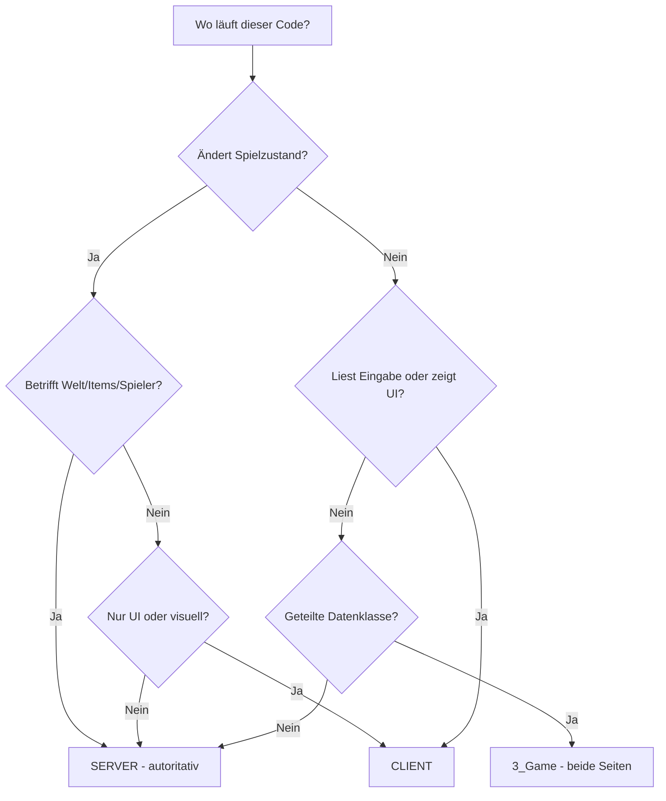

# Kapitel 2.6: Server- vs. Client-Architektur

[Startseite](../README.md) | [<< Zurück: Dateiorganisation](05-file-organization.md) | **Server- vs. Client-Architektur**

---

> **Zusammenfassung:** DayZ ist ein Client-Server-Spiel. Jede Zeile Code, die Sie schreiben, läuft in einem bestimmten Kontext -- Server, Client oder beides. Das Verständnis dieser Aufteilung ist wesentlich für das Schreiben sicherer, funktionaler Mods. Dieses Kapitel erklärt, wo Code ausgeführt wird, wie Sie erkennen, auf welcher Seite Sie sich befinden, wie Sie Multi-Paket-Mods strukturieren und welche Muster Server- und Client-Code ordnungsgemäß getrennt halten.

---

## Inhaltsverzeichnis

- [Die grundlegende Aufteilung](#die-grundlegende-aufteilung)
- [Die drei Ausführungskontexte](#die-drei-ausführungskontexte)
- [Prüfen, wo Ihr Code läuft](#prüfen-wo-ihr-code-läuft)
- [Das type-Feld in mod.cpp](#das-type-feld-in-modcpp)
- [Das type-Feld in config.cpp](#das-type-feld-in-configcpp)
- [Multi-Paket-Mod-Architektur](#multi-paket-mod-architektur)
- [Die goldenen Regeln](#die-goldenen-regeln)
- [Script-Layer- und Seiten-Matrix](#script-layer--und-seiten-matrix)
- [Präprozessor-Guards](#präprozessor-guards)
- [Häufige Server-Client-Muster](#häufige-server-client-muster)
- [Listen-Server-Fallstricke](#listen-server-fallstricke)
- [Abhängigkeit zwischen geteilten Mods](#abhängigkeit-zwischen-geteilten-mods)
- [Praxisbeispiele für Aufteilung](#praxisbeispiele-für-aufteilung)
- [Häufige Fehler](#häufige-fehler)
- [Entscheidungs-Flussdiagramm](#entscheidungs-flussdiagramm)
- [Zusammenfassungs-Checkliste](#zusammenfassungs-checkliste)

---

## Die grundlegende Aufteilung

DayZ verwendet ein **Dedicated-Server**-Modell. Server und Client sind separate Prozesse, die separate ausführbare Dateien ausführen. Sie kommunizieren über das Netzwerk, und die Engine übernimmt die Synchronisation von Entitäten, Variablen und RPCs.

Das bedeutet, Ihr Mod-Code läuft in einem von drei Kontexten, und die Regeln für jeden sind grundlegend verschieden.

```
+------------------------------------------------------------------+
|                                                                  |
|   DEDICATED SERVER                                               |
|   - Kopfloser Prozess (kein Fenster, keine GPU)                  |
|   - Autoritativ: besitzt den Spielzustand                        |
|   - Spawnt Entitäten, verteilt Schaden, speichert Daten          |
|   - Hat KEINEN Spieler, KEINE UI, KEINE Tastatureingabe          |
|   - Führt aus: MissionServer                                     |
|                                                                  |
+------------------------------------------------------------------+

          ^                                         ^
          |          NETZWERK (RPCs, Sync-Vars)      |
          v                                         v

+---------------------------+     +---------------------------+
|                           |     |                           |
|   CLIENT 1                |     |   CLIENT 2                |
|   - Hat ein Fenster, GPU  |     |   - Hat ein Fenster, GPU  |
|   - Rendert die Welt      |     |   - Rendert die Welt      |
|   - Verarbeitet Eingaben  |     |   - Verarbeitet Eingaben  |
|   - Zeigt UI und HUD      |     |   - Zeigt UI und HUD      |
|   - Führt aus:            |     |   - Führt aus:            |
|     MissionGameplay       |     |     MissionGameplay       |
|                           |     |                           |
+---------------------------+     +---------------------------+
```

---

## Die drei Ausführungskontexte

### 1. Dedicated Server

Der Dedicated Server ist ein **kopfloser Prozess**. Er hat kein Fenster, keine Grafikkartenausgabe, keinen Monitor, keine Tastatur, keine Maus. Er existiert nur, um Spiellogik auszuführen.

Wichtige Eigenschaften:
- **Autoritativ** -- der Zustand des Servers ist die Wahrheit. Wenn der Server sagt, ein Spieler hat 50 Lebenspunkte, dann hat der Spieler 50 Lebenspunkte.
- **Kein Spielerobjekt** -- `GetGame().GetPlayer()` gibt auf einem Dedicated Server immer `null` zurück. Der Server verwaltet ALLE Spieler, IST aber keiner von ihnen.
- **Keine UI** -- jeder Code, der Widgets erstellt, Menüs zeigt oder HUD-Elemente rendert, wird abstürzen oder stillschweigend fehlschlagen.
- **Keine Eingabe** -- es gibt keine Tastatur oder Maus. Eingabeverarbeitungscode ist hier bedeutungslos.
- **Dateisystemzugriff** -- der Server kann Dateien in seinem Profilverzeichnis (`$profile:`) lesen und schreiben, wo Configs, Spielerdaten und Logs gespeichert werden.
- **Missionsklasse** -- der Server instanziiert `MissionServer`, nicht `MissionGameplay`.

### 2. Client

Der Client ist das Spiel des Spielers. Er hat ein Fenster, rendert 3D-Grafiken, gibt Audio wieder und verarbeitet Eingaben.

Wichtige Eigenschaften:
- **Präsentationsschicht** -- der Client rendert, was der Server ihm sagt. Er entscheidet nicht, was in der Welt existiert.
- **Hat einen Spieler** -- `GetGame().GetPlayer()` gibt die `PlayerBase`-Instanz des lokalen Spielers zurück.
- **UI und HUD** -- alle Widget-Erstellung, Layout-Ladung und Menü-Code läuft hier.
- **Eingabe** -- Tastatur-, Maus- und Gamepad-Eingabe wird hier verarbeitet.
- **Begrenzte Autorität** -- der Client kann Aktionen ANFRAGEN (über RPC), aber der Server ENTSCHEIDET, ob sie stattfinden.
- **Missionsklasse** -- der Client instanziiert `MissionGameplay`, nicht `MissionServer`.

### 3. Listen-Server (Entwicklung/Tests)

Ein Listen-Server ist gleichzeitig Server UND Client im selben Prozess. Das erhalten Sie, wenn Sie DayZ über die Workbench starten oder den `-server`-Startparameter mit einem lokalen Spiel verwenden.

Wichtige Eigenschaften:
- **Sowohl `IsServer()` als auch `IsClient()` geben true zurück** -- das ist der kritische Unterschied zu Dedicated Servern.
- **Hat einen Spieler UND verwaltet alle Spieler** -- `GetGame().GetPlayer()` gibt den Host-Spieler zurück.
- **Sowohl `MissionServer`- als auch `MissionGameplay`-Hooks laufen** -- Ihre modded Klassen für beide werden ausgeführt.
- **Nur für Entwicklung verwendet** -- Produktionsserver sind immer dediziert.
- **Kann Bugs maskieren** -- Code, der auf einem Listen-Server funktioniert, kann auf einem Dedicated Server fehlschlagen, weil der Listen-Server Zugriff auf sowohl Server- als auch Client-Typen hat.

---

## Prüfen, wo Ihr Code läuft

Die globale Funktion `GetGame()` gibt die Spielinstanz zurück, die Methoden zur Erkennung des Ausführungskontexts bietet:

```c
// ---------------------------------------------------------------
// Laufzeit-Kontextprüfungen
// ---------------------------------------------------------------

if (GetGame().IsServer())
{
    // TRUE auf: Dedicated Server, Listen-Server
    // FALSE auf: Client, der mit einem Remote-Server verbunden ist
    // Verwenden für: serverseitige Logik (Spawning, Schaden, Speichern)
}

if (GetGame().IsClient())
{
    // TRUE auf: Client, der mit einem Remote-Server verbunden ist, Listen-Server
    // FALSE auf: Dedicated Server
    // Verwenden für: UI-Code, Eingabeverarbeitung, visuelle Effekte
}

if (GetGame().IsDedicatedServer())
{
    // TRUE auf: nur Dedicated Server
    // FALSE auf: Client, Listen-Server
    // Verwenden für: Code, der NIEMALS auf einem Listen-Server laufen darf
}

if (GetGame().IsMultiplayer())
{
    // TRUE auf: jede Multiplayer-Sitzung (Dedicated Server, Remote-Client)
    // FALSE auf: Singleplayer/Offline-Modus
    // Verwenden für: Deaktivierung von Features im Offline-Test
}
```

### Wahrheitstabelle

| Methode | Dedicated Server | Client (Remote) | Listen-Server |
|---------|:---:|:---:|:---:|
| `IsServer()` | true | false | true |
| `IsClient()` | false | true | true |
| `IsDedicatedServer()` | true | false | false |
| `IsMultiplayer()` | true | true | false |
| `GetPlayer()` gibt zurück | null | PlayerBase | PlayerBase |

### Häufige Muster

```c
// Guard: nur serverseitige Logik
void SpawnLoot(vector position)
{
    if (!GetGame().IsServer())
        return;

    // Nur der Server erstellt Entitäten
    EntityAI item = EntityAI.Cast(GetGame().CreateObjectEx("AK101", position, ECE_PLACE_ON_SURFACE));
}

// Guard: nur clientseitige Logik
void ShowNotification(string text)
{
    if (!GetGame().IsClient())
        return;

    // Nur der Client kann UI anzeigen
    NotificationSystem.AddNotification(text, "set:dayz_gui image:icon_pin");
}

// Guard: beide Seiten korrekt behandeln
void OnPlayerAction(PlayerBase player, int actionID)
{
    if (GetGame().IsServer())
    {
        // Aktion validieren und ausführen
        ValidateAndApply(player, actionID);
    }

    if (GetGame().IsClient())
    {
        // Lokalen Soundeffekt abspielen
        PlayActionSound(actionID);
    }
}
```

---

## Das type-Feld in mod.cpp

Die Datei `mod.cpp` im Stammverzeichnis Ihres Mod-Ordners enthält ein `type`-Feld, das steuert, WO die Mod geladen wird:

### type = "mod" (Beide Seiten)

```
name = "My Mod";
type = "mod";
```

Die Mod wird auf **sowohl Server als auch Client** geladen. Der Server lädt sie, Clients laden sie herunter und laden sie. Beide Seiten kompilieren und führen die Scripts aus.

**Wann verwenden:** Die meisten Mods verwenden dies. Jede Mod, die gemeinsame Typen hat (Entitätsdefinitionen, Config-Klassen, RPC-Datenstrukturen), muss `type = "mod"` sein, damit beide Seiten die gleichen Typen kennen.

**Beispiel:** Die StarDZ AI Client-Mod verwendet `type = "mod"`, weil sowohl Server als auch Client die AI-Entitätsklassen-Definitionen, RPC-Konstanten und Sync-Datenstrukturen benötigen:

```
// StarDZ_AI/mod.cpp
name = "StarDZ AI";
type = "mod";
```

### type = "servermod" (Nur Server)

```
name = "My Mod Server";
type = "servermod";
```

Die Mod wird **nur auf dem Server** geladen. Clients sehen sie nie, laden sie nie herunter und wissen nicht, dass sie existiert. Der Server sendet sie nicht in der Mod-Liste.

**Wann verwenden:** Serverseitige Logik, auf die Clients nie Zugriff haben sollten. Dazu gehören:
- Spawn-Algorithmen (verhindert, dass Spieler Loot vorhersagen)
- AI-Gehirn-Logik (verhindert Exploit-Analyse)
- Admin-Befehle und Serververwaltung
- Datenbankverbindungen und externe API-Aufrufe
- Anti-Cheat-Validierungslogik

**Beispiel:** Die StarDZ AI Server-Mod verwendet `type = "servermod"`, weil Clients niemals die AI-Gehirn-, Wahrnehmungs-, Kampf- oder Spawning-Logik sehen sollten:

```
// StarDZ_AI_Server/mod.cpp
name = "StarDZ AI Server";
type = "servermod";
```

### Warum dies für die Sicherheit wichtig ist

Wenn Ihre Spawn-Logik in einem `type = "mod"`-Paket ist, **lädt jeder Spieler sie herunter**. Sie können die PBO dekompilieren und Ihre Spawn-Algorithmen, Loot-Tabellen, Admin-Passwörter oder Anti-Cheat-Logik lesen. Platzieren Sie sensible Server-Logik immer in einem `type = "servermod"`-Paket.

---

## Das type-Feld in config.cpp

Innerhalb von `config.cpp` (im `CfgMods`-Abschnitt) gibt es ebenfalls ein `type`-Feld. Dieses steuert, wie die Engine die Mod intern behandelt:

```cpp
class CfgMods
{
    class MyMod
    {
        type = "mod";          // oder "servermod"
        // ...
    };
};
```

Dieses Feld sollte mit Ihrem `mod.cpp`-type-Feld übereinstimmen. Wenn sie sich widersprechen, erhalten Sie unvorhersehbares Verhalten. Halten Sie sie konsistent.

Die `config.cpp` enthält auch das `defines[]`-Array, mit dem Sie Präprozessorsymbole für die Erkennung zwischen Mods aktivieren:

```cpp
class CfgMods
{
    class StarDZ_AI
    {
        type = "mod";
        defines[] = { "STARDZ_AI" };    // Andere Mods können #ifdef STARDZ_AI verwenden
    };
};

class CfgMods
{
    class StarDZ_AIServer
    {
        type = "servermod";
        defines[] = { "STARDZ_AI", "STARDZ_AISERVER" };  // Beide Defines verfügbar
    };
};
```

Beachten Sie, dass die Server-Mod sowohl `STARDZ_AI` als auch `STARDZ_AISERVER` definiert. Dies ermöglicht serverseitigem Code zu erkennen, ob nur die Client-Mod vorhanden ist oder das vollständige Server-Paket geladen ist.

---

## Multi-Paket-Mod-Architektur

### Warum in mehrere Pakete aufteilen?

Ein einzelner Mod-Ordner mit `type = "mod"` liefert alles an die Clients. Für viele Mods ist das in Ordnung. Aber für Mods mit sensibler Server-Logik müssen Sie aufteilen:

```
@MyMod/                          <-- Client-Paket (type = "mod")
  mod.cpp                        <-- type = "mod"
  Addons/
    MyMod_Scripts.pbo            <-- Geteilt: RPCs, Config-Klassen, Entitäts-Defs
    MyMod_Data.pbo               <-- Geteilt: Modelle, Texturen
    MyMod_GUI.pbo                <-- Nur Client: Layouts, Imagesets

@MyModServer/                    <-- Server-Paket (type = "servermod")
  mod.cpp                        <-- type = "servermod"
  Addons/
    MyModServer_Scripts.pbo      <-- Nur Server: Spawning, Gehirn, Admin
```

Der Server lädt BEIDE `@MyMod` und `@MyModServer`. Clients laden nur `@MyMod`.

### Was wohin gehört

**Client-Paket** (`type = "mod"`) enthält:
- Entitätsklassen-Definitionen (beide Seiten müssen die Klasse kennen)
- RPC-ID-Konstanten und Datenstrukturen (beide Seiten senden/empfangen)
- Config-Klassen für Einstellungen, die die Client-Anzeige betreffen
- GUI-Layouts, Imagesets und Styles
- Clientseitiger UI-Code (eingeschlossen in `#ifndef SERVER`)
- Modelle, Texturen, Sounds
- `stringtable.csv` für Lokalisierung

**Server-Paket** (`type = "servermod"`) enthält:
- Manager-/Controller-Klassen (Spawn-Logik, AI-Gehirne)
- Serverseitige Validierung und Anti-Cheat
- Config-Laden und Datei-I/O (JSON-Configs, Spielerdaten)
- Admin-Befehlshandler
- Externe Dienstintegration (Webhooks, APIs)
- `MissionServer`-Hooks

### Die Abhängigkeitskette

Das Server-Paket hängt vom Client-Paket ab, niemals umgekehrt:

```cpp
// Client-Mod: config.cpp
class CfgPatches
{
    class MyMod_Scripts
    {
        requiredAddons[] = { "DZ_Scripts" };  // Keine Abhängigkeit zum Server
    };
};

// Server-Mod: config.cpp
class CfgPatches
{
    class MyModServer_Scripts
    {
        requiredAddons[] = { "DZ_Scripts", "MyMod_Scripts" };  // Hängt vom Client ab
    };
};
```

Dies stellt sicher, dass das Client-Paket zuerst kompiliert wird und das Server-Paket alle im Client-Paket definierten Typen referenzieren kann.

---

## Die goldenen Regeln

Diese Regeln bestimmen jede Entscheidung darüber, wohin Code gehört:

### Regel 1: Server ist AUTORITATIV

Der Server besitzt den Spielzustand. Er entscheidet, was existiert, wo es existiert und was damit passiert. Lassen Sie den Client niemals autoritative Entscheidungen treffen.

### Regel 2: Client behandelt PRÄSENTATION

Der Client rendert die Welt, spielt Sounds, zeigt UI und sammelt Eingaben. Er entscheidet nicht über Spielergebnisse.

### Regel 3: RPC ist die BRÜCKE

Remote Procedure Calls (RPCs) sind der einzige strukturierte Weg für Server und Client zu kommunizieren. Der Client sendet Anfragen, der Server sendet Antworten und Zustandsaktualisierungen.

### Regel 4: Vertraue niemals dem Client

Alle Daten, die von einem Client kommen, könnten manipuliert sein. Validieren Sie immer auf dem Server.

### Entscheidungsbaum



### Verantwortungsmatrix

| Aufgabe | Wo | Warum |
|---------|-----|-------|
| Entitäten spawnen | Server | Verhindert Gegenstandsduplizierung |
| Schaden anwenden | Server | Verhindert Gottmodus-Hacks |
| Entitäten löschen | Server | Verhindert Grief-Exploits |
| Spielerdaten speichern | Server | Persistenter serverseitiger Speicher |
| Configs laden | Server | Server kontrolliert Spielregeln |
| Aktionen validieren | Server | Anti-Cheat-Durchsetzung |
| Berechtigungen prüfen | Server | Client kann sich nicht selbst autorisieren |
| UI-Panels anzeigen | Client | Server hat keine Anzeige |
| Tastatur/Maus lesen | Client | Server hat keine Eingabegeräte |
| Sounds abspielen | Client | Server hat keine Audioausgabe |
| Effekte rendern | Client | Server hat keine GPU |
| Benachrichtigungen anzeigen | Client | Visuelles Feedback für den Spieler |
| Chat-Nachrichten senden | Beide | Client sendet, Server verteilt |
| Config an Client synchronisieren | Beide | Server sendet, Client speichert lokal |
| Nahe Entitäten verfolgen | Beide | Server spawnt, Client rendert |

---

## Script-Layer- und Seiten-Matrix

Die 5-Schichten-Hierarchie (Kapitel 2.1) überschneidet sich mit der Server-Client-Aufteilung. Nicht alle Schichten laufen auf allen Seiten auf die gleiche Weise:

### Vollständige Matrix

| Schicht | Dedicated Server | Client | Listen-Server | Anmerkungen |
|---------|:---:|:---:|:---:|-------|
| `1_Core` | Kompiliert | Kompiliert | Kompiliert | Identisch auf allen Seiten |
| `2_GameLib` | Kompiliert | Kompiliert | Kompiliert | Identisch auf allen Seiten |
| `3_Game` | Kompiliert | Kompiliert | Kompiliert | Geteilte Typen, Configs, RPCs |
| `4_World` | Kompiliert | Kompiliert | Kompiliert | Entitäten existieren auf beiden Seiten |
| `5_Mission` (MissionServer) | Läuft | Übersprungen | Läuft | Server-Start/-Herunterfahren |
| `5_Mission` (MissionGameplay) | Übersprungen | Läuft | Läuft | Client-UI/HUD-Initialisierung |

### Was das in der Praxis bedeutet

Schichten 1 bis 4 kompilieren und laufen auf **allen Seiten**. Der Code ist derselbe. Deshalb befinden sich Entitätsklassen-Definitionen, Config-Klassen und RPC-Konstanten alle in `3_Game` oder `4_World` -- beide Seiten brauchen sie.

Schicht 5 (`5_Mission`) ist dort, wo die Aufteilung explizit wird:
- `MissionServer` ist eine Klasse, die nur auf dem Server (und Listen-Server) existiert. Sie behandelt serverseitige Initialisierung, Update-Schleifen und Aufräumarbeiten.
- `MissionGameplay` ist eine Klasse, die nur auf dem Client (und Listen-Server) existiert. Sie behandelt clientseitige UI, HUD und spielergerichtete Features.

Wenn Sie `modded class MissionServer` schreiben, läuft dieser Code auf dem Dedicated Server. Wenn Sie `modded class MissionGameplay` schreiben, läuft dieser Code auf dem Client.

```c
// Serverseitiger Missions-Hook -- läuft auf Dedicated Server und Listen-Server
modded class MissionServer
{
    override void OnInit()
    {
        super.OnInit();
        // Serverseitige Manager initialisieren
        Print("Server starting up");
    }
};

// Clientseitiger Missions-Hook -- läuft auf Client und Listen-Server
modded class MissionGameplay
{
    override void OnInit()
    {
        super.OnInit();
        // Clientseitige UI initialisieren
        Print("Client starting up");
    }
};
```

---

## Präprozessor-Guards

Enforce Script unterstützt Präprozessor-Direktiven, mit denen Sie Code bedingt kompilieren können, basierend auf dem Ausführungskontext.

### Das SERVER-Define

Die Engine definiert automatisch `SERVER`, wenn sie für einen Dedicated Server kompiliert. Dies ist eine **Kompilierzeit**-Prüfung, keine Laufzeitprüfung:

```c
#ifdef SERVER
    // Dieser Code wird NUR auf dem Server kompiliert
    // Er existiert nicht in der Client-Binärdatei
#endif

#ifndef SERVER
    // Dieser Code wird NUR auf dem Client kompiliert
    // Der Server wird diesen Code nicht sehen
#endif
```

### Wann Präprozessor-Guards vs. Laufzeitprüfungen verwenden

| Ansatz | Wann verwenden | Beispiel |
|--------|---------------|---------|
| `#ifndef SERVER` | Umschließung ganzer Klassendefinitionen, die nur auf dem Client existieren sollen | `modded class MissionGameplay` in einer geteilten Mod |
| `#ifdef SERVER` | Umschließung ganzer Klassendefinitionen, die nur auf dem Server existieren sollen | Nur-Server-Hilfsklassen |
| `GetGame().IsServer()` | Laufzeit-Verzweigung innerhalb von Code, der auf beiden Seiten läuft | Entitäts-Update-Logik, die pro Seite unterschiedlich ist |
| `GetGame().IsClient()` | Laufzeit-Verzweigung innerhalb von Code, der auf beiden Seiten läuft | Effekte nur auf dem Client abspielen |

### Praxisbeispiel: Client-Missions-Hook in einer geteilten Mod

Wenn Ihre Client-Mod (`type = "mod"`) eine `modded class MissionGameplay` enthält, MÜSSEN Sie sie in `#ifndef SERVER` einschließen. Andernfalls versucht der Dedicated Server sie zu kompilieren und scheitert, weil `MissionGameplay` auf dem Server nicht existiert:

```c
// In der geteilten Client-Mod (type = "mod")
// Diese Datei wird auf SOWOHL Server als auch Client kompiliert
// Ohne den Guard würde der Server wegen der undefinierten MissionGameplay-Klasse abstürzen

#ifndef SERVER
modded class MissionGameplay
{
    protected ref MyClientUI m_MyUI;

    override void OnInit()
    {
        super.OnInit();
        m_MyUI = new MyClientUI();
    }

    override void OnUpdate(float timeslice)
    {
        super.OnUpdate(timeslice);
        if (m_MyUI)
            m_MyUI.Update(timeslice);
    }
};
#endif
```

### Guards für optionale Abhängigkeiten kombinieren

Sie können Präprozessor-Guards für feinkörnige Steuerung stapeln:

```c
// Nur kompilieren, wenn StarDZ Core geladen ist UND wir auf dem Client sind
#ifdef STARDZ_CORE
#ifndef SERVER
modded class MissionGameplay
{
    override void OnInit()
    {
        super.OnInit();
        // Bei Cores Admin-Panel registrieren -- nur clientseitig
        StarDZCore core = StarDZCore.GetInstance();
        if (core)
        {
            ref StarDZModInfo info = new StarDZModInfo("MyMod", "My Mod", "1.0");
            core.RegisterMod(info);
        }
    }
};
#endif
#endif
```

---

## Häufige Server-Client-Muster

### Muster 1: Serverseitige Validierung mit Client-Feedback

Das grundlegendste Muster im Multiplayer-Spiel-Modding. Der Client fordert eine Aktion an, der Server validiert sie und sendet das Ergebnis zurück.

```c
// ---------------------------------------------------------------
// 3_Game: Geteilte RPC-Konstanten und Daten (beide Seiten brauchen diese)
// ---------------------------------------------------------------
class MyRPC
{
    static const int REQUEST_ACTION  = 85001;  // Client -> Server
    static const int ACTION_RESULT   = 85002;  // Server -> Client
}

class MyActionData
{
    int m_ActionID;
    bool m_Success;
    string m_Message;
}
```

```c
// ---------------------------------------------------------------
// Clientseite: Anfrage senden, Antwort verarbeiten
// ---------------------------------------------------------------
class MyClientHandler
{
    void RequestAction(int actionID)
    {
        if (!GetGame().IsClient())
            return;

        // Anfrage an Server senden
        ScriptRPC rpc = new ScriptRPC();
        rpc.Write(actionID);
        rpc.Send(null, MyRPC.REQUEST_ACTION, true);
    }

    void OnActionResult(ParamsReadContext ctx)
    {
        int actionID;
        bool success;
        string message;

        ctx.Read(actionID);
        ctx.Read(success);
        ctx.Read(message);

        if (success)
            ShowSuccessUI(message);
        else
            ShowErrorUI(message);
    }
}
```

```c
// ---------------------------------------------------------------
// Serverseite: Validieren und antworten
// ---------------------------------------------------------------
class MyServerHandler
{
    void OnActionRequest(PlayerIdentity sender, ParamsReadContext ctx)
    {
        if (!GetGame().IsServer())
            return;

        int actionID;
        ctx.Read(actionID);

        // VALIDIEREN -- vertraue niemals Client-Daten
        bool allowed = ValidateAction(sender, actionID);

        // Ausführen wenn gültig
        if (allowed)
            ExecuteAction(sender, actionID);

        // Ergebnis an Client zurücksenden
        ScriptRPC rpc = new ScriptRPC();
        rpc.Write(actionID);
        rpc.Write(allowed);
        rpc.Write(allowed ? "Action completed" : "Action denied");
        rpc.Send(null, MyRPC.ACTION_RESULT, true, sender);
    }
}
```

### Muster 2: Config-Sync (Server an Client)

Der Server besitzt die Konfiguration. Wenn ein Spieler sich verbindet, sendet der Server relevante Einstellungen an den Client, damit dieser seine Anzeige entsprechend anpassen kann.

```c
// ---------------------------------------------------------------
// Server: Config bei Spielerverbindung senden
// ---------------------------------------------------------------
modded class MissionServer
{
    void OnPlayerConnect(PlayerBase player)
    {
        PlayerIdentity identity = player.GetIdentity();
        if (!identity)
            return;

        // Anzeige-Einstellungen an Client senden
        ScriptRPC rpc = new ScriptRPC();
        rpc.Write(m_Config.m_ShowHUD);
        rpc.Write(m_Config.m_HUDColor);
        rpc.Write(m_Config.m_MaxDistance);
        rpc.Send(null, MyRPC.SYNC_CONFIG, true, identity);
    }
}
```

```c
// ---------------------------------------------------------------
// Client: Config empfangen und anwenden
// ---------------------------------------------------------------
#ifndef SERVER
class MyClientConfig
{
    bool m_ShowHUD;
    int m_HUDColor;
    float m_MaxDistance;

    void OnConfigReceived(ParamsReadContext ctx)
    {
        ctx.Read(m_ShowHUD);
        ctx.Read(m_HUDColor);
        ctx.Read(m_MaxDistance);

        // Auf lokale UI anwenden
        UpdateHUDVisibility();
    }
}
#endif
```

### Muster 3: Entitätszustand-Sync

Entitäten, die auf sowohl Server als auch Client existieren, müssen oft benutzerdefinierten Zustand synchronisieren. Der Server berechnet den Zustand und sendet ihn dann über RPC an nahe Clients.

```c
// ---------------------------------------------------------------
// Server: AI-Zustand an nahe Spieler senden
// ---------------------------------------------------------------
void SyncStateToClients(SDZ_AIEntity ai)
{
    if (!GetGame().IsServer())
        return;

    ScriptRPC rpc = new ScriptRPC();
    rpc.Write(ai.GetID());
    rpc.Write(ai.GetBehaviorState());
    rpc.Write(ai.IsInCombat());

    // An alle Clients im Umkreis von 200m senden
    rpc.Send(ai, MyRPC.SYNC_STATE, true);
}
```

```c
// ---------------------------------------------------------------
// Client: AI-Zustand empfangen und anzeigen
// ---------------------------------------------------------------
void OnStateReceived(SDZ_AIEntity ai, ParamsReadContext ctx)
{
    if (!GetGame().IsClient())
        return;

    int entityID, behaviorState;
    bool inCombat;

    ctx.Read(entityID);
    ctx.Read(behaviorState);
    ctx.Read(inCombat);

    // Clientseitigen visuellen Zustand aktualisieren
    ai.SetClientBehaviorState(behaviorState);
    ai.SetClientCombatIndicator(inCombat);
}
```

### Muster 4: Berechtigungsprüfung

Berechtigungen werden immer auf dem Server geprüft. Der Client kann Berechtigungsdaten für UI-Zwecke zwischenspeichern (z.B. Schaltflächen ausgrauen), aber der Server hat die letzte Autorität.

```c
// ---------------------------------------------------------------
// Server: Berechtigung vor Ausführung eines Admin-Befehls prüfen
// ---------------------------------------------------------------
void OnAdminCommand(PlayerIdentity sender, ParamsReadContext ctx)
{
    if (!GetGame().IsServer())
        return;

    string command;
    ctx.Read(command);

    // Serverseitige Berechtigungsprüfung -- die EINZIGE Prüfung, die zählt
    if (!HasPermission(sender.GetId(), "admin.commands." + command))
    {
        SendDenied(sender, "Insufficient permissions");
        return;
    }

    ExecuteAdminCommand(command);
}
```

---

## Listen-Server-Fallstricke

Der Listen-Server ist die tückischste Umgebung, weil er die Grenze zwischen Server und Client verwischt. Hier sind die Fallstricke:

### 1. Sowohl IsServer() als auch IsClient() sind True

```c
void MyFunction()
{
    if (GetGame().IsServer())
    {
        // Dies läuft auf dem Listen-Server
        DoServerThing();
    }

    if (GetGame().IsClient())
    {
        // Dies läuft AUCH auf dem Listen-Server
        DoClientThing();
    }

    // Auf dem Listen-Server werden BEIDE Zweige ausgeführt!
}
```

**Lösung:** Wenn Sie exklusive Zweige benötigen, verwenden Sie `else if` oder prüfen Sie `IsDedicatedServer()`:

```c
void MyFunction()
{
    if (GetGame().IsDedicatedServer())
    {
        // Nur Dedicated Server
        DoServerOnlyThing();
    }
    else if (GetGame().IsClient())
    {
        // Client ODER Listen-Server
        DoClientThing();
    }
}
```

### 2. MissionServer UND MissionGameplay laufen beide

Auf einem Listen-Server führen sowohl `modded class MissionServer` als auch `modded class MissionGameplay` ihre Hooks aus. Wenn Sie den gleichen Manager in beiden initialisieren, erhalten Sie zwei Instanzen:

```c
// SCHLECHT: Erstellt zwei Instanzen auf dem Listen-Server
modded class MissionServer
{
    override void OnInit()
    {
        super.OnInit();
        m_Manager = new MyManager();  // Instanz 1
    }
}

modded class MissionGameplay
{
    override void OnInit()
    {
        super.OnInit();
        m_Manager = new MyManager();  // Instanz 2 auf dem Listen-Server!
    }
}
```

**Lösung:** Verwenden Sie server-/clientspezifische Unterklassen oder Guards mit Kontextprüfungen:

```c
modded class MissionServer
{
    override void OnInit()
    {
        super.OnInit();
        m_ServerManager = new MyServerManager();  // Nur serverseitig
    }
}

#ifndef SERVER
modded class MissionGameplay
{
    override void OnInit()
    {
        super.OnInit();
        m_ClientUI = new MyClientUI();  // Nur clientseitig
    }
}
#endif
```

### 3. GetGame().GetPlayer() funktioniert auf dem Listen-Server

Auf einem Dedicated Server gibt `GetGame().GetPlayer()` immer null zurück. Auf einem Listen-Server gibt es den Host-Spieler zurück. Code, der versehentlich darauf angewiesen ist, funktioniert beim Testen, stürzt aber auf einem echten Server ab:

```c
// SCHLECHT: Funktioniert auf Listen-Server, stürzt auf Dedicated ab
void DoServerThing()
{
    PlayerBase player = PlayerBase.Cast(GetGame().GetPlayer());
    // player ist null auf dem Dedicated Server!
    player.SetHealth(100);  // NULL-REFERENZ-ABSTURZ
}

// GUT: Spieler über korrekte serverseitige Methoden erhalten
void DoServerThing(PlayerBase player)
{
    if (!player)
        return;

    player.SetHealth(100);
}
```

### 4. Testen auf dem Listen-Server maskiert Bugs

Eine häufige Falle: Sie testen Ihre Mod auf einem Listen-Server, alles funktioniert, Sie veröffentlichen sie, und sie stürzt auf jedem Dedicated Server ab. Das passiert, weil:

- Typen, die nur in `MissionGameplay` existieren, sind auf dem Listen-Server verfügbar
- `GetPlayer()` gibt auf dem Listen-Server einen Wert zurück
- Sowohl Server- als auch Client-Codepfade laufen im gleichen Prozess, sodass fehlende RPCs keine Fehler zeigen (die Daten sind bereits lokal)

**Testen Sie immer auf einem Dedicated Server vor der Veröffentlichung.** Listen-Server-Tests sind nützlich für schnelle Iteration, aber kein Ersatz für ordnungsgemäße Dedicated-Server-Tests.

---

## Abhängigkeit zwischen geteilten Mods

### requiredAddons[] steuert die Ladereihenfolge

Wenn Sie eine Mod in Client- und Server-Pakete aufteilen, MUSS das Server-Paket das Client-Paket als Abhängigkeit deklarieren:

```cpp
// Client-Paket: config.cpp
class CfgPatches
{
    class SDZ_AI_Scripts
    {
        requiredAddons[] = { "DZ_Scripts", "DZ_Data", "SDZ_Core_Scripts" };
    };
};

// Server-Paket: config.cpp
class CfgPatches
{
    class SDZA_Scripts
    {
        requiredAddons[] = { "DZ_Scripts", "SDZ_AI_Scripts", "SDZ_Core_Scripts" };
        //                                 ^^^^^^^^^^^^^^^^
        //                     Server hängt vom Client-Paket ab
    };
};
```

Dies stellt sicher:
1. Das Client-Paket wird zuerst kompiliert
2. Das Server-Paket kann alle Typen aus dem Client-Paket referenzieren
3. Entitätsklassen-Definitionen aus dem Client-Paket sind für die Server-Logik verfügbar

### defines[] für optionale Abhängigkeitserkennung

Das `defines[]`-Array in `CfgMods` erstellt Präprozessorsymbole, die andere Mods mit `#ifdef` prüfen können:

```cpp
// StarDZ_AI Client-Mod definiert:
defines[] = { "STARDZ_AI" };

// StarDZ_AI Server-Mod definiert:
defines[] = { "STARDZ_AI", "STARDZ_AISERVER" };
```

Andere Mods können dann bedingt Code kompilieren:

```c
// In einer anderen Mod, die optional mit StarDZ AI integriert
#ifdef STARDZ_AI
    // AI-Mod ist geladen -- Integrations-Features aktivieren
    void OnAIEntitySpawned(SDZ_AIEntity ai)
    {
        // Auf AI-Spawns reagieren
    }
#endif
```

### Weiche vs. Harte Abhängigkeiten

**Harte Abhängigkeit:** Aufgelistet in `requiredAddons[]`. Die Engine lädt Ihre Mod nicht, wenn die Abhängigkeit fehlt. Verwenden Sie für Mods, die VORHANDEN sein MÜSSEN.

```cpp
requiredAddons[] = { "DZ_Scripts", "SDZ_Core_Scripts" };
// Wenn SDZ_Core_Scripts fehlt, wird diese Mod nicht geladen
```

**Weiche Abhängigkeit:** Erkannt über `#ifdef` zur Kompilierzeit. Die Mod wird unabhängig geladen, aktiviert aber zusätzliche Features, wenn die Abhängigkeit vorhanden ist.

```c
// Weiche Abhängigkeit von StarDZ Core
#ifdef STARDZ_CORE
class SDZ_AIAdminConfig : StarDZConfigBase
{
    // Existiert nur wenn Core geladen ist
};
#endif

// Fallback wenn Core nicht verfügbar ist
#ifndef STARDZ_CORE
class SDZ_AIAdminConfig
{
    // Eigenständige Version ohne Core-Integration
};
#endif
```

---

## Praxisbeispiele für Aufteilung

### Beispiel 1: StarDZ AI (Client + Server)

StarDZ AI teilt sich in zwei Pakete mit klarer Aufgabentrennung:

```
StarDZ_AI/                              <-- Entwicklungs-Root
  StarDZ_AI/                            <-- Client-Paket (type = "mod")
    mod.cpp
    stringtable.csv
    GUI/
      layouts/
        sdz_ai_interact_prompt.layout   <-- Nur Client: Interaktions-UI
        sdz_ai_voice_bubble.layout      <-- Nur Client: Sprechblase
    Scripts/
      config.cpp                        <-- defines[] = { "STARDZ_AI" }
      3_Game/StarDZ_AI/
        SDZ_AI_Config.c                 <-- Geteilte Config-Klasse
        SDZ_AIConstants.c               <-- Geteilte Konstanten
        SDZ_AIRPC.c                     <-- Geteilte RPC-IDs + Datenstrukturen
      4_World/StarDZ_AI/
        SDZ_AIEntity.c                  <-- Entitätsdefinition (beide Seiten)
        SDZ_AIPlayerPatches.c           <-- Spielerinteraktions-Patches
      5_Mission/StarDZ_AI/
        SDZ_AI_Register.c              <-- Core-Registrierung (mit Guard)
        SDZ_AIClientMission.c           <-- Client-UI (#ifndef SERVER)
        SDZ_AIClientUI.c               <-- UI-Verwaltung

  StarDZ_AI_Server/                     <-- Server-Paket (type = "servermod")
    mod.cpp
    Scripts/
      config.cpp                        <-- hängt von SDZ_AI_Scripts ab
      3_Game/StarDZ_AIServer/
        SDZ_AIAdminConfig.c             <-- Admin-Panel-Config-Brücke
        SDZ_AIConfig.c                  <-- Server-Config-Laden
        SDZ_AILoadout.c                 <-- Ausrüstungsdefinitionen
      4_World/StarDZ_AIServer/
        SDZ_AIAPI.c                     <-- Entwickler-API
        SDZ_AIBrain.c                   <-- AI-Entscheidungsfindung
        SDZ_AICombat.c                  <-- Kampfverhalten
        SDZ_AIEvents.c                  <-- Event-Behandlung
        SDZ_AIGOAP.c                    <-- Zielorientierte Aktionsplanung
        SDZ_AIGroup.c                   <-- Gruppenkoordination
        SDZ_AIInteraction.c             <-- Spielerinteraktions-Behandlung
        SDZ_AILogger.c                  <-- Serverseitiges Logging
        SDZ_AIManager.c                 <-- Haupt-AI-Manager
        SDZ_AIMemory.c                  <-- Gedächtnis-/Wissensbasis
        SDZ_AIMovement.c               <-- Navigation
        SDZ_AINavmesh.c                <-- Pfadfindung
        SDZ_AIPerception.c             <-- Sicht/Gehör/Wahrnehmung
        SDZ_AISoundPropagation.c       <-- Geräuscherkennung
        SDZ_AISpawner.c                <-- Spawn-Logik
      5_Mission/StarDZ_AIServer/
        SDZ_AIServerMission.c           <-- MissionServer-Hook
```

Beachten Sie das Muster:
- **Client-Paket** hat 7 Script-Dateien: Konstanten, RPCs, Entitätsdefinitionen, UI
- **Server-Paket** hat 19 Script-Dateien: das gesamte AI-Gehirn, Wahrnehmung, Kampfsystem
- Der Großteil der Logik ist serverseitig und für Spieler unsichtbar

### Beispiel 2: DayZ Expansion AI

Expansion verwendet eine andere Struktur -- alle Scripts in einem Verzeichnisbaum, aber aufgeteilt in mehrere PBOs:

```
DayZExpansion/AI/
  Animations/config.cpp          <-- Animations-Overrides-PBO
  DebugWeapons/config.cpp        <-- Debug-Waffen-PBO
  Gear/config.cpp                <-- AI-Ausrüstung/Kleidung-PBO
  GUI/                           <-- GUI-Ressourcen-PBO
    layouts/
    config.cpp
  Scripts/                       <-- Haupt-Scripts-PBO
    config.cpp
    1_Core/                      <-- Engine-Level AI-Grundlagen
    3_Game/                      <-- Geteilte Typen
    4_World/                     <-- Entitäts- und Verhaltenscode
    5_Mission/                   <-- Missions-Hooks
    AI/                          <-- AI-spezifischer Unterordner
    Common/                      <-- Geteilt über alle Schichten
    Data/                        <-- Datendateien
    FSM/                         <-- Endlicher-Automat-Definitionen
    inputs.xml                   <-- Eingabebindungen
  Sounds/                        <-- Audio-PBO
```

Expansion hält alles in einem `type = "mod"`-Paket, verwendet aber interne `#ifdef`-Guards, um Server- und Client-Codepfade zu trennen. Dies ist ein alternativer Ansatz -- weniger sicher (Clients können alles dekompilieren), aber einfacher zu verwalten.

### Beispiel 3: StarDZ Missions (Client + Server)

```
StarDZ_Missions/
  StarDZ_Missions/                      <-- Client (type = "mod")
    Scripts/
      3_Game/StarDZ_Missions/
        SDZ_Constants.c                 <-- Missionstyp-Enums, RPC-IDs
        SDZ_MissionsConfig.c            <-- Anzeige-Einstellungen
        SDZ_RPC.c                       <-- RPC-Definitionen
      4_World/StarDZ_Missions/
        SDZ_RadioHelper.c               <-- Radio-Näherungs-Helfer
      5_Mission/StarDZ_Missions/
        SDZ_ClientHandler.c             <-- Client-UI für Missionen
        SDZ_MissionsAdminModule.c       <-- Admin-Panel-Modul

  StarDZ_Missions_Server/              <-- Server (type = "servermod")
    Scripts/
      3_Game/StarDZ_MissionsServer/
        SDZ_Config.c                    <-- Server-Config-Lader
        SDZ_Logger.c                    <-- Serverseitiges Missions-Logging
        SDZ_MissionData.c               <-- Missions-Datenstrukturen
      4_World/StarDZ_MissionsServer/
        SDZ_Instance.c                  <-- Aktive Missionsinstanz
        SDZ_Spawner.c                   <-- Loot- und Ziel-Spawning
      5_Mission/StarDZ_MissionsServer/
        SDZ_ServerMission.c             <-- MissionServer-Hook
```

---

## Häufige Fehler

### Fehler 1: Server-Logik auf dem Client ausführen

```c
// FALSCH: Dies läuft auf dem Client -- jeder Spieler kann Items spawnen!
void OnButtonClick()
{
    GetGame().CreateObjectEx("M4A1", GetGame().GetPlayer().GetPosition(), ECE_PLACE_ON_SURFACE);
}

// RICHTIG: Client fordert an, Server validiert und spawnt
void OnButtonClick()
{
    // Client sendet Anfrage
    ScriptRPC rpc = new ScriptRPC();
    rpc.Write("M4A1");
    rpc.Send(null, MyRPC.SPAWN_REQUEST, true);
}

// Server-Handler
void OnSpawnRequest(PlayerIdentity sender, ParamsReadContext ctx)
{
    if (!GetGame().IsServer())
        return;

    // Validieren: Ist dieser Spieler ein Admin?
    if (!IsAdmin(sender.GetId()))
        return;

    string className;
    ctx.Read(className);

    // Server spawnt das Item
    GetGame().CreateObjectEx(className, GetPlayerPosition(sender), ECE_PLACE_ON_SURFACE);
}
```

### Fehler 2: UI-Code in der Nur-Server-Mod

```c
// FALSCH: Dies ist in einem type = "servermod"-Paket
// Der Server hat keine Anzeige -- Widget-Erstellung schlägt still fehl oder stürzt ab
class MyServerPanel
{
    Widget m_Root;

    void Show()
    {
        m_Root = GetGame().GetWorkspace().CreateWidgets("MyMod/GUI/layouts/panel.layout");
        // ABSTURZ: GetWorkspace() gibt null auf dem Dedicated Server zurück
    }
}
```

**Lösung:** Aller UI-Code gehört in das Client-Paket (`type = "mod"`), eingeschlossen in `#ifndef SERVER`.

### Fehler 3: GetGame().GetPlayer() auf dem Server

```c
// FALSCH: GetPlayer() ist IMMER null auf dem Dedicated Server
modded class MissionServer
{
    override void OnInit()
    {
        super.OnInit();
        PlayerBase player = PlayerBase.Cast(GetGame().GetPlayer());
        // player ist null auf Dedicated!
        string name = player.GetIdentity().GetName();  // NULL-ABSTURZ
    }
}
```

**Lösung:** Auf dem Server werden Spieler über Events, RPCs oder Iteration an Sie übergeben:

```c
modded class MissionServer
{
    override void InvokeOnConnect(PlayerBase player, PlayerIdentity identity)
    {
        super.InvokeOnConnect(player, identity);
        // 'player' und 'identity' werden von der Engine bereitgestellt
        if (identity)
            Print("Player connected: " + identity.GetName());
    }
}
```

### Fehler 4: Listen-Server-Kompatibilität vergessen

```c
// FALSCH: Nimmt an, IsServer() und IsClient() schließen sich gegenseitig aus
void OnEntityCreated(EntityAI entity)
{
    if (GetGame().IsServer())
    {
        RegisterEntity(entity);
        return;  // Frühes Return überspringt Client-Code
    }

    // Auf dem Listen-Server läuft dies nie, weil IsServer() true war
    UpdateClientDisplay(entity);
}

// RICHTIG: Beide Seiten unabhängig behandeln
void OnEntityCreated(EntityAI entity)
{
    if (GetGame().IsServer())
    {
        RegisterEntity(entity);
    }

    if (GetGame().IsClient())
    {
        UpdateClientDisplay(entity);
    }
}
```

### Fehler 5: #ifdef nicht für optionale Mod-Erkennung verwenden

```c
// FALSCH: Stürzt ab wenn StarDZ Core nicht geladen ist
class MyModInit
{
    void Init()
    {
        StarDZCore core = StarDZCore.GetInstance();  // KOMPILIERFEHLER wenn Core nicht vorhanden
        core.RegisterMod(info);
    }
}

// RICHTIG: Mit Präprozessor-Direktive absichern
class MyModInit
{
    void Init()
    {
        #ifdef STARDZ_CORE
        StarDZCore core = StarDZCore.GetInstance();
        if (core)
        {
            ref StarDZModInfo info = new StarDZModInfo("MyMod", "My Mod", "1.0");
            core.RegisterMod(info);
        }
        #endif
    }
}
```

### Fehler 6: Geteilte Typen nur im Server-Paket

```c
// FALSCH: RPC-Datenklasse nur in servermod definiert
// Client kann den RPC nicht deserialisieren, weil er die Klasse nicht kennt

// In MyModServer (type = "servermod"):
class MyStateData  // Client hat nie von dieser Klasse gehört
{
    int m_State;
    float m_Value;
}
```

**Lösung:** Geteilte Datenstrukturen (RPC-Daten, Entitätsdefinitionen, Config-Klassen) gehören in das Client-Paket (`type = "mod"`), damit beide Seiten sie haben:

```c
// In MyMod (type = "mod") -- 3_Game-Schicht:
class MyStateData  // Jetzt kennen sowohl Server als auch Client diese Klasse
{
    int m_State;
    float m_Value;
}
```

### Fehler 7: Fest codierte Server-Dateipfade auf dem Client

```c
// FALSCH: Client kann nicht auf das Profilverzeichnis des Servers zugreifen
void LoadConfig()
{
    string path = "$profile:MyMod/config.json";
    // Auf dem Client zeigt $profile: auf das Profil des CLIENTS, nicht des Servers
    // Die Config-Datei existiert dort nicht
}
```

**Lösung:** Der Server lädt Configs und sendet relevante Daten über RPC an die Clients. Clients lesen niemals direkt Server-Config-Dateien.

---

## Entscheidungs-Flussdiagramm

Verwenden Sie dies, um zu bestimmen, wohin ein Code-Abschnitt gehört:

```
                Erstellt/zerstört es Entitäten?
                       /              \
                      JA              NEIN
                      |                 |
              Zeigt es UI?        Zeigt es UI?
                /        \           /          \
              JA         NEIN      JA           NEIN
               |          |         |             |
           FEHLER!     SERVER    CLIENT        Ist es eine Datenklasse
        (Entitäten =              nur          oder RPC-Konstante?
         Server,                               /          \
         UI = Client                          JA           NEIN
         -- umgestalten)                       |             |
                                           GETEILT        Liest/schreibt
                                       (Client-Mod)      es Dateien oder
                                                          validiert?
                                                         /          \
                                                       JA           NEIN
                                                        |             |
                                                     SERVER        GETEILT
                                                  (servermod)   (Client-Mod,
                                                                 mit Guard
                                                                 IsServer/
                                                                 IsClient)
```

---

## Zusammenfassungs-Checkliste

Vor der Veröffentlichung einer geteilten Mod überprüfen:

- [ ] Client-Paket verwendet `type = "mod"` in sowohl `mod.cpp` als auch `config.cpp`
- [ ] Server-Paket verwendet `type = "servermod"` in sowohl `mod.cpp` als auch `config.cpp`
- [ ] Server-`config.cpp` listet das Client-Paket in `requiredAddons[]`
- [ ] Alle geteilten Typen (RPC-Daten, Entitätsklassen, Enums) sind im Client-Paket
- [ ] Alle Server-Logik (Spawning, Validierung, AI-Gehirne) ist im Server-Paket
- [ ] `MissionGameplay`-modded-Klassen sind in `#ifndef SERVER` eingeschlossen
- [ ] Keine `GetGame().GetPlayer()`-Aufrufe auf dem Server ohne Null-Prüfungen
- [ ] Kein UI-/Widget-Code im Server-Paket
- [ ] Optionale Abhängigkeiten verwenden `#ifdef`-Guards, keine direkten Referenzen
- [ ] `defines[]`-Array stimmt zwischen `mod.cpp` und `config.cpp` überein
- [ ] Auf einem **Dedicated Server** getestet, nicht nur auf einem Listen-Server
- [ ] Server-Config-Dateien werden serverseitig geladen und über RPC synchronisiert, nicht von Clients gelesen

---

**Vorheriges:** [Kapitel 2.5: Best Practices der Dateiorganisation](05-file-organization.md)
**Nächstes:** [Teil 3: GUI- & Layout-System](../03-gui-system/01-widget-types.md)
