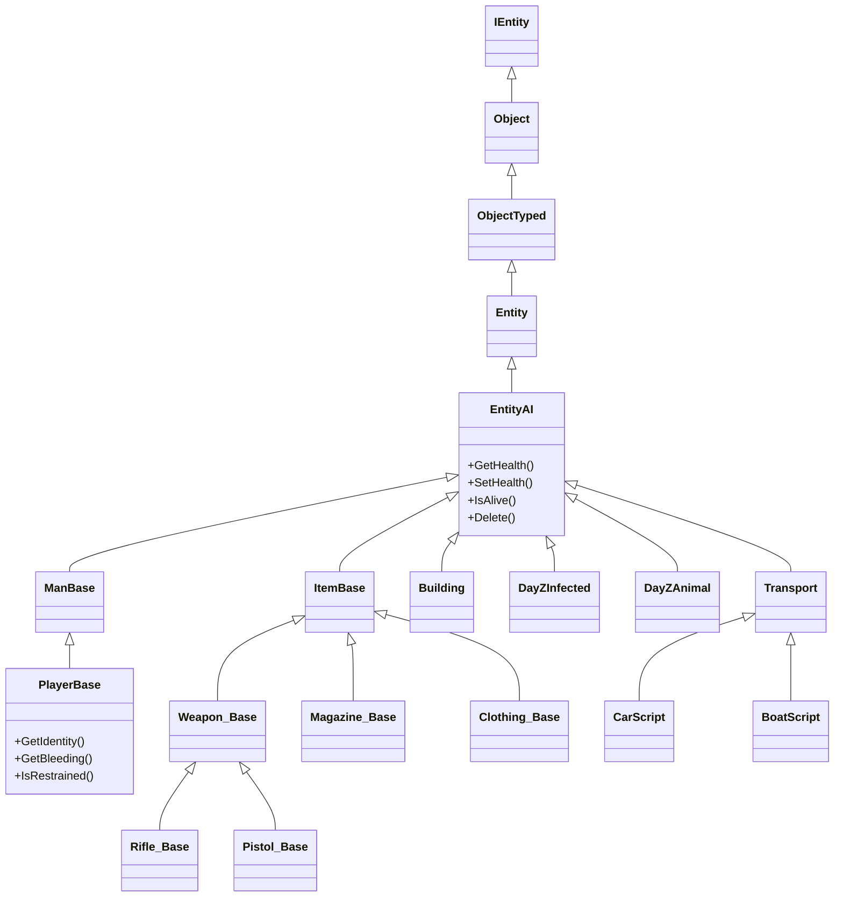

# Kapitel 6.1: Entitätssystem

[Startseite](../README.md) | **Entitätssystem** | [Weiter: Fahrzeuge >>](02-vehicles.md)

---

## Einführung

Jedes Objekt in der DayZ-Welt --- Items, Spieler, Zombies, Tiere, Gebäude, Fahrzeuge --- stammt von einer einzelnen Klassenhierarchie ab, die bei `IEntity` wurzelt. Das Verständnis dieser Hierarchie und der auf jeder Ebene verfügbaren Methoden ist die Grundlage allen DayZ-Moddings. Dieses Kapitel ist eine API-Referenz für die Kern-Entitätsklassen: welche Methoden existieren, welche Signaturen sie haben und wie man sie korrekt verwendet.

---

## Klassenhierarchie

```
Class (Wurzel aller Enforce-Script-Klassen)
└── Managed
    └── IEntity                              // 1_Core/proto/enentity.c
        └── Object                           // 3_Game/entities/object.c
            └── ObjectTyped
                └── Entity
                    └── EntityAI             // 3_Game/entities/entityai.c
                        ├── InventoryItem    // 3_Game/entities/inventoryitem.c
                        │   └── ItemBase     // 4_World/entities/itembase.c
                        │       ├── Weapon_Base, Magazine_Base
                        │       └── (alle Inventar-Items)
                        ├── Man              // 3_Game/entities/man.c
                        │   └── DayZPlayer
                        │       └── DayZPlayerImplement
                        │           └── ManBase
                        │               └── PlayerBase  // 4_World/entities/manbase/playerbase.c
                        ├── Building         // 3_Game/entities/building.c
                        ├── DayZInfected
                        │   └── ZombieBase   // 4_World/entities/creatures/infected/zombiebase.c
                        ├── DayZAnimal
                        │   └── AnimalBase   // 4_World
                        └── AdvancedCommunication
```

Wichtige Punkte:

- **IEntity** ist die Engine-Level-Basis. Sie bietet Transform-, Physik- und Hierarchie-Methoden.
- **Object** fügt Positions-/Orientierungs-Helfer, Gesundheit, Config-Zugriff, versteckte Selektionen und Typpruefung hinzu (`IsMan()`, `IsBuilding()`, etc.).
- **EntityAI** fügt Inventar, Schadenszonen, Anbauteile, Energiemanager, Netz-Sync-Variablen und Lebenszyklus-Events hinzu (`EEInit`, `EEKilled`, `EEHitBy`).
- **ItemBase**, **PlayerBase**, **ZombieBase** und **AnimalBase** sind die konkreten Basisklassen, mit denen Sie täglich arbeiten.

---

## IEntity

**Datei:** `1_Core/proto/enentity.c`

Die engine-native Entität. Alle proto-nativen Methoden --- Sie können deren Implementierung im Skript nicht einsehen.

### Transform



| Methode | Signatur | Beschreibung |
|--------|-----------|-------------|
| `GetOrigin` | `proto native vector GetOrigin()` | Weltposition der Entität |
| `SetOrigin` | `proto native external void SetOrigin(vector orig)` | Weltposition setzen |
| `GetYawPitchRoll` | `proto native vector GetYawPitchRoll()` | Rotation als Yaw/Pitch/Roll in Grad |
| `GetTransform` | `proto native external void GetTransform(out vector mat[4])` | Vollständige 4x3-Transformationsmatrix |
| `SetTransform` | `proto native external void SetTransform(vector mat[4])` | Vollständige Transformation setzen |

### Koordinatenkonvertierung

| Methode | Signatur | Beschreibung |
|--------|-----------|-------------|
| `VectorToParent` | `proto native vector VectorToParent(vector vec)` | Richtung von lokal nach Weltraum transformieren |
| `CoordToParent` | `proto native vector CoordToParent(vector coord)` | Punkt von lokal nach Weltraum transformieren |
| `VectorToLocal` | `proto native vector VectorToLocal(vector vec)` | Richtung von Welt nach Lokalraum transformieren |
| `CoordToLocal` | `proto native vector CoordToLocal(vector coord)` | Punkt von Welt nach Lokalraum transformieren |

### Hierarchie

| Methode | Signatur | Beschreibung |
|--------|-----------|-------------|
| `AddChild` | `proto native external void AddChild(IEntity child, int pivot, bool positionOnly = false)` | Kind-Entität an einen Knochen-Pivot anhängen |
| `RemoveChild` | `proto native external void RemoveChild(IEntity child, bool keepTransform = false)` | Kind-Entität lösen |
| `GetParent` | `proto native IEntity GetParent()` | Eltern-Entität (oder null) |
| `GetChildren` | `proto native IEntity GetChildren()` | Erste Kind-Entität |
| `GetSibling` | `proto native IEntity GetSibling()` | Nächste Geschwister-Entität |

### Events

| Methode | Signatur | Beschreibung |
|--------|-----------|-------------|
| `SetEventMask` | `proto native external void SetEventMask(EntityEvent e)` | Event-Callbacks aktivieren |
| `ClearEventMask` | `proto native external void ClearEventMask(EntityEvent e)` | Event-Callbacks deaktivieren |
| `SetFlags` | `proto native external EntityFlags SetFlags(EntityFlags flags, bool recursivelyApply)` | Entitäts-Flags setzen (VISIBLE, SOLID, etc.) |
| `ClearFlags` | `proto native external EntityFlags ClearFlags(EntityFlags flags, bool recursivelyApply)` | Entitäts-Flags löschen |

### Event-Callbacks

Diese werden von der Engine aufgerufen, wenn die entsprechende Event-Maske gesetzt ist:

```c
// Pro-Frame-Callback (erfordert EntityEvent.FRAME)
event protected void EOnFrame(IEntity other, float timeSlice);

// Kontakt-Callback (erfordert EntityEvent.CONTACT)
event protected void EOnContact(IEntity other, Contact extra);

// Trigger-Callbacks (erfordert EntityEvent.ENTER / EntityEvent.LEAVE)
event protected void EOnEnter(IEntity other, int extra);
event protected void EOnLeave(IEntity other, int extra);
```

---

## Object

**Datei:** `3_Game/entities/object.c` (1455 Zeilen)

Basisklasse für alle räumlichen Objekte in der Spielwelt. Dies ist die erste im Skript zugängliche Ebene der Hierarchie --- `IEntity` ist rein engine-nativ.

### Position & Orientierung

```c
proto native void SetPosition(vector pos);
proto native vector GetPosition();
proto native void SetOrientation(vector ori);     // ori = "yaw pitch roll" in Grad
proto native vector GetOrientation();              // gibt "yaw pitch roll" zurück
proto native void SetDirection(vector direction);
proto native vector GetDirection();                // Vorwärtsrichtungsvektor
```

**Beispiel --- ein Objekt teleportieren:**

```c
Object obj = GetSomeObject();
vector newPos = Vector(6543.0, 0, 2872.0);
newPos[1] = GetGame().SurfaceY(newPos[0], newPos[2]);
obj.SetPosition(newPos);
```

### Gesundheit & Schaden

```c
// Zonenbasiertes Gesundheitssystem. Verwenden Sie "" für globale Zone, "Health" für Standard-Gesundheitstyp.
proto native float GetHealth(string zoneName, string healthType);
proto native float GetMaxHealth(string zoneName, string healthType);
proto native void  SetHealth(string zoneName, string healthType, float value);
proto native void  SetHealthMax(string zoneName, string healthType);
proto native void  DecreaseHealth(string zoneName, string healthType, float value,
                                   bool auto_delete = false);
proto native void  AddHealth(string zoneName, string healthType, float value);
proto native void  SetAllowDamage(bool val);
proto native bool  GetAllowDamage();
```

| Parameter | Bedeutung |
|-----------|---------|
| `zoneName` | Schadenszonenname (z.B. `""` für global, `"Engine"`, `"FuelTank"`, `"LeftArm"`) |
| `healthType` | Typ der Gesundheitsstatistik (normalerweise `"Health"`, aber auch `"Blood"`, `"Shock"` für Spieler) |

**Beispiel --- ein Item auf halbe Gesundheit setzen:**

```c
float maxHP = obj.GetMaxHealth("", "Health");
obj.SetHealth("", "Health", maxHP * 0.5);
```

### IsAlive

```c
proto native bool IsAlive();
```

> **Fallstrick:** Die Vanilla-Referenz zeigt `IsAlive()` auf `Object`, aber in der Praxis haben viele Modder festgestellt, dass es auf der Basis-`Object`-Klasse unzuverlässig ist. Das sichere Muster ist, zuerst zu `EntityAI` zu casten:

```c
EntityAI eai;
if (Class.CastTo(eai, obj) && eai.IsAlive())
{
    // Bestätigt lebendig
}
```

### Typpruefung

```c
proto native bool IsMan();
proto native bool IsDayZCreature();
proto native bool IsBuilding();
proto native bool IsTransport();
proto native bool IsKindOf(string type);     // Config-Vererbung prüfen
```

**Beispiel:**

```c
if (obj.IsKindOf("Weapon_Base"))
{
    Print("Dies ist eine Waffe!");
}
```

### Typ & Anzeigename

```c
// GetType() gibt den Config-Klassennamen zurück (z.B. "AKM", "SurvivorM_Mirek")
string GetType();

// GetDisplayName() gibt den lokalisierten Anzeigenamen zurück
string GetDisplayName();
```

### Skalierung

```c
proto native void  SetScale(float scale);
proto native float GetScale();
```

### Knochenpositionen

```c
proto native vector GetBonePositionLS(int pivot);   // Lokaler Raum
proto native vector GetBonePositionMS(int pivot);   // Modellraum
proto native vector GetBonePositionWS(int pivot);   // Weltraum
```

### Versteckte Selektionen (Textur-/Materialwechsel)

```c
TStringArray GetHiddenSelections();
TStringArray GetHiddenSelectionsTextures();
TStringArray GetHiddenSelectionsMaterials();
```

### Config-Zugriff (auf der Entität selbst)

```c
proto native bool   ConfigGetBool(string entryName);
proto native int    ConfigGetInt(string entryName);
proto native float  ConfigGetFloat(string entryName);
proto native owned string ConfigGetString(string entryName);
proto native void   ConfigGetTextArray(string entryName, out TStringArray values);
proto native void   ConfigGetIntArray(string entryName, out TIntArray values);
proto native void   ConfigGetFloatArray(string entryName, out TFloatArray values);
proto native bool   ConfigIsExisting(string entryName);
```

### Netzwerk-ID

```c
proto native int GetNetworkID(out int id_low, out int id_high);
```

### Löschung

```c
void Delete();                    // Verzögerte Löschung (nächster Frame, über CallQueue)
proto native bool ToDelete();     // Ist dieses Objekt zum Löschen markiert?
```

### Geometrie & Komponenten

```c
proto native owned string GetActionComponentName(int componentIndex, string geometry = "");
proto native owned vector GetActionComponentPosition(int componentIndex, string geometry = "");
proto native owned string GetDamageZoneNameByComponentIndex(int componentIndex);
proto native vector GetBoundingCenter();
```

---

## EntityAI

**Datei:** `3_Game/entities/entityai.c` (4719 Zeilen)

Die Arbeitstier-Basis für alle interaktiven Spielentitäten. Fügt Inventar, Schadensevents, Temperatur, Energiemanagement und Netzwerksynchronisation hinzu.

### Inventarzugriff

```c
proto native GameInventory GetInventory();
```

Häufige Inventaroperationen über das zurückgegebene `GameInventory`:

```c
// Alle Items im Inventar dieser Entität aufzählen
array<EntityAI> items = new array<EntityAI>;
eai.GetInventory().EnumerateInventory(InventoryTraversalType.PREORDER, items);

// Items zählen
int count = eai.GetInventory().CountInventory();

// Prüfen ob Entität ein bestimmtes Item hat
bool has = eai.GetInventory().HasEntityInInventory(someItem);

// Item in Fracht erstellen
EntityAI newItem = eai.GetInventory().CreateEntityInCargo("BandageDressing");

// Item als Anbauteil erstellen
EntityAI attachment = eai.GetInventory().CreateAttachment("ACOGOptic");

// Anbauteil nach Slotname finden
EntityAI att = eai.GetInventory().FindAttachmentByName("Hands");

// Anbauteilanzahl und Iteration
int attCount = eai.GetInventory().AttachmentCount();
for (int i = 0; i < attCount; i++)
{
    EntityAI att = eai.GetInventory().GetAttachmentFromIndex(i);
}
```

### Schadenssystem

```c
proto native void SetHealth(string zoneName, string healthType, float value);
proto native float GetHealth(string zoneName, string healthType);
proto native float GetMaxHealth(string zoneName, string healthType);
proto native void SetHealthMax(string zoneName, string healthType);
proto native void DecreaseHealth(string zoneName, string healthType, float value,
                                  bool auto_delete = false);
proto native void ProcessDirectDamage(int damageType, EntityAI source, string component,
                                       string ammoType, vector modelPos,
                                       float damageCoef = 1.0, int flags = 0);
```

### Lebenszyklus-Events

Überschreiben Sie diese in Ihrer Unterklasse, um sich in den Entitäts-Lebenszyklus einzuklinken:

```c
void EEInit();                                    // Wird nach der Entitäts-Initialisierung aufgerufen
void EEDelete(EntityAI parent);                   // Wird vor dem Löschen aufgerufen
void EEKilled(Object killer);                     // Wird aufgerufen wenn die Entität stirbt
void EEHitBy(TotalDamageResult damageResult,      // Wird aufgerufen wenn die Entität Schaden nimmt
             int damageType, EntityAI source,
             int component, string dmgZone,
             string ammo, vector modelPos,
             float speedCoef);
void EEItemAttached(EntityAI item, string slot_name);   // Anbauteil hinzugefügt
void EEItemDetached(EntityAI item, string slot_name);   // Anbauteil entfernt
```

### Netzwerk-Sync-Variablen

Registrieren Sie Variablen im Konstruktor, um sie automatisch zwischen Server und Client zu synchronisieren:

```c
proto native void RegisterNetSyncVariableBool(string variableName);
proto native void RegisterNetSyncVariableInt(string variableName, int minValue = 0, int maxValue = 0);
proto native void RegisterNetSyncVariableFloat(string variableName, float minValue = 0, float maxValue = 0);
```

Überschreiben Sie `OnVariablesSynchronized()` auf dem Client, um auf Änderungen zu reagieren:

```c
void OnVariablesSynchronized();
```

**Beispiel --- synchronisierte Zustandsvariable:**

```c
class MyItem extends ItemBase
{
    protected int m_State;

    void MyItem()
    {
        RegisterNetSyncVariableInt("m_State", 0, 5);
    }

    override void OnVariablesSynchronized()
    {
        super.OnVariablesSynchronized();
        // Visuals basierend auf m_State aktualisieren
        UpdateVisualState();
    }
}
```

### Energiemanager

```c
proto native ComponentEnergyManager GetCompEM();
```

Verwendung:

```c
ComponentEnergyManager em = eai.GetCompEM();
if (em)
{
    bool working = em.IsWorking();
    float energy = em.GetEnergy();
    em.SwitchOn();
    em.SwitchOff();
}
```

### ScriptInvokers (Event-Hooks)

```c
protected ref ScriptInvoker m_OnItemAttached;
protected ref ScriptInvoker m_OnItemDetached;
protected ref ScriptInvoker m_OnItemAddedIntoCargo;
protected ref ScriptInvoker m_OnItemRemovedFromCargo;
protected ref ScriptInvoker m_OnHitByInvoker;
protected ref ScriptInvoker m_OnKilledInvoker;
```

### Typpruefungen

```c
bool IsItemBase();
bool IsClothing();
bool IsContainer();
bool IsWeapon();
bool IsMagazine();
bool IsTransport();
bool IsFood();
```

### Entitäten spawnen

```c
EntityAI SpawnEntityOnGroundPos(string object_name, vector pos);
EntityAI SpawnEntity(string object_name, notnull InventoryLocation inv_loc,
                     int iSetupFlags, int iRotation);
```

---

## ItemBase

**Datei:** `4_World/entities/itembase.c` (4986 Zeilen)

Basis für alle Inventar-Items. `typedef ItemBase Inventory_Base;` wird im gesamten Vanilla-Code verwendet.

### Mengensystem

```c
void  SetQuantity(float value, bool destroy_config = true, bool destroy_forced = false);
float GetQuantity();
int   GetQuantityMin();
int   GetQuantityMax();
float GetQuantityNormalized();   // 0.0 - 1.0
bool  CanBeSplit();
void  SplitIntoStackMax(EntityAI destination_entity, int slot_id, PlayerBase player);
```

**Beispiel --- eine Feldflasche fuellen:**

```c
ItemBase canteen = ItemBase.Cast(player.GetInventory().CreateInInventory("Canteen"));
if (canteen)
{
    canteen.SetQuantity(canteen.GetQuantityMax());
}
```

### Zustand / Nässe / Temperatur

```c
// Nässe
float m_VarWet, m_VarWetMin, m_VarWetMax;

// Temperatur
float m_VarTemperature;

// Sauberkeit
int m_Cleanness;

// Flüssigkeit
int m_VarLiquidType;
```

### Aktionen

```c
void SetActions();                     // Überschreiben um Aktionen für dieses Item zu registrieren
void AddAction(typename actionName);   // Eine Aktion registrieren
void RemoveAction(typename actionName);
```

**Beispiel --- eigenes Item mit Aktion:**

```c
class MyItem extends ItemBase
{
    override void SetActions()
    {
        super.SetActions();
        AddAction(ActionDrinkSelf);
    }
}
```

### Sound

```c
void PlaySoundSet(out EffectSound effect_sound, string sound_set,
                  float fade_in, float fade_out);
void PlaySoundSetLoop(out EffectSound effect_sound, string sound_set,
                      float fade_in, float fade_out);
void StopSoundSet(EffectSound effect_sound);
```

### Wirtschaft / Persistenz

```c
override void InitItemVariables();     // Liest alle Config-Werte (Menge, Nässe, etc.)
```

Items erben CE (Central Economy) Lebensdauer und Persistenz aus ihrem `types.xml`-Eintrag. Verwenden Sie das `ECE_NOLIFETIME`-Flag beim Erstellen von Objekten, die nie despawnen sollen.

---

## PlayerBase

**Datei:** `4_World/entities/manbase/playerbase.c` (9776 Zeilen)

Die Spieler-Entität. Die größte Klasse in der Codebasis.

### Identität

```c
PlayerIdentity GetIdentity();
```

Von `PlayerIdentity`:

```c
string GetName();       // Steam/Plattform-Anzeigename
string GetId();         // Eindeutige Spieler-ID (BI-ID)
string GetPlainId();    // Steam64-ID
int    GetPlayerId();   // Sitzungs-Spieler-ID (int)
```

**Beispiel --- Spielerinfo auf dem Server abrufen:**

```c
PlayerBase player;  // aus Event
PlayerIdentity identity = player.GetIdentity();
if (identity)
{
    string name = identity.GetName();
    string steamId = identity.GetPlainId();
    Print(string.Format("Spieler: %1 (Steam: %2)", name, steamId));
}
```

### Gesundheit / Blut / Schock

Der Spieler verwendet das zonenbasierte Gesundheitssystem von EntityAI mit speziellen Gesundheitstypen:

```c
// Globale Gesundheit (standardmäßig 0-100)
float hp = player.GetHealth("", "Health");

// Blut (0-5000)
float blood = player.GetHealth("", "Blood");

// Schock (0-100)
float shock = player.GetHealth("", "Shock");

// Werte setzen
player.SetHealth("", "Health", 100);
player.SetHealth("", "Blood", 5000);
player.SetHealth("", "Shock", 0);
```

### Position & Inventar

```c
vector pos = player.GetPosition();
player.SetPosition(newPos);

// Item in Händen
EntityAI inHands = player.GetHumanInventory().GetEntityInHands();

// Fahrendes Fahrzeug
EntityAI vehicle = player.GetDrivingVehicle();
bool inVehicle = player.IsInVehicle();
```

### Zustandspruefungen

```c
bool IsAlive();
bool IsUnconscious();
bool IsRestrained();
bool IsInVehicle();
```

### Manager

`PlayerBase` hält Referenzen auf viele Gameplay-Subsysteme:

```c
ref ModifiersManager   m_ModifiersManager;
ref ActionManagerBase  m_ActionManager;
ref PlayerAgentPool    m_AgentPool;
ref Environment        m_Environment;
ref EmoteManager       m_EmoteManager;
ref StaminaHandler     m_StaminaHandler;
ref WeaponManager      m_WeaponManager;
```

### Server-Lebenszyklus-Events

```c
void OnConnect();
void OnDisconnect();
void OnScheduledTick(float deltaTime);
override void OnRPC(PlayerIdentity sender, int rpc_type, ParamsReadContext ctx);
```

### Items in der Nähe des Spielers spawnen

```c
EntityAI SpawnEntityOnGroundOnCursorDir(string object_name, float distance);
```

---

## ZombieBase

**Datei:** `4_World/entities/creatures/infected/zombiebase.c` (1150 Zeilen)

Basis für alle Infizierten (Zombie)-Entitäten.

### Wichtige Eigenschaften

```c
protected int   m_MindState;       // KI-Zustand (-1 bis 4)
protected float m_MovementSpeed;   // Bewegungsgeschwindigkeit (-1 bis 3)
protected bool  m_IsCrawling;      // Kriechender Zombie
```

### Initialisierung

```c
void Init()
{
    RegisterNetSyncVariableInt("m_MindState", -1, 4);
    RegisterNetSyncVariableFloat("m_MovementSpeed", -1, 3);
    RegisterNetSyncVariableBool("m_IsCrawling");

    m_TargetableObjects.Insert(PlayerBase);
    m_TargetableObjects.Insert(AnimalBase);
}
```

---

## AnimalBase

**Datei:** `4_World/entities/creatures/animals/`

Basis für alle Tier-Entitäten. Erweitert `DayZAnimal`, das `EntityAI` erweitert.

Tiere verwenden dieselben Gesundheits-, Positions- und Schadens-APIs wie andere Entitäten. Ihr Verhalten wird durch das KI-System und CE-konfigurierte Territoriumsdateien gesteuert.

---

## Entitäten erstellen

### GetGame().CreateObject()

```c
proto native Object CreateObject(string type, vector pos,
                                  bool create_local = false,
                                  bool init_ai = false,
                                  bool create_physics = true);
```

| Parameter | Beschreibung |
|-----------|-------------|
| `type` | Config-Klassenname (z.B. `"AKM"`, `"ZmbF_JournalistNormal_Blue"`) |
| `pos` | Weltposition |
| `create_local` | `true` = nur Client, nicht zum Server repliziert |
| `init_ai` | `true` = KI initialisieren (für Zombies, Tiere) |
| `create_physics` | `true` = Kollisionsgeometrie erstellen |

**Beispiel:**

```c
Object obj = GetGame().CreateObject("AKM", player.GetPosition(), false, false, true);
```

### GetGame().CreateObjectEx()

```c
proto native Object CreateObjectEx(string type, vector pos, int iFlags,
                                    int iRotation = RF_DEFAULT);
```

Dies ist die bevorzugte API. Der `iFlags`-Parameter verwendet ECE (Entity Creation Event)-Flags.

### ECE-Flags

| Flag | Wert | Beschreibung |
|------|-------|-------------|
| `ECE_NONE` | `0` | Kein spezielles Verhalten |
| `ECE_SETUP` | `2` | Vollständiges Entitäts-Setup |
| `ECE_TRACE` | `4` | Platzierung zur Oberfläche tracen |
| `ECE_CENTER` | `8` | Zentrum aus Modellform verwenden |
| `ECE_UPDATEPATHGRAPH` | `32` | Navigationsmesh aktualisieren |
| `ECE_CREATEPHYSICS` | `1024` | Physik/Kollision erstellen |
| `ECE_INITAI` | `2048` | KI initialisieren |
| `ECE_EQUIP_ATTACHMENTS` | `8192` | Konfigurierte Anbauteile spawnen |
| `ECE_EQUIP_CARGO` | `16384` | Konfigurierte Fracht spawnen |
| `ECE_EQUIP` | `24576` | `ATTACHMENTS + CARGO` |
| `ECE_LOCAL` | `1073741824` | Nur lokal erstellen (nicht repliziert) |
| `ECE_NOSURFACEALIGN` | `262144` | Nicht an Oberflächennormale ausrichten |
| `ECE_KEEPHEIGHT` | `524288` | Y-Position beibehalten (kein Trace) |
| `ECE_NOLIFETIME` | `4194304` | Keine CE-Lebensdauer (wird nicht despawnen) |
| `ECE_DYNAMIC_PERSISTENCY` | `33554432` | Nur persistent nach Spielerinteraktion |

### Vordefinierte Flag-Kombinationen

| Konstante | Flags | Anwendungsfall |
|----------|-------|----------|
| `ECE_IN_INVENTORY` | `CREATEPHYSICS \| KEEPHEIGHT \| NOSURFACEALIGN` | Items im Inventar erstellt |
| `ECE_PLACE_ON_SURFACE` | `CREATEPHYSICS \| UPDATEPATHGRAPH \| TRACE` | Items auf Boden platziert |
| `ECE_FULL` | `SETUP \| TRACE \| ROTATIONFLAGS \| UPDATEPATHGRAPH \| EQUIP` | Vollständiges Setup mit Ausrüstung |

### RF (Rotations)-Flags

| Flag | Wert | Beschreibung |
|------|-------|-------------|
| `RF_DEFAULT` | `512` | Standard-Config-Platzierung verwenden |
| `RF_ORIGINAL` | `128` | Standard-Config-Platzierung verwenden |
| `RF_IGNORE` | `64` | Spawnen wie das Modell erstellt wurde |
| `RF_ALL` | `63` | Alle Rotationsrichtungen |

### Häufige Muster

**Item auf dem Boden spawnen:**

```c
vector pos = player.GetPosition();
Object item = GetGame().CreateObjectEx("AKM", pos, ECE_PLACE_ON_SURFACE);
```

**Zombie mit KI spawnen:**

```c
EntityAI zombie = EntityAI.Cast(
    GetGame().CreateObjectEx("ZmbF_JournalistNormal_Blue", pos,
                              ECE_PLACE_ON_SURFACE | ECE_INITAI)
);
```

**Persistentes Gebäude spawnen:**

```c
int flags = ECE_SETUP | ECE_UPDATEPATHGRAPH | ECE_CREATEPHYSICS | ECE_NOLIFETIME;
Object building = GetGame().CreateObjectEx("Land_House", pos, flags, RF_IGNORE);
```

**Nur lokal spawnen (clientseitig):**

```c
Object local = GetGame().CreateObjectEx("HelpDeskItem", pos, ECE_LOCAL | ECE_CREATEPHYSICS);
```

**Item direkt ins Spielerinventar spawnen:**

```c
EntityAI item = player.GetInventory().CreateInInventory("BandageDressing");
```

---

## Entitäten zerstören

### Object.Delete()

```c
void Delete();
```

Verzögerte Löschung --- das Objekt wird im nächsten Frame über `CallQueue` entfernt. Dies ist der sicherste Weg, Objekte zu löschen, da es Probleme beim Löschen von Objekten vermeidet, während sie iteriert werden.

### GetGame().ObjectDelete()

```c
proto native void ObjectDelete(Object obj);
```

Sofortige server-autoritative Löschung. Entfernt das Objekt vom Server und repliziert die Entfernung an alle Clients.

### GetGame().ObjectDeleteOnClient()

```c
proto native void ObjectDeleteOnClient(Object obj);
```

Löscht das Objekt nur auf Clients. Der Server behält das Objekt weiterhin.

**Beispiel --- gespawnte Objekte aufräumen:**

```c
// Bevorzugt: verzögertes Löschen
obj.Delete();

// Sofort: wenn es sofort weg sein muss
GetGame().ObjectDelete(obj);
```

---

## Praxisbeispiele

### Alle Spieler in der Nähe einer Position finden

```c
void FindNearbyPlayers(vector center, float radius, out array<PlayerBase> result)
{
    result = new array<PlayerBase>;
    array<Man> allPlayers = new array<Man>;
    GetGame().GetPlayers(allPlayers);

    foreach (Man man : allPlayers)
    {
        if (vector.Distance(man.GetPosition(), center) <= radius)
        {
            PlayerBase pb;
            if (Class.CastTo(pb, man))
            {
                result.Insert(pb);
            }
        }
    }
}
```

### Eine voll ausgerüstete Waffe spawnen

```c
void SpawnEquippedAKM(vector pos)
{
    EntityAI weapon = EntityAI.Cast(
        GetGame().CreateObjectEx("AKM", pos, ECE_PLACE_ON_SURFACE)
    );
    if (!weapon)
        return;

    // Anbauteile hinzufügen
    weapon.GetInventory().CreateAttachment("AK_WoodBttstck");
    weapon.GetInventory().CreateAttachment("AK_WoodHndgrd");

    // Magazin in Fracht erstellen
    weapon.GetInventory().CreateEntityInCargo("Mag_AKM_30Rnd");
}
```

### Eine Entität beschädigen und töten

```c
void DamageEntity(EntityAI target, float amount)
{
    float currentHP = target.GetHealth("", "Health");
    float newHP = currentHP - amount;

    if (newHP <= 0)
    {
        target.SetHealth("", "Health", 0);
        // EEKilled wird automatisch von der Engine aufgerufen
    }
    else
    {
        target.SetHealth("", "Health", newHP);
    }
}
```

---

## Zusammenfassung

| Konzept | Kernpunkt |
|---------|-----------|
| Hierarchie | `IEntity` > `Object` > `EntityAI` > `ItemBase` / `PlayerBase` / `ZombieBase` |
| Position | `GetPosition()` / `SetPosition()` ab `Object` aufwärts verfügbar |
| Gesundheit | Zonenbasiert: `GetHealth(zone, type)` / `SetHealth(zone, type, value)` |
| IsAlive | Auf `EntityAI` verwenden oder vorher casten: `EntityAI eai; Class.CastTo(eai, obj)` |
| Inventar | `eai.GetInventory()` gibt `GameInventory` mit vollständigem CRUD zurück |
| Erstellen | `GetGame().CreateObjectEx(type, pos, ECE_flags)` ist die bevorzugte API |
| Löschen | `obj.Delete()` (verzögert) oder `GetGame().ObjectDelete(obj)` (sofort) |
| Netz-Sync | `RegisterNetSyncVariable*()` im Konstruktor, reagieren in `OnVariablesSynchronized()` |
| Typpruefung | `obj.IsKindOf("ClassName")`, `obj.IsMan()`, `obj.IsBuilding()` |

---

[Startseite](../README.md) | **Entitätssystem** | [Weiter: Fahrzeuge >>](02-vehicles.md)
