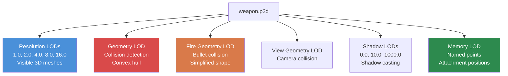

# Chapter 4.2: 3D Models (.p3d)

[Home](../README.md) | [<< Previous: Textures](01-textures.md) | **3D Models** | [Next: Materials >>](03-materials.md)

---

## Introduction

Every physical object in DayZ -- weapons, clothing, buildings, vehicles, trees, rocks -- is a 3D model stored in Bohemia's proprietary **P3D** format. The P3D format is far more than a mesh container: it encodes multiple levels of detail, collision geometry, animation selections, memory points for attachments and effects, and proxy positions for mountable items. Understanding how P3D files work and how to create them with **Object Builder** is essential for any mod that adds physical items to the game world.

This chapter covers the P3D format structure, the LOD system, named selections, memory points, the proxy system, animation configuration via `model.cfg`, and the import workflow from standard 3D formats.

---

## Table of Contents

- [P3D Format Overview](#p3d-format-overview)
- [Object Builder](#object-builder)
- [The LOD System](#the-lod-system)
- [Named Selections](#named-selections)
- [Memory Points](#memory-points)
- [The Proxy System](#the-proxy-system)
- [Model.cfg for Animations](#modelcfg-for-animations)
- [Importing from FBX/OBJ](#importing-from-fbxobj)
- [Common Model Types](#common-model-types)
- [Common Mistakes](#common-mistakes)
- [Best Practices](#best-practices)

---

## P3D Format Overview

**P3D** (Point 3D) is Bohemia Interactive's binary 3D model format, inherited from the Real Virtuality engine and carried forward into Enfusion. It is a compiled, engine-ready format -- you do not write P3D files by hand.

### Key Characteristics

- **Binary format:** Not human-readable. Created and edited exclusively with Object Builder.
- **Multi-LOD container:** A single P3D file contains multiple LOD (Level of Detail) meshes, each with a different purpose.
- **Engine-native:** The DayZ engine loads P3D directly. No runtime conversion occurs.
- **Binarized vs. unbinarized:** Source P3D files from Object Builder are "MLOD" (editable). Binarize converts them to "ODOL" (optimized, read-only). The game can load both, but ODOL loads faster and is smaller.

### File Types You Will Encounter

| Extension | Description |
|-----------|-------------|
| `.p3d` | 3D model (both MLOD source and ODOL binarized) |
| `.rtm` | Runtime Motion -- animation keyframe data |
| `.bisurf` | Surface properties file (used alongside P3D) |

### MLOD vs. ODOL

| Property | MLOD (Source) | ODOL (Binarized) |
|----------|---------------|-------------------|
| Created by | Object Builder | Binarize |
| Editable | Yes | No |
| File size | Larger | Smaller |
| Load speed | Slower | Faster |
| Used during | Development | Release |
| Contains | Full edit data, named selections | Optimized mesh data |

> **Important:** When you pack a PBO with binarization enabled, your MLOD P3D files are automatically converted to ODOL. If you pack with `-packonly`, the MLOD files are included as-is. Both work in-game, but ODOL is preferred for release builds.

---

## Object Builder

**Object Builder** is the Bohemia-provided tool for creating and editing P3D models. It is included in the DayZ Tools suite on Steam.

### Core Capabilities

- Create and edit 3D meshes with vertices, edges, and faces.
- Define multiple LODs within a single P3D file.
- Assign **named selections** (groups of vertices/faces) for animation and texture control.
- Place **memory points** for attachment positions, particle origins, and sound sources.
- Add **proxy objects** for attachable items (magazines, optics, etc.).
- Assign materials (`.rvmat`) and textures (`.paa`) to faces.
- Import meshes from FBX, OBJ, and 3DS formats.
- Export validated P3D files for Binarize.

### Workspace Setup

Object Builder requires the **P: drive** (workdrive) to be set up. This virtual drive provides a unified path prefix that the engine uses to locate assets.

```
P:\
  DZ\                        <-- Vanilla DayZ data (extracted)
  DayZ Tools\                <-- Tools installation
  MyMod\                     <-- Your mod's source directory
    data\
      models\
        my_item.p3d
      textures\
        my_item_co.paa
```

All paths in P3D files and materials are relative to the P: drive root. For example, a material reference inside the model would be `MyMod\data\textures\my_item_co.paa`.

### Basic Workflow in Object Builder

1. **Create or import** your mesh geometry.
2. **Define LODs** -- at minimum, create Resolution, Geometry, and Fire Geometry LODs.
3. **Assign materials** to faces in the Resolution LOD.
4. **Name selections** for any parts that animate, swap textures, or need code interaction.
5. **Place memory points** for attachments, muzzle flash positions, ejection ports, etc.
6. **Add proxies** for items that can be attached (optics, magazines, suppressors).
7. **Validate** using Object Builder's built-in validation (Structure --> Validate).
8. **Save** as P3D.
9. **Build** via Binarize or AddonBuilder.

---

## The LOD System

A P3D file contains multiple **LODs** (Levels of Detail), each serving a specific purpose. The engine selects which LOD to use based on the situation -- distance from camera, physics calculations, shadow rendering, etc.

### LOD Types

Every LOD is identified by a single floating-point **resolution value**. The engine
decides what kind of LOD it is purely from that number -- the friendly name shown in
Object Builder is derived from it.

| LOD | Resolution Value | Purpose |
|-----|-----------------|---------|
| **Resolution 0** | 1.000 | Highest detail visual mesh. Rendered when the object is close to the camera. |
| **Resolution 1, 2, 3...** | Author-chosen, ascending | Progressively lower detail. The value is a distance metric, not a fixed series -- vanilla models commonly use 1.0 / 2.0 / 3.0 / 4.0. |
| **Geometry** | 1e13 | Physics collision. Used for movement collision, gravity, placement. Must be convex or composed of convex decomposition. |
| **Memory** | 1e15 | Contains named points (no visible geometry). Used for attachment positions, sound origins, animation axes. |
| **LandContact** | 2e15 | Contact points that decide how the object rests on terrain. |
| **Roadway** | 3e15 | Defines walkable surfaces on objects (vehicles, buildings with enterable interiors). |
| **Paths** | 4e15 | AI pathfinding hints for buildings. |
| **HitPoints** | 5e15 | Per-part damage zones (`dmgZones`). |
| **View Geometry** | 6e15 | Determines what blocks the player's view, and what the action/cursor raycast can hit. Simplified mesh. |
| **Fire Geometry** | 7e15 | Collision for bullets and projectiles. Must be convex or composed of convex parts. |
| **Shadow 0** | 10000 | Shadow casting mesh (close range). |
| **Shadow 1000** | 11000 | Shadow casting mesh (far range). Simpler than Shadow 0. |

Shadow volume resolutions observed in vanilla are `10000` and `11000`, consistent with a
`10000 + <shadow level>` pattern.

> **Verified:** these values were read from debinarized vanilla models with a MLOD
> reader. `dz\structures\residential\houses\house_2b02.p3d` alone carries 11 LODs (1.0,
> 2.0, 3.0, 4.0, Geometry, Memory, Roadway, Paths, HitPoints, View Geometry, Fire
> Geometry); `dz\gear\camping\wooden_log.p3d` carries eight. LandContact and the shadow
> volumes were confirmed separately on a wider set of vanilla buildings, ladders and
> props (`residential\misc\ladder.p3d`, `industrial\garages\garage_small.p3d`,
> `industrial\farms\barn_wood1.p3d`, `farm_cowsheda.p3d` among others).

### Resolution Values Are Stored as 32-Bit Floats

This matters the moment you write any tooling that inspects P3D files. The resolution
is stored as a `float`, not a `double`, so reading it back gives you the nearest
representable value rather than the round number:

| LOD | Nominal | Value you actually read |
|-----|---------|------------------------|
| Geometry | `1e13` | `9999999827968.0` |
| Memory | `1e15` | `999999986991104.0` |
| Roadway | `3e15` | `3000000028082176.0` |
| Paths | `4e15` | `3999999947964416.0` |
| HitPoints | `5e15` | `5000000136282112.0` |
| View Geometry | `6e15` | `6000000056164352.0` |
| Fire Geometry | `7e15` | `6999999976046592.0` |

A test like `resolution == 1e13` is therefore **always false** for a real Geometry LOD.
Classify with a relative tolerance instead -- treat the LOD as a match when
`abs(resolution - nominal) / nominal` is smaller than about `1e-3`. A classifier that
compares for equality silently reports "no Geometry LOD" and "no Fire Geometry LOD" on a
perfectly healthy model.

### LOD Hierarchy



### LOD Resolution Values (Visual LODs)

The engine uses a formula based on distance and object size to determine which visual LOD to render:

```
LOD selected = (distance_to_object * LOD_factor) / object_bounding_sphere_radius
```

Lower values = closer camera. The engine finds the LOD whose resolution value is the closest match to the calculated value.

### Creating LODs in Object Builder

1. **File --> New LOD** or right-click the LOD list.
2. Select the LOD type from the dropdown.
3. For visual LODs (Resolution), enter the resolution value.
4. Model the geometry for that LOD.

### LOD Requirements by Item Type

| Item Type | Required LODs | Recommended Additional LODs |
|-----------|---------------|----------------------------|
| **Handheld item** | Resolution 0, Geometry, Fire Geometry, Memory | Shadow 0, Resolution 1 |
| **Clothing** | Resolution 0, Geometry, Fire Geometry, Memory | Shadow 0, Resolution 1, Resolution 2 |
| **Weapon** | Resolution 0, Geometry, Fire Geometry, View Geometry, Memory | Shadow 0, Resolution 1, Resolution 2 |
| **Building** | Resolution 0, Geometry, Fire Geometry, View Geometry, Memory | Shadow 0, Shadow 1000, Roadway, Paths |
| **Vehicle** | Resolution 0, Geometry, Fire Geometry, View Geometry, Memory | Shadow 0, Roadway, Resolution 1+ |

### Geometry LOD Rules

The Geometry and Fire Geometry LODs have strict requirements:

- **Must be convex** or composed of multiple convex components. The engine's physics system requires convex collision shapes.
- **Named selections must match** those in the Resolution LOD (for animated parts).
- **Mass must be defined.** Select all vertices in the Geometry LOD and assign mass via **Structure --> Mass**. This determines the object's physical weight.
- **Keep it simple.** Fewer triangles = better physics performance. A weapon's geometry LOD might have 20-50 triangles vs. thousands in the visual LOD.

---

## Named Selections

Named selections are groups of vertices, edges, or faces within a LOD that are tagged with a name. They serve as handles that the engine and scripts use to manipulate parts of a model.

### What Named Selections Do

| Purpose | Example Selection Name | Used By |
|---------|----------------------|---------|
| **Animation** | `bolt`, `trigger`, `magazine` | `model.cfg` animation sources |
| **Texture swaps** | `camo`, `camo1`, `body` | `hiddenSelections[]` in config.cpp |
| **Damage textures** | `zbytek` | Engine damage system, material swaps |
| **Attachment points** | `magazine`, `optics`, `suppressor` | Proxy and attachment system |

### hiddenSelections (Texture Swaps)

The most common use of named selections for modders is **hiddenSelections** -- the ability to swap textures at runtime via config.cpp.

**In the P3D model (Resolution LOD):**
1. Select the faces that should be retexturable.
2. Name the selection (e.g., `camo`).

**In config.cpp:**
```cpp
class MyRifle: Rifle_Base
{
    hiddenSelections[] = {"camo"};
    hiddenSelectionsTextures[] = {"MyMod\data\my_rifle_co.paa"};
    hiddenSelectionsMaterials[] = {"MyMod\data\my_rifle.rvmat"};
};
```

This allows different variants of the same model with different textures without duplicating the P3D file.

### Creating Named Selections

In Object Builder:

1. Select the vertices or faces you want to group.
2. Go to **Structure --> Named Selections** (or press Ctrl+N).
3. Click **New**, enter the selection name.
4. Click **Assign** to tag the selected geometry with that name.

> **Tip:** Selection names are case-sensitive. `Camo` and `camo` are different selections. Convention is lowercase.

### Collision Components

The Geometry, View Geometry and Fire Geometry LODs are not one mesh. They are split into
closed convex parts, each held in its own named selection numbered in sequence:
`component01`, `component02`, and so on. The engine treats each as a single convex
collision volume, which is how a concave object gets correct collision.

Counts scale with complexity. In `house_2b02.p3d` the Geometry LOD holds 127 components,
View Geometry 113 and Fire Geometry 472; a single item such as `wooden_log.p3d` has one
per collision LOD. Numbering continues past 99 -- `component100` and above are valid.

> **Case matters, and it is not the same on both sides.** Object Builder expects
> `ComponentNN` when you author the selection, while the binarized model stores the name
> lowercased as `componentNN`. Tooling that reads a binarized model should compare
> case-insensitively.

### Named Properties

Named properties are key/value pairs attached to a LOD, set in Object Builder via
**Edit --> Named Properties**. They live in the model, not in any config, and several of
them decide engine behaviour:

| Property | Typical value | Set on | Effect |
|----------|--------------|--------|--------|
| `class` | `house` | Geometry LOD | Engine behaviour category. Required for buildings with doors. |
| `map` | `building` | Geometry LOD | Icon used for the object on the in-game map. |
| `damage` | `no` | Geometry LOD | Damage handling for the object. |
| `mass` | kilograms | Geometry LOD | Physical weight. |
| `lodnoshadow` | `1` | Resolution LODs | The LOD does not cast a shadow. |
| `canocclude` | `1` | View Geometry LOD | The LOD participates in occlusion. |
| `autocenter` | `0` | Any | Do not recentre the model on load. Required on held items so the grip point stays where you put it. |
| `drawimportance` | e.g. `0.02` | Props and proxies | Render priority for small detail objects. |

`autocenter = 0` is the one that catches people out: leave it at the default and the
engine recentres the mesh on its bounding box, which shifts every memory point you
carefully placed relative to the origin.

### Selections Across LODs

Named selections must be consistent across LODs for animations to work:

- If the `bolt` selection exists in Resolution 0, it must also exist in Geometry and Fire Geometry LODs (covering the corresponding collision geometry).
- Shadow LODs should also have the selection if the animated part should cast correct shadows.

---

## Memory Points

Memory points are named positions defined in the **Memory LOD**. They have no visual representation in-game -- they define spatial coordinates that the engine and scripts reference for positioning effects, attachments, sounds, and more.

### Common Memory Points

| Point Name | Purpose |
|------------|---------|
| `usti hlavne` | Muzzle position (where bullets originate, muzzle flash appears) |
| `konec hlavne` | End of barrel (used with `usti hlavne` to define barrel direction) |
| `nabojnicestart` | Ejection port start (where shell casings emerge) |
| `nabojniceend` | Ejection port end (direction of ejection) |
| `handguard` | Handguard attachment point |
| `magazine` | Magazine well position |
| `optics` | Optic rail position |
| `suppressor` | Suppressor mount position |
| `trigger` | Trigger position (for hand IK) |
| `pistolgrip` | Pistol grip position (for hand IK) |
| `lefthand` | Left hand grip position |
| `righthand` | Right hand grip position |
| `eye` | Eye position (for first-person view alignment) |
| `pilot` | Driver/pilot seat position (vehicles) |
| `light_l` / `light_r` | Left/right headlight positions (vehicles) |

### Memory Points on Items and Buildings

Weapons get most of the attention, but items and buildings rely on their own set of
named points. These were read from the Memory LOD of two vanilla models:

| Point Name | Found on | Purpose |
|------------|----------|---------|
| `invview` | Items | Camera framing used to render the inventory icon |
| `boundingbox_min` / `boundingbox_max` | Items | Placement and snapping volume |
| `ce_center` / `ce_radius` | Items | Central Economy placement volume |
| `doorsN` | Buildings | Identifies door number `N` |
| `doorsN_axis` | Buildings | Hinge axis -- **two** points defining the rotation line |
| `doorsN_action` | Buildings | Position where the open/close action is offered |
| `pointfloor`, `pointtable`, `pointwardrobes`, `pointstove` | Buildings | Modeller-side loot placement hints, one selection per furniture class |
| `sound_rainobjectinner2metal1_1` | Buildings | Rain impact emitter; the name encodes the surface type |

The three-part door contract is the part most often missed. A working door needs the
selection itself, plus a **two-point** `_axis` selection, plus an `_action` point. With a
missing or single-point axis the door rotates around the model origin and swings through
the wall.

The base name is yours to choose -- it only has to match the class under `class Doors` in
`config.cpp` and the `source` in `model.cfg`. Vanilla buildings happen to use the plural
form `doors1`, `doors1_axis`, `doors1_action`; [Chapter 4.8](08-building-modeling.md)
uses the singular `door1` in its worked example. Either works, as long as you stay
consistent across the model, `model.cfg` and `config.cpp`.

> `pointfloor` and its siblings are hints for the person building the model. They are
> not what the Central Economy reads at runtime -- loot positions live in
> `mapgroupproto.xml` as explicit `<point pos= range= height=>` entries per container.
> `house_2b02` carries 132 `pointfloor` memory points but its `mapgroupproto.xml` group
> declares 8 `lootFloor` points, so the two are not generated from each other. A custom
> building needs a `mapgroupproto.xml` group or it will never spawn loot.

### Directional Memory Points

Many effects need both a position and a direction. This is achieved with paired memory points:

```
usti hlavne  ------>  konec hlavne
(muzzle start)        (muzzle end)

The direction vector is: konec hlavne - usti hlavne
```

### Creating Memory Points in Object Builder

1. Switch to the **Memory LOD** in the LOD list.
2. Create a vertex at the desired position.
3. Name it via **Structure --> Named Selections**: create a selection with the point name and assign the single vertex to it.

> **Note:** The Memory LOD should contain ONLY named points (individual vertices). Do not create faces or edges in the Memory LOD.

---

## The Proxy System

Proxies define positions where other P3D models can be attached. When you see a magazine inserted in a weapon, an optic mounted on a rail, or a suppressor screwed onto a barrel -- those are proxy-attached models.

### How Proxies Work

A proxy is a special reference placed in the Resolution LOD that points to another P3D file. The engine renders the proxy's referenced model at the proxy's position and orientation.

### Proxy Naming Convention

Inside the model, a proxy is a named selection whose name is the path of the proxied
model, **without the `.p3d` extension**, followed by a numeric instance index:

```
proxy:\path\to\model.NNN
```

Real examples, read from the Resolution LOD of `dz\structures\residential\houses\house_2b02.p3d`:

```
proxy:\dz\structures\furniture\cases\case_cans_b\case_cans_b.001
proxy:\dz\structures\furniture\cases\case_cans_b\case_cans_b.002
proxy:\dz\structures\furniture\chairs\ch_mod_c\ch_mod_c.004
```

The `.001` / `.002` suffix is the **proxy index**, one per placed instance of the same
model. When you type the path in Object Builder you enter it without the extension and
without the index; Object Builder appends the index.

> The proxied file must exist on the work drive at build time, or binarization fails.

Vanilla does not ship generic `*_placeholder.p3d` files for attachment slots. Attachment
proxies point at real models:

| Location | Contents |
|----------|----------|
| `dz\weapons\attachments\magazine\` | Real magazine and clip models (`magazine_ak101_30rnd.p3d`, `clip_762x39_10rnd.p3d`, ...) |
| `dz\weapons\attachments\optics\` | Optic and optic-view models (`opticview_longrange.p3d`, ...) |
| `dz\weapons\attachments\muzzle\` | Suppressors, compensators, bayonets |
| `dz\weapons\attachments\support\`, `underslung\`, `light\` | Bipods, grips, underslung and light attachments |
| `dz\characters\proxies\` | Character-worn proxies (`backpack_dz.p3d`, `eyewear_dz.p3d`, `ak_47_v58_proxy.p3d`, ...) |

### Adding Proxies in Object Builder

1. In the Resolution LOD, position the 3D cursor where the attachment should appear.
2. Go to **Structure --> Proxy --> Create**.
3. Enter the proxy path (e.g., `dz\weapons\attachments\magazine\mag_placeholder.p3d`).
4. The proxy appears as a small arrow indicating position and orientation.
5. Rotate and position the proxy to align correctly with the attachment geometry.

### Proxy Index

Each proxy has an index number (starting from 1). When a model has multiple proxies of the same type, the index differentiates them. The index is referenced in config.cpp:

```cpp
class MyWeapon: Rifle_Base
{
    class Attachments
    {
        class magazine
        {
            type = "magazine";
            proxy = "proxy:\dz\weapons\attachments\magazine\mag_placeholder.p3d";
            proxyIndex = 1;
        };
    };
};
```

---

## Model.cfg for Animations

The `model.cfg` file defines animations for P3D models. It maps animation sources (driven by game logic) to transformations on named selections.

### Basic Structure

```cpp
class CfgModels
{
    class Default
    {
        sectionsInherit = "";
        sections[] = {};
        skeletonName = "";
    };

    class MyRifle: Default
    {
        skeletonName = "MyRifle_skeleton";
        sections[] = {"camo"};

        class Animations
        {
            class bolt_move
            {
                type = "translation";
                source = "reload";        // Engine animation source
                selection = "bolt";       // Named selection in P3D
                axis = "bolt_axis";       // Axis memory point pair
                memory = 1;               // Axis defined in Memory LOD
                minValue = 0;
                maxValue = 1;
                offset0 = 0;
                offset1 = 0.05;           // 5cm translation
            };

            class trigger_move
            {
                type = "rotation";
                source = "trigger";
                selection = "trigger";
                axis = "trigger_axis";
                memory = 1;
                minValue = 0;
                maxValue = 1;
                angle0 = 0;
                angle1 = -0.4;            // Radians
            };
        };
    };
};

class CfgSkeletons
{
    class Default
    {
        isDiscrete = 0;
        skeletonInherit = "";
        skeletonBones[] = {};
    };

    class MyRifle_skeleton: Default
    {
        skeletonBones[] =
        {
            "bolt", "",          // "bone_name", "parent_bone" ("" = root)
            "trigger", "",
            "magazine", ""
        };
    };
};
```

### Animation Types

| Type | Keyword | Movement | Controlled By |
|------|---------|----------|---------------|
| **Translation** | `translation` | Linear movement along an axis | `offset0` / `offset1` (meters) |
| **Rotation** | `rotation` | Rotation around an axis | `angle0` / `angle1` (radians) |
| **RotationX/Y/Z** | `rotationX` | Rotation around a fixed world axis | `angle0` / `angle1` |
| **Hide** | `hide` | Show/hide a selection | `hideValue` threshold |

### Animation Sources

Animation sources are engine-provided values that drive animations:

| Source | Range | Description |
|--------|-------|-------------|
| `user` | 0-1 | **Script-driven.** The value is whatever your code passes to `SetAnimationPhase()` |
| `Hit` | 0-1 | Bound to a damage zone; requires a `hitpoint` property naming the zone |
| `reload` | 0-1 | Weapon reload phase |
| `trigger` | 0-1 | Trigger pull |
| `zeroing` | 0-N | Weapon zeroing setting |
| `isFlipped` | 0-1 | Iron sight flip state |
| `door` | 0-1 | Door open/close |
| `rpm` | 0-N | Vehicle engine RPM |
| `speed` | 0-N | Vehicle speed |
| `fuel` | 0-1 | Vehicle fuel level |
| `damper` | 0-1 | Vehicle suspension |

> Vanilla drives suspension through script rather than through a `damper` source: the
> `damper_1_1` and `damper_1_2` classes in `dz\vehicles\wheeled\config.cpp` are declared
> with `source = "user"` and an `initPhase` per wheel.

### Declaring the Source in config.cpp

`model.cfg` says *how* a selection moves. It does not, on its own, make the source
available. For anything you intend to drive from script you must also declare it in
`class AnimationSources` in `config.cpp`:

```cpp
class AnimationSources
{
    class DoorsDriver
    {
        source = "user";        // driven from script
        initPhase = 0;          // phase the model starts in
        animPeriod = 0.5;       // seconds for a full 0 --> 1 transition
    };
    class AnimHitWheel_1_1
    {
        source = "Hit";                 // driven by the damage system
        hitpoint = "HitWheel_1_1";      // the damage zone that feeds it
    };
};
```

Then, from script:

```c
SetAnimationPhase("DoorsDriver", 1.0);
```

Three names must agree: the `source` in `model.cfg`, the class name under
`AnimationSources`, and the string you pass to `SetAnimationPhase()`. A source declared
in `model.cfg` but missing from `AnimationSources` cannot be driven from script, and the
call fails silently -- the code is correct, and nothing moves. This is one of the most
common time sinks when adding animated parts.

The `AnimationSources` example above is taken from `dz\vehicles\wheeled\config.cpp`.

---

## Importing from FBX/OBJ

Most modders create 3D models in external tools (Blender, 3ds Max, Maya) and import them into Object Builder.

### Supported Import Formats

| Format | Extension | Notes |
|--------|-----------|-------|
| **FBX** | `.fbx` | Best compatibility. Export as FBX 2013 or later (binary). |
| **OBJ** | `.obj` | Wavefront OBJ. Simple mesh data only (no animations). |
| **3DS** | `.3ds` | Legacy 3ds Max format. Limited to 65K vertices per mesh. |

### Import Workflow

**Step 1: Prepare in your 3D software**
- Model should be centered at origin.
- Apply all transforms (location, rotation, scale).
- Scale: 1 unit = 1 meter. DayZ uses meters.
- Triangulate the mesh (Object Builder works with triangles).
- UV unwrap the model.
- Export as FBX (binary, no animation, Y-up or Z-up -- Object Builder handles both).

**Step 2: Import into Object Builder**
1. Open Object Builder.
2. **File --> Import --> FBX** (or OBJ/3DS).
3. Review the import settings:
   - Scale factor (should be 1.0 if your source is in meters).
   - Axis conversion (Z-up to Y-up if needed).
4. The mesh appears in a new Resolution LOD.

**Step 3: Post-import setup**
1. Assign materials to faces (select faces, right-click --> **Face Properties**).
2. Create additional LODs (Geometry, Fire Geometry, Memory, Shadow).
3. Simplify geometry for collision LODs (remove small details, ensure convexity).
4. Add named selections, memory points, and proxies.
5. Validate and save.

### Blender-Specific Tips

- Use the **Blender DayZ Toolbox** community addon if available -- it streamlines export settings.
- Export with: **Apply Modifiers**, **Triangulate Faces**, **Apply Scale**.
- Set **Forward: -Z Forward**, **Up: Y Up** in the FBX export dialog.
- Name mesh objects in Blender to match intended named selections -- some importers preserve object names.

---

## Common Model Types

### Weapons

Weapons are the most complex P3D models, requiring:
- High-poly Resolution LOD (5,000-20,000 triangles)
- Multiple named selections (bolt, trigger, magazine, camo, etc.)
- Full memory point set (muzzle, ejection, grip positions)
- Multiple proxies (magazine, optics, suppressor, handguard, stock)
- Skeleton and animations in model.cfg
- View Geometry for first-person obstruction

### Clothing

Clothing models are rigged to the character skeleton:
- Resolution LOD follows the character's bone structure
- Named selections for texture variants (`camo`, `camo1`)
- Simpler collision geometry
- No proxies (usually)
- hiddenSelections for color/camo variants

### Buildings

Buildings have unique requirements:
- Large, detailed Resolution LODs
- Roadway LOD for walkable surfaces (floors, stairs)
- Paths LOD for AI navigation
- View Geometry to prevent seeing through walls
- Multiple Shadow LODs for performance at different distances
- Named selections for doors and windows that open

### Vehicles

Vehicles combine many systems:
- Detailed Resolution LOD with animated parts (wheels, doors, hood)
- Complex skeleton with many bones
- Roadway LOD for passengers standing in truck beds
- Memory points for lights, exhaust, driver position, passenger seats
- Multiple proxies for attachments (wheels, doors)

---

## Common Mistakes

### 1. Missing Geometry LOD

**Symptom:** Object has no collision. Players and bullets pass through it.
**Fix:** Create a Geometry LOD with a simplified convex mesh. Assign mass to vertices.

### 2. Non-Convex Collision Shapes

**Symptom:** Physics glitches, objects bouncing erratically, items falling through surfaces.
**Fix:** Break complex shapes into multiple convex components in the Geometry LOD. Each component must be a closed convex solid.

### 3. Inconsistent Named Selections

**Symptom:** Animations only work visually but not for collision, or shadow does not animate.
**Fix:** Ensure every named selection that exists in the Resolution LOD also exists in Geometry, Fire Geometry, and Shadow LODs.

### 4. Wrong Scale

**Symptom:** Object is gigantic or microscopic in-game.
**Fix:** Verify your 3D software uses meters as the unit. A DayZ character is approximately 1.8 meters tall.

### 5. Missing Memory Points

**Symptom:** Muzzle flash appears at the wrong position, attachments float in space.
**Fix:** Create the Memory LOD and add all required named points at correct positions.

### 6. No Mass Defined

**Symptom:** Object cannot be picked up, or physics interactions behave strangely.
**Fix:** Select all vertices in the Geometry LOD and assign mass via **Structure --> Mass**.

### 7. SetAnimationPhase Does Nothing

**Symptom:** The script runs, no error appears in the logs, and the part does not move.
**Fix:** The name must exist in three places -- the `source` of the `class Animations`
entry in `model.cfg`, a class under `class AnimationSources` in `config.cpp` with
`source = "user"`, and the string passed to `SetAnimationPhase()`. Missing the
`AnimationSources` declaration is the usual cause.

### 8. Missing View Geometry LOD

**Symptom:** The object renders and collides correctly, but no action prompt ever
appears when you look at it, and the cursor does not register it.
**Fix:** Add a View Geometry LOD. Action targeting raycasts against it, not against the
Geometry LOD. This one is regularly misdiagnosed as a scripting bug because the script
is fine.

---

## Best Practices

1. **Start with the Geometry LOD.** Block out your collision shape first, then build the visual detail on top. This prevents the common mistake of creating a beautiful model that cannot collide properly.

2. **Use reference models.** Extract vanilla P3D files from the game data and study them in Object Builder. They show exactly what the engine expects for each item type.

3. **Validate frequently.** Use Object Builder's **Structure --> Validate** after every significant change. Fix warnings before they become mysterious in-game bugs.

4. **Keep LOD triangle counts proportional.** Resolution 0 might have 10,000 triangles; Resolution 1 should have ~5,000; Geometry should have ~100-500. Dramatic reduction at each level.

5. **Name selections descriptively.** Use `bolt_carrier` instead of `sel01`. Your future self (and other modders) will thank you.

6. **Test with file patching first.** Load your unbinarized P3D via file patching mode before committing to a full PBO build. This catches most issues faster.

7. **Document memory points.** Keep a reference image or text file listing all memory points and their intended positions. Complex weapons can have 20+ points.

---

## Observed in Real Mods

| Pattern | Mod | Detail |
|---------|-----|--------|
| Full LOD chain with 5+ resolution levels | DayZ-Samples (Test_Weapon) | Shows complete LOD hierarchy: Resolution 1.0 through 16.0, plus Geometry, Fire Geometry, Memory, Shadow |
| Complex skeletons with 20+ bones | Expansion Vehicles | Helicopter and boat models use extensive bone hierarchies for doors, rotors, rudders, and turrets |
| Proxy stacking for modular weapons | Dabs Framework (RFCP weapons) | Weapons use multiple proxy slots for rail attachments, allowing optic + laser + grip combos |

---

## Compatibility & Impact

- **Multi-Mod:** Two mods can safely reference different P3D models without conflict. Conflicts arise only when both mods try to `modded class` the same entity and change its `model` path in config.cpp.
- **Performance:** Each visible P3D adds draw calls proportional to its material count. Models with 10+ materials per LOD can be expensive in scenes with many instances. Keep material count under 4 per visual LOD when possible.
- **Version:** The P3D format (MLOD/ODOL) has remained stable across DayZ updates. Object Builder occasionally receives minor updates via DayZ Tools, but the format itself has not changed since DayZ 1.0.

---

## Navigation

| Previous | Up | Next |
|----------|----|------|
| [4.1 Textures](01-textures.md) | [Part 4: File Formats & DayZ Tools](01-textures.md) | [4.3 Materials](03-materials.md) |
