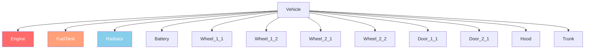

# Capítulo 6.2: Sistema de Vehículos

[Inicio](../README.md) | [<< Anterior: Entity System](01-entity-system.md) | **Vehicles** | [Siguiente: Weather >>](03-weather.md)

---

## Introducción

DayZ vehicles are entities that extend the transport system. Cars extend `CarScript`, boats extend `BoatScript`, and both inherit from `Transport`. Vehicles have fluid systems, parts with independent health, gear simulation, and physics managed by the engine. This chapter covers the API methods you need to interact with vehicles in scripts.

---

## Class Hierarchy

```
EntityAI
└── Transport                    // 3_Game - base for all vehicles
    ├── Car                      // 3_Game - engine-native car physics
    │   └── CarScript            // 4_World - scriptable car base
    │       ├── CivilianSedan
    │       ├── OffroadHatchback
    │       ├── Hatchback_02
    │       ├── Sedan_02
    │       ├── Truck_01_Base
    │       └── ...
    └── Boat                     // 3_Game - engine-native boat physics
        └── BoatScript           // 4_World - scriptable boat base
```

---

## Transport (Base)

**Archivo:** `3_Game/entities/transport.c`

The abstract base for all vehicles. Provides seat management and crew access.

### Crew Management

```c
proto native int   CrewSize();                          // Total number of seats
proto native int   CrewMemberIndex(Human crew_member);  // Get seat index of a human
proto native Human CrewMember(int posIdx);              // Get human at seat index
proto native void  CrewGetOut(int posIdx);              // Force crew member out of seat
proto native void  CrewDeath(int posIdx);               // Kill crew member in seat
```

### Crew Entry

```c
proto native int  GetAnimInstance();
proto native int  CrewPositionIndex(int componentIdx);  // Component to seat index
proto native vector CrewEntryPoint(int posIdx);         // World entry position for seat
```

**Ejemplo --- eject all passengers:**

```c
void EjectAllCrew(Transport vehicle)
{
    for (int i = 0; i < vehicle.CrewSize(); i++)
    {
        Human crew = vehicle.CrewMember(i);
        if (crew)
        {
            vehicle.CrewGetOut(i);
        }
    }
}
```

---

## Car (Engine Native)

**Archivo:** `3_Game/entities/car.c`

Engine-level car physics. All `proto native` methods that drive the vehicle simulation.

### Engine

```c
proto native bool  EngineIsOn();
proto native void  EngineStart();
proto native void  EngineStop();
proto native float EngineGetRPM();
proto native float EngineGetRPMRedline();
proto native float EngineGetRPMMax();
proto native int   GetGear();
```

### Fluids

DayZ vehicles have four fluid types defined in the `CarFluid` enum:

```c
enum CarFluid
{
    FUEL,
    OIL,
    BRAKE,
    COOLANT
}
```

```c
proto native float GetFluidCapacity(CarFluid fluid);
proto native float GetFluidFraction(CarFluid fluid);     // 0.0 - 1.0
proto native void  Fill(CarFluid fluid, float amount);
proto native void  Leak(CarFluid fluid, float amount);
proto native void  LeakAll(CarFluid fluid);
```

**Ejemplo --- refuel a vehicle:**

```c
void RefuelVehicle(Car car)
{
    float capacity = car.GetFluidCapacity(CarFluid.FUEL);
    float current = car.GetFluidFraction(CarFluid.FUEL) * capacity;
    float needed = capacity - current;
    car.Fill(CarFluid.FUEL, needed);
}
```

### Speed

```c
proto native float GetSpeedometer();    // Speed in km/h (absolute value)
```

### Controls (Simulation)

```c
proto native void  SetBrake(float value, int wheel = -1);    // 0.0 - 1.0, -1 = all wheels
proto native void  SetHandbrake(float value);                 // 0.0 - 1.0
proto native void  SetSteering(float value, bool analog = true);
proto native void  SetThrust(float value, int wheel = -1);    // 0.0 - 1.0
proto native void  SetClutchState(bool engaged);
```

### Wheels

```c
proto native int   WheelCount();
proto native bool  WheelIsAnyLocked();
proto native float WheelGetSurface(int wheelIdx);
```

### Callbacks (Override in CarScript)

```c
void OnEngineStart();
void OnEngineStop();
void OnContact(string zoneName, vector localPos, IEntity other, Contact data);
void OnFluidChanged(CarFluid fluid, float newValue, float oldValue);
void OnGearChanged(int newGear, int oldGear);
void OnSound(CarSoundCtrl ctrl, float oldValue);
```

---

## CarScript

**Archivo:** `4_World/entities/vehicles/carscript.c`

The scriptable car class that most vehicle mods extend. Adds parts, doors, lights, and sound management.

### Part Health

CarScript uses damage zones to represent vehicle parts. Each part can be independently damaged:

```c
// Check part health via the standard EntityAI API
float engineHP = car.GetHealth("Engine", "Health");
float fuelTankHP = car.GetHealth("FuelTank", "Health");

// Set part health
car.SetHealth("Engine", "Health", 0);       // Destroy the engine
car.SetHealth("FuelTank", "Health", 100);   // Repair the fuel tank
```

### Damage Zone Diagram



Common damage zones for vehicles:

| Zone | Descripción |
|------|-------------|
| `""` (global) | Overall vehicle health |
| `"Engine"` | Engine part |
| `"FuelTank"` | Fuel tank |
| `"Radiator"` | Radiator (coolant) |
| `"Battery"` | Battery |
| `"SparkPlug"` | Spark plug |
| `"FrontLeft"` / `"FrontRight"` | Front wheels |
| `"RearLeft"` / `"RearRight"` | Rear wheels |
| `"DriverDoor"` / `"CoDriverDoor"` | Front doors |
| `"Hood"` / `"Trunk"` | Hood and trunk |

### Lights

```c
void SetLightsState(int state);   // 0 = off, 1 = on
int  GetLightsState();
```

### Door Control

```c
bool IsDoorOpen(string doorSource);
void OpenDoor(string doorSource);
void CloseDoor(string doorSource);
```

### Key Overrides for Custom Vehicles

```c
override void EEInit();                    // Initialize vehicle parts, fluids
override void OnEngineStart();             // Custom engine start behavior
override void OnEngineStop();              // Custom engine stop behavior
override void EOnSimulate(IEntity other, float dt);  // Per-tick simulation
override bool CanObjectAttachWeapon(string slot_name);
```

**Ejemplo --- create a vehicle with full fluids:**

```c
void SpawnReadyVehicle(vector pos)
{
    Car car = Car.Cast(GetGame().CreateObjectEx("CivilianSedan", pos,
                        ECE_PLACE_ON_SURFACE | ECE_INITAI | ECE_CREATEPHYSICS));
    if (!car)
        return;

    // Fill all fluids
    car.Fill(CarFluid.FUEL, car.GetFluidCapacity(CarFluid.FUEL));
    car.Fill(CarFluid.OIL, car.GetFluidCapacity(CarFluid.OIL));
    car.Fill(CarFluid.BRAKE, car.GetFluidCapacity(CarFluid.BRAKE));
    car.Fill(CarFluid.COOLANT, car.GetFluidCapacity(CarFluid.COOLANT));

    // Spawn required parts
    EntityAI carEntity = EntityAI.Cast(car);
    carEntity.GetInventory().CreateAttachment("CarBattery");
    carEntity.GetInventory().CreateAttachment("SparkPlug");
    carEntity.GetInventory().CreateAttachment("CarRadiator");
    carEntity.GetInventory().CreateAttachment("HatchbackWheel");
}
```

---

## BoatScript

**Archivo:** `4_World/entities/vehicles/boatscript.c`

Scriptable base for boat entities. Similar API to CarScript but with propeller-based physics.

### Engine & Propulsion

```c
proto native bool  EngineIsOn();
proto native void  EngineStart();
proto native void  EngineStop();
proto native float EngineGetRPM();
```

### Fluids

Boats use the same `CarFluid` enum but typically only use `FUEL`:

```c
float fuel = boat.GetFluidFraction(CarFluid.FUEL);
boat.Fill(CarFluid.FUEL, boat.GetFluidCapacity(CarFluid.FUEL));
```

### Speed

```c
proto native float GetSpeedometer();   // Speed in km/h
```

**Ejemplo --- spawn a boat:**

```c
void SpawnBoat(vector waterPos)
{
    BoatScript boat = BoatScript.Cast(
        GetGame().CreateObjectEx("Boat_01", waterPos,
                                  ECE_CREATEPHYSICS | ECE_INITAI)
    );
    if (boat)
    {
        boat.Fill(CarFluid.FUEL, boat.GetFluidCapacity(CarFluid.FUEL));
    }
}
```

---

## Vehicle Interaction Checks

### Checking if a Player is in a Vehicle

```c
PlayerBase player;
if (player.IsInVehicle())
{
    EntityAI vehicle = player.GetDrivingVehicle();
    CarScript car;
    if (Class.CastTo(car, vehicle))
    {
        float speed = car.GetSpeedometer();
        Print(string.Format("Driving at %1 km/h", speed));
    }
}
```

### Finding All Vehicles in the World

```c
void FindAllVehicles(out array<Transport> vehicles)
{
    vehicles = new array<Transport>;
    array<Object> objects = new array<Object>;
    array<CargoBase> proxyCargos = new array<CargoBase>;

    // Use a large radius from center of map
    GetGame().GetObjectsAtPosition(Vector(7500, 0, 7500), 15000, objects, proxyCargos);

    foreach (Object obj : objects)
    {
        Transport transport;
        if (Class.CastTo(transport, obj))
        {
            vehicles.Insert(transport);
        }
    }
}
```

---

## Resumen

| Concepto | Punto Clave |
|---------|-----------|
| Hierarchy | `Transport` > `Car`/`Boat` > `CarScript`/`BoatScript` |
| Engine | `EngineStart()`, `EngineStop()`, `EngineIsOn()`, `EngineGetRPM()` |
| Fluids | `CarFluid` enum: `FUEL`, `OIL`, `BRAKE`, `COOLANT` |
| Fill/Leak | `Fill(fluid, amount)`, `Leak(fluid, amount)`, `GetFluidFraction(fluid)` |
| Speed | `GetSpeedometer()` returns km/h |
| Crew | `CrewSize()`, `CrewMember(idx)`, `CrewGetOut(idx)` |
| Parts | Standard damage zones: `"Engine"`, `"FuelTank"`, `"Radiator"`, etc. |
| Creation | `CreateObjectEx` with `ECE_PLACE_ON_SURFACE \| ECE_INITAI \| ECE_CREATEPHYSICS` |
| Config 1.28 | `useNewNetworking`, `wheelHubFriction`, valores de torque de freno duplicados |
| Fisica 1.28 | Bullet Physics actualizado, nuevos campos de la API `Contact`, suspension siempre activa |
| Experimental 1.29 | Multithreading de fisica, `Transport` sleep, colision dinamica para todo transport |

---

## Mejores Prácticas

- **Always include `ECE_CREATEPHYSICS | ECE_INITAI` when spawning vehicles.** Without physics, the vehicle falls through the ground. Without AI init, the engine simulation does not start and the vehicle cannot be driven.
- **Fill all four fluids after spawning.** A vehicle missing oil, brake fluid, or coolant will damage itself immediately when the engine starts. Use `GetFluidCapacity()` to get correct max values per vehicle type.
- **Null-check `CrewMember()` before operating on crew.** Empty seats return `null`. Iterating `CrewSize()` without checking each index causes crashes when seats are unoccupied.
- **Use `GetSpeedometer()` instead of computing velocity manually.** The engine's speedometer accounts for wheel contact, transmission state, and physics correctly. Manual velocity calculations from position deltas are unreliable.

---

## Compatibilidad e Impacto

> **Mod Compatibility:** Vehicle mods commonly extend `CarScript` with modded classes. Conflicts arise when multiple mods override the same callbacks like `OnEngineStart()` or `EOnSimulate()`.

- **Load Order:** If two mods both `modded class CarScript` and override `OnEngineStart()`, only the last-loaded mod runs unless both call `super`. Vehicle overhaul mods should always call `super` in every callback.
- **Modded Class Conflicts:** Expansion Vehicles and vanilla vehicle mods frequently conflict on `EEInit()` and fluid initialization. Test with both loaded.
- **Performance Impact:** `EOnSimulate()` runs every physics tick for each active vehicle. Keep logic minimal in this callback; use timer accumulators for expensive operations.
- **Server/Client:** `EngineStart()`, `EngineStop()`, `Fill()`, `Leak()`, and `CrewGetOut()` are server-authoritative. `GetSpeedometer()`, `EngineIsOn()`, and `GetFluidFraction()` are safe to read on both sides.

---

## Observado en Mods Reales

> These patterns were confirmed by studying the source code of professional DayZ mods.

| Patrón | Mod | File/Location |
|---------|-----|---------------|
| Override `EEInit()` to set custom fluid capacities and spawn parts | Expansion Vehicles | `CarScript` subclasses |
| `EOnSimulate` accumulator for periodic fuel consumption checks | Vanilla+ vehicle mods | `CarScript` overrides |
| `CrewGetOut()` loop in admin eject-all command | VPP Admin Tools | Vehicle management module |
| Custom `OnContact()` override for collision damage tuning | Expansion | `ExpansionCarScript` |

---

## Cambios de Configuracion de Vehiculos (1.28+)

> **Advertencia (1.28):** DayZ 1.28 introdujo cambios significativos en la fisica de vehiculos. Si estas actualizando un mod de vehiculos desde 1.27 o anterior, lee esta seccion cuidadosamente.

### Parametro `useNewNetworking`

DayZ 1.28 agrego el parametro de configuracion `useNewNetworking` para todas las clases `CarScript`. El valor predeterminado es **1** (activado).

```cpp
class CfgVehicles
{
    class CarScript;
    class MyVehicle : CarScript
    {
        // El nuevo networking mejora el rubber-banding con ping alto
        useNewNetworking = 1;  // predeterminado --- dejalo activado para la mayoria de mods

        // Desactiva SOLO si tu mod modifica la fisica del vehiculo
        // fuera de la configuracion del SimulationModule:
        // useNewNetworking = 0;
    };
};
```

**Cuando desactivar:** Si tu mod manipula directamente la fisica del vehiculo a traves de script (sobreescrituras personalizadas de `EOnSimulate`, aplicacion directa de fuerzas, logica de ruedas personalizada) en lugar de hacerlo a traves del `SimulationModule` basado en configuracion, el nuevo sistema de reconciliacion puede luchar contra tus cambios. Pon `useNewNetworking = 0;` en ese caso.

### Parametro `wheelHubFriction` (1.28+)

Nueva variable de configuracion que define la resistencia del eje cuando **no hay ruedas conectadas**:

```cpp
class SimulationModule
{
    class Axles
    {
        class Front
        {
            wheelHubFriction = 0.5;  // Que tan rapido desacelera el vehiculo con ruedas faltantes
        };
    };
};
```

### Migracion de Torque de Freno (1.28)

> **Cambio incompatible:** Antes de 1.28, el torque de freno y freno de mano se aplicaba **dos veces** debido a un bug. Esto fue corregido en 1.28. Si estas migrando un mod de vehiculos, **duplica** tus valores de `maxBrakeTorque` y `maxHandbrakeTorque` para mantener la misma sensacion de frenado.

```cpp
// Pre-1.28 (bug: se aplicaba dos veces, asi que el valor efectivo era 2x)
maxBrakeTorque = 2000;
maxHandbrakeTorque = 3000;

// Post-1.28 (correccion: se aplica una vez, asi que duplica para igualar el comportamiento anterior)
maxBrakeTorque = 4000;
maxHandbrakeTorque = 6000;
```

### Suspension Siempre Activa (1.28+)

La suspension del vehiculo ahora esta siempre activa mientras el vehiculo esta despierto. Anteriormente, la suspension podia estar inactiva en ciertos estados. Esto mejora la estabilidad pero puede cambiar la sensacion de la calibracion de suspension personalizada.

### Actualizacion de Bullet Physics (1.28)

La libreria Bullet Physics fue actualizada a la ultima version de Enfusion. Pueden ocurrir diferencias sutiles en respuesta de colision, friccion y restitucion. Prueba todas las configuraciones de vehiculos personalizados exhaustivamente.

### Cambios en la API de Contacto Fisico (1.28)

La clase `Contact` fue modificada:

**Eliminados:**
- `MaterialIndex1`, `MaterialIndex2`
- `Index1`, `Index2`

**Agregados:**
- `ShapeIndex1`, `ShapeIndex2` --- identifican que forma en un cuerpo compuesto fue golpeada
- `VelocityBefore1`, `VelocityBefore2` --- velocidades pre-colision
- `VelocityAfter1`, `VelocityAfter2` --- velocidades post-colision

**Cambiados:**
- `Material1`, `Material2` --- el tipo cambio de `dMaterial` a `SurfaceProperties`

Los mods que leen datos de `Contact` en `EOnContact` deben actualizarse a los nuevos nombres y tipos de variables.

---

## Cambios de Vehiculos en 1.29 (Experimental)

> **Nota:** Estos cambios son de DayZ 1.29 experimental y pueden cambiar antes del lanzamiento estable.

### Multithreading de Bullet Physics (1.29 Experimental)

Se habilito el soporte de multithreading para la libreria Bullet Physics. Las pruebas de estres del servidor mostraron hasta 400% de mejora en FPS (de 9 FPS a 50 FPS). Los mods de vehiculos que dependen de timing especifico de fisica o hacen llamadas de fisica desde callbacks de script deben probarse exhaustivamente.

### Transport Sleep (1.29 Experimental)

Se agregaron funciones de fisica directamente en `Transport` para permitir que los vehiculos entren en **sleep** cuando estan en reposo. Los cuerpos inactivos ya no reciben callbacks de `EOnSimulate` / `EOnPostSimulate`. Si tu mod de vehiculos depende de que estos callbacks se disparen continuamente, prueba en 1.29 experimental.

### Colision Dinamica para Todo Transport (1.29 Experimental)

La clase `Transport` (padre de `CarScript` y `BoatScript`) ahora tiene resolucion de colision dinamica. Anteriormente, solo `CarScript` tenia esto. Los mods de botes se benefician de un manejo de colision adecuado.

---

[Inicio](../README.md) | [<< Anterior: Entity System](01-entity-system.md) | **Vehicles** | [Siguiente: Weather >>](03-weather.md)
