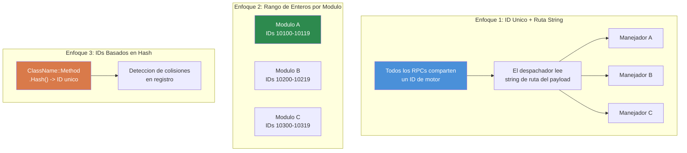

# Capitulo 7.3: Patrones de Comunicacion RPC

[Inicio](../README.md) | [<< Anterior: Sistemas de Modulos](02-module-systems.md) | **Patrones de Comunicacion RPC** | [Siguiente: Persistencia de Configuracion >>](04-config-persistence.md)

---

## Introduccion

Las Llamadas a Procedimiento Remoto (RPCs) son la unica forma de enviar datos entre cliente y servidor en DayZ. Cada panel de administracion, cada UI sincronizada, cada notificacion de servidor a cliente y cada solicitud de accion de cliente a servidor fluye a traves de RPCs. Entender como construirlos correctamente --- con orden de serializacion adecuado, verificaciones de permisos y manejo de errores --- es esencial para cualquier mod que haga mas que agregar items a CfgVehicles.

Este capitulo cubre el patron fundamental de `ScriptRPC`, el ciclo de vida del ida y vuelta cliente-servidor, el manejo de errores, y luego compara los tres enfoques principales de enrutamiento RPC utilizados en la comunidad de modding de DayZ.

---

## Tabla de Contenidos

- [Fundamentos de ScriptRPC](#fundamentos-de-scriptrpc)
- [Ida y Vuelta Cliente a Servidor a Cliente](#ida-y-vuelta-cliente-a-servidor-a-cliente)
- [Verificacion de Permisos Antes de la Ejecucion](#verificacion-de-permisos-antes-de-la-ejecucion)
- [Manejo de Errores y Notificaciones](#manejo-de-errores-y-notificaciones)
- [Serializacion: El Contrato de Lectura/Escritura](#serializacion-el-contrato-de-lecturaescritura)
- [Tres Enfoques RPC Comparados](#tres-enfoques-rpc-comparados)
- [Errores Comunes](#errores-comunes)
- [Mejores Practicas](#mejores-practicas)

---

## Fundamentos de ScriptRPC

Cada RPC en DayZ usa la clase `ScriptRPC`. El patron es siempre el mismo: crear, escribir datos, enviar.

### Lado de Envio

```c
void SendDamageReport(PlayerIdentity target, string weaponName, float damage)
{
    ScriptRPC rpc = new ScriptRPC();

    // Escribir campos en un orden especifico
    rpc.Write(weaponName);    // campo 1: string
    rpc.Write(damage);        // campo 2: float

    // Enviar a traves del motor
    // Parametros: objeto destino, ID RPC, entrega garantizada, destinatario
    rpc.Send(null, MY_RPC_ID, true, target);
}
```

### Lado de Recepcion

El receptor lee los campos en el **orden exactamente igual** en que fueron escritos:

```c
void OnRPC_DamageReport(PlayerIdentity sender, Object target, ParamsReadContext ctx)
{
    string weaponName;
    if (!ctx.Read(weaponName)) return;  // campo 1: string

    float damage;
    if (!ctx.Read(damage)) return;      // campo 2: float

    // Usar los datos
    Print("Golpeado por " + weaponName + " por " + damage.ToString() + " de dano");
}
```

### Parametros de Send Explicados

```c
rpc.Send(object, rpcId, guaranteed, identity);
```

| Parametro | Tipo | Descripcion |
|-----------|------|-------------|
| `object` | `Object` | La entidad destino (ej., un jugador o vehiculo). Usar `null` para RPCs globales. |
| `rpcId` | `int` | Entero que identifica este tipo de RPC. Debe coincidir en ambos lados. |
| `guaranteed` | `bool` | `true` = confiable (similar a TCP, retransmite en caso de perdida). `false` = no confiable (disparar y olvidar). |
| `identity` | `PlayerIdentity` | Destinatario. `null` desde cliente = enviar al servidor. `null` desde servidor = broadcast a todos los clientes. Identity especifica = enviar solo a ese cliente. |

### Cuando Usar `guaranteed`

- **`true` (confiable):** Cambios de configuracion, concesion de permisos, comandos de teletransporte, acciones de ban --- cualquier cosa donde un paquete perdido dejaria al cliente y servidor fuera de sincronizacion.
- **`false` (no confiable):** Actualizaciones rapidas de posicion, efectos visuales, estado de HUD que se refresca cada pocos segundos de todas formas. Menor sobrecarga, sin cola de retransmision.

---

## Ida y Vuelta Cliente a Servidor a Cliente

El patron RPC mas comun es la ida y vuelta: el cliente solicita una accion, el servidor valida y ejecuta, el servidor envia de vuelta el resultado.

```
CLIENTE                         SERVIDOR
  |                               |
  |  1. RPC Solicitud ----------> |
  |     (accion + parametros)     |
  |                               |  2. Validar permiso
  |                               |  3. Ejecutar accion
  |                               |  4. Preparar respuesta
  |  <----------- 5. RPC Respuesta|
  |     (resultado + datos)       |
  |                               |
  |  6. Actualizar UI             |
```

### Ejemplo Completo: Solicitud de Teletransporte

**El cliente envia la solicitud:**

```c
class TeleportClient
{
    void RequestTeleport(vector position)
    {
        ScriptRPC rpc = new ScriptRPC();
        rpc.Write(position);
        rpc.Send(null, MY_RPC_TELEPORT, true, null);  // identity null = enviar al servidor
    }
};
```

**El servidor recibe, valida, ejecuta, responde:**

```c
class TeleportServer
{
    void OnRPC_TeleportRequest(PlayerIdentity sender, Object target, ParamsReadContext ctx)
    {
        // 1. Leer los datos de la solicitud
        vector position;
        if (!ctx.Read(position)) return;

        // 2. Validar permiso
        if (!MyPermissions.GetInstance().HasPermission(sender.GetPlainId(), "MyMod.Admin.Teleport"))
        {
            SendError(sender, "Sin permiso para teletransportar");
            return;
        }

        // 3. Validar los datos
        if (position[1] < 0 || position[1] > 1000)
        {
            SendError(sender, "Altura de teletransporte invalida");
            return;
        }

        // 4. Ejecutar la accion
        PlayerBase player = PlayerBase.Cast(sender.GetPlayer());
        if (!player) return;

        player.SetPosition(position);

        // 5. Enviar respuesta de exito
        ScriptRPC response = new ScriptRPC();
        response.Write(true);           // flag de exito
        response.Write(position);       // devolver la posicion
        response.Send(null, MY_RPC_TELEPORT_RESULT, true, sender);
    }
};
```

**El cliente recibe la respuesta:**

```c
class TeleportClient
{
    void OnRPC_TeleportResult(PlayerIdentity sender, Object target, ParamsReadContext ctx)
    {
        bool success;
        if (!ctx.Read(success)) return;

        vector position;
        if (!ctx.Read(position)) return;

        if (success)
        {
            // Actualizar UI: "Teletransportado a X, Y, Z"
        }
    }
};
```

---

## Verificacion de Permisos Antes de la Ejecucion

Cada manejador RPC del lado del servidor que realiza una accion privilegiada **debe** verificar permisos antes de ejecutar. Nunca confies en el cliente.

### El Patron

```c
void OnRPC_AdminAction(PlayerIdentity sender, Object target, ParamsReadContext ctx)
{
    // REGLA 1: Siempre validar que el remitente existe
    if (!sender) return;

    // REGLA 2: Verificar permiso antes de leer datos
    if (!MyPermissions.GetInstance().HasPermission(sender.GetPlainId(), "MyMod.Admin.Ban"))
    {
        MyLog.Warning("BanRPC", "Intento de ban no autorizado de " + sender.GetName());
        return;
    }

    // REGLA 3: Solo ahora leer y ejecutar
    string targetUid;
    if (!ctx.Read(targetUid)) return;

    // ... ejecutar ban
}
```

### Por que Verificar Antes de Leer?

Leer datos de un cliente no autorizado desperdicia ciclos del servidor. Mas importante aun, datos malformados de un cliente malicioso podrian causar errores de parsing. Verificar permisos primero es una proteccion barata que rechaza actores maliciosos inmediatamente.

### Registrar Intentos No Autorizados

Siempre registra las verificaciones de permisos fallidas. Esto crea una pista de auditoria y ayuda a los duenos de servidor a detectar intentos de exploit:

```c
if (!HasPermission(sender, "MyMod.Spawn"))
{
    MyLog.Warning("SpawnRPC", "Solicitud de spawn denegada de "
        + sender.GetName() + " (" + sender.GetPlainId() + ")");
    return;
}
```

---

## Manejo de Errores y Notificaciones

Los RPCs pueden fallar de multiples formas: caidas de red, datos malformados, fallos de validacion del lado del servidor. Los mods robustos manejan todos estos.

### Fallos de Lectura

Cada `ctx.Read()` puede fallar. Siempre verifica el valor de retorno:

```c
// MAL: Ignorar fallos de lectura
string name;
ctx.Read(name);     // Si esto falla, name es "" — corrupcion silenciosa
int count;
ctx.Read(count);    // Esto lee los bytes equivocados — todo lo que sigue es basura

// BIEN: Retorno temprano en cualquier fallo de lectura
string name;
if (!ctx.Read(name)) return;
int count;
if (!ctx.Read(count)) return;
```

### Patron de Respuesta de Error

Cuando el servidor rechaza una solicitud, envia un error estructurado de vuelta al cliente para que la UI pueda mostrarlo:

```c
// Servidor: enviar error
void SendError(PlayerIdentity target, string errorMsg)
{
    ScriptRPC rpc = new ScriptRPC();
    rpc.Write(false);        // success = false
    rpc.Write(errorMsg);     // razon
    rpc.Send(null, MY_RPC_RESPONSE_ID, true, target);
}

// Cliente: manejar error
void OnRPC_Response(PlayerIdentity sender, Object target, ParamsReadContext ctx)
{
    bool success;
    if (!ctx.Read(success)) return;

    if (!success)
    {
        string errorMsg;
        if (!ctx.Read(errorMsg)) return;

        // Mostrar error en UI
        MyLog.Warning("MyMod", "Error del servidor: " + errorMsg);
        return;
    }

    // Manejar exito...
}
```

### Broadcasts de Notificacion

Para eventos que todos los clientes deberian ver (killfeed, anuncios, cambios de clima), el servidor hace broadcast con `identity = null`:

```c
// Servidor: broadcast a todos los clientes
void BroadcastAnnouncement(string message)
{
    ScriptRPC rpc = new ScriptRPC();
    rpc.Write(message);
    rpc.Send(null, RPC_ANNOUNCEMENT, true, null);  // null = todos los clientes
}
```

---

## Serializacion: El Contrato de Lectura/Escritura

La regla mas importante de los RPCs de DayZ: **el orden de Read debe coincidir exactamente con el orden de Write, tipo por tipo.**

### El Contrato

```c
// El EMISOR escribe:
rpc.Write("hello");      // 1. string
rpc.Write(42);           // 2. int
rpc.Write(3.14);         // 3. float
rpc.Write(true);         // 4. bool

// El RECEPTOR lee en el MISMO orden:
string s;   ctx.Read(s);     // 1. string
int i;      ctx.Read(i);     // 2. int
float f;    ctx.Read(f);     // 3. float
bool b;     ctx.Read(b);     // 4. bool
```

### Que Sale Mal Cuando el Orden No Coincide

Si intercambias el orden de lectura, el deserializador interpreta bytes destinados a un tipo como otro. Un `int` leido donde se escribio un `string` producira basura, y cada lectura subsiguiente estara desfasada --- corrompiendo todos los campos restantes. El motor no lanza una excepcion; silenciosamente retorna datos incorrectos o causa que `Read()` retorne `false`.

### Tipos Soportados

| Tipo | Notas |
|------|-------|
| `int` | 32-bit con signo |
| `float` | 32-bit IEEE 754 |
| `bool` | Un solo byte |
| `string` | UTF-8 con prefijo de longitud |
| `vector` | Tres floats (x, y, z) |
| `Object` (como parametro target) | Referencia a entidad, resuelta por el motor |

### Serializar Colecciones

No hay serializacion de arrays incorporada. Escribe el conteo primero, luego cada elemento:

```c
// EMISOR
array<string> names = {"Alice", "Bob", "Charlie"};
rpc.Write(names.Count());
for (int i = 0; i < names.Count(); i++)
{
    rpc.Write(names[i]);
}

// RECEPTOR
int count;
if (!ctx.Read(count)) return;

array<string> names = new array<string>();
for (int i = 0; i < count; i++)
{
    string name;
    if (!ctx.Read(name)) return;
    names.Insert(name);
}
```

### Serializar Objetos Complejos

Para datos complejos, serializa campo por campo. No intentes pasar objetos directamente a traves de `Write()`:

```c
// EMISOR: aplanar el objeto en primitivas
rpc.Write(player.GetName());
rpc.Write(player.GetHealth());
rpc.Write(player.GetPosition());

// RECEPTOR: reconstruir
string name;    ctx.Read(name);
float health;   ctx.Read(health);
vector pos;     ctx.Read(pos);
```

---

## Tres Enfoques RPC Comparados

La comunidad de modding de DayZ utiliza tres enfoques fundamentalmente diferentes para el enrutamiento de RPCs. Cada uno tiene sus ventajas y desventajas.

### Tres Enfoques RPC Comparados



### 1. RPCs Nombrados de CF

Community Framework proporciona `GetRPCManager()` que enruta RPCs por nombres de string agrupados por namespace del mod.

```c
// Registro (en OnInit):
GetRPCManager().AddRPC("MyMod", "RPC_SpawnItem", this, SingleplayerExecutionType.Server);

// Envio desde cliente:
GetRPCManager().SendRPC("MyMod", "RPC_SpawnItem", new Param1<string>("AK74"), true);

// El manejador recibe:
void RPC_SpawnItem(CallType type, ParamsReadContext ctx, PlayerIdentity sender, Object target)
{
    if (type != CallType.Server) return;

    Param1<string> data;
    if (!ctx.Read(data)) return;

    string className = data.param1;
    // ... generar el item
}
```

**Ventajas:**
- El enrutamiento basado en string es legible por humanos y libre de colisiones
- La agrupacion por namespace (`"MyMod"`) previene conflictos de nombres entre mods
- Ampliamente utilizado --- si te integras con COT/Expansion, usas esto

**Desventajas:**
- Requiere CF como dependencia
- Usa wrappers `Param` que son verbosos para payloads complejos
- Comparacion de strings en cada despacho (sobrecarga menor)

### 2. RPCs de Rango de Enteros COT / Vanilla

DayZ vanilla y algunas partes de COT usan IDs RPC de enteros crudos. Cada mod reclama un rango de enteros y despacha en un override `OnRPC` con modded.

```c
// Definir tus IDs RPC (elige un rango unico para evitar colisiones)
const int MY_RPC_SPAWN_ITEM     = 90001;
const int MY_RPC_DELETE_ITEM    = 90002;
const int MY_RPC_TELEPORT       = 90003;

// Envio:
ScriptRPC rpc = new ScriptRPC();
rpc.Write("AK74");
rpc.Send(null, MY_RPC_SPAWN_ITEM, true, null);

// Recepcion (en DayZGame o entidad con modded):
modded class DayZGame
{
    override void OnRPC(PlayerIdentity sender, Object target, int rpc_type, ParamsReadContext ctx)
    {
        switch (rpc_type)
        {
            case MY_RPC_SPAWN_ITEM:
                HandleSpawnItem(sender, ctx);
                return;
            case MY_RPC_DELETE_ITEM:
                HandleDeleteItem(sender, ctx);
                return;
        }

        super.OnRPC(sender, target, rpc_type, ctx);
    }
};
```

**Ventajas:**
- Sin dependencias --- funciona con DayZ vanilla
- La comparacion de enteros es rapida
- Control total sobre el pipeline RPC

**Desventajas:**
- **Riesgo de colision de IDs**: dos mods eligiendo el mismo rango de enteros interceptaran silenciosamente los RPCs del otro
- La logica de despacho manual (switch/case) se vuelve inmanejable con muchos RPCs
- Sin aislamiento de namespace
- Sin registro o descubrimiento incorporado

### 3. RPCs Personalizados con Enrutamiento por String

Un sistema personalizado con enrutamiento por string usa un unico ID de motor RPC y multiplexa escribiendo un nombre de mod + nombre de funcion como cabecera de string en cada RPC. Todo el enrutamiento ocurre dentro de una clase manager estatica (`MyRPC` en este ejemplo).

```c
// Registro:
MyRPC.Register("MyMod", "RPC_SpawnItem", this, MyRPCSide.SERVER);

// Envio (solo cabecera, sin payload):
MyRPC.Send("MyMod", "RPC_SpawnItem", null, true, null);

// Envio (con payload):
ScriptRPC rpc = MyRPC.CreateRPC("MyMod", "RPC_SpawnItem");
rpc.Write("AK74");
rpc.Write(5);    // cantidad
rpc.Send(null, MyRPC.FRAMEWORK_RPC_ID, true, null);

// Manejador:
void RPC_SpawnItem(PlayerIdentity sender, Object target, ParamsReadContext ctx)
{
    string className;
    if (!ctx.Read(className)) return;

    int quantity;
    if (!ctx.Read(quantity)) return;

    // ... generar items
}
```

**Ventajas:**
- Cero riesgo de colision --- namespace de string + nombre de funcion es globalmente unico
- Cero dependencia de CF (pero opcionalmente hace puente a `GetRPCManager()` de CF cuando CF esta presente)
- Un unico ID de motor significa minima huella de hooks
- El helper `CreateRPC()` pre-escribe la cabecera de enrutamiento asi que solo escribes payload
- Firma limpia del manejador: `(PlayerIdentity, Object, ParamsReadContext)`

**Desventajas:**
- Dos lecturas de string extra por RPC (la cabecera de enrutamiento) --- sobrecarga minima en la practica
- Sistema personalizado significa que otros mods no pueden descubrir tus RPCs a traves del registro de CF
- Solo despacha via reflexion `CallFunctionParams`, que es ligeramente mas lento que una llamada directa a metodo

### Tabla Comparativa

| Caracteristica | CF Nombrado | Rango de Enteros | String Personalizado |
|---------|----------|---------------|---------------------|
| **Riesgo de colision** | Ninguno (con namespace) | Alto | Ninguno (con namespace) |
| **Dependencias** | Requiere CF | Ninguna | Ninguna |
| **Firma del manejador** | `(CallType, ctx, sender, target)` | Personalizada | `(sender, target, ctx)` |
| **Descubrimiento** | Registro CF | Ninguno | `MyRPC.s_Handlers` |
| **Sobrecarga de despacho** | Busqueda de string | Switch de enteros | Busqueda de string |
| **Estilo de payload** | Wrappers Param | Write/Read crudos | Write/Read crudos |
| **Puente CF** | Nativo | Manual | Automatico (`#ifdef`) |

### Cual Deberias Usar?

- **Tu mod depende de CF de todas formas** (integracion COT/Expansion): usa RPCs Nombrados de CF
- **Mod independiente, dependencias minimas**: usa rango de enteros o construye un sistema con enrutamiento por string
- **Construyendo un framework**: considera un sistema con enrutamiento por string como el patron personalizado `MyRPC` anterior
- **Aprendiendo / prototipando**: rango de enteros es el mas simple de entender

---

## Errores Comunes

### 1. Olvidar Registrar el Manejador

Envias un RPC pero nada sucede en el otro lado. El manejador nunca fue registrado.

```c
// INCORRECTO: Sin registro — el servidor nunca sabe de este manejador
class MyModule
{
    void RPC_DoThing(PlayerIdentity sender, Object target, ParamsReadContext ctx) { ... }
};

// CORRECTO: Registrar en OnInit
class MyModule
{
    void OnInit()
    {
        MyRPC.Register("MyMod", "RPC_DoThing", this, MyRPCSide.SERVER);
    }

    void RPC_DoThing(PlayerIdentity sender, Object target, ParamsReadContext ctx) { ... }
};
```

### 2. Orden de Read/Write No Coincide

El bug RPC mas comun. El emisor escribe `(string, int, float)` pero el receptor lee `(string, float, int)`. Sin mensaje de error --- solo datos basura.

**Solucion:** Escribe un bloque de comentarios documentando el orden de campos tanto en el sitio de envio como de recepcion:

```c
// Formato de cable: [string weaponName] [int damage] [float distance]
```

### 3. Enviar Datos Solo del Cliente al Servidor

El servidor no puede leer el estado de widgets del lado del cliente, estado de entrada o variables locales. Si necesitas enviar una seleccion de UI al servidor, serializa el valor relevante (un string, un indice, un ID) --- no el objeto widget en si.

### 4. Broadcasting Cuando Querias Unicast

```c
// INCORRECTO: Envia a TODOS los clientes cuando querias enviar a uno
rpc.Send(null, MY_RPC_ID, true, null);

// CORRECTO: Enviar al cliente especifico
rpc.Send(null, MY_RPC_ID, true, targetIdentity);
```

### 5. No Manejar Manejadores Obsoletos Entre Reinicios de Mision

Si un modulo registra un manejador RPC y luego es destruido al finalizar la mision, el manejador aun apunta al objeto muerto. El siguiente despacho RPC causara un crash.

**Solucion:** Siempre desregistra o limpia los manejadores al finalizar la mision:

```c
override void OnMissionFinish()
{
    MyRPC.Unregister("MyMod", "RPC_DoThing");
}
```

O usa un `Cleanup()` centralizado que limpie todo el mapa de manejadores (como lo hace `MyRPC.Cleanup()`).

---

## Mejores Practicas

1. **Siempre verifica los valores de retorno de `ctx.Read()`.** Cada lectura puede fallar. Retorna inmediatamente en caso de fallo.

2. **Siempre valida al remitente en el servidor.** Verifica que `sender` no sea null y tenga el permiso requerido antes de hacer cualquier cosa.

3. **Documenta el formato de cable.** Tanto en el sitio de envio como de recepcion, escribe un comentario listando los campos en orden con sus tipos.

4. **Usa entrega confiable para cambios de estado.** La entrega no confiable solo es apropiada para actualizaciones rapidas y efimeras (posicion, efectos).

5. **Mantiene los payloads pequenos.** DayZ tiene un limite practico de tamano por RPC. Para datos grandes (sincronizacion de config, listas de jugadores), divide en multiples RPCs o usa paginacion.

6. **Registra manejadores temprano.** `OnInit()` es el lugar mas seguro. Los clientes pueden conectarse antes de que `OnMissionStart()` se complete.

7. **Limpia manejadores al apagar.** Ya sea desregistrando individualmente o limpiando todo el registro en `OnMissionFinish()`.

8. **Usa `CreateRPC()` para payloads, `Send()` para senales.** Si no tienes datos que enviar (solo una senal "hazlo"), usa `Send()` solo con cabecera. Si tienes datos, usa `CreateRPC()` + escrituras manuales + `rpc.Send()` manual.

---

## Compatibilidad e Impacto

- **Multi-Mod:** Los RPCs de rango de enteros son propensos a colisiones --- dos mods eligiendo el mismo ID interceptan silenciosamente los mensajes del otro. Los RPCs con enrutamiento por string o nombrados de CF evitan esto usando namespace + nombre de funcion como clave.
- **Orden de Carga:** El orden de registro de manejadores RPC solo importa cuando multiples mods hacen `modded class DayZGame` y sobreescriben `OnRPC`. Cada uno debe llamar `super.OnRPC()` para IDs no manejados, o los mods posteriores nunca reciben sus RPCs. Los sistemas con enrutamiento por string evitan esto usando un unico ID de motor.
- **Listen Server:** En listen servers, tanto cliente como servidor se ejecutan en el mismo proceso. Un RPC enviado con `identity = null` desde el lado del servidor tambien sera recibido localmente. Protege manejadores con `if (type != CallType.Server) return;` o verifica `GetGame().IsServer()` / `GetGame().IsClient()` segun corresponda.
- **Rendimiento:** La sobrecarga de despacho RPC es minima (busqueda de string o switch de enteros). El cuello de botella es el tamano del payload --- DayZ tiene un limite practico por RPC (~64 KB). Para datos grandes (sincronizacion de config), pagina entre multiples RPCs.
- **Migracion:** Los IDs RPC son un detalle interno del mod y no se ven afectados por actualizaciones de version de DayZ. Si cambias tu formato de cable RPC (agregar/eliminar campos), clientes viejos hablando con un servidor nuevo se desincronizaran silenciosamente. Versiona tus payloads RPC o fuerza actualizaciones del cliente.

---

## Teoria vs Practica

| Los Libros Dicen | Realidad en DayZ |
|---------------|-------------|
| Usar protocol buffers o serializacion basada en esquema | Enforce Script no tiene soporte de protobuf; manualmente haces `Write`/`Read` de primitivas en orden coincidente |
| Validar todas las entradas con imposicion de esquema | No existe validacion de esquema; cada valor de retorno de `ctx.Read()` debe ser verificado individualmente |
| Los RPCs deberian ser idempotentes | Practico en DayZ solo para RPCs de consulta; los RPCs de mutacion (generar, eliminar, teletransportar) son inherentemente no idempotentes --- protege con verificaciones de permisos en su lugar |

---

[Inicio](../README.md) | [<< Anterior: Sistemas de Modulos](02-module-systems.md) | **Patrones de Comunicacion RPC** | [Siguiente: Persistencia de Configuracion >>](04-config-persistence.md)
