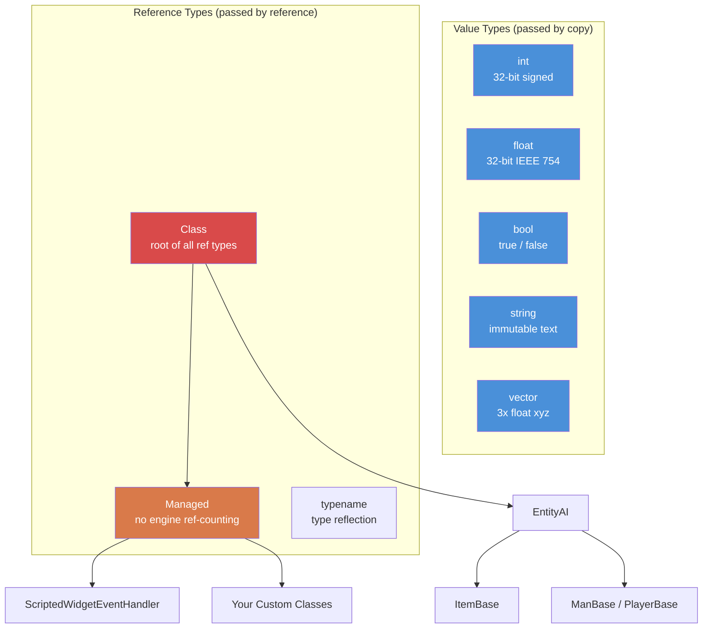

# Chapitre 1.1 : Variables et types

[Accueil](../../README.md) | **Variables et types** | [Suivant : Tableaux, Maps et Sets >>](02-arrays-maps-sets.md)

---

## Introduction

Enforce Script est le langage de script du moteur Enfusion, utilisé par DayZ Standalone. C'est un langage orienté objet avec une syntaxe de type C, similaire à C# à bien des égards mais avec son propre ensemble distinct de types, de règles et de limitations. Si vous avez de l'expérience avec C#, Java ou C++, vous vous sentirez rapidement à l'aise --- mais faites bien attention aux différences, car les endroits où Enforce Script diverge de ces langages sont exactement là où les bugs se cachent.

Ce chapitre couvre les briques fondamentales : les types primitifs, comment déclarer et initialiser des variables, et comment fonctionne la conversion de types. Chaque ligne de code de mod DayZ commence ici.

---

## Types primitifs

Enforce Script possède un ensemble restreint et fixe de types primitifs. Vous ne pouvez pas définir de nouveaux types valeur --- seulement des classes (couvert dans le [Chapitre 1.3](03-classes-inheritance.md)).

| Type | Taille | Valeur par défaut | Description |
|------|--------|-------------------|-------------|
| `int` | 32 bits signé | `0` | Nombres entiers de -2 147 483 648 à 2 147 483 647 |
| `float` | 32 bits IEEE 754 | `0.0` | Nombres à virgule flottante |
| `bool` | 1 bit logique | `false` | `true` ou `false` |
| `string` | Variable | `""` (vide) | Texte. Type valeur immutable --- passé par valeur, pas par référence |
| `vector` | 3x float | `"0 0 0"` | Float à trois composantes (x, y, z). Passé par valeur |
| `typename` | Référence moteur | `null` | Une référence vers un type lui-même, utilisée pour la réflexion |
| `void` | N/A | N/A | Utilisé uniquement comme type de retour pour indiquer « ne retourne rien » |

### Diagramme de hiérarchie des types



### Constantes de type

Plusieurs types exposent des constantes utiles :

```c
// Bornes des int
int maxInt = int.MAX;    // 2147483647
int minInt = int.MIN;    // -2147483648

// Bornes des float
float smallest = float.MIN;     // plus petit float positif (~1.175e-38)
float largest  = float.MAX;     // plus grand float (~3.403e+38)
float lowest   = float.LOWEST;  // float le plus négatif (-3.403e+38)
```

---

## Déclarer des variables

Les variables sont déclarées en écrivant le type suivi du nom. Vous pouvez déclarer et assigner en une seule instruction ou séparément.

```c
void MyFunction()
{
    // Déclaration seule (initialisée à la valeur par défaut)
    int health;          // health == 0
    float speed;         // speed == 0.0
    bool isAlive;        // isAlive == false
    string name;         // name == ""

    // Déclaration avec initialisation
    int maxPlayers = 60;
    float gravity = 9.81;
    bool debugMode = true;
    string serverName = "My DayZ Server";
}
```

### Le mot-clé `auto`

Quand le type est évident à partir du côté droit, vous pouvez utiliser `auto` pour laisser le compilateur le déduire :

```c
void Example()
{
    auto count = 10;           // int
    auto ratio = 0.75;         // float
    auto label = "Hello";      // string
    auto player = GetGame().GetPlayer();  // DayZPlayer (ou le type retourné par GetPlayer)
}
```

C'est purement une commodité --- le compilateur résout le type à la compilation. Il n'y a aucune différence de performance.

### Constantes

Utilisez le mot-clé `const` pour les valeurs qui ne doivent jamais changer après l'initialisation :

```c
const int MAX_SQUAD_SIZE = 8;
const float SPAWN_RADIUS = 150.0;
const string MOD_PREFIX = "[MyMod]";

void Example()
{
    int a = MAX_SQUAD_SIZE;  // OK : lecture d'une constante
    MAX_SQUAD_SIZE = 10;     // ERREUR : impossible d'assigner à une constante
}
```

Les constantes sont généralement déclarées à la portée du fichier (en dehors de toute fonction) ou comme membres de classe. Convention de nommage : `UPPER_SNAKE_CASE`.

---

## Travailler avec `int`

Les entiers sont le type de base par excellence. DayZ les utilise pour les compteurs d'objets, les identifiants de joueurs, les valeurs de santé (lorsqu'elles sont discrétisées), les valeurs d'énumération, les drapeaux binaires, et bien plus encore.

```c
void IntExamples()
{
    int count = 5;
    int total = count + 10;     // 15
    int doubled = count * 2;    // 10
    int remainder = 17 % 5;     // 2 (modulo)

    // Incrémentation et décrémentation
    count++;    // count vaut maintenant 6
    count--;    // count vaut de nouveau 5

    // Assignation composée
    count += 3;  // count vaut maintenant 8
    count -= 2;  // count vaut maintenant 6
    count *= 4;  // count vaut maintenant 24
    count /= 6;  // count vaut maintenant 4

    // La division entière tronque (pas d'arrondi)
    int result = 7 / 2;    // result == 3, pas 3.5

    // Opérations bit à bit (utilisées pour les drapeaux)
    int flags = 0;
    flags = flags | 0x01;   // active le bit 0
    flags = flags | 0x04;   // active le bit 2
    bool hasBit0 = (flags & 0x01) != 0;  // true
}
```

### Exemple concret : compteur de joueurs

```c
void PrintPlayerCount()
{
    array<Man> players = new array<Man>;
    GetGame().GetPlayers(players);
    int count = players.Count();
    Print(string.Format("Players online: %1", count));
}
```

---

## Travailler avec `float`

Les floats représentent des nombres décimaux. DayZ les utilise abondamment pour les positions, les distances, les pourcentages de santé, les valeurs de dégâts et les minuteries.

```c
void FloatExamples()
{
    float health = 100.0;
    float damage = 25.5;
    float remaining = health - damage;   // 74.5

    // Spécifique à DayZ : multiplicateur de dégâts
    float headMultiplier = 3.0;
    float actualDamage = damage * headMultiplier;  // 76.5

    // La division de floats donne des résultats décimaux
    float ratio = 7.0 / 2.0;   // 3.5

    // Fonctions mathématiques utiles
    float dist = 150.7;
    float rounded = Math.Round(dist);    // 151
    float floored = Math.Floor(dist);    // 150
    float ceiled  = Math.Ceil(dist);     // 151
    float clamped = Math.Clamp(dist, 0.0, 100.0);  // 100
}
```

### Exemple concret : vérification de distance

```c
bool IsPlayerNearby(PlayerBase player, vector targetPos, float radius)
{
    if (!player)
        return false;

    vector playerPos = player.GetPosition();
    float distance = vector.Distance(playerPos, targetPos);
    return distance <= radius;
}
```

---

## Travailler avec `bool`

Les booléens contiennent `true` ou `false`. Ils sont utilisés dans les conditions, les drapeaux et le suivi d'état.

```c
void BoolExamples()
{
    bool isAdmin = true;
    bool isBanned = false;

    // Opérateurs logiques
    bool canPlay = isAdmin || !isBanned;    // true (OU, NON)
    bool isSpecial = isAdmin && !isBanned;  // true (ET)

    // Négation
    bool notAdmin = !isAdmin;   // false

    // Les résultats de comparaison sont des bool
    int health = 50;
    bool isLow = health < 25;       // false
    bool isHurt = health < 100;     // true
    bool isDead = health == 0;      // false
    bool isAlive = health != 0;     // true
}
```

### Valeurs de vérité dans les conditions

En Enforce Script, vous pouvez utiliser des valeurs non booléennes dans les conditions. Les valeurs suivantes sont considérées comme `false` :
- `0` (int)
- `0.0` (float)
- `""` (chaîne vide)
- `null` (référence d'objet nulle)

Tout le reste est `true`. Ceci est couramment utilisé pour les vérifications de nullité :

```c
void SafeCheck(PlayerBase player)
{
    // Ces deux écritures sont équivalentes :
    if (player != null)
        Print("Player exists");

    if (player)
        Print("Player exists");

    // Et ces deux aussi :
    if (player == null)
        Print("No player");

    if (!player)
        Print("No player");
}
```

---

## Travailler avec `string`

Les chaînes en Enforce Script sont des **types valeur** --- elles sont copiées lors de l'assignation ou du passage en paramètre, tout comme `int` ou `float`. Ceci est différent de C# ou Java où les chaînes sont des types référence.

```c
void StringExamples()
{
    string greeting = "Hello";
    string name = "Survivor";

    // Concaténation avec +
    string message = greeting + ", " + name + "!";  // "Hello, Survivor!"

    // Formatage de chaîne (indices à partir de 1)
    string formatted = string.Format("Player %1 has %2 health", name, 75);
    // Résultat : "Player Survivor has 75 health"

    // Longueur
    int len = message.Length();    // 17

    // Comparaison
    bool same = (greeting == "Hello");  // true

    // Conversion depuis d'autres types
    string fromInt = "Score: " + 42;     // ne fonctionne PAS -- il faut convertir explicitement
    string correct = "Score: " + 42.ToString();  // "Score: 42"

    // Utiliser Format est l'approche recommandée
    string best = string.Format("Score: %1", 42);  // "Score: 42"
}
```

### Séquences d'échappement

Les chaînes supportent les séquences d'échappement standard :

| Séquence | Signification |
|----------|---------------|
| `\n` | Saut de ligne |
| `\r` | Retour chariot |
| `\t` | Tabulation |
| `\\` | Antislash littéral |
| `\"` | Guillemet double littéral |

**Avertissement :** Bien que ces séquences soient documentées, l'antislash (`\\`) et les guillemets échappés (`\"`) sont connus pour causer des problèmes avec le CParser dans certains contextes, notamment lors des opérations liées au JSON. Lorsque vous travaillez avec des chemins de fichiers ou des chaînes JSON, évitez les antislashs quand c'est possible. Utilisez des barres obliques pour les chemins --- DayZ les accepte sur toutes les plateformes.

### Exemple concret : message de chat

```c
void SendAdminMessage(string adminName, string text)
{
    string msg = string.Format("[ADMIN] %1: %2", adminName, text);
    Print(msg);
}
```

---

## Travailler avec `vector`

Le type `vector` contient trois composantes `float` (x, y, z). C'est le type fondamental de DayZ pour les positions, les directions, les rotations et les vélocités. Comme les chaînes et les primitifs, les vecteurs sont des **types valeur** --- ils sont copiés lors de l'assignation.

### Initialisation

Les vecteurs peuvent être initialisés de deux façons :

```c
void VectorInit()
{
    // Méthode 1 : Initialisation par chaîne (trois nombres séparés par des espaces)
    vector pos1 = "100.5 0 200.3";

    // Méthode 2 : Fonction constructeur Vector()
    vector pos2 = Vector(100.5, 0, 200.3);

    // La valeur par défaut est "0 0 0"
    vector empty;   // empty == <0, 0, 0>
}
```

**Important :** Le format d'initialisation par chaîne utilise des **espaces** comme séparateurs, pas des virgules. `"1 2 3"` est valide ; `"1,2,3"` ne l'est pas.

### Accès aux composantes

Accédez aux composantes individuelles en utilisant l'indexation de type tableau :

```c
void VectorComponents()
{
    vector pos = Vector(100.5, 25.0, 200.3);

    // Lecture des composantes
    float x = pos[0];   // 100.5  (Est/Ouest)
    float y = pos[1];   // 25.0   (Haut/Bas, altitude)
    float z = pos[2];   // 200.3  (Nord/Sud)

    // Écriture des composantes
    pos[1] = 50.0;      // Change l'altitude à 50
}
```

Système de coordonnées DayZ :
- `[0]` = X = Est(+) / Ouest(-)
- `[1]` = Y = Haut(+) / Bas(-) (altitude au-dessus du niveau de la mer)
- `[2]` = Z = Nord(+) / Sud(-)

### Constantes statiques

```c
vector zero    = vector.Zero;      // "0 0 0"
vector up      = vector.Up;        // "0 1 0"
vector right   = vector.Aside;     // "1 0 0"
vector forward = vector.Forward;   // "0 0 1"
```

### Opérations vectorielles courantes

```c
void VectorOps()
{
    vector pos1 = Vector(100, 0, 200);
    vector pos2 = Vector(150, 0, 250);

    // Distance entre deux points
    float dist = vector.Distance(pos1, pos2);

    // Distance au carré (plus rapide, utile pour les comparaisons)
    float distSq = vector.DistanceSq(pos1, pos2);

    // Direction de pos1 vers pos2
    vector dir = vector.Direction(pos1, pos2);

    // Normaliser un vecteur (longueur = 1)
    vector norm = dir.Normalized();

    // Longueur d'un vecteur
    float len = dir.Length();

    // Interpolation linéaire (50% entre pos1 et pos2)
    vector midpoint = vector.Lerp(pos1, pos2, 0.5);

    // Produit scalaire
    float dot = vector.Dot(dir, vector.Up);
}
```

### Exemple concret : position d'apparition

```c
// Obtenir une position au sol aux coordonnées X,Z données
vector GetGroundPosition(float x, float z)
{
    vector pos = Vector(x, 0, z);
    pos[1] = GetGame().SurfaceY(x, z);  // Définir Y à la hauteur du terrain
    return pos;
}

// Obtenir une position aléatoire dans un rayon autour d'un point central
vector GetRandomPositionAround(vector center, float radius)
{
    float angle = Math.RandomFloat(0, Math.PI2);
    float dist = Math.RandomFloat(0, radius);

    vector offset = Vector(Math.Cos(angle) * dist, 0, Math.Sin(angle) * dist);
    vector pos = center + offset;
    pos[1] = GetGame().SurfaceY(pos[0], pos[2]);
    return pos;
}
```

---

## Travailler avec `typename`

Le type `typename` contient une référence vers un type lui-même. Il est utilisé pour la réflexion --- inspecter et travailler avec les types à l'exécution. Vous le rencontrerez lors de l'écriture de systèmes génériques, de chargeurs de configuration et de patrons de type fabrique.

```c
void TypenameExamples()
{
    // Obtenir le typename d'une classe
    typename t = PlayerBase;

    // Obtenir un typename depuis une chaîne
    typename t2 = t.StringToEnum(PlayerBase, "PlayerBase");

    // Comparer des types
    if (t == PlayerBase)
        Print("It's PlayerBase!");

    // Obtenir le typename d'une instance d'objet
    PlayerBase player;
    // ... supposons que player est valide ...
    typename objType = player.Type();

    // Vérifier l'héritage
    bool isMan = objType.IsInherited(Man);

    // Convertir un typename en chaîne
    string name = t.ToString();  // "PlayerBase"

    // Créer une instance depuis un typename (patron fabrique)
    Class instance = t.Spawn();
}
```

### Conversion d'énumération avec typename

```c
enum DamageType
{
    MELEE = 0,
    BULLET = 1,
    EXPLOSION = 2
};

void EnumConvert()
{
    // Énumération vers chaîne
    string name = typename.EnumToString(DamageType, DamageType.BULLET);
    // name == "BULLET"

    // Chaîne vers énumération
    int value;
    typename.StringToEnum(DamageType, "EXPLOSION", value);
    // value == 2
}
```

---

## Classe Managed

`Managed` est une classe de base spéciale qui **désactive le comptage de références du moteur**. Les classes qui héritent de `Managed` ne sont pas suivies par le ramasse-miettes du moteur --- leur durée de vie est gérée entièrement par les références `ref` du script.

```c
class MyScriptHandler : Managed
{
    // Cette classe ne sera pas collectée par le ramasse-miettes du moteur
    // Elle ne sera supprimée que lorsque la dernière ref sera libérée
}
```

La plupart des classes purement scriptées (qui ne représentent pas des entités de jeu) devraient hériter de `Managed`. Les classes d'entité comme `PlayerBase`, `ItemBase` héritent de `EntityAI` (qui est gérée par le moteur, PAS par `Managed`).

### Quand utiliser Managed

| Utilisez `Managed` pour... | N'utilisez PAS `Managed` pour... |
|----------------------------|----------------------------------|
| Les classes de données de configuration | Les objets (`ItemBase`) |
| Les singletons de gestionnaire | Les armes (`Weapon_Base`) |
| Les contrôleurs d'interface | Les véhicules (`CarScript`) |
| Les objets gestionnaires d'événements | Les joueurs (`PlayerBase`) |
| Les classes utilitaires/d'aide | Toute classe qui hérite de `EntityAI` |

Si votre classe ne représente pas une entité physique dans le monde du jeu, elle devrait presque certainement hériter de `Managed`.

---

## Conversion de types

Enforce Script supporte les conversions implicites et explicites entre types.

### Conversions implicites

Certaines conversions se font automatiquement :

```c
void ImplicitConversions()
{
    // int vers float (toujours sûr, pas de perte de données)
    int count = 42;
    float fCount = count;    // 42.0

    // float vers int (TRONQUE, n'arrondit pas !)
    float precise = 3.99;
    int truncated = precise;  // 3, PAS 4

    // int/float vers bool
    bool fromInt = 5;      // true (non-zéro)
    bool fromZero = 0;     // false
    bool fromFloat = 0.1;  // true (non-zéro)

    // bool vers int
    int fromBool = true;   // 1
    int fromFalse = false; // 0
}
```

### Conversions explicites (parsing)

Pour convertir entre chaînes et types numériques, utilisez les méthodes de parsing :

```c
void ExplicitConversions()
{
    // Chaîne vers int
    int num = "42".ToInt();           // 42
    int bad = "hello".ToInt();        // 0 (échoue silencieusement)

    // Chaîne vers float
    float f = "3.14".ToFloat();       // 3.14

    // Chaîne vers vector
    vector v = "100 25 200".ToVector();  // <100, 25, 200>

    // Nombre vers chaîne (avec Format)
    string s1 = string.Format("%1", 42);       // "42"
    string s2 = string.Format("%1", 3.14);     // "3.14"

    // int/float .ToString()
    string s3 = (42).ToString();     // "42"
}
```

### Transtypage d'objets

Pour les types classes, utilisez `Class.CastTo()` ou `ClassName.Cast()`. Ceci est couvert en détail dans le [Chapitre 1.3](03-classes-inheritance.md), mais voici le patron essentiel :

```c
void CastExample()
{
    Object obj = GetSomeObject();

    // Transtypage sûr (recommandé)
    PlayerBase player;
    if (Class.CastTo(player, obj))
    {
        // player est valide et peut être utilisé en toute sécurité
        string name = player.GetIdentity().GetName();
    }

    // Syntaxe de transtypage alternative
    PlayerBase player2 = PlayerBase.Cast(obj);
    if (player2)
    {
        // player2 est valide
    }
}
```

---

## Portée des variables

Les variables n'existent que dans le bloc de code (accolades) où elles sont déclarées. Enforce Script ne permet **pas** de redéclarer un nom de variable dans des portées imbriquées ou parallèles.

```c
void ScopeExample()
{
    int x = 10;

    if (true)
    {
        // int x = 20;  // ERREUR : redéclaration de 'x' dans une portée imbriquée
        x = 20;         // OK : modification du x extérieur
        int y = 30;     // OK : nouvelle variable dans cette portée
    }

    // y n'est PAS accessible ici (déclarée dans la portée interne)
    // Print(y);  // ERREUR : identifiant 'y' non déclaré

    // IMPORTANT : ceci s'applique aussi aux boucles for
    for (int i = 0; i < 5; i++)
    {
        // i existe ici
    }
    // for (int i = 0; i < 3; i++)  // ERREUR dans DayZ : 'i' déjà déclaré
    // Utilisez un nom différent :
    for (int j = 0; j < 3; j++)
    {
        // j existe ici
    }
}
```

### Le piège des portées parallèles

C'est l'une des particularités les plus notoires d'Enforce Script. Déclarer le même nom de variable dans les blocs `if` et `else` provoque une erreur de compilation :

```c
void SiblingTrap()
{
    if (someCondition)
    {
        int result = 10;    // Déclaré ici
        Print(result);
    }
    else
    {
        // int result = 20; // ERREUR : déclaration multiple de 'result'
        // Même si c'est une portée parallèle, pas la même portée
    }

    // CORRECTION : déclarer au-dessus du if/else
    int result;
    if (someCondition)
    {
        result = 10;
    }
    else
    {
        result = 20;
    }
}
```

---

## Priorité des opérateurs

De la priorité la plus haute à la plus basse :

| Priorité | Opérateur | Description | Associativité |
|----------|-----------|-------------|---------------|
| 1 | `()` `[]` `.` | Groupement, accès tableau, accès membre | Gauche à droite |
| 2 | `!` `-` (unaire) `~` | NON logique, négation, NON bit à bit | Droite à gauche |
| 3 | `*` `/` `%` | Multiplication, division, modulo | Gauche à droite |
| 4 | `+` `-` | Addition, soustraction | Gauche à droite |
| 5 | `<<` `>>` | Décalage bit à bit | Gauche à droite |
| 6 | `<` `<=` `>` `>=` | Relationnel | Gauche à droite |
| 7 | `==` `!=` | Égalité | Gauche à droite |
| 8 | `&` | ET bit à bit | Gauche à droite |
| 9 | `^` | XOR bit à bit | Gauche à droite |
| 10 | `\|` | OU bit à bit | Gauche à droite |
| 11 | `&&` | ET logique | Gauche à droite |
| 12 | `\|\|` | OU logique | Gauche à droite |
| 13 | `=` `+=` `-=` `*=` `/=` `%=` `&=` `\|=` `^=` `<<=` `>>=` | Assignation | Droite à gauche |

> **Conseil :** En cas de doute, utilisez des parenthèses. Enforce Script suit les règles de priorité de type C, mais le groupement explicite prévient les bugs et améliore la lisibilité.

---

## Bonnes pratiques

- Initialisez toujours les variables explicitement lors de la déclaration, même quand la valeur par défaut correspond à votre intention -- cela communique l'intention aux futurs lecteurs.
- Utilisez `const` pour toute valeur qui ne devrait jamais changer ; placez les constantes à la portée du fichier ou de la classe avec la convention de nommage `UPPER_SNAKE_CASE`.
- Préférez `string.Format()` à la concaténation avec `+` lorsque vous mélangez des types -- cela évite les problèmes de conversion implicite et est plus facile à lire.
- Utilisez `vector.DistanceSq()` au lieu de `vector.Distance()` lorsque vous comparez des distances -- cela évite un calcul coûteux de racine carrée.
- Ne comparez jamais des floats avec `==` ; utilisez toujours une tolérance epsilon via `Math.AbsFloat(a - b) < 0.001`.

---

## Observé dans les vrais mods

> Patrons confirmés par l'étude du code source de mods DayZ professionnels.

| Patron | Mod | Détail |
|--------|-----|--------|
| `const string LOG_PREFIX` à la portée de classe | COT / Expansion | Chaque module définit une constante de chaîne pour les préfixes de log afin d'éviter les fautes de frappe |
| Nommage `m_PascalCase` pour les membres | VPP / Dabs Framework | Toutes les variables membres utilisent le préfixe `m_` de manière cohérente, même pour les primitifs |
| `string.Format` pour toutes les sorties de log | Expansion Market | N'utilise jamais la concaténation `+` avec des nombres -- toujours des marqueurs `%1`..`%9` |
| `vector.Zero` au lieu du littéral `"0 0 0"` | COT Admin Tools | Utilise les constantes nommées pour la lisibilité et pour éviter le surcoût du parsing de chaîne |

---

## Théorie vs pratique

| Concept | Théorie | Réalité |
|---------|---------|---------|
| Mot-clé `auto` | Devrait déduire n'importe quel type | Fonctionne pour les assignations simples mais peut troubler les lecteurs -- la plupart des mods déclarent les types explicitement |
| Troncature `float` vers `int` | Documentée comme « arrondi vers zéro » | Piège presque tout le monde au moins une fois ; `3.99` devient `3`, pas `4` |
| `string` est un type valeur | Passé par copie comme `int` | Surprend les développeurs C#/Java qui s'attendent à une sémantique de référence ; les modifications d'une copie n'affectent jamais l'original |

---

## Erreurs courantes

### 1. Variables non initialisées utilisées dans la logique

Les primitifs reçoivent des valeurs par défaut (`0`, `0.0`, `false`, `""`), mais s'en remettre à cela rend le code fragile et difficile à lire. Initialisez toujours explicitement.

```c
// MAUVAIS : se fier au zéro implicite
int count;
if (count > 0)  // Cela fonctionne car count == 0, mais l'intention n'est pas claire
    DoThing();

// BON : initialisation explicite
int count = 0;
if (count > 0)
    DoThing();
```

### 2. Troncature float vers int

La conversion float vers int tronque (arrondit vers zéro), elle n'arrondit pas au plus proche :

```c
float f = 3.99;
int i = f;         // i == 3, PAS 4

// Si vous voulez arrondir :
int rounded = Math.Round(f);  // 4
```

### 3. Précision des floats dans les comparaisons

Ne comparez jamais des floats pour une égalité exacte :

```c
float a = 0.1 + 0.2;
// MAUVAIS : peut échouer à cause de la représentation en virgule flottante
if (a == 0.3)
    Print("Equal");

// BON : utiliser une tolérance (epsilon)
if (Math.AbsFloat(a - 0.3) < 0.001)
    Print("Close enough");
```

### 4. Concaténation de chaînes avec des nombres

Vous ne pouvez pas simplement concaténer un nombre à une chaîne avec `+`. Utilisez `string.Format()` :

```c
int kills = 5;
// Potentiellement problématique :
// string msg = "Kills: " + kills;

// CORRECT : utiliser Format
string msg = string.Format("Kills: %1", kills);
```

### 5. Format de chaîne pour les vecteurs

L'initialisation de vecteur par chaîne nécessite des espaces, pas des virgules :

```c
vector good = "100 25 200";     // CORRECT
// vector bad = "100, 25, 200"; // FAUX : les virgules ne sont pas analysées correctement
// vector bad2 = "100,25,200";  // FAUX
```

### 6. Oublier que les chaînes et les vecteurs sont des types valeur

Contrairement aux objets de classe, les chaînes et les vecteurs sont copiés lors de l'assignation. Modifier une copie n'affecte pas l'original :

```c
vector posA = "10 20 30";
vector posB = posA;       // posB est une COPIE
posB[1] = 99;             // Seul posB change
// posA est toujours "10 20 30"
```

---

## Exercices pratiques

### Exercice 1 : bases des variables
Déclarez des variables pour stocker :
- Le nom d'un joueur (string)
- Son pourcentage de santé (float, 0-100)
- Son nombre de kills (int)
- S'il est administrateur (bool)
- Sa position dans le monde (vector)

Affichez un résumé formaté en utilisant `string.Format()`.

### Exercice 2 : convertisseur de température
Écrivez une fonction `float CelsiusToFahrenheit(float celsius)` et son inverse `float FahrenheitToCelsius(float fahrenheit)`. Testez avec le point d'ébullition (100C = 212F) et le point de congélation (0C = 32F).

### Exercice 3 : calculateur de distance
Écrivez une fonction qui prend deux vecteurs et retourne :
- La distance 3D entre eux
- La distance 2D (en ignorant la hauteur / l'axe Y)
- La différence de hauteur

Indice : pour la distance 2D, créez de nouveaux vecteurs avec `[1]` mis à `0` avant de calculer la distance.

### Exercice 4 : jonglage de types
Étant donné la chaîne `"42"`, convertissez-la en :
1. Un `int`
2. Un `float`
3. De retour en `string` en utilisant `string.Format()`
4. Un `bool` (devrait être `true` puisque la valeur int est non-zéro)

### Exercice 5 : position au sol
Écrivez une fonction `vector SnapToGround(vector pos)` qui prend n'importe quelle position et la retourne avec la composante Y définie à la hauteur du terrain aux coordonnées X,Z correspondantes. Utilisez `GetGame().SurfaceY()`.

---

## Résumé

| Concept | Point clé |
|---------|-----------|
| Types | `int`, `float`, `bool`, `string`, `vector`, `typename`, `void` |
| Valeurs par défaut | `0`, `0.0`, `false`, `""`, `"0 0 0"`, `null` |
| Constantes | Mot-clé `const`, convention `UPPER_SNAKE_CASE` |
| Vecteurs | Initialisation avec la chaîne `"x y z"` ou `Vector(x,y,z)`, accès avec `[0]`, `[1]`, `[2]` |
| Portée | Variables limitées aux blocs `{}` ; pas de redéclaration dans les portées imbriquées/parallèles |
| Conversion | `float` vers `int` tronque ; utilisez `.ToInt()`, `.ToFloat()`, `.ToVector()` pour le parsing de chaînes |
| Formatage | Utilisez toujours `string.Format()` pour construire des chaînes à partir de types mixtes |

---

[Accueil](../../README.md) | **Variables et types** | [Suivant : Tableaux, Maps et Sets >>](02-arrays-maps-sets.md)
