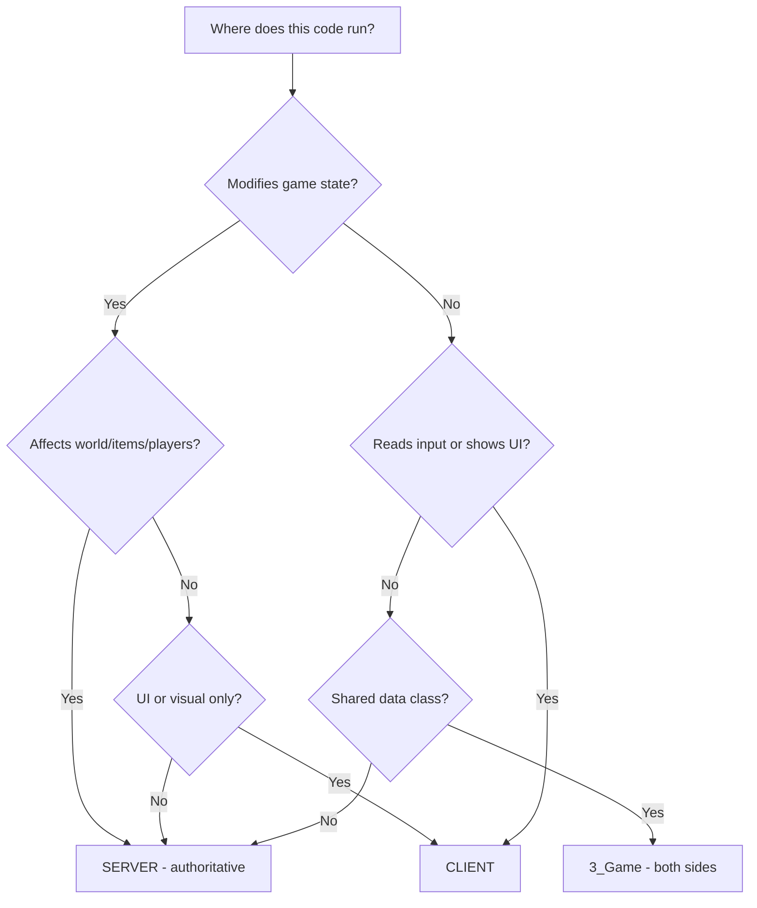

# Chapitre 2.6 : Architecture Serveur vs Client

[Accueil](../README.md) | [<< Précédent : Organisation des fichiers](05-file-organization.md) | **Architecture Serveur vs Client**

---

> **Résumé :** DayZ est un jeu client-serveur. Chaque ligne de code que vous écrivez s'exécute dans un contexte spécifique -- serveur, client ou les deux. Comprendre cette séparation est essentiel pour écrire des mods sécurisés et fonctionnels. Ce chapitre explique où le code s'exécute, comment détecter de quel côté vous êtes, comment structurer les mods multi-packages et les patterns qui gardent le code serveur et client correctement séparés.

---

## Table des matières

- [La séparation fondamentale](#la-séparation-fondamentale)
- [Les trois contextes d'exécution](#les-trois-contextes-dexécution)
- [Vérifier où votre code s'exécute](#vérifier-où-votre-code-sexécute)
- [Le champ type de mod.cpp](#le-champ-type-de-modcpp)
- [Le champ type de config.cpp](#le-champ-type-de-configcpp)
- [Architecture de mod multi-packages](#architecture-de-mod-multi-packages)
- [Les règles d'or](#les-règles-dor)
- [Matrice couche de script et côté](#matrice-couche-de-script-et-côté)
- [Gardes de préprocesseur](#gardes-de-préprocesseur)
- [Patterns serveur-client courants](#patterns-serveur-client-courants)
- [Pièges du serveur listen](#pièges-du-serveur-listen)
- [Dépendances entre mods divisés](#dépendances-entre-mods-divisés)
- [Exemples réels de séparation](#exemples-réels-de-séparation)
- [Erreurs courantes](#erreurs-courantes)
- [Organigramme de décision](#organigramme-de-décision)
- [Checklist de résumé](#checklist-de-résumé)

---

## La séparation fondamentale

DayZ utilise un modèle de **serveur dédié**. Le serveur et le client sont des processus séparés exécutant des exécutables séparés. Ils communiquent via le réseau, et le moteur gère la synchronisation des entités, variables et RPCs.

Cela signifie que votre code de mod s'exécute dans l'un des trois contextes, et les règles pour chacun sont fondamentalement différentes.

```
+------------------------------------------------------------------+
|                                                                  |
|   SERVEUR DÉDIÉ                                                  |
|   - Processus headless (pas de fenêtre, pas de GPU)              |
|   - Autoritatif : possède l'état du jeu                          |
|   - Spawn les entités, applique les dégâts, sauvegarde           |
|   - N'a PAS de joueur, PAS d'UI, PAS d'entrée clavier           |
|   - Exécute : MissionServer                                      |
|                                                                  |
+------------------------------------------------------------------+

          ^                                         ^
          |          RÉSEAU (RPCs, vars sync)        |
          v                                         v

+---------------------------+     +---------------------------+
|                           |     |                           |
|   CLIENT 1                |     |   CLIENT 2                |
|   - A une fenêtre, GPU    |     |   - A une fenêtre, GPU    |
|   - Rend le monde         |     |   - Rend le monde         |
|   - Gère l'entrée joueur  |     |   - Gère l'entrée joueur  |
|   - Affiche UI et HUD     |     |   - Affiche UI et HUD     |
|   - Exécute :             |     |   - Exécute :             |
|     MissionGameplay       |     |     MissionGameplay       |
|                           |     |                           |
+---------------------------+     +---------------------------+
```

---

## Les trois contextes d'exécution

### 1. Serveur dédié

Le serveur dédié est un **processus headless**. Il n'a pas de fenêtre, pas de carte graphique, pas de moniteur, pas de clavier, pas de souris. Il existe uniquement pour exécuter la logique de jeu.

Caractéristiques clés :
- **Autoritatif** -- l'état du serveur est la vérité. Si le serveur dit qu'un joueur a 50 points de vie, le joueur a 50 points de vie.
- **Pas d'objet joueur** -- `GetGame().GetPlayer()` retourne toujours `null` sur un serveur dédié. Le serveur gère TOUS les joueurs mais N'EST aucun d'entre eux.
- **Pas d'UI** -- tout code qui crée des widgets, affiche des menus ou rend des éléments HUD crashera ou échouera silencieusement.
- **Pas d'entrée** -- il n'y a pas de clavier ni de souris. Le code de gestion d'entrée est sans signification ici.
- **Accès au système de fichiers** -- le serveur peut lire et écrire des fichiers dans son répertoire de profil (`$profile:`).
- **Classe de mission** -- le serveur instancie `MissionServer`, pas `MissionGameplay`.

### 2. Client

Le client est le jeu du joueur. Il a une fenêtre, rend des graphiques 3D, joue du son et gère les entrées.

Caractéristiques clés :
- **Couche de présentation** -- le client rend ce que le serveur lui dit de rendre. Il ne décide pas ce qui existe dans le monde.
- **A un joueur** -- `GetGame().GetPlayer()` retourne l'instance `PlayerBase` du joueur local.
- **UI et HUD** -- toute création de widget, chargement de layout et code de menu s'exécute ici.
- **Autorité limitée** -- le client peut DEMANDER des actions (via RPC), mais le serveur DÉCIDE si elles se produisent.
- **Classe de mission** -- le client instancie `MissionGameplay`, pas `MissionServer`.

### 3. Serveur listen (Développement/Test)

Un serveur listen est à la fois serveur ET client dans le même processus. C'est ce que vous obtenez quand vous lancez DayZ via le Workbench ou utilisez le paramètre de lancement `-server` avec un jeu local.

Caractéristiques clés :
- **`IsServer()` et `IsClient()` retournent tous deux true** -- c'est la différence critique avec les serveurs dédiés.
- **A un joueur ET gère tous les joueurs** -- `GetGame().GetPlayer()` retourne le joueur hôte.
- **Les hooks `MissionServer` et `MissionGameplay` s'exécutent tous les deux**.
- **Utilisé uniquement pour le développement** -- les serveurs de production sont toujours dédiés.
- **Peut masquer des bugs** -- le code qui fonctionne sur un serveur listen peut casser sur un serveur dédié.

---

## Vérifier où votre code s'exécute

La fonction globale `GetGame()` retourne l'instance de jeu, qui fournit des méthodes pour détecter le contexte d'exécution :

```c
if (GetGame().IsServer())
{
    // TRUE sur : serveur dédié, serveur listen
    // FALSE sur : client connecté à un serveur distant
    // Utiliser pour : logique côté serveur (spawn, dégâts, sauvegarde)
}

if (GetGame().IsClient())
{
    // TRUE sur : client connecté à un serveur distant, serveur listen
    // FALSE sur : serveur dédié
    // Utiliser pour : code UI, gestion d'entrée, effets visuels
}

if (GetGame().IsDedicatedServer())
{
    // TRUE sur : serveur dédié UNIQUEMENT
    // FALSE sur : client, serveur listen
    // Utiliser pour : code qui ne doit JAMAIS s'exécuter sur un serveur listen
}

if (GetGame().IsMultiplayer())
{
    // TRUE sur : toute session multijoueur (serveur dédié, client distant)
    // FALSE sur : mode solo/hors ligne
}
```

### Table de vérité

| Méthode | Serveur dédié | Client (distant) | Serveur listen |
|---------|:---:|:---:|:---:|
| `IsServer()` | true | false | true |
| `IsClient()` | false | true | true |
| `IsDedicatedServer()` | true | false | false |
| `IsMultiplayer()` | true | true | false |
| `GetPlayer()` retourne | null | PlayerBase | PlayerBase |

### Patterns courants

```c
// Garde : logique serveur uniquement
void SpawnLoot(vector position)
{
    if (!GetGame().IsServer())
        return;

    // Seul le serveur crée les entités
    EntityAI item = EntityAI.Cast(GetGame().CreateObjectEx("AK101", position, ECE_PLACE_ON_SURFACE));
}

// Garde : logique client uniquement
void ShowNotification(string text)
{
    if (!GetGame().IsClient())
        return;

    // Seul le client peut afficher l'UI
    NotificationSystem.AddNotification(text, "set:dayz_gui image:icon_pin");
}
```

---

## Le champ type de mod.cpp

Le fichier `mod.cpp` à la racine de votre dossier de mod contient un champ `type` qui contrôle OÙ le mod est chargé :

### type = "mod" (Les deux côtés)

```
name = "My Mod";
type = "mod";
```

Le mod est chargé sur **le serveur et le client**. Le serveur le charge, les clients le téléchargent et le chargent. Les deux côtés compilent et exécutent les scripts.

**Quand l'utiliser :** La plupart des mods utilisent ceci. Tout mod qui a des types partagés (définitions d'entités, classes de config, structures de données RPC) doit être `type = "mod"` pour que les deux côtés connaissent les mêmes types.

### type = "servermod" (Serveur uniquement)

```
name = "My Mod Server";
type = "servermod";
```

Le mod est chargé sur le **serveur uniquement**. Les clients ne le voient jamais, ne le téléchargent jamais, ne savent jamais qu'il existe.

**Quand l'utiliser :** Logique côté serveur à laquelle les clients ne devraient jamais avoir accès. Cela inclut :
- Algorithmes de spawn (empêche les joueurs de prédire le loot)
- Logique de cerveau IA (empêche l'analyse d'exploits)
- Commandes admin et gestion du serveur
- Connexions à la base de données et appels API externes
- Logique de validation anti-triche

### Pourquoi c'est important pour la sécurité

Si votre logique de spawn est dans un package `type = "mod"`, **chaque joueur le télécharge**. Ils peuvent décompiler le PBO et lire vos algorithmes de spawn, tables de loot, mots de passe admin ou logique anti-triche. Mettez toujours la logique serveur sensible dans un package `type = "servermod"`.

---

## Le champ type de config.cpp

Dans `config.cpp` (dans la section `CfgMods`), il y a aussi un champ `type`. Ce champ devrait correspondre à votre champ type de `mod.cpp`. S'ils ne sont pas d'accord, vous obtenez un comportement imprévisible. Gardez-les cohérents.

Le `config.cpp` contient aussi le tableau `defines[]`, qui est la façon dont vous activez les symboles de préprocesseur pour la détection inter-mods :

```cpp
class CfgMods
{
    class StarDZ_AI
    {
        type = "mod";
        defines[] = { "STARDZ_AI" };    // Les autres mods peuvent utiliser #ifdef STARDZ_AI
    };
};
```

---

## Architecture de mod multi-packages

### Pourquoi diviser en plusieurs packages ?

Un seul dossier de mod avec `type = "mod"` envoie tout aux clients. Pour beaucoup de mods, c'est bien. Mais pour les mods avec une logique serveur sensible, vous devez diviser :

```
@MyMod/                          <-- Package client (type = "mod")
  mod.cpp                        <-- type = "mod"
  Addons/
    MyMod_Scripts.pbo            <-- Partagé : RPCs, classes config, defs d'entités
    MyMod_Data.pbo               <-- Partagé : modèles, textures
    MyMod_GUI.pbo                <-- Client uniquement : layouts, imagesets

@MyModServer/                    <-- Package serveur (type = "servermod")
  mod.cpp                        <-- type = "servermod"
  Addons/
    MyModServer_Scripts.pbo      <-- Serveur uniquement : spawn, cerveau, admin
```

Le serveur charge À LA FOIS `@MyMod` et `@MyModServer`. Les clients ne chargent que `@MyMod`.

### La chaîne de dépendances

Le package serveur dépend du package client, jamais l'inverse :

```cpp
// Mod client : config.cpp
class CfgPatches
{
    class MyMod_Scripts
    {
        requiredAddons[] = { "DZ_Scripts" };  // Pas de dépendance sur le serveur
    };
};

// Mod serveur : config.cpp
class CfgPatches
{
    class MyModServer_Scripts
    {
        requiredAddons[] = { "DZ_Scripts", "MyMod_Scripts" };  // Dépend du client
    };
};
```

---

## Les règles d'or

### Règle 1 : Le serveur est AUTORITATIF

Le serveur possède l'état du jeu. Il décide ce qui existe, où ça existe et ce qui lui arrive. Ne laissez jamais le client prendre des décisions autoritatives.

### Règle 2 : Le client gère la PRÉSENTATION

Le client rend le monde, joue les sons, affiche l'UI et collecte les entrées. Il ne décide pas des résultats du jeu.

### Règle 3 : Le RPC est le PONT

Les appels de procédure à distance (RPCs) sont le seul moyen structuré pour le serveur et le client de communiquer.

### Règle 4 : Ne jamais faire confiance au client

Toute donnée venant d'un client pourrait être trafiquée. Validez toujours côté serveur.

### Matrice de responsabilité

| Tâche | Où | Pourquoi |
|-------|-----|---------|
| Spawn d'entités | Serveur | Empêche la duplication d'objets |
| Appliquer des dégâts | Serveur | Empêche les hacks god mode |
| Supprimer des entités | Serveur | Empêche les exploits de grief |
| Sauvegarder les données joueur | Serveur | Stockage persistant côté serveur |
| Charger les configs | Serveur | Le serveur contrôle les règles du jeu |
| Valider les actions | Serveur | Application anti-triche |
| Vérifier les permissions | Serveur | Le client ne peut pas s'auto-autoriser |
| Afficher les panneaux UI | Client | Le serveur n'a pas d'affichage |
| Lire clavier/souris | Client | Le serveur n'a pas de périphériques d'entrée |
| Jouer les sons | Client | Le serveur n'a pas de sortie audio |
| Rendre les effets | Client | Le serveur n'a pas de GPU |
| Afficher les notifications | Client | Retour visuel pour le joueur |

---

## Matrice couche de script et côté

| Couche | Serveur dédié | Client | Serveur listen | Notes |
|--------|:---:|:---:|:---:|-------|
| `1_Core` | Compilé | Compilé | Compilé | Identique sur tous les côtés |
| `2_GameLib` | Compilé | Compilé | Compilé | Identique sur tous les côtés |
| `3_Game` | Compilé | Compilé | Compilé | Types partagés, configs, RPCs |
| `4_World` | Compilé | Compilé | Compilé | Les entités existent des deux côtés |
| `5_Mission` (MissionServer) | S'exécute | Sauté | S'exécute | Démarrage/arrêt serveur |
| `5_Mission` (MissionGameplay) | Sauté | S'exécute | S'exécute | Init UI/HUD client |

Les couches 1 à 4 compilent et s'exécutent sur **tous les côtés**. Le code est le même. C'est pourquoi les définitions de classes d'entités, les classes de config et les constantes RPC vivent toutes dans `3_Game` ou `4_World` -- les deux côtés en ont besoin.

La couche 5 (`5_Mission`) est là où la séparation devient explicite :
- `MissionServer` est une classe qui n'existe que sur le serveur (et serveur listen)
- `MissionGameplay` est une classe qui n'existe que sur le client (et serveur listen)

---

## Gardes de préprocesseur

### Le define SERVER



Le moteur définit automatiquement `SERVER` lors de la compilation pour un serveur dédié. C'est une vérification à la **compilation**, pas à l'exécution :

```c
#ifdef SERVER
    // Ce code est UNIQUEMENT compilé sur le serveur
    // Il n'existe pas dans le binaire client du tout
#endif

#ifndef SERVER
    // Ce code est UNIQUEMENT compilé sur le client
    // Le serveur ne verra pas ce code
#endif
```

### Quand utiliser les gardes de préprocesseur vs les vérifications à l'exécution

| Approche | Quand utiliser | Exemple |
|----------|---------------|---------|
| `#ifndef SERVER` | Envelopper des définitions de classes entières qui ne devraient exister que sur le client | `modded class MissionGameplay` dans un mod partagé |
| `#ifdef SERVER` | Envelopper des définitions de classes entières qui ne devraient exister que sur le serveur | Classes helper serveur uniquement |
| `GetGame().IsServer()` | Branchement à l'exécution dans du code qui s'exécute des deux côtés | Logique de mise à jour d'entité |
| `GetGame().IsClient()` | Branchement à l'exécution dans du code qui s'exécute des deux côtés | Jouer des effets uniquement côté client |

### Exemple réel : Hook de mission client dans un mod partagé

Quand votre mod client (`type = "mod"`) contient un `modded class MissionGameplay`, vous DEVEZ l'envelopper dans `#ifndef SERVER`. Sinon, le serveur dédié essaiera de le compiler et échouera car `MissionGameplay` n'existe pas sur le serveur :

```c
#ifndef SERVER
modded class MissionGameplay
{
    protected ref MyClientUI m_MyUI;

    override void OnInit()
    {
        super.OnInit();
        m_MyUI = new MyClientUI();
    }
};
#endif
```

---

## Patterns serveur-client courants

### Pattern 1 : Validation serveur avec retour client

Le pattern le plus fondamental dans le modding de jeu multijoueur. Le client demande une action, le serveur la valide et renvoie le résultat.

```c
// 3_Game : Constantes RPC partagées et données (les deux côtés en ont besoin)
class MyRPC
{
    static const int REQUEST_ACTION  = 85001;  // Client -> Serveur
    static const int ACTION_RESULT   = 85002;  // Serveur -> Client
}
```

```c
// Côté client : Envoyer la requête, gérer la réponse
class MyClientHandler
{
    void RequestAction(int actionID)
    {
        if (!GetGame().IsClient())
            return;

        // Envoyer la requête au serveur
        ScriptRPC rpc = new ScriptRPC();
        rpc.Write(actionID);
        rpc.Send(null, MyRPC.REQUEST_ACTION, true);
    }
}
```

```c
// Côté serveur : Valider et répondre
class MyServerHandler
{
    void OnActionRequest(PlayerIdentity sender, ParamsReadContext ctx)
    {
        if (!GetGame().IsServer())
            return;

        int actionID;
        ctx.Read(actionID);

        // VALIDER -- ne jamais faire confiance aux données du client
        bool allowed = ValidateAction(sender, actionID);

        // Exécuter si valide
        if (allowed)
            ExecuteAction(sender, actionID);

        // Envoyer le résultat au client
        ScriptRPC rpc = new ScriptRPC();
        rpc.Write(actionID);
        rpc.Write(allowed);
        rpc.Write(allowed ? "Action completed" : "Action denied");
        rpc.Send(null, MyRPC.ACTION_RESULT, true, sender);
    }
}
```

### Pattern 2 : Synchronisation de config (Serveur vers client)

Le serveur possède la configuration. Quand un joueur se connecte, le serveur envoie les paramètres pertinents au client.

### Pattern 3 : Synchronisation d'état d'entité

Les entités qui existent sur le serveur et le client ont souvent besoin de synchroniser un état personnalisé. Le serveur calcule l'état, puis l'envoie aux clients proches via RPC.

### Pattern 4 : Vérification de permissions

Les permissions sont toujours vérifiées sur le serveur. Le client peut mettre en cache les données de permission pour l'UI (par exemple, griser des boutons), mais le serveur est l'autorité finale.

---

## Pièges du serveur listen

Le serveur listen est l'environnement le plus traître car il brouille la frontière entre serveur et client. Voici les pièges :

### 1. IsServer() et IsClient() sont tous deux true

```c
void MyFunction()
{
    if (GetGame().IsServer())
    {
        // Ceci s'exécute sur le serveur listen
        DoServerThing();
    }

    if (GetGame().IsClient())
    {
        // Ceci s'exécute AUSSI sur le serveur listen
        DoClientThing();
    }

    // Sur un serveur listen, LES DEUX branches s'exécutent !
}
```

**Solution :** Si vous avez besoin de branches exclusives, utilisez `else if` ou vérifiez `IsDedicatedServer()`.

### 2. MissionServer ET MissionGameplay s'exécutent tous les deux

Sur un serveur listen, `modded class MissionServer` et `modded class MissionGameplay` exécutent tous deux leurs hooks. Si vous initialisez le même gestionnaire dans les deux, vous obtenez deux instances.

### 3. GetGame().GetPlayer() fonctionne sur le serveur listen

Sur un serveur dédié, `GetGame().GetPlayer()` retourne toujours null. Sur un serveur listen, il retourne le joueur hôte. Le code qui s'appuie accidentellement sur ceci fonctionnera pendant les tests mais crashera sur un vrai serveur.

### 4. Tester sur le serveur listen masque les bugs

Un piège courant : vous testez votre mod sur un serveur listen, tout fonctionne, vous le publiez, et il crashe sur chaque serveur dédié. **Testez toujours sur un serveur dédié avant de publier.**

---

## Dépendances entre mods divisés

### requiredAddons[] contrôle l'ordre de chargement

Quand vous divisez un mod en packages client et serveur, le package serveur DOIT déclarer le package client comme dépendance :

```cpp
// Package client : config.cpp
class CfgPatches
{
    class SDZ_AI_Scripts
    {
        requiredAddons[] = { "DZ_Scripts", "DZ_Data", "SDZ_Core_Scripts" };
    };
};

// Package serveur : config.cpp
class CfgPatches
{
    class SDZA_Scripts
    {
        requiredAddons[] = { "DZ_Scripts", "SDZ_AI_Scripts", "SDZ_Core_Scripts" };
        //                                 ^^^^^^^^^^^^^^^^
        //                     Le serveur dépend du package client
    };
};
```

### Dépendances souples vs dures

**Dépendance dure :** Listée dans `requiredAddons[]`. Le moteur ne chargera pas votre mod si la dépendance est manquante.

**Dépendance souple :** Détectée via `#ifdef` à la compilation. Le mod se charge indépendamment, mais active des fonctionnalités supplémentaires quand la dépendance est présente.

```c
// Dépendance souple sur StarDZ Core
#ifdef STARDZ_CORE
class SDZ_AIAdminConfig : StarDZConfigBase
{
    // N'existe que si Core est chargé
};
#endif
```

---

## Exemples réels de séparation

### Exemple 1 : StarDZ AI (Client + Serveur)

StarDZ AI se divise en deux packages avec une séparation claire des responsabilités :

```
StarDZ_AI/                              <-- Racine de développement
  StarDZ_AI/                            <-- Package client (type = "mod")
    mod.cpp
    stringtable.csv
    GUI/layouts/                         <-- Client uniquement : UI d'interaction
    Scripts/
      config.cpp                        <-- defines[] = { "STARDZ_AI" }
      3_Game/StarDZ_AI/                 <-- Classe config partagée, constantes, RPCs
      4_World/StarDZ_AI/                <-- Définition d'entité (les deux côtés)
      5_Mission/StarDZ_AI/              <-- UI client (#ifndef SERVER)

  StarDZ_AI_Server/                     <-- Package serveur (type = "servermod")
    mod.cpp
    Scripts/
      config.cpp                        <-- dépend de SDZ_AI_Scripts
      3_Game/StarDZ_AIServer/           <-- Config admin, chargement config serveur
      4_World/StarDZ_AIServer/          <-- Cerveau IA, combat, spawn, perception
      5_Mission/StarDZ_AIServer/        <-- Hook MissionServer
```

Notez le pattern :
- **Package client** a 7 fichiers script : constantes, RPCs, définitions d'entités, UI
- **Package serveur** a 19 fichiers script : le cerveau IA complet, perception, système de combat
- L'essentiel de la logique est côté serveur et invisible aux joueurs

---

## Erreurs courantes

### Erreur 1 : Exécuter la logique serveur sur le client

```c
// FAUX : Ceci s'exécute sur le client -- n'importe quel joueur peut spawn des objets !
void OnButtonClick()
{
    GetGame().CreateObjectEx("M4A1", GetGame().GetPlayer().GetPosition(), ECE_PLACE_ON_SURFACE);
}

// CORRECT : Le client demande, le serveur valide et spawn
void OnButtonClick()
{
    ScriptRPC rpc = new ScriptRPC();
    rpc.Write("M4A1");
    rpc.Send(null, MyRPC.SPAWN_REQUEST, true);
}
```

### Erreur 2 : Code UI dans un mod serveur uniquement

```c
// FAUX : Ceci est dans un package type = "servermod"
// Le serveur n'a pas d'affichage -- la création de widget échoue silencieusement ou crashe
class MyServerPanel
{
    Widget m_Root;

    void Show()
    {
        m_Root = GetGame().GetWorkspace().CreateWidgets("MyMod/GUI/layouts/panel.layout");
        // CRASH : GetWorkspace() retourne null sur un serveur dédié
    }
}
```

**Solution :** Tout le code UI appartient au package client (`type = "mod"`), enveloppé dans `#ifndef SERVER`.

### Erreur 3 : GetGame().GetPlayer() sur le serveur

```c
// FAUX : GetPlayer() est TOUJOURS null sur un serveur dédié
modded class MissionServer
{
    override void OnInit()
    {
        super.OnInit();
        PlayerBase player = PlayerBase.Cast(GetGame().GetPlayer());
        // player est null sur dédié !
        string name = player.GetIdentity().GetName();  // CRASH RÉFÉRENCE NULL
    }
}
```

**Solution :** Sur le serveur, les joueurs vous sont passés via des événements, RPCs ou itération.

### Erreur 4 : Oublier la compatibilité serveur listen

```c
// FAUX : Suppose que IsServer() et IsClient() sont mutuellement exclusifs
void OnEntityCreated(EntityAI entity)
{
    if (GetGame().IsServer())
    {
        RegisterEntity(entity);
        return;  // Le retour anticipé saute le code client
    }

    // Sur un serveur listen, ceci ne s'exécute jamais car IsServer() était true
    UpdateClientDisplay(entity);
}

// CORRECT : Gérer les deux côtés indépendamment
void OnEntityCreated(EntityAI entity)
{
    if (GetGame().IsServer())
    {
        RegisterEntity(entity);
    }

    if (GetGame().IsClient())
    {
        UpdateClientDisplay(entity);
    }
}
```

### Erreur 5 : Ne pas utiliser #ifdef pour la détection optionnelle de mods

```c
// FAUX : Crashe si StarDZ Core n'est pas chargé
class MyModInit
{
    void Init()
    {
        StarDZCore core = StarDZCore.GetInstance();  // ERREUR DE COMPILATION si Core absent
    }
}

// CORRECT : Garder avec une directive de préprocesseur
class MyModInit
{
    void Init()
    {
        #ifdef STARDZ_CORE
        StarDZCore core = StarDZCore.GetInstance();
        if (core)
        {
            ref StarDZModInfo info = new StarDZModInfo("MyMod", "My Mod", "1.0");
            core.RegisterMod(info);
        }
        #endif
    }
}
```

### Erreur 6 : Mettre les types partagés uniquement dans le package serveur

Les structures de données partagées (données RPC, définitions d'entités, classes de config) vont dans le package client (`type = "mod"`) pour que les deux côtés les aient.

### Erreur 7 : Chemins de fichiers serveur en dur sur le client

```c
// FAUX : Le client ne peut pas accéder au répertoire de profil du serveur
void LoadConfig()
{
    string path = "$profile:MyMod/config.json";
    // Sur le client, $profile: pointe vers le profil du CLIENT, pas du serveur
}
```

**Solution :** Le serveur charge les configs et envoie les données pertinentes aux clients via RPC.

---

## Organigramme de décision

Utilisez ceci pour déterminer où un morceau de code appartient :

```
                Crée/détruit-il des entités ?
                       /              \
                     OUI               NON
                      |                 |
              Affiche-t-il de l'UI ?  Affiche-t-il de l'UI ?
                /        \           /          \
              OUI        NON       OUI           NON
               |          |         |             |
           ERREUR !     SERVEUR   CLIENT       Est-ce une classe
        (entités =              uniquement     de données ou une
         serveur,                              constante RPC ?
         UI = client                            /          \
         -- redesigner)                       OUI           NON
                                               |             |
                                           PARTAGÉ        Lit/écrit-il
                                        (mod client)      des fichiers
                                                          ou valide ?
                                                          /          \
                                                        OUI           NON
                                                         |             |
                                                      SERVEUR        PARTAGÉ
                                                   (servermod)    (mod client,
                                                                   garder avec
                                                                   IsServer/
                                                                   IsClient)
```

---

## Checklist de résumé

Avant de publier un mod divisé, vérifiez :

- [ ] Le package client utilise `type = "mod"` dans `mod.cpp` et `config.cpp`
- [ ] Le package serveur utilise `type = "servermod"` dans `mod.cpp` et `config.cpp`
- [ ] Le `config.cpp` du serveur liste le package client dans `requiredAddons[]`
- [ ] Tous les types partagés (données RPC, classes d'entités, enums) sont dans le package client
- [ ] Toute la logique serveur (spawn, validation, cerveaux IA) est dans le package serveur
- [ ] Les classes `MissionGameplay` moddées sont enveloppées dans `#ifndef SERVER`
- [ ] Pas d'appels `GetGame().GetPlayer()` sur le serveur sans vérifications null
- [ ] Pas de code UI/widget dans le package serveur
- [ ] Les dépendances optionnelles utilisent des gardes `#ifdef`, pas des références directes
- [ ] Le tableau `defines[]` correspond entre `mod.cpp` et `config.cpp`
- [ ] Testé sur un **serveur dédié**, pas seulement un serveur listen
- [ ] Les fichiers de config serveur sont chargés côté serveur et synchronisés via RPC, pas lus par les clients

---

**Précédent :** [Chapitre 2.5 : Bonnes pratiques d'organisation des fichiers](05-file-organization.md)
**Suivant :** [Partie 3 : Système GUI & Layout](../03-gui-system/01-widget-types.md)
