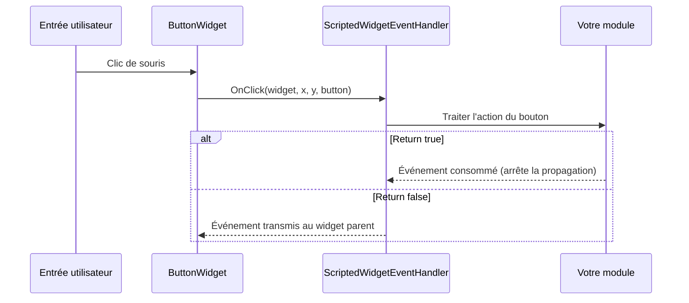

# Chapitre 3.6 : Gestion des événements

[Accueil](../README.md) | [<< Précédent : Création programmatique de widgets](05-programmatic-widgets.md) | **Gestion des événements** | [Suivant : Styles, polices et images >>](07-styles-fonts.md)

---

Les widgets génèrent des événements lorsque l'utilisateur interagit avec eux -- cliquer sur des boutons, saisir du texte dans des champs de saisie, déplacer la souris, faire glisser des éléments. Ce chapitre explique comment recevoir et gérer ces événements.

---

## ScriptedWidgetEventHandler

La classe `ScriptedWidgetEventHandler` est la base de toute gestion d'événements de widgets dans DayZ. Elle fournit des méthodes à surcharger pour chaque événement de widget possible.

Pour recevoir des événements d'un widget, créez une classe qui étend `ScriptedWidgetEventHandler`, surchargez les méthodes d'événements qui vous intéressent, et attachez le gestionnaire au widget avec `SetHandler()`.

### Liste complète des méthodes d'événements

```c
class ScriptedWidgetEventHandler
{
    // Événements de clic
    bool OnClick(Widget w, int x, int y, int button);
    bool OnDoubleClick(Widget w, int x, int y, int button);

    // Événements de sélection
    bool OnSelect(Widget w, int x, int y);
    bool OnItemSelected(Widget w, int x, int y, int row, int column,
                         int oldRow, int oldColumn);

    // Événements de focus
    bool OnFocus(Widget w, int x, int y);
    bool OnFocusLost(Widget w, int x, int y);

    // Événements de souris
    bool OnMouseEnter(Widget w, int x, int y);
    bool OnMouseLeave(Widget w, Widget enterW, int x, int y);
    bool OnMouseWheel(Widget w, int x, int y, int wheel);
    bool OnMouseButtonDown(Widget w, int x, int y, int button);
    bool OnMouseButtonUp(Widget w, int x, int y, int button);

    // Événements clavier
    bool OnKeyDown(Widget w, int x, int y, int key);
    bool OnKeyUp(Widget w, int x, int y, int key);
    bool OnKeyPress(Widget w, int x, int y, int key);

    // Événements de changement (curseurs, cases à cocher, champs de saisie)
    bool OnChange(Widget w, int x, int y, bool finished);

    // Événements de glisser-déposer
    bool OnDrag(Widget w, int x, int y);
    bool OnDragging(Widget w, int x, int y, Widget receiver);
    bool OnDraggingOver(Widget w, int x, int y, Widget receiver);
    bool OnDrop(Widget w, int x, int y, Widget receiver);
    bool OnDropReceived(Widget w, int x, int y, Widget receiver);

    // Événements de manette (gamepad)
    bool OnController(Widget w, int control, int value);

    // Événements de layout
    bool OnResize(Widget w, int x, int y);
    bool OnChildAdd(Widget w, Widget child);
    bool OnChildRemove(Widget w, Widget child);

    // Autres
    bool OnUpdate(Widget w);
    bool OnModalResult(Widget w, int x, int y, int code, int result);
}
```

### Valeur de retour : consommé vs transmis

Chaque gestionnaire d'événement retourne un `bool` :

- **`return true;`** -- L'événement est **consommé**. Aucun autre gestionnaire ne le recevra. L'événement arrête de se propager dans la hiérarchie des widgets.
- **`return false;`** -- L'événement est **transmis** au gestionnaire du widget parent (s'il y en a un).

C'est essentiel pour construire des interfaces superposées. Par exemple, un gestionnaire de clic de bouton devrait retourner `true` pour empêcher le clic de déclencher également un panneau derrière lui.

### Flux d'événements



---

## Enregistrer des gestionnaires avec SetHandler()

La manière la plus simple de gérer les événements est d'appeler `SetHandler()` sur un widget :

```c
class MyPanel : ScriptedWidgetEventHandler
{
    protected Widget m_Root;
    protected ButtonWidget m_SaveBtn;
    protected ButtonWidget m_CancelBtn;

    void MyPanel()
    {
        m_Root = GetGame().GetWorkspace().CreateWidgets(
            "MyMod/gui/layouts/panel.layout");

        m_SaveBtn = ButtonWidget.Cast(m_Root.FindAnyWidget("SaveButton"));
        m_CancelBtn = ButtonWidget.Cast(m_Root.FindAnyWidget("CancelButton"));

        // Enregistrer cette classe comme gestionnaire d'événements pour les deux boutons
        m_SaveBtn.SetHandler(this);
        m_CancelBtn.SetHandler(this);
    }

    override bool OnClick(Widget w, int x, int y, int button)
    {
        if (w == m_SaveBtn)
        {
            Save();
            return true;  // Consommé
        }

        if (w == m_CancelBtn)
        {
            Cancel();
            return true;
        }

        return false;  // Pas notre widget, transmettre
    }
}
```

Une seule instance de gestionnaire peut être enregistrée sur plusieurs widgets. À l'intérieur de la méthode d'événement, comparez `w` (le widget qui a généré l'événement) avec vos références mises en cache pour déterminer quel widget a été sollicité.

---

## Événements courants en détail

### OnClick

```c
bool OnClick(Widget w, int x, int y, int button)
```

Déclenché lorsqu'un `ButtonWidget` est cliqué (bouton de souris relâché sur le widget).

- `w` -- Le widget cliqué
- `x, y` -- Position du curseur de la souris (pixels écran)
- `button` -- Index du bouton de la souris : `0` = gauche, `1` = droit, `2` = milieu

```c
override bool OnClick(Widget w, int x, int y, int button)
{
    if (button != 0) return false;  // Ne gérer que le clic gauche

    if (w == m_MyButton)
    {
        DoAction();
        return true;
    }
    return false;
}
```

### OnChange

```c
bool OnChange(Widget w, int x, int y, bool finished)
```

Déclenché par `SliderWidget`, `CheckBoxWidget`, `EditBoxWidget` et d'autres widgets basés sur des valeurs lorsque leur valeur change.

- `w` -- Le widget dont la valeur a changé
- `finished` -- Pour les curseurs : `true` lorsque l'utilisateur relâche la poignée du curseur. Pour les champs de saisie : `true` lorsque la touche Entrée est pressée.

```c
override bool OnChange(Widget w, int x, int y, bool finished)
{
    if (w == m_VolumeSlider)
    {
        SliderWidget slider = SliderWidget.Cast(w);
        float value = slider.GetCurrent();

        // Appliquer uniquement quand l'utilisateur a fini de glisser
        if (finished)
        {
            ApplyVolume(value);
        }
        else
        {
            // Aperçu pendant le glissement
            PreviewVolume(value);
        }
        return true;
    }

    if (w == m_NameInput)
    {
        EditBoxWidget edit = EditBoxWidget.Cast(w);
        string text = edit.GetText();

        if (finished)
        {
            // L'utilisateur a pressé Entrée
            SubmitName(text);
        }
        return true;
    }

    if (w == m_EnableCheckbox)
    {
        CheckBoxWidget cb = CheckBoxWidget.Cast(w);
        bool checked = cb.IsChecked();
        ToggleFeature(checked);
        return true;
    }

    return false;
}
```

### OnMouseEnter / OnMouseLeave

```c
bool OnMouseEnter(Widget w, int x, int y)
bool OnMouseLeave(Widget w, Widget enterW, int x, int y)
```

Déclenchés lorsque le curseur de la souris entre ou quitte les limites d'un widget. Le paramètre `enterW` dans `OnMouseLeave` est le widget vers lequel le curseur s'est déplacé.

Utilisation courante : effets de survol.

```c
override bool OnMouseEnter(Widget w, int x, int y)
{
    if (w == m_HoverPanel)
    {
        m_HoverPanel.SetColor(ARGB(255, 80, 130, 200));  // Surbrillance
        return true;
    }
    return false;
}

override bool OnMouseLeave(Widget w, Widget enterW, int x, int y)
{
    if (w == m_HoverPanel)
    {
        m_HoverPanel.SetColor(ARGB(255, 50, 50, 50));  // Par défaut
        return true;
    }
    return false;
}
```

### OnFocus / OnFocusLost

```c
bool OnFocus(Widget w, int x, int y)
bool OnFocusLost(Widget w, int x, int y)
```

Déclenchés lorsqu'un widget obtient ou perd le focus clavier. Important pour les champs de saisie et autres widgets de saisie de texte.

```c
override bool OnFocus(Widget w, int x, int y)
{
    if (w == m_SearchBox)
    {
        m_SearchBox.SetColor(ARGB(255, 100, 160, 220));
        return true;
    }
    return false;
}

override bool OnFocusLost(Widget w, int x, int y)
{
    if (w == m_SearchBox)
    {
        m_SearchBox.SetColor(ARGB(255, 60, 60, 60));
        return true;
    }
    return false;
}
```

### OnMouseWheel

```c
bool OnMouseWheel(Widget w, int x, int y, int wheel)
```

Déclenché lorsque la molette de la souris défile sur un widget. `wheel` est positif pour le défilement vers le haut, négatif pour le défilement vers le bas.

### OnKeyDown / OnKeyUp / OnKeyPress

```c
bool OnKeyDown(Widget w, int x, int y, int key)
bool OnKeyUp(Widget w, int x, int y, int key)
bool OnKeyPress(Widget w, int x, int y, int key)
```

Événements clavier. Le paramètre `key` correspond aux constantes `KeyCode` (par exemple, `KeyCode.KC_ESCAPE`, `KeyCode.KC_RETURN`).

### OnDrag / OnDrop / OnDropReceived

```c
bool OnDrag(Widget w, int x, int y)
bool OnDrop(Widget w, int x, int y, Widget receiver)
bool OnDropReceived(Widget w, int x, int y, Widget receiver)
```

Événements de glisser-déposer. Le widget doit avoir `draggable 1` dans son layout (ou `WidgetFlags.DRAGGABLE` défini dans le code).

- `OnDrag` -- L'utilisateur a commencé à glisser le widget `w`
- `OnDrop` -- Le widget `w` a été déposé ; `receiver` est le widget en dessous
- `OnDropReceived` -- Le widget `w` a reçu un dépôt ; `receiver` est le widget déposé

### OnItemSelected

```c
bool OnItemSelected(Widget w, int x, int y, int row, int column,
                     int oldRow, int oldColumn)
```

Déclenché par `TextListboxWidget` lorsqu'une ligne est sélectionnée.

---

## WidgetEventHandler vanilla (enregistrement de callbacks)

Le code vanilla de DayZ utilise un patron alternatif : `WidgetEventHandler`, un singleton qui route les événements vers des fonctions de callback nommées. Ceci est couramment utilisé dans les menus vanilla.

```c
WidgetEventHandler handler = WidgetEventHandler.GetInstance();

// Enregistrer des callbacks d'événements par nom de fonction
handler.RegisterOnClick(myButton, this, "OnMyButtonClick");
handler.RegisterOnMouseEnter(myWidget, this, "OnHoverStart");
handler.RegisterOnMouseLeave(myWidget, this, "OnHoverEnd");
handler.RegisterOnDoubleClick(myWidget, this, "OnDoubleClick");
handler.RegisterOnMouseButtonDown(myWidget, this, "OnMouseDown");
handler.RegisterOnMouseButtonUp(myWidget, this, "OnMouseUp");
handler.RegisterOnMouseWheel(myWidget, this, "OnWheel");
handler.RegisterOnFocus(myWidget, this, "OnFocusGained");
handler.RegisterOnFocusLost(myWidget, this, "OnFocusLost");
handler.RegisterOnDrag(myWidget, this, "OnDragStart");
handler.RegisterOnDrop(myWidget, this, "OnDropped");
handler.RegisterOnDropReceived(myWidget, this, "OnDropReceived");
handler.RegisterOnDraggingOver(myWidget, this, "OnDragOver");
handler.RegisterOnChildAdd(myWidget, this, "OnChildAdded");
handler.RegisterOnChildRemove(myWidget, this, "OnChildRemoved");

// Désenregistrer tous les callbacks pour un widget
handler.UnregisterWidget(myWidget);
```

Les signatures des fonctions de callback doivent correspondre au type d'événement :

```c
void OnMyButtonClick(Widget w, int x, int y, int button)
{
    // Gérer le clic
}

void OnHoverStart(Widget w, int x, int y)
{
    // Gérer l'entrée de la souris
}

void OnHoverEnd(Widget w, Widget enterW, int x, int y)
{
    // Gérer la sortie de la souris
}
```

### SetHandler() vs WidgetEventHandler

| Aspect | SetHandler() | WidgetEventHandler |
|---|---|---|
| Patron | Surcharger des méthodes virtuelles | Enregistrer des callbacks nommés |
| Gestionnaire par widget | Un gestionnaire par widget | Plusieurs callbacks par événement |
| Utilisé par | DabsFramework, Expansion, mods personnalisés | Menus vanilla de DayZ |
| Flexibilité | Doit gérer tous les événements dans une seule classe | Peut enregistrer des cibles différentes pour des événements différents |
| Nettoyage | Implicite à la destruction du gestionnaire | Doit appeler `UnregisterWidget()` |

Pour les nouveaux mods, `SetHandler()` avec `ScriptedWidgetEventHandler` est l'approche recommandée.

---

## Exemple complet : panneau de boutons interactif

Un panneau avec trois boutons qui changent de couleur au survol et exécutent des actions au clic :

```c
class InteractivePanel : ScriptedWidgetEventHandler
{
    protected Widget m_Root;
    protected ButtonWidget m_BtnStart;
    protected ButtonWidget m_BtnStop;
    protected ButtonWidget m_BtnReset;
    protected TextWidget m_StatusText;

    protected int m_DefaultColor = ARGB(255, 60, 60, 60);
    protected int m_HoverColor   = ARGB(255, 80, 130, 200);
    protected int m_ActiveColor  = ARGB(255, 50, 180, 80);

    void InteractivePanel()
    {
        m_Root = GetGame().GetWorkspace().CreateWidgets(
            "MyMod/gui/layouts/interactive_panel.layout");

        m_BtnStart  = ButtonWidget.Cast(m_Root.FindAnyWidget("BtnStart"));
        m_BtnStop   = ButtonWidget.Cast(m_Root.FindAnyWidget("BtnStop"));
        m_BtnReset  = ButtonWidget.Cast(m_Root.FindAnyWidget("BtnReset"));
        m_StatusText = TextWidget.Cast(m_Root.FindAnyWidget("StatusText"));

        // Enregistrer ce gestionnaire sur tous les widgets interactifs
        m_BtnStart.SetHandler(this);
        m_BtnStop.SetHandler(this);
        m_BtnReset.SetHandler(this);
    }

    override bool OnClick(Widget w, int x, int y, int button)
    {
        if (button != 0) return false;

        if (w == m_BtnStart)
        {
            m_StatusText.SetText("Started");
            m_StatusText.SetColor(m_ActiveColor);
            return true;
        }
        if (w == m_BtnStop)
        {
            m_StatusText.SetText("Stopped");
            m_StatusText.SetColor(ARGB(255, 200, 50, 50));
            return true;
        }
        if (w == m_BtnReset)
        {
            m_StatusText.SetText("Ready");
            m_StatusText.SetColor(ARGB(255, 200, 200, 200));
            return true;
        }
        return false;
    }

    override bool OnMouseEnter(Widget w, int x, int y)
    {
        if (w == m_BtnStart || w == m_BtnStop || w == m_BtnReset)
        {
            w.SetColor(m_HoverColor);
            return true;
        }
        return false;
    }

    override bool OnMouseLeave(Widget w, Widget enterW, int x, int y)
    {
        if (w == m_BtnStart || w == m_BtnStop || w == m_BtnReset)
        {
            w.SetColor(m_DefaultColor);
            return true;
        }
        return false;
    }

    void Show(bool visible)
    {
        m_Root.Show(visible);
    }

    void ~InteractivePanel()
    {
        if (m_Root)
        {
            m_Root.Unlink();
            m_Root = null;
        }
    }
}
```

---

## Bonnes pratiques pour la gestion des événements

1. **Retournez toujours `true` lorsque vous gérez un événement** -- Sinon l'événement se propage aux widgets parents et peut déclencher un comportement non souhaité.

2. **Retournez `false` pour les événements que vous ne gérez pas** -- Cela permet aux widgets parents de traiter l'événement.

3. **Mettez en cache les références de widgets** -- N'appelez pas `FindAnyWidget()` à l'intérieur des gestionnaires d'événements. Recherchez les widgets une seule fois dans le constructeur et stockez les références.

4. **Vérifiez la nullité des widgets dans les événements** -- Le widget `w` est généralement valide, mais un codage défensif empêche les plantages.

5. **Nettoyez les gestionnaires** -- Lors de la destruction d'un panneau, détachez le widget racine. Si vous utilisez `WidgetEventHandler`, appelez `UnregisterWidget()`.

6. **Utilisez le paramètre `finished` judicieusement** -- Pour les curseurs, n'appliquez les opérations coûteuses que lorsque `finished` est `true` (l'utilisateur a relâché la poignée). Utilisez les événements non terminés pour l'aperçu.

7. **Différez le travail lourd** -- Si un gestionnaire d'événement doit effectuer un calcul coûteux, utilisez `CallLater` pour le différer :

```c
override bool OnClick(Widget w, int x, int y, int button)
{
    if (w == m_HeavyActionBtn)
    {
        GetGame().GetCallQueue(CALL_CATEGORY_GUI).CallLater(DoHeavyWork, 0, false);
        return true;
    }
    return false;
}
```

---

## Théorie vs pratique

> Ce que la documentation dit par rapport à ce qui se passe réellement à l'exécution.

| Concept | Théorie | Réalité |
|---------|--------|---------|
| `OnClick` se déclenche sur n'importe quel widget | N'importe quel widget peut recevoir des événements de clic | Seul `ButtonWidget` déclenche `OnClick` de manière fiable. Pour les autres types de widgets, utilisez `OnMouseButtonDown` / `OnMouseButtonUp` à la place |
| `SetHandler()` remplace le gestionnaire | Définir un nouveau gestionnaire remplace l'ancien | Correct, mais l'ancien gestionnaire n'est pas notifié. S'il détenait des ressources, elles fuient. Nettoyez toujours avant de remplacer les gestionnaires |
| Le paramètre `finished` de `OnChange` | `true` quand l'utilisateur finit l'interaction | Pour `EditBoxWidget`, `finished` est `true` uniquement sur la touche Entrée -- changer d'onglet ou cliquer ailleurs ne met PAS `finished` à `true` |
| Propagation de la valeur de retour des événements | `return false` transmet l'événement au parent | Les événements se propagent vers le haut dans l'arborescence des widgets, pas vers les widgets frères. Un `return false` d'un enfant va à son parent, jamais à un widget adjacent |
| Noms de callbacks de `WidgetEventHandler` | N'importe quel nom de fonction fonctionne | La fonction doit exister sur l'objet cible au moment de l'enregistrement. Si le nom de la fonction est mal orthographié, l'enregistrement réussit silencieusement mais le callback ne se déclenche jamais |

---

## Compatibilité et impact

- **Multi-Mod :** `SetHandler()` n'autorise qu'un seul gestionnaire par widget. Si le mod A et le mod B appellent tous deux `SetHandler()` sur le même widget vanilla (via `modded class`), le dernier gagne et l'autre cesse silencieusement de recevoir les événements. Utilisez `WidgetEventHandler.RegisterOnClick()` pour une compatibilité multi-mod additive.
- **Performance :** Les gestionnaires d'événements s'exécutent sur le thread principal du jeu. Un gestionnaire `OnClick` lent (par exemple, E/S de fichiers ou calculs complexes) provoque un saccadement visible des frames. Différez le travail lourd avec `GetGame().GetCallQueue(CALL_CATEGORY_GUI).CallLater()`.
- **Version :** L'API `ScriptedWidgetEventHandler` est stable depuis DayZ 1.0. Les callbacks singleton de `WidgetEventHandler` sont des patrons vanilla présents depuis les premières versions d'Enforce Script et restent inchangés.

---

## Observé dans les mods réels

| Patron | Mod | Détail |
|---------|-----|--------|
| Gestionnaire unique pour tout le panneau | COT, VPP Admin Tools | Une seule sous-classe de `ScriptedWidgetEventHandler` gère tous les boutons d'un panneau, en dispatchant par comparaison de `w` avec les références de widgets mises en cache |
| `WidgetEventHandler.RegisterOnClick` pour les boutons modulaires | Expansion Market | Chaque bouton achat/vente créé dynamiquement enregistre son propre callback, permettant des fonctions de gestionnaire par élément |
| `OnMouseEnter` / `OnMouseLeave` pour les infobulles de survol | DayZ Editor | Les événements de survol déclenchent des widgets d'infobulle qui suivent la position du curseur via `GetMousePos()` |
| Report de `CallLater` dans `OnClick` | DabsFramework | Les opérations lourdes (sauvegarde de config, envoi RPC) sont différées de 0ms via `CallLater` pour éviter de bloquer le thread de l'interface pendant l'événement |

---

## Prochaines étapes

- [3.7 Styles, polices et images](07-styles-fonts.md) -- Stylisation visuelle avec les styles, les polices et les références d'imagesets
- [3.5 Création programmatique de widgets](05-programmatic-widgets.md) -- Créer des widgets qui génèrent des événements
