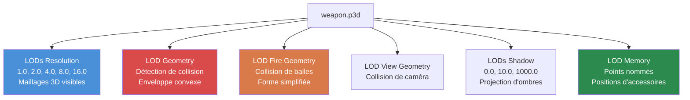

# Chapitre 4.2 : Modèles 3D (.p3d)

[Accueil](../README.md) | [<< Précédent : Textures](01-textures.md) | **Modèles 3D** | [Suivant : Matériaux >>](03-materials.md)

---

## Introduction

Chaque objet physique dans DayZ -- armes, vêtements, bâtiments, véhicules, arbres, rochers -- est un modèle 3D stocké dans le format propriétaire **P3D** de Bohemia. Le format P3D est bien plus qu'un conteneur de maillage : il encode plusieurs niveaux de détail, la géométrie de collision, les sélections d'animation, les points mémoire pour les accessoires et les effets, et les positions de proxy pour les objets montables. Comprendre comment fonctionnent les fichiers P3D et comment les créer avec **Object Builder** est essentiel pour tout mod qui ajoute des objets physiques au monde du jeu.

Ce chapitre couvre la structure du format P3D, le système de LOD, les sélections nommées, les points mémoire, le système de proxy, la configuration d'animation via `model.cfg`, et le workflow d'importation depuis les formats 3D standards.

---

## Table des matières

- [Vue d'ensemble du format P3D](#vue-densemble-du-format-p3d)
- [Object Builder](#object-builder)
- [Le système de LOD](#le-système-de-lod)
- [Sélections nommées](#sélections-nommées)
- [Points mémoire](#points-mémoire)
- [Le système de proxy](#le-système-de-proxy)
- [Model.cfg pour les animations](#modelcfg-pour-les-animations)
- [Importation depuis FBX/OBJ](#importation-depuis-fbxobj)
- [Types de modèles courants](#types-de-modèles-courants)
- [Erreurs courantes](#erreurs-courantes)
- [Bonnes pratiques](#bonnes-pratiques)

---

## Vue d'ensemble du format P3D

**P3D** (Point 3D) est le format de modèle 3D binaire de Bohemia Interactive, hérité du moteur Real Virtuality et poursuivi dans Enfusion. C'est un format compilé, prêt pour le moteur -- vous n'écrivez pas de fichiers P3D à la main.

### Caractéristiques clés

- **Format binaire :** Non lisible par l'humain. Créé et édité exclusivement avec Object Builder.
- **Conteneur multi-LOD :** Un seul fichier P3D contient plusieurs maillages LOD (Level of Detail), chacun avec un but différent.
- **Natif au moteur :** Le moteur DayZ charge les P3D directement. Aucune conversion à l'exécution n'est effectuée.
- **Binarisé vs. non binarisé :** Les fichiers P3D sources d'Object Builder sont "MLOD" (éditables). Binarize les convertit en "ODOL" (optimisés, lecture seule). Le jeu peut charger les deux, mais ODOL se charge plus vite et est plus petit.

### Types de fichiers que vous rencontrerez

| Extension | Description |
|-----------|-------------|
| `.p3d` | Modèle 3D (à la fois MLOD source et ODOL binarisé) |
| `.rtm` | Runtime Motion -- données de keyframes d'animation |
| `.bisurf` | Fichier de propriétés de surface (utilisé aux côtés de P3D) |

### MLOD vs. ODOL

| Propriété | MLOD (Source) | ODOL (Binarisé) |
|-----------|---------------|------------------|
| Créé par | Object Builder | Binarize |
| Éditable | Oui | Non |
| Taille de fichier | Plus grande | Plus petite |
| Vitesse de chargement | Plus lente | Plus rapide |
| Utilisé pendant | Le développement | La publication |
| Contient | Données d'édition complètes, sélections nommées | Données de maillage optimisées |

> **Important :** Quand vous empaquetez un PBO avec la binarisation activée, vos fichiers P3D MLOD sont automatiquement convertis en ODOL. Si vous empaquetez avec `-packonly`, les fichiers MLOD sont inclus tels quels. Les deux fonctionnent en jeu, mais ODOL est préféré pour les builds de publication.

---

## Object Builder

**Object Builder** est l'outil fourni par Bohemia pour créer et éditer des modèles P3D. Il est inclus dans la suite DayZ Tools sur Steam.

### Capacités principales

- Créer et éditer des maillages 3D avec des sommets, arêtes et faces.
- Définir plusieurs LODs dans un seul fichier P3D.
- Assigner des **sélections nommées** (groupes de sommets/faces) pour l'animation et le contrôle des textures.
- Placer des **points mémoire** pour les positions d'accessoires, origines de particules et sources sonores.
- Ajouter des **objets proxy** pour les objets attachables (chargeurs, optiques, etc.).
- Assigner des matériaux (`.rvmat`) et textures (`.paa`) aux faces.
- Importer des maillages depuis les formats FBX, OBJ et 3DS.
- Exporter des fichiers P3D validés pour Binarize.

### Configuration de l'espace de travail

Object Builder nécessite que le **lecteur P:** (workdrive) soit configuré. Ce lecteur virtuel fournit un préfixe de chemin unifié que le moteur utilise pour localiser les assets.

```
P:\
  DZ\                        <-- Données vanilla DayZ (extraites)
  DayZ Tools\                <-- Installation des outils
  MyMod\                     <-- Répertoire source de votre mod
    data\
      models\
        my_item.p3d
      textures\
        my_item_co.paa
```

Tous les chemins dans les fichiers P3D et les matériaux sont relatifs à la racine du lecteur P:. Par exemple, une référence de matériau à l'intérieur du modèle serait `MyMod\data\textures\my_item_co.paa`.

### Workflow de base dans Object Builder

1. **Créer ou importer** votre géométrie de maillage.
2. **Définir les LODs** -- au minimum, créer les LODs Resolution, Geometry et Fire Geometry.
3. **Assigner les matériaux** aux faces dans le LOD Resolution.
4. **Nommer les sélections** pour toute partie qui s'anime, échange de texture ou nécessite une interaction avec le code.
5. **Placer les points mémoire** pour les accessoires, positions de flash de bouche, ports d'éjection, etc.
6. **Ajouter les proxies** pour les objets attachables (optiques, chargeurs, silencieux).
7. **Valider** avec la validation intégrée d'Object Builder (Structure --> Validate).
8. **Sauvegarder** en P3D.
9. **Builder** via Binarize ou AddonBuilder.

---

## Le système de LOD

Un fichier P3D contient plusieurs **LODs** (Levels of Detail), chacun servant un but spécifique. Le moteur sélectionne quel LOD utiliser en fonction de la situation -- distance de la caméra, calculs de physique, rendu d'ombres, etc.

### Types de LOD

| LOD | Valeur de résolution | But |
|-----|---------------------|-----|
| **Resolution 0** | 1.000 | Maillage visuel le plus détaillé. Rendu quand l'objet est proche de la caméra. |
| **Resolution 1** | 1.100 | Détail moyen. Rendu à distance modérée. |
| **Resolution 2** | 1.200 | Faible détail. Rendu à grande distance. |
| **Resolution 3+** | 1.300+ | LODs de distance supplémentaires. |
| **View Geometry** | Spécial | Détermine ce qui bloque la vue du joueur (première personne). Maillage simplifié. |
| **Fire Geometry** | Spécial | Collision pour les balles et projectiles. Doit être convexe ou composé de parties convexes. |
| **Geometry** | Spécial | Collision physique. Utilisé pour la collision de mouvement, la gravité, le placement. Doit être convexe ou composé de décomposition convexe. |
| **Shadow 0** | Spécial | Maillage de projection d'ombres (courte portée). |
| **Shadow 1000** | Spécial | Maillage de projection d'ombres (longue portée). Plus simple que Shadow 0. |
| **Memory** | Spécial | Contient uniquement des points nommés (pas de géométrie visible). Utilisé pour les positions d'accessoires, origines sonores, etc. |
| **Roadway** | Spécial | Définit les surfaces praticables sur les objets (véhicules, bâtiments avec intérieurs accessibles). |
| **Paths** | Spécial | Indices de pathfinding IA pour les bâtiments. |

### Hiérarchie des LOD



### Valeurs de résolution des LOD (LODs visuels)

Le moteur utilise une formule basée sur la distance et la taille de l'objet pour déterminer quel LOD visuel rendre :

```
LOD sélectionné = (distance_à_l'objet * facteur_LOD) / rayon_sphère_englobante_objet
```

Des valeurs plus basses = caméra plus proche. Le moteur trouve le LOD dont la valeur de résolution correspond le mieux à la valeur calculée.

### Création de LODs dans Object Builder

1. **File --> New LOD** ou clic droit sur la liste des LODs.
2. Sélectionnez le type de LOD dans le menu déroulant.
3. Pour les LODs visuels (Resolution), entrez la valeur de résolution.
4. Modélisez la géométrie pour ce LOD.

### Exigences de LOD par type d'objet

| Type d'objet | LODs requis | LODs supplémentaires recommandés |
|--------------|-------------|----------------------------------|
| **Objet portatif** | Resolution 0, Geometry, Fire Geometry, Memory | Shadow 0, Resolution 1 |
| **Vêtement** | Resolution 0, Geometry, Fire Geometry, Memory | Shadow 0, Resolution 1, Resolution 2 |
| **Arme** | Resolution 0, Geometry, Fire Geometry, View Geometry, Memory | Shadow 0, Resolution 1, Resolution 2 |
| **Bâtiment** | Resolution 0, Geometry, Fire Geometry, View Geometry, Memory | Shadow 0, Shadow 1000, Roadway, Paths |
| **Véhicule** | Resolution 0, Geometry, Fire Geometry, View Geometry, Memory | Shadow 0, Roadway, Resolution 1+ |

### Règles du LOD Geometry

Les LODs Geometry et Fire Geometry ont des exigences strictes :

- **Doivent être convexes** ou composés de plusieurs composants convexes. Le système physique du moteur exige des formes de collision convexes.
- **Les sélections nommées doivent correspondre** à celles du LOD Resolution (pour les parties animées).
- **La masse doit être définie.** Sélectionnez tous les sommets dans le LOD Geometry et assignez la masse via **Structure --> Mass**. Cela détermine le poids physique de l'objet.
- **Gardez-le simple.** Moins de triangles = meilleures performances physiques. Le LOD geometry d'une arme peut avoir 20-50 triangles vs. des milliers dans le LOD visuel.

---

## Sélections nommées

Les sélections nommées sont des groupes de sommets, arêtes ou faces dans un LOD qui sont étiquetés avec un nom. Elles servent de poignées que le moteur et les scripts utilisent pour manipuler des parties d'un modèle.

### Ce que font les sélections nommées

| But | Exemple de nom de sélection | Utilisé par |
|-----|----------------------------|-------------|
| **Animation** | `bolt`, `trigger`, `magazine` | Sources d'animation `model.cfg` |
| **Échange de textures** | `camo`, `camo1`, `body` | `hiddenSelections[]` dans config.cpp |
| **Textures de dégâts** | `zbytek` | Système de dégâts du moteur, échanges de matériaux |
| **Points d'attache** | `magazine`, `optics`, `suppressor` | Système de proxy et d'accessoires |

### hiddenSelections (échanges de textures)

L'utilisation la plus courante des sélections nommées pour les moddeurs est **hiddenSelections** -- la possibilité d'échanger des textures à l'exécution via config.cpp.

**Dans le modèle P3D (LOD Resolution) :**
1. Sélectionnez les faces qui doivent être retexturables.
2. Nommez la sélection (par ex. `camo`).

**Dans config.cpp :**
```cpp
class MyRifle: Rifle_Base
{
    hiddenSelections[] = {"camo"};
    hiddenSelectionsTextures[] = {"MyMod\data\my_rifle_co.paa"};
    hiddenSelectionsMaterials[] = {"MyMod\data\my_rifle.rvmat"};
};
```

Cela permet différentes variantes du même modèle avec différentes textures sans dupliquer le fichier P3D.

### Création de sélections nommées

Dans Object Builder :

1. Sélectionnez les sommets ou faces que vous voulez grouper.
2. Allez dans **Structure --> Named Selections** (ou appuyez sur Ctrl+N).
3. Cliquez sur **New**, entrez le nom de la sélection.
4. Cliquez sur **Assign** pour étiqueter la géométrie sélectionnée avec ce nom.

> **Astuce :** Les noms de sélection sont sensibles à la casse. `Camo` et `camo` sont des sélections différentes. La convention est en minuscules.

### Sélections entre LODs

Les sélections nommées doivent être cohérentes entre les LODs pour que les animations fonctionnent :

- Si la sélection `bolt` existe dans Resolution 0, elle doit aussi exister dans les LODs Geometry et Fire Geometry (couvrant la géométrie de collision correspondante).
- Les LODs Shadow devraient aussi avoir la sélection si la partie animée doit projeter des ombres correctes.

---

## Points mémoire

Les points mémoire sont des positions nommées définies dans le **LOD Memory**. Ils n'ont pas de représentation visuelle en jeu -- ils définissent des coordonnées spatiales que le moteur et les scripts référencent pour positionner des effets, accessoires, sons, et plus.

### Points mémoire courants

| Nom du point | But |
|--------------|-----|
| `usti hlavne` | Position du canon (où les balles originent, où le flash de bouche apparaît) |
| `konec hlavne` | Fin du canon (utilisé avec `usti hlavne` pour définir la direction du canon) |
| `nabojnicestart` | Début du port d'éjection (où les douilles émergent) |
| `nabojniceend` | Fin du port d'éjection (direction d'éjection) |
| `handguard` | Point d'attache du garde-main |
| `magazine` | Position du puits de chargeur |
| `optics` | Position du rail d'optique |
| `suppressor` | Position de montage du silencieux |
| `trigger` | Position de la détente (pour l'IK de la main) |
| `pistolgrip` | Position de la poignée pistolet (pour l'IK de la main) |
| `lefthand` | Position de prise main gauche |
| `righthand` | Position de prise main droite |
| `eye` | Position de l'oeil (pour l'alignement de vue première personne) |
| `pilot` | Position du siège conducteur/pilote (véhicules) |
| `light_l` / `light_r` | Positions des phares gauche/droit (véhicules) |

### Points mémoire directionnels

De nombreux effets ont besoin à la fois d'une position et d'une direction. Cela est réalisé avec des points mémoire appariés :

```
usti hlavne  ------>  konec hlavne
(début du canon)      (fin du canon)

Le vecteur de direction est : konec hlavne - usti hlavne
```

### Création de points mémoire dans Object Builder

1. Passez au **LOD Memory** dans la liste des LODs.
2. Créez un sommet à la position souhaitée.
3. Nommez-le via **Structure --> Named Selections** : créez une sélection avec le nom du point et assignez le sommet unique à celle-ci.

> **Note :** Le LOD Memory ne devrait contenir QUE des points nommés (sommets individuels). Ne créez pas de faces ou d'arêtes dans le LOD Memory.

---

## Le système de proxy

Les proxies définissent des positions où d'autres modèles P3D peuvent être attachés. Quand vous voyez un chargeur inséré dans une arme, une optique montée sur un rail, ou un silencieux vissé sur un canon -- ce sont des modèles attachés par proxy.

### Comment fonctionnent les proxies

Un proxy est une référence spéciale placée dans le LOD Resolution qui pointe vers un autre fichier P3D. Le moteur rend le modèle référencé par le proxy à la position et l'orientation du proxy.

### Convention de nommage des proxies

Les noms de proxy suivent le patron : `proxy:\chemin\vers\modele.p3d`

Pour les proxies d'accessoires sur les armes, les noms standards sont :

| Chemin du proxy | Type d'accessoire |
|-----------------|-------------------|
| `proxy:\dz\weapons\attachments\magazine\mag_placeholder.p3d` | Emplacement de chargeur |
| `proxy:\dz\weapons\attachments\optics\optic_placeholder.p3d` | Rail d'optique |
| `proxy:\dz\weapons\attachments\suppressor\sup_placeholder.p3d` | Montage de silencieux |
| `proxy:\dz\weapons\attachments\handguard\handguard_placeholder.p3d` | Emplacement de garde-main |
| `proxy:\dz\weapons\attachments\stock\stock_placeholder.p3d` | Emplacement de crosse |

### Ajout de proxies dans Object Builder

1. Dans le LOD Resolution, positionnez le curseur 3D à l'endroit où l'accessoire devrait apparaître.
2. Allez dans **Structure --> Proxy --> Create**.
3. Entrez le chemin du proxy (par ex. `dz\weapons\attachments\magazine\mag_placeholder.p3d`).
4. Le proxy apparaît comme une petite flèche indiquant la position et l'orientation.
5. Tournez et positionnez le proxy pour l'aligner correctement avec la géométrie de l'accessoire.

### Index de proxy

Chaque proxy a un numéro d'index (commençant à 1). Quand un modèle a plusieurs proxies du même type, l'index les différencie. L'index est référencé dans config.cpp :

```cpp
class MyWeapon: Rifle_Base
{
    class Attachments
    {
        class magazine
        {
            type = "magazine";
            proxy = "proxy:\dz\weapons\attachments\magazine\mag_placeholder.p3d";
            proxyIndex = 1;
        };
    };
};
```

---

## Model.cfg pour les animations

Le fichier `model.cfg` définit les animations pour les modèles P3D. Il associe des sources d'animation (pilotées par la logique du jeu) à des transformations sur des sélections nommées.

### Structure de base

```cpp
class CfgModels
{
    class Default
    {
        sectionsInherit = "";
        sections[] = {};
        skeletonName = "";
    };

    class MyRifle: Default
    {
        skeletonName = "MyRifle_skeleton";
        sections[] = {"camo"};

        class Animations
        {
            class bolt_move
            {
                type = "translation";
                source = "reload";        // Source d'animation du moteur
                selection = "bolt";       // Sélection nommée dans le P3D
                axis = "bolt_axis";       // Paire de points mémoire d'axe
                memory = 1;               // Axe défini dans le LOD Memory
                minValue = 0;
                maxValue = 1;
                offset0 = 0;
                offset1 = 0.05;           // Translation de 5cm
            };

            class trigger_move
            {
                type = "rotation";
                source = "trigger";
                selection = "trigger";
                axis = "trigger_axis";
                memory = 1;
                minValue = 0;
                maxValue = 1;
                angle0 = 0;
                angle1 = -0.4;            // Radians
            };
        };
    };
};

class CfgSkeletons
{
    class Default
    {
        isDiscrete = 0;
        skeletonInherit = "";
        skeletonBones[] = {};
    };

    class MyRifle_skeleton: Default
    {
        skeletonBones[] =
        {
            "bolt", "",          // "nom_os", "os_parent" ("" = racine)
            "trigger", "",
            "magazine", ""
        };
    };
};
```

### Types d'animation

| Type | Mot-clé | Mouvement | Contrôlé par |
|------|---------|-----------|--------------|
| **Translation** | `translation` | Mouvement linéaire le long d'un axe | `offset0` / `offset1` (mètres) |
| **Rotation** | `rotation` | Rotation autour d'un axe | `angle0` / `angle1` (radians) |
| **RotationX/Y/Z** | `rotationX` | Rotation autour d'un axe monde fixe | `angle0` / `angle1` |
| **Hide** | `hide` | Afficher/masquer une sélection | Seuil `hideValue` |

### Sources d'animation

Les sources d'animation sont des valeurs fournies par le moteur qui pilotent les animations :

| Source | Plage | Description |
|--------|-------|-------------|
| `reload` | 0-1 | Phase de rechargement de l'arme |
| `trigger` | 0-1 | Pression de la détente |
| `zeroing` | 0-N | Réglage de hausse de l'arme |
| `isFlipped` | 0-1 | État du rabattement de la mire |
| `door` | 0-1 | Ouverture/fermeture de porte |
| `rpm` | 0-N | Régime moteur du véhicule |
| `speed` | 0-N | Vitesse du véhicule |
| `fuel` | 0-1 | Niveau de carburant du véhicule |
| `damper` | 0-1 | Suspension du véhicule |

---

## Importation depuis FBX/OBJ

La plupart des moddeurs créent des modèles 3D dans des outils externes (Blender, 3ds Max, Maya) et les importent dans Object Builder.

### Formats d'importation supportés

| Format | Extension | Notes |
|--------|-----------|-------|
| **FBX** | `.fbx` | Meilleure compatibilité. Exportez en FBX 2013 ou ultérieur (binaire). |
| **OBJ** | `.obj` | Wavefront OBJ. Données de maillage simples uniquement (pas d'animations). |
| **3DS** | `.3ds` | Format legacy 3ds Max. Limité à 65K sommets par maillage. |

### Workflow d'importation

**Étape 1 : Préparer dans votre logiciel 3D**
- Le modèle devrait être centré à l'origine.
- Appliquer toutes les transformations (position, rotation, échelle).
- Échelle : 1 unité = 1 mètre. DayZ utilise les mètres.
- Trianguler le maillage (Object Builder travaille avec des triangles).
- Déplier les UV du modèle.
- Exporter en FBX (binaire, sans animation, Y-up ou Z-up -- Object Builder gère les deux).

**Étape 2 : Importer dans Object Builder**
1. Ouvrez Object Builder.
2. **File --> Import --> FBX** (ou OBJ/3DS).
3. Vérifiez les paramètres d'importation :
   - Facteur d'échelle (devrait être 1.0 si votre source est en mètres).
   - Conversion d'axes (Z-up vers Y-up si nécessaire).
4. Le maillage apparaît dans un nouveau LOD Resolution.

**Étape 3 : Configuration post-importation**
1. Assigner les matériaux aux faces (sélectionner les faces, clic droit --> **Face Properties**).
2. Créer des LODs supplémentaires (Geometry, Fire Geometry, Memory, Shadow).
3. Simplifier la géométrie pour les LODs de collision (supprimer les petits détails, assurer la convexité).
4. Ajouter les sélections nommées, points mémoire et proxies.
5. Valider et sauvegarder.

### Conseils spécifiques à Blender

- Utilisez l'addon communautaire **Blender DayZ Toolbox** si disponible -- il simplifie les paramètres d'export.
- Exportez avec : **Apply Modifiers**, **Triangulate Faces**, **Apply Scale**.
- Réglez **Forward: -Z Forward**, **Up: Y Up** dans le dialogue d'export FBX.
- Nommez les objets maillage dans Blender pour correspondre aux sélections nommées prévues -- certains importateurs préservent les noms d'objets.

---

## Types de modèles courants

### Armes

Les armes sont les modèles P3D les plus complexes, nécessitant :
- LOD Resolution haute polygones (5 000-20 000 triangles)
- Multiples sélections nommées (bolt, trigger, magazine, camo, etc.)
- Jeu complet de points mémoire (bouche, éjection, positions de prise)
- Multiples proxies (chargeur, optiques, silencieux, garde-main, crosse)
- Squelette et animations dans model.cfg
- View Geometry pour l'obstruction en première personne

### Vêtements

Les modèles de vêtements sont riggés au squelette du personnage :
- Le LOD Resolution suit la structure osseuse du personnage
- Sélections nommées pour les variantes de texture (`camo`, `camo1`)
- Géométrie de collision plus simple
- Pas de proxies (généralement)
- hiddenSelections pour les variantes de couleur/camouflage

### Bâtiments

Les bâtiments ont des exigences uniques :
- LODs Resolution grands et détaillés
- LOD Roadway pour les surfaces praticables (sols, escaliers)
- LOD Paths pour la navigation IA
- View Geometry pour empêcher de voir à travers les murs
- Multiples LODs Shadow pour les performances à différentes distances
- Sélections nommées pour les portes et fenêtres qui s'ouvrent

### Véhicules

Les véhicules combinent de nombreux systèmes :
- LOD Resolution détaillé avec des parties animées (roues, portes, capot)
- Squelette complexe avec de nombreux os
- LOD Roadway pour les passagers debout dans les bennes de camion
- Points mémoire pour les feux, échappement, position du conducteur, sièges passagers
- Multiples proxies pour les accessoires (roues, portes)

---

## Erreurs courantes

### 1. LOD Geometry manquant

**Symptôme :** L'objet n'a pas de collision. Les joueurs et les balles passent à travers.
**Solution :** Créez un LOD Geometry avec un maillage convexe simplifié. Assignez une masse aux sommets.

### 2. Formes de collision non convexes

**Symptôme :** Bugs de physique, objets rebondissant de façon erratique, objets tombant à travers les surfaces.
**Solution :** Décomposez les formes complexes en plusieurs composants convexes dans le LOD Geometry. Chaque composant doit être un solide convexe fermé.

### 3. Sélections nommées incohérentes

**Symptôme :** Les animations ne fonctionnent que visuellement mais pas pour la collision, ou l'ombre ne s'anime pas.
**Solution :** Assurez-vous que chaque sélection nommée existant dans le LOD Resolution existe aussi dans les LODs Geometry, Fire Geometry et Shadow.

### 4. Mauvaise échelle

**Symptôme :** L'objet est gigantesque ou microscopique en jeu.
**Solution :** Vérifiez que votre logiciel 3D utilise les mètres comme unité. Un personnage DayZ mesure environ 1,8 mètre.

### 5. Points mémoire manquants

**Symptôme :** Le flash de bouche apparaît à la mauvaise position, les accessoires flottent dans l'espace.
**Solution :** Créez le LOD Memory et ajoutez tous les points nommés requis aux positions correctes.

### 6. Masse non définie

**Symptôme :** L'objet ne peut pas être ramassé, ou les interactions physiques se comportent étrangement.
**Solution :** Sélectionnez tous les sommets dans le LOD Geometry et assignez la masse via **Structure --> Mass**.

---

## Bonnes pratiques

1. **Commencez par le LOD Geometry.** Ébauchez votre forme de collision d'abord, puis construisez le détail visuel par-dessus. Cela prévient l'erreur courante de créer un beau modèle qui ne peut pas collisionner correctement.

2. **Utilisez des modèles de référence.** Extrayez les fichiers P3D vanilla des données du jeu et étudiez-les dans Object Builder. Ils montrent exactement ce que le moteur attend pour chaque type d'objet.

3. **Validez fréquemment.** Utilisez **Structure --> Validate** d'Object Builder après chaque changement significatif. Corrigez les avertissements avant qu'ils ne deviennent des bugs mystérieux en jeu.

4. **Gardez les comptes de triangles proportionnels entre LODs.** Resolution 0 peut avoir 10 000 triangles ; Resolution 1 devrait en avoir environ 5 000 ; Geometry devrait en avoir environ 100-500. Réduction dramatique à chaque niveau.

5. **Nommez les sélections de façon descriptive.** Utilisez `bolt_carrier` au lieu de `sel01`. Votre futur vous (et les autres moddeurs) vous remercieront.

6. **Testez d'abord avec le file patching.** Chargez votre P3D non binarisé via le mode file patching avant de vous engager dans un build PBO complet. Cela détecte la plupart des problèmes plus rapidement.

7. **Documentez les points mémoire.** Gardez une image de référence ou un fichier texte listant tous les points mémoire et leurs positions prévues. Les armes complexes peuvent avoir plus de 20 points.

---

## Observé dans les mods réels

| Patron | Mod | Détail |
|--------|-----|--------|
| Chaîne complète de LOD avec 5+ niveaux de résolution | DayZ-Samples (Test_Weapon) | Montre la hiérarchie complète des LODs : Resolution 1.0 à 16.0, plus Geometry, Fire Geometry, Memory, Shadow |
| Squelettes complexes avec 20+ os | Expansion Vehicles | Les modèles d'hélicoptères et bateaux utilisent des hiérarchies osseuses étendues pour les portes, rotors, gouvernails et tourelles |
| Empilement de proxies pour armes modulaires | Dabs Framework (armes RFCP) | Les armes utilisent plusieurs emplacements de proxy pour les accessoires de rail, permettant des combos optique + laser + poignée |

---

## Compatibilité et impact

- **Multi-mod :** Deux mods peuvent référencer en toute sécurité différents modèles P3D sans conflit. Les conflits surviennent uniquement quand les deux mods essaient de `modded class` la même entité et de changer son chemin `model` dans config.cpp.
- **Performance :** Chaque P3D visible ajoute des draw calls proportionnels à son nombre de matériaux. Les modèles avec 10+ matériaux par LOD peuvent être coûteux dans les scènes avec de nombreuses instances. Gardez le nombre de matériaux sous 4 par LOD visuel quand possible.
- **Version :** Le format P3D (MLOD/ODOL) est resté stable à travers les mises à jour de DayZ. Object Builder reçoit occasionnellement des mises à jour mineures via DayZ Tools, mais le format lui-même n'a pas changé depuis DayZ 1.0.

---

## Navigation

| Précédent | Haut | Suivant |
|-----------|------|---------|
| [4.1 Textures](01-textures.md) | [Partie 4 : Formats de fichiers et DayZ Tools](01-textures.md) | [4.3 Matériaux](03-materials.md) |
