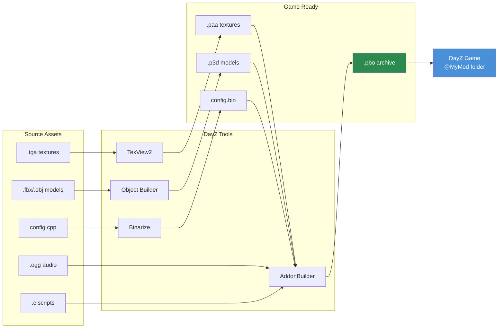

# Chapitre 4.5 : Workflow DayZ Tools

[Accueil](../README.md) | [<< Précédent : Audio](04-audio.md) | **DayZ Tools** | [Suivant : PBO Packing >>](06-pbo-packing.md)

---

## Introduction

DayZ Tools est une suite gratuite d'applications de développement distribuée via Steam, fournie par Bohemia Interactive pour les moddeurs. Elle contient tout le nécessaire pour créer, convertir et empaqueter les assets du jeu : un éditeur de modèles 3D, un visualiseur de textures, un éditeur de terrain, un débogueur de scripts, et le pipeline de binarisation qui transforme des fichiers source lisibles par l'homme en formats optimisés prêts pour le jeu. Aucun mod DayZ ne peut être créé sans interagir au minimum avec ces outils.

Ce chapitre fournit une vue d'ensemble de chaque outil de la suite, explique le système du lecteur P: (workdrive) qui sous-tend l'ensemble du workflow, couvre le file patching pour une itération rapide en développement, et détaille le pipeline complet des assets, des fichiers source au mod jouable.

---

## Table des matières

- [Vue d'ensemble de la suite DayZ Tools](#vue-densemble-de-la-suite-dayz-tools)
- [Installation et configuration](#installation-et-configuration)
- [Lecteur P: (Workdrive)](#lecteur-p-workdrive)
- [Object Builder](#object-builder)
- [TexView2](#texview2)
- [Terrain Builder](#terrain-builder)
- [Binarize](#binarize)
- [AddonBuilder](#addonbuilder)
- [Workbench](#workbench)
- [Mode File Patching](#mode-file-patching)
- [Workflow complet : de la source au jeu](#workflow-complet--de-la-source-au-jeu)
- [Erreurs courantes](#erreurs-courantes)
- [Bonnes pratiques](#bonnes-pratiques)

---

## Vue d'ensemble de la suite DayZ Tools

DayZ Tools est disponible en téléchargement gratuit sur Steam dans la catégorie **Outils**. Il installe une collection d'applications, chacune remplissant un rôle spécifique dans le pipeline de modding.

| Outil | Fonction | Utilisateurs principaux |
|-------|----------|------------------------|
| **Object Builder** | Création et édition de modèles 3D (.p3d) | Artistes 3D, modélisateurs |
| **TexView2** | Visualisation et conversion de textures (.paa, .tga, .png) | Artistes textures, tous les moddeurs |
| **Terrain Builder** | Création et édition de terrain/carte | Créateurs de cartes |
| **Binarize** | Conversion du format source vers le format jeu | Pipeline de build (généralement automatisé) |
| **AddonBuilder** | Empaquetage PBO avec binarisation optionnelle | Tous les moddeurs |
| **Workbench** | Débogage, test et profilage de scripts | Scripteurs |
| **DayZ Tools Launcher** | Hub central pour lancer les outils et configurer le lecteur P: | Tous les moddeurs |

### Emplacement sur le disque

Après l'installation via Steam, les outils se trouvent généralement à :

```
C:\Program Files (x86)\Steam\steamapps\common\DayZ Tools\
  Bin\
    AddonBuilder\
      AddonBuilder.exe          <-- Empaqueteur PBO
    Binarize\
      Binarize.exe              <-- Convertisseur d'assets
    TexView2\
      TexView2.exe              <-- Outil de textures
    ObjectBuilder\
      ObjectBuilder.exe         <-- Éditeur de modèles 3D
    Workbench\
      workbenchApp.exe          <-- Débogueur de scripts
  TerrainBuilder\
    TerrainBuilder.exe          <-- Éditeur de terrain
```

---

## Installation et configuration

### Étape 1 : Installer DayZ Tools depuis Steam

1. Ouvrez la bibliothèque Steam.
2. Activez le filtre **Outils** dans le menu déroulant.
3. Recherchez "DayZ Tools".
4. Installez (gratuit, environ 2 Go).

### Étape 2 : Lancer DayZ Tools

1. Lancez "DayZ Tools" depuis Steam.
2. Le DayZ Tools Launcher s'ouvre -- une application hub centrale.
3. De là, vous pouvez lancer n'importe quel outil individuel et configurer les paramètres.

### Étape 3 : Configurer le lecteur P:

Le lanceur fournit un bouton pour créer et monter le lecteur P: (workdrive). C'est le lecteur virtuel que tous les outils DayZ utilisent comme chemin racine.

1. Cliquez sur **Setup Workdrive** (ou le bouton de configuration du lecteur P:).
2. L'outil crée un lecteur P: mappé via subst pointant vers un répertoire sur votre disque réel.
3. Extrayez ou créez un lien symbolique vers les données vanilla DayZ sur P: pour que les outils puissent référencer les assets du jeu.

---

## Lecteur P: (Workdrive)

Le **lecteur P:** est un lecteur virtuel Windows (créé via `subst` ou jonction) qui sert de chemin racine unifié pour tout le modding DayZ. Chaque chemin dans les modèles P3D, les matériaux RVMAT, les références config.cpp et les scripts de build est relatif à P:.

### Pourquoi le lecteur P: existe

Le pipeline d'assets de DayZ a été conçu autour d'un chemin racine fixe. Quand un matériau référence `MyMod\data\texture_co.paa`, le moteur cherche `P:\MyMod\data\texture_co.paa`. Cette convention garantit :

- Tous les outils s'accordent sur l'emplacement des fichiers.
- Les chemins dans les PBO empaquetés correspondent aux chemins pendant le développement.
- Plusieurs mods peuvent coexister sous une même racine.

### Structure

```
P:\
  DZ\                          <-- Données vanilla DayZ extraites
    characters\
    weapons\
    data\
    ...
  DayZ Tools\                  <-- Installation des outils (ou lien symbolique)
  MyMod\                       <-- Source de votre mod
    config.cpp
    Scripts\
    data\
  AnotherMod\                  <-- Source d'un autre mod
    ...
```

### SetupWorkdrive.bat

Beaucoup de projets de mods incluent un script `SetupWorkdrive.bat` qui automatise la création du lecteur P: et la configuration des jonctions. Un script typique :

```batch
@echo off
REM Create P: drive pointing to the workspace
subst P: "D:\DayZModding"

REM Create junctions for vanilla game data
mklink /J "P:\DZ" "C:\Program Files (x86)\Steam\steamapps\common\DayZ\dta"

REM Create junction for tools
mklink /J "P:\DayZ Tools" "C:\Program Files (x86)\Steam\steamapps\common\DayZ Tools"

echo Workdrive P: configured.
pause
```

> **Astuce :** Le workdrive doit être monté avant de lancer n'importe quel outil DayZ. Si Object Builder ou Binarize ne trouve pas de fichiers, la première chose à vérifier est si P: est monté.

---

## Object Builder

Object Builder est l'éditeur de modèles 3D pour les fichiers P3D. Il est traité en détail dans le [Chapitre 4.2 : Modèles 3D](02-models.md). Voici un résumé de son rôle dans la chaîne d'outils.

### Capacités principales

- Créer et éditer des fichiers de modèles P3D.
- Définir des LODs (niveaux de détail) pour les meshes visuels, de collision et d'ombre.
- Assigner des matériaux (RVMAT) et des textures (PAA) aux faces du modèle.
- Créer des sélections nommées pour les animations et les échanges de textures.
- Placer des points mémoire et des objets proxy.
- Importer de la géométrie depuis les formats FBX, OBJ et 3DS.
- Valider les modèles pour la compatibilité avec le moteur.

### Lancement

```
DayZ Tools Launcher --> Object Builder
```

Ou directement : `P:\DayZ Tools\Bin\ObjectBuilder\ObjectBuilder.exe`

### Intégration avec les autres outils

- **Référence TexView2** pour les prévisualisations de textures (double-cliquez sur une texture dans les propriétés de face).
- **Produit des fichiers P3D** consommés par Binarize et AddonBuilder.
- **Lit des fichiers P3D** depuis les données vanilla sur le lecteur P: pour référence.

---

## TexView2

TexView2 est l'utilitaire de visualisation et de conversion de textures. Il gère toutes les conversions de formats de textures nécessaires au modding DayZ.

### Capacités principales

- Ouvrir et prévisualiser les fichiers PAA, TGA, PNG, EDDS et DDS.
- Convertir entre les formats (TGA/PNG vers PAA, PAA vers TGA, etc.).
- Visualiser les canaux individuels (R, G, B, A) séparément.
- Afficher les niveaux de mipmap.
- Montrer les dimensions de la texture et le type de compression.
- Conversion par lot via la ligne de commande.

### Lancement

```
DayZ Tools Launcher --> TexView2
```

Ou directement : `P:\DayZ Tools\Bin\TexView2\TexView2.exe`

### Opérations courantes

**Convertir un TGA en PAA :**
1. Fichier --> Ouvrir --> sélectionnez votre fichier TGA.
2. Vérifiez que l'image est correcte.
3. Fichier --> Enregistrer sous --> choisissez le format PAA.
4. Sélectionnez la compression (DXT1 pour opaque, DXT5 pour alpha).
5. Enregistrez.

**Inspecter une texture PAA vanilla :**
1. Fichier --> Ouvrir --> naviguez vers `P:\DZ\...` et sélectionnez un fichier PAA.
2. Visualisez l'image. Cliquez sur les boutons de canaux (R, G, B, A) pour inspecter les canaux individuels.
3. Notez les dimensions et le type de compression affichés dans la barre d'état.

**Conversion en ligne de commande :**
```bash
TexView2.exe -i "P:\MyMod\data\texture_co.tga" -o "P:\MyMod\data\texture_co.paa"
```

---

## Terrain Builder

Terrain Builder est un outil spécialisé pour la création de cartes personnalisées (terrains). La création de cartes est l'une des tâches de modding les plus complexes dans DayZ, impliquant l'imagerie satellite, les cartes de hauteur, les masques de surface et le placement d'objets.

### Capacités principales

- Importer de l'imagerie satellite et des cartes de hauteur.
- Définir les couches de terrain (herbe, terre, roche, sable, etc.).
- Placer des objets (bâtiments, arbres, rochers) sur la carte.
- Configurer les textures et matériaux de surface.
- Exporter les données de terrain pour Binarize.

### Quand vous avez besoin de Terrain Builder

- Créer une nouvelle carte à partir de zéro.
- Modifier un terrain existant (ajout/suppression d'objets, modification de la forme du terrain).
- Terrain Builder n'est PAS nécessaire pour les mods d'items, d'armes, d'interface ou les mods scripts uniquement.

### Lancement

```
DayZ Tools Launcher --> Terrain Builder
```

> **Note :** La création de terrain est un sujet avancé qui mérite son propre guide dédié. Ce chapitre couvre Terrain Builder uniquement dans le cadre de la vue d'ensemble des outils.

---

## Binarize

Binarize est le moteur de conversion central qui transforme les fichiers source lisibles par l'homme en formats binaires optimisés, prêts pour le jeu. Il s'exécute en coulisses pendant l'empaquetage PBO (via AddonBuilder) mais peut aussi être invoqué directement.

### Ce que Binarize convertit

| Format source | Format de sortie | Description |
|---------------|-----------------|-------------|
| MLOD `.p3d` | ODOL `.p3d` | Modèle 3D optimisé |
| `.tga` / `.png` / `.edds` | `.paa` | Texture compressée |
| `.cpp` (config) | `.bin` | Config binarisée (parsing plus rapide) |
| `.rvmat` | `.rvmat` (traité) | Matériau avec chemins résolus |
| `.wrp` | `.wrp` (optimisé) | Monde terrain |

### Quand la binarisation est nécessaire

| Type de contenu | Binariser ? | Raison |
|----------------|-------------|--------|
| Config.cpp avec CfgVehicles | **Oui** | Le moteur nécessite des configs binarisées pour les définitions d'items |
| Config.cpp (scripts uniquement) | Optionnel | Les configs scripts seuls fonctionnent sans binarisation |
| Modèles P3D | **Oui** | ODOL est plus rapide à charger, plus petit, optimisé pour le moteur |
| Textures (TGA/PNG) | **Oui** | PAA est requis à l'exécution |
| Scripts (fichiers .c) | **Non** | Les scripts sont chargés tels quels (texte) |
| Audio (.ogg) | **Non** | OGG est déjà prêt pour le jeu |
| Layouts (.layout) | **Non** | Chargés tels quels |

### Invocation directe

```bash
Binarize.exe -targetPath="P:\build\MyMod" -sourcePath="P:\MyMod" -noLogs
```

En pratique, vous appelez rarement Binarize directement -- AddonBuilder l'encapsule dans le processus d'empaquetage PBO.

---

## AddonBuilder

AddonBuilder est l'outil d'empaquetage PBO. Il prend un répertoire source et crée une archive `.pbo`, en exécutant optionnellement Binarize sur le contenu au préalable. Ceci est traité en détail dans le [Chapitre 4.6 : PBO Packing](06-pbo-packing.md).

### Référence rapide

```bash
# Empaqueter avec binarisation (pour les mods d'items/armes avec configs, modèles, textures)
AddonBuilder.exe "P:\MyMod" "P:\output" -prefix="MyMod" -sign="MyKey"

# Empaqueter sans binarisation (pour les mods scripts uniquement)
AddonBuilder.exe "P:\MyMod" "P:\output" -prefix="MyMod" -packonly
```

### Lancement

Depuis le DayZ Tools Launcher, ou directement :
```
P:\DayZ Tools\Bin\AddonBuilder\AddonBuilder.exe
```

AddonBuilder dispose d'un mode GUI et d'un mode ligne de commande. Le GUI fournit un navigateur de fichiers visuel et des cases à cocher d'options. Le mode ligne de commande est utilisé par les scripts de build automatisés.

---

## Workbench

Workbench est un environnement de développement de scripts inclus avec DayZ Tools. Il fournit des capacités d'édition, de débogage et de profilage de scripts.

### Capacités principales

- **Édition de scripts** avec coloration syntaxique pour Enforce Script.
- **Débogage** avec points d'arrêt, exécution pas à pas et inspection de variables.
- **Profilage** pour identifier les goulots d'étranglement de performance dans les scripts.
- **Console** pour évaluer des expressions et tester des extraits de code.
- **Navigateur de ressources** pour inspecter les données du jeu.

### Lancement

```
DayZ Tools Launcher --> Workbench
```

Ou directement : `P:\DayZ Tools\Bin\Workbench\workbenchApp.exe`

### Workflow de débogage

1. Ouvrez Workbench.
2. Configurez le projet pour qu'il pointe vers les scripts de votre mod.
3. Placez des points d'arrêt dans vos fichiers `.c`.
4. Lancez le jeu via Workbench (il démarre DayZ en mode débogage).
5. Quand l'exécution atteint un point d'arrêt, Workbench met le jeu en pause et affiche la pile d'appels, les variables locales, et permet l'exécution pas à pas.

### Limitations

- Le support Enforce Script de Workbench présente quelques lacunes -- toutes les API du moteur ne sont pas entièrement documentées dans son autocomplétion.
- Certains moddeurs préfèrent des éditeurs externes (VS Code avec des extensions communautaires Enforce Script) pour écrire du code et n'utilisent Workbench que pour le débogage.
- Workbench peut être instable avec de gros mods ou des configurations complexes de points d'arrêt.

---

## Mode File Patching

Le **file patching** est un raccourci de développement qui permet au jeu de charger des fichiers libres depuis le disque au lieu de nécessiter qu'ils soient empaquetés dans des PBO. Cela accélère considérablement l'itération pendant le développement.

### Comment fonctionne le File Patching

Quand DayZ est lancé avec le paramètre `-filePatching`, le moteur vérifie le lecteur P: pour les fichiers avant de chercher dans les PBO. Si un fichier existe sur P:, la version libre est chargée à la place de la version PBO.

```
Mode normal :     Le jeu charge --> PBO --> fichiers
File patching :   Le jeu charge --> lecteur P: (si le fichier existe) --> PBO (repli)
```

### Activer le File Patching

Ajoutez le paramètre de lancement `-filePatching` à DayZ :

```bash
# Client
DayZDiag_x64.exe -filePatching -mod="MyMod" -connect=127.0.0.1

# Serveur
DayZDiag_x64.exe -filePatching -server -mod="MyMod" -config=serverDZ.cfg
```

> **Important :** Le file patching nécessite l'exécutable **Diag** (diagnostic) (`DayZDiag_x64.exe`), pas l'exécutable retail. La version retail ignore `-filePatching` pour des raisons de sécurité.

### Ce que le File Patching peut faire

| Type d'asset | File Patching fonctionne ? | Notes |
|------------|---------------------|-------|
| Scripts (.c) | **Oui** | Itération la plus rapide -- éditer, redémarrer, tester |
| Layouts (.layout) | **Oui** | Changements d'interface sans reconstruction |
| Textures (.paa) | **Oui** | Changer les textures sans reconstruction |
| Config.cpp | **Partiel** | Configs non binarisées uniquement |
| Modèles (.p3d) | **Oui** | P3D MLOD non binarisé uniquement |
| Audio (.ogg) | **Oui** | Changer les sons sans reconstruction |

### Workflow avec le File Patching

1. Configurez le lecteur P: avec les fichiers source de votre mod.
2. Lancez le serveur et le client avec `-filePatching`.
3. Éditez un fichier script dans votre éditeur.
4. Redémarrez le jeu (ou reconnectez-vous) pour prendre en compte les changements.
5. Pas de reconstruction PBO nécessaire.

> **Astuce :** Pour les changements scripts uniquement, le file patching élimine complètement l'étape de build. Vous éditez les fichiers `.c`, redémarrez, et testez. C'est la boucle de développement la plus rapide disponible.

### Limitations

- **Pas de contenu binarisé.** Les Config.cpp avec des entrées `CfgVehicles` peuvent ne pas fonctionner correctement sans binarisation. Les configs scripts seuls fonctionnent bien.
- **Pas de signature de clé.** Le contenu en file patching n'est pas signé, donc ne fonctionne qu'en développement (pas sur les serveurs publics).
- **Build Diag uniquement.** L'exécutable retail ignore le file patching.
- **Le lecteur P: doit être monté.** Si le workdrive n'est pas monté, le file patching n'a rien à lire.

---

## Workflow complet : de la source au jeu

Voici le pipeline de bout en bout pour transformer des assets source en un mod jouable :

### Pipeline complet des assets



### Phase 1 : Créer les assets source

```
Logiciel 3D (Blender/3dsMax)         -->  Export FBX
Éditeur d'images (Photoshop/GIMP)    -->  Export TGA/PNG
Éditeur audio (Audacity)             -->  Export OGG
Éditeur de texte (VS Code)           -->  scripts .c, config.cpp, fichiers .layout
```

### Phase 2 : Importer et convertir

```
FBX  -->  Object Builder  -->  P3D (avec LODs, sélections, matériaux)
TGA  -->  TexView2         -->  PAA (texture compressée)
PNG  -->  TexView2         -->  PAA (texture compressée)
OGG  -->  (pas de conversion nécessaire, prêt pour le jeu)
```

### Phase 3 : Organiser sur le lecteur P:

```
P:\MyMod\
  config.cpp                    <-- Configuration du mod
  Scripts\
    3_Game\                     <-- Scripts chargés tôt
    4_World\                    <-- Scripts d'entités/managers
    5_Mission\                  <-- Scripts UI/mission
  data\
    models\
      my_item.p3d               <-- Modèle 3D
    textures\
      my_item_co.paa            <-- Texture diffuse
      my_item_nohq.paa          <-- Normal map
      my_item_smdi.paa          <-- Specular map
    materials\
      my_item.rvmat             <-- Définition du matériau
  sound\
    my_sound.ogg                <-- Fichier audio
  GUI\
    layouts\
      my_panel.layout           <-- Layout d'interface
```

### Phase 4 : Tester avec le File Patching (développement)

```
Lancer DayZDiag avec -filePatching
  |
  |--> Le moteur lit les fichiers libres depuis P:\MyMod\
  |--> Tester en jeu
  |--> Éditer les fichiers directement sur P:
  |--> Redémarrer pour prendre en compte les changements
  |--> Itérer rapidement
```

### Phase 5 : Empaqueter le PBO (version finale)

```
AddonBuilder / script de build
  |
  |--> Lit la source depuis P:\MyMod\
  |--> Binarize convertit : P3D-->ODOL, TGA-->PAA, config.cpp-->.bin
  |--> Empaquète tout dans MyMod.pbo
  |--> Signe avec la clé : MyMod.pbo.MyKey.bisign
  |--> Sortie : @MyMod\addons\MyMod.pbo
```

### Phase 6 : Distribuer

```
@MyMod\
  addons\
    MyMod.pbo                   <-- Le mod empaqueté
    MyMod.pbo.MyKey.bisign      <-- Signature pour vérification serveur
  keys\
    MyKey.bikey                 <-- Clé publique pour les administrateurs serveur
  mod.cpp                       <-- Métadonnées du mod (nom, auteur, etc.)
```

Les joueurs s'abonnent au mod sur le Steam Workshop, ou les administrateurs serveur l'installent manuellement.

---

## Erreurs courantes

### 1. Lecteur P: non monté

**Symptôme :** Tous les outils signalent des erreurs "fichier non trouvé". Object Builder affiche des textures vides.
**Solution :** Exécutez votre `SetupWorkdrive.bat` ou montez P: via le DayZ Tools Launcher avant de lancer n'importe quel outil.

### 2. Mauvais outil pour la tâche

**Symptôme :** Essayer d'éditer un fichier PAA dans un éditeur de texte, ou ouvrir un P3D dans le Bloc-notes.
**Solution :** PAA est binaire -- utilisez TexView2. P3D est binaire -- utilisez Object Builder. Config.cpp est du texte -- utilisez n'importe quel éditeur de texte.

### 3. Oublier d'extraire les données vanilla

**Symptôme :** Object Builder ne peut pas afficher les textures vanilla sur les modèles référencés. Les matériaux s'affichent en rose/magenta.
**Solution :** Extrayez les données vanilla DayZ vers `P:\DZ\` pour que les outils puissent résoudre les références croisées vers le contenu du jeu.

### 4. File Patching avec l'exécutable retail

**Symptôme :** Les modifications des fichiers sur le lecteur P: ne sont pas reflétées en jeu.
**Solution :** Utilisez `DayZDiag_x64.exe`, pas `DayZ_x64.exe`. Seule la version Diag supporte `-filePatching`.

### 5. Builder sans le lecteur P:

**Symptôme :** AddonBuilder ou Binarize échoue avec des erreurs de résolution de chemin.
**Solution :** Montez le lecteur P: avant d'exécuter n'importe quel outil de build. Tous les chemins dans les modèles et matériaux sont relatifs à P:.

---

## Bonnes pratiques

1. **Utilisez toujours le lecteur P:.** Résistez à la tentation d'utiliser des chemins absolus. P: est le standard et tous les outils s'y attendent.

2. **Utilisez le file patching pendant le développement.** Cela réduit le temps d'itération de minutes (reconstruction PBO) à secondes (redémarrage du jeu). Ne construisez les PBO que pour les tests de version finale et la distribution.

3. **Automatisez votre pipeline de build.** Utilisez des scripts (`build_pbos.bat`, `dev.py`) pour automatiser l'invocation d'AddonBuilder. L'empaquetage manuel via le GUI est sujet aux erreurs et lent pour les mods multi-PBO.

4. **Séparez source et sortie.** Les fichiers source vivent sur P:. Les PBO construits vont dans un répertoire de sortie séparé. Ne les mélangez jamais.

5. **Apprenez les raccourcis clavier.** Object Builder et TexView2 disposent de raccourcis clavier extensifs qui accélèrent considérablement le travail. Investissez du temps pour les apprendre.

6. **Extrayez et étudiez les données vanilla.** La meilleure façon d'apprendre comment les assets DayZ sont structurés est d'examiner ceux qui existent. Extrayez les PBO vanilla et ouvrez les modèles, matériaux et textures dans les outils appropriés.

7. **Utilisez Workbench pour le débogage, des éditeurs externes pour l'écriture.** VS Code avec des extensions Enforce Script offre une meilleure édition. Workbench offre un meilleur débogage. Utilisez les deux.

---

## Observé dans les mods réels

| Patron | Mod | Détail |
|---------|-----|--------|
| Jonctions de lecteur P: via `SetupWorkdrive.bat` | COT / Community Online Tools | Fournit un script batch qui crée des liens de jonction depuis la source du mod vers le lecteur P: pour une résolution de chemin cohérente |
| Fichiers projet Workbench `.gproj` | Dabs Framework | Inclut des fichiers projet Workbench pour déboguer Enforce Script avec des points d'arrêt et l'inspection de variables |
| Orchestrateur de build automatisé `dev.py` | StarDZ (tous les mods) | Script Python qui encapsule les appels AddonBuilder, gère les builds multi-PBO, lance serveur/client, et surveille les logs |

---

## Compatibilité et impact

- **Multi-Mod :** Tous les outils DayZ partagent le lecteur P:. Plusieurs projets de mods coexistent sous `P:\` sans conflit tant que les noms de dossiers diffèrent. Des collisions de jonction se produisent si deux mods utilisent le même chemin P:.
- **Performance :** Binarize est intensif en CPU et mono-thread par fichier. Les gros mods avec beaucoup de modèles P3D et de textures peuvent prendre 5-10 minutes à binariser. Diviser en plusieurs PBO et utiliser `-packonly` pour les scripts réduit significativement le temps de build.
- **Version :** Les DayZ Tools sont mis à jour en même temps que les patchs majeurs de DayZ. Object Builder et Binarize reçoivent occasionnellement des corrections, mais le workflow global est stable depuis DayZ 1.0. Gardez toujours DayZ Tools à jour via Steam.

---

## Navigation

| Précédent | Haut | Suivant |
|-----------|------|---------|
| [4.4 Audio](04-audio.md) | [Partie 4 : Formats de fichiers et DayZ Tools](01-textures.md) | [4.6 PBO Packing](06-pbo-packing.md) |
