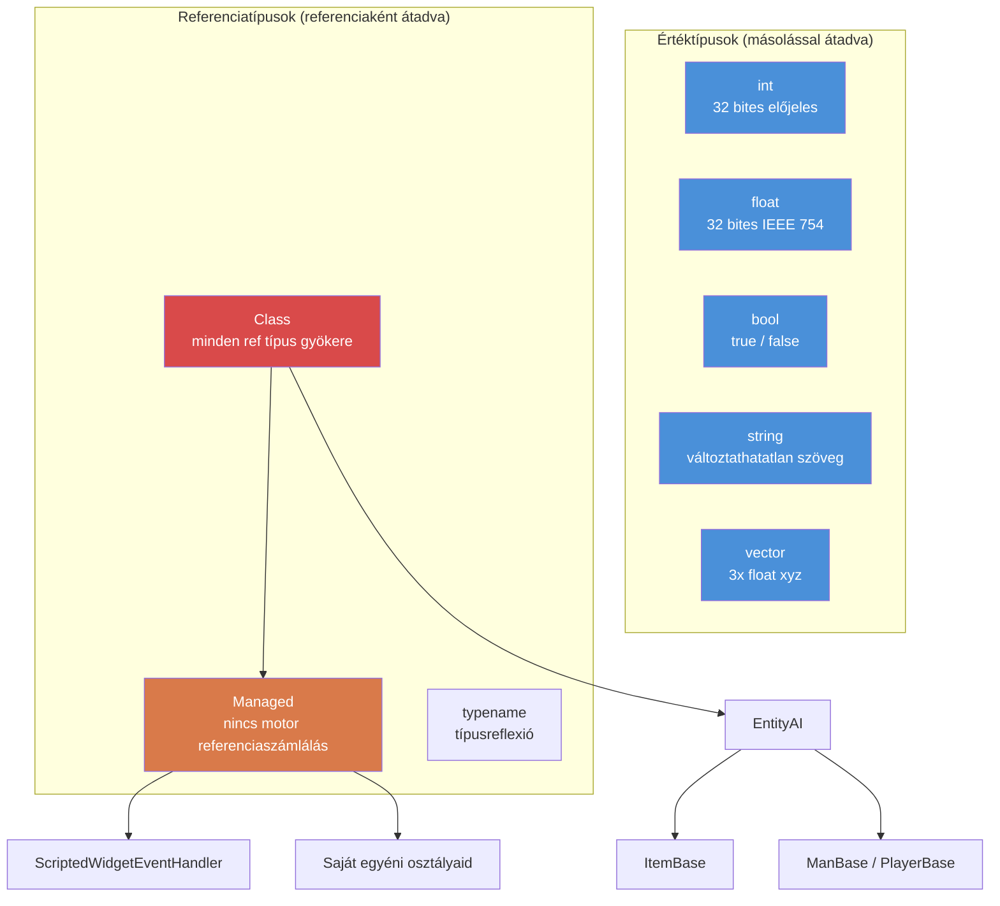

# 1.1. fejezet: Változók és típusok

[Kezdőlap](../../README.md) | **Változók és típusok** | [Következő: Tömbök, Map-ek és Set-ek >>](02-arrays-maps-sets.md)

---

## Bevezetés

Az Enforce Script az Enfusion motor szkriptnyelve, amelyet a DayZ Standalone használ. Ez egy objektumorientált nyelv C-szerű szintaxissal, sok tekintetben hasonló a C#-hoz, de saját típuskészlettel, szabályokkal és korlátozásokkal rendelkezik. Ha van tapasztalatod C#-ban, Javában vagy C++-ban, gyorsan otthon fogod érezni magad --- de figyelj oda a különbségekre, mert pontosan ott rejtőznek a hibák, ahol az Enforce Script eltér ezektől a nyelvektől.

Ez a fejezet az alapvető építőelemeket tárgyalja: primitív típusokat, hogyan kell változókat deklarálni és inicializálni, valamint hogyan működik a típuskonverzió. A DayZ mod kódjának minden sora itt kezdődik.

---

## Primitív típusok

Az Enforce Script kis, rögzített primitív típuskészlettel rendelkezik. Nem definiálhatsz új értéktípusokat --- csak osztályokat (lásd [1.3. fejezet](03-classes-inheritance.md)).

| Típus | Méret | Alapértelmezett érték | Leírás |
|------|------|---------------|-------------|
| `int` | 32 bites előjeles | `0` | Egész számok -2 147 483 648-tól 2 147 483 647-ig |
| `float` | 32 bites IEEE 754 | `0.0` | Lebegőpontos számok |
| `bool` | 1 bit logikai | `false` | `true` vagy `false` |
| `string` | Változó | `""` (üres) | Szöveg. Változtathatatlan értéktípus --- érték szerint kerül átadásra, nem referenciaként |
| `vector` | 3x float | `"0 0 0"` | Háromkomponensű float (x, y, z). Érték szerint kerül átadásra |
| `typename` | Motor ref | `null` | Referencia magára a típusra, reflexióhoz használatos |
| `void` | N/A | N/A | Csak visszatérési típusként használatos, jelezve hogy "nem ad vissza semmit" |

### Típushierarchia diagram



### Típuskonstansok

Néhány típus hasznos konstansokat tesz elérhetővé:

```c
// int határok
int maxInt = int.MAX;    // 2147483647
int minInt = int.MIN;    // -2147483648

// float határok
float smallest = float.MIN;     // legkisebb pozitív float (~1.175e-38)
float largest  = float.MAX;     // legnagyobb float (~3.403e+38)
float lowest   = float.LOWEST;  // legnegatívabb float (-3.403e+38)
```

---

## Változók deklarálása

A változókat a típus és a név megadásával deklaráljuk. Egy utasításban deklarálhatsz és értéket adhatsz, vagy külön is.

```c
void MyFunction()
{
    // Csak deklaráció (alapértelmezett értékkel inicializálva)
    int health;          // health == 0
    float speed;         // speed == 0.0
    bool isAlive;        // isAlive == false
    string name;         // name == ""

    // Deklaráció inicializálással
    int maxPlayers = 60;
    float gravity = 9.81;
    bool debugMode = true;
    string serverName = "My DayZ Server";
}
```

### Az `auto` kulcsszó

Amikor a típus nyilvánvaló a jobb oldalról, használhatod az `auto` kulcsszót, hogy a fordító kikövetkeztesse:

```c
void Example()
{
    auto count = 10;           // int
    auto ratio = 0.75;         // float
    auto label = "Hello";      // string
    auto player = GetGame().GetPlayer();  // DayZPlayer (vagy bármi, amit a GetPlayer visszaad)
}
```

Ez pusztán kényelmi funkció --- a fordító fordítási időben határozza meg a típust. Nincs teljesítménybeli különbség.

### Konstansok

Használd a `const` kulcsszót olyan értékekhez, amelyek az inicializálás után soha nem változhatnak:

```c
const int MAX_SQUAD_SIZE = 8;
const float SPAWN_RADIUS = 150.0;
const string MOD_PREFIX = "[MyMod]";

void Example()
{
    int a = MAX_SQUAD_SIZE;  // OK: konstans olvasása
    MAX_SQUAD_SIZE = 10;     // HIBA: nem lehet konstanshoz értéket rendelni
}
```

A konstansokat általában fájlszinten (bármely függvényen kívül) vagy osztálytagokként deklaráljuk. Elnevezési konvenció: `UPPER_SNAKE_CASE`.

---

## Munka az `int` típussal

Az egész számok a leggyakrabban használt típus. A DayZ tárgyak számolásához, játékos-azonosítókhoz, egészségértékekhez (diszkretizálva), felsorolási értékekhez, bitjelzőkhöz és sok máshoz használja őket.

```c
void IntExamples()
{
    int count = 5;
    int total = count + 10;     // 15
    int doubled = count * 2;    // 10
    int remainder = 17 % 5;     // 2 (modulo)

    // Növelés és csökkentés
    count++;    // count most 6
    count--;    // count ismét 5

    // Összetett értékadás
    count += 3;  // count most 8
    count -= 2;  // count most 6
    count *= 4;  // count most 24
    count /= 6;  // count most 4

    // Egész osztás csonkít (nem kerekít)
    int result = 7 / 2;    // result == 3, nem 3.5

    // Bitműveletek (jelzőkhöz használva)
    int flags = 0;
    flags = flags | 0x01;   // 0. bit beállítása
    flags = flags | 0x04;   // 2. bit beállítása
    bool hasBit0 = (flags & 0x01) != 0;  // true
}
```

### Valós példa: Játékosok száma

```c
void PrintPlayerCount()
{
    array<Man> players = new array<Man>;
    GetGame().GetPlayers(players);
    int count = players.Count();
    Print(string.Format("Players online: %1", count));
}
```

---

## Munka a `float` típussal

A lebegőpontos számok tizedes számokat reprezentálnak. A DayZ széleskörűen használja őket pozíciókhoz, távolságokhoz, egészségszázalékokhoz, sebzésértékekhez és időzítőkhöz.

```c
void FloatExamples()
{
    float health = 100.0;
    float damage = 25.5;
    float remaining = health - damage;   // 74.5

    // DayZ-specifikus: sebzésszorzó
    float headMultiplier = 3.0;
    float actualDamage = damage * headMultiplier;  // 76.5

    // Float osztás tizedes eredményt ad
    float ratio = 7.0 / 2.0;   // 3.5

    // Hasznos matematika
    float dist = 150.7;
    float rounded = Math.Round(dist);    // 151
    float floored = Math.Floor(dist);    // 150
    float ceiled  = Math.Ceil(dist);     // 151
    float clamped = Math.Clamp(dist, 0.0, 100.0);  // 100
}
```

### Valós példa: Távolságellenőrzés

```c
bool IsPlayerNearby(PlayerBase player, vector targetPos, float radius)
{
    if (!player)
        return false;

    vector playerPos = player.GetPosition();
    float distance = vector.Distance(playerPos, targetPos);
    return distance <= radius;
}
```

---

## Munka a `bool` típussal

A logikai változók `true` vagy `false` értéket tartalmaznak. Feltételekben, jelzőkben és állapotkövetésben használatosak.

```c
void BoolExamples()
{
    bool isAdmin = true;
    bool isBanned = false;

    // Logikai operátorok
    bool canPlay = isAdmin || !isBanned;    // true (OR, NOT)
    bool isSpecial = isAdmin && !isBanned;  // true (AND)

    // Tagadás
    bool notAdmin = !isAdmin;   // false

    // Összehasonlítási eredmények bool típusúak
    int health = 50;
    bool isLow = health < 25;       // false
    bool isHurt = health < 100;     // true
    bool isDead = health == 0;      // false
    bool isAlive = health != 0;     // true
}
```

### Igazságérték feltételekben

Az Enforce Scriptben feltételekben nem-bool értékeket is használhatsz. A következők számítanak `false`-nak:
- `0` (int)
- `0.0` (float)
- `""` (üres string)
- `null` (null objektumreferencia)

Minden más `true`. Ezt általában null-ellenőrzésekhez használják:

```c
void SafeCheck(PlayerBase player)
{
    // Ez a két írásmód egyenértékű:
    if (player != null)
        Print("Player exists");

    if (player)
        Print("Player exists");

    // És ez a kettő is:
    if (player == null)
        Print("No player");

    if (!player)
        Print("No player");
}
```

---

## Munka a `string` típussal

A stringek az Enforce Scriptben **értéktípusok** --- másolódnak értékadáskor vagy függvénynek való átadáskor, ugyanúgy mint az `int` vagy `float`. Ez különbözik a C#-tól vagy Javától, ahol a stringek referenciatípusok.

```c
void StringExamples()
{
    string greeting = "Hello";
    string name = "Survivor";

    // Összefűzés +-szal
    string message = greeting + ", " + name + "!";  // "Hello, Survivor!"

    // String formázás (1-től indexelt helyőrzők)
    string formatted = string.Format("Player %1 has %2 health", name, 75);
    // Eredmény: "Player Survivor has 75 health"

    // Hossz
    int len = message.Length();    // 17

    // Összehasonlítás
    bool same = (greeting == "Hello");  // true

    // Konverzió más típusokból
    string fromInt = "Score: " + 42;     // NEM működik -- explicit konverzió szükséges
    string correct = "Score: " + 42.ToString();  // "Score: 42"

    // A Format használata a preferált megközelítés
    string best = string.Format("Score: %1", 42);  // "Score: 42"
}
```

### Escape szekvenciák

A stringek támogatják a szabványos escape szekvenciákat:

| Szekvencia | Jelentés |
|----------|---------|
| `\n` | Új sor |
| `\r` | Kocsi vissza |
| `\t` | Tabulátor |
| `\\` | Literális fordított perjel |
| `\"` | Literális idézőjel |

**Figyelmeztetés:** Bár ezek dokumentáltak, a fordított perjel (`\\`) és az escape-elt idézőjelek (`\"`) egyes kontextusokban problémákat okozhatnak a CParserrel, különösen JSON-nal kapcsolatos műveleteknél. Fájlelérési utakkal vagy JSON stringekkel dolgozva lehetőleg kerüld a fordított perjeleket. Használj normál perjelet az útvonalakhoz --- a DayZ minden platformon elfogadja őket.

### Valós példa: Chat üzenet

```c
void SendAdminMessage(string adminName, string text)
{
    string msg = string.Format("[ADMIN] %1: %2", adminName, text);
    Print(msg);
}
```

---

## Munka a `vector` típussal

A `vector` típus három `float` komponenst tartalmaz (x, y, z). Ez a DayZ alapvető típusa pozíciókhoz, irányokhoz, forgatásokhoz és sebességekhez. A stringekhez és primitív típusokhoz hasonlóan a vektorok is **értéktípusok** --- másolódnak értékadáskor.

### Inicializálás

A vektorok kétféleképpen inicializálhatók:

```c
void VectorInit()
{
    // 1. módszer: String inicializálás (három szóközzel elválasztott szám)
    vector pos1 = "100.5 0 200.3";

    // 2. módszer: Vector() konstruktor függvény
    vector pos2 = Vector(100.5, 0, 200.3);

    // Az alapértelmezett érték "0 0 0"
    vector empty;   // empty == <0, 0, 0>
}
```

**Fontos:** A string inicializálási formátum **szóközöket** használ elválasztóként, nem vesszőket. `"1 2 3"` érvényes; `"1,2,3"` nem.

### Komponensek elérése

Az egyes komponensekhez tömb-stílusú indexeléssel férhetsz hozzá:

```c
void VectorComponents()
{
    vector pos = Vector(100.5, 25.0, 200.3);

    // Komponensek olvasása
    float x = pos[0];   // 100.5  (Kelet/Nyugat)
    float y = pos[1];   // 25.0   (Fel/Le, tengerszint feletti magasság)
    float z = pos[2];   // 200.3  (Észak/Dél)

    // Komponensek írása
    pos[1] = 50.0;      // Magasság módosítása 50-re
}
```

DayZ koordinátarendszer:
- `[0]` = X = Kelet(+) / Nyugat(-)
- `[1]` = Y = Fel(+) / Le(-) (tengerszint feletti magasság)
- `[2]` = Z = Észak(+) / Dél(-)

### Statikus konstansok

```c
vector zero    = vector.Zero;      // "0 0 0"
vector up      = vector.Up;        // "0 1 0"
vector right   = vector.Aside;     // "1 0 0"
vector forward = vector.Forward;   // "0 0 1"
```

### Gyakori vektorműveletek

```c
void VectorOps()
{
    vector pos1 = Vector(100, 0, 200);
    vector pos2 = Vector(150, 0, 250);

    // Két pont közötti távolság
    float dist = vector.Distance(pos1, pos2);

    // Négyzetes távolság (gyorsabb, összehasonlításokhoz jó)
    float distSq = vector.DistanceSq(pos1, pos2);

    // Irány pos1-ből pos2-be
    vector dir = vector.Direction(pos1, pos2);

    // Vektor normalizálása (hossz = 1)
    vector norm = dir.Normalized();

    // Vektor hossza
    float len = dir.Length();

    // Lineáris interpoláció (50% pos1 és pos2 között)
    vector midpoint = vector.Lerp(pos1, pos2, 0.5);

    // Skaláris szorzat
    float dot = vector.Dot(dir, vector.Up);
}
```

### Valós példa: Spawn pozíció

```c
// Pozíció lekérése a talajon adott X, Z koordinátáknál
vector GetGroundPosition(float x, float z)
{
    vector pos = Vector(x, 0, z);
    pos[1] = GetGame().SurfaceY(x, z);  // Y beállítása a terep magasságára
    return pos;
}

// Véletlenszerű pozíció lekérése egy középpont sugarán belül
vector GetRandomPositionAround(vector center, float radius)
{
    float angle = Math.RandomFloat(0, Math.PI2);
    float dist = Math.RandomFloat(0, radius);

    vector offset = Vector(Math.Cos(angle) * dist, 0, Math.Sin(angle) * dist);
    vector pos = center + offset;
    pos[1] = GetGame().SurfaceY(pos[0], pos[2]);
    return pos;
}
```

---

## Munka a `typename` típussal

A `typename` típus magára a típusra tartalmaz referenciát. Reflexióhoz használatos --- típusok vizsgálatához és kezeléséhez futásidőben. Általános rendszerek, konfiguráció-betöltők és gyártási minták írásakor találkozol vele.

```c
void TypenameExamples()
{
    // Osztály typename-jének lekérése
    typename t = PlayerBase;

    // typename lekérése stringből
    typename t2 = t.StringToEnum(PlayerBase, "PlayerBase");

    // Típusok összehasonlítása
    if (t == PlayerBase)
        Print("It's PlayerBase!");

    // Objektumpéldány typename-jének lekérése
    PlayerBase player;
    // ... feltételezzük, hogy a player érvényes ...
    typename objType = player.Type();

    // Öröklés ellenőrzése
    bool isMan = objType.IsInherited(Man);

    // typename konvertálása stringgé
    string name = t.ToString();  // "PlayerBase"

    // Példány létrehozása typename-ből (gyártási minta)
    Class instance = t.Spawn();
}
```

### Felsorolás konverzió typename-mel

```c
enum DamageType
{
    MELEE = 0,
    BULLET = 1,
    EXPLOSION = 2
};

void EnumConvert()
{
    // Felsorolás stringgé
    string name = typename.EnumToString(DamageType, DamageType.BULLET);
    // name == "BULLET"

    // String felsorolássá
    int value;
    typename.StringToEnum(DamageType, "EXPLOSION", value);
    // value == 2
}
```

---

## A Managed osztály

A `Managed` egy speciális alaposztály, amely **kikapcsolja a motor referenciaszámlálását**. A `Managed`-ot kiterjesztő osztályokat a motor garbage collectora nem követi nyomon --- élettartamuk teljes egészében a szkript `ref` referenciák által kezelt.

```c
class MyScriptHandler : Managed
{
    // Ezt az osztályt a motor nem fogja garbage collectálni
    // Csak akkor törlődik, amikor az utolsó ref felszabadul
}
```

A legtöbb tisztán szkript osztálynak (amelyek nem képviselnek játékentitásokat) a `Managed`-ot kellene kiterjesztenie. Az entitásosztályok, mint a `PlayerBase`, `ItemBase`, az `EntityAI`-t terjesztik ki (ami motor által kezelt, NEM `Managed`).

### Mikor használjuk a Managed-et

| Használd `Managed`-ot ehhez... | NE használd `Managed`-ot ehhez... |
|----------------------|-----------------------------|
| Konfigurációs adatosztályok | Tárgyak (`ItemBase`) |
| Singleton menedzserek | Fegyverek (`Weapon_Base`) |
| UI vezérlők | Járművek (`CarScript`) |
| Eseménykezelő objektumok | Játékosok (`PlayerBase`) |
| Segéd-/eszközosztályok | Bármely `EntityAI`-t kiterjesztő osztály |

Ha az osztályod nem képvisel fizikai entitást a játékvilágban, szinte biztosan a `Managed`-ot kellene kiterjesztenie.

---

## Típuskonverzió

Az Enforce Script mind implicit, mind explicit konverziókat támogat a típusok között.

### Implicit konverziók

Néhány konverzió automatikusan megtörténik:

```c
void ImplicitConversions()
{
    // int-ből float-ba (mindig biztonságos, nincs adatveszteség)
    int count = 42;
    float fCount = count;    // 42.0

    // float-ból int-be (CSONKÍT, nem kerekít!)
    float precise = 3.99;
    int truncated = precise;  // 3, NEM 4

    // int/float-ból bool-ba
    bool fromInt = 5;      // true (nem nulla)
    bool fromZero = 0;     // false
    bool fromFloat = 0.1;  // true (nem nulla)

    // bool-ból int-be
    int fromBool = true;   // 1
    int fromFalse = false; // 0
}
```

### Explicit konverziók (parseolás)

Stringek és numerikus típusok közötti konverzióhoz használj parseolási metódusokat:

```c
void ExplicitConversions()
{
    // String-ből int-be
    int num = "42".ToInt();           // 42
    int bad = "hello".ToInt();        // 0 (csendben sikertelen)

    // String-ből float-ba
    float f = "3.14".ToFloat();       // 3.14

    // String-ből vector-ba
    vector v = "100 25 200".ToVector();  // <100, 25, 200>

    // Szám stringgé (Format használatával)
    string s1 = string.Format("%1", 42);       // "42"
    string s2 = string.Format("%1", 3.14);     // "3.14"

    // int/float .ToString()
    string s3 = (42).ToString();     // "42"
}
```

### Objektum-öntés (casting)

Osztálytípusokhoz használd a `Class.CastTo()` vagy `ClassName.Cast()` metódusokat. Ez részletesen az [1.3. fejezetben](03-classes-inheritance.md) van tárgyalva, de íme az alapvető minta:

```c
void CastExample()
{
    Object obj = GetSomeObject();

    // Biztonságos öntés (preferált)
    PlayerBase player;
    if (Class.CastTo(player, obj))
    {
        // player érvényes és biztonságosan használható
        string name = player.GetIdentity().GetName();
    }

    // Alternatív öntési szintaxis
    PlayerBase player2 = PlayerBase.Cast(obj);
    if (player2)
    {
        // player2 érvényes
    }
}
```

---

## Változók hatóköre

A változók csak abban a kódblokkban (kapcsos zárójelekben) léteznek, ahol deklarálva lettek. Az Enforce Script **nem engedélyezi** ugyanazon változónév újradeklarálását beágyazott vagy testvérblokkokban.

```c
void ScopeExample()
{
    int x = 10;

    if (true)
    {
        // int x = 20;  // HIBA: 'x' újradeklarálása beágyazott blokkban
        x = 20;         // OK: a külső x módosítása
        int y = 30;     // OK: új változó ebben a blokkban
    }

    // y itt NEM elérhető (belső blokkban deklarálva)
    // Print(y);  // HIBA: deklarálatlan azonosító 'y'

    // FONTOS: ez a for ciklusokra is vonatkozik
    for (int i = 0; i < 5; i++)
    {
        // i itt létezik
    }
    // for (int i = 0; i < 3; i++)  // HIBA a DayZ-ben: 'i' már deklarálva
    // Használj másik nevet:
    for (int j = 0; j < 3; j++)
    {
        // j itt létezik
    }
}
```

### A testvérblokk csapda

Ez az Enforce Script egyik leghírhedtebb furcsasága. Ugyanazon változónév deklarálása az `if` és `else` blokkban fordítási hibát okoz:

```c
void SiblingTrap()
{
    if (someCondition)
    {
        int result = 10;    // Itt deklarálva
        Print(result);
    }
    else
    {
        // int result = 20; // HIBA: 'result' többszörös deklarálása
        // Annak ellenére, hogy ez testvérblokk, nem ugyanaz a blokk
    }

    // JAVÍTÁS: deklaráld az if/else felett
    int result;
    if (someCondition)
    {
        result = 10;
    }
    else
    {
        result = 20;
    }
}
```

---

## Operátor-prioritás

A legmagasabbtól a legalacsonyabb prioritásig:

| Prioritás | Operátor | Leírás | Asszociativitás |
|----------|----------|-------------|---------------|
| 1 | `()` `[]` `.` | Csoportosítás, tömbelérés, tagelérés | Balról jobbra |
| 2 | `!` `-` (unáris) `~` | Logikai NOT, negálás, bitenkénti NOT | Jobbról balra |
| 3 | `*` `/` `%` | Szorzás, osztás, modulo | Balról jobbra |
| 4 | `+` `-` | Összeadás, kivonás | Balról jobbra |
| 5 | `<<` `>>` | Bitenkénti eltolás | Balról jobbra |
| 6 | `<` `<=` `>` `>=` | Relációs | Balról jobbra |
| 7 | `==` `!=` | Egyenlőség | Balról jobbra |
| 8 | `&` | Bitenkénti AND | Balról jobbra |
| 9 | `^` | Bitenkénti XOR | Balról jobbra |
| 10 | `\|` | Bitenkénti OR | Balról jobbra |
| 11 | `&&` | Logikai AND | Balról jobbra |
| 12 | `\|\|` | Logikai OR | Balról jobbra |
| 13 | `=` `+=` `-=` `*=` `/=` `%=` `&=` `\|=` `^=` `<<=` `>>=` | Értékadás | Jobbról balra |

> **Tipp:** Ha bizonytalan vagy, használj zárójeleket. Az Enforce Script C-szerű prioritási szabályokat követ, de az explicit csoportosítás megelőzi a hibákat és javítja az olvashatóságot.

---

## Bevált gyakorlatok

- Mindig explicit módon inicializáld a változókat deklaráláskor, még akkor is, ha az alapértelmezett érték megfelel a szándékodnak -- ez közvetíti a szándékot a jövőbeli olvasóknak.
- Használd a `const` kulcsszót minden értékhez, amely soha nem változhat; helyezd a konstansokat fájl- vagy osztályszintre `UPPER_SNAKE_CASE` elnevezéssel.
- Preferáld a `string.Format()`-ot a `+` összefűzés helyett típusok keverésekor -- elkerülöd az implicit konverziós problémákat és könnyebben olvasható.
- Használj `vector.DistanceSq()`-t `vector.Distance()` helyett távolságok összehasonlításakor -- elkerülöd a költséges négyzetgyökvonást.
- Soha ne hasonlíts floatokat `==`-vel; mindig használj epsilon toleranciát a `Math.AbsFloat(a - b) < 0.001` segítségével.

---

## Valós modokban megfigyelt minták

> Professzionális DayZ mod forráskódok tanulmányozásával igazolt minták.

| Minta | Mod | Részlet |
|---------|-----|--------|
| `const string LOG_PREFIX` osztályszinten | COT / Expansion | Minden modul definiál egy string konstanst a log-előtagokhoz, hogy elkerülje az elgépeléseket |
| `m_PascalCase` tagnév-konvenció | VPP / Dabs Framework | Minden tagváltozó konzisztensen használja az `m_` előtagot, még primitív típusoknál is |
| `string.Format` minden log-kimenethez | Expansion Market | Soha nem használ `+` összefűzést számokkal -- mindig `%1`..`%9` helyőrzőket |
| `vector.Zero` a `"0 0 0"` literál helyett | COT Admin Tools | Elnevezett konstansokat használ az olvashatóság és a string-parseolási többletköltség elkerülése érdekében |

---

## Elmélet vs. gyakorlat

| Fogalom | Elmélet | Valóság |
|---------|--------|---------|
| `auto` kulcsszó | Bármely típust ki kellene következtetnie | Egyszerű értékadásoknál működik, de összezavarhatja az olvasókat -- a legtöbb mod explicit módon deklarálja a típusokat |
| `float`-ból `int`-be csonkítás | "Nulla felé kerekít" szerint dokumentálva | Szinte mindenkit elcsíp legalább egyszer; `3.99` `3` lesz, nem `4` |
| `string` értéktípus | Másolatként kerül átadásra, mint az `int` | Meglepetés a C#/Java fejlesztőknek, akik referenciális szemantikát várnak; a másolat módosítása soha nem hat az eredetire |

---

## Gyakori hibák

### 1. Nem inicializált változók használata logikában

A primitív típusok alapértelmezett értékeket kapnak (`0`, `0.0`, `false`, `""`), de erre támaszkodni törékennyé és nehezen olvashatóvá teszi a kódot. Mindig explicit módon inicializálj.

```c
// ROSSZ: implicit nullára támaszkodás
int count;
if (count > 0)  // Ez működik, mert count == 0, de a szándék nem egyértelmű
    DoThing();

// JÓ: explicit inicializálás
int count = 0;
if (count > 0)
    DoThing();
```

### 2. Float-ból int-be csonkítás

A float-ból int-be konverzió csonkít (nulla felé kerekít), nem a legközelebbire kerekít:

```c
float f = 3.99;
int i = f;         // i == 3, NEM 4

// Ha kerekítést akarsz:
int rounded = Math.Round(f);  // 4
```

### 3. Float pontosság összehasonlításoknál

Soha ne hasonlíts floatokat pontos egyenlőségre:

```c
float a = 0.1 + 0.2;
// ROSSZ: sikertelen lehet a lebegőpontos ábrázolás miatt
if (a == 0.3)
    Print("Equal");

// JÓ: használj toleranciát (epsilon)
if (Math.AbsFloat(a - 0.3) < 0.001)
    Print("Close enough");
```

### 4. String összefűzés számokkal

Nem lehet egyszerűen számot hozzáfűzni stringhez `+`-szal. Használd a `string.Format()`-ot:

```c
int kills = 5;
// Potenciálisan problémás:
// string msg = "Kills: " + kills;

// HELYES: használd a Format-ot
string msg = string.Format("Kills: %1", kills);
```

### 5. Vektor string formátum

A vektor string inicializálás szóközöket igényel, nem vesszőket:

```c
vector good = "100 25 200";     // HELYES
// vector bad = "100, 25, 200"; // HIBÁS: a vesszők nem parseolódnak helyesen
// vector bad2 = "100,25,200";  // HIBÁS
```

### 6. Elfelejteni, hogy a stringek és vektorok értéktípusok

Az osztályobjektumokkal ellentétben a stringek és vektorok másolódnak értékadáskor. A másolat módosítása nem hat az eredetire:

```c
vector posA = "10 20 30";
vector posB = posA;       // posB MÁSOLAT
posB[1] = 99;             // Csak posB változik
// posA továbbra is "10 20 30"
```

---

## Gyakorló feladatok

### 1. feladat: Változó alapok
Deklarálj változókat a következők tárolásához:
- Egy játékos neve (string)
- Az egészségszázaléka (float, 0-100)
- Az ölésszáma (int)
- Adminisztrátor-e (bool)
- A világbeli pozíciója (vector)

Nyomtass formázott összefoglalót `string.Format()` használatával.

### 2. feladat: Hőmérséklet-átváltó
Írj egy `float CelsiusToFahrenheit(float celsius)` függvényt és az inverzét `float FahrenheitToCelsius(float fahrenheit)`. Teszteld a forrásponton (100C = 212F) és a fagyásponton (0C = 32F).

### 3. feladat: Távolságkalkulátor
Írj egy függvényt, amely két vektort vesz és visszaadja:
- A 3D távolságot közöttük
- A 2D távolságot (a magasság / Y tengely figyelmen kívül hagyásával)
- A magasságkülönbséget

Tipp: A 2D távolsághoz hozz létre új vektorokat `[1]` értékkel `0`-ra állítva a távolság kiszámítása előtt.

### 4. feladat: Típus-zsonglőrözés
A `"42"` string esetén konvertáld:
1. `int`-re
2. `float`-ra
3. Vissza `string`-re `string.Format()` használatával
4. `bool`-ra (legyen `true`, mivel az int érték nem nulla)

### 5. feladat: Talajpozíció
Írj egy `vector SnapToGround(vector pos)` függvényt, amely bármely pozíciót vesz és visszaadja az Y komponenst a terep magasságára állítva az adott X, Z helyen. Használd a `GetGame().SurfaceY()`-t.

---

## Összefoglalás

| Fogalom | Kulcspont |
|---------|-----------|
| Típusok | `int`, `float`, `bool`, `string`, `vector`, `typename`, `void` |
| Alapértékek | `0`, `0.0`, `false`, `""`, `"0 0 0"`, `null` |
| Konstansok | `const` kulcsszó, `UPPER_SNAKE_CASE` konvenció |
| Vektorok | Inicializálás `"x y z"` stringgel vagy `Vector(x,y,z)`-vel, elérés `[0]`, `[1]`, `[2]`-vel |
| Hatókör | Változók `{}` blokkokra korlátozva; nincs újradeklarálás beágyazott/testvérblokkokban |
| Konverzió | `float`-ból `int`-be csonkít; string parseoláshoz használd a `.ToInt()`, `.ToFloat()`, `.ToVector()` metódusokat |
| Formázás | Mindig használd a `string.Format()`-ot vegyes típusokból álló stringek építéséhez |

---

[Kezdőlap](../../README.md) | **Változók és típusok** | [Következő: Tömbök, Map-ek és Set-ek >>](02-arrays-maps-sets.md)
