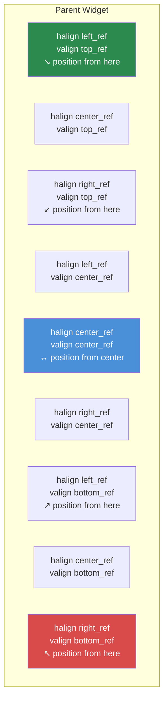

# 3.3. fejezet: Méretezés és pozícionálás

[Kezdőlap](../README.md) | [<< Előző: Layout fájl formátum](02-layout-files.md) | **Méretezés és pozícionálás** | [Következő: Konténer widgetek >>](04-containers.md)

---

A DayZ layout rendszere **kettős koordináta módot** használ -- minden dimenzió lehet arányos (a szülőhöz képest relatív) vagy pixel-alapú (abszolút képernyő pixelek). Ennek a rendszernek a félreértése az egyes számú forrása a layout hibáknak. Ez a fejezet alaposan elmagyarázza.

---

## Az alapfogalom: Arányos vs. Pixel

Minden widgetnek van pozíciója (`x, y`) és mérete (`szélesség, magasság`). Ez a négy érték egyenként lehet akár:

- **Arányos** (0.0-tól 1.0-ig) -- a szülő widget méreteihez viszonyítva
- **Pixel** (bármilyen pozitív szám) -- abszolút képernyő pixelek

A módot minden tengelyre négy jelző szabályozza:

| Jelző | Vezérli | `0` = Arányos | `1` = Pixel |
|---|---|---|---|
| `hexactpos` | X pozíció | A szülő szélességének hányada | Pixelek balról |
| `vexactpos` | Y pozíció | A szülő magasságának hányada | Pixelek felülről |
| `hexactsize` | Szélesség | A szülő szélességének hányada | Pixel szélesség |
| `vexactsize` | Magasság | A szülő magasságának hányada | Pixel magasság |

Ez azt jelenti, hogy szabadon keverhetők a módok. Például egy widget rendelkezhet arányos szélességgel, de pixel magassággal -- ez egy nagyon gyakori minta soroknál és sávoknál.

---

## Az arányos mód megértése

Amikor egy jelző `0` (arányos), az érték a **szülő dimenziójának hányadát** jelenti:

- `size 1 1` a `hexactsize 0` és `vexactsize 0` beállítással azt jelenti: "a szülő szélességének 100%-a, a szülő magasságának 100%-a" -- a gyermek kitölti a szülőt.
- `size 0.5 0.3` azt jelenti: "a szülő szélességének 50%-a, a szülő magasságának 30%-a."
- `position 0.5 0` a `hexactpos 0` beállítással azt jelenti: "a szülő szélességének 50%-ától balról indul."

Az arányos mód felbontás-független. A widget automatikusan skálázódik, amikor a szülő mérete változik, vagy amikor a játék más felbontáson fut.

```
// Egy widget, amely kitölti a szülő bal felét
FrameWidgetClass LeftHalf {
 position 0 0
 size 0.5 1
 hexactpos 0
 vexactpos 0
 hexactsize 0
 vexactsize 0
}
```

---

## A pixel mód megértése

Amikor egy jelző `1` (pixel/pontos), az érték **képernyő pixelekben** van:

- `size 200 40` a `hexactsize 1` és `vexactsize 1` beállítással azt jelenti: "200 pixel széles, 40 pixel magas."
- `position 10 10` a `hexactpos 1` és `vexactpos 1` beállítással azt jelenti: "10 pixel a szülő bal szélétől, 10 pixel a szülő felső szélétől."

A pixel mód pontos vezérlést ad, de NEM skálázódik automatikusan a felbontással.

```
// Fix méretű gomb: 120x30 pixel
ButtonWidgetClass MyButton {
 position 10 10
 size 120 30
 hexactpos 1
 vexactpos 1
 hexactsize 1
 vexactsize 1
 text "Click Me"
}
```

---

## Módok keverése: A leggyakoribb minta

Az igazi erő a módok keveréséből ered. A professzionális DayZ modokban a leggyakoribb minta:

**Arányos szélesség, pixel magasság** -- sávokhoz, sorokhoz és fejlécekhez.

```
// Teljes szélességű sor, pontosan 30 pixel magas
FrameWidgetClass Row {
 position 0 0
 size 1 30
 hexactpos 0
 vexactpos 0
 hexactsize 0        // Szélesség: arányos (a szülő 100%-a)
 vexactsize 1        // Magasság: pixel (30px)
}
```

**Arányos szélesség és magasság, pixel pozíció** -- fix mennyiséggel eltolt középre igazított panelekhez.

```
// 60% x 70% panel, 0px eltolás a középponttól
FrameWidgetClass Dialog {
 position 0 0
 size 0.6 0.7
 halign center_ref
 valign center_ref
 hexactpos 1         // Pozíció: pixel (0px eltolás a középponttól)
 vexactpos 1
 hexactsize 0        // Méret: arányos (60% x 70%)
 vexactsize 0
}
```

---

## Igazítási referenciapontok: halign és valign

A `halign` és `valign` attribútumok megváltoztatják a pozícionálás **referenciapontját**:

| Érték | Hatás |
|---|---|
| `left_ref` (alapértelmezett) | A pozíció a szülő bal szélétől mérve |
| `center_ref` | A pozíció a szülő középpontjától mérve |
| `right_ref` | A pozíció a szülő jobb szélétől mérve |
| `top_ref` (alapértelmezett) | A pozíció a szülő felső szélétől mérve |
| `center_ref` | A pozíció a szülő középpontjától mérve |
| `bottom_ref` | A pozíció a szülő alsó szélétől mérve |

Pixel pozícióval (`hexactpos 1`) kombinálva az igazítási referenciapontok triviálissá teszik a középre igazítást:

```
// Képernyő közepén, eltolás nélkül
FrameWidgetClass CenteredDialog {
 position 0 0
 size 0.4 0.5
 halign center_ref
 valign center_ref
 hexactpos 1
 vexactpos 1
 hexactsize 0
 vexactsize 0
}
```

A `center_ref` használatával a `0 0` pozíció azt jelenti: "a szülőben középre igazított." A `10 0` pozíció azt jelenti: "10 pixellel a középponttól jobbra."

### Jobbra igazított elemek


```
// Ikon a jobb szélhez rögzítve, 5px-re a széltől
ImageWidgetClass StatusIcon {
 position 5 5
 size 24 24
 halign right_ref
 valign top_ref
 hexactpos 1
 vexactpos 1
 hexactsize 1
 vexactsize 1
}
```

### Alulra igazított elemek

```
// Állapotsáv a szülő alján
FrameWidgetClass StatusBar {
 position 0 0
 size 1 30
 halign left_ref
 valign bottom_ref
 hexactpos 1
 vexactpos 1
 hexactsize 0
 vexactsize 1
}
```

---

## KRITIKUS: Nincs negatív méretérték

**Soha ne használj negatív értékeket a widget méretéhez layout fájlokban.** A negatív méretek meghatározatlan viselkedést okoznak -- a widgetek láthatatlanná válhatnak, hibásan renderelődhetnek, vagy összeomlaszthatják az UI rendszert. Ha el akarod rejteni a widgetet, használd a `visible 0` beállítást helyette.

Ez az egyik leggyakoribb layout hiba. Ha a widgeted nem jelenik meg, ellenőrizd, hogy nem állítottál-e be véletlenül negatív méretértéket.

---

## Gyakori méretezési minták

### Teljes képernyős fedőréteg

```
FrameWidgetClass Overlay {
 position 0 0
 size 1 1
 hexactpos 0
 vexactpos 0
 hexactsize 0
 vexactsize 0
}
```

### Középre igazított párbeszédablak (60% x 70%)

```
FrameWidgetClass Dialog {
 position 0 0
 size 0.6 0.7
 halign center_ref
 valign center_ref
 hexactpos 1
 vexactpos 1
 hexactsize 0
 vexactsize 0
}
```

### Jobbra igazított oldalsáv (25% szélesség)

```
FrameWidgetClass SidePanel {
 position 0 0
 size 0.25 1
 halign right_ref
 hexactpos 1
 vexactpos 0
 hexactsize 0
 vexactsize 0
}
```

### Felső sáv (teljes szélesség, fix magasság)

```
FrameWidgetClass TopBar {
 position 0 0
 size 1 40
 hexactpos 0
 vexactpos 0
 hexactsize 0
 vexactsize 1
}
```

### Jobb alsó sarok jelvény

```
FrameWidgetClass Badge {
 position 10 10
 size 80 24
 halign right_ref
 valign bottom_ref
 hexactpos 1
 vexactpos 1
 hexactsize 1
 vexactsize 1
}
```

### Fix méretű középre igazított ikon

```
ImageWidgetClass Icon {
 position 0 0
 size 64 64
 halign center_ref
 valign center_ref
 hexactpos 1
 vexactpos 1
 hexactsize 1
 vexactsize 1
}
```

---

## Programozott pozíció és méret

Kódban mind arányos, mind pixel (képernyő) koordinátákkal olvashatod és állíthatod a pozíciót és méretet:

```c
// Arányos koordináták (0-1 tartomány)
float x, y, w, h;
widget.GetPos(x, y);           // Arányos pozíció olvasása
widget.SetPos(0.5, 0.1);      // Arányos pozíció beállítása
widget.GetSize(w, h);          // Arányos méret olvasása
widget.SetSize(0.3, 0.2);     // Arányos méret beállítása

// Pixel/képernyő koordináták
widget.GetScreenPos(x, y);     // Pixel pozíció olvasása
widget.SetScreenPos(100, 50);  // Pixel pozíció beállítása
widget.GetScreenSize(w, h);    // Pixel méret olvasása
widget.SetScreenSize(400, 300);// Pixel méret beállítása
```

Widget középre igazítása a képernyőn programozottan:

```c
int screen_w, screen_h;
GetScreenSize(screen_w, screen_h);

float w, h;
widget.GetScreenSize(w, h);
widget.SetScreenPos((screen_w - w) / 2, (screen_h - h) / 2);
```

---

## A `scaled` attribútum

Amikor a `scaled 1` be van állítva, a widget figyelembe veszi a DayZ UI skálázási beállítását (Beállítások > Videó > HUD méret). Ez fontos a HUD elemekhez, amelyeknek a felhasználó preferenciájával kell skálázódniuk.

A `scaled` nélkül a pixel-méretű widgetek ugyanolyan fizikai méretűek lesznek az UI skálázási beállítástól függetlenül.

---

## A `fixaspect` attribútum

Használd a `fixaspect` attribútumot a widget képarányának megtartásához:

- `fixaspect fixwidth` -- A magasság igazodik a képarány megtartásához a szélesség alapján
- `fixaspect fixheight` -- A szélesség igazodik a képarány megtartásához a magasság alapján

Ez elsősorban az `ImageWidget`-nél hasznos a képtorzulás megelőzésére.

---

## Z-sorrend és prioritás

A `priority` attribútum szabályozza, mely widgetek renderelődnek felülre, ha átfedik egymást. A magasabb értékek az alacsonyabbak fölé renderelődnek.

| Prioritás tartomány | Tipikus használat |
|----------------|-------------|
| 0-5 | Háttérelemek, dekoratív panelek |
| 10-50 | Normál UI elemek, HUD komponensek |
| 50-100 | Fedőréteg elemek, lebegő panelek |
| 100-200 | Értesítések, tooltipek |
| 998-999 | Modális párbeszédablakok, blokkoló fedőrétegek |

```
FrameWidget myBackground {
    priority 1
    // ...
}

FrameWidget myDialog {
    priority 999
    // ...
}
```

**Fontos:** A prioritás csak az azonos szülőn belüli testvérek renderelési sorrendjét befolyásolja. A beágyazott gyermekek mindig a szülőjük fölé rajzolódnak, a prioritás értékektől függetlenül.

---

## Méretezési problémák hibakeresése

Amikor egy widget nem ott jelenik meg, ahol várod:

1. **Ellenőrizd a pontos jelzőket** -- A `hexactsize` `0`-ra van állítva, miközben pixeleket akartál? A `200` érték arányos módban a szülő szélességének 200-szorosát jelenti (messze a képernyőn kívül).
2. **Ellenőrizd a negatív méreteket** -- Bármilyen negatív érték a `size`-ban problémákat okoz.
3. **Ellenőrizd a szülő méretét** -- Egy nulla méretű szülő arányos gyermeke nulla méretű.
4. **Ellenőrizd a `visible` értéket** -- A widgetek alapértelmezetten láthatók, de ha egy szülő rejtett, az összes gyermeke is az.
5. **Ellenőrizd a `priority` értéket** -- Egy alacsonyabb prioritású widget elrejtőzhet egy másik mögött.
6. **Használd a `clipchildren` beállítást** -- Ha egy szülőnél `clipchildren 1` van beállítva, a határain kívüli gyermekek nem láthatók.

---

## Bevált gyakorlatok

- Mindig adj meg mind a négy pontos jelzőt explicit módon (`hexactpos`, `vexactpos`, `hexactsize`, `vexactsize`). Ezek elhagyása kiszámíthatatlan viselkedéshez vezet, mert az alapértelmezések widget típusonként változnak.
- Használd az arányos szélesség + pixel magasság mintát sorokhoz és sávokhoz. Ez a leginkább felbontás-biztos kombináció és a professzionális modok szabványa.
- Középre igazítsd a párbeszédablakokat `halign center_ref` + `valign center_ref` + `0 0` pixel pozícióval, ne `0.5 0.5` arányos pozícióval. Az igazítási referencia módszer a widget méretétől függetlenül középen marad.
- Kerüld a pixel méreteket teljes képernyős vagy közel teljes képernyős elemeknél. Használj arányos méretezést, hogy az UI bármilyen felbontáshoz alkalmazkodjon (1080p, 1440p, 4K).
- A `SetScreenPos()` / `SetScreenSize()` kódban történő használatakor hívd meg őket azután, hogy a widget a szülőjéhez csatolva van. A csatolás előtti hívás hibás koordinátákat eredményezhet.

---

## Elmélet vs. gyakorlat

> Amit a dokumentáció mond, és hogyan működnek a dolgok ténylegesen futásidőben.

| Fogalom | Elmélet | Valóság |
|---------|---------|---------|
| Arányos méretezés | A 0.0-1.0 értékek a szülőhöz viszonyítva skálázódnak | Ha a szülőnak pixel mérete van, a gyermek arányos értékei ahhoz a pixel értékhez viszonyítva értendők, nem a képernyőhöz -- egy 200px széles szülő gyermeke `size 0.5` értékkel 100px lesz |
| `center_ref` igazítás | A widget a szülőjében középre igazítja magát | A widget bal felső sarka a középpontra kerül -- a widget a középponttól jobbra és lefelé lóg, hacsak a pozíció nem `0 0` pixel módban |
| `priority` z-rendezés | A magasabb értékek felülre renderelődnek | A prioritás csak az azonos szülőn belüli testvéreket befolyásolja. Egy gyermek mindig a szülője fölé renderelődik, a prioritás értékektől függetlenül |
| `scaled` attribútum | A widget figyelembe veszi a HUD méret beállítást | Csak a pixel-módú dimenziókat befolyásolja. Az arányos dimenziók már a szülővel skálázódnak és figyelmen kívül hagyják a `scaled` jelzőt |
| Negatív pozíció értékek | Fordított irányban kellene eltolniuk | A pozíciónál működik (eltolás balra/felfelé a referenciaponttól), de a negatív méretértékek meghatározatlan renderelési viselkedést okoznak -- soha ne használd őket |

---

## Kompatibilitás és hatás

- **Több moddal:** A méretezés és pozícionálás widgetenként történik és nem ütközhet modok között. Azonban azok a modok, amelyek teljes képernyős fedőrétegeket használnak (`size 1 1` a gyökéren) `priority 999` beállítással, blokkolhatják más modok UI elemeinek bevétel fogadását.
- **Teljesítmény:** Az arányos méretezés szülőhöz viszonyított újraszámítást igényel minden képkockánál animált vagy dinamikus widgeteknél. Statikus layoutoknál nincs mérhető különbség az arányos és pixel módok között.
- **Verzió:** A kettős koordináta rendszer (arányos vs pixel) a DayZ 0.63 kísérleti verziója óta stabil. A `scaled` attribútum viselkedését a DayZ 1.14-ben finomították a HUD méret csúszka jobb támogatásához.

---

## Következő lépések

- [3.4 Konténer widgetek](04-containers.md) -- Hogyan kezelik a spacer és scroll widgetek automatikusan az elrendezést
- [3.5 Programozott widget létrehozás](05-programmatic-widgets.md) -- Méret és pozíció beállítása kódból
