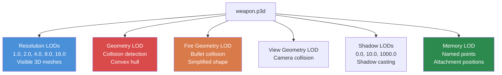

# 4.2. fejezet: 3D modellek (.p3d)

[Kezdőlap](../README.md) | [<< Előző: Textúrák](01-textures.md) | **3D modellek** | [Következő: Anyagok >>](03-materials.md)

---

## Bevezetés

A DayZ minden fizikai objektuma -- fegyverek, ruházat, épületek, járművek, fák, sziklák -- egy 3D modell, amely Bohemia saját fejlesztésű **P3D** formátumában van tárolva. A P3D formátum sokkal több, mint egy háló konténer: több részletességi szintet, ütközési geometriát, animációs kiválasztásokat, memóriapontokat csatolásokhoz és effektekhez, valamint proxy pozíciókat felszerelhető tárgyakhoz kódol. A P3D fájlok működésének és az **Object Builder**-rel történő létrehozásuknak a megértése elengedhetetlen minden olyan modhoz, amely fizikai tárgyakat ad a játékvilághoz.

Ez a fejezet a P3D formátum felépítését, az LOD rendszert, az elnevezett kiválasztásokat, a memóriapontokat, a proxy rendszert, a `model.cfg`-n keresztüli animáció konfigurálást és a szabványos 3D formátumokból történő import munkafolyamatot tárgyalja.

---

## Tartalomjegyzék

- [P3D formátum áttekintése](#p3d-format-overview)
- [Object Builder](#object-builder)
- [Az LOD rendszer](#the-lod-system)
- [Elnevezett kiválasztások](#named-selections)
- [Memóriapontok](#memory-points)
- [A proxy rendszer](#the-proxy-system)
- [Model.cfg animációkhoz](#modelcfg-for-animations)
- [Importálás FBX/OBJ fájlból](#importing-from-fbxobj)
- [Gyakori modell típusok](#common-model-types)
- [Gyakori hibák](#common-mistakes)
- [Bevált gyakorlatok](#best-practices)

---

## P3D formátum áttekintése

A **P3D** (Point 3D) a Bohemia Interactive bináris 3D modell formátuma, amelyet a Real Virtuality motorból örökölt és az Enfusionba továbbvitt. Fordított, motor-kész formátum -- P3D fájlokat nem kézzel írsz.

### Fő jellemzők

- **Bináris formátum:** Nem emberolvasható. Kizárólag az Object Builder-rel hozható létre és szerkeszthető.
- **Több-LOD konténer:** Egyetlen P3D fájl több LOD (Level of Detail) hálót tartalmaz, mindegyik eltérő céllal.
- **Motor-natív:** A DayZ motor közvetlenül tölti be a P3D-t. Nincs futásidejű konverzió.
- **Binarizált vs. nem binarizált:** Az Object Builder-ből származó forrás P3D fájlok "MLOD" (szerkeszthető). A Binarize "ODOL"-lá (optimalizált, csak olvasható) konvertálja őket.

### Fájltípusok amelyekkel találkozni fogsz

| Kiterjesztés | Leírás |
|-----------|-------------|
| `.p3d` | 3D modell (mind MLOD forrás, mind ODOL binarizált) |
| `.rtm` | Runtime Motion -- animáció kulcskocka adatok |
| `.bisurf` | Felületi tulajdonságok fájl (P3D mellett használatos) |

### MLOD vs. ODOL

| Tulajdonság | MLOD (forrás) | ODOL (binarizált) |
|----------|---------------|-------------------|
| Készítette | Object Builder | Binarize |
| Szerkeszthető | Igen | Nem |
| Fájlméret | Nagyobb | Kisebb |
| Betöltési sebesség | Lassabb | Gyorsabb |
| Használat | Fejlesztés során | Kiadáskor |
| Tartalmaz | Teljes szerkesztési adat, elnevezett kiválasztások | Optimalizált háló adat |

> **Fontos:** Amikor PBO-t csomagolsz binarizálással, az MLOD P3D fájljaid automatikusan ODOL-lá konvertálódnak. Ha a `-packonly` opcióval csomagolsz, az MLOD fájlok úgy kerülnek bele, ahogy vannak. Mindkettő működik a játékban, de az ODOL a preferált kiadási buildekhez.

---

## Object Builder

Az **Object Builder** a Bohemia által biztosított eszköz P3D modellek létrehozásához és szerkesztéséhez. A DayZ Tools csomagban található a Steamen.

### Alapvető munkafolyamat az Object Builder-ben

1. **Hozd létre vagy importáld** a háló geometriádat.
2. **Definiálj LOD-okat** -- legalább hozz létre Resolution, Geometry és Fire Geometry LOD-okat.
3. **Rendelj anyagokat** a felületekhez a Resolution LOD-ban.
4. **Nevezd el a kiválasztásokat** bármilyen részhez, amely animálódik, textúrát cserél, vagy kód interakciót igényel.
5. **Helyezz el memóriapontokat** csatolásokhoz, csőtorkolat villanás pozíciókhoz, kilökő nyílásokhoz stb.
6. **Adj hozzá proxykat** csatolható tárgyakhoz (optikák, tárak, hangtompítók).
7. **Validáld** az Object Builder beépített validálásával (Structure --> Validate).
8. **Mentsd el** P3D-ként.
9. **Építsd** Binarize-zal vagy AddonBuilder-rel.

---

## Az LOD rendszer

Egy P3D fájl több **LOD-ot** (Level of Detail) tartalmaz, mindegyik specifikus célt szolgálva. A motor a helyzet alapján választja ki melyik LOD-ot használja -- kamerától való távolság, fizikai számítások, árnyék renderelés stb.

### LOD típusok

| LOD | Felbontás érték | Cél |
|-----|-----------------|---------|
| **Resolution 0** | 1.000 | Legnagyobb részletezettségű vizuális háló. Renderelve, amikor az objektum közel van a kamerához. |
| **Resolution 1** | 1.100 | Közepes részletezettség. Mérsékelt távolságnál renderelve. |
| **Resolution 2** | 1.200 | Alacsony részletezettség. Nagy távolságnál renderelve. |
| **View Geometry** | Speciális | Meghatározza, mi blokkolja a játékos nézetét (első személyben). Egyszerűsített háló. |
| **Fire Geometry** | Speciális | Ütközés golyóknak és lövedékeknek. Konvexnek kell lennie vagy konvex részekből kell állnia. |
| **Geometry** | Speciális | Fizikai ütközés. Mozgásütközéshez, gravitációhoz, elhelyezéshez használatos. Konvexnek kell lennie. |
| **Shadow 0** | Speciális | Árnyékvetési háló (közeli tartomány). |
| **Shadow 1000** | Speciális | Árnyékvetési háló (távoli tartomány). Egyszerűbb mint a Shadow 0. |
| **Memory** | Speciális | Csak elnevezett pontokat tartalmaz (nincs látható geometria). Csatolás pozíciókhoz, hang eredetekhez stb. |
| **Roadway** | Speciális | Járható felületeket definiál objektumokon (járművek, bejárható belsővel rendelkező épületek). |
| **Paths** | Speciális | AI útvonalkereső segítség épületekhez. |

### Geometry LOD szabályok

A Geometry és Fire Geometry LOD-oknak szigorú követelményei vannak:

- **Konvexnek kell lenniük** vagy több konvex komponensből kell állniuk.
- **Az elnevezett kiválasztásoknak egyezniük kell** a Resolution LOD-ban lévőkkel (animált részeknél).
- **A tömeget meg kell határozni.** Válaszd ki az összes csúcspontot a Geometry LOD-ban és rendelj hozzá tömeget a **Structure --> Mass** menüponton keresztül.
- **Tartsd egyszerűen.** Kevesebb háromszög = jobb fizikai teljesítmény.

---

## Elnevezett kiválasztások

Az elnevezett kiválasztások csúcspontok, élek vagy felületek csoportjai egy LOD-on belül, amelyek névvel vannak ellátva. A motor és a szkriptek számára fogantyúként szolgálnak a modell részeinek manipulálásához.

### Mire használjuk az elnevezett kiválasztásokat

| Cél | Példa kiválasztás neve | Használja |
|---------|----------------------|---------|
| **Animáció** | `bolt`, `trigger`, `magazine` | `model.cfg` animáció források |
| **Textúra cserék** | `camo`, `camo1`, `body` | `hiddenSelections[]` a config.cpp-ben |
| **Sérülés textúrák** | `zbytek` | Motor sérülési rendszer, anyagcserék |
| **Csatolási pontok** | `magazine`, `optics`, `suppressor` | Proxy és csatolási rendszer |

### hiddenSelections (textúra cserék)

A modderek számára az elnevezett kiválasztások leggyakoribb használata a **hiddenSelections** -- a képesség textúrák futásidejű cseréjére a config.cpp-n keresztül.

---

## Memóriapontok

A memóriapontok a **Memory LOD**-ban definiált elnevezett pozíciók. Nincs vizuális megjelenésük a játékban -- térbeli koordinátákat definiálnak, amelyekre a motor és a szkriptek hivatkoznak effektek, csatolások, hangok és egyebek pozícionálásához.

### Gyakori memóriapontok

| Pont neve | Cél |
|------------|---------|
| `usti hlavne` | Csőtorkolat pozíció (ahol a golyók erednek, csőtorkolat villanás megjelenik) |
| `konec hlavne` | Cső vége (az `usti hlavne`-vel együtt definiálja a cső irányát) |
| `nabojnicestart` | Kilökő nyílás kezdete (ahol a töltényhüvelyek kirepülnek) |
| `nabojniceend` | Kilökő nyílás vége (a kilökés iránya) |
| `magazine` | Tár hely pozíció |
| `optics` | Optikai sín pozíció |
| `suppressor` | Hangtompító rögzítési pozíció |

> **Megjegyzés:** A Memory LOD-nak CSAK elnevezett pontokat (egyedi csúcspontokat) kell tartalmaznia. Ne hozz létre felületeket vagy éleket a Memory LOD-ban.

---

## A proxy rendszer

A proxyk pozíciókat definiálnak, ahol más P3D modellek csatolhatók. Amikor egy tárat látsz egy fegyverbe illesztve, egy optikát sínre szerelve, vagy egy hangtompítót csőre csavarva -- ezek proxy-csatolt modellek.

### Proxy elnevezési konvenció

A proxy nevek a következő mintát követik: `proxy:\útvonal\modellhez.p3d`

---

## Model.cfg animációkhoz

A `model.cfg` fájl definiálja az animációkat P3D modellekhez. Animációs forrásokat (amelyeket a játéklogika hajt) térképez átalakításokra elnevezett kiválasztásokon.

### Animáció típusok

| Típus | Kulcsszó | Mozgás | Vezérli |
|------|---------|----------|---------------|
| **Eltolás** | `translation` | Lineáris mozgás egy tengely mentén | `offset0` / `offset1` (méterek) |
| **Forgatás** | `rotation` | Forgatás egy tengely körül | `angle0` / `angle1` (radiánok) |
| **ForgatásX/Y/Z** | `rotationX` | Forgatás fix világtengely körül | `angle0` / `angle1` |
| **Elrejtés** | `hide` | Kiválasztás megjelenítése/elrejtése | `hideValue` küszöb |

### Animáció források

Az animáció források motor által biztosított értékek, amelyek animációkat hajtanak:

| Forrás | Tartomány | Leírás |
|--------|-------|-------------|
| `reload` | 0-1 | Fegyver újratöltési fázis |
| `trigger` | 0-1 | Ravasz húzás |
| `zeroing` | 0-N | Fegyver belövési beállítás |
| `door` | 0-1 | Ajtó nyitás/zárás |
| `rpm` | 0-N | Jármű motor fordulatszám |
| `speed` | 0-N | Jármű sebesség |
| `fuel` | 0-1 | Jármű üzemanyag szint |

---

## Importálás FBX/OBJ fájlból

A legtöbb modder külső eszközökben (Blender, 3ds Max, Maya) készíti a 3D modelleket és az Object Builder-be importálja őket.

### Támogatott import formátumok

| Formátum | Kiterjesztés | Megjegyzések |
|--------|-----------|-------|
| **FBX** | `.fbx` | Legjobb kompatibilitás. Exportáld FBX 2013 vagy későbbi (bináris) formátumban. |
| **OBJ** | `.obj` | Wavefront OBJ. Csak egyszerű háló adat (animáció nélkül). |
| **3DS** | `.3ds` | Régi 3ds Max formátum. Hálónként 65K csúcspontra korlátozva. |

---

## Gyakori modell típusok

### Fegyverek

A fegyverek a legösszetettebb P3D modellek, amelyekhez szükséges:
- Nagy poligonszámú Resolution LOD (5,000-20,000 háromszög)
- Több elnevezett kiválasztás (bolt, trigger, magazine, camo stb.)
- Teljes memóriapont készlet (csőtorkolat, kilökés, markolat pozíciók)
- Több proxy (tár, optika, hangtompító, kézvédő, tus)

### Ruházat

Ruházati modellek a karakter csontvázhoz vannak rigelve, hiddenSelections-szal szín/álcázás változatokhoz.

### Épületek

Épületeknek egyedi követelményei vannak: Roadway LOD járható felületekhez, Paths LOD AI navigációhoz, View Geometry a falakon való átlátás megelőzéséhez.

### Járművek

Járművek sok rendszert kombinálnak: részletes Resolution LOD animált alkatrészekkel, komplex csontváz sok csonttal, memóriapontok fényekhez, kipufogóhoz, vezetőüléshez.

---

## Gyakori hibák

### 1. Hiányzó Geometry LOD

**Tünet:** Az objektumnak nincs ütközése. Játékosok és golyók átmennek rajta.
**Javítás:** Hozz létre egy Geometry LOD-ot egyszerűsített konvex hálóval. Rendelj tömeget a csúcspontokhoz.

### 2. Nem konvex ütközési alakzatok

**Tünet:** Fizikai hibák, objektumok szeszélyesen pattognak, tárgyak felületeken áthullnak.
**Javítás:** Bontsd a komplex alakzatokat több konvex komponensre a Geometry LOD-ban.

### 3. Rossz méretarány

**Tünet:** Az objektum hatalmas vagy mikroszkopikus a játékban.
**Javítás:** Ellenőrizd, hogy a 3D szoftvered métereket használ egységként. Egy DayZ karakter megközelítőleg 1.8 méter magas.

---

## Bevált gyakorlatok

1. **Kezdd a Geometry LOD-dal.** Először alakítsd ki az ütközési formádat, majd építsd rá a vizuális részleteket.

2. **Használj referencia modelleket.** Csomagold ki a vanilla P3D fájlokat a játékadatokból és tanulmányozd őket az Object Builder-ben.

3. **Validálj gyakran.** Használd az Object Builder **Structure --> Validate** funkcióját minden jelentős változtatás után.

4. **Tartsd arányosan az LOD háromszögszámokat.** A Resolution 0 lehet 10,000 háromszög; a Resolution 1 legyen ~5,000; a Geometry legyen ~100-500.

5. **Nevezd el kifejezően a kiválasztásokat.** Használd a `bolt_carrier` nevet a `sel01` helyett.

6. **Tesztelj fájl foltozási módban először.** Töltsd be a nem binarizált P3D-t fájl foltozási módban a teljes PBO build elkötelezése előtt.

7. **Dokumentáld a memóriapontokat.** Tartsd nyilván az összes memóriapontot és azok tervezett pozícióit.

---

## Navigáció

| Előző | Fel | Következő |
|----------|----|------|
| [4.1 Textúrák](01-textures.md) | [4. rész: Fájlformátumok és DayZ Tools](01-textures.md) | [4.3 Anyagok](03-materials.md) |
