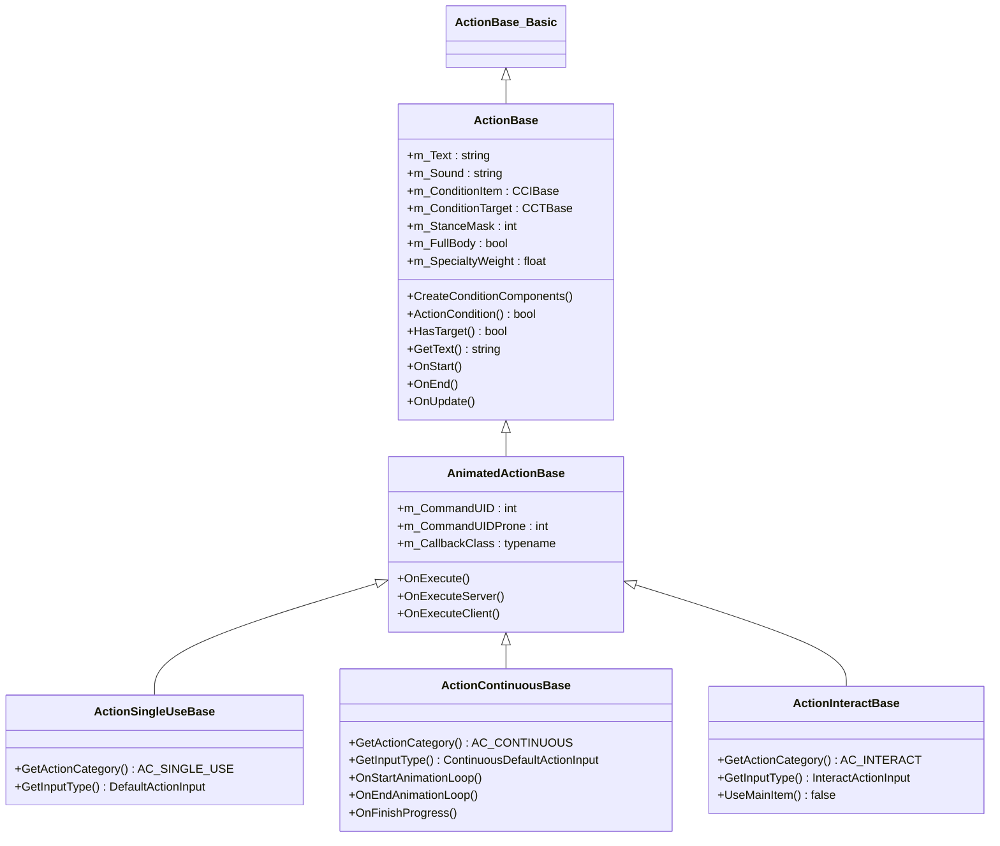
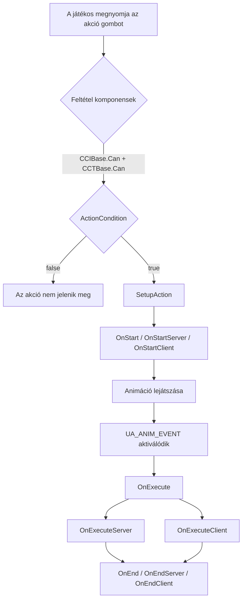
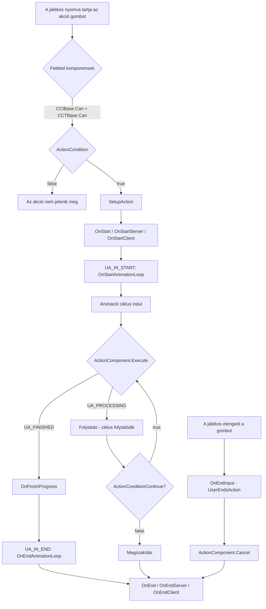
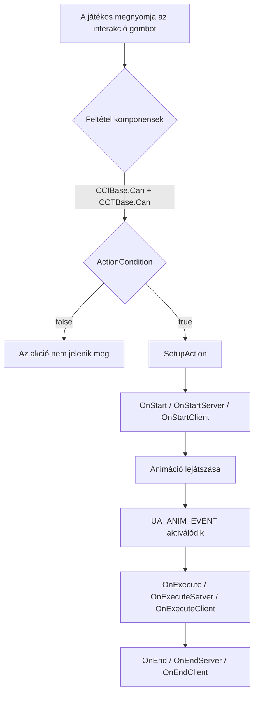

# 6.12. fejezet: Akció rendszer

[Főoldal](../../README.md) | [<< Előző: Mission hookok](11-mission-hooks.md) | **Akció rendszer** | [Következő: Input rendszer >>](13-input-system.md)

---

## Bevezetés

Az akció rendszer az, ahogyan a DayZ kezeli az összes játékos interakciót tárgyakkal és a világgal. Minden alkalommal, amikor egy játékos ételt eszik, ajtót nyit, sebet kötöz be, falat javít vagy zseblámpát kapcsol be, a motor végigfut az akció feldolgozási folyamaton. Ennek a folyamatnak a megértése --- a feltétel ellenőrzésektől az animáció visszahívásokon át a szerver oldali végrehajtásig --- alapvető bármilyen interaktív játékmenet mod létrehozásához.

A rendszer elsősorban a `4_World/classes/useractionscomponent/` könyvtárban található, és három pillérre épül:

1. **Akció osztályok**, amelyek meghatározzák, mi történik (logika, feltételek, animációk)
2. **Feltétel komponensek**, amelyek szabályozzák, mikor jelenhet meg egy akció (távolság, tárgy állapot, cél típus)
3. **Akció komponensek**, amelyek irányítják, hogyan halad az akció (idő, mennyiség, ismétlődő ciklusok)

Ez a fejezet a teljes API-t, osztályhierarchiát, életciklust és gyakorlati mintákat tárgyalja egyéni akciók létrehozásához.

---

## Osztályhierarchia

```
ActionBase_Basic                         // 3_Game — üres váz, fordítási horgony
└── ActionBase                           // 4_World — alaplogika, feltételek, események
    └── AnimatedActionBase               // 4_World — animáció visszahívások, OnExecute
        ├── ActionSingleUseBase          // azonnali akciók (tabletta bevétele, lámpa bekapcsolása)
        ├── ActionContinuousBase         // folyamatjelzős akciók (kötözés, javítás, evés)
        └── ActionInteractBase           // világ interakciók (ajtó nyitás, kapcsoló váltás)
```



### Kulcskülönbségek az akció típusok között

| Tulajdonság | SingleUse | Continuous | Interact |
|----------|-----------|------------|----------|
| Kategória konstans | `AC_SINGLE_USE` | `AC_CONTINUOUS` | `AC_INTERACT` |
| Input típus | `DefaultActionInput` | `ContinuousDefaultActionInput` | `InteractActionInput` |
| Folyamatjelző | Nem | Igen | Nem |
| Fő tárgyat használ | Igen | Igen | Nem (alapértelmezetten) |
| Célpontja van | Változó | Változó | Igen (alapértelmezetten) |
| Tipikus használat | Tabletta bevétele, zseblámpa váltás | Kötözés, javítás, ételfogyasztás | Ajtó nyitás, generátor bekapcsolás |
| Visszahívás osztály | `ActionSingleUseBaseCB` | `ActionContinuousBaseCB` | `ActionInteractBaseCB` |

---

## Akció életciklus

### Állapot konstansok

Az akció állapotgép ezeket a konstansokat használja, amelyek a `3_Game/constants.c` fájlban vannak definiálva:

| Konstans | Érték | Jelentés |
|----------|-------|---------|
| `UA_NONE` | 0 | Nincs futó akció |
| `UA_PROCESSING` | 2 | Akció folyamatban |
| `UA_FINISHED` | 4 | Akció sikeresen befejezve |
| `UA_CANCEL` | 5 | Akció a játékos által megszakítva |
| `UA_INTERRUPT` | 6 | Akció külsőleg megszakítva |
| `UA_INITIALIZE` | 12 | Folyamatos akció inicializálása |
| `UA_ERROR` | 24 | Hiba állapot --- akció megszakítva |
| `UA_ANIM_EVENT` | 11 | Animáció végrehajtási esemény aktiválva |
| `UA_IN_START` | 17 | Animáció ciklus kezdő esemény |
| `UA_IN_END` | 18 | Animáció ciklus záró esemény |

### SingleUse akció folyamat



### Continuous akció folyamat



### Interact akció folyamat



### Életciklus metódusok referencia

Ezek a metódusok sorrendben kerülnek meghívásra egy akció élettartama alatt. Írd felül őket az egyéni akcióidban:

| Metódus | Hol hívódik | Cél |
|--------|-----------|---------|
| `CreateConditionComponents()` | Mindkettő | Az `m_ConditionItem` és `m_ConditionTarget` beállítása |
| `ActionCondition()` | Mindkettő | Egyéni validáció (távolság, állapot, típus ellenőrzések) |
| `ActionConditionContinue()` | Mindkettő | Csak folyamatos: minden frame-ben újraellenőrizve a folyamat során |
| `SetupAction()` | Mindkettő | Belső: `ActionData` felépítése, inventory foglalás |
| `OnStart()` | Mindkettő | Akció indul (aktív építés esetén megszakítja) |
| `OnStartServer()` | Szerver | Szerver oldali indítási logika |
| `OnStartClient()` | Kliens | Kliens oldali indítási effektek |
| `OnExecute()` | Mindkettő | Animáció esemény aktiválva --- fő végrehajtás |
| `OnExecuteServer()` | Szerver | Szerver oldali végrehajtási logika |
| `OnExecuteClient()` | Kliens | Kliens oldali végrehajtási effektek |
| `OnFinishProgress()` | Mindkettő | Csak folyamatos: egy ciklus befejezve |
| `OnFinishProgressServer()` | Szerver | Csak folyamatos: szerver ciklus kész |
| `OnFinishProgressClient()` | Kliens | Csak folyamatos: kliens ciklus kész |
| `OnStartAnimationLoop()` | Mindkettő | Csak folyamatos: ciklus animáció indul |
| `OnEndAnimationLoop()` | Mindkettő | Csak folyamatos: ciklus animáció befejeződik |
| `OnEnd()` | Mindkettő | Akció befejeződött (siker vagy megszakítás) |
| `OnEndServer()` | Szerver | Szerver oldali takarítás |
| `OnEndClient()` | Kliens | Kliens oldali takarítás |

---

## ActionData

Minden futó akció egy `ActionData` példányt hordoz, amely tartalmazza a futásidejű kontextust. Ez minden életciklus metódusnak átadásra kerül:

```c
class ActionData
{
    ref ActionBase       m_Action;          // a végrehajtott akció osztály
    ItemBase             m_MainItem;        // a játékos kezében lévő tárgy (vagy null)
    ActionBaseCB         m_Callback;        // animáció visszahívás kezelő
    ref CABase           m_ActionComponent;  // folyamat komponens (idő, mennyiség)
    int                  m_State;           // jelenlegi állapot (UA_PROCESSING, stb.)
    ref ActionTarget     m_Target;          // célobjektum + találat info
    PlayerBase           m_Player;          // az akciót végrehajtó játékos
    bool                 m_WasExecuted;     // igaz az OnExecute aktiválása után
    bool                 m_WasActionStarted; // igaz az akció ciklus indulása után
}
```

Kiterjesztheted az `ActionData`-t egyéni adatokhoz. Írd felül a `CreateActionData()` metódust az akciódban:

```c
class MyCustomActionData : ActionData
{
    int m_CustomValue;
}

class MyCustomAction : ActionContinuousBase
{
    override ActionData CreateActionData()
    {
        return new MyCustomActionData;
    }

    override void OnFinishProgressServer(ActionData action_data)
    {
        MyCustomActionData data = MyCustomActionData.Cast(action_data);
        data.m_CustomValue = data.m_CustomValue + 1;
        // ... egyéni adat használata
    }
}
```

---

## ActionTarget

Az `ActionTarget` osztály reprezentálja, mire céloz a játékos:

**Fájl:** `4_World/classes/useractionscomponent/actiontargets.c`

```c
class ActionTarget
{
    Object GetObject();         // a kurzor alatti közvetlen objektum (vagy proxy gyermek)
    Object GetParent();         // szülő objektum (ha a cél proxy/csatolmány)
    bool   IsProxy();           // igaz, ha a célnak van szülője
    int    GetComponentIndex(); // geometria komponens (nevesített szekció) index
    float  GetUtility();        // prioritás pontszám
    vector GetCursorHitPos();   // a kurzor találat pontos világ pozíciója
}
```

### Hogyan kerülnek kiválasztásra a célpontok

Az `ActionTargets` osztály minden frame-ben fut a kliensen, lehetséges célpontokat gyűjtve:

1. **Sugárkibocsátás** a kamera pozíciójából a kamera irányába (`c_RayDistance`)
2. **Környék átvizsgálás** a játékos körüli közeli objektumokért
3. Minden jelöltre a motor meghívja a `GetActions()` metódust az objektumon a regisztrált akciók megkereséséhez
4. Minden akció feltétel komponensei (`CCIBase.Can()`, `CCTBase.Can()`) és az `ActionCondition()` tesztelésre kerülnek
5. Az érvényes akciók hasznosság szerint rangsorolódnak és megjelennek a HUD-on

---

## Feltétel komponensek

Minden akciónak két feltétel komponense van, amelyek a `CreateConditionComponents()` metódusban vannak beállítva. Ezek az `ActionCondition()` **előtt** kerülnek ellenőrzésre, és meghatározzák, hogy az akció egyáltalán megjelenhet-e a játékos HUD-ján.

### Tárgy feltételek (CCIBase)

Szabályozza, hogy a játékos kezében lévő tárgy megfelel-e ennek az akciónak.

**Fájl:** `4_World/classes/useractionscomponent/itemconditioncomponents/`

| Osztály | Viselkedés |
|-------|----------|
| `CCINone` | Mindig teljesül --- nincs tárgy követelmény |
| `CCIDummy` | Teljesül, ha a tárgy nem null (tárgynak léteznie kell) |
| `CCINonRuined` | Teljesül, ha a tárgy létezik ÉS nincs tönkremenve |
| `CCINotPresent` | Teljesül, ha a tárgy null (a kezeknek üresnek kell lenniük) |
| `CCINotRuinedAndEmpty` | Teljesül, ha a tárgy létezik, nincs tönkre és nem üres |

```c
// CCINone — nincs szükség tárgyra, mindig igaz
class CCINone : CCIBase
{
    override bool Can(PlayerBase player, ItemBase item) { return true; }
    override bool CanContinue(PlayerBase player, ItemBase item) { return true; }
}

// CCINotPresent — a kezeknek üresnek kell lenniük
class CCINotPresent : CCIBase
{
    override bool Can(PlayerBase player, ItemBase item) { return !item; }
}

// CCINonRuined — a tárgynak léteznie kell és nem lehet megsemmisítve
class CCINonRuined : CCIBase
{
    override bool Can(PlayerBase player, ItemBase item)
    {
        return (item && !item.IsDamageDestroyed());
    }
}
```

### Célpont feltételek (CCTBase)

Szabályozza, hogy a célobjektum (amire a játékos néz) megfelel-e.

**Fájl:** `4_World/classes/useractionscomponent/targetconditionscomponents/`

| Osztály | Konstruktor | Viselkedés |
|-------|-------------|----------|
| `CCTNone` | `CCTNone()` | Mindig teljesül --- nincs szükség célpontra |
| `CCTDummy` | `CCTDummy()` | Teljesül, ha a célobjektum létezik |
| `CCTSelf` | `CCTSelf()` | Teljesül, ha a játékos létezik és él |
| `CCTObject` | `CCTObject(float dist)` | Célobjektum távolságon belül |
| `CCTCursor` | `CCTCursor(float dist)` | Kurzor találat pozíció távolságon belül |
| `CCTNonRuined` | `CCTNonRuined(float dist)` | Cél távolságon belül ÉS nem tönkrement |
| `CCTCursorParent` | `CCTCursorParent(float dist)` | Kurzor a szülő objektumon távolságon belül |

A távolság **mindkét** pozícióból mérődik: a játékos gyökérpozíciójából és a fej csont pozícióból (amelyik közelebb van). A `CCTObject` ellenőrzés:

```c
class CCTObject : CCTBase
{
    protected float m_MaximalActionDistanceSq;

    void CCTObject(float maximal_target_distance = UAMaxDistances.DEFAULT)
    {
        m_MaximalActionDistanceSq = maximal_target_distance * maximal_target_distance;
    }

    override bool Can(PlayerBase player, ActionTarget target)
    {
        Object targetObject = target.GetObject();
        if (!targetObject || !player)
            return false;

        vector playerHeadPos;
        MiscGameplayFunctions.GetHeadBonePos(player, playerHeadPos);

        float distanceRoot = vector.DistanceSq(targetObject.GetPosition(), player.GetPosition());
        float distanceHead = vector.DistanceSq(targetObject.GetPosition(), playerHeadPos);

        return (distanceRoot <= m_MaximalActionDistanceSq || distanceHead <= m_MaximalActionDistanceSq);
    }
}
```

### Távolság konstansok

**Fájl:** `4_World/classes/useractionscomponent/actions/actionconstants.c`

| Konstans | Érték (méter) | Tipikus használat |
|----------|---------------|-------------|
| `UAMaxDistances.SMALL` | 1.3 | Közeli interakciók, létrák |
| `UAMaxDistances.DEFAULT` | 2.0 | Szabványos akciók |
| `UAMaxDistances.REPAIR` | 3.0 | Javítási akciók |
| `UAMaxDistances.LARGE` | 8.0 | Nagy területű akciók |
| `UAMaxDistances.BASEBUILDING` | 20.0 | Bázisépítés |
| `UAMaxDistances.EXPLOSIVE_REMOTE_ACTIVATION` | 100.0 | Távoli detonálás |

---

## Akciók regisztrálása tárgyakon

Az akciók a `SetActions()` / `AddAction()` / `RemoveAction()` mintán keresztül regisztrálódnak entitásokon. A motor a `GetActions()` metódust hívja meg egy entitáson a akciólista lekéréséhez; amikor ez először történik, az `InitializeActions()` felépíti a leképezést a `SetActions()` segítségével.

### ItemBase-en (inventory tárgyak)

A leggyakoribb minta. Írd felül a `SetActions()` metódust egy `modded class`-ban:

```c
modded class MyCustomItem extends ItemBase
{
    override void SetActions()
    {
        super.SetActions();          // KRITIKUS: tartsd meg az összes vanilla akciót
        AddAction(MyCustomAction);   // add hozzá az akciódat
    }
}
```

Vanilla akció eltávolítása és saját helyettesítése:

```c
modded class Bandage_Basic extends ItemBase
{
    override void SetActions()
    {
        super.SetActions();
        RemoveAction(ActionBandageTarget);       // vanilla eltávolítása
        AddAction(MyImprovedBandageAction);      // helyettesítő hozzáadása
    }
}
```

### BuildingBase-en (világ épületek)

Az épületek ugyanazt a mintát használják, de a `BuildingBase` osztályon keresztül:

```c
// Vanilla példa: a kút víz akciókat regisztrál
class Well extends BuildingSuper
{
    override void SetActions()
    {
        super.SetActions();
        AddAction(ActionWashHandsWell);
        AddAction(ActionDrinkWellContinuous);
    }
}
```

### PlayerBase-en (játékos akciók)

A játékos szintű akciók (tócsából ivás, ajtók nyitása, stb.) a `PlayerBase.SetActions()` metódusban vannak regisztrálva. Két aláírás létezik:

```c
// Modern megközelítés (ajánlott) — InputActionMap paramétert használ
void SetActions(out TInputActionMap InputActionMap)
{
    AddAction(ActionOpenDoors, InputActionMap);
    AddAction(ActionCloseDoors, InputActionMap);
    // ...
}

// Régi megközelítés (visszafelé kompatibilitás) — nem ajánlott
void SetActions()
{
    // ...
}
```

A játékosnak van `SetActionsRemoteTarget()` metódusa is a másik játékos **által** egy játékoson végrehajtott akciókhoz (CPR, pulzus ellenőrzés, stb.):

```c
void SetActionsRemoteTarget(out TInputActionMap InputActionMap)
{
    AddAction(ActionCPR, InputActionMap);
    AddAction(ActionCheckPulseTarget, InputActionMap);
}
```

### Hogyan működik a regisztrációs rendszer belsőleg

Minden entitás típus egy statikus `TInputActionMap`-et (`map<typename, ref array<ActionBase_Basic>>`) tart fenn, input típus szerint kulcsolva. Amikor az `AddAction()` meghívásra kerül:

1. Az akció szingleton lekérésre kerül az `ActionManagerBase.GetAction()` metódusból
2. Az akció input típusa lekérdezésre kerül (`GetInputType()`)
3. Az akció beillesztésre kerül az adott input típus tömbjébe
4. Futásidőben a motor lekérdezi az összes akciót a megfelelő input típushoz

Ez azt jelenti, hogy az akciók **típusonként** (osztályonként) vannak megosztva, nem példányonként. Azonos osztályú tárgyak ugyanazt az akciólistát használják.

---

## Egyéni akció létrehozása --- lépésről lépésre

### 1. példa: Egyszerű egyszeri használatú akció

Egyéni akció, amely azonnal meggyógyítja a játékost egy speciális tárgy használatakor:

```c
// Fájl: 4_World/actions/ActionHealInstant.c

class ActionHealInstant : ActionSingleUseBase
{
    void ActionHealInstant()
    {
        m_CommandUID = DayZPlayerConstants.CMD_ACTIONMOD_EAT_PILL;
        m_CommandUIDProne = DayZPlayerConstants.CMD_ACTIONFB_EAT_PILL;
        m_Text = "#heal";  // stringtable kulcs, vagy egyszerű szöveg: "Heal"
    }

    override void CreateConditionComponents()
    {
        m_ConditionItem = new CCINonRuined;    // a tárgy nem lehet tönkrement
        m_ConditionTarget = new CCTSelf;       // ön-akció
    }

    override bool HasTarget()
    {
        return false;  // nincs szükség külső célpontra
    }

    override bool HasProneException()
    {
        return true;  // engedélyez más animációt fekvő helyzetben
    }

    override bool ActionCondition(PlayerBase player, ActionTarget target, ItemBase item)
    {
        // Csak akkor jelenjen meg, ha a játékos tényleg sérült
        if (player.GetHealth("GlobalHealth", "Health") >= player.GetMaxHealth("GlobalHealth", "Health"))
            return false;

        return true;
    }

    override void OnExecuteServer(ActionData action_data)
    {
        // A játékos meggyógyítása a szerveren
        PlayerBase player = action_data.m_Player;
        player.SetHealth("GlobalHealth", "Health", player.GetMaxHealth("GlobalHealth", "Health"));

        // A tárgy felhasználása (mennyiség csökkentése 1-gyel)
        ItemBase item = action_data.m_MainItem;
        if (item)
        {
            item.AddQuantity(-1);
        }
    }

    override void OnExecuteClient(ActionData action_data)
    {
        // Opcionális: kliens oldali effekt, hang vagy értesítés lejátszása
    }
}
```

Regisztráld egy tárgyra:

```c
// Fájl: 4_World/entities/HealingKit.c

modded class HealingKit extends ItemBase
{
    override void SetActions()
    {
        super.SetActions();
        AddAction(ActionHealInstant);
    }
}
```

### 2. példa: Folyamatos akció folyamatjelzővel

Egyéni javítási akció, amely időbe telik és elhasználja a tárgy tartósságát:

```c
// Fájl: 4_World/actions/ActionRepairCustom.c

// 1. lépés: Definiáld a visszahívást egy akció komponenssel
class ActionRepairCustomCB : ActionContinuousBaseCB
{
    override void CreateActionComponent()
    {
        // CAContinuousTime(másodperc) — egyetlen folyamatjelző, ami egyszer fejeződik be
        m_ActionData.m_ActionComponent = new CAContinuousTime(UATimeSpent.DEFAULT_REPAIR_CYCLE);
    }
}

// 2. lépés: Definiáld az akciót
class ActionRepairCustom : ActionContinuousBase
{
    void ActionRepairCustom()
    {
        m_CallbackClass = ActionRepairCustomCB;
        m_CommandUID = DayZPlayerConstants.CMD_ACTIONFB_ASSEMBLE;
        m_FullBody = true;  // teljes test animáció (a játékos nem tud mozogni)
        m_StanceMask = DayZPlayerConstants.STANCEMASK_ERECT;
        m_SpecialtyWeight = UASoftSkillsWeight.ROUGH_HIGH;
        m_Text = "#repair";
    }

    override void CreateConditionComponents()
    {
        m_ConditionItem = new CCINonRuined;
        m_ConditionTarget = new CCTObject(UAMaxDistances.REPAIR);
    }

    override bool ActionCondition(PlayerBase player, ActionTarget target, ItemBase item)
    {
        Object obj = target.GetObject();
        if (!obj)
            return false;

        // Csak sérült (de nem tönkrement) objektumok javítása engedélyezett
        EntityAI entity = EntityAI.Cast(obj);
        if (!entity)
            return false;

        float health = entity.GetHealth("", "Health");
        float maxHealth = entity.GetMaxHealth("", "Health");

        // Sérültnek kell lennie, de nem tönkrementnek
        if (health >= maxHealth || entity.IsDamageDestroyed())
            return false;

        return true;
    }

    override void OnFinishProgressServer(ActionData action_data)
    {
        // Meghívásra kerül, amikor a folyamatjelző befejeződik
        Object target = action_data.m_Target.GetObject();
        if (target)
        {
            EntityAI entity = EntityAI.Cast(target);
            if (entity)
            {
                // Életerő visszaállítás
                float currentHealth = entity.GetHealth("", "Health");
                entity.SetHealth("", "Health", currentHealth + 25);
            }
        }

        // A szerszám sérülése
        action_data.m_MainItem.DecreaseHealth(UADamageApplied.REPAIR, false);
    }
}
```

### 3. példa: Interact akció (világ objektum váltás)

Interact akció egyéni eszköz be/kikapcsolásához:

```c
// Fájl: 4_World/actions/ActionToggleMyDevice.c

class ActionToggleMyDevice : ActionInteractBase
{
    void ActionToggleMyDevice()
    {
        m_CommandUID = DayZPlayerConstants.CMD_ACTIONMOD_INTERACTONCE;
        m_StanceMask = DayZPlayerConstants.STANCEMASK_CROUCH | DayZPlayerConstants.STANCEMASK_ERECT;
        m_Text = "#switch_on";
    }

    override void CreateConditionComponents()
    {
        m_ConditionItem = new CCINone;     // nem kell tárgy a kézben
        m_ConditionTarget = new CCTCursor(UAMaxDistances.DEFAULT);
    }

    override bool ActionCondition(PlayerBase player, ActionTarget target, ItemBase item)
    {
        Object obj = target.GetObject();
        if (!obj)
            return false;

        // Ellenőrizd, hogy a cél az egyéni eszköz típusunk-e
        MyCustomDevice device = MyCustomDevice.Cast(obj);
        if (!device)
            return false;

        // Kijelzett szöveg frissítése az aktuális állapot alapján
        if (device.IsActive())
            m_Text = "#switch_off";
        else
            m_Text = "#switch_on";

        return true;
    }

    override void OnExecuteServer(ActionData action_data)
    {
        MyCustomDevice device = MyCustomDevice.Cast(action_data.m_Target.GetObject());
        if (device)
        {
            if (device.IsActive())
                device.Deactivate();
            else
                device.Activate();
        }
    }
}
```

Regisztráld az épületen/eszközön:

```c
class MyCustomDevice extends BuildingBase
{
    override void SetActions()
    {
        super.SetActions();
        AddAction(ActionToggleMyDevice);
    }
}
```

### 4. példa: Akció meghatározott tárgy követelménnyel

Akció, amely megköveteli, hogy a játékos egy adott eszköztípust tartson, miközben egy adott objektumra céloz:

```c
class ActionUnlockWithKey : ActionInteractBase
{
    void ActionUnlockWithKey()
    {
        m_CommandUID = DayZPlayerConstants.CMD_ACTIONMOD_INTERACTONCE;
        m_Text = "Unlock";
    }

    override void CreateConditionComponents()
    {
        m_ConditionItem = new CCINonRuined;   // nem tönkrement tárgyat kell tartani
        m_ConditionTarget = new CCTObject(UAMaxDistances.DEFAULT);
    }

    override bool UseMainItem()
    {
        return true;  // az akció tárgyat igényel a kézben
    }

    override bool MainItemAlwaysInHands()
    {
        return true;  // a tárgynak a kézben kell lennie, nem csak az inventoryban
    }

    override bool ActionCondition(PlayerBase player, ActionTarget target, ItemBase item)
    {
        // A tárgynak kulcsnak kell lennie
        if (!item || !item.IsInherited(MyKeyItem))
            return false;

        // A célnak zárt konténernek kell lennie
        MyLockedContainer container = MyLockedContainer.Cast(target.GetObject());
        if (!container || !container.IsLocked())
            return false;

        return true;
    }

    override void OnExecuteServer(ActionData action_data)
    {
        MyLockedContainer container = MyLockedContainer.Cast(action_data.m_Target.GetObject());
        if (container)
        {
            container.Unlock();
        }
    }
}
```

---

## Akció komponensek (folyamatvezérlés)

Az akció komponensek szabályozzák, _hogyan_ halad az akció az idő múlásával. A visszahívás `CreateActionComponent()` metódusában jönnek létre.

**Fájl:** `4_World/classes/useractionscomponent/actioncomponents/`

### Elérhető komponensek

| Komponens | Paraméterek | Viselkedés |
|-----------|------------|----------|
| `CASingleUse` | nincs | Azonnali végrehajtás, nincs folyamat |
| `CAInteract` | nincs | Azonnali végrehajtás interact akciókhoz |
| `CAContinuousTime` | `float time` | Folyamatjelző, `time` másodperc után fejeződik be |
| `CAContinuousRepeat` | `float time` | Ismétlődő ciklusok, minden ciklusban `OnFinishProgress` aktiválódik |
| `CAContinuousQuantity` | `float quantity, float time` | Mennyiséget fogyaszt az idő múlásával |
| `CAContinuousQuantityEdible` | `float quantity, float time` | Mint a Quantity, de étel/ital módosítókkal |

### CAContinuousTime

Egyetlen folyamatjelző, ami egyszer fejeződik be:

```c
class MyActionCB : ActionContinuousBaseCB
{
    override void CreateActionComponent()
    {
        // 5 másodperces folyamatjelző
        m_ActionData.m_ActionComponent = new CAContinuousTime(UATimeSpent.DEFAULT_CONSTRUCT);
    }
}
```

### CAContinuousRepeat

Ismétlődő ciklusok --- az `OnFinishProgressServer()` minden ciklus befejezésekor meghívásra kerül, és az akció folytatódik, amíg a játékos el nem engedi a gombot:

```c
class MyRepeatActionCB : ActionContinuousBaseCB
{
    override void CreateActionComponent()
    {
        // Minden ciklus 5 másodperc, ismétlődik amíg a játékos meg nem állítja
        m_ActionData.m_ActionComponent = new CAContinuousRepeat(UATimeSpent.DEFAULT_REPAIR_CYCLE);
    }
}
```

### Idő konstansok

**Fájl:** `4_World/classes/useractionscomponent/actions/actionconstants.c`

| Konstans | Érték (másodperc) | Használat |
|----------|----------------|-----|
| `UATimeSpent.DEFAULT` | 1.0 | Általános |
| `UATimeSpent.DEFAULT_CONSTRUCT` | 5.0 | Építés |
| `UATimeSpent.DEFAULT_REPAIR_CYCLE` | 5.0 | Javítás ciklusonként |
| `UATimeSpent.DEFAULT_DEPLOY` | 5.0 | Tárgyak telepítése |
| `UATimeSpent.BANDAGE` | 4.0 | Kötözés |
| `UATimeSpent.RESTRAIN` | 10.0 | Megkötözés |
| `UATimeSpent.SHAVE` | 12.75 | Borotválás |
| `UATimeSpent.SKIN` | 10.0 | Állatok nyúzása |
| `UATimeSpent.DIG_STASH` | 10.0 | Rejtekárok ásása |

---

## Annotált vanilla példák

### ActionOpenDoors (Interact)

**Fájl:** `4_World/classes/useractionscomponent/actions/interact/actionopendoors.c`

```c
class ActionOpenDoors : ActionInteractBase
{
    void ActionOpenDoors()
    {
        m_CommandUID  = DayZPlayerConstants.CMD_ACTIONMOD_OPENDOORFW;
        m_StanceMask  = DayZPlayerConstants.STANCEMASK_CROUCH | DayZPlayerConstants.STANCEMASK_ERECT;
        m_Text        = "#open";   // stringtable hivatkozás
    }

    override void CreateConditionComponents()
    {
        m_ConditionItem   = new CCINone();      // nem kell tárgy
        m_ConditionTarget = new CCTCursor();     // a kurzornak valamin kell lennie
    }

    override bool ActionCondition(PlayerBase player, ActionTarget target, ItemBase item)
    {
        if (!target)
            return false;

        Building building;
        if (Class.CastTo(building, target.GetObject()))
        {
            int doorIndex = building.GetDoorIndex(target.GetComponentIndex());
            if (doorIndex != -1)
            {
                if (!IsInReach(player, target, UAMaxDistances.DEFAULT))
                    return false;
                return building.CanDoorBeOpened(doorIndex, true);
            }
        }
        return false;
    }

    override void OnStartServer(ActionData action_data)
    {
        super.OnStartServer(action_data);
        Building building;
        if (Class.CastTo(building, action_data.m_Target.GetObject()))
        {
            int doorIndex = building.GetDoorIndex(action_data.m_Target.GetComponentIndex());
            if (doorIndex != -1 && building.CanDoorBeOpened(doorIndex, true))
                building.OpenDoor(doorIndex);
        }
    }
}
```

Kulcs tanulságok:
- Az `OnStartServer()` metódust használja (nem `OnExecuteServer()`), mert az interact akciók azonnal aktiválódnak
- A `GetComponentIndex()` lekéri, melyik ajtóra néz a játékos
- A távolság ellenőrzés manuálisan is történik az `IsInReach()` segítségével, a `CCTCursor` mellett

### ActionTurnOnPowerGenerator (Interact)

**Fájl:** `4_World/classes/useractionscomponent/actions/interact/actionturnonpowergenerator.c`

```c
class ActionTurnOnPowerGenerator : ActionInteractBase
{
    void ActionTurnOnPowerGenerator()
    {
        m_CommandUID = DayZPlayerConstants.CMD_ACTIONMOD_INTERACTONCE;
        m_Text = "#switch_on";
    }

    override bool ActionCondition(PlayerBase player, ActionTarget target, ItemBase item)
    {
        PowerGeneratorBase pg = PowerGeneratorBase.Cast(target.GetObject());
        if (pg)
        {
            return pg.HasEnergyManager()
                && pg.GetCompEM().CanSwitchOn()
                && pg.HasSparkplug()
                && pg.GetCompEM().CanWork();
        }
        return false;
    }

    override void OnExecuteServer(ActionData action_data)
    {
        ItemBase target_IB = ItemBase.Cast(action_data.m_Target.GetObject());
        if (target_IB)
        {
            target_IB.GetCompEM().SwitchOn();
            target_IB.GetCompEM().InteractBranch(target_IB);
        }
    }
}
```

Kulcs tanulságok:
- Örökli az alapértelmezett `CreateConditionComponents()` metódust az `ActionInteractBase`-ből (`CCINone` + `CCTObject(DEFAULT)`)
- Az `OnExecuteServer()` metódust használja a tényleges váltáshoz --- ez az animáció eseménynél aktiválódik
- Több feltétel ellenőrzés van láncolva az `ActionCondition()`-ben

### ActionEat (Continuous)

**Fájl:** `4_World/classes/useractionscomponent/actions/continuous/actioneat.c`

```c
class ActionEatBigCB : ActionContinuousBaseCB
{
    override void CreateActionComponent()
    {
        m_ActionData.m_ActionComponent = new CAContinuousQuantityEdible(
            UAQuantityConsumed.EAT_BIG,   // 25 egység fogyasztva ciklusonként
            UATimeSpent.DEFAULT            // 1 másodperc ciklusonként
        );
    }
}

class ActionEatBig : ActionConsume
{
    void ActionEatBig()
    {
        m_CallbackClass = ActionEatBigCB;
        m_Text = "#eat";
    }

    override void CreateConditionComponents()
    {
        m_ConditionItem = new CCINonRuined;
        m_ConditionTarget = new CCTSelf;
    }

    override bool HasTarget()
    {
        return false;
    }
}
```

Kulcs tanulságok:
- A visszahívás osztály vezérli az ütemezést (`CAContinuousQuantityEdible`)
- Az `ActionConsume` (a szülő) kezeli az összes étel fogyasztási logikát
- A `HasTarget()` false-t ad vissza --- az evés ön-akció
- A különböző evés méretek csak a visszahívás osztályt cserélik más `UAQuantityConsumed` értékekkel

---

## Haladó témák

### Akció feltétel maszkok

Az akciók korlátozhatók meghatározott játékos állapotokra az `ActionConditionMask` használatával:

```c
enum ActionConditionMask
{
    ACM_NO_EXEPTION    = 0,     // nincs speciális feltétel
    ACM_IN_VEHICLE     = 1,     // használható járműben
    ACM_ON_LADDER      = 2,     // használható létrán
    ACM_SWIMMING       = 4,     // használható úszás közben
    ACM_RESTRAIN       = 8,     // használható megkötözve
    ACM_RAISED         = 16,    // használható emelt fegyverrel
    ACM_ON_BACK        = 32,    // használható háton fekve
    ACM_THROWING       = 64,    // használható dobás közben
    ACM_LEANING        = 128,   // használható dőlés közben
    ACM_BROKEN_LEGS    = 256,   // használható törött lábakkal
    ACM_IN_FREELOOK    = 512,   // használható szabad nézet módban
}
```

Írd felül a megfelelő metódusokat az akciódban ezek engedélyezéséhez:

```c
class MyVehicleAction : ActionSingleUseBase
{
    override bool CanBeUsedInVehicle()  { return true; }
    override bool CanBeUsedSwimming()   { return false; }
    override bool CanBeUsedOnLadder()   { return false; }
    override bool CanBeUsedInRestrain() { return false; }
}
```

### Teljes test vs additív animációk

Az akciók lehetnek **additív** (a játékos tud járni) vagy **teljes test** (a játékos helyhez kötött):

```c
class MyFullBodyAction : ActionContinuousBase
{
    void MyFullBodyAction()
    {
        m_FullBody = true;   // a játékos nem tud mozogni az akció alatt
        m_CommandUID = DayZPlayerConstants.CMD_ACTIONFB_ASSEMBLE;
        m_StanceMask = DayZPlayerConstants.STANCEMASK_ERECT;
    }
}
```

- **Additív** (`m_FullBody = false`): `CMD_ACTIONMOD_*` parancs UID-ket használ. A játékos tud járni.
- **Teljes test** (`m_FullBody = true`): `CMD_ACTIONFB_*` parancs UID-ket használ. A játékos álló helyzetben van.

### Fekvő kivétel

Egyes akciók más animációt igényelnek fekvő vs álló helyzetben:

```c
override bool HasProneException()
{
    return true;  // m_CommandUIDProne-t használ, amikor a játékos fekszik
}
```

Amikor a `HasProneException()` true-t ad vissza, a motor az `m_CommandUIDProne` értéket használja az `m_CommandUID` helyett, ha a játékos fekvő testhelyzetben van.

### Akció megszakítás

Az akciók szerver oldalról megszakíthatók a visszahíváson keresztül:

```c
override void OnFinishProgressServer(ActionData action_data)
{
    // Ellenőrizd, hogy az akciót meg kell-e szakítani
    if (SomeConditionFailed())
    {
        if (action_data.m_Callback)
            action_data.m_Callback.Interrupt();
        return;
    }

    // Normál végrehajtás...
}
```

### Inventory és gyorssáv végrehajtás

Az akciók konfigurálhatók, hogy az inventory képernyőről vagy a gyorssávról fussanak:

```c
override bool CanBePerformedFromInventory()
{
    return true;   // az akció megjelenik az inventory tárgy kontextus menüben
}

override bool CanBePerformedFromQuickbar()
{
    return true;   // az akció aktiválható a gyorssávról
}
```

### Célpont zárolás használatkor

Alapértelmezetten a célponttal rendelkező akciók zárolják a célpontot, így egyszerre csak egy játékos léphet interakcióba:

```c
override bool IsLockTargetOnUse()
{
    return false;  // több játékos is interakcióba léphet egyszerre
}
```

---

## Akció kategória konstansok

**Fájl:** `4_World/classes/useractionscomponent/_constants.c`

| Konstans | Érték | Leírás |
|----------|-------|-------------|
| `AC_UNCATEGORIZED` | 0 | Alapértelmezett --- nem használandó |
| `AC_SINGLE_USE` | 1 | Egyszeri használatú akciók |
| `AC_CONTINUOUS` | 2 | Folyamatos (folyamatjelzős) akciók |
| `AC_INTERACT` | 3 | Interact akciók |

---

## Gyakori hibák

### 1. A `super.SetActions()` elfelejtése

**Hibás:**
```c
modded class Apple extends ItemBase
{
    override void SetActions()
    {
        // Hiányzik a super.SetActions()!
        AddAction(MyCustomEatAction);
    }
}
```

Ez **eltávolítja az összes vanilla akciót** a tárgyról. A játékos többé nem tudja megenni, ledobni vagy más szabványos akciókon keresztül kezelni az almákat.

**Helyes:**
```c
modded class Apple extends ItemBase
{
    override void SetActions()
    {
        super.SetActions();          // vanilla akciók megőrzése
        AddAction(MyCustomEatAction);
    }
}
```

### 2. Szerver logika az OnExecuteClient-ben

**Hibás:**
```c
override void OnExecuteClient(ActionData action_data)
{
    action_data.m_Player.SetHealth("GlobalHealth", "Health", 100);  // NINCS HATÁSA
    action_data.m_MainItem.Delete();  // csak kliens oldali, deszinkronizálódik
}
```

Az életerő változtatások és inventory műveletek a szerveren kell hogy történjenek. Az `OnExecuteClient` csak vizuális visszajelzésre szolgál (hangok, részecskehatások, UI frissítések).

**Helyes:**
```c
override void OnExecuteServer(ActionData action_data)
{
    action_data.m_Player.SetHealth("GlobalHealth", "Health", 100);
    action_data.m_MainItem.Delete();
}

override void OnExecuteClient(ActionData action_data)
{
    // Csak vizuális visszajelzés
}
```

### 3. Null ellenőrzés hiánya az ActionCondition-ben

**Hibás:**
```c
override bool ActionCondition(PlayerBase player, ActionTarget target, ItemBase item)
{
    return target.GetObject().IsInherited(MyClass);  // ÖSSZEOMLÁS ha a target vagy object null
}
```

**Helyes:**
```c
override bool ActionCondition(PlayerBase player, ActionTarget target, ItemBase item)
{
    if (!target)
        return false;

    Object obj = target.GetObject();
    if (!obj)
        return false;

    return obj.IsInherited(MyClass);
}
```

### 4. Rossz feltétel komponensek (az akció soha nem jelenik meg)

**Probléma:** Az akció nem jelenik meg a HUD-on.

Gyakori okok:
- `CCIDummy` tárgyat igényel a kézben, de az akciónak üres kézzel kellene működnie --- használj `CCINone`-t helyette
- `CCTDummy` célobjektumot igényel, de az akció ön-akció --- használj `CCTSelf`-et vagy `CCTNone`-t
- `CCTObject` távolság túl kicsi a céltípushoz --- növeld a távolság paramétert
- `HasTarget()` true-t ad vissza, de nincs érvényes célpont feltétel --- vagy adj hozzá `CCTCursor`/`CCTObject` feltételt, vagy állítsd a `HasTarget()` értékét false-ra

### 5. OnStart és OnExecute összekeverése

- `OnStart` / `OnStartServer`: Akkor hívódik, amikor az akció **elindul** (animáció kezdődik). Használd beállításhoz, tárgyak foglalásához.
- `OnExecute` / `OnExecuteServer`: Akkor hívódik, amikor az animáció **esemény aktiválódik** (a "végrehajtás" pillanata). Használd a tényleges hatáshoz.

Interact akciókhoz az `OnStartServer` gyakran használatos, mert az akció azonnali. Egyszeri használatú akciókhoz az `OnExecuteServer` az animáció eseménynél aktiválódik. Válaszd ki a megfelelőt aszerint, mikor kell a hatásnak bekövetkeznie.

### 6. A folyamatos akció nem ismétlődik

Ha a folyamatos akciód egyszer befejeződik és megáll ahelyett, hogy ismétlődne, `CAContinuousTime`-ot használsz (egyszeri befejezés). Váltsd `CAContinuousRepeat`-re ismétlődő ciklusokhoz:

```c
// Egyszeri befejezés — a folyamatjelző egyszer telik meg, aztán az akció véget ér
m_ActionData.m_ActionComponent = new CAContinuousTime(5.0);

// Ismétlődő — a folyamatjelző megtelik, OnFinishProgress aktiválódik, visszaáll, folytatódik
m_ActionData.m_ActionComponent = new CAContinuousRepeat(5.0);
```

### 7. Az akció rossz tárgyakon jelenik meg

Ne feledd: a `SetActions()` **osztálytípusonként** hívódik, nem példányonként. Ha egy szülőosztályban adsz hozzá akciót, minden gyermek örökli. Ha csak meghatározott alosztályokra akarod az akciót, vagy:
- Csak az adott alosztály `SetActions()` metódusában add hozzá
- Adj hozzá típus ellenőrzést az `ActionCondition()` metódusban védelemként

### 8. A HasTarget() felülírás elfelejtése

Ha az akciód ön-akció (evés, gyógyítás, tartott tárgy váltása), felül kell írnod:

```c
override bool HasTarget()
{
    return false;
}
```

Enélkül a motor célobjektumot vár és lehet, hogy nem jeleníti meg az akciót, vagy megpróbál egy nem létező célpontot szinkronizálni a szerverre.

---

## Fájl helyek gyors referencia

| Fájl | Cél |
|------|---------|
| `4_World/classes/useractionscomponent/actionbase.c` | `ActionBase` --- alap akció osztály |
| `4_World/classes/useractionscomponent/animatedactionbase.c` | `AnimatedActionBase` + `ActionBaseCB` |
| `4_World/classes/useractionscomponent/actions/actionsingleusebase.c` | `ActionSingleUseBase` |
| `4_World/classes/useractionscomponent/actions/actioncontinuousbase.c` | `ActionContinuousBase` |
| `4_World/classes/useractionscomponent/actions/actioninteractbase.c` | `ActionInteractBase` |
| `4_World/classes/useractionscomponent/actions/actionconstants.c` | `UATimeSpent`, `UAMaxDistances`, `UAQuantityConsumed` |
| `4_World/classes/useractionscomponent/_constants.c` | `AC_SINGLE_USE`, `AC_CONTINUOUS`, `AC_INTERACT` |
| `4_World/classes/useractionscomponent/actiontargets.c` | `ActionTarget`, `ActionTargets` |
| `4_World/classes/useractionscomponent/itemconditioncomponents/` | `CCI*` osztályok |
| `4_World/classes/useractionscomponent/targetconditionscomponents/` | `CCT*` osztályok |
| `4_World/classes/useractionscomponent/actioncomponents/` | `CA*` folyamat komponensek |
| `3_Game/constants.c` | `UA_NONE`, `UA_PROCESSING`, `UA_FINISHED`, stb. |

---

## Összefoglalás

A DayZ akció rendszer következetes mintát követ:

1. **Válaszd ki az alaposztályt**: `ActionSingleUseBase` azonnalihoz, `ActionContinuousBase` időzítetthez, `ActionInteractBase` világ váltásokhoz
2. **Állítsd be a feltétel komponenseket** a `CreateConditionComponents()` metódusban: CCI tárgy követelményekhez, CCT célpont követelményekhez
3. **Adj hozzá egyéni validációt** az `ActionCondition()` metódusban: típus ellenőrzések, állapot ellenőrzések, távolság ellenőrzések
4. **Implementáld a szerver logikát** az `OnExecuteServer()` vagy `OnFinishProgressServer()` metódusban
5. **Regisztráld az akciót** az `AddAction()` segítségével a megfelelő entitás `SetActions()` metódusában
6. **Mindig hívd meg a `super.SetActions()` metódust** a vanilla akciók megőrzéséhez

A rendszer moduláris felépítésű: a feltétel komponensek kezelik a "megtörténhet-e?", az akció komponensek kezelik a "mennyi ideig tart?", és a te felülírásaid kezelik a "mit csinál?" kérdést. Tartsd a szerver logikát a szerveren, a vizuális visszajelzést a kliensen, és mindig ellenőrizd null értékre a célpontjaidat.

---

## Legjobb gyakorlatok

- **Mindig hívd meg a `super.SetActions()` metódust meglévő tárgyak módosításakor.** Az elhagyása eltávolítja az összes vanilla akciót (evés, ledobás, vizsgálat) a tárgyról, megszakítva az alap játékmenetet.
- **Minden állapotmódosító logikát az `OnExecuteServer` vagy `OnFinishProgressServer` metódusba helyezz.** Az életerő változtatások, tárgy törlés és inventory manipuláció szerver oldalon kell hogy fusson. Az `OnExecuteClient` csak vizuális visszajelzésre szolgál.
- **Használj `CCTObject`-et megfelelő távolság konstansokkal.** A távolság ellenőrzések hardkódolása az `ActionCondition()`-ben törékeny. A beépített feltétel komponensek következetesen kezelik a távolság szűrést, kurzor igazítást és tárgy állapot ellenőrzéseket.
- **Minden objektumot null-ellenőrizz az `ActionCondition()`-ben.** A metódus gyakran hívódik potenciálisan null célpontokkal. A `.GetObject()` elérése védelem nélkül összeomlást okoz, amit nehéz diagnosztizálni.
- **Részesítsd előnyben a `CAContinuousRepeat`-et a `CAContinuousTime` helyett javítás stílusú akcióknál.** A Repeat minden ciklusban aktiválja az `OnFinishProgressServer` metódust és folytatódik, amíg a játékos elengedi a gombot, ami természetesebb érzést ad folyamatos feladatoknál.

---

## Kompatibilitás és hatás

- **Több mod:** Az akciók osztálytípusonként regisztrálódnak a `SetActions()` segítségével. Két mod, amelyek különböző akciókat adnak ugyanahhoz a tárgyosztályhoz, mindkettő működik -- az akciók halmozódnak. Azonban ha mindkét mod felülírja a `SetActions()`-t a `super` hívása nélkül, csak az utoljára betöltött mod akciói maradnak meg.
- **Teljesítmény:** Az `ActionCondition()` minden frame-ben kiértékelésre kerül minden jelölt akcióra a játékos aktuális célpontján. Tartsd könnyűnek -- kerüld a költséges sugárkibocsátásokat, config kereséseket vagy tömb iterációkat a feltétel ellenőrzésekben.
- **Szerver/Kliens:** Az akció feldolgozási folyamat megosztott: a feltétel ellenőrzések és UI megjelenítés a kliensen futnak, a végrehajtási visszahívások a szerveren. A motor a szinkronizálást belső RPC-ken keresztül kezeli. Soha ne hagyatkozz kliens oldali állapotra mérvadó játéklogikában.
