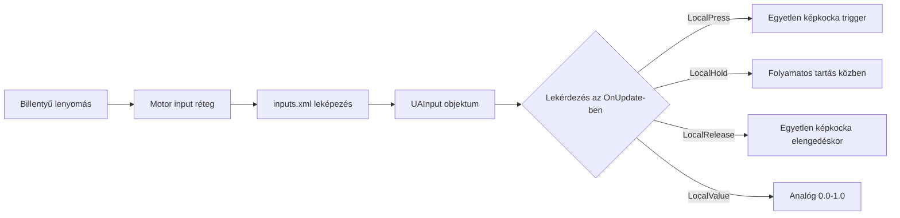

# 6.13. fejezet: Input rendszer

[Kezdőlap](../../README.md) | [<< Előző: Akció rendszer](12-action-system.md) | **Input rendszer** | [Következő: Játékos rendszer >>](14-player-system.md)

---

## Bevezetés

A DayZ input rendszer hardveres bemeneteket --- billentyűzet, egér és gamepad --- köt össze nevesített akciókkal, amelyeket a szkriptek lekérdezhetnek. Két rétegben működik:

1. **inputs.xml** (konfigurációs réteg) --- nevesített akciókat deklarál, alapértelmezett billentyűkötéseket rendel hozzájuk, és csoportokba szervezi őket a játékos Vezérlők beállítások menüjéhez. Részletes leírásért lásd az [5.2. fejezetet: inputs.xml](../05-config-files/02-inputs-xml.md).

2. **UAInput API** (szkript réteg) --- futásidőben kérdezi le a bemenet állapotát. Ezt hívják meg a szkriptjeid minden képkockában a lenyomások, elengedések, nyomvatartások és analóg értékek érzékeléséhez.

Ez a fejezet a szkript réteget tárgyalja: az osztályokat, metódusokat és mintákat, amelyeket a bemenetek olvasásához és vezérléséhez használsz az Enforce Scriptből.

---

## Alaposztályok

Az input rendszer három fő osztályra épül:

```
UAInputAPI         Globális singleton (GetUApi()-n keresztül érhető el)
├── UAInput        Egyetlen nevesített input akciót képvisel
└── Input          Alacsonyabb szintű input hozzáférés (GetGame().GetInput()-on keresztül érhető el)
```

| Osztály | Forrásfájl | Cél |
|-------|-----------|---------|
| `UAInputAPI` | `3_Game/inputapi/uainput.c` | Globális input menedzser. Inputokat kér le név/ID alapján, kezeli a kizárásokat, előbeállításokat és háttérvilágítást. |
| `UAInput` | `3_Game/inputapi/uainput.c` | Egyetlen input akció. Állapotkérdezéseket (lenyomás, tartás, elengedés) és vezérlést (letiltás, elnyomás, zárolás) biztosít. |
| `Input` | `3_Game/tools/input.c` | Motor szintű input osztály. Szöveg-alapú állapotkérdezések, eszközkezelés, játékfókusz vezérlés. |
| `InputUtils` | `3_Game/tools/inpututils.c` | Statikus segédosztály. Gombnév/ikon feloldás UI megjelenítéshez. |

---

## Az Input API elérése

### UAInputAPI (ajánlott)

Az inputok elérésének elsődleges módja. A `GetUApi()` egy globális függvény, amely a `UAInputAPI` singletont adja vissza:

```c
// A globális input API lekérése
UAInputAPI inputAPI = GetUApi();

// Adott input akció lekérése név alapján (ahogy az inputs.xml-ben definiálva van)
UAInput input = inputAPI.GetInputByName("UAMyAction");

// Adott input akció lekérése numerikus ID alapján
UAInput input = inputAPI.GetInputByID(someID);
```

### Input osztály (alternatíva)

Az `Input` osztály szöveg-alapú állapotkérdezéseket biztosít közvetlenül, anélkül, hogy előbb `UAInput` referenciára lenne szükség:

```c
// Az Input példány lekérése
Input input = GetGame().GetInput();

// Kérdezés akciónév szöveggel
if (input.LocalPress("UAMyAction", false))
{
    // A billentyű éppen le lett nyomva
}
```

A `bool check_focus` paraméter (második argumentum) azt vezérli, hogy az ellenőrzés figyelembe veszi-e a játék fókuszát. `true` (alapértelmezett) esetén false-t ad vissza, ha a játék ablaka nem fókuszált. `false` esetén mindig a nyers input állapotot adja vissza.

### Mikor melyiket használd

- **`GetUApi().GetInputByName()`** --- Használd, amikor ugyanazt az inputot többször kell lekérdezned, elnyomnod/letiltanod, vagy meg kell vizsgálnod a kötéseit. Egy `UAInput` objektumot kapsz, amelyet újra felhasználhatsz.
- **`GetGame().GetInput().LocalPress()`** --- Használd egyszeri ellenőrzésekhez, ahol nem kell manipulálnod magát az inputot. Egyszerűbb szintaxis, de ismételt lekérdezéseknél kicsit kevésbé hatékony.

---

## Input állapot olvasása --- UAInput metódusok

Miután van egy `UAInput` referenciád, ezek a metódusok kérdezik le az aktuális állapotát:

```c
UAInput input = GetUApi().GetInputByName("UAMyAction");

// Képkocka-pontos ellenőrzések
bool justPressed   = input.LocalPress();        // True az ELSŐ képkockán, amikor a gomb lenyomódik
bool justReleased  = input.LocalRelease();       // True az ELSŐ képkockán, amikor a gomb felenged
bool holdStarted   = input.LocalHoldBegin();     // True az első képkockán, amikor a tartási küszöb elérésekor
bool isHeld        = input.LocalHold();          // True MINDEN képkockán, amíg a gomb a küszöbön túl tartva van
bool clicked       = input.LocalClick();         // True nyomás-és-elengedés esetén a tartási küszöb előtt
bool doubleClicked = input.LocalDoubleClick();   // True dupla koppintás érzékelésekor

// Analóg érték
float value = input.LocalValue();                // 0.0 vagy 1.0 digitálisnál; 0.0-1.0 analóg tengelyeknél
```

---

## Input állapot olvasása --- Input osztály metódusok

Az `Input` osztály (a `GetGame().GetInput()`-ból) egyenértékű szöveg-alapú metódusokat kínál:

```c
Input input = GetGame().GetInput();

bool pressed  = input.LocalPress("UAMyAction", false);
bool released = input.LocalRelease("UAMyAction", false);
bool held     = input.LocalHold("UAMyAction", false);
bool dblClick = input.LocalDbl("UAMyAction", false);
float value   = input.LocalValue("UAMyAction", false);
```

Figyelj a kis elnevezési különbségre: `LocalDoubleClick()` az `UAInput`-on vs `LocalDbl()` az `Input`-on.

Mindkét osztály `_ID` variánsokat is biztosít, amelyek egész szám akció ID-kat fogadnak szövegek helyett (pl. `LocalPress_ID(int action)`).

---

## Input lekérdezés metódusok referencia

### UAInput metódusok

| Metódus | Visszatérés | Mikor true | Használati eset |
|--------|---------|-----------|----------|
| `LocalPress()` | `bool` | Az első képkockán, amikor a gomb lenyomódik | Kapcsoló akciók, egyszeri triggerek |
| `LocalRelease()` | `bool` | Az első képkockán, amikor a gomb felenged | Folyamatos akciók befejezése |
| `LocalClick()` | `bool` | Gomb lenyomva és elengedve a tartási időzítő előtt | Gyors koppintás érzékelés |
| `LocalHoldBegin()` | `bool` | Az első képkockán, amikor a tartási küszöb elérésekor | Tartás-alapú akciók indítása |
| `LocalHold()` | `bool` | Minden képkockán, amíg a küszöbön túl tartva van | Folyamatos tartási akciók |
| `LocalDoubleClick()` | `bool` | Dupla koppintás érzékelésekor | Speciális/alternatív akciók |
| `LocalValue()` | `float` | Mindig (aktuális értéket adja vissza) | Egér tengelyek, gamepad triggerek, analóg input |

### Input osztály metódusok

| Metódus | Visszatérés | Szignatúra | Egyenértékű UAInput metódus |
|--------|---------|-----------|--------------------------|
| `LocalPress()` | `bool` | `LocalPress(string action, bool check_focus = true)` | `UAInput.LocalPress()` |
| `LocalRelease()` | `bool` | `LocalRelease(string action, bool check_focus = true)` | `UAInput.LocalRelease()` |
| `LocalHold()` | `bool` | `LocalHold(string action, bool check_focus = true)` | `UAInput.LocalHold()` |
| `LocalDbl()` | `bool` | `LocalDbl(string action, bool check_focus = true)` | `UAInput.LocalDoubleClick()` |
| `LocalValue()` | `float` | `LocalValue(string action, bool check_focus = true)` | `UAInput.LocalValue()` |

### Fontos időzítési megjegyzések

- A **`LocalPress()`** pontosan **egy képkockán** aktiválódik --- azon a képkockán, amikor a gomb fentről lentre vált. Ha bármely más képkockán ellenőrzöd, false-t ad vissza.
- A **`LocalClick()`** akkor aktiválódik, amikor a gombot lenyomják és gyorsan elengedik (a tartási időzítő aktiválása előtt). NEM ugyanaz, mint a `LocalPress()`. Használd a `LocalPress()`-t az azonnali gomb-lenyomás érzékeléshez.
- A **`LocalHold()`** NEM aktiválódik azonnal. Megvárja, amíg a motor tartási küszöbe elérésekor. Használd a `LocalPress()`-t, ha azonnali választ szeretnél.
- A **`LocalHoldBegin()`** egyszer aktiválódik, amikor a tartási küszöb először elérésekor. A `LocalHold()` ezután minden további képkockán aktiválódik.

---

## Inputok ellenőrzése az OnUpdate-ben

Az egyéni inputok lekérdezésének standard mintája a `MissionGameplay.OnUpdate()`-en belül van:

```c
modded class MissionGameplay
{
    override void OnUpdate(float timeslice)
    {
        super.OnUpdate(timeslice);

        // Védelem: élő játékos szükséges
        PlayerBase player = PlayerBase.Cast(GetGame().GetPlayer());
        if (!player)
            return;

        // Védelem: nincs input, amíg menü nyitva van
        if (GetGame().GetUIManager().GetMenu())
            return;

        UAInput myInput = GetUApi().GetInputByName("UAMyModOpenMenu");
        if (myInput && myInput.LocalPress())
        {
            OpenMyModMenu();
        }
    }
}
```

### Az Input osztály használata helyette

```c
modded class MissionGameplay
{
    override void OnUpdate(float timeslice)
    {
        super.OnUpdate(timeslice);

        Input input = GetGame().GetInput();

        if (input.LocalPress("UAMyModOpenMenu", false))
        {
            OpenMyModMenu();
        }
    }
}
```

### Hol máshol ellenőrizheted az inputokat?

Az inputokat technikailag bármely képkockánkénti callbackben ellenőrizni lehet, de a `MissionGameplay.OnUpdate()` a kanonikus helyszín. Egyéb érvényes helyek:

- `PlayerBase.CommandHandler()` --- minden képkockán fut a helyi játékos számára
- `ScriptedWidgetEventHandler.Update()` --- UI-specifikus inputhoz (de előnyben részesítsd a widget eseménykezelőket)
- `PluginBase.OnUpdate()` --- plugin hatókörű inputhoz

Kerüld az inputok ellenőrzését szerver oldali kódban, entitás konstruktorokban vagy egyszeri eseménykezelőkben, ahol a képkocka időzítés nem garantált.

---

## Alternatíva: OnKeyPress és OnKeyRelease

Egyszerű beégetett billentyűérzékeléshez a `MissionBase` biztosítja az `OnKeyPress()` és `OnKeyRelease()` callbackeket:

```c
modded class MissionGameplay
{
    override void OnKeyPress(int key)
    {
        super.OnKeyPress(key);

        if (key == KeyCode.KC_F5)
        {
            // F5 le lett nyomva --- nem átköthető!
            ToggleDebugOverlay();
        }
    }

    override void OnKeyRelease(int key)
    {
        super.OnKeyRelease(key);

        if (key == KeyCode.KC_F5)
        {
            // F5 felengedve
        }
    }
}
```

### UAInput vs OnKeyPress: Mikor melyiket használd

| Jellemző | UAInput (GetUApi) | OnKeyPress |
|---------|-------------------|------------|
| A játékos átkötheti | Igen | Nem |
| Módosítókat támogat | Igen (Ctrl+billentyű kombók inputs.xml-en keresztül) | Kézi ellenőrzés szükséges |
| Gamepad támogatás | Igen | Nem |
| Megjelenik a Vezérlők menüben | Igen | Nem |
| Analóg értékek | Igen | Nem |
| Egyszerűség | inputs.xml beállítás szükséges | Csak ellenőrizd a KeyCode-ot |
| Legjobb ehhez | Minden játékos-felé néző akció | Debug eszközök, beégetett fejlesztői gyorsgombok |

**Ökölszabály:** Ha egy játékos valaha is meg fogja nyomni ezt a billentyűt, használd a UAInput-ot inputs.xml-lel. Csak belső debug eszközökhöz vagy prototípus teszteléshez használd az OnKeyPress-t.

---

## KeyCode referencia

A `KeyCode` enum az `1_Core/proto/ensystem.c`-ben van definiálva. Ezeket a konstansokat az `OnKeyPress()`, `OnKeyRelease()`, `KeyState()` és `DisableKey()` metódusokkal használjuk.

### Gyakran használt billentyűk

| Kategória | Konstansok |
|----------|-----------|
| Escape | `KC_ESCAPE` |
| Funkcióbillentyűk | `KC_F1`-től `KC_F12`-ig |
| Számsor | `KC_1`, `KC_2`, `KC_3`, `KC_4`, `KC_5`, `KC_6`, `KC_7`, `KC_8`, `KC_9`, `KC_0` |
| Betűk | `KC_A`-tól `KC_Z`-ig (pl. `KC_Q`, `KC_W`, `KC_E`, `KC_R`, `KC_T`) |
| Módosítók | `KC_LSHIFT`, `KC_RSHIFT`, `KC_LCONTROL`, `KC_RCONTROL`, `KC_LMENU` (bal Alt), `KC_RMENU` (jobb Alt) |
| Navigáció | `KC_UP`, `KC_DOWN`, `KC_LEFT`, `KC_RIGHT` |
| Szerkesztés | `KC_SPACE`, `KC_RETURN`, `KC_TAB`, `KC_BACK` (Backspace), `KC_DELETE`, `KC_INSERT` |
| Lapozás | `KC_HOME`, `KC_END`, `KC_PRIOR` (Page Up), `KC_NEXT` (Page Down) |
| Numpad | `KC_NUMPAD0`-tól `KC_NUMPAD9`-ig, `KC_NUMPADENTER`, `KC_ADD`, `KC_SUBTRACT`, `KC_MULTIPLY`, `KC_DIVIDE`, `KC_DECIMAL` |
| Zárolások | `KC_CAPITAL` (Caps Lock), `KC_NUMLOCK`, `KC_SCROLL` (Scroll Lock) |
| Írásjelek | `KC_MINUS`, `KC_EQUALS`, `KC_LBRACKET`, `KC_RBRACKET`, `KC_SEMICOLON`, `KC_APOSTROPHE`, `KC_GRAVE`, `KC_BACKSLASH`, `KC_COMMA`, `KC_PERIOD`, `KC_SLASH` |

### MouseState enum

Nyers egérgomb állapot ellenőrzéshez (nem a UAInput rendszeren keresztül):

```c
enum MouseState
{
    LEFT,
    RIGHT,
    MIDDLE,
    X,        // Vízszintes tengely
    Y,        // Függőleges tengely
    WHEEL     // Görgetőkerék
};

// Használat:
int state = GetMouseState(MouseState.LEFT);
// A 15. bit (MB_PRESSED_MASK) be van állítva lenyomáskor
```

### Alacsony szintű billentyűállapot

```c
// Nyers billentyűállapot ellenőrzése (bitmaszk, 15. bit = jelenleg lenyomva)
int state = KeyState(KeyCode.KC_LSHIFT);

// Billentyűállapot törlése (megakadályozza az automatikus ismétlést a következő fizikai lenyomásig)
ClearKey(KeyCode.KC_RETURN);

// Billentyű letiltása az aktuális képkocka hátralévő részére
GetGame().GetInput().DisableKey(KeyCode.KC_RETURN);
```

---

## Inputok elnyomása és letiltása

### Elnyomás (inputonként, egy képkocka)

Megakadályozza, hogy az input a következő képkockán aktiválódjon. Hasznos átmenetek során (menü bezárása), hogy megakadályozza az egy képkockás input átszivárgást:

```c
UAInput input = GetUApi().GetInputByName("UAMyAction");
input.Supress();  // Megjegyzés: egy 's' a metódus nevében
```

### Összes input elnyomása (globális, egy képkocka)

Elnyomja az ÖSSZES inputot a következő képkockára. Hívd meg, amikor menüket hagysz el vagy input kontextusok között váltasz:

```c
GetUApi().SupressNextFrame(true);
```

Ezt általában a vanilla használja, amikor bezárja a főmenüt, hogy megakadályozza, hogy az Escape billentyű azonnal újra megnyisson valamit.

### ForceDisable (inputonként, tartós)

Teljesen letiltja az adott inputot az újra engedélyezésig. Az input nem vált ki semmilyen eseményt, amíg le van tiltva:

```c
// Letiltás, amíg a menü nyitva van
GetUApi().GetInputByName("UAMyAction").ForceDisable(true);

// Újra engedélyezés, amikor a menü bezárul
GetUApi().GetInputByName("UAMyAction").ForceDisable(false);
```

### Lock / Unlock (inputonként, tartós)

Hasonló a ForceDisable-hoz, de más mechanizmust használ. Légy óvatos --- ha több rendszer zárolja/feloldja ugyanazt az inputot, zavarhatják egymást:

```c
UAInput input = GetUApi().GetInputByName("UAMyAction");
input.Lock();    // Letiltás az Unlock() hívásáig
input.Unlock();  // Újra engedélyezés

bool locked = input.IsLocked();  // Állapot ellenőrzése
```

A motor dokumentációja a legtöbb esetben kizárási csoportok használatát javasolja Lock/Unlock helyett.

### Összes input letiltása (tömeges)

Teljes képernyős UI megnyitásakor tiltsd le az összes játék inputot, kivéve amiket a UI-od igényel. Ez a COT és az Expansion által használt minta:

```c
void DisableAllInputs(bool state)
{
    TIntArray inputIDs = new TIntArray;
    GetUApi().GetActiveInputs(inputIDs);

    // Aktívan tartandó inputok, még akkor is, amikor UI nyitva van
    TIntArray skipIDs = new TIntArray;
    skipIDs.Insert(GetUApi().GetInputByName("UAUIBack").ID());

    foreach (int inputID : inputIDs)
    {
        if (skipIDs.Find(inputID) == -1)
        {
            GetUApi().GetInputByID(inputID).ForceDisable(state);
        }
    }

    GetUApi().UpdateControls();
}
```

**Fontos:** Mindig hívd meg a `GetUApi().UpdateControls()`-t az input állapotok tömeges módosítása után.

### Input kizárási csoportok

A mission rendszer nevesített kizárási csoportokat biztosít, amelyek a motor `specific.xml`-jében vannak definiálva. Aktiváláskor inputkategóriákat tiltanak le:

```c
// Játékmenet inputok elnyomása, amíg menü nyitva van
GetGame().GetMission().AddActiveInputExcludes({"menu"});

// Inputok visszaállítása bezáráskor
GetGame().GetMission().RemoveActiveInputExcludes({"menu"}, true);
```

Metódus szignatúrák a `Mission` osztályon:

```c
void AddActiveInputExcludes(array<string> excludes);
void RemoveActiveInputExcludes(array<string> excludes, bool bForceSupress = false);
void EnableAllInputs(bool bForceSupress = false);
bool IsInputExcludeActive(string exclude);
```

A `bForceSupress` paraméter a `RemoveActiveInputExcludes`-on belül `SupressNextFrame`-et hív, hogy megakadályozza az input átszivárgást az újra engedélyezéskor.

Az Expansion saját egyéni kizárási csoportot használ, amelyet a motornál regisztrált:

```c
GetUApi().ActivateExclude("menuexpansion");
GetUApi().UpdateControls();
```

---

## Az inputs.xml és a szkript összekapcsolása

Az XML konfigurációs réteg és a szkript réteg közötti kapcsolat az **akciónév szöveg**.



### A folyamat

```
inputs.xml                              Szkript
──────────────                          ──────────────────────────────
<input name="UAMyModOpenMenu" />   -->  GetUApi().GetInputByName("UAMyModOpenMenu")
       │                                         │
       │  A motor indításkor betölti             │  UAInput objektumot ad vissza
       │  Regisztrálja a UAInputAPI-ban          │  az XML-ből kötött billentyűkkel
       ▼                                         ▼
A játékos látja a Beállítások > Vezérlők-   input.LocalPress() true-t ad vissza,
ben és átkötheti a billentyűt               amikor a játékos megnyomja a kötött billentyűt
```

1. Indításkor a motor beolvassa az összes `inputs.xml` fájlt a betöltött modokból
2. Minden `<input name="...">` `UAInput`-ként regisztrálódik a globális `UAInputAPI`-ban
3. A `<preset>`-ből származó alapértelmezett billentyűkötések alkalmazódnak (hacsak a játékos nem módosította őket)
4. A szkriptben a `GetUApi().GetInputByName("UAMyModOpenMenu")` lekéri a regisztrált inputot
5. A `LocalPress()` stb. hívása ellenőrzi a játékos által kötött billentyűt

A név szövegnek **pontosan** egyeznie kell (kis-nagybetű érzékeny) az XML és a szkript hívás között.

A teljes inputs.xml szintaxisért lásd az [5.2. fejezetet: inputs.xml](../05-config-files/02-inputs-xml.md).

### Futásidejű regisztráció (haladó)

Az inputok futásidőben is regisztrálhatók szkriptből, inputs.xml fájl nélkül:

```c
// Új csoport regisztrálása
GetUApi().RegisterGroup("mymod", "My Mod");

// Új input regisztrálása a csoportban
UAInput input = GetUApi().RegisterInput("UAMyModAction", "STR_MYMOD_ACTION", "mymod");

// Később, ha szükséges:
GetUApi().DeRegisterInput("UAMyModAction");
GetUApi().DeRegisterGroup("mymod");
```

Ez ritkán használt. Az inputs.xml megközelítés az előnyös, mert megfelelően integrálódik a Vezérlők beállítások menüvel és az előbeállítási rendszerrel.

---

## Gyakori minták

### Panel megnyitás/bezárás kapcsoló

```c
modded class MissionGameplay
{
    protected bool m_MyPanelOpen;

    override void OnUpdate(float timeslice)
    {
        super.OnUpdate(timeslice);

        if (!GetGame().GetPlayer())
            return;

        UAInput input = GetUApi().GetInputByName("UAMyModPanel");
        if (input && input.LocalPress())
        {
            if (m_MyPanelOpen)
                CloseMyPanel();
            else
                OpenMyPanel();
        }
    }

    void OpenMyPanel()
    {
        m_MyPanelOpen = true;
        // UI megjelenítése...

        // Játékmenet inputok letiltása, amíg a panel nyitva van
        GetGame().GetMission().AddActiveInputExcludes({"menu"});
    }

    void CloseMyPanel()
    {
        m_MyPanelOpen = false;
        // UI elrejtése...

        // Játékmenet inputok visszaállítása
        GetGame().GetMission().RemoveActiveInputExcludes({"menu"}, true);
    }
}
```

### Tartás az aktiváláshoz, elengedés a deaktiváláshoz

```c
override void OnUpdate(float timeslice)
{
    super.OnUpdate(timeslice);

    Input input = GetGame().GetInput();

    if (input.LocalPress("UAMyModSprint", false))
    {
        StartSprinting();
    }

    if (input.LocalRelease("UAMyModSprint", false))
    {
        StopSprinting();
    }
}
```

### Módosító + billentyű kombó ellenőrzés

Ha Ctrl+billentyű kombót definiáltál az inputs.xml-ben, a UAInput rendszer automatikusan kezeli. De ha manuálisan kell ellenőrizned a módosító állapotot egy UAInput mellett:

```c
override void OnUpdate(float timeslice)
{
    super.OnUpdate(timeslice);

    UAInput input = GetUApi().GetInputByName("UAMyModAction");
    if (input && input.LocalPress())
    {
        // Ellenőrizd, hogy a Shift lenyomva van-e nyers KeyState-en keresztül
        bool shiftHeld = (KeyState(KeyCode.KC_LSHIFT) != 0);

        if (shiftHeld)
            PerformAlternateAction();
        else
            PerformNormalAction();
    }
}
```

### Input elnyomása, amikor a UI felhasználja

Amikor a UI-od kezel egy billentyű lenyomást, nyomd el az alatta lévő játék akciót, hogy megakadályozd mindkettő aktiválódását:

```c
class MyMenuHandler extends ScriptedWidgetEventHandler
{
    override bool OnClick(Widget w, int x, int y, int button)
    {
        if (w == m_ConfirmButton)
        {
            DoConfirm();

            // A játék input elnyomása, amely megoszthatja ezt a billentyűt
            GetUApi().GetInputByName("UAFire").Supress();
            return true;
        }
        return false;
    }
}
```

### Kötött billentyű megjelenítési nevének lekérése

Annak megjelenítéséhez, hogy a játékos milyen billentyűt kötött egy akcióhoz (UI felszólításokhoz):

```c
UAInput input = GetUApi().GetInputByName("UAMyModAction");
string keyName = InputUtils.GetButtonNameFromInput("UAMyModAction", EUAINPUT_DEVICE_KEYBOARDMOUSE);
// Lokalizált billentyűnevet ad vissza, mint "F5", "Left Ctrl" stb.
```

Kontroller ikonokhoz és rich-text formázáshoz:

```c
string richText = InputUtils.GetRichtextButtonIconFromInputAction(
    "UAMyModAction",
    "Open Menu",
    EUAINPUT_DEVICE_CONTROLLER
);
// Kép taget + címkét ad vissza UI megjelenítéshez
```

---

## Játékfókusz

Az `Input` osztály játékfókusz-kezelést biztosít, amely azt vezérli, hogy az inputok feldolgozódnak-e, amikor a játék ablaka nem fókuszált:

```c
Input input = GetGame().GetInput();

// Hozzáadás a fókuszszámlálóhoz (pozitív = fókusz nélküli, inputok elnyomva)
input.ChangeGameFocus(1);

// Eltávolítás a fókuszszámlálóból
input.ChangeGameFocus(-1);

// Fókuszszámláló visszaállítása 0-ra (teljes fókusz)
input.ResetGameFocus();

// Ellenőrizd, hogy a játéknak jelenleg van-e fókusza (számláló == 0)
bool hasFocus = input.HasGameFocus();
```

Ez egy referenciaszámolt rendszer. Több rendszer is kérhet fókuszváltozást, és az inputok csak akkor folytatódnak, amikor mindegyik elengedte.

---

## Gyakori hibák

### Input lekérdezés a szerveren

Az inputok **csak kliensnek** szólnak. A szervernek nincs fogalma a billentyűzet, egér vagy gamepad állapotáról. Ha a `GetUApi().GetInputByName()`-t hívod a szerveren, az eredmény értelmetlen.

```c
// HIBÁS --- ez a szerveren fut, itt nem léteznek inputok
modded class MissionServer
{
    override void OnUpdate(float timeslice)
    {
        super.OnUpdate(timeslice);
        UAInput input = GetUApi().GetInputByName("UAMyAction");
        if (input.LocalPress())  // A szerveren mindig false!
        {
            DoSomething();
        }
    }
}

// HELYES --- ellenőrizd az inputot a kliensen, küldj RPC-t a szervernek
modded class MissionGameplay  // Kliens oldali mission osztály
{
    override void OnUpdate(float timeslice)
    {
        super.OnUpdate(timeslice);
        UAInput input = GetUApi().GetInputByName("UAMyAction");
        if (input && input.LocalPress())
        {
            // RPC küldése a szervernek a művelet végrehajtásához
            GetGame().RPCSingleParam(null, MY_RPC_ID, null, true);
        }
    }
}
```

### OnKeyPress használata játékos-felé néző akciókhoz

```c
// HIBÁS --- beégetett billentyű, a játékos nem tudja átkötn
override void OnKeyPress(int key)
{
    super.OnKeyPress(key);
    if (key == KeyCode.KC_Y)
        OpenMyMenu();
}

// HELYES --- inputs.xml-t használ, a játékos átkötheti a Beállításokban
override void OnUpdate(float timeslice)
{
    super.OnUpdate(timeslice);
    UAInput input = GetUApi().GetInputByName("UAMyModOpenMenu");
    if (input && input.LocalPress())
        OpenMyMenu();
}
```

### Input elnyomás hiánya, amikor UI nyitva van

Amikor a modod megnyit egy UI panelt, a játékos WASD billentyűi továbbra is mozgatják a karaktert, az egér továbbra is céloz, és a kattintás tüzel --- hacsak nem tiltod le a játék inputokat:

```c
// HIBÁS --- a karakter sétálgat a menü mögött
void OpenMenu()
{
    m_MenuWidget.Show(true);
}

// HELYES --- mozgás letiltása, amíg a menü nyitva van
void OpenMenu()
{
    m_MenuWidget.Show(true);
    GetGame().GetMission().AddActiveInputExcludes({"menu"});
    GetGame().GetUIManager().ShowCursor(true);
}

void CloseMenu()
{
    m_MenuWidget.Show(false);
    GetGame().GetMission().RemoveActiveInputExcludes({"menu"}, true);
    GetGame().GetUIManager().ShowCursor(false);
}
```

### Annak elfelejtése, hogy a LocalPress csak EGY képkockán aktiválódik

A `LocalPress()` pontosan egy képkockán ad vissza `true`-t --- azon a képkockán, amikor a billentyű felengedettből lenyomottra vált. Ha a kódútvonalad nem fut le pontosan azon a képkockán, elszalasztod az eseményt.

```c
// HIBÁS --- ha a DoExpensiveCheck() időt vesz igénybe vagy képkockákat ugrik, elszalasztod a lenyomást
void SomeCallback()
{
    if (GetUApi().GetInputByName("UAMyAction").LocalPress())
    {
        // Ez soha nem aktiválódhat, ha a SomeCallback nem hívódik meg minden képkockán
    }
}

// HELYES --- mindig képkockánkénti callbackben ellenőrizd
override void OnUpdate(float timeslice)
{
    super.OnUpdate(timeslice);
    if (GetUApi().GetInputByName("UAMyAction").LocalPress())
    {
        DoAction();
    }
}
```

### A LocalClick és LocalPress összetévesztése

A `LocalClick()` NEM ugyanaz, mint a `LocalPress()`. A `LocalClick()` akkor aktiválódik, amikor egy billentyűt lenyomnak ÉS gyorsan elengednek (a tartási küszöb előtt). A `LocalPress()` azonnal aktiválódik a gomb lenyomásakor. A legtöbb mod a `LocalPress()`-t akarja.

```c
// Nem feltétlenül aktiválódik, ha a játékos túl sokáig tartja a billentyűt
if (input.LocalClick())  // Gyors koppintást igényel

// Azonnal aktiválódik a gomb lenyomásakor, a tartás időtartamától függetlenül
if (input.LocalPress())  // Általában ezt akarod
```

### Az UpdateControls elfelejtése tömeges változtatások után

Amikor több inputon `ForceDisable()`-t hívogatsz, meg kell hívnod az `UpdateControls()`-t, hogy a változások érvénybe lépjenek:

```c
// HIBÁS --- a változások nem feltétlenül lépnek azonnal érvénybe
GetUApi().GetInputByName("UAFire").ForceDisable(true);
GetUApi().GetInputByName("UAMoveForward").ForceDisable(true);

// HELYES --- változások érvényesítése
GetUApi().GetInputByName("UAFire").ForceDisable(true);
GetUApi().GetInputByName("UAMoveForward").ForceDisable(true);
GetUApi().UpdateControls();
```

### A Supress elírása

A motor metódusa `Supress()` egy 's'-sel (nem `Suppress`). A globális metódus `SupressNextFrame()` szintén egy 's'-t használ. Ez a motor API furcsasága:

```c
// HIBÁS --- nem fordul le
input.Suppress();

// HELYES --- egy 's'
input.Supress();
GetUApi().SupressNextFrame(true);
```

---

## Gyors referencia

```c
// === Inputok lekérése ===
UAInputAPI api = GetUApi();
UAInput input = api.GetInputByName("UAMyAction");
Input rawInput = GetGame().GetInput();

// === Állapotkérdezések (UAInput) ===
input.LocalPress()        // Billentyű éppen lenyomva (egy képkocka)
input.LocalRelease()      // Billentyű éppen felengedve (egy képkocka)
input.LocalClick()        // Gyors koppintás érzékelve
input.LocalHoldBegin()    // Tartási küszöb éppen elérve (egy képkocka)
input.LocalHold()         // Küszöbön túl tartva (minden képkocka)
input.LocalDoubleClick()  // Dupla koppintás érzékelve
input.LocalValue()        // Analóg érték (float)

// === Állapotkérdezések (Input, szöveg-alapú) ===
rawInput.LocalPress("UAMyAction", false)
rawInput.LocalRelease("UAMyAction", false)
rawInput.LocalHold("UAMyAction", false)
rawInput.LocalDbl("UAMyAction", false)
rawInput.LocalValue("UAMyAction", false)

// === Elnyomás ===
input.Supress()                    // Ez az input, következő képkocka
api.SupressNextFrame(true)         // Összes input, következő képkocka

// === Letiltás ===
input.ForceDisable(true)           // Tartós letiltás
input.ForceDisable(false)          // Újra engedélyezés
input.Lock()                       // Zárolás (használj kizárásokat helyette)
input.Unlock()                     // Feloldás
api.UpdateControls()               // Változások érvényesítése

// === Kizárási csoportok ===
GetGame().GetMission().AddActiveInputExcludes({"menu"});
GetGame().GetMission().RemoveActiveInputExcludes({"menu"}, true);
GetGame().GetMission().EnableAllInputs(true);

// === Nyers billentyűállapot ===
int state = KeyState(KeyCode.KC_LSHIFT);
GetGame().GetInput().DisableKey(KeyCode.KC_RETURN);

// === Megjelenítési segédek ===
string name = InputUtils.GetButtonNameFromInput("UAMyAction", EUAINPUT_DEVICE_KEYBOARDMOUSE);
```

---

*Ez a fejezet a szkript oldali Input System API-t tárgyalja. A billentyűkötéseket regisztráló XML konfigurációért lásd az [5.2. fejezetet: inputs.xml](../05-config-files/02-inputs-xml.md).*

---

## Bevált gyakorlatok

- **Mindig használd a `UAInput`-ot inputs.xml-en keresztül a játékos-felé néző billentyűkötésekhez.** Ez lehetővé teszi a játékosoknak a billentyűk átkötését, megmutatja az akciókat a Vezérlők menüben és támogatja a gamepad inputot. Az `OnKeyPress`-t csak debug gyorsgombokhoz tartsd fenn.
- **Hívd meg az `AddActiveInputExcludes({"menu"})`-t teljes képernyős UI megnyitásakor.** Enélkül a játékos mozgásbillentyűi (WASD), egér célzás és fegyvertüzelés aktívak maradnak a menüd mögött, véletlen műveleteket okozva.
- **Inputokat csak képkockánkénti callbackekben ellenőrizz, mint az `OnUpdate()`.** A `LocalPress()` pontosan egy képkockán ad vissza true-t. Ha olyan eseménykezelőkben vagy callbackekben ellenőrzöd, amelyek nem futnak minden képkockán, billentyűlenyomásokat fogsz elszalasztani.
- **Hívd meg a `GetUApi().UpdateControls()`-t tömeges `ForceDisable()` változtatások után.** E nélkül az érvényesítő hívás nélkül a letiltás/engedélyezés állapotváltozások nem feltétlenül lépnek érvénybe a következő képkockáig, egy képkockás input átszivárgást okozva.
- **Emlékezz, hogy a `Supress()` egy "s"-t használ.** A motor API `Supress()`-nak és `SupressNextFrame()`-nek írja. A helyes angol `Suppress` írásmód nem fordul le.

---

## Kompatibilitás és hatás

- **Multi-Mod:** Az input akciónevek globálisak. Ha két mod ugyanazt az `UAInput` nevet regisztrálja (pl. `"UAOpenMenu"`), ütközni fognak. Mindig előtagozd a mod neveddel: `"UAMyModOpenMenu"`. Az input kizárási csoportok megosztottak --- ha egy mod aktiválja a `"menu"` kizárásokat, az minden modot érint.
- **Teljesítmény:** Az input lekérdezés könnyűsúlyú. A `GetUApi().GetInputByName()` hash keresést végez. Az `UAInput` referencia tagváltozóban való gyorsítótárazása elkerüli az ismételt kereséseket, de nem feltétlenül szükséges a teljesítményhez.
- **Szerver/Kliens:** Az inputok csak a kliensen léteznek. A szervernek nincs billentyűzet, egér vagy gamepad állapota. Mindig a kliensen érzékeld az inputot és küldj RPC-ket a szervernek a mérvadó műveletekhez.
