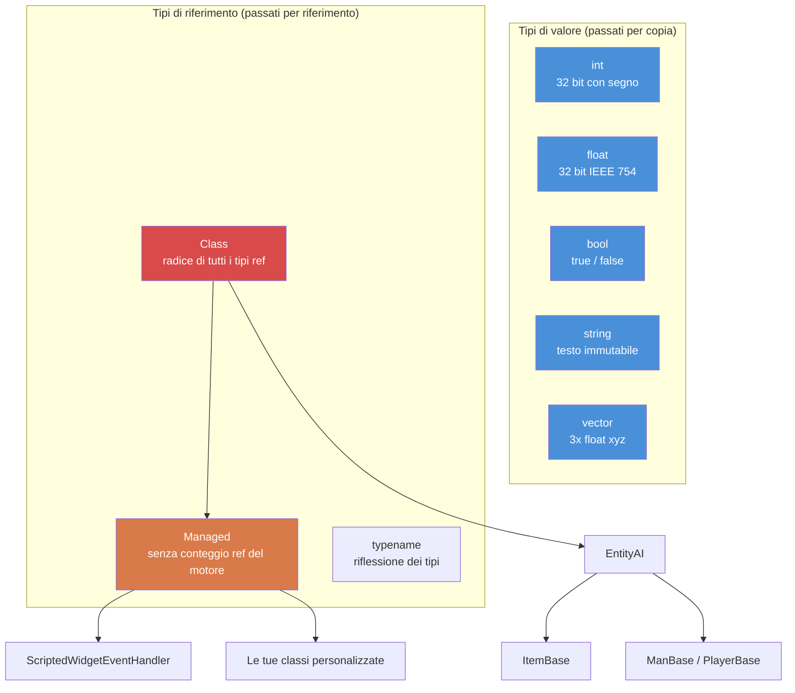

# Capitolo 1.1: Variabili e tipi

[Home](../README.md) | **Variabili e tipi** | [Successivo: Array, mappe e insiemi >>](02-arrays-maps-sets.md)

---

## Introduzione

Enforce Script è il linguaggio di scripting del motore Enfusion, utilizzato da DayZ Standalone. È un linguaggio orientato agli oggetti con sintassi simile al C, per molti aspetti simile al C# ma con un proprio insieme di tipi, regole e limitazioni. Se hai esperienza con C#, Java o C++, ti troverai a tuo agio rapidamente --- ma fai attenzione alle differenze, perché è esattamente dove Enforce Script diverge da questi linguaggi che si nascondono i bug.

Questo capitolo copre i blocchi costruttivi fondamentali: tipi primitivi, come dichiarare e inizializzare le variabili, e come funziona la conversione dei tipi. Ogni riga di codice di un mod DayZ inizia qui.

---

## Tipi primitivi

Enforce Script ha un piccolo insieme fisso di tipi primitivi. Non è possibile definire nuovi tipi di valore --- solo classi (trattate nel [Capitolo 1.3](03-classes-inheritance.md)).

| Tipo | Dimensione | Valore predefinito | Descrizione |
|------|------|---------------|-------------|
| `int` | 32 bit con segno | `0` | Numeri interi da -2.147.483.648 a 2.147.483.647 |
| `float` | 32 bit IEEE 754 | `0.0` | Numeri a virgola mobile |
| `bool` | 1 bit logico | `false` | `true` o `false` |
| `string` | Variabile | `""` (vuoto) | Testo. Tipo di valore immutabile --- passato per valore, non per riferimento |
| `vector` | 3x float | `"0 0 0"` | Float a tre componenti (x, y, z). Passato per valore |
| `typename` | Ref del motore | `null` | Un riferimento al tipo stesso, usato per la riflessione |
| `void` | N/A | N/A | Usato solo come tipo di ritorno per indicare "non restituisce nulla" |

### Diagramma della gerarchia dei tipi



### Costanti di tipo

Diversi tipi espongono costanti utili:

```c
// limiti int
int maxInt = int.MAX;    // 2147483647
int minInt = int.MIN;    // -2147483648

// limiti float
float smallest = float.MIN;     // float positivo più piccolo (~1.175e-38)
float largest  = float.MAX;     // float più grande (~3.403e+38)
float lowest   = float.LOWEST;  // float più negativo (-3.403e+38)
```

---

## Dichiarazione delle variabili

Le variabili si dichiarano scrivendo il tipo seguito dal nome. Puoi dichiarare e assegnare in una singola istruzione o separatamente.

```c
void MyFunction()
{
    // Solo dichiarazione (inizializzata al valore predefinito)
    int health;          // health == 0
    float speed;         // speed == 0.0
    bool isAlive;        // isAlive == false
    string name;         // name == ""

    // Dichiarazione con inizializzazione
    int maxPlayers = 60;
    float gravity = 9.81;
    bool debugMode = true;
    string serverName = "My DayZ Server";
}
```

### La parola chiave `auto`

Quando il tipo è ovvio dal lato destro dell'espressione, puoi usare `auto` per lasciare che il compilatore lo deduca:

```c
void Example()
{
    auto count = 10;           // int
    auto ratio = 0.75;         // float
    auto label = "Hello";      // string
    auto player = GetGame().GetPlayer();  // DayZPlayer (o qualunque cosa restituisca GetPlayer)
}
```

Questa è puramente una comodità --- il compilatore risolve il tipo in fase di compilazione. Non c'è differenza di prestazioni.

### Costanti

Usa la parola chiave `const` per valori che non dovrebbero mai cambiare dopo l'inizializzazione:

```c
const int MAX_SQUAD_SIZE = 8;
const float SPAWN_RADIUS = 150.0;
const string MOD_PREFIX = "[MyMod]";

void Example()
{
    int a = MAX_SQUAD_SIZE;  // OK: lettura di una costante
    MAX_SQUAD_SIZE = 10;     // ERRORE: impossibile assegnare a una costante
}
```

Le costanti vengono tipicamente dichiarate a livello di file (fuori da qualsiasi funzione) o come membri di classe. Convenzione di denominazione: `UPPER_SNAKE_CASE`.

---

## Lavorare con `int`

I numeri interi sono il tipo più utilizzato. DayZ li usa per conteggi di oggetti, ID dei giocatori, valori di salute (quando discretizzati), valori di enumerazione, flag di bit e altro.

```c
void IntExamples()
{
    int count = 5;
    int total = count + 10;     // 15
    int doubled = count * 2;    // 10
    int remainder = 17 % 5;     // 2 (modulo)

    // Incremento e decremento
    count++;    // count ora è 6
    count--;    // count torna a 5

    // Assegnazione composta
    count += 3;  // count ora è 8
    count -= 2;  // count ora è 6
    count *= 4;  // count ora è 24
    count /= 6;  // count ora è 4

    // La divisione intera tronca (non arrotonda)
    int result = 7 / 2;    // result == 3, non 3.5

    // Operazioni bitwise (usate per flag)
    int flags = 0;
    flags = flags | 0x01;   // imposta bit 0
    flags = flags | 0x04;   // imposta bit 2
    bool hasBit0 = (flags & 0x01) != 0;  // true
}
```

### Esempio reale: Conteggio giocatori

```c
void PrintPlayerCount()
{
    array<Man> players = new array<Man>;
    GetGame().GetPlayers(players);
    int count = players.Count();
    Print(string.Format("Players online: %1", count));
}
```

---

## Lavorare con `float`

I numeri a virgola mobile rappresentano numeri decimali. DayZ li usa ampiamente per posizioni, distanze, percentuali di salute, valori di danno e timer.

```c
void FloatExamples()
{
    float health = 100.0;
    float damage = 25.5;
    float remaining = health - damage;   // 74.5

    // Specifico per DayZ: moltiplicatore di danno
    float headMultiplier = 3.0;
    float actualDamage = damage * headMultiplier;  // 76.5

    // La divisione tra float dà risultati decimali
    float ratio = 7.0 / 2.0;   // 3.5

    // Matematica utile
    float dist = 150.7;
    float rounded = Math.Round(dist);    // 151
    float floored = Math.Floor(dist);    // 150
    float ceiled  = Math.Ceil(dist);     // 151
    float clamped = Math.Clamp(dist, 0.0, 100.0);  // 100
}
```

### Esempio reale: Controllo della distanza

```c
bool IsPlayerNearby(PlayerBase player, vector targetPos, float radius)
{
    if (!player)
        return false;

    vector playerPos = player.GetPosition();
    float distance = vector.Distance(playerPos, targetPos);
    return distance <= radius;
}
```

---

## Lavorare con `bool`

I booleani contengono `true` o `false`. Vengono usati in condizioni, flag e tracciamento dello stato.

```c
void BoolExamples()
{
    bool isAdmin = true;
    bool isBanned = false;

    // Operatori logici
    bool canPlay = isAdmin || !isBanned;    // true (OR, NOT)
    bool isSpecial = isAdmin && !isBanned;  // true (AND)

    // Negazione
    bool notAdmin = !isAdmin;   // false

    // I risultati dei confronti sono bool
    int health = 50;
    bool isLow = health < 25;       // false
    bool isHurt = health < 100;     // true
    bool isDead = health == 0;      // false
    bool isAlive = health != 0;     // true
}
```

### Truthiness nelle condizioni

In Enforce Script, puoi usare valori non-bool nelle condizioni. I seguenti sono considerati `false`:
- `0` (int)
- `0.0` (float)
- `""` (stringa vuota)
- `null` (riferimento a oggetto nullo)

Tutto il resto è `true`. Questo viene comunemente usato per i controlli null:

```c
void SafeCheck(PlayerBase player)
{
    // Queste due scritture sono equivalenti:
    if (player != null)
        Print("Player exists");

    if (player)
        Print("Player exists");

    // E anche queste due:
    if (player == null)
        Print("No player");

    if (!player)
        Print("No player");
}
```

---

## Lavorare con `string`

Le stringhe in Enforce Script sono **tipi di valore** --- vengono copiate quando assegnate o passate a funzioni, proprio come `int` o `float`. Questo è diverso da C# o Java dove le stringhe sono tipi di riferimento.

```c
void StringExamples()
{
    string greeting = "Hello";
    string name = "Survivor";

    // Concatenazione con +
    string message = greeting + ", " + name + "!";  // "Hello, Survivor!"

    // Formattazione delle stringhe (segnaposto indicizzati da 1)
    string formatted = string.Format("Player %1 has %2 health", name, 75);
    // Risultato: "Player Survivor has 75 health"

    // Lunghezza
    int len = message.Length();    // 17

    // Confronto
    bool same = (greeting == "Hello");  // true

    // Conversione da altri tipi
    string fromInt = "Score: " + 42;     // NON funziona -- bisogna convertire esplicitamente
    string correct = "Score: " + 42.ToString();  // "Score: 42"

    // Usare Format è l'approccio preferito
    string best = string.Format("Score: %1", 42);  // "Score: 42"
}
```

### Sequenze di escape

Le stringhe supportano le sequenze di escape standard:

| Sequenza | Significato |
|----------|---------|
| `\n` | A capo |
| `\r` | Ritorno a inizio riga |
| `\t` | Tabulazione |
| `\\` | Barra rovesciata letterale |
| `\"` | Virgolette letterali |

**Attenzione:** Sebbene queste sequenze siano documentate, la barra rovesciata (`\\`) e le virgolette con escape (`\"`) sono note per causare problemi con il CParser in alcuni contesti, specialmente nelle operazioni relative a JSON. Quando lavori con percorsi di file o stringhe JSON, evita le barre rovesciate quando possibile. Usa le barre normali per i percorsi --- DayZ le accetta su tutte le piattaforme.

### Esempio reale: Messaggio in chat

```c
void SendAdminMessage(string adminName, string text)
{
    string msg = string.Format("[ADMIN] %1: %2", adminName, text);
    Print(msg);
}
```

---

## Lavorare con `vector`

Il tipo `vector` contiene tre componenti `float` (x, y, z). È il tipo fondamentale di DayZ per posizioni, direzioni, rotazioni e velocità. Come le stringhe e i tipi primitivi, i vettori sono **tipi di valore** --- vengono copiati all'assegnazione.

### Inizializzazione

I vettori possono essere inizializzati in due modi:

```c
void VectorInit()
{
    // Metodo 1: Inizializzazione con stringa (tre numeri separati da spazi)
    vector pos1 = "100.5 0 200.3";

    // Metodo 2: Funzione costruttore Vector()
    vector pos2 = Vector(100.5, 0, 200.3);

    // Il valore predefinito è "0 0 0"
    vector empty;   // empty == <0, 0, 0>
}
```

**Importante:** Il formato di inizializzazione con stringa usa **spazi** come separatori, non virgole. `"1 2 3"` è valido; `"1,2,3"` no.

### Accesso ai componenti

Si accede ai singoli componenti usando l'indicizzazione in stile array:

```c
void VectorComponents()
{
    vector pos = Vector(100.5, 25.0, 200.3);

    // Lettura dei componenti
    float x = pos[0];   // 100.5  (Est/Ovest)
    float y = pos[1];   // 25.0   (Su/Giù, altitudine)
    float z = pos[2];   // 200.3  (Nord/Sud)

    // Scrittura dei componenti
    pos[1] = 50.0;      // Cambia l'altitudine a 50
}
```

Sistema di coordinate di DayZ:
- `[0]` = X = Est(+) / Ovest(-)
- `[1]` = Y = Su(+) / Giù(-) (altitudine sul livello del mare)
- `[2]` = Z = Nord(+) / Sud(-)

### Costanti statiche

```c
vector zero    = vector.Zero;      // "0 0 0"
vector up      = vector.Up;        // "0 1 0"
vector right   = vector.Aside;     // "1 0 0"
vector forward = vector.Forward;   // "0 0 1"
```

### Operazioni vettoriali comuni

```c
void VectorOps()
{
    vector pos1 = Vector(100, 0, 200);
    vector pos2 = Vector(150, 0, 250);

    // Distanza tra due punti
    float dist = vector.Distance(pos1, pos2);

    // Distanza al quadrato (più veloce, buona per confronti)
    float distSq = vector.DistanceSq(pos1, pos2);

    // Direzione da pos1 a pos2
    vector dir = vector.Direction(pos1, pos2);

    // Normalizzare un vettore (lunghezza = 1)
    vector norm = dir.Normalized();

    // Lunghezza di un vettore
    float len = dir.Length();

    // Interpolazione lineare (50% tra pos1 e pos2)
    vector midpoint = vector.Lerp(pos1, pos2, 0.5);

    // Prodotto scalare
    float dot = vector.Dot(dir, vector.Up);
}
```

### Esempio reale: Posizione di spawn

```c
// Ottieni una posizione al suolo alle coordinate X, Z date
vector GetGroundPosition(float x, float z)
{
    vector pos = Vector(x, 0, z);
    pos[1] = GetGame().SurfaceY(x, z);  // Imposta Y all'altezza del terreno
    return pos;
}

// Ottieni una posizione casuale entro un raggio da un punto centrale
vector GetRandomPositionAround(vector center, float radius)
{
    float angle = Math.RandomFloat(0, Math.PI2);
    float dist = Math.RandomFloat(0, radius);

    vector offset = Vector(Math.Cos(angle) * dist, 0, Math.Sin(angle) * dist);
    vector pos = center + offset;
    pos[1] = GetGame().SurfaceY(pos[0], pos[2]);
    return pos;
}
```

---

## Lavorare con `typename`

Il tipo `typename` contiene un riferimento al tipo stesso. Viene usato per la riflessione --- esaminare e lavorare con i tipi a runtime. Lo incontrerai quando scrivi sistemi generici, caricatori di configurazione e pattern factory.

```c
void TypenameExamples()
{
    // Ottieni il typename di una classe
    typename t = PlayerBase;

    // Ottieni il typename da una stringa
    typename t2 = t.StringToEnum(PlayerBase, "PlayerBase");

    // Confronta tipi
    if (t == PlayerBase)
        Print("It's PlayerBase!");

    // Ottieni il typename di un'istanza di oggetto
    PlayerBase player;
    // ... supponiamo che player sia valido ...
    typename objType = player.Type();

    // Controlla l'ereditarietà
    bool isMan = objType.IsInherited(Man);

    // Converti typename in stringa
    string name = t.ToString();  // "PlayerBase"

    // Crea un'istanza da typename (pattern factory)
    Class instance = t.Spawn();
}
```

### Conversione di enumerazioni con typename

```c
enum DamageType
{
    MELEE = 0,
    BULLET = 1,
    EXPLOSION = 2
};

void EnumConvert()
{
    // Enumerazione a stringa
    string name = typename.EnumToString(DamageType, DamageType.BULLET);
    // name == "BULLET"

    // Stringa a enumerazione
    int value;
    typename.StringToEnum(DamageType, "EXPLOSION", value);
    // value == 2
}
```

---

## La classe Managed

`Managed` è una classe base speciale che **disabilita il conteggio dei riferimenti del motore**. Le classi che estendono `Managed` non sono tracciate dal garbage collector del motore --- la loro durata è gestita interamente dai riferimenti `ref` dello script.

```c
class MyScriptHandler : Managed
{
    // Questa classe non sarà raccolta dal garbage collector del motore
    // Verrà eliminata solo quando l'ultimo ref viene rilasciato
}
```

La maggior parte delle classi solo-script (che non rappresentano entità di gioco) dovrebbe estendere `Managed`. Le classi di entità come `PlayerBase`, `ItemBase` estendono `EntityAI` (che è gestito dal motore, NON `Managed`).

### Quando usare Managed

| Usa `Managed` per... | NON usare `Managed` per... |
|----------------------|-----------------------------|
| Classi di dati di configurazione | Oggetti (`ItemBase`) |
| Manager singleton | Armi (`Weapon_Base`) |
| Controller UI | Veicoli (`CarScript`) |
| Oggetti handler di eventi | Giocatori (`PlayerBase`) |
| Classi helper/utility | Qualsiasi classe che estende `EntityAI` |

Se la tua classe non rappresenta un'entità fisica nel mondo di gioco, dovrebbe quasi certamente estendere `Managed`.

---

## Conversione dei tipi

Enforce Script supporta sia conversioni implicite che esplicite tra tipi.

### Conversioni implicite

Alcune conversioni avvengono automaticamente:

```c
void ImplicitConversions()
{
    // int a float (sempre sicuro, nessuna perdita di dati)
    int count = 42;
    float fCount = count;    // 42.0

    // float a int (TRONCA, non arrotonda!)
    float precise = 3.99;
    int truncated = precise;  // 3, NON 4

    // int/float a bool
    bool fromInt = 5;      // true (non-zero)
    bool fromZero = 0;     // false
    bool fromFloat = 0.1;  // true (non-zero)

    // bool a int
    int fromBool = true;   // 1
    int fromFalse = false; // 0
}
```

### Conversioni esplicite (parsing)

Per convertire tra stringhe e tipi numerici, usa i metodi di parsing:

```c
void ExplicitConversions()
{
    // Stringa a int
    int num = "42".ToInt();           // 42
    int bad = "hello".ToInt();        // 0 (fallisce silenziosamente)

    // Stringa a float
    float f = "3.14".ToFloat();       // 3.14

    // Stringa a vector
    vector v = "100 25 200".ToVector();  // <100, 25, 200>

    // Numero a stringa (usando Format)
    string s1 = string.Format("%1", 42);       // "42"
    string s2 = string.Format("%1", 3.14);     // "3.14"

    // int/float .ToString()
    string s3 = (42).ToString();     // "42"
}
```

### Casting degli oggetti

Per i tipi di classe, usa `Class.CastTo()` o `ClassName.Cast()`. Questo è trattato in dettaglio nel [Capitolo 1.3](03-classes-inheritance.md), ma ecco il pattern essenziale:

```c
void CastExample()
{
    Object obj = GetSomeObject();

    // Cast sicuro (preferito)
    PlayerBase player;
    if (Class.CastTo(player, obj))
    {
        // player è valido e sicuro da usare
        string name = player.GetIdentity().GetName();
    }

    // Sintassi di cast alternativa
    PlayerBase player2 = PlayerBase.Cast(obj);
    if (player2)
    {
        // player2 è valido
    }
}
```

---

## Ambito delle variabili

Le variabili esistono solo all'interno del blocco di codice (parentesi graffe) in cui sono dichiarate. Enforce Script **non** permette di ridichiarare una variabile con lo stesso nome in blocchi annidati o fratelli.

```c
void ScopeExample()
{
    int x = 10;

    if (true)
    {
        // int x = 20;  // ERRORE: ridichiarazione di 'x' in blocco annidato
        x = 20;         // OK: modifica dell'x esterno
        int y = 30;     // OK: nuova variabile in questo blocco
    }

    // y NON è accessibile qui (dichiarata nel blocco interno)
    // Print(y);  // ERRORE: identificatore non dichiarato 'y'

    // IMPORTANTE: questo si applica anche ai cicli for
    for (int i = 0; i < 5; i++)
    {
        // i esiste qui
    }
    // for (int i = 0; i < 3; i++)  // ERRORE in DayZ: 'i' già dichiarato
    // Usa un nome diverso:
    for (int j = 0; j < 3; j++)
    {
        // j esiste qui
    }
}
```

### La trappola dell'ambito fratello

Questa è una delle peculiarità più note di Enforce Script. Dichiarare la stessa variabile nei blocchi `if` e `else` causa un errore di compilazione:

```c
void SiblingTrap()
{
    if (someCondition)
    {
        int result = 10;    // Dichiarata qui
        Print(result);
    }
    else
    {
        // int result = 20; // ERRORE: dichiarazione multipla di 'result'
        // Anche se questo è un blocco fratello, non lo stesso blocco
    }

    // CORREZIONE: dichiara sopra l'if/else
    int result;
    if (someCondition)
    {
        result = 10;
    }
    else
    {
        result = 20;
    }
}
```

---

## Precedenza degli operatori

Dalla precedenza più alta alla più bassa:

| Priorità | Operatore | Descrizione | Associatività |
|----------|----------|-------------|---------------|
| 1 | `()` `[]` `.` | Raggruppamento, accesso array, accesso membro | Da sinistra a destra |
| 2 | `!` `-` (unario) `~` | NOT logico, negazione, NOT bitwise | Da destra a sinistra |
| 3 | `*` `/` `%` | Moltiplicazione, divisione, modulo | Da sinistra a destra |
| 4 | `+` `-` | Addizione, sottrazione | Da sinistra a destra |
| 5 | `<<` `>>` | Shift bitwise | Da sinistra a destra |
| 6 | `<` `<=` `>` `>=` | Relazionali | Da sinistra a destra |
| 7 | `==` `!=` | Uguaglianza | Da sinistra a destra |
| 8 | `&` | AND bitwise | Da sinistra a destra |
| 9 | `^` | XOR bitwise | Da sinistra a destra |
| 10 | `\|` | OR bitwise | Da sinistra a destra |
| 11 | `&&` | AND logico | Da sinistra a destra |
| 12 | `\|\|` | OR logico | Da sinistra a destra |
| 13 | `=` `+=` `-=` `*=` `/=` `%=` `&=` `\|=` `^=` `<<=` `>>=` | Assegnazione | Da destra a sinistra |

> **Suggerimento:** In caso di dubbio, usa le parentesi. Enforce Script segue regole di precedenza simili al C, ma il raggruppamento esplicito previene i bug e migliora la leggibilità.

---

## Buone pratiche

- Inizializza sempre le variabili esplicitamente alla dichiarazione, anche quando il valore predefinito corrisponde alla tua intenzione -- comunica l'intento ai futuri lettori.
- Usa `const` per qualsiasi valore che non dovrebbe mai cambiare; posiziona le costanti a livello di file o di classe con denominazione `UPPER_SNAKE_CASE`.
- Preferisci `string.Format()` alla concatenazione con `+` quando mescoli tipi -- eviti problemi di conversione implicita ed è più facile da leggere.
- Usa `vector.DistanceSq()` invece di `vector.Distance()` quando confronti distanze -- eviti una costosa radice quadrata.
- Non confrontare mai i float con `==`; usa sempre una tolleranza epsilon tramite `Math.AbsFloat(a - b) < 0.001`.

---

## Osservato nei mod reali

> Pattern confermati dallo studio del codice sorgente di mod DayZ professionali.

| Pattern | Mod | Dettaglio |
|---------|-----|--------|
| `const string LOG_PREFIX` a livello di classe | COT / Expansion | Ogni modulo definisce una costante stringa per i prefissi di log per evitare errori di battitura |
| Denominazione membri `m_PascalCase` | VPP / Dabs Framework | Tutte le variabili membro usano il prefisso `m_` in modo coerente, anche per i tipi primitivi |
| `string.Format` per tutto l'output dei log | Expansion Market | Non usa mai la concatenazione `+` con numeri -- sempre segnaposto `%1`..`%9` |
| `vector.Zero` invece del letterale `"0 0 0"` | COT Admin Tools | Usa costanti con nome per la leggibilità e per evitare il sovraccarico del parsing delle stringhe |

---

## Teoria vs. pratica

| Concetto | Teoria | Realtà |
|---------|--------|---------|
| Parola chiave `auto` | Dovrebbe dedurre qualsiasi tipo | Funziona per assegnazioni semplici ma può confondere i lettori -- la maggior parte dei mod dichiara i tipi esplicitamente |
| Troncamento da `float` a `int` | Documentato come "arrotonda verso zero" | Coglie quasi tutti almeno una volta; `3.99` diventa `3`, non `4` |
| `string` è un tipo di valore | Passato per copia come `int` | Sorprende gli sviluppatori C#/Java che si aspettano semantica per riferimento; le modifiche a una copia non influenzano mai l'originale |

---

## Errori comuni

### 1. Variabili non inizializzate usate nella logica

I tipi primitivi ricevono valori predefiniti (`0`, `0.0`, `false`, `""`), ma fare affidamento su questo rende il codice fragile e difficile da leggere. Inizializza sempre esplicitamente.

```c
// MALE: affidarsi allo zero implicito
int count;
if (count > 0)  // Funziona perché count == 0, ma l'intento non è chiaro
    DoThing();

// BENE: inizializzazione esplicita
int count = 0;
if (count > 0)
    DoThing();
```

### 2. Troncamento da float a int

La conversione da float a int tronca (arrotonda verso zero), non arrotonda al più vicino:

```c
float f = 3.99;
int i = f;         // i == 3, NON 4

// Se vuoi arrotondare:
int rounded = Math.Round(f);  // 4
```

### 3. Precisione dei float nei confronti

Non confrontare mai i float per uguaglianza esatta:

```c
float a = 0.1 + 0.2;
// MALE: potrebbe fallire a causa della rappresentazione in virgola mobile
if (a == 0.3)
    Print("Equal");

// BENE: usa una tolleranza (epsilon)
if (Math.AbsFloat(a - 0.3) < 0.001)
    Print("Close enough");
```

### 4. Concatenazione di stringhe con numeri

Non puoi semplicemente concatenare un numero a una stringa con `+`. Usa `string.Format()`:

```c
int kills = 5;
// Potenzialmente problematico:
// string msg = "Kills: " + kills;

// CORRETTO: usa Format
string msg = string.Format("Kills: %1", kills);
```

### 5. Formato stringa dei vettori

L'inizializzazione del vettore con stringa richiede spazi, non virgole:

```c
vector good = "100 25 200";     // CORRETTO
// vector bad = "100, 25, 200"; // SBAGLIATO: le virgole non vengono parsate correttamente
// vector bad2 = "100,25,200";  // SBAGLIATO
```

### 6. Dimenticare che stringhe e vettori sono tipi di valore

A differenza degli oggetti di classe, stringhe e vettori vengono copiati all'assegnazione. Modificare una copia non influenza l'originale:

```c
vector posA = "10 20 30";
vector posB = posA;       // posB è una COPIA
posB[1] = 99;             // Cambia solo posB
// posA è ancora "10 20 30"
```

---

## Esercizi pratici

### Esercizio 1: Basi delle variabili
Dichiara variabili per memorizzare:
- Il nome di un giocatore (string)
- La sua percentuale di salute (float, 0-100)
- Il suo conteggio uccisioni (int)
- Se è un amministratore (bool)
- La sua posizione nel mondo (vector)

Stampa un riepilogo formattato usando `string.Format()`.

### Esercizio 2: Convertitore di temperatura
Scrivi una funzione `float CelsiusToFahrenheit(float celsius)` e la sua inversa `float FahrenheitToCelsius(float fahrenheit)`. Testa con il punto di ebollizione (100C = 212F) e il punto di congelamento (0C = 32F).

### Esercizio 3: Calcolatrice di distanza
Scrivi una funzione che prende due vettori e restituisce:
- La distanza 3D tra di essi
- La distanza 2D (ignorando l'altezza / asse Y)
- La differenza di altezza

Suggerimento: Per la distanza 2D, crea nuovi vettori con `[1]` impostato a `0` prima di calcolare la distanza.

### Esercizio 4: Giocoleria con i tipi
Data la stringa `"42"`, convertila in:
1. Un `int`
2. Un `float`
3. Di nuovo in `string` usando `string.Format()`
4. Un `bool` (dovrebbe essere `true` poiché il valore int è non-zero)

### Esercizio 5: Posizione al suolo
Scrivi una funzione `vector SnapToGround(vector pos)` che prende qualsiasi posizione e la restituisce con il componente Y impostato all'altezza del terreno in quella posizione X, Z. Usa `GetGame().SurfaceY()`.

---

## Riepilogo

| Concetto | Punto chiave |
|---------|-----------|
| Tipi | `int`, `float`, `bool`, `string`, `vector`, `typename`, `void` |
| Valori predefiniti | `0`, `0.0`, `false`, `""`, `"0 0 0"`, `null` |
| Costanti | Parola chiave `const`, convenzione `UPPER_SNAKE_CASE` |
| Vettori | Inizializzazione con stringa `"x y z"` o `Vector(x,y,z)`, accesso con `[0]`, `[1]`, `[2]` |
| Ambito | Variabili limitate ai blocchi `{}`; nessuna ridichiarazione in blocchi annidati/fratelli |
| Conversione | Da `float` a `int` tronca; usa `.ToInt()`, `.ToFloat()`, `.ToVector()` per il parsing delle stringhe |
| Formattazione | Usa sempre `string.Format()` per costruire stringhe da tipi misti |

---

[Home](../README.md) | **Variabili e tipi** | [Successivo: Array, mappe e insiemi >>](02-arrays-maps-sets.md)
