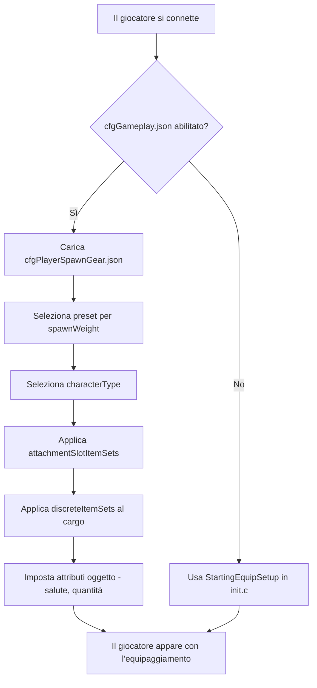

# Capitolo 5.6: Configurazione dell'Equipaggiamento di Spawn

[Home](../../README.md) | [<< Precedente: File di Configurazione del Server](05-server-configs.md) | **Configurazione dell'Equipaggiamento di Spawn**

---

> **Riepilogo:** DayZ ha due sistemi complementari che controllano come i giocatori entrano nel mondo: i **punti di spawn** determinano *dove* un personaggio appare sulla mappa, e l'**equipaggiamento di spawn** determina *quale equipaggiamento* trasporta. Questo capitolo copre entrambi i sistemi in profondità, inclusa la struttura dei file, il riferimento dei campi, i preset pratici e l'integrazione con i mod.

---

## Indice dei Contenuti

- [Panoramica](#panoramica)
- [I Due Sistemi](#i-due-sistemi)
- [Equipaggiamento di Spawn: cfgPlayerSpawnGear.json](#equipaggiamento-di-spawn-cfgplayerspawngearjson)
  - [Abilitare i Preset dell'Equipaggiamento di Spawn](#abilitare-i-preset-dellequipaggiamento-di-spawn)
  - [Struttura del Preset](#struttura-del-preset)
  - [attachmentSlotItemSets](#attachmentslotitemsets)
  - [DiscreteItemSets](#discreteitemsets)
  - [discreteUnsortedItemSets](#discreteunsorteditemsets)
  - [ComplexChildrenTypes](#complexchildrentypes)
  - [SimpleChildrenTypes](#simplechildrentypes)
  - [Attributi](#attributi)
- [Punti di Spawn: cfgplayerspawnpoints.xml](#punti-di-spawn-cfgplayerspawnpointsxml)
  - [Struttura del File](#struttura-del-file)
  - [spawn_params](#spawn_params)
  - [generator_params](#generator_params)
  - [Gruppi di Spawn](#gruppi-di-spawn)
  - [Configurazioni Specifiche per Mappa](#configurazioni-specifiche-per-mappa)
- [Esempi Pratici](#esempi-pratici)
  - [Loadout Sopravvissuto Predefinito](#loadout-sopravvissuto-predefinito)
  - [Kit Spawn Militare](#kit-spawn-militare)
  - [Kit Spawn Medico](#kit-spawn-medico)
  - [Selezione Casuale dell'Equipaggiamento](#selezione-casuale-dellequipaggiamento)
- [Integrazione con i Mod](#integrazione-con-i-mod)
- [Buone Pratiche](#buone-pratiche)
- [Errori Comuni](#errori-comuni)

---

## Panoramica



Quando un giocatore appare come nuovo personaggio in DayZ, due domande vengono risposte dal server:

1. **Dove appare il personaggio?** --- Controllato da `cfgplayerspawnpoints.xml`.
2. **Cosa trasporta il personaggio?** --- Controllato dai file JSON dei preset dell'equipaggiamento di spawn, registrati tramite `cfggameplay.json`.

Entrambi i sistemi sono solo lato server. I client non vedono mai questi file di configurazione e non possono manometterli. Il sistema di equipaggiamento di spawn è stato introdotto come alternativa alla creazione scriptata dei loadout in `init.c`, permettendo agli admin del server di definire più preset pesati in JSON senza scrivere codice Enforce Script.

> **Importante:** Il sistema dei preset dell'equipaggiamento di spawn **sostituisce completamente** il metodo `StartingEquipSetup()` nel tuo `init.c` della missione. Se abiliti i preset dell'equipaggiamento di spawn in `cfggameplay.json`, il tuo codice di loadout scriptato verrà ignorato. Analogamente, i tipi di personaggio definiti nei preset sostituiscono il modello del personaggio scelto nel menu principale.

---

## I Due Sistemi

| Sistema | File | Formato | Controlla |
|---------|------|---------|----------|
| Punti di Spawn | `cfgplayerspawnpoints.xml` | XML | **Dove** --- posizioni sulla mappa, punteggio di distanza, gruppi di spawn |
| Equipaggiamento di Spawn | File JSON preset personalizzati | JSON | **Cosa** --- modello del personaggio, abbigliamento, armi, cargo, quickbar |

I due sistemi sono indipendenti. Puoi usare punti di spawn personalizzati con equipaggiamento vanilla, equipaggiamento personalizzato con punti di spawn vanilla, o personalizzare entrambi.

---

## Equipaggiamento di Spawn: cfgPlayerSpawnGear.json

### Abilitare i Preset dell'Equipaggiamento di Spawn

I preset dell'equipaggiamento di spawn **non** sono abilitati per impostazione predefinita. Per usarli, devi:

1. Creare uno o più file JSON preset nella cartella della missione (es. `mpmissions/dayzOffline.chernarusplus/`).
2. Registrarli in `cfggameplay.json` sotto `PlayerData.spawnGearPresetFiles`.
3. Assicurarti che `enableCfgGameplayFile = 1` sia impostato in `serverDZ.cfg`.

```json
{
  "version": 122,
  "PlayerData": {
    "spawnGearPresetFiles": [
      "survivalist.json",
      "casual.json",
      "military.json"
    ]
  }
}
```

I file preset possono essere annidati in sottodirectory nella cartella della missione:

```json
"spawnGearPresetFiles": [
  "custom/survivalist.json",
  "custom/casual.json",
  "custom/military.json"
]
```

Ogni file JSON contiene un singolo oggetto preset. Tutti i preset registrati vengono raggruppati insieme, e il server ne seleziona uno in base allo `spawnWeight` ogni volta che appare un nuovo personaggio.

### Struttura del Preset

Un preset è l'oggetto JSON di livello superiore con questi campi:

| Campo | Tipo | Descrizione |
|-------|------|-------------|
| `name` | string | Nome leggibile per il preset (qualsiasi stringa, usato solo per identificazione) |
| `spawnWeight` | integer | Peso per la selezione casuale. Il minimo è `1`. Valori più alti rendono questo preset più probabile |
| `characterTypes` | array | Array di classname di tipi personaggio (es. `"SurvivorM_Mirek"`). Uno viene scelto a caso quando questo preset viene generato |
| `attachmentSlotItemSets` | array | Array di strutture `AttachmentSlots` che definiscono cosa indossa il personaggio (abbigliamento, armi sulle spalle, ecc.) |
| `discreteUnsortedItemSets` | array | Array di strutture `DiscreteUnsortedItemSets` che definiscono oggetti cargo posizionati in qualsiasi spazio inventario disponibile |

> **Nota:** Se `characterTypes` è vuoto o omesso, verrà usato il modello del personaggio selezionato per ultimo nella schermata di creazione del personaggio del menu principale.

Esempio minimale:

```json
{
  "spawnWeight": 1,
  "name": "Basic Survivor",
  "characterTypes": [
    "SurvivorM_Mirek",
    "SurvivorF_Eva"
  ],
  "attachmentSlotItemSets": [],
  "discreteUnsortedItemSets": []
}
```

### attachmentSlotItemSets

Questo array definisce oggetti che vanno in slot di attacco specifici del personaggio --- corpo, gambe, piedi, testa, schiena, gilet, spalle, occhiali, ecc.

Ogni voce punta a uno slot:

| Campo | Tipo | Descrizione |
|-------|------|-------------|
| `slotName` | string | Il nome dello slot di attacco. Derivato da CfgSlots. Valori comuni: `"Body"`, `"Legs"`, `"Feet"`, `"Head"`, `"Back"`, `"Vest"`, `"Eyewear"`, `"Gloves"`, `"Hips"`, `"shoulderL"`, `"shoulderR"` |
| `discreteItemSets` | array | Array di varianti di oggetto che possono riempire questo slot (una viene scelta in base allo `spawnWeight`) |

> **Scorciatoie per le spalle:** Puoi usare `"shoulderL"` e `"shoulderR"` come nomi degli slot. Il motore li traduce automaticamente nei nomi CfgSlots interni corretti.

```json
{
  "slotName": "Body",
  "discreteItemSets": [
    {
      "itemType": "TShirt_Beige",
      "spawnWeight": 1,
      "attributes": {
        "healthMin": 0.45,
        "healthMax": 0.65,
        "quantityMin": 1.0,
        "quantityMax": 1.0
      },
      "quickBarSlot": -1
    },
    {
      "itemType": "TShirt_Black",
      "spawnWeight": 1,
      "attributes": {
        "healthMin": 0.45,
        "healthMax": 0.65,
        "quantityMin": 1.0,
        "quantityMax": 1.0
      },
      "quickBarSlot": -1
    }
  ]
}
```

### DiscreteItemSets

Ogni voce in `discreteItemSets` rappresenta un possibile oggetto per quello slot. Il server ne sceglie uno a caso, pesato per `spawnWeight`. Questa struttura è usata sia dentro `attachmentSlotItemSets` (per oggetti basati sugli slot) ed è il meccanismo per la selezione casuale.

| Campo | Tipo | Descrizione |
|-------|------|-------------|
| `itemType` | string | Classname dell'oggetto (typename). Usa `""` (stringa vuota) per rappresentare "niente" --- lo slot rimane vuoto |
| `spawnWeight` | integer | Peso per la selezione. Minimo `1`. Più alto = più probabile |
| `attributes` | object | Intervalli di salute e quantità per questo oggetto. Vedi [Attributi](#attributi) |
| `quickBarSlot` | integer | Assegnazione dello slot quickbar (a base 0). Usa `-1` per nessuna assegnazione quickbar |
| `complexChildrenTypes` | array | Oggetti da generare annidati dentro questo oggetto. Vedi [ComplexChildrenTypes](#complexchildrentypes) |
| `simpleChildrenTypes` | array | Classname di oggetti da generare dentro questo oggetto usando attributi predefiniti o del genitore |
| `simpleChildrenUseDefaultAttributes` | bool | Se `true`, i figli semplici usano gli `attributes` del genitore. Se `false`, usano i valori predefiniti di configurazione |

**Trucco dell'oggetto vuoto:** Per dare a uno slot una probabilità 50/50 di essere vuoto o pieno, usa un `itemType` vuoto:

```json
{
  "slotName": "Eyewear",
  "discreteItemSets": [
    {
      "itemType": "AviatorGlasses",
      "spawnWeight": 1,
      "attributes": {
        "healthMin": 1.0,
        "healthMax": 1.0
      },
      "quickBarSlot": -1
    },
    {
      "itemType": "",
      "spawnWeight": 1
    }
  ]
}
```

### discreteUnsortedItemSets

Questo array di livello superiore definisce oggetti che vanno nel **cargo** del personaggio --- qualsiasi spazio inventario disponibile in tutto l'abbigliamento e i contenitori equipaggiati. A differenza di `attachmentSlotItemSets`, questi oggetti non vengono posizionati in uno slot specifico; il motore trova spazio automaticamente.

Ogni voce rappresenta una variante di cargo, e il server ne seleziona una in base allo `spawnWeight`.

| Campo | Tipo | Descrizione |
|-------|------|-------------|
| `name` | string | Nome leggibile (solo per identificazione) |
| `spawnWeight` | integer | Peso per la selezione. Minimo `1` |
| `attributes` | object | Intervalli di salute/quantità predefiniti. Usati dai figli quando `simpleChildrenUseDefaultAttributes` è `true` |
| `complexChildrenTypes` | array | Oggetti da generare nel cargo, ciascuno con i propri attributi e annidamento |
| `simpleChildrenTypes` | array | Classname di oggetti da generare nel cargo |
| `simpleChildrenUseDefaultAttributes` | bool | Se `true`, i figli semplici usano gli `attributes` di questa struttura. Se `false`, usano i valori predefiniti di configurazione |

```json
{
  "name": "Cargo1",
  "spawnWeight": 1,
  "attributes": {
    "healthMin": 1.0,
    "healthMax": 1.0,
    "quantityMin": 1.0,
    "quantityMax": 1.0
  },
  "complexChildrenTypes": [
    {
      "itemType": "BandageDressing",
      "attributes": {
        "healthMin": 1.0,
        "healthMax": 1.0,
        "quantityMin": 1.0,
        "quantityMax": 1.0
      },
      "quickBarSlot": 2
    }
  ],
  "simpleChildrenUseDefaultAttributes": false,
  "simpleChildrenTypes": [
    "Rag",
    "Apple"
  ]
}
```

### ComplexChildrenTypes

I figli complessi sono oggetti generati **dentro** un oggetto genitore con pieno controllo sui loro attributi, assegnazione quickbar e i propri figli annidati. Il caso d'uso principale è generare oggetti con contenuti --- ad esempio, un'arma con accessori, o una pentola con cibo dentro.

| Campo | Tipo | Descrizione |
|-------|------|-------------|
| `itemType` | string | Classname dell'oggetto |
| `attributes` | object | Intervalli di salute/quantità per questo specifico oggetto |
| `quickBarSlot` | integer | Assegnazione dello slot quickbar. `-1` = non assegnare |
| `simpleChildrenUseDefaultAttributes` | bool | Se i figli semplici ereditano questi attributi |
| `simpleChildrenTypes` | array | Classname di oggetti da generare dentro questo oggetto |

Esempio --- un'arma con accessori e caricatore:

```json
{
  "itemType": "AKM",
  "attributes": {
    "healthMin": 0.5,
    "healthMax": 1.0,
    "quantityMin": 1.0,
    "quantityMax": 1.0
  },
  "quickBarSlot": 1,
  "complexChildrenTypes": [
    {
      "itemType": "AK_PlasticBttstck",
      "attributes": {
        "healthMin": 0.4,
        "healthMax": 0.6
      },
      "quickBarSlot": -1
    },
    {
      "itemType": "PSO1Optic",
      "attributes": {
        "healthMin": 0.1,
        "healthMax": 0.2
      },
      "quickBarSlot": -1,
      "simpleChildrenUseDefaultAttributes": true,
      "simpleChildrenTypes": [
        "Battery9V"
      ]
    },
    {
      "itemType": "Mag_AKM_30Rnd",
      "attributes": {
        "healthMin": 0.5,
        "healthMax": 0.5,
        "quantityMin": 1.0,
        "quantityMax": 1.0
      },
      "quickBarSlot": -1
    }
  ],
  "simpleChildrenUseDefaultAttributes": false,
  "simpleChildrenTypes": [
    "AK_PlasticHndgrd",
    "AK_Bayonet"
  ]
}
```

In questo esempio, l'AKM viene generato con un calciolo, ottica (con batteria dentro) e un caricatore pieno come figli complessi, più un paramano e una baionetta come figli semplici. I figli semplici usano i valori predefiniti di configurazione perché `simpleChildrenUseDefaultAttributes` è `false`.

### SimpleChildrenTypes

I figli semplici sono una scorciatoia per generare oggetti dentro un genitore senza specificare attributi individuali. Sono un array di classname di oggetti (stringhe).

I loro attributi sono determinati dal flag `simpleChildrenUseDefaultAttributes`:

- **`true`** --- Gli oggetti usano gli `attributes` definiti nella struttura genitore.
- **`false`** --- Gli oggetti usano i valori predefiniti di configurazione del motore (tipicamente salute e quantità piene).

I figli semplici non possono avere i propri figli annidati o assegnazioni quickbar. Per quelle capacità, usa `complexChildrenTypes`.

### Attributi

Gli attributi controllano la condizione e la quantità degli oggetti generati. Tutti i valori sono in virgola mobile tra `0.0` e `1.0`:

| Campo | Tipo | Descrizione |
|-------|------|-------------|
| `healthMin` | float | Percentuale minima di salute. `1.0` = pristino, `0.0` = rovinato |
| `healthMax` | float | Percentuale massima di salute. Un valore casuale tra min e max viene applicato |
| `quantityMin` | float | Percentuale minima di quantità. Per i caricatori: livello di riempimento. Per il cibo: morsi rimanenti |
| `quantityMax` | float | Percentuale massima di quantità |

Quando sia min che max sono specificati, il motore sceglie un valore casuale in quell'intervallo. Questo crea variazione naturale --- ad esempio, salute tra `0.45` e `0.65` significa che gli oggetti appaiono in condizione da usato a danneggiato.

```json
"attributes": {
  "healthMin": 0.45,
  "healthMax": 0.65,
  "quantityMin": 1.0,
  "quantityMax": 1.0
}
```

---

## Punti di Spawn: cfgplayerspawnpoints.xml

Questo file XML definisce dove i giocatori appaiono sulla mappa. Si trova nella cartella della missione (es. `mpmissions/dayzOffline.chernarusplus/cfgplayerspawnpoints.xml`).

### Struttura del File

L'elemento radice contiene fino a tre sezioni:

| Sezione | Scopo |
|---------|---------|
| `<fresh>` | **Obbligatorio.** Punti di spawn per personaggi appena creati |
| `<hop>` | Punti di spawn per giocatori che saltano da un altro server sulla stessa mappa (solo server ufficiali) |
| `<travel>` | Punti di spawn per giocatori che viaggiano da una mappa diversa (solo server ufficiali) |

Ogni sezione contiene gli stessi tre sotto-elementi: `<spawn_params>`, `<generator_params>`, e `<generator_posbubbles>`.

```xml
<?xml version="1.0" encoding="UTF-8" standalone="yes" ?>
<playerspawnpoints>
    <fresh>
        <spawn_params>...</spawn_params>
        <generator_params>...</generator_params>
        <generator_posbubbles>...</generator_posbubbles>
    </fresh>
    <hop>
        <spawn_params>...</spawn_params>
        <generator_params>...</generator_params>
        <generator_posbubbles>...</generator_posbubbles>
    </hop>
    <travel>
        <spawn_params>...</spawn_params>
        <generator_params>...</generator_params>
        <generator_posbubbles>...</generator_posbubbles>
    </travel>
</playerspawnpoints>
```

### spawn_params

Parametri runtime che valutano i punti di spawn candidati rispetto alle entità vicine. I punti sotto `min_dist` vengono invalidati. I punti tra `min_dist` e `max_dist` sono preferiti rispetto ai punti oltre `max_dist`.

```xml
<spawn_params>
    <min_dist_infected>30</min_dist_infected>
    <max_dist_infected>70</max_dist_infected>
    <min_dist_player>65</min_dist_player>
    <max_dist_player>150</max_dist_player>
    <min_dist_static>0</min_dist_static>
    <max_dist_static>2</max_dist_static>
</spawn_params>
```

| Parametro | Descrizione |
|-----------|-------------|
| `min_dist_infected` | Metri minimi dagli infetti. I punti più vicini vengono penalizzati |
| `max_dist_infected` | Distanza massima di valutazione dagli infetti |
| `min_dist_player` | Metri minimi da altri giocatori. Impedisce ai nuovi spawn di apparire sopra i giocatori esistenti |
| `max_dist_player` | Distanza massima di valutazione da altri giocatori |
| `min_dist_static` | Metri minimi da edifici/oggetti |
| `max_dist_static` | Distanza massima di valutazione da edifici/oggetti |

**Logica di punteggio:** Il motore calcola un punteggio per ogni punto candidato. La distanza da `0` a `min_dist` ottiene punteggio `-1` (quasi invalidato). La distanza da `min_dist` al punto medio ottiene fino a `1.1`. La distanza dal punto medio a `max_dist` scende da `1.1` a `0.1`. Oltre `max_dist` ottiene `0`. Punteggio totale più alto = posizione di spawn più probabile.

### generator_params

Controlla come la griglia di punti di spawn candidati viene generata intorno a ogni bolla di posizione:

```xml
<generator_params>
    <grid_density>4</grid_density>
    <grid_width>200</grid_width>
    <grid_height>200</grid_height>
    <min_dist_static>0</min_dist_static>
    <max_dist_static>2</max_dist_static>
    <min_steepness>-45</min_steepness>
    <max_steepness>45</max_steepness>
</generator_params>
```

| Parametro | Descrizione |
|-----------|-------------|
| `grid_density` | Frequenza di campionamento. `4` significa una griglia 4x4 di punti candidati. Più alto = più candidati, più costo CPU. Deve essere almeno `1` |
| `grid_width` | Larghezza totale del rettangolo di campionamento in metri |
| `grid_height` | Altezza totale del rettangolo di campionamento in metri |
| `min_steepness` | Pendenza minima del terreno in gradi. I punti su terreno più ripido vengono scartati |
| `max_steepness` | Pendenza massima del terreno in gradi |

### Gruppi di Spawn

I gruppi permettono di raggruppare i punti di spawn e ruotarli nel tempo. Questo impedisce a tutti i giocatori di apparire sempre nelle stesse posizioni.

I gruppi vengono abilitati tramite `<group_params>` dentro ogni sezione:

```xml
<group_params>
    <enablegroups>true</enablegroups>
    <groups_as_regular>true</groups_as_regular>
    <lifetime>240</lifetime>
    <counter>-1</counter>
</group_params>
```

| Parametro | Descrizione |
|-----------|-------------|
| `enablegroups` | `true` per abilitare la rotazione dei gruppi, `false` per una lista piatta di punti |
| `lifetime` | Secondi in cui un gruppo rimane attivo prima di ruotare ad un altro. Usa `-1` per disabilitare il timer |
| `counter` | Numero di spawn che resettano il lifetime. Usa `-1` per disabilitare il contatore |

Le posizioni sono organizzate in gruppi nominati dentro `<generator_posbubbles>`:

```xml
<generator_posbubbles>
    <group name="WestCherno">
        <pos x="6063.018555" z="1931.907227" />
        <pos x="5933.964844" z="2171.072998" />
        <pos x="6199.782715" z="2241.805176" />
    </group>
    <group name="EastCherno">
        <pos x="8040.858398" z="3332.236328" />
        <pos x="8207.115234" z="3115.650635" />
    </group>
</generator_posbubbles>
```

> **Formato delle posizioni:** Gli attributi `x` e `z` usano le coordinate mondo di DayZ. `x` è est-ovest, `z` è nord-sud. La coordinata `y` (altezza) non viene specificata --- il motore posiziona il punto sulla superficie del terreno.

### Configurazioni Specifiche per Mappa

Ogni mappa ha il suo `cfgplayerspawnpoints.xml` nella cartella della missione:

| Mappa | Cartella Missione | Note |
|-------|----------------|-------|
| Chernarus | `dayzOffline.chernarusplus/` | Spawn costieri: Cherno, Elektro, Kamyshovo, Berezino, Svetlojarsk |
| Livonia | `dayzOffline.enoch/` | Distribuiti sulla mappa con nomi di gruppo diversi |
| Sakhal | `dayzOffline.sakhal/` | Aggiunge parametri `min_dist_trigger`/`max_dist_trigger` |

---

## Esempi Pratici

### Loadout Sopravvissuto Predefinito

Il preset vanilla dà ai nuovi spawn una maglietta casuale, pantaloni di tela, scarpe atletiche, più cargo contenente una benda, chemlight (colore casuale) e un frutto (casuale tra pera, prugna o mela). Tutti gli oggetti appaiono in condizione da usato a danneggiato.

### Kit Spawn Militare

Un preset equipaggiato pesantemente con un AKM (con accessori), plate carrier, uniforme gorka, zaino con caricatori extra e cargo non ordinato tra cui un'arma secondaria e cibo. Usa valori `spawnWeight` multipli per creare livelli di rarità per le varianti di armi.

### Kit Spawn Medico

Un preset a tema medico con camice, kit di primo soccorso contenente forniture mediche e un'arma da mischia per difesa. Nota come `characterTypes` è omesso --- questo preset usa qualsiasi personaggio il giocatore abbia selezionato nel menu principale.

### Selezione Casuale dell'Equipaggiamento

Puoi creare loadout casuali usando più preset con pesi diversi:

**File: `cfggameplay.json`**

```json
"spawnGearPresetFiles": [
  "presets/common_survivor.json",
  "presets/rare_military.json",
  "presets/uncommon_hunter.json"
]
```

**Esempio di calcolo della probabilità:**

| File Preset | spawnWeight | Probabilità |
|-------------|------------|--------|
| `common_survivor.json` | 5 | 5/8 = 62.5% |
| `uncommon_hunter.json` | 2 | 2/8 = 25.0% |
| `rare_military.json` | 1 | 1/8 = 12.5% |

All'interno di ogni preset, ogni slot ha anche la sua randomizzazione. Se lo slot Body ha tre opzioni di maglietta con `spawnWeight: 1` ciascuna, ognuna ha una probabilità del 33%.

---

## Integrazione con i Mod

### Usare il Sistema Preset JSON dai Mod

Il sistema dei preset dell'equipaggiamento di spawn è progettato per la configurazione a livello di missione. I mod che vogliono fornire loadout personalizzati dovrebbero:

1. **Fornire un file JSON template** con la documentazione del mod, non incorporato nel PBO.
2. **Documentare i classname** così gli admin del server possono aggiungere gli oggetti del mod ai propri file preset.
3. Lasciare che gli admin del server registrino il file preset tramite il loro `cfggameplay.json`.

### Override con init.c

Se hai bisogno di controllo programmatico sullo spawn (es. selezione del ruolo, loadout guidati dal database, o equipaggiamento condizionale basato sullo stato del giocatore), fai override di `StartingEquipSetup()` in `init.c`:

```c
override void StartingEquipSetup(PlayerBase player, bool clothesChosen)
{
    player.RemoveAllItems();

    EntityAI jacket = player.GetInventory().CreateInInventory("GorkaEJacket_Flat");
    player.GetInventory().CreateInInventory("GorkaPants_Flat");
    player.GetInventory().CreateInInventory("MilitaryBoots_Bluerock");

    if (jacket)
    {
        jacket.GetInventory().CreateInInventory("BandageDressing");
        jacket.GetInventory().CreateInInventory("Rag");
    }

    EntityAI weapon = player.GetHumanInventory().CreateInHands("AKM");
    if (weapon)
    {
        weapon.GetInventory().CreateInInventory("Mag_AKM_30Rnd");
        weapon.GetInventory().CreateInInventory("AK_PlasticBttstck");
        weapon.GetInventory().CreateInInventory("AK_PlasticHndgrd");
    }
}
```

> **Ricorda:** Se `spawnGearPresetFiles` è configurato in `cfggameplay.json`, i preset JSON hanno la priorità e `StartingEquipSetup()` non verrà chiamato.

### Oggetti dei Mod nei Preset

Gli oggetti dei mod funzionano in modo identico agli oggetti vanilla nei file preset. Usa il classname dell'oggetto come definito nel `config.cpp` del mod. Se il mod non è caricato sul server, gli oggetti con classname sconosciuti falliranno silenziosamente nello spawn. Il resto del preset viene comunque applicato.

---

## Buone Pratiche

1. **Parti dal vanilla.** Copia il preset vanilla dalla documentazione ufficiale come base e modificalo, piuttosto che scrivere da zero.

2. **Usa più file preset.** Separa i preset per tema (sopravvissuto, militare, medico) in file JSON individuali. Questo rende la manutenzione più facile di un singolo file monolitico.

3. **Testa incrementalmente.** Aggiungi un preset alla volta e verifica in-game. Un errore di sintassi JSON in qualsiasi file preset causerà il fallimento silenzioso di tutti i preset.

4. **Usa le probabilità pesate deliberatamente.** Pianifica la distribuzione dello spawn weight su carta. Con 5 preset, uno `spawnWeight: 10` su uno dominerà tutti gli altri.

5. **Valida la sintassi JSON.** Usa un validatore JSON prima del deploy. Il motore DayZ non fornisce messaggi di errore utili per JSON malformato --- semplicemente ignora il file.

6. **Assegna gli slot quickbar intenzionalmente.** Gli slot quickbar partono da 0. Assegnare più oggetti allo stesso slot sovrascriverà. Usa `-1` per gli oggetti che non dovrebbero essere sulla quickbar.

7. **Mantieni i punti di spawn lontano dall'acqua.** Il generatore scarta i punti nell'acqua, ma i punti molto vicini alla riva possono posizionare i giocatori in posizioni scomode.

8. **Usa i gruppi per le mappe costiere.** I gruppi di spawn su Chernarus distribuiscono i nuovi spawn lungo la costa, prevenendo il sovraffollamento in posizioni popolari come Elektro.

9. **Abbina abbigliamento e capacità cargo.** Gli oggetti cargo non ordinati possono apparire solo se il giocatore ha spazio inventario. Se definisci troppi oggetti cargo ma dai al giocatore solo una maglietta (inventario piccolo), gli oggetti in eccesso non appariranno.

---

## Errori Comuni

| Errore | Conseguenza | Soluzione |
|---------|-------------|-----|
| Dimenticare `enableCfgGameplayFile = 1` in `serverDZ.cfg` | `cfggameplay.json` non viene caricato, i preset vengono ignorati | Aggiungi il flag e riavvia il server |
| Sintassi JSON non valida (virgola finale, parentesi mancante) | Tutti i preset in quel file falliscono silenziosamente | Valida il JSON con uno strumento esterno prima del deploy |
| Usare `spawnGearPresetFiles` senza rimuovere il codice `StartingEquipSetup()` | Il loadout scriptato viene silenziosamente sostituito dal preset JSON | Questo è il comportamento previsto. Rimuovi o commenta il codice del loadout in init.c |
| Impostare `spawnWeight: 0` | Valore sotto il minimo. Comportamento indefinito | Usa sempre `spawnWeight: 1` o superiore |
| Referenziare un classname che non esiste | Quello specifico oggetto fallisce silenziosamente nello spawn, ma il resto del preset funziona | Controlla i classname rispetto al `config.cpp` del mod o al types.xml |
| Assegnare un oggetto a uno slot che non può occupare | L'oggetto non appare. Nessun errore registrato | Verifica che l'`inventorySlot[]` dell'oggetto nel config.cpp corrisponda al `slotName` |
| Generare troppi oggetti cargo per lo spazio inventario disponibile | Gli oggetti in eccesso vengono silenziosamente scartati (non generati) | Assicurati che l'abbigliamento abbia capacità sufficiente, o riduci il numero di oggetti cargo |

---

## Riepilogo del Flusso Dati

```
serverDZ.cfg
  └─ enableCfgGameplayFile = 1
       └─ cfggameplay.json
            └─ PlayerData.spawnGearPresetFiles: ["preset1.json", "preset2.json"]
                 ├─ preset1.json  (spawnWeight: 3)  ── 75% probabilità
                 └─ preset2.json  (spawnWeight: 1)  ── 25% probabilità
                      ├─ characterTypes[]         → modello personaggio casuale
                      ├─ attachmentSlotItemSets[] → equipaggiamento basato sugli slot
                      │    └─ discreteItemSets[]  → casuale pesato per slot
                      │         ├─ complexChildrenTypes[] → oggetti annidati con attributi
                      │         └─ simpleChildrenTypes[]  → oggetti annidati, semplici
                      └─ discreteUnsortedItemSets[] → oggetti cargo
                           ├─ complexChildrenTypes[]
                           └─ simpleChildrenTypes[]

cfgplayerspawnpoints.xml
  ├─ <fresh>   → nuovi personaggi (obbligatorio)
  ├─ <hop>     → server hopper (solo ufficiale)
  └─ <travel>  → viaggiatori tra mappe (solo ufficiale)
       ├─ spawn_params   → valutazione vs infetti/giocatori/edifici
       ├─ generator_params → densità griglia, dimensione, limiti pendenza
       └─ generator_posbubbles → posizioni (opzionalmente in gruppi nominati)
```

---

[Home](../../README.md) | [<< Precedente: File di Configurazione del Server](05-server-configs.md) | **Configurazione dell'Equipaggiamento di Spawn**
