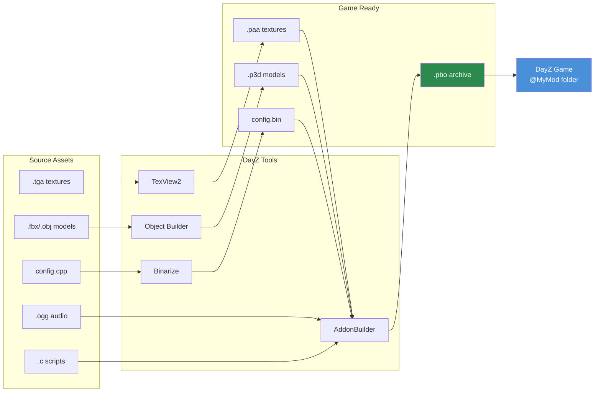

# Chapter 4.5: DayZ Toolsワークフロー

[ホーム](../README.md) | [<< 前: Audio](04-audio.md) | **DayZ Tools** | [次: PBOパッキング >>](06-pbo-packing.md)

---

## はじめに

DayZ Toolsは、Bohemia Interactiveがモッダー向けに提供する、Steamで配布されている無料の開発アプリケーション群です。3Dモデルエディタ、テクスチャビューア、テレインエディタ、スクリプトデバッガ、そして人間が読めるソースファイルを最適化されたゲーム対応フォーマットに変換するバイナリ化パイプラインなど、ゲームアセットの作成、変換、パッケージングに必要なすべてが含まれています。DayZのModは、少なくともこれらのツールとの何らかのやり取りなしには作成できません。

この章では、ツールスイートの各ツールの概要、ワークフロー全体を支えるP:ドライブ（ワークドライブ）システムの説明、高速な開発イテレーションのためのファイルパッチング、そしてソースファイルからプレイ可能なModまでの完全なアセットパイプラインについて解説します。

---

## 目次

- [DayZ Tools スイート概要](#dayz-tools-suite-overview)
- [インストールとセットアップ](#installation-and-setup)
- [P: ドライブ（ワークドライブ）](#p-drive-workdrive)
- [Object Builder](#object-builder)
- [TexView2](#texview2)
- [Terrain Builder](#terrain-builder)
- [Binarize](#binarize)
- [AddonBuilder](#addonbuilder)
- [Workbench](#workbench)
- [ファイルパッチングモード](#file-patching-mode)
- [完全なワークフロー：ソースからゲームまで](#complete-workflow-source-to-game)
- [よくある間違い](#common-mistakes)
- [ベストプラクティス](#best-practices)

---

## DayZ Tools スイート概要

DayZ Toolsは、Steamの**Tools**カテゴリから無料でダウンロードできます。Moddingパイプラインでそれぞれ特定の役割を持つアプリケーション群がインストールされます。

| ツール | 目的 | 主なユーザー |
|------|---------|---------------|
| **Object Builder** | 3Dモデルの作成と編集（.p3d） | 3Dアーティスト、モデラー |
| **TexView2** | テクスチャの表示と変換（.paa、.tga、.png） | テクスチャアーティスト、全モッダー |
| **Terrain Builder** | テレイン/マップの作成と編集 | マップ制作者 |
| **Binarize** | ソースからゲームフォーマットへの変換 | ビルドパイプライン（通常は自動化） |
| **AddonBuilder** | オプションのバイナリ化付きPBOパッキング | 全モッダー |
| **Workbench** | スクリプトのデバッグ、テスト、プロファイリング | スクリプター |
| **DayZ Tools Launcher** | ツール起動とP:ドライブ設定の中央ハブ | 全モッダー |

### ディスク上の配置場所

Steamインストール後、ツールは通常以下の場所に配置されます：

```
C:\Program Files (x86)\Steam\steamapps\common\DayZ Tools\
  Bin\
    AddonBuilder\
      AddonBuilder.exe          <-- PBOパッカー
    Binarize\
      Binarize.exe              <-- アセットコンバーター
    TexView2\
      TexView2.exe              <-- テクスチャツール
    ObjectBuilder\
      ObjectBuilder.exe         <-- 3Dモデルエディタ
    Workbench\
      workbenchApp.exe          <-- スクリプトデバッガ
  TerrainBuilder\
    TerrainBuilder.exe          <-- テレインエディタ
```

---

## インストールとセットアップ

### ステップ1：SteamからDayZ Toolsをインストールする

1. Steamライブラリを開きます。
2. ドロップダウンで**Tools**フィルタを有効にします。
3. 「DayZ Tools」を検索します。
4. インストールします（無料、約2 GB）。

### ステップ2：DayZ Toolsを起動する

1. Steamから「DayZ Tools」を起動します。
2. DayZ Tools Launcher（中央ハブアプリケーション）が開きます。
3. ここから各ツールの起動や設定の構成ができます。

### ステップ3：P:ドライブを設定する

ランチャーにはP:ドライブ（ワークドライブ）を作成してマウントするボタンがあります。これは、すべてのDayZツールがルートパスとして使用する仮想ドライブです。

1. **Setup Workdrive**（またはP:ドライブ設定ボタン）をクリックします。
2. ツールが実際のディスク上のディレクトリを指すsubstマップされたP:ドライブを作成します。
3. バニラDayZデータをP:に展開またはシンボリックリンクして、ツールがゲームアセットを参照できるようにします。

---

## P: ドライブ（ワークドライブ）

**P:ドライブ**は、すべてのDayZ Moddingの統一ルートパスとして機能するWindows仮想ドライブ（`subst`またはジャンクションで作成）です。P3Dモデル、RVMATマテリアル、config.cpp参照、ビルドスクリプトのすべてのパスはP:を基準としています。

### P:ドライブが存在する理由

DayZのアセットパイプラインは、固定ルートパスを中心に設計されています。マテリアルが`MyMod\data\texture_co.paa`を参照する場合、エンジンは`P:\MyMod\data\texture_co.paa`を探します。この規約により以下が保証されます：

- すべてのツールがファイルの場所について一致します。
- パックされたPBO内のパスが開発時のパスと一致します。
- 複数のModが1つのルート下で共存できます。

### 構造

```
P:\
  DZ\                          <-- バニラDayZ展開データ
    characters\
    weapons\
    data\
    ...
  DayZ Tools\                  <-- ツールインストール（またはシンボリックリンク）
  MyMod\                       <-- あなたのModソース
    config.cpp
    Scripts\
    data\
  AnotherMod\                  <-- 別のModのソース
    ...
```

### SetupWorkdrive.bat

多くのModプロジェクトには、P:ドライブの作成とジャンクション設定を自動化する`SetupWorkdrive.bat`スクリプトが含まれています。一般的なスクリプト：

```batch
@echo off
REM ワークスペースを指すP:ドライブを作成
subst P: "D:\DayZModding"

REM バニラゲームデータのジャンクションを作成
mklink /J "P:\DZ" "C:\Program Files (x86)\Steam\steamapps\common\DayZ\dta"

REM ツールのジャンクションを作成
mklink /J "P:\DayZ Tools" "C:\Program Files (x86)\Steam\steamapps\common\DayZ Tools"

echo ワークドライブ P: が設定されました。
pause
```

> **ヒント：** DayZツールを起動する前にワークドライブがマウントされている必要があります。Object BuilderやBinarizeがファイルを見つけられない場合、最初に確認すべきはP:がマウントされているかどうかです。

---

## Object Builder

Object BuilderはP3Dファイル用の3Dモデルエディタです。詳細は[Chapter 4.2: 3Dモデル](02-models.md)で扱います。ここではツールチェーンにおける役割の概要を説明します。

### 主な機能

- P3Dモデルファイルの作成と編集。
- ビジュアル、コリジョン、シャドウメッシュ用のLOD（Level of Detail）の定義。
- マテリアル（RVMAT）とテクスチャ（PAA）のモデル面への割り当て。
- アニメーションやテクスチャスワップ用のネームドセレクションの作成。
- メモリポイントとプロキシオブジェクトの配置。
- FBX、OBJ、3DSフォーマットからのジオメトリのインポート。
- エンジン互換性のためのモデルバリデーション。

### 起動

```
DayZ Tools Launcher --> Object Builder
```

または直接起動：`P:\DayZ Tools\Bin\ObjectBuilder\ObjectBuilder.exe`

### 他のツールとの連携

- テクスチャプレビューに**TexView2を参照**します（フェイスプロパティでテクスチャをダブルクリック）。
- BinarizeとAddonBuilderが使用する**P3Dファイルを出力**します。
- 参照用にP:ドライブのバニラデータから**P3Dファイルを読み込み**ます。

---

## TexView2

TexView2はテクスチャの表示と変換のユーティリティです。DayZ Moddingに必要なすべてのテクスチャフォーマット変換を処理します。

### 主な機能

- PAA、TGA、PNG、EDDS、DDSファイルの表示とプレビュー。
- フォーマット間の変換（TGA/PNGからPAA、PAAからTGAなど）。
- 個別チャンネル（R、G、B、A）の個別表示。
- ミップマップレベルの表示。
- テクスチャの寸法と圧縮タイプの表示。
- コマンドラインによるバッチ変換。

### 起動

```
DayZ Tools Launcher --> TexView2
```

または直接起動：`P:\DayZ Tools\Bin\TexView2\TexView2.exe`

### 一般的な操作

**TGAからPAAへの変換：**
1. File --> Open --> TGAファイルを選択します。
2. 画像が正しく表示されていることを確認します。
3. File --> Save As --> PAAフォーマットを選択します。
4. 圧縮方式を選択します（不透明にはDXT1、アルファにはDXT5）。
5. 保存します。

**バニラPAAテクスチャの検査：**
1. File --> Open --> `P:\DZ\...`を参照してPAAファイルを選択します。
2. 画像を表示します。チャンネルボタン（R、G、B、A）をクリックして個別チャンネルを検査します。
3. ステータスバーに表示される寸法と圧縮タイプを確認します。

**コマンドライン変換：**
```bash
TexView2.exe -i "P:\MyMod\data\texture_co.tga" -o "P:\MyMod\data\texture_co.paa"
```

---

## Terrain Builder

Terrain Builderはカスタムマップ（テレイン）を作成するための専用ツールです。マップ作成は、衛星画像、ハイトマップ、サーフェスマスク、オブジェクト配置を伴う、DayZで最も複雑なModding作業の1つです。

### 主な機能

- 衛星画像とハイトマップのインポート。
- テレインレイヤー（草、土、岩、砂など）の定義。
- マップ上へのオブジェクト（建物、木、岩）の配置。
- サーフェステクスチャとマテリアルの設定。
- Binarize用のテレインデータのエクスポート。

### Terrain Builderが必要な場合

- ゼロから新しいマップを作成する場合。
- 既存のテレインを変更する場合（オブジェクトの追加/削除、テレインの形状変更）。
- Terrain Builderは、アイテムMod、武器Mod、UI Mod、スクリプトのみのModには不要です。

### 起動

```
DayZ Tools Launcher --> Terrain Builder
```

> **注意：** テレイン作成は、専用のガイドが必要な上級トピックです。この章ではツール概要の一部としてのみTerrain Builderを扱います。

---

## Binarize

Binarizeは、人間が読めるソースファイルを最適化されたゲーム対応バイナリフォーマットに変換するコアエンジンです。PBOパッキング時にバックグラウンドで実行されますが（AddonBuilder経由）、直接呼び出すこともできます。

### Binarizeが変換するもの

| ソースフォーマット | 出力フォーマット | 説明 |
|---------------|---------------|-------------|
| MLOD `.p3d` | ODOL `.p3d` | 最適化された3Dモデル |
| `.tga` / `.png` / `.edds` | `.paa` | 圧縮テクスチャ |
| `.cpp`（config） | `.bin` | バイナリ化されたconfig（高速パース） |
| `.rvmat` | `.rvmat`（処理済み） | パスが解決されたマテリアル |
| `.wrp` | `.wrp`（最適化済み） | テレインワールド |

### バイナリ化が必要な場合

| コンテンツタイプ | バイナリ化？ | 理由 |
|-------------|-----------|--------|
| CfgVehicles付きConfig.cpp | **はい** | エンジンはアイテム定義にバイナリ化されたconfigを必要とします |
| Config.cpp（スクリプトのみ） | オプション | スクリプトのみのconfigはバイナリ化なしで動作します |
| P3Dモデル | **はい** | ODOLは読み込みが速く、サイズが小さく、エンジンに最適化されています |
| テクスチャ（TGA/PNG） | **はい** | ランタイムにはPAAが必要です |
| スクリプト（.cファイル） | **いいえ** | スクリプトはそのまま（テキストとして）読み込まれます |
| オーディオ（.ogg） | **いいえ** | OGGはすでにゲーム対応です |
| レイアウト（.layout） | **いいえ** | そのまま読み込まれます |

### 直接呼び出し

```bash
Binarize.exe -targetPath="P:\build\MyMod" -sourcePath="P:\MyMod" -noLogs
```

実際には、Binarizeを直接呼び出すことはほとんどありません。AddonBuilderがPBOパッキングプロセスの一部としてBinarizeをラップしています。

---

## AddonBuilder

AddonBuilderはPBOパッキングツールです。ソースディレクトリを受け取り、オプションでコンテンツに対してBinarizeを実行してから`.pbo`アーカイブを作成します。詳細は[Chapter 4.6: PBOパッキング](06-pbo-packing.md)で扱います。

### クイックリファレンス

```bash
# バイナリ化付きパック（config、モデル、テクスチャを持つアイテム/武器Mod用）
AddonBuilder.exe "P:\MyMod" "P:\output" -prefix="MyMod" -sign="MyKey"

# バイナリ化なしパック（スクリプトのみのMod用）
AddonBuilder.exe "P:\MyMod" "P:\output" -prefix="MyMod" -packonly
```

### 起動

DayZ Tools Launcherから、または直接起動：
```
P:\DayZ Tools\Bin\AddonBuilder\AddonBuilder.exe
```

AddonBuilderにはGUIモードとコマンドラインモードの両方があります。GUIはビジュアルファイルブラウザとオプションチェックボックスを提供します。コマンドラインモードは自動化ビルドスクリプトで使用されます。

---

## Workbench

Workbenchは、DayZ Toolsに含まれるスクリプト開発環境です。スクリプトの編集、デバッグ、プロファイリング機能を提供します。

### 主な機能

- Enforce Scriptのシンタックスハイライト付き**スクリプト編集**。
- ブレークポイント、ステップ実行、変数検査による**デバッグ**。
- スクリプトのパフォーマンスボトルネックを特定する**プロファイリング**。
- 式の評価とスニペットのテスト用**コンソール**。
- ゲームデータ検査用**リソースブラウザ**。

### 起動

```
DayZ Tools Launcher --> Workbench
```

または直接起動：`P:\DayZ Tools\Bin\Workbench\workbenchApp.exe`

### デバッグワークフロー

1. Workbenchを開きます。
2. Modのスクリプトを指すようにプロジェクトを設定します。
3. `.c`ファイルにブレークポイントを設定します。
4. Workbenchからゲームを起動します（DayZがデバッグモードで起動します）。
5. 実行がブレークポイントに達すると、Workbenchはゲームを一時停止し、コールスタック、ローカル変数を表示し、ステップ実行を可能にします。

### 制限事項

- WorkbenchのEnforce Scriptサポートにはいくつかの欠落があります。オートコンプリートですべてのエンジンAPIが完全にドキュメント化されているわけではありません。
- 一部のモッダーは、コード作成には外部エディタ（VS CodeとコミュニティEnforce Script拡張機能）を好み、デバッグにのみWorkbenchを使用します。
- Workbenchは大規模なModや複雑なブレークポイント設定で不安定になることがあります。

---

## ファイルパッチングモード

**ファイルパッチング**は、PBOにパッケージングすることなく、ディスクからルーズファイルをゲームに読み込ませる開発用ショートカットです。これにより、開発中のイテレーションが劇的に高速化されます。

### ファイルパッチングの仕組み

DayZが`-filePatching`パラメータ付きで起動されると、エンジンはPBOを確認する前にP:ドライブのファイルをチェックします。ファイルがP:上に存在する場合、PBOバージョンの代わりにルーズバージョンが読み込まれます。

```
通常モード：   ゲーム読み込み --> PBO --> ファイル
ファイルパッチング： ゲーム読み込み --> P: ドライブ（ファイルが存在する場合） --> PBO（フォールバック）
```

### ファイルパッチングの有効化

DayZに`-filePatching`起動パラメータを追加します：

```bash
# クライアント
DayZDiag_x64.exe -filePatching -mod="MyMod" -connect=127.0.0.1

# サーバー
DayZDiag_x64.exe -filePatching -server -mod="MyMod" -config=serverDZ.cfg
```

> **重要：** ファイルパッチングには、リテール版実行ファイルではなく、**Diag**（診断）実行ファイル（`DayZDiag_x64.exe`）が必要です。リテール版ビルドはセキュリティのため`-filePatching`を無視します。

### ファイルパッチングでできること

| アセットタイプ | ファイルパッチング可能？ | 備考 |
|------------|---------------------|-------|
| スクリプト（.c） | **はい** | 最速のイテレーション -- 編集、再起動、テスト |
| レイアウト（.layout） | **はい** | リビルドなしでUI変更 |
| テクスチャ（.paa） | **はい** | リビルドなしでテクスチャスワップ |
| Config.cpp | **部分的** | バイナリ化されていないconfigのみ |
| モデル（.p3d） | **はい** | バイナリ化されていないMLOD P3Dのみ |
| オーディオ（.ogg） | **はい** | リビルドなしでサウンドスワップ |

### ファイルパッチングによるワークフロー

1. Modのソースファイルを含むP:ドライブをセットアップします。
2. `-filePatching`付きでサーバーとクライアントを起動します。
3. エディタでスクリプトファイルを編集します。
4. ゲームを再起動（または再接続）して変更を反映します。
5. PBOのリビルドは不要です。

> **ヒント：** スクリプトのみの変更の場合、ファイルパッチングによりビルドステップが完全に不要になります。`.c`ファイルを編集し、再起動してテストするだけです。これが利用可能な最速の開発ループです。

### 制限事項

- **バイナリ化されたコンテンツは不可。** `CfgVehicles`エントリを含むConfig.cppは、バイナリ化なしでは正しく動作しない場合があります。スクリプトのみのconfigは問題ありません。
- **キー署名なし。** ファイルパッチされたコンテンツは署名されないため、開発時のみ使用可能です（公開サーバーでは不可）。
- **Diagビルドのみ。** リテール版実行ファイルはファイルパッチングを無視します。
- **P:ドライブがマウントされている必要あり。** ワークドライブがマウントされていない場合、ファイルパッチングは読み込むものがありません。

---

## 完全なワークフロー：ソースからゲームまで

以下は、ソースアセットをプレイ可能なModに変換するためのエンドツーエンドパイプラインです：

### フェーズ1：ソースアセットの作成


```
3Dソフトウェア（Blender/3dsMax）  -->  FBXエクスポート
画像エディタ（Photoshop/GIMP）    -->  TGA/PNGエクスポート
オーディオエディタ（Audacity）     -->  OGGエクスポート
テキストエディタ（VS Code）        -->  .cスクリプト、config.cpp、.layoutファイル
```

### フェーズ2：インポートと変換

```
FBX  -->  Object Builder  -->  P3D（LOD、セレクション、マテリアル付き）
TGA  -->  TexView2         -->  PAA（圧縮テクスチャ）
PNG  -->  TexView2         -->  PAA（圧縮テクスチャ）
OGG  -->  （変換不要、ゲーム対応）
```

### フェーズ3：P:ドライブ上の整理

```
P:\MyMod\
  config.cpp                    <-- Mod設定
  Scripts\
    3_Game\                     <-- 早期読み込みスクリプト
    4_World\                    <-- エンティティ/マネージャースクリプト
    5_Mission\                  <-- UI/ミッションスクリプト
  data\
    models\
      my_item.p3d               <-- 3Dモデル
    textures\
      my_item_co.paa            <-- ディフューズテクスチャ
      my_item_nohq.paa          <-- ノーマルマップ
      my_item_smdi.paa          <-- スペキュラーマップ
    materials\
      my_item.rvmat             <-- マテリアル定義
  sound\
    my_sound.ogg                <-- オーディオファイル
  GUI\
    layouts\
      my_panel.layout           <-- UIレイアウト
```

### フェーズ4：ファイルパッチングでテスト（開発）

```
DayZDiagを-filePatching付きで起動
  |
  |--> エンジンがP:\MyMod\からルーズファイルを読み込み
  |--> ゲーム内でテスト
  |--> P:上のファイルを直接編集
  |--> 再起動して変更を反映
  |--> 高速イテレーション
```

### フェーズ5：PBOパック（リリース）

```
AddonBuilder / ビルドスクリプト
  |
  |--> P:\MyMod\からソースを読み込み
  |--> Binarizeで変換：P3D-->ODOL、TGA-->PAA、config.cpp-->.bin
  |--> すべてをMyMod.pboにパック
  |--> キーで署名：MyMod.pbo.MyKey.bisign
  |--> 出力：@MyMod\addons\MyMod.pbo
```

### フェーズ6：配布

```
@MyMod\
  addons\
    MyMod.pbo                   <-- パックされたMod
    MyMod.pbo.MyKey.bisign      <-- サーバー検証用の署名
  keys\
    MyKey.bikey                 <-- サーバー管理者用の公開鍵
  mod.cpp                       <-- Modメタデータ（名前、作者など）
```

プレイヤーはSteam WorkshopでModをサブスクライブするか、サーバー管理者が手動でインストールします。

---

## よくある間違い

### 1. P:ドライブがマウントされていない

**症状：** すべてのツールが「file not found」エラーを報告します。Object Builderが空白のテクスチャを表示します。
**修正：** ツールを起動する前に`SetupWorkdrive.bat`を実行するか、DayZ Tools LauncherでP:をマウントしてください。

### 2. 間違ったツールの使用

**症状：** PAAファイルをテキストエディタで編集しようとしたり、P3DをNotepadで開こうとしたりしている。
**修正：** PAAはバイナリです -- TexView2を使用してください。P3Dはバイナリです -- Object Builderを使用してください。Config.cppはテキストです -- 任意のテキストエディタを使用してください。

### 3. バニラデータの展開を忘れている

**症状：** Object Builderが参照モデルのバニラテクスチャを表示できない。マテリアルがピンク/マゼンタで表示される。
**修正：** バニラDayZデータを`P:\DZ\`に展開して、ツールがゲームコンテンツへのクロスリファレンスを解決できるようにしてください。

### 4. リテール版実行ファイルでのファイルパッチング

**症状：** P:ドライブ上のファイルへの変更がゲーム内に反映されない。
**修正：** `DayZ_x64.exe`ではなく`DayZDiag_x64.exe`を使用してください。Diagビルドのみが`-filePatching`をサポートします。

### 5. P:ドライブなしでのビルド

**症状：** AddonBuilderまたはBinarizeがパス解決エラーで失敗する。
**修正：** ビルドツールを実行する前にP:ドライブをマウントしてください。モデルとマテリアルのすべてのパスはP:相対です。

---

## ベストプラクティス

1. **常にP:ドライブを使用してください。** 絶対パスを使用したい誘惑に抵抗してください。P:が標準であり、すべてのツールがそれを期待しています。

2. **開発中はファイルパッチングを使用してください。** イテレーション時間が数分（PBOリビルド）から数秒（ゲーム再起動）に短縮されます。PBOのビルドはリリーステストと配布時のみに行ってください。

3. **ビルドパイプラインを自動化してください。** スクリプト（`build_pbos.bat`、`dev.py`）を使用してAddonBuilderの呼び出しを自動化してください。手動GUIパッキングはエラーが発生しやすく、マルチPBO Modでは遅くなります。

4. **ソースと出力を分離してください。** ソースファイルはP:に配置し、ビルドされたPBOは別の出力ディレクトリに配置します。両者を混在させないでください。

5. **キーボードショートカットを学んでください。** Object BuilderとTexView2には、作業を劇的に高速化する豊富なキーボードショートカットがあります。それらを学ぶことに時間を投資してください。

6. **バニラデータを展開して研究してください。** DayZアセットの構造を学ぶ最良の方法は、既存のものを調べることです。バニラPBOを展開し、適切なツールでモデル、マテリアル、テクスチャを開いてください。

7. **デバッグにはWorkbenchを、コード作成には外部エディタを使用してください。** VS CodeとEnforce Script拡張機能はより良い編集体験を提供します。Workbenchはより良いデバッグ体験を提供します。両方を使用してください。

---

## ナビゲーション

| 前 | 上 | 次 |
|----------|----|------|
| [4.4 Audio](04-audio.md) | [Part 4: ファイルフォーマットとDayZ Tools](01-textures.md) | [4.6 PBOパッキング](06-pbo-packing.md) |
