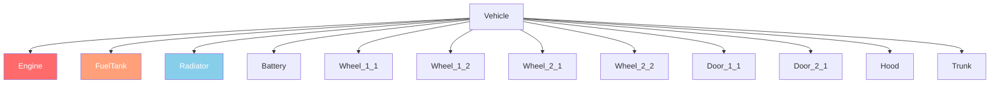

# 第6.2章: 車両システム

[ホーム](../README.md) | [<< 前へ: エンティティシステム](01-entity-system.md) | **車両** | [次へ: 天候 >>](03-weather.md)

---

## はじめに

DayZ の車両はトランスポートシステムを拡張したエンティティです。車は `CarScript` を、ボートは `BoatScript` を拡張し、両方とも `Transport` を継承します。車両には流体システム、独立した体力を持つパーツ、ギアシミュレーション、エンジンによって管理される物理があります。この章では、スクリプトで車両とやり取りするために必要な API メソッドを解説します。

---

## クラス階層

```
EntityAI
└── Transport                    // 3_Game - すべての車両のベース
    ├── Car                      // 3_Game - エンジンネイティブの車物理
    │   └── CarScript            // 4_World - スクリプト可能な車ベース
    │       ├── CivilianSedan
    │       ├── OffroadHatchback
    │       ├── Hatchback_02
    │       ├── Sedan_02
    │       ├── Truck_01_Base
    │       └── ...
    └── Boat                     // 3_Game - エンジンネイティブのボート物理
        └── BoatScript           // 4_World - スクリプト可能なボートベース
```

---

## Transport（ベース）

**ファイル:** `3_Game/entities/transport.c`

すべての車両の抽象ベースです。シート管理と乗員アクセスを提供します。

### 乗員管理

```c
proto native int   CrewSize();                          // シートの総数
proto native int   CrewMemberIndex(Human crew_member);  // 人間のシートインデックスを取得
proto native Human CrewMember(int posIdx);              // シートインデックスの人間を取得
proto native void  CrewGetOut(int posIdx);              // シートの乗員を強制降車
proto native void  CrewDeath(int posIdx);               // シートの乗員を殺す
```

### 乗車

```c
proto native int  GetAnimInstance();
proto native int  CrewPositionIndex(int componentIdx);  // コンポーネントからシートインデックスへ
proto native vector CrewEntryPoint(int posIdx);         // シートのワールド乗車位置
```

**例 --- すべての乗客を排出する:**

```c
void EjectAllCrew(Transport vehicle)
{
    for (int i = 0; i < vehicle.CrewSize(); i++)
    {
        Human crew = vehicle.CrewMember(i);
        if (crew)
        {
            vehicle.CrewGetOut(i);
        }
    }
}
```

---

## Car（エンジンネイティブ）

**ファイル:** `3_Game/entities/car.c`

エンジンレベルの車物理です。車両シミュレーションを駆動するすべての `proto native` メソッドです。

### エンジン

```c
proto native bool  EngineIsOn();
proto native void  EngineStart();
proto native void  EngineStop();
proto native float EngineGetRPM();
proto native float EngineGetRPMRedline();
proto native float EngineGetRPMMax();
proto native int   GetGear();
```

### 流体

DayZ の車両には `CarFluid` 列挙で定義される4つの流体タイプがあります。

```c
enum CarFluid
{
    FUEL,
    OIL,
    BRAKE,
    COOLANT
}
```

```c
proto native float GetFluidCapacity(CarFluid fluid);
proto native float GetFluidFraction(CarFluid fluid);     // 0.0 - 1.0
proto native void  Fill(CarFluid fluid, float amount);
proto native void  Leak(CarFluid fluid, float amount);
proto native void  LeakAll(CarFluid fluid);
```

**例 --- 車両に給油する:**

```c
void RefuelVehicle(Car car)
{
    float capacity = car.GetFluidCapacity(CarFluid.FUEL);
    float current = car.GetFluidFraction(CarFluid.FUEL) * capacity;
    float needed = capacity - current;
    car.Fill(CarFluid.FUEL, needed);
}
```

### 速度

```c
proto native float GetSpeedometer();    // km/h での速度（絶対値）
```

### コントロール（シミュレーション）

```c
proto native void  SetBrake(float value, int wheel = -1);    // 0.0 - 1.0、-1 = 全ホイール
proto native void  SetHandbrake(float value);                 // 0.0 - 1.0
proto native void  SetSteering(float value, bool analog = true);
proto native void  SetThrust(float value, int wheel = -1);    // 0.0 - 1.0
proto native void  SetClutchState(bool engaged);
```

### ホイール

```c
proto native int   WheelCount();
proto native bool  WheelIsAnyLocked();
proto native float WheelGetSurface(int wheelIdx);
```

### コールバック（CarScript でオーバーライド）

```c
void OnEngineStart();
void OnEngineStop();
void OnContact(string zoneName, vector localPos, IEntity other, Contact data);
void OnFluidChanged(CarFluid fluid, float newValue, float oldValue);
void OnGearChanged(int newGear, int oldGear);
void OnSound(CarSoundCtrl ctrl, float oldValue);
```

---

## CarScript

**ファイル:** `4_World/entities/vehicles/carscript.c`

ほとんどの車両 Mod が拡張するスクリプト可能な車クラスです。パーツ、ドア、ライト、サウンド管理を追加します。

### パーツの体力

CarScript はダメージゾーンを使用して車両パーツを表現します。各パーツは独立してダメージを受けることができます。

```c
// 標準の EntityAI API でパーツの体力を確認
float engineHP = car.GetHealth("Engine", "Health");
float fuelTankHP = car.GetHealth("FuelTank", "Health");

// パーツの体力を設定
car.SetHealth("Engine", "Health", 0);       // エンジンを破壊
car.SetHealth("FuelTank", "Health", 100);   // 燃料タンクを修理
```

### ダメージゾーン図



車両の一般的なダメージゾーン:

| ゾーン | 説明 |
|------|-------------|
| `""` (グローバル) | 車両全体の体力 |
| `"Engine"` | エンジンパーツ |
| `"FuelTank"` | 燃料タンク |
| `"Radiator"` | ラジエーター（冷却液） |
| `"Battery"` | バッテリー |
| `"SparkPlug"` | スパークプラグ |
| `"FrontLeft"` / `"FrontRight"` | 前輪 |
| `"RearLeft"` / `"RearRight"` | 後輪 |
| `"DriverDoor"` / `"CoDriverDoor"` | フロントドア |
| `"Hood"` / `"Trunk"` | フードとトランク |

### ライト

```c
void SetLightsState(int state);   // 0 = オフ、1 = オン
int  GetLightsState();
```

### ドアコントロール

```c
bool IsDoorOpen(string doorSource);
void OpenDoor(string doorSource);
void CloseDoor(string doorSource);
```

### カスタム車両の主要オーバーライド

```c
override void EEInit();                    // 車両パーツ、流体の初期化
override void OnEngineStart();             // カスタムエンジン始動の動作
override void OnEngineStop();              // カスタムエンジン停止の動作
override void EOnSimulate(IEntity other, float dt);  // ティックごとのシミュレーション
override bool CanObjectAttachWeapon(string slot_name);
```

**例 --- 流体が満タンの車両を作成する:**

```c
void SpawnReadyVehicle(vector pos)
{
    Car car = Car.Cast(GetGame().CreateObjectEx("CivilianSedan", pos,
                        ECE_PLACE_ON_SURFACE | ECE_INITAI | ECE_CREATEPHYSICS));
    if (!car)
        return;

    // すべての流体を充填
    car.Fill(CarFluid.FUEL, car.GetFluidCapacity(CarFluid.FUEL));
    car.Fill(CarFluid.OIL, car.GetFluidCapacity(CarFluid.OIL));
    car.Fill(CarFluid.BRAKE, car.GetFluidCapacity(CarFluid.BRAKE));
    car.Fill(CarFluid.COOLANT, car.GetFluidCapacity(CarFluid.COOLANT));

    // 必要なパーツをスポーン
    EntityAI carEntity = EntityAI.Cast(car);
    carEntity.GetInventory().CreateAttachment("CarBattery");
    carEntity.GetInventory().CreateAttachment("SparkPlug");
    carEntity.GetInventory().CreateAttachment("CarRadiator");
    carEntity.GetInventory().CreateAttachment("HatchbackWheel");
}
```

---

## BoatScript

**ファイル:** `4_World/entities/vehicles/boatscript.c`

ボートエンティティのスクリプト可能なベースです。CarScript と類似の API ですが、プロペラベースの物理です。

### エンジンと推進力

```c
proto native bool  EngineIsOn();
proto native void  EngineStart();
proto native void  EngineStop();
proto native float EngineGetRPM();
```

### 流体

ボートは同じ `CarFluid` 列挙を使用しますが、通常は `FUEL` のみを使用します。

```c
float fuel = boat.GetFluidFraction(CarFluid.FUEL);
boat.Fill(CarFluid.FUEL, boat.GetFluidCapacity(CarFluid.FUEL));
```

### 速度

```c
proto native float GetSpeedometer();   // km/h での速度
```

**例 --- ボートをスポーンする:**

```c
void SpawnBoat(vector waterPos)
{
    BoatScript boat = BoatScript.Cast(
        GetGame().CreateObjectEx("Boat_01", waterPos,
                                  ECE_CREATEPHYSICS | ECE_INITAI)
    );
    if (boat)
    {
        boat.Fill(CarFluid.FUEL, boat.GetFluidCapacity(CarFluid.FUEL));
    }
}
```

---

## 車両インタラクションチェック

### プレイヤーが車両に乗っているか確認する

```c
PlayerBase player;
if (player.IsInVehicle())
{
    EntityAI vehicle = player.GetDrivingVehicle();
    CarScript car;
    if (Class.CastTo(car, vehicle))
    {
        float speed = car.GetSpeedometer();
        Print(string.Format("Driving at %1 km/h", speed));
    }
}
```

### ワールド内のすべての車両を見つける

```c
void FindAllVehicles(out array<Transport> vehicles)
{
    vehicles = new array<Transport>;
    array<Object> objects = new array<Object>;
    array<CargoBase> proxyCargos = new array<CargoBase>;

    // マップの中心から大きな半径で検索
    GetGame().GetObjectsAtPosition(Vector(7500, 0, 7500), 15000, objects, proxyCargos);

    foreach (Object obj : objects)
    {
        Transport transport;
        if (Class.CastTo(transport, obj))
        {
            vehicles.Insert(transport);
        }
    }
}
```

---

## まとめ

| 概念 | 要点 |
|---------|-----------|
| 階層 | `Transport` > `Car`/`Boat` > `CarScript`/`BoatScript` |
| エンジン | `EngineStart()`, `EngineStop()`, `EngineIsOn()`, `EngineGetRPM()` |
| 流体 | `CarFluid` 列挙: `FUEL`, `OIL`, `BRAKE`, `COOLANT` |
| 充填/漏洩 | `Fill(fluid, amount)`, `Leak(fluid, amount)`, `GetFluidFraction(fluid)` |
| 速度 | `GetSpeedometer()` は km/h を返す |
| 乗員 | `CrewSize()`, `CrewMember(idx)`, `CrewGetOut(idx)` |
| パーツ | 標準ダメージゾーン: `"Engine"`, `"FuelTank"`, `"Radiator"` など |
| 作成 | `CreateObjectEx` に `ECE_PLACE_ON_SURFACE \| ECE_INITAI \| ECE_CREATEPHYSICS` |
| 1.28 設定 | `useNewNetworking`、`wheelHubFriction`、ブレーキトルク値の倍増 |
| 1.28 物理 | 更新された Bullet Physics、新しい `Contact` API フィールド、サスペンションの常時有効化 |
| 1.29 実験版 | 物理マルチスレッド、`Transport` スリープ、すべてのトランスポートの動的コリジョン |

---

## ベストプラクティス

- **車両をスポーンする際は必ず `ECE_CREATEPHYSICS | ECE_INITAI` を含めてください。** 物理がないと車両は地面を突き抜けます。AI 初期化がないとエンジンシミュレーションが開始されず、車両を運転できません。
- **スポーン後に4つの流体すべてを充填してください。** オイル、ブレーキフルード、クーラントが不足している車両は、エンジン始動時にすぐにダメージを受けます。`GetFluidCapacity()` を使用して車両タイプごとの正しい最大値を取得してください。
- **乗員を操作する前に `CrewMember()` の null チェックをしてください。** 空のシートは `null` を返します。各インデックスをチェックせずに `CrewSize()` をイテレートすると、シートが空の場合にクラッシュします。
- **速度の手動計算の代わりに `GetSpeedometer()` を使用してください。** エンジンのスピードメーターはホイール接触、トランスミッション状態、物理を正確に考慮します。位置差分からの手動速度計算は不正確です。

---

## 互換性と影響

> **Mod 互換性:** 車両 Mod は一般的に modded クラスで `CarScript` を拡張します。`OnEngineStart()` や `EOnSimulate()` など同じコールバックを複数の Mod がオーバーライドすると衝突が発生します。

- **ロード順序:** 2つの Mod が両方とも `modded class CarScript` で `OnEngineStart()` をオーバーライドした場合、両方が `super` を呼ばない限り最後にロードされた Mod のみが実行されます。車両オーバーホール Mod はすべてのコールバックで必ず `super` を呼び出すべきです。
- **Modded クラスの衝突:** Expansion Vehicles とバニラ車両 Mod は `EEInit()` と流体初期化で頻繁に衝突します。両方をロードした状態でテストしてください。
- **パフォーマンスへの影響:** `EOnSimulate()` はアクティブな各車両に対して物理ティックごとに実行されます。このコールバックのロジックは最小限に抑え、コストの高い操作にはタイマーアキュムレータを使用してください。
- **サーバー/クライアント:** `EngineStart()`, `EngineStop()`, `Fill()`, `Leak()`, `CrewGetOut()` はサーバー権限です。`GetSpeedometer()`, `EngineIsOn()`, `GetFluidFraction()` は両側で安全に読み取れます。

---

## 車両設定の変更（1.28+）

> **警告（1.28）：** DayZ 1.28 では車両物理に大幅な変更が導入されました。1.27以前の車両 Mod を更新する場合は、このセクションを注意深くお読みください。

### `useNewNetworking` パラメータ

DayZ 1.28 ではすべての `CarScript` クラスに `useNewNetworking` 設定パラメータが追加されました。デフォルト値は **1**（有効）です。

```cpp
class CfgVehicles
{
    class CarScript;
    class MyVehicle : CarScript
    {
        // 新しいネットワーキングは高pingでのラバーバンディングを改善します
        useNewNetworking = 1;  // デフォルト — ほとんどのModではそのままにしてください

        // Modが SimulationModule 設定の外で車両物理を変更する場合にのみ無効にしてください:
        // useNewNetworking = 0;
    };
};
```

**無効にする場合：** Mod がスクリプトで車両物理を直接操作する場合（カスタム `EOnSimulate` オーバーライド、直接的な力の適用、カスタムホイールロジック）、設定ベースの `SimulationModule` ではなく、新しい照合システムが変更と競合する可能性があります。その場合は `useNewNetworking = 0;` に設定してください。

### `wheelHubFriction` パラメータ（1.28+）

**ホイールが装着されていない** 場合のアクスルドラッグを定義する新しい設定変数です。

```cpp
class SimulationModule
{
    class Axles
    {
        class Front
        {
            wheelHubFriction = 0.5;  // ホイールがない状態で車両が減速する速さ
        };
    };
};
```

### ブレーキトルクの移行（1.28）

> **破壊的変更：** 1.28以前は、バグによりブレーキおよびハンドブレーキのトルクが **2回** 適用されていました。1.28でこれが修正されました。車両 Mod を移行する場合は、同じブレーキ感覚を維持するために `maxBrakeTorque` と `maxHandbrakeTorque` の値を **倍増** してください。

```cpp
// 1.28以前（バグ: 2回適用、実効値は2倍）
maxBrakeTorque = 2000;
maxHandbrakeTorque = 3000;

// 1.28以降（修正: 1回適用、旧動作に合わせるために倍増）
maxBrakeTorque = 4000;
maxHandbrakeTorque = 6000;
```

### サスペンションの常時有効化（1.28+）

車両がアウェイク状態の間、サスペンションが常に有効になりました。以前は特定の状態でサスペンションが無効になる場合がありました。これにより安定性が向上しますが、カスタムサスペンションの調整の感触が変わる可能性があります。

### Bullet Physics の更新（1.28）

Bullet Physics ライブラリが最新の Enfusion バージョンに更新されました。衝突応答、摩擦、反発における微妙な違いが発生する可能性があります。すべてのカスタム車両設定を十分にテストしてください。

### 物理 Contact API の変更（1.28）

`Contact` クラスが変更されました。

**削除:**
- `MaterialIndex1`, `MaterialIndex2`
- `Index1`, `Index2`

**追加:**
- `ShapeIndex1`, `ShapeIndex2` --- 複合ボディのどのシェイプがヒットしたかを識別します
- `VelocityBefore1`, `VelocityBefore2` --- 衝突前の速度
- `VelocityAfter1`, `VelocityAfter2` --- 衝突後の速度

**変更:**
- `Material1`, `Material2` --- 型が `dMaterial` から `SurfaceProperties` に変更

`EOnContact` で `Contact` データを読み取る Mod は、新しい変数名と型に更新する必要があります。

---

## 1.29 での車両変更（実験版）

> **注意：** これらの変更は DayZ 1.29 実験版からのもので、安定版リリース前に変更される可能性があります。

### Bullet Physics マルチスレッド（1.29 実験版）

Bullet Physics ライブラリのマルチスレッドサポートが有効になりました。サーバーストレステストでは最大 400% の FPS 改善（9 FPS から 50 FPS）が示されました。特定の物理タイミングに依存する車両 Mod や、スクリプトコールバックから物理呼び出しを行う車両 Mod は、十分にテストする必要があります。

### Transport スリープ（1.29 実験版）

車両が静止している時に **スリープ** できるよう、`Transport` に物理関数が直接追加されました。非アクティブなボディは `EOnSimulate` / `EOnPostSimulate` コールバックを受け取らなくなります。車両 Mod がこれらのコールバックの継続的な発火に依存している場合は、1.29 実験版でテストしてください。

### すべての Transport の動的コリジョン（1.29 実験版）

`Transport` クラス（`CarScript` と `BoatScript` の親）に動的コリジョン解決が追加されました。以前は `CarScript` のみがこれを持っていました。ボート Mod は適切なコリジョン処理の恩恵を受けます。

---

## 実際の Mod で確認されたパターン

> これらのパターンは、プロフェッショナルな DayZ Mod のソースコードを研究して確認されました。

| パターン | Mod | ファイル/場所 |
|---------|-----|---------------|
| `EEInit()` をオーバーライドしてカスタム流体容量を設定しパーツをスポーン | Expansion Vehicles | `CarScript` サブクラス |
| 定期的な燃料消費チェック用の `EOnSimulate` アキュムレータ | Vanilla+ 車両 Mod | `CarScript` オーバーライド |
| 管理者の全員排出コマンドでの `CrewGetOut()` ループ | VPP Admin Tools | 車両管理モジュール |
| 衝突ダメージ調整のためのカスタム `OnContact()` オーバーライド | Expansion | `ExpansionCarScript` |

---

[ホーム](../README.md) | [<< 前へ: エンティティシステム](01-entity-system.md) | **車両** | [次へ: 天候 >>](03-weather.md)
