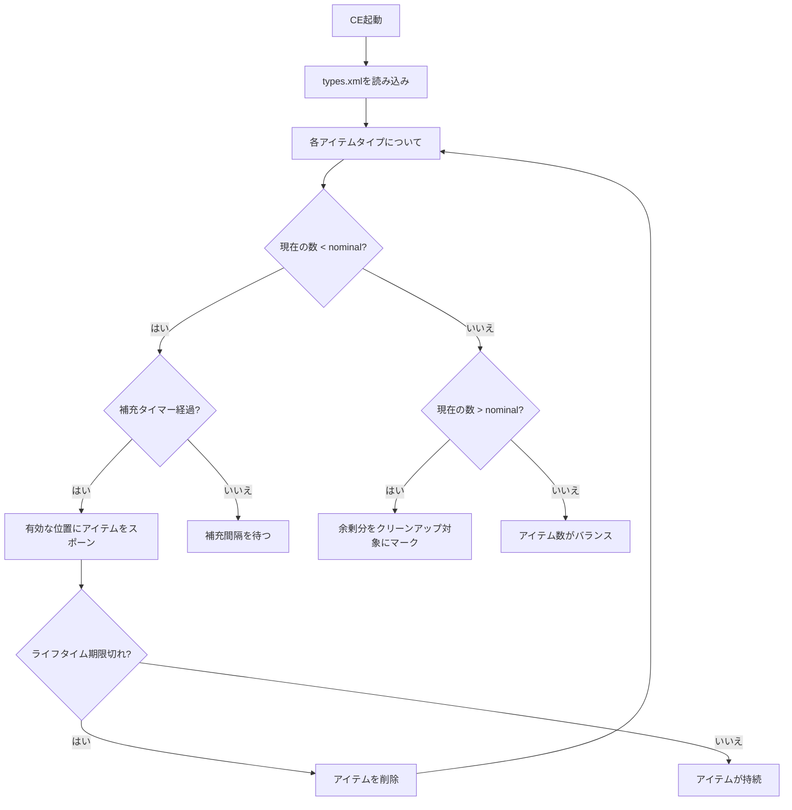

# 第6.10章: セントラルエコノミー

[ホーム](../README.md) | [<< 前へ: ネットワークとRPC](09-networking.md) | **セントラルエコノミー** | [次へ: ミッションフック >>](11-mission-hooks.md)

---

## はじめに

セントラルエコノミー（CE）は、ワールド内のすべてのスポーン可能なエンティティ（ルート、車両、感染者、動物、動的イベント）を管理するDayZのサーバー側システムです。ミッションフォルダ内のXMLファイルで完全に設定されます。CE自体はエンジンシステム（スクリプトで直接制御できない）ですが、その設定ファイルを理解することはサーバーModにとって不可欠です。この章ではすべてのCE設定ファイル、その構造、主要パラメータ、およびそれらの相互作用について説明します。

---

## CEの仕組み

1. サーバーが `types.xml` を読み取り、各アイテムの**nominal**（目標数）と**min**（補充前の最小数）を学習します。
2. アイテムには建物/場所タイプにマッピングされる**usageフラグ**（例：`Military`、`Town`）が割り当てられます。
3. アイテムにはマップゾーンに制限する**valueフラグ**（例：`Tier1`から`Tier4`）が割り当てられます。
4. CEは定期的にワールドをスキャンし、既存アイテムを数え、数が`min`を下回ると新しいアイテムをスポーンします。
5. `lifetime`（秒）の間触れられなかったアイテムはクリーンアップされます。
6. 動的イベント（`events.xml`）は独自のスケジュールで車両、ヘリコプタークラッシュ、感染者グループをスポーンします。

---

## ファイル概要

すべてのCEファイルはミッションフォルダ（例：`dayzOffline.chernarusplus/`）に配置されます。

| ファイル | 目的 |
|------|---------|
| `db/types.xml` | すべてのスポーン可能なアイテムのパラメータ |
| `db/events.xml` | 動的イベント定義（車両、クラッシュ、感染者） |
| `db/globals.xml` | グローバルCEパラメータ（タイマー、制限） |
| `db/economy.xml` | サブシステムのトグルスイッチ |
| `cfgeconomycore.xml` | ルートクラス、デフォルト値、CEログ |
| `cfgspawnabletypes.xml` | アイテムごとのアタッチメントとカーゴルール |
| `cfgrandompresets.xml` | ランダムルートプリセットプール |
| `cfgeventspawns.xml` | イベントスポーン位置のワールド座標 |
| `cfglimitsdefinition.xml` | すべての有効なカテゴリ、usage、valueフラグ名 |
| `cfgplayerspawnpoints.xml` | 初期スポーン位置 |

---

## スポーンサイクル



---

## types.xml

最も重要なCEファイルです。ワールドに存在できるすべてのアイテムにはここにエントリが必要です。

### 構造

```xml
<types>
    <type name="AKM">
        <nominal>10</nominal>
        <lifetime>14400</lifetime>
        <restock>0</restock>
        <min>5</min>
        <quantmin>-1</quantmin>
        <quantmax>-1</quantmax>
        <cost>100</cost>
        <flags count_in_cargo="0" count_in_hoarder="0"
               count_in_map="1" count_in_player="0" crafted="0" deloot="0"/>
        <category name="weapons"/>
        <usage name="Military"/>
        <value name="Tier3"/>
        <value name="Tier4"/>
    </type>
</types>
```

### パラメータ

| パラメータ | 説明 | 一般的な値 |
|-----------|-------------|----------------|
| `nominal` | マップ全体の目標数 | 1 - 200 |
| `lifetime` | 未使用アイテムがデスポーンするまでの秒数 | 3600（1時間）- 14400（4時間） |
| `restock` | アイテムが取られた後にCEがリスポーンを試みるまでの秒数 | 0（即座）- 1800 |
| `min` | CEがさらにスポーンする前の最小数 | 通常 `nominal / 2` |
| `quantmin` | 最小数量%（弾薬、液体）；-1 = 該当なし | -1、0 - 100 |
| `quantmax` | 最大数量%；-1 = 該当なし | -1、0 - 100 |
| `cost` | 優先度コスト（バニラでは常に100） | 100 |

### フラグ

| フラグ | 説明 |
|------|-------------|
| `count_in_cargo` | プレイヤー/コンテナのカーゴ内アイテムをnominalにカウント |
| `count_in_hoarder` | ストレージ内アイテム（テント、バレル、埋蔵物）をカウント |
| `count_in_map` | 地面上と建物内のアイテムをカウント |
| `count_in_player` | プレイヤーキャラクター上のアイテムをカウント |
| `crafted` | アイテムはクラフト可能（CEは自然にスポーンしない） |
| `deloot` | 動的イベントルート（イベントによりスポーン、CEによらない） |

### カテゴリ、Usage、Value

- **category**: アイテムカテゴリ（例：`weapons`、`tools`、`food`、`clothes`、`containers`）
- **usage**: アイテムがスポーンする場所（例：`Military`、`Police`、`Town`、`Village`、`Farm`、`Hunting`、`Coast`）
- **value**: マップティア制限（例：`Tier1` = 海岸、`Tier2` = 内陸、`Tier3` = 軍事、`Tier4` = 深内陸）

アイテムには複数の `<usage>` と `<value>` タグを付けて、複数の場所とティアにスポーンさせることができます。

**例 --- カスタムアイテムをエコノミーに追加：**

```xml
<type name="MyCustomRifle">
    <nominal>5</nominal>
    <lifetime>14400</lifetime>
    <restock>1800</restock>
    <min>2</min>
    <quantmin>-1</quantmin>
    <quantmax>-1</quantmax>
    <cost>100</cost>
    <flags count_in_cargo="0" count_in_hoarder="0"
           count_in_map="1" count_in_player="0" crafted="0" deloot="0"/>
    <category name="weapons"/>
    <usage name="Military"/>
    <value name="Tier3"/>
    <value name="Tier4"/>
</type>
```

---

## globals.xml

すべてのアイテムに影響するグローバルCEパラメータです。

```xml
<variables>
    <var name="AnimalMaxCount" type="0" value="200"/>
    <var name="CleanupAvoidance" type="0" value="100"/>
    <var name="CleanupLifetimeDeadAnimal" type="0" value="1200"/>
    <var name="CleanupLifetimeDeadInfected" type="0" value="330"/>
    <var name="CleanupLifetimeDeadPlayer" type="0" value="3600"/>
    <var name="CleanupLifetimeDefault" type="0" value="45"/>
    <var name="CleanupLifetimeLimit" type="0" value="7200"/>
    <var name="CleanupLifetimeRuined" type="0" value="330"/>
    <var name="FlagRefreshFrequency" type="0" value="432000"/>
    <var name="FlagRefreshMaxDuration" type="0" value="3456000"/>
    <var name="IdleModeCountdown" type="0" value="60"/>
    <var name="IdleModeStartup" type="0" value="1"/>
    <var name="InitialSpawn" type="0" value="1200"/>
    <var name="LootDamageMax" type="0" value="2"/>
    <var name="LootDamageMin" type="0" value="0"/>
    <var name="RespawnAttempt" type="0" value="2"/>
    <var name="RespawnLimit" type="0" value="20"/>
    <var name="RespawnTypes" type="0" value="12"/>
    <var name="RestartSpawn" type="0" value="0"/>
    <var name="SpawnInitial" type="0" value="1200"/>
    <var name="TimeHopping" type="0" value="60"/>
    <var name="TimeLogin" type="0" value="15"/>
    <var name="TimeLogout" type="0" value="15"/>
    <var name="TimePenalty" type="0" value="20"/>
    <var name="WorldWetTempUpdate" type="0" value="1"/>
    <var name="ZombieMaxCount" type="0" value="1000"/>
</variables>
```

### 主要パラメータ

| 変数 | 説明 |
|----------|-------------|
| `AnimalMaxCount` | 同時に存在する動物の最大数 |
| `ZombieMaxCount` | 同時に存在する感染者の最大数 |
| `CleanupLifetimeDeadPlayer` | 死亡したプレイヤーの体がデスポーンするまでの秒数 |
| `CleanupLifetimeDeadInfected` | 死亡したゾンビがデスポーンするまでの秒数 |
| `InitialSpawn` | サーバー起動時にスポーンするアイテム数 |
| `SpawnInitial` | 起動時のスポーン試行回数 |
| `LootDamageMin` / `LootDamageMax` | スポーンされたルートに適用されるダメージ範囲（0-4: Pristine～Ruined） |
| `RespawnAttempt` | リスポーンチェック間の秒数 |
| `FlagRefreshFrequency` | テリトリーフラグのリフレッシュ間隔（秒） |
| `TimeLogin` / `TimeLogout` | ログイン/ログアウトタイマー（秒） |

---

## events.xml

動的イベントを定義します：感染者スポーンゾーン、車両スポーン、ヘリコプタークラッシュ、その他のワールドイベントです。

### 構造

```xml
<events>
    <event name="StaticHeliCrash">
        <nominal>3</nominal>
        <min>1</min>
        <max>3</max>
        <lifetime>1800</lifetime>
        <restock>0</restock>
        <saferadius>500</saferadius>
        <distanceradius>500</distanceradius>
        <cleanupradius>200</cleanupradius>
        <flags deletable="1" init_random="0" remove_damaged="1"/>
        <position>fixed</position>
        <limit>child</limit>
        <active>1</active>
        <children>
            <child lootmax="10" lootmin="5" max="3" min="1"
                   type="Wreck_Mi8_Crashed"/>
        </children>
    </event>
</events>
```

### イベントパラメータ

| パラメータ | 説明 |
|-----------|-------------|
| `nominal` | アクティブなイベントの目標数 |
| `min` / `max` | 同時にアクティブな最小値と最大値 |
| `lifetime` | イベントがデスポーンするまでの秒数 |
| `saferadius` | スポーン時のプレイヤーからの最小距離 |
| `distanceradius` | イベントインスタンス間の最小距離 |
| `cleanupradius` | クリーンアップチェックの半径 |
| `position` | `"fixed"`（cfgeventspawns.xmlから）または `"player"`（プレイヤー近く） |
| `active` | `1` = 有効、`0` = 無効 |

### Children（イベントオブジェクト）

各イベントは1つ以上の子オブジェクトをスポーンできます：

| 属性 | 説明 |
|-----------|-------------|
| `type` | スポーンするオブジェクトのクラス名 |
| `min` / `max` | この子の数の範囲 |
| `lootmin` / `lootmax` | この子と共にスポーンされるルートアイテムの数 |

---

## cfgspawnabletypes.xml

特定のアイテムと共にスポーンするアタッチメントとカーゴを定義します。

```xml
<spawnabletypes>
    <type name="AKM">
        <attachments chance="0.3">
            <item name="AK_WoodBttstck" chance="0.5"/>
            <item name="AK_PlasticBttstck" chance="0.3"/>
            <item name="AK_FoldingBttstck" chance="0.2"/>
        </attachments>
        <attachments chance="0.2">
            <item name="AK_WoodHndgrd" chance="0.6"/>
            <item name="AK_PlasticHndgrd" chance="0.4"/>
        </attachments>
        <cargo chance="0.15">
            <item name="Mag_AKM_30Rnd" chance="0.7"/>
            <item name="Mag_AKM_Drum75Rnd" chance="0.3"/>
        </cargo>
    </type>
</spawnabletypes>
```

### 仕組み

- 各 `<attachments>` ブロックには適用される `chance`（0.0 - 1.0）があります。
- ブロック内のアイテムは個々の `chance` 値（ブロック内で100%に正規化）で選択されます。
- 複数の `<attachments>` ブロックにより、異なるアタッチメントスロットを独立してロールできます。
- `<cargo>` ブロックはエンティティのカーゴに配置されるアイテムについて同じように動作します。

---

## cfgrandompresets.xml

`cfgspawnabletypes.xml` から参照される再利用可能なルートプリセットプールを定義します。

```xml
<randompresets>
    <cargo name="foodGeneral" chance="0.5">
        <item name="Apple" chance="0.15"/>
        <item name="Pear" chance="0.15"/>
        <item name="BakedBeansCan" chance="0.3"/>
        <item name="SardinesCan" chance="0.3"/>
        <item name="WaterBottle" chance="0.1"/>
    </cargo>
</randompresets>
```

これらのプリセットは `cfgspawnabletypes.xml` で名前で参照できます：

```xml
<type name="Barrel_Green">
    <cargo preset="foodGeneral"/>
</type>
```

---

## cfgeconomycore.xml

ルートレベルのCE設定です。デフォルト値、CEクラス、ログフラグを定義します。

```xml
<economycore>
    <classes>
        <rootclass name="CfgVehicles" act="character" reportMemoryLOD="no"/>
        <rootclass name="CfgVehicles" act="car"/>
        <rootclass name="CfgVehicles" act="deployable"/>
        <rootclass name="CfgAmmo" act="none" reportMemoryLOD="no"/>
    </classes>
    <defaults>
        <default name="dyn_radius" value="40"/>
        <default name="dyn_smin" value="0"/>
        <default name="dyn_smax" value="0"/>
        <default name="dyn_dmin" value="0"/>
        <default name="dyn_dmax" value="10"/>
    </defaults>
    <ce folder="db"/>
</economycore>
```

`<ce folder="db"/>` タグはCEに `types.xml`、`events.xml`、`globals.xml` の場所を伝えます。

---

## cfglimitsdefinition.xml

`types.xml` で使用できるすべての有効なカテゴリ、usage、tag、valueフラグ名を定義します。

```xml
<lists>
    <categories>
        <category name="weapons"/>
        <category name="tools"/>
        <category name="food"/>
        <category name="clothes"/>
        <category name="containers"/>
        <category name="vehiclesparts"/>
        <category name="explosives"/>
    </categories>
    <usageflags>
        <usage name="Military"/>
        <usage name="Police"/>
        <usage name="Hunting"/>
        <usage name="Town"/>
        <usage name="Village"/>
        <usage name="Farm"/>
        <usage name="Coast"/>
        <usage name="Industrial"/>
        <usage name="Medic"/>
        <usage name="Firefighter"/>
        <usage name="School"/>
        <usage name="Office"/>
        <usage name="Prison"/>
        <usage name="Lunapark"/>
        <usage name="ContaminatedArea"/>
    </usageflags>
    <valueflags>
        <value name="Tier1"/>
        <value name="Tier2"/>
        <value name="Tier3"/>
        <value name="Tier4"/>
    </valueflags>
</lists>
```

カスタムModはここに新しいフラグを追加し、`types.xml` エントリで参照できます。

---

## スクリプト内のECEフラグ

スクリプトからエンティティをスポーンする際、ECEフラグ（[第6.1章](01-entity-system.md)で説明）がエンティティのCEとの相互作用を決定します：

| フラグ | CEの動作 |
|------|-------------|
| `ECE_NOLIFETIME` | エンティティはデスポーンしない（CEライフタイムで追跡されない） |
| `ECE_DYNAMIC_PERSISTENCY` | プレイヤーの操作後にのみエンティティが永続化される |
| `ECE_EQUIP_ATTACHMENTS` | `cfgspawnabletypes.xml` から設定されたアタッチメントをCEがスポーン |
| `ECE_EQUIP_CARGO` | `cfgspawnabletypes.xml` から設定されたカーゴをCEがスポーン |

**例 --- 永続的なアイテムをスポーン：**

```c
int flags = ECE_PLACE_ON_SURFACE | ECE_NOLIFETIME;
Object obj = GetGame().CreateObjectEx("Barrel_Green", pos, flags);
```

**例 --- CE設定のアタッチメント付きでスポーン：**

```c
int flags = ECE_PLACE_ON_SURFACE | ECE_EQUIP_ATTACHMENTS | ECE_EQUIP_CARGO;
Object obj = GetGame().CreateObjectEx("AKM", pos, flags);
// AKMはcfgspawnabletypes.xmlに従ってランダムなアタッチメント付きでスポーンされます
```

---

## CE操作のスクリプトAPI

CEは主にXMLで設定されますが、スクリプト側でのいくつかの操作があります：

### 設定値の読み取り

```c
// CfgVehiclesにアイテムが存在するかチェック
bool exists = GetGame().ConfigIsExisting("CfgVehicles MyCustomItem");

// 設定プロパティの読み取り
string displayName;
GetGame().ConfigGetText("CfgVehicles AKM displayName", displayName);

int weight = GetGame().ConfigGetInt("CfgVehicles AKM weight");
```

### ワールド内オブジェクトのクエリ

```c
// 位置近くのオブジェクトを取得
array<Object> objects = new array<Object>;
array<CargoBase> proxyCargos = new array<CargoBase>;
GetGame().GetObjectsAtPosition(pos, 50.0, objects, proxyCargos);
```

### サーフェスと位置のクエリ

```c
// 地形の高さを取得（アイテムを地面に配置するため）
float surfaceY = GetGame().SurfaceY(x, z);

// 位置のサーフェスタイプを取得
string surfaceType;
GetGame().SurfaceGetType(x, z, surfaceType);
```

---

## セントラルエコノミーのMod対応

### カスタムアイテムの追加

1. Modの `config.cpp` の `CfgVehicles` でアイテムクラスを定義します。
2. `types.xml` に nominal、lifetime、usage、valueフラグを含む `<type>` エントリを追加します。
3. オプションで `cfgspawnabletypes.xml` にアタッチメント/カーゴルールを追加します。
4. 新しいusage/valueフラグを使用する場合は、`cfglimitsdefinition.xml` で定義します。

### 既存アイテムの変更

`types.xml` の `<type>` エントリを編集して、スポーン率、ライフタイム、場所制限を変更します。変更はサーバー再起動後に反映されます。

### アイテムの無効化

`nominal` と `min` を `0` に設定します：

```xml
<type name="UnwantedItem">
    <nominal>0</nominal>
    <min>0</min>
    <!-- 残りのパラメータ -->
</type>
```

### カスタムイベントの追加

`events.xml` に新しい `<event>` ブロックを追加し、`cfgeventspawns.xml` に対応するスポーン位置を追加します：

```xml
<!-- events.xml -->
<event name="MyCustomEvent">
    <nominal>5</nominal>
    <min>2</min>
    <max>5</max>
    <lifetime>3600</lifetime>
    <restock>0</restock>
    <saferadius>300</saferadius>
    <distanceradius>800</distanceradius>
    <cleanupradius>100</cleanupradius>
    <flags deletable="1" init_random="1" remove_damaged="1"/>
    <position>fixed</position>
    <limit>child</limit>
    <active>1</active>
    <children>
        <child lootmax="5" lootmin="2" max="1" min="1"
               type="MyCustomObject"/>
    </children>
</event>
```

```xml
<!-- cfgeventspawns.xml -->
<event name="MyCustomEvent">
    <pos x="6543.2" z="2872.5" a="180"/>
    <pos x="7821.0" z="3100.8" a="90"/>
    <pos x="4200.5" z="8500.3" a="0"/>
</event>
```

---

## まとめ

| ファイル | 目的 | 主要パラメータ |
|------|---------|----------------|
| `types.xml` | アイテムスポーン定義 | `nominal`、`min`、`lifetime`、`usage`、`value` |
| `globals.xml` | グローバルCE変数 | `ZombieMaxCount`、`AnimalMaxCount`、クリーンアップタイマー |
| `events.xml` | 動的イベント | `nominal`、`lifetime`、`position`、`children` |
| `cfgspawnabletypes.xml` | アイテムごとのアタッチメント/カーゴルール | `attachments`、`cargo`、`chance` |
| `cfgrandompresets.xml` | 再利用可能なルートプール | `cargo`/`attachments` プリセット |
| `cfgeconomycore.xml` | ルートCE設定 | `classes`、`defaults`、CEフォルダ |
| `cfglimitsdefinition.xml` | 有効なフラグ定義 | `categories`、`usageflags`、`valueflags` |

| 概念 | 重要ポイント |
|---------|-----------|
| Nominal/Min | 数が `min` を下回るとCEがアイテムをスポーンし、`nominal` を目標にする |
| Lifetime | 未使用アイテムがデスポーンするまでの秒数 |
| Usageフラグ | アイテムがスポーンする場所（Military、Townなど） |
| Valueフラグ | マップティア制限（Tier1 = 海岸からTier4 = 深内陸） |
| Countフラグ | nominalにカウントされるアイテム（cargo、hoarder、map、player） |
| Events | 独自のライフサイクルを持つ動的スポーン（クラッシュ、車両、感染者） |
| ECEフラグ | スクリプトスポーンアイテム用の `ECE_NOLIFETIME`、`ECE_EQUIP` |

---

## ベストプラクティス

- **高価値アイテムには `count_in_hoarder="1"` を設定してください。** このフラグがないと、プレイヤーがワールドのスポーン数を減らさずに隠し場所にレア武器を溜め込め、実質的にアイテムの重複が発生します。
- **ほとんどのアイテムで `restock` は0のままにしてください。** ゼロでないrestock値はアイテムが拾われた後のリスポーンを遅延させます。すぐに再出現すべきでないアイテム（例：レアな軍事装備）にのみ使用してください。
- **プレイヤーがいるライブサーバーでnominal/min比率をテストしてください。** 静的テストでは実際のCE動作は明らかになりません。アイテムはプレイヤーの移動パターン、コンテナストレージ、クリーンアップタイマーと相互作用し、実際の負荷下でのみ見える方法で動作します。
- **新しいアイテムは常に `config.cpp` と `types.xml` の両方で定義してください。** types.xmlエントリのないconfig.cppエントリは、アイテムが自然にスポーンしないことを意味します。configクラスのないtypes.xmlエントリはCEエラーを引き起こします。
- **`cfgspawnabletypes.xml` を使用して武器のバリエーションを作成してください。** 裸の武器をスポーンする代わりに、アタッチメントプリセットを定義して、プレイヤーがランダムなストック、ハンドガード、マガジン付きの武器を見つけられるようにしてください -- これによりルートの品質認識が大幅に向上します。

---

## 互換性と影響

- **マルチMod:** 複数のModが `types.xml` にエントリを追加できます。2つのModが同じ `<type name="">` を定義した場合、最後に読み込まれたファイルが優先されます。衝突を避けるためにユニークなクラス名を使用してください。コミュニティサーバーではtypes.xmlエントリを慎重にマージしてください。
- **パフォーマンス:** 多くのアイテムタイプの高い `nominal` 値（200以上）はCEのスポーンループに負荷をかけます。CEは追跡されるエンティティの総数に応じてスケールする定期的なスキャンを実行します。nominalは現実的に保ってください -- 武器は5-20、一般的なアイテムは20-100。
- **サーバー/クライアント:** CEは完全にサーバー上で実行されます。クライアントはCEの状態を見ることができません。すべてのXMLファイルはサーバー側専用で、クライアントには配布されません。

---

[ホーム](../README.md) | [<< 前へ: ネットワークとRPC](09-networking.md) | **セントラルエコノミー** | [次へ: ミッションフック >>](11-mission-hooks.md)
