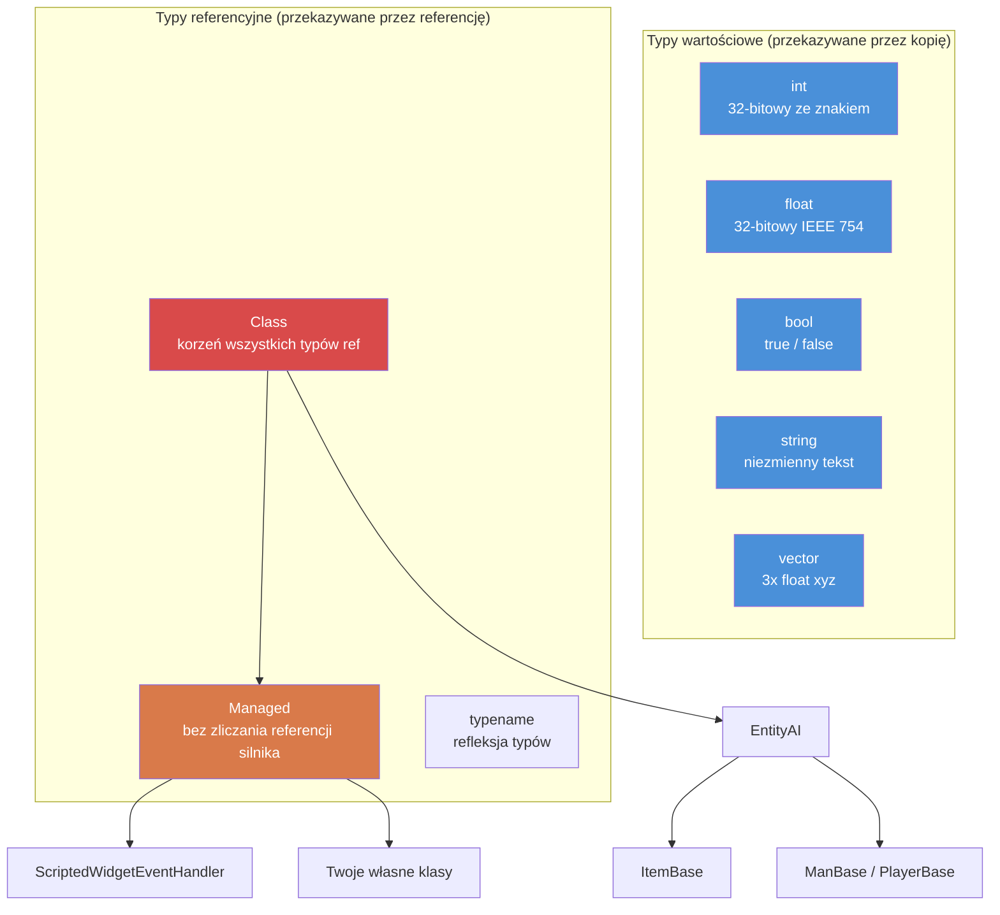

# Rozdział 1.1: Zmienne i typy

[Strona główna](../README.md) | **Zmienne i typy** | [Dalej: Tablice, mapy i zbiory >>](02-arrays-maps-sets.md)

---

## Wprowadzenie

Enforce Script to język skryptowy silnika Enfusion, używany przez DayZ Standalone. Jest to język obiektowy o składni podobnej do C, pod wieloma względami podobny do C#, ale z własnym zestawem typów, reguł i ograniczeń. Jeśli masz doświadczenie z C#, Javą lub C++, szybko poczujesz się jak w domu --- ale zwróć szczególną uwagę na różnice, ponieważ właśnie w miejscach, gdzie Enforce Script odbiega od tych języków, kryją się błędy.

Ten rozdział obejmuje podstawowe elementy: typy prymitywne, jak deklarować i inicjalizować zmienne oraz jak działa konwersja typów. Każda linia kodu moda DayZ zaczyna się tutaj.

---

## Typy prymitywne

Enforce Script ma mały, stały zestaw typów prymitywnych. Nie można definiować nowych typów wartościowych --- tylko klasy (omówione w [Rozdziale 1.3](03-classes-inheritance.md)).

| Typ | Rozmiar | Wartość domyślna | Opis |
|------|------|---------------|-------------|
| `int` | 32-bitowy ze znakiem | `0` | Liczby całkowite od -2 147 483 648 do 2 147 483 647 |
| `float` | 32-bitowy IEEE 754 | `0.0` | Liczby zmiennoprzecinkowe |
| `bool` | 1 bit logiczny | `false` | `true` lub `false` |
| `string` | Zmienny | `""` (pusty) | Tekst. Niezmienny typ wartościowy --- przekazywany przez wartość, nie przez referencję |
| `vector` | 3x float | `"0 0 0"` | Trzykomponentowy float (x, y, z). Przekazywany przez wartość |
| `typename` | Referencja silnika | `null` | Referencja do samego typu, używana do refleksji |
| `void` | N/A | N/A | Używany tylko jako typ zwracany do oznaczenia "nie zwraca niczego" |

### Diagram hierarchii typów



### Stałe typów

Niektóre typy udostępniają przydatne stałe:

```c
// granice int
int maxInt = int.MAX;    // 2147483647
int minInt = int.MIN;    // -2147483648

// granice float
float smallest = float.MIN;     // najmniejszy dodatni float (~1.175e-38)
float largest  = float.MAX;     // największy float (~3.403e+38)
float lowest   = float.LOWEST;  // najbardziej ujemny float (-3.403e+38)
```

---

## Deklarowanie zmiennych

Zmienne deklaruje się, wpisując typ, a następnie nazwę. Można deklarować i przypisywać w jednej instrukcji lub oddzielnie.

```c
void MyFunction()
{
    // Tylko deklaracja (inicjalizacja wartością domyślną)
    int health;          // health == 0
    float speed;         // speed == 0.0
    bool isAlive;        // isAlive == false
    string name;         // name == ""

    // Deklaracja z inicjalizacją
    int maxPlayers = 60;
    float gravity = 9.81;
    bool debugMode = true;
    string serverName = "My DayZ Server";
}
```

### Słowo kluczowe `auto`

Gdy typ jest oczywisty z prawej strony wyrażenia, można użyć `auto`, aby kompilator go wydedukował:

```c
void Example()
{
    auto count = 10;           // int
    auto ratio = 0.75;         // float
    auto label = "Hello";      // string
    auto player = GetGame().GetPlayer();  // DayZPlayer (lub cokolwiek zwraca GetPlayer)
}
```

To jest wyłącznie dla wygody --- kompilator rozwiązuje typ w czasie kompilacji. Nie ma żadnej różnicy w wydajności.

### Stałe

Użyj słowa kluczowego `const` dla wartości, które nigdy nie powinny się zmieniać po inicjalizacji:

```c
const int MAX_SQUAD_SIZE = 8;
const float SPAWN_RADIUS = 150.0;
const string MOD_PREFIX = "[MyMod]";

void Example()
{
    int a = MAX_SQUAD_SIZE;  // OK: odczyt stałej
    MAX_SQUAD_SIZE = 10;     // BŁĄD: nie można przypisać do stałej
}
```

Stałe są zwykle deklarowane na poziomie pliku (poza jakąkolwiek funkcją) lub jako składowe klasy. Konwencja nazewnictwa: `UPPER_SNAKE_CASE`.

---

## Praca z `int`

Liczby całkowite to najczęściej używany typ. DayZ używa ich do liczenia przedmiotów, identyfikatorów graczy, wartości zdrowia (przy dyskretyzacji), wartości wyliczeniowych, flag bitowych i wielu innych.

```c
void IntExamples()
{
    int count = 5;
    int total = count + 10;     // 15
    int doubled = count * 2;    // 10
    int remainder = 17 % 5;     // 2 (modulo)

    // Inkrementacja i dekrementacja
    count++;    // count wynosi teraz 6
    count--;    // count znów wynosi 5

    // Przypisanie złożone
    count += 3;  // count wynosi teraz 8
    count -= 2;  // count wynosi teraz 6
    count *= 4;  // count wynosi teraz 24
    count /= 6;  // count wynosi teraz 4

    // Dzielenie całkowitoliczbowe obcina (nie zaokrągla)
    int result = 7 / 2;    // result == 3, nie 3.5

    // Operacje bitowe (używane dla flag)
    int flags = 0;
    flags = flags | 0x01;   // ustaw bit 0
    flags = flags | 0x04;   // ustaw bit 2
    bool hasBit0 = (flags & 0x01) != 0;  // true
}
```

### Przykład z praktyki: Liczba graczy

```c
void PrintPlayerCount()
{
    array<Man> players = new array<Man>;
    GetGame().GetPlayers(players);
    int count = players.Count();
    Print(string.Format("Players online: %1", count));
}
```

---

## Praca z `float`

Liczby zmiennoprzecinkowe reprezentują liczby dziesiętne. DayZ szeroko je wykorzystuje do pozycji, odległości, procentów zdrowia, wartości obrażeń i timerów.

```c
void FloatExamples()
{
    float health = 100.0;
    float damage = 25.5;
    float remaining = health - damage;   // 74.5

    // Specyficzne dla DayZ: mnożnik obrażeń
    float headMultiplier = 3.0;
    float actualDamage = damage * headMultiplier;  // 76.5

    // Dzielenie floatów daje wyniki dziesiętne
    float ratio = 7.0 / 2.0;   // 3.5

    // Przydatna matematyka
    float dist = 150.7;
    float rounded = Math.Round(dist);    // 151
    float floored = Math.Floor(dist);    // 150
    float ceiled  = Math.Ceil(dist);     // 151
    float clamped = Math.Clamp(dist, 0.0, 100.0);  // 100
}
```

### Przykład z praktyki: Sprawdzanie odległości

```c
bool IsPlayerNearby(PlayerBase player, vector targetPos, float radius)
{
    if (!player)
        return false;

    vector playerPos = player.GetPosition();
    float distance = vector.Distance(playerPos, targetPos);
    return distance <= radius;
}
```

---

## Praca z `bool`

Zmienne logiczne przechowują `true` lub `false`. Są używane w warunkach, flagach i śledzeniu stanów.

```c
void BoolExamples()
{
    bool isAdmin = true;
    bool isBanned = false;

    // Operatory logiczne
    bool canPlay = isAdmin || !isBanned;    // true (OR, NOT)
    bool isSpecial = isAdmin && !isBanned;  // true (AND)

    // Negacja
    bool notAdmin = !isAdmin;   // false

    // Wyniki porównań są typu bool
    int health = 50;
    bool isLow = health < 25;       // false
    bool isHurt = health < 100;     // true
    bool isDead = health == 0;      // false
    bool isAlive = health != 0;     // true
}
```

### Prawdziwość w warunkach

W Enforce Script można używać wartości niebędących typem bool w warunkach. Następujące są uznawane za `false`:
- `0` (int)
- `0.0` (float)
- `""` (pusty łańcuch)
- `null` (pusta referencja obiektu)

Wszystko inne jest `true`. Jest to powszechnie używane do sprawdzania wartości null:

```c
void SafeCheck(PlayerBase player)
{
    // Te dwa zapisy są równoważne:
    if (player != null)
        Print("Player exists");

    if (player)
        Print("Player exists");

    // I te dwa również:
    if (player == null)
        Print("No player");

    if (!player)
        Print("No player");
}
```

---

## Praca z `string`

Łańcuchy w Enforce Script są **typami wartościowymi** --- są kopiowane przy przypisaniu lub przekazaniu do funkcji, tak jak `int` czy `float`. To różni się od C# lub Javy, gdzie łańcuchy są typami referencyjnymi.

```c
void StringExamples()
{
    string greeting = "Hello";
    string name = "Survivor";

    // Łączenie za pomocą +
    string message = greeting + ", " + name + "!";  // "Hello, Survivor!"

    // Formatowanie łańcuchów (indeksowanie od 1)
    string formatted = string.Format("Player %1 has %2 health", name, 75);
    // Wynik: "Player Survivor has 75 health"

    // Długość
    int len = message.Length();    // 17

    // Porównanie
    bool same = (greeting == "Hello");  // true

    // Konwersja z innych typów
    string fromInt = "Score: " + 42;     // NIE działa -- trzeba jawnie skonwertować
    string correct = "Score: " + 42.ToString();  // "Score: 42"

    // Użycie Format to preferowane podejście
    string best = string.Format("Score: %1", 42);  // "Score: 42"
}
```

### Sekwencje ucieczki

Łańcuchy obsługują standardowe sekwencje ucieczki:

| Sekwencja | Znaczenie |
|----------|---------|
| `\n` | Nowa linia |
| `\r` | Powrót karetki |
| `\t` | Tabulacja |
| `\\` | Literalny ukośnik wsteczny |
| `\"` | Literalny cudzysłów |

**Ostrzeżenie:** Chociaż te sekwencje są udokumentowane, ukośnik wsteczny (`\\`) i cudzysłowy z escape (`\"`) są znane z powodowania problemów z CParserem w niektórych kontekstach, szczególnie w operacjach związanych z JSON. Pracując ze ścieżkami plików lub łańcuchami JSON, unikaj ukośników wstecznych, gdy to możliwe. Używaj ukośników zwykłych do ścieżek --- DayZ akceptuje je na wszystkich platformach.

### Przykład z praktyki: Wiadomość na czacie

```c
void SendAdminMessage(string adminName, string text)
{
    string msg = string.Format("[ADMIN] %1: %2", adminName, text);
    Print(msg);
}
```

---

## Praca z `vector`

Typ `vector` przechowuje trzy komponenty `float` (x, y, z). Jest to podstawowy typ DayZ dla pozycji, kierunków, rotacji i prędkości. Podobnie jak łańcuchy i typy prymitywne, wektory są **typami wartościowymi** --- są kopiowane przy przypisaniu.

### Inicjalizacja

Wektory można zainicjalizować na dwa sposoby:

```c
void VectorInit()
{
    // Sposób 1: Inicjalizacja łańcuchem (trzy liczby rozdzielone spacjami)
    vector pos1 = "100.5 0 200.3";

    // Sposób 2: Funkcja konstruktora Vector()
    vector pos2 = Vector(100.5, 0, 200.3);

    // Wartość domyślna to "0 0 0"
    vector empty;   // empty == <0, 0, 0>
}
```

**Ważne:** Format inicjalizacji łańcuchem używa **spacji** jako separatorów, nie przecinków. `"1 2 3"` jest prawidłowy; `"1,2,3"` nie.

### Dostęp do komponentów

Dostęp do poszczególnych komponentów odbywa się za pomocą indeksowania w stylu tablicy:

```c
void VectorComponents()
{
    vector pos = Vector(100.5, 25.0, 200.3);

    // Odczyt komponentów
    float x = pos[0];   // 100.5  (Wschód/Zachód)
    float y = pos[1];   // 25.0   (Góra/Dół, wysokość)
    float z = pos[2];   // 200.3  (Północ/Południe)

    // Zapis komponentów
    pos[1] = 50.0;      // Zmień wysokość na 50
}
```

System współrzędnych DayZ:
- `[0]` = X = Wschód(+) / Zachód(-)
- `[1]` = Y = Góra(+) / Dół(-) (wysokość nad poziomem morza)
- `[2]` = Z = Północ(+) / Południe(-)

### Stałe statyczne

```c
vector zero    = vector.Zero;      // "0 0 0"
vector up      = vector.Up;        // "0 1 0"
vector right   = vector.Aside;     // "1 0 0"
vector forward = vector.Forward;   // "0 0 1"
```

### Typowe operacje wektorowe

```c
void VectorOps()
{
    vector pos1 = Vector(100, 0, 200);
    vector pos2 = Vector(150, 0, 250);

    // Odległość między dwoma punktami
    float dist = vector.Distance(pos1, pos2);

    // Kwadrat odległości (szybszy, dobry do porównań)
    float distSq = vector.DistanceSq(pos1, pos2);

    // Kierunek z pos1 do pos2
    vector dir = vector.Direction(pos1, pos2);

    // Normalizacja wektora (długość = 1)
    vector norm = dir.Normalized();

    // Długość wektora
    float len = dir.Length();

    // Interpolacja liniowa (50% między pos1 a pos2)
    vector midpoint = vector.Lerp(pos1, pos2, 0.5);

    // Iloczyn skalarny
    float dot = vector.Dot(dir, vector.Up);
}
```

### Przykład z praktyki: Pozycja spawnu

```c
// Uzyskaj pozycję na ziemi na danych współrzędnych X, Z
vector GetGroundPosition(float x, float z)
{
    vector pos = Vector(x, 0, z);
    pos[1] = GetGame().SurfaceY(x, z);  // Ustaw Y na wysokość terenu
    return pos;
}

// Uzyskaj losową pozycję w promieniu od punktu centralnego
vector GetRandomPositionAround(vector center, float radius)
{
    float angle = Math.RandomFloat(0, Math.PI2);
    float dist = Math.RandomFloat(0, radius);

    vector offset = Vector(Math.Cos(angle) * dist, 0, Math.Sin(angle) * dist);
    vector pos = center + offset;
    pos[1] = GetGame().SurfaceY(pos[0], pos[2]);
    return pos;
}
```

---

## Praca z `typename`

Typ `typename` przechowuje referencję do samego typu. Jest używany do refleksji --- badania i pracy z typami w czasie wykonywania. Spotkasz go przy pisaniu systemów generycznych, ładowarek konfiguracji i wzorców fabrycznych.

```c
void TypenameExamples()
{
    // Uzyskaj typename klasy
    typename t = PlayerBase;

    // Uzyskaj typename z łańcucha
    typename t2 = t.StringToEnum(PlayerBase, "PlayerBase");

    // Porównaj typy
    if (t == PlayerBase)
        Print("It's PlayerBase!");

    // Uzyskaj typename instancji obiektu
    PlayerBase player;
    // ... załóżmy, że player jest prawidłowy ...
    typename objType = player.Type();

    // Sprawdź dziedziczenie
    bool isMan = objType.IsInherited(Man);

    // Konwertuj typename na łańcuch
    string name = t.ToString();  // "PlayerBase"

    // Utwórz instancję z typename (wzorzec fabryczny)
    Class instance = t.Spawn();
}
```

### Konwersja wyliczeń z typename

```c
enum DamageType
{
    MELEE = 0,
    BULLET = 1,
    EXPLOSION = 2
};

void EnumConvert()
{
    // Wyliczenie na łańcuch
    string name = typename.EnumToString(DamageType, DamageType.BULLET);
    // name == "BULLET"

    // Łańcuch na wyliczenie
    int value;
    typename.StringToEnum(DamageType, "EXPLOSION", value);
    // value == 2
}
```

---

## Klasa Managed

`Managed` to specjalna klasa bazowa, która **wyłącza zliczanie referencji przez silnik**. Klasy rozszerzające `Managed` nie są śledzone przez garbage collector silnika --- ich czas życia jest całkowicie zarządzany przez skryptowe referencje `ref`.

```c
class MyScriptHandler : Managed
{
    // Ta klasa nie będzie zbierana przez garbage collector silnika
    // Zostanie usunięta dopiero gdy zostanie zwolniona ostatnia ref
}
```

Większość klas czysto skryptowych (które nie reprezentują encji gry) powinna rozszerzać `Managed`. Klasy encji jak `PlayerBase`, `ItemBase` rozszerzają `EntityAI` (które jest zarządzane przez silnik, NIE `Managed`).

### Kiedy używać Managed

| Użyj `Managed` dla... | NIE używaj `Managed` dla... |
|----------------------|-----------------------------|
| Klas danych konfiguracji | Przedmiotów (`ItemBase`) |
| Singletonowych menedżerów | Broni (`Weapon_Base`) |
| Kontrolerów UI | Pojazdów (`CarScript`) |
| Obiektów obsługi zdarzeń | Graczy (`PlayerBase`) |
| Klas pomocniczych/narzędziowych | Jakiejkolwiek klasy rozszerzającej `EntityAI` |

Jeśli twoja klasa nie reprezentuje fizycznej encji w świecie gry, powinna prawie na pewno rozszerzać `Managed`.

---

## Konwersja typów

Enforce Script obsługuje zarówno konwersje niejawne, jak i jawne między typami.

### Konwersje niejawne

Niektóre konwersje zachodzą automatycznie:

```c
void ImplicitConversions()
{
    // int na float (zawsze bezpieczne, brak utraty danych)
    int count = 42;
    float fCount = count;    // 42.0

    // float na int (OBCINA, nie zaokrągla!)
    float precise = 3.99;
    int truncated = precise;  // 3, NIE 4

    // int/float na bool
    bool fromInt = 5;      // true (niezerowe)
    bool fromZero = 0;     // false
    bool fromFloat = 0.1;  // true (niezerowe)

    // bool na int
    int fromBool = true;   // 1
    int fromFalse = false; // 0
}
```

### Konwersje jawne (parsowanie)

Do konwersji między łańcuchami a typami numerycznymi użyj metod parsowania:

```c
void ExplicitConversions()
{
    // Łańcuch na int
    int num = "42".ToInt();           // 42
    int bad = "hello".ToInt();        // 0 (kończy się po cichu)

    // Łańcuch na float
    float f = "3.14".ToFloat();       // 3.14

    // Łańcuch na vector
    vector v = "100 25 200".ToVector();  // <100, 25, 200>

    // Liczba na łańcuch (za pomocą Format)
    string s1 = string.Format("%1", 42);       // "42"
    string s2 = string.Format("%1", 3.14);     // "3.14"

    // int/float .ToString()
    string s3 = (42).ToString();     // "42"
}
```

### Rzutowanie obiektów

Dla typów klas użyj `Class.CastTo()` lub `ClassName.Cast()`. Jest to szczegółowo omówione w [Rozdziale 1.3](03-classes-inheritance.md), ale oto podstawowy wzorzec:

```c
void CastExample()
{
    Object obj = GetSomeObject();

    // Bezpieczne rzutowanie (preferowane)
    PlayerBase player;
    if (Class.CastTo(player, obj))
    {
        // player jest prawidłowy i bezpieczny do użycia
        string name = player.GetIdentity().GetName();
    }

    // Alternatywna składnia rzutowania
    PlayerBase player2 = PlayerBase.Cast(obj);
    if (player2)
    {
        // player2 jest prawidłowy
    }
}
```

---

## Zasięg zmiennych

Zmienne istnieją tylko w bloku kodu (nawiasach klamrowych), w którym zostały zadeklarowane. Enforce Script **nie pozwala** na ponowną deklarację zmiennej o tej samej nazwie w zagnieżdżonych lub siostrzanych blokach.

```c
void ScopeExample()
{
    int x = 10;

    if (true)
    {
        // int x = 20;  // BŁĄD: ponowna deklaracja 'x' w zagnieżdżonym bloku
        x = 20;         // OK: modyfikacja zewnętrznego x
        int y = 30;     // OK: nowa zmienna w tym bloku
    }

    // y NIE jest tutaj dostępne (zadeklarowane w wewnętrznym bloku)
    // Print(y);  // BŁĄD: niezadeklarowany identyfikator 'y'

    // WAŻNE: dotyczy to również pętli for
    for (int i = 0; i < 5; i++)
    {
        // i istnieje tutaj
    }
    // for (int i = 0; i < 3; i++)  // BŁĄD w DayZ: 'i' już zadeklarowane
    // Użyj innej nazwy:
    for (int j = 0; j < 3; j++)
    {
        // j istnieje tutaj
    }
}
```

### Pułapka siostrzanych bloków

Jest to jedna z najbardziej znanych osobliwości Enforce Script. Deklaracja zmiennej o tej samej nazwie w blokach `if` i `else` powoduje błąd kompilacji:

```c
void SiblingTrap()
{
    if (someCondition)
    {
        int result = 10;    // Zadeklarowane tutaj
        Print(result);
    }
    else
    {
        // int result = 20; // BŁĄD: wielokrotna deklaracja 'result'
        // Mimo że jest to siostrzany blok, nie ten sam blok
    }

    // ROZWIĄZANIE: zadeklaruj powyżej if/else
    int result;
    if (someCondition)
    {
        result = 10;
    }
    else
    {
        result = 20;
    }
}
```

---

## Priorytet operatorów

Od najwyższego do najniższego priorytetu:

| Priorytet | Operator | Opis | Łączność |
|----------|----------|-------------|---------------|
| 1 | `()` `[]` `.` | Grupowanie, dostęp do tablicy, dostęp do składowej | Od lewej do prawej |
| 2 | `!` `-` (unarny) `~` | Logiczne NOT, negacja, bitowe NOT | Od prawej do lewej |
| 3 | `*` `/` `%` | Mnożenie, dzielenie, modulo | Od lewej do prawej |
| 4 | `+` `-` | Dodawanie, odejmowanie | Od lewej do prawej |
| 5 | `<<` `>>` | Przesunięcie bitowe | Od lewej do prawej |
| 6 | `<` `<=` `>` `>=` | Relacyjne | Od lewej do prawej |
| 7 | `==` `!=` | Równość | Od lewej do prawej |
| 8 | `&` | Bitowe AND | Od lewej do prawej |
| 9 | `^` | Bitowe XOR | Od lewej do prawej |
| 10 | `\|` | Bitowe OR | Od lewej do prawej |
| 11 | `&&` | Logiczne AND | Od lewej do prawej |
| 12 | `\|\|` | Logiczne OR | Od lewej do prawej |
| 13 | `=` `+=` `-=` `*=` `/=` `%=` `&=` `\|=` `^=` `<<=` `>>=` | Przypisanie | Od prawej do lewej |

> **Wskazówka:** W razie wątpliwości używaj nawiasów. Enforce Script przestrzega reguł priorytetu podobnych do C, ale jawne grupowanie zapobiega błędom i poprawia czytelność.

---

## Najlepsze praktyki

- Zawsze jawnie inicjalizuj zmienne przy deklaracji, nawet gdy wartość domyślna odpowiada twojemu zamiarowi -- komunikuje to intencje przyszłym czytelnikom.
- Używaj `const` dla każdej wartości, która nigdy nie powinna się zmieniać; umieszczaj stałe na poziomie pliku lub klasy z nazewnictwem `UPPER_SNAKE_CASE`.
- Preferuj `string.Format()` zamiast łączenia `+` przy mieszaniu typów -- unikasz problemów z niejawną konwersją i jest to łatwiejsze do czytania.
- Używaj `vector.DistanceSq()` zamiast `vector.Distance()` przy porównywaniu odległości -- unikasz kosztownej operacji pierwiastka kwadratowego.
- Nigdy nie porównuj floatów za pomocą `==`; zawsze używaj tolerancji epsilon przez `Math.AbsFloat(a - b) < 0.001`.

---

## Zaobserwowane w prawdziwych modach

> Wzorce potwierdzone przez analizę kodu źródłowego profesjonalnych modów DayZ.

| Wzorzec | Mod | Szczegół |
|---------|-----|--------|
| `const string LOG_PREFIX` na poziomie klasy | COT / Expansion | Każdy moduł definiuje stałą łańcuchową dla prefiksów logów, aby uniknąć literówek |
| Nazewnictwo składowych `m_PascalCase` | VPP / Dabs Framework | Wszystkie zmienne składowe konsekwentnie używają prefiksu `m_`, nawet dla typów prymitywnych |
| `string.Format` dla całego wyjścia logów | Expansion Market | Nigdy nie używa łączenia `+` z liczbami -- zawsze symbole zastępcze `%1`..`%9` |
| `vector.Zero` zamiast literału `"0 0 0"` | COT Admin Tools | Używa nazwanych stałych dla czytelności i aby uniknąć narzutu parsowania łańcucha |

---

## Teoria a praktyka

| Koncept | Teoria | Rzeczywistość |
|---------|--------|---------|
| Słowo kluczowe `auto` | Powinno dedukować dowolny typ | Działa dla prostych przypisań, ale może mylić czytelników -- większość modów deklaruje typy jawnie |
| Obcinanie `float` do `int` | Udokumentowane jako "zaokrągla w kierunku zera" | Łapie prawie każdego przynajmniej raz; `3.99` staje się `3`, nie `4` |
| `string` jest typem wartościowym | Przekazywany przez kopię jak `int` | Zaskakuje programistów C#/Java, którzy oczekują semantyki referencyjnej; modyfikacje kopii nigdy nie wpływają na oryginał |

---

## Najczęstsze błędy

### 1. Niezainicjalizowane zmienne używane w logice

Typy prymitywne otrzymują wartości domyślne (`0`, `0.0`, `false`, `""`), ale poleganie na tym czyni kod kruchym i trudnym do czytania. Zawsze inicjalizuj jawnie.

```c
// ŹLE: poleganie na niejawnym zerze
int count;
if (count > 0)  // To działa, bo count == 0, ale intencja jest niejasna
    DoThing();

// DOBRZE: jawna inicjalizacja
int count = 0;
if (count > 0)
    DoThing();
```

### 2. Obcinanie float do int

Konwersja float na int obcina (zaokrągla w kierunku zera), nie zaokrągla do najbliższej:

```c
float f = 3.99;
int i = f;         // i == 3, NIE 4

// Jeśli chcesz zaokrąglenia:
int rounded = Math.Round(f);  // 4
```

### 3. Precyzja float w porównaniach

Nigdy nie porównuj floatów pod kątem dokładnej równości:

```c
float a = 0.1 + 0.2;
// ŹLE: może się nie powieść z powodu reprezentacji zmiennoprzecinkowej
if (a == 0.3)
    Print("Equal");

// DOBRZE: użyj tolerancji (epsilon)
if (Math.AbsFloat(a - 0.3) < 0.001)
    Print("Close enough");
```

### 4. Łączenie łańcuchów z liczbami

Nie można po prostu dodać liczby do łańcucha za pomocą `+`. Użyj `string.Format()`:

```c
int kills = 5;
// Potencjalnie problematyczne:
// string msg = "Kills: " + kills;

// PRAWIDŁOWO: użyj Format
string msg = string.Format("Kills: %1", kills);
```

### 5. Format łańcucha wektora

Inicjalizacja wektora łańcuchem wymaga spacji, nie przecinków:

```c
vector good = "100 25 200";     // PRAWIDŁOWO
// vector bad = "100, 25, 200"; // BŁĘDNIE: przecinki nie są prawidłowo parsowane
// vector bad2 = "100,25,200";  // BŁĘDNIE
```

### 6. Zapominanie, że łańcuchy i wektory to typy wartościowe

W przeciwieństwie do obiektów klas, łańcuchy i wektory są kopiowane przy przypisaniu. Modyfikacja kopii nie wpływa na oryginał:

```c
vector posA = "10 20 30";
vector posB = posA;       // posB to KOPIA
posB[1] = 99;             // Zmienia się tylko posB
// posA nadal wynosi "10 20 30"
```

---

## Ćwiczenia praktyczne

### Ćwiczenie 1: Podstawy zmiennych
Zadeklaruj zmienne do przechowywania:
- Imienia gracza (string)
- Jego procentu zdrowia (float, 0-100)
- Jego liczby zabójstw (int)
- Czy jest administratorem (bool)
- Jego pozycji w świecie (vector)

Wydrukuj sformatowane podsumowanie za pomocą `string.Format()`.

### Ćwiczenie 2: Konwerter temperatury
Napisz funkcję `float CelsiusToFahrenheit(float celsius)` i jej odwrotność `float FahrenheitToCelsius(float fahrenheit)`. Przetestuj z punktem wrzenia (100C = 212F) i punktem zamarzania (0C = 32F).

### Ćwiczenie 3: Kalkulator odległości
Napisz funkcję, która przyjmuje dwa wektory i zwraca:
- Odległość 3D między nimi
- Odległość 2D (ignorując wysokość / oś Y)
- Różnicę wysokości

Wskazówka: Dla odległości 2D utwórz nowe wektory z `[1]` ustawionym na `0` przed obliczeniem odległości.

### Ćwiczenie 4: Żonglowanie typami
Mając łańcuch `"42"`, skonwertuj go na:
1. `int`
2. `float`
3. Z powrotem na `string` za pomocą `string.Format()`
4. `bool` (powinno być `true`, ponieważ wartość int jest niezerowa)

### Ćwiczenie 5: Pozycja na ziemi
Napisz funkcję `vector SnapToGround(vector pos)`, która przyjmuje dowolną pozycję i zwraca ją z komponentem Y ustawionym na wysokość terenu w danej lokalizacji X, Z. Użyj `GetGame().SurfaceY()`.

---

## Podsumowanie

| Koncept | Kluczowy punkt |
|---------|-----------|
| Typy | `int`, `float`, `bool`, `string`, `vector`, `typename`, `void` |
| Wartości domyślne | `0`, `0.0`, `false`, `""`, `"0 0 0"`, `null` |
| Stałe | Słowo kluczowe `const`, konwencja `UPPER_SNAKE_CASE` |
| Wektory | Inicjalizacja łańcuchem `"x y z"` lub `Vector(x,y,z)`, dostęp przez `[0]`, `[1]`, `[2]` |
| Zasięg | Zmienne ograniczone do bloków `{}`; brak ponownej deklaracji w zagnieżdżonych/siostrzanych blokach |
| Konwersja | `float` na `int` obcina; do parsowania łańcuchów użyj `.ToInt()`, `.ToFloat()`, `.ToVector()` |
| Formatowanie | Zawsze używaj `string.Format()` do budowania łańcuchów z mieszanych typów |

---

[Strona główna](../README.md) | **Zmienne i typy** | [Dalej: Tablice, mapy i zbiory >>](02-arrays-maps-sets.md)
