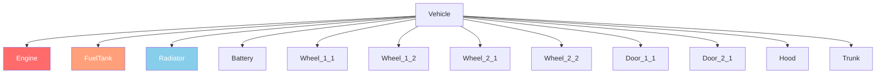

# Rozdział 6.2: System pojazdów

[Strona główna](../README.md) | [<< Poprzedni: System encji](01-entity-system.md) | **Pojazdy** | [Następny: Pogoda >>](03-weather.md)

---

## Wprowadzenie

Pojazdy w DayZ to encje rozszerzające system transportu. Samochody rozszerzają `CarScript`, łodzie rozszerzają `BoatScript`, a oba dziedziczą z `Transport`. Pojazdy posiadają systemy płynów, części z niezależnym zdrowiem, symulację skrzyni biegów i fizykę zarządzaną przez silnik. Ten rozdział obejmuje metody API potrzebne do interakcji z pojazdami w skryptach.

---

## Hierarchia klas

```
EntityAI
└── Transport                    // 3_Game - baza dla wszystkich pojazdów
    ├── Car                      // 3_Game - natywna fizyka samochodu silnika
    │   └── CarScript            // 4_World - skryptowalny bazowy samochód
    │       ├── CivilianSedan
    │       ├── OffroadHatchback
    │       ├── Hatchback_02
    │       ├── Sedan_02
    │       ├── Truck_01_Base
    │       └── ...
    └── Boat                     // 3_Game - natywna fizyka łodzi silnika
        └── BoatScript           // 4_World - skryptowalny bazowy statek
```

---

## Transport (baza)

**Plik:** `3_Game/entities/transport.c`

Abstrakcyjna baza dla wszystkich pojazdów. Zapewnia zarządzanie miejscami i dostęp do załogi.

### Zarządzanie załogą

```c
proto native int   CrewSize();                          // Całkowita liczba miejsc
proto native int   CrewMemberIndex(Human crew_member);  // Pobranie indeksu miejsca członka
proto native Human CrewMember(int posIdx);              // Pobranie człowieka na indeksie miejsca
proto native void  CrewGetOut(int posIdx);              // Wymuszenie wyjścia z miejsca
proto native void  CrewDeath(int posIdx);               // Zabicie członka na miejscu
```

### Wsiadanie załogi

```c
proto native int  GetAnimInstance();
proto native int  CrewPositionIndex(int componentIdx);  // Komponent na indeks miejsca
proto native vector CrewEntryPoint(int posIdx);         // Pozycja wejścia dla miejsca
```

**Przykład --- wyrzucenie wszystkich pasażerów:**

```c
void EjectAllCrew(Transport vehicle)
{
    for (int i = 0; i < vehicle.CrewSize(); i++)
    {
        Human crew = vehicle.CrewMember(i);
        if (crew)
        {
            vehicle.CrewGetOut(i);
        }
    }
}
```

---

## Car (natywny silnik)

**Plik:** `3_Game/entities/car.c`

Fizyka samochodu na poziomie silnika. Wszystkie metody `proto native` sterują symulacją pojazdu.

### Silnik

```c
proto native bool  EngineIsOn();
proto native void  EngineStart();
proto native void  EngineStop();
proto native float EngineGetRPM();
proto native float EngineGetRPMRedline();
proto native float EngineGetRPMMax();
proto native int   GetGear();
```

### Płyny

Pojazdy DayZ mają cztery typy płynów zdefiniowane w wyliczeniu `CarFluid`:

```c
enum CarFluid
{
    FUEL,
    OIL,
    BRAKE,
    COOLANT
}
```

```c
proto native float GetFluidCapacity(CarFluid fluid);
proto native float GetFluidFraction(CarFluid fluid);     // 0.0 - 1.0
proto native void  Fill(CarFluid fluid, float amount);
proto native void  Leak(CarFluid fluid, float amount);
proto native void  LeakAll(CarFluid fluid);
```

**Przykład --- zatankowanie pojazdu:**

```c
void RefuelVehicle(Car car)
{
    float capacity = car.GetFluidCapacity(CarFluid.FUEL);
    float current = car.GetFluidFraction(CarFluid.FUEL) * capacity;
    float needed = capacity - current;
    car.Fill(CarFluid.FUEL, needed);
}
```

### Prędkość

```c
proto native float GetSpeedometer();    // Prędkość w km/h (wartość bezwzględna)
```

### Sterowanie (symulacja)

```c
proto native void  SetBrake(float value, int wheel = -1);    // 0.0 - 1.0, -1 = wszystkie koła
proto native void  SetHandbrake(float value);                 // 0.0 - 1.0
proto native void  SetSteering(float value, bool analog = true);
proto native void  SetThrust(float value, int wheel = -1);    // 0.0 - 1.0
proto native void  SetClutchState(bool engaged);
```

### Koła

```c
proto native int   WheelCount();
proto native bool  WheelIsAnyLocked();
proto native float WheelGetSurface(int wheelIdx);
```

### Callbacki (nadpisanie w CarScript)

```c
void OnEngineStart();
void OnEngineStop();
void OnContact(string zoneName, vector localPos, IEntity other, Contact data);
void OnFluidChanged(CarFluid fluid, float newValue, float oldValue);
void OnGearChanged(int newGear, int oldGear);
void OnSound(CarSoundCtrl ctrl, float oldValue);
```

---

## CarScript

**Plik:** `4_World/entities/vehicles/carscript.c`

Skryptowalna klasa samochodu, którą większość modów pojazdów rozszerza. Dodaje części, drzwi, światła i zarządzanie dźwiękiem.

### Zdrowie części

CarScript używa stref uszkodzeń do reprezentacji części pojazdu. Każda część może być niezależnie uszkodzona:

```c
// Sprawdzenie zdrowia części przez standardowe API EntityAI
float engineHP = car.GetHealth("Engine", "Health");
float fuelTankHP = car.GetHealth("FuelTank", "Health");

// Ustawienie zdrowia części
car.SetHealth("Engine", "Health", 0);       // Zniszczenie silnika
car.SetHealth("FuelTank", "Health", 100);   // Naprawa zbiornika paliwa
```

### Diagram stref uszkodzeń



Typowe strefy uszkodzeń dla pojazdów:

| Strefa | Opis |
|--------|------|
| `""` (globalna) | Ogólne zdrowie pojazdu |
| `"Engine"` | Część silnika |
| `"FuelTank"` | Zbiornik paliwa |
| `"Radiator"` | Chłodnica (płyn chłodzący) |
| `"Battery"` | Akumulator |
| `"SparkPlug"` | Świeca zapłonowa |
| `"FrontLeft"` / `"FrontRight"` | Przednie koła |
| `"RearLeft"` / `"RearRight"` | Tylne koła |
| `"DriverDoor"` / `"CoDriverDoor"` | Przednie drzwi |
| `"Hood"` / `"Trunk"` | Maska i bagażnik |

### Światła

```c
void SetLightsState(int state);   // 0 = wyłączone, 1 = włączone
int  GetLightsState();
```

### Sterowanie drzwiami

```c
bool IsDoorOpen(string doorSource);
void OpenDoor(string doorSource);
void CloseDoor(string doorSource);
```

### Kluczowe nadpisania dla niestandardowych pojazdów

```c
override void EEInit();                    // Inicjalizacja części pojazdu, płynów
override void OnEngineStart();             // Niestandardowe zachowanie przy starcie silnika
override void OnEngineStop();              // Niestandardowe zachowanie przy wyłączeniu silnika
override void EOnSimulate(IEntity other, float dt);  // Symulacja co tik
override bool CanObjectAttachWeapon(string slot_name);
```

**Przykład --- tworzenie pojazdu z pełnymi płynami:**

```c
void SpawnReadyVehicle(vector pos)
{
    Car car = Car.Cast(GetGame().CreateObjectEx("CivilianSedan", pos,
                        ECE_PLACE_ON_SURFACE | ECE_INITAI | ECE_CREATEPHYSICS));
    if (!car)
        return;

    // Napełnij wszystkie płyny
    car.Fill(CarFluid.FUEL, car.GetFluidCapacity(CarFluid.FUEL));
    car.Fill(CarFluid.OIL, car.GetFluidCapacity(CarFluid.OIL));
    car.Fill(CarFluid.BRAKE, car.GetFluidCapacity(CarFluid.BRAKE));
    car.Fill(CarFluid.COOLANT, car.GetFluidCapacity(CarFluid.COOLANT));

    // Stwórz wymagane części
    EntityAI carEntity = EntityAI.Cast(car);
    carEntity.GetInventory().CreateAttachment("CarBattery");
    carEntity.GetInventory().CreateAttachment("SparkPlug");
    carEntity.GetInventory().CreateAttachment("CarRadiator");
    carEntity.GetInventory().CreateAttachment("HatchbackWheel");
}
```

---

## BoatScript

**Plik:** `4_World/entities/vehicles/boatscript.c`

Skryptowalna baza dla encji łodzi. Podobne API do CarScript, ale z fizyką opartą na śrubie napędowej.

### Silnik i napęd

```c
proto native bool  EngineIsOn();
proto native void  EngineStart();
proto native void  EngineStop();
proto native float EngineGetRPM();
```

### Płyny

Łodzie używają tego samego wyliczenia `CarFluid`, ale zazwyczaj używają tylko `FUEL`:

```c
float fuel = boat.GetFluidFraction(CarFluid.FUEL);
boat.Fill(CarFluid.FUEL, boat.GetFluidCapacity(CarFluid.FUEL));
```

### Prędkość

```c
proto native float GetSpeedometer();   // Prędkość w km/h
```

**Przykład --- tworzenie łodzi:**

```c
void SpawnBoat(vector waterPos)
{
    BoatScript boat = BoatScript.Cast(
        GetGame().CreateObjectEx("Boat_01", waterPos,
                                  ECE_CREATEPHYSICS | ECE_INITAI)
    );
    if (boat)
    {
        boat.Fill(CarFluid.FUEL, boat.GetFluidCapacity(CarFluid.FUEL));
    }
}
```

---

## Sprawdzenia interakcji z pojazdem

### Sprawdzanie czy gracz jest w pojeździe

```c
PlayerBase player;
if (player.IsInVehicle())
{
    EntityAI vehicle = player.GetDrivingVehicle();
    CarScript car;
    if (Class.CastTo(car, vehicle))
    {
        float speed = car.GetSpeedometer();
        Print(string.Format("Driving at %1 km/h", speed));
    }
}
```

### Znajdowanie wszystkich pojazdów w świecie

```c
void FindAllVehicles(out array<Transport> vehicles)
{
    vehicles = new array<Transport>;
    array<Object> objects = new array<Object>;
    array<CargoBase> proxyCargos = new array<CargoBase>;

    // Użyj dużego promienia od centrum mapy
    GetGame().GetObjectsAtPosition(Vector(7500, 0, 7500), 15000, objects, proxyCargos);

    foreach (Object obj : objects)
    {
        Transport transport;
        if (Class.CastTo(transport, obj))
        {
            vehicles.Insert(transport);
        }
    }
}
```

---

## Podsumowanie

| Koncept | Kluczowy punkt |
|---------|----------------|
| Hierarchia | `Transport` > `Car`/`Boat` > `CarScript`/`BoatScript` |
| Silnik | `EngineStart()`, `EngineStop()`, `EngineIsOn()`, `EngineGetRPM()` |
| Płyny | Wyliczenie `CarFluid`: `FUEL`, `OIL`, `BRAKE`, `COOLANT` |
| Napełnianie/Wyciek | `Fill(fluid, amount)`, `Leak(fluid, amount)`, `GetFluidFraction(fluid)` |
| Prędkość | `GetSpeedometer()` zwraca km/h |
| Załoga | `CrewSize()`, `CrewMember(idx)`, `CrewGetOut(idx)` |
| Części | Standardowe strefy uszkodzeń: `"Engine"`, `"FuelTank"`, `"Radiator"` itd. |
| Tworzenie | `CreateObjectEx` z `ECE_PLACE_ON_SURFACE \| ECE_INITAI \| ECE_CREATEPHYSICS` |
| 1.28 Config | `useNewNetworking`, `wheelHubFriction`, podwojone wartości momentu hamowania |
| 1.28 Physics | Zaktualizowany Bullet Physics, nowe pola API `Contact`, zawieszenie zawsze aktywne |
| 1.29 Experimental | Wielowątkowość fizyki, `Transport` sleep, dynamiczna kolizja dla wszystkich transport |

---

## Dobre praktyki

- **Zawsze dołączaj `ECE_CREATEPHYSICS | ECE_INITAI` przy tworzeniu pojazdów.** Bez fizyki pojazd przepadnie przez ziemię. Bez inicjalizacji AI symulacja silnika nie uruchomi się i pojazdem nie można kierować.
- **Po stworzeniu napełnij wszystkie cztery płyny.** Pojazd bez oleju, płynu hamulcowego lub chłodzącego uszkodzi się natychmiast przy uruchomieniu silnika. Użyj `GetFluidCapacity()` aby uzyskać poprawne wartości maksymalne dla danego typu pojazdu.
- **Sprawdzaj null przy `CrewMember()` przed operacjami na załodze.** Puste miejsca zwracają `null`. Iteracja po `CrewSize()` bez sprawdzania każdego indeksu powoduje crash, gdy miejsca są niezajęte.
- **Używaj `GetSpeedometer()` zamiast ręcznego obliczania prędkości.** Prędkościomierz silnika prawidłowo uwzględnia kontakt kół, stan skrzyni biegów i fizykę. Ręczne obliczenia prędkości z delt pozycji są niewiarygodne.

---

## Kompatybilność i wpływ

> **Kompatybilność modów:** Mody pojazdów powszechnie rozszerzają `CarScript` za pomocą modded klas. Konflikty powstają, gdy wiele modów nadpisuje te same callbacki jak `OnEngineStart()` lub `EOnSimulate()`.

- **Kolejność ładowania:** Jeśli dwa mody oba `modded class CarScript` i nadpisują `OnEngineStart()`, tylko ostatni załadowany mod działa, chyba że oba wywołują `super`. Mody przerabiające pojazdy powinny zawsze wywoływać `super` w każdym callbacku.
- **Konflikty modded klas:** Expansion Vehicles i vanilla mody pojazdów często kolidują na `EEInit()` i inicjalizacji płynów. Testuj z oboma załadowanymi.
- **Wpływ na wydajność:** `EOnSimulate()` działa co tik fizyki dla każdego aktywnego pojazdu. Utrzymuj logikę w tym callbacku na minimum; używaj akumulatorów czasowych dla kosztownych operacji.
- **Serwer/Klient:** `EngineStart()`, `EngineStop()`, `Fill()`, `Leak()` i `CrewGetOut()` są autorytatywne po stronie serwera. `GetSpeedometer()`, `EngineIsOn()` i `GetFluidFraction()` są bezpieczne do odczytu po obu stronach.

---

## Zaobserwowane w prawdziwych modach

> Te wzorce zostały potwierdzone przez analizę kodu źródłowego profesjonalnych modów DayZ.

| Wzorzec | Mod | Plik/Lokalizacja |
|---------|-----|------------------|
| Nadpisanie `EEInit()` do ustawienia niestandardowych pojemności płynów i tworzenia części | Expansion Vehicles | Podklasy `CarScript` |
| Akumulator `EOnSimulate` do okresowych kontroli zużycia paliwa | Vanilla+ mody pojazdów | Nadpisania `CarScript` |
| Pętla `CrewGetOut()` w komendzie admina wyrzucającej wszystkich | VPP Admin Tools | Moduł zarządzania pojazdami |
| Niestandardowe nadpisanie `OnContact()` do dostrajania obrażeń przy kolizji | Expansion | `ExpansionCarScript` |

---

## Zmiany konfiguracji pojazdów (1.28+)

> **Ostrzeżenie (1.28):** DayZ 1.28 wprowadził znaczące zmiany fizyki pojazdów. Jeśli aktualizujesz moda pojazdów z wersji 1.27 lub starszej, uważnie przeczytaj tę sekcję.

### Parametr `useNewNetworking`

DayZ 1.28 dodał parametr konfiguracyjny `useNewNetworking` dla wszystkich klas `CarScript`. Wartość domyślna to **1** (włączony).

```cpp
class CfgVehicles
{
    class CarScript;
    class MyVehicle : CarScript
    {
        // Nowy networking poprawia gumowanie przy wysokim pingu
        useNewNetworking = 1;  // domyślnie — dla większości modów zostaw włączony

        // Wyłącz TYLKO jeśli twój mod modyfikuje fizykę pojazdów
        // poza konfiguracją SimulationModule:
        // useNewNetworking = 0;
    };
};
```

**Kiedy wyłączyć:** Jeśli twój mod bezpośrednio manipuluje fizyką pojazdów przez skrypt (niestandardowe nadpisania `EOnSimulate`, bezpośrednie stosowanie sił, niestandardowa logika kół) zamiast przez konfigurację `SimulationModule`, nowy system rekoncyliacji może walczyć z twoimi zmianami. W takim przypadku ustaw `useNewNetworking = 0;`.

### Parametr `wheelHubFriction` (1.28+)

Nowa zmienna konfiguracyjna definiująca opór osi, gdy **nie są zamontowane żadne koła**:

```cpp
class SimulationModule
{
    class Axles
    {
        class Front
        {
            wheelHubFriction = 0.5;  // Jak szybko pojazd zwalnia bez kół
        };
    };
};
```

### Migracja momentu hamowania (1.28)

> **Łamiąca zmiana:** Przed wersją 1.28 moment hamowania i hamulca ręcznego był aplikowany **dwukrotnie** z powodu błędu. Zostało to naprawione w 1.28. Jeśli migrujesz moda pojazdów, **podwój** wartości `maxBrakeTorque` i `maxHandbrakeTorque`, aby zachować ten sam feeling hamowania.

```cpp
// Przed 1.28 (błąd: aplikowane dwukrotnie, więc efektywna wartość była 2x)
maxBrakeTorque = 2000;
maxHandbrakeTorque = 3000;

// Po 1.28 (naprawione: aplikowane raz, więc podwój aby zachować stare zachowanie)
maxBrakeTorque = 4000;
maxHandbrakeTorque = 6000;
```

### Zawieszenie zawsze aktywne (1.28+)

Zawieszenie pojazdu jest teraz zawsze aktywne, gdy pojazd jest obudzony. Wcześniej zawieszenie mogło być nieaktywne w niektórych stanach. Poprawia to stabilność, ale może zmienić odczucie niestandardowego dostrajania zawieszenia.

### Aktualizacja Bullet Physics (1.28)

Biblioteka Bullet Physics została zaktualizowana do najnowszej wersji Enfusion. Mogą wystąpić subtelne różnice w odpowiedzi kolizyjnej, tarciu i restytucji. Dokładnie przetestuj wszystkie niestandardowe konfiguracje pojazdów.

### Zmiany API kontaktów fizycznych (1.28)

Klasa `Contact` została zmodyfikowana:

**Usunięte:**
- `MaterialIndex1`, `MaterialIndex2`
- `Index1`, `Index2`

**Dodane:**
- `ShapeIndex1`, `ShapeIndex2` --- identyfikują, który kształt w ciele złożonym został trafiony
- `VelocityBefore1`, `VelocityBefore2` --- prędkości przed kolizją
- `VelocityAfter1`, `VelocityAfter2` --- prędkości po kolizji

**Zmienione:**
- `Material1`, `Material2` --- typ zmieniony z `dMaterial` na `SurfaceProperties`

Mody odczytujące dane `Contact` w `EOnContact` muszą zaktualizować nazwy i typy nowych zmiennych.

---

## Zmiany pojazdów w 1.29 (eksperymentalne)

> **Uwaga:** Te zmiany pochodzą z DayZ 1.29 eksperymentalnego i mogą się zmienić przed wydaniem stabilnym.

### Wielowątkowość Bullet Physics (1.29 eksperymentalne)

Dla biblioteki Bullet Physics włączono obsługę wielowątkowości. Testy obciążeniowe serwera wykazały do 400% poprawy FPS (z 9 FPS do 50 FPS). Mody pojazdów opierające się na określonym taktowaniu fizyki lub wywołujące funkcje fizyki z callbacków skryptów powinny być dokładnie przetestowane.

### Transport Sleep (1.29 eksperymentalne)

Na `Transport` dodano funkcje fizyczne umożliwiające pojazdom **uśpienie** w stanie spoczynku. Nieaktywne ciała nie otrzymują już callbacków `EOnSimulate` / `EOnPostSimulate`. Jeśli twój mod pojazdu polega na ciągłym wywoływaniu tych callbacków, przetestuj na 1.29 eksperymentalnym.

### Dynamiczna kolizja dla wszystkich Transport (1.29 eksperymentalne)

Klasa `Transport` (rodzic `CarScript` i `BoatScript`) ma teraz dynamiczną rozdzielczość kolizji. Wcześniej miał ją tylko `CarScript`. Mody łodzi korzystają z prawidłowej obsługi kolizji.

---

[Strona główna](../README.md) | [<< Poprzedni: System encji](01-entity-system.md) | **Pojazdy** | [Następny: Pogoda >>](03-weather.md)
