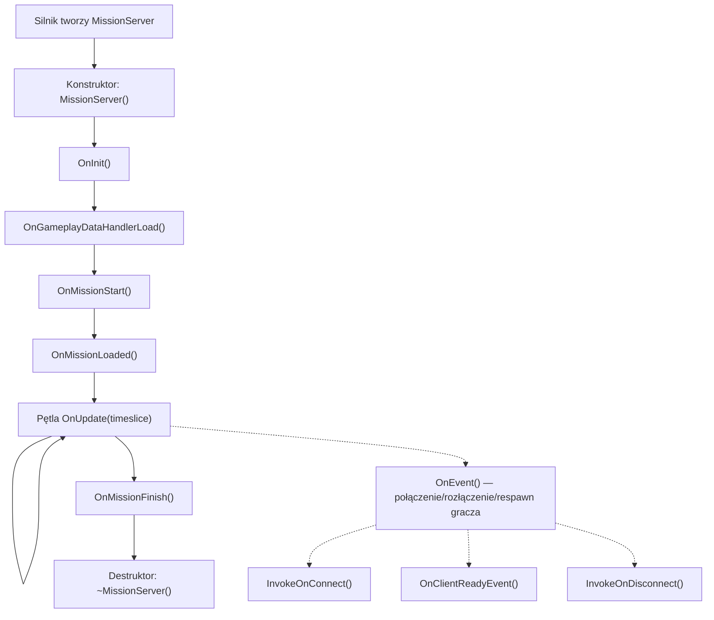
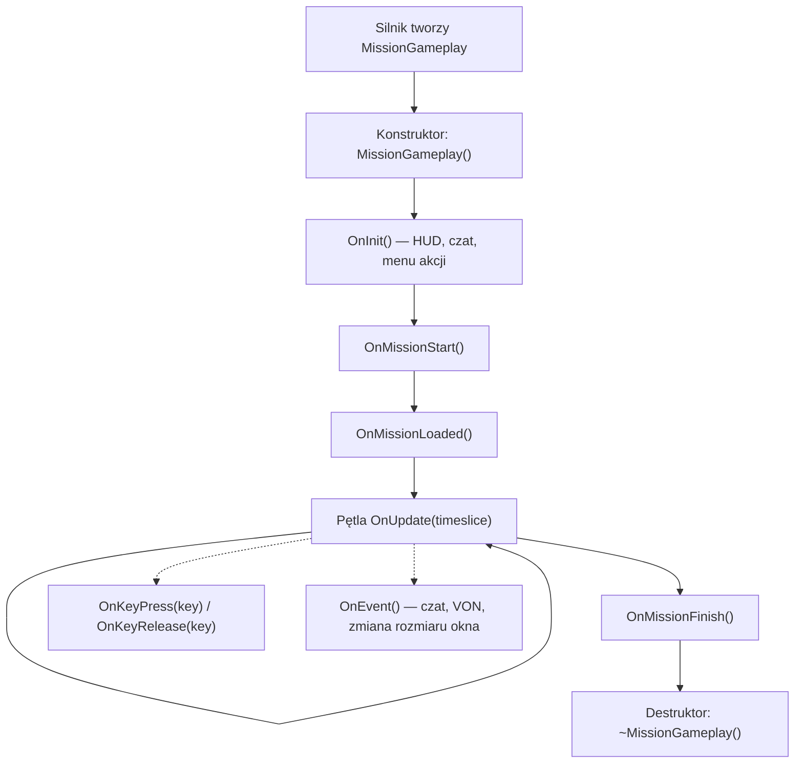
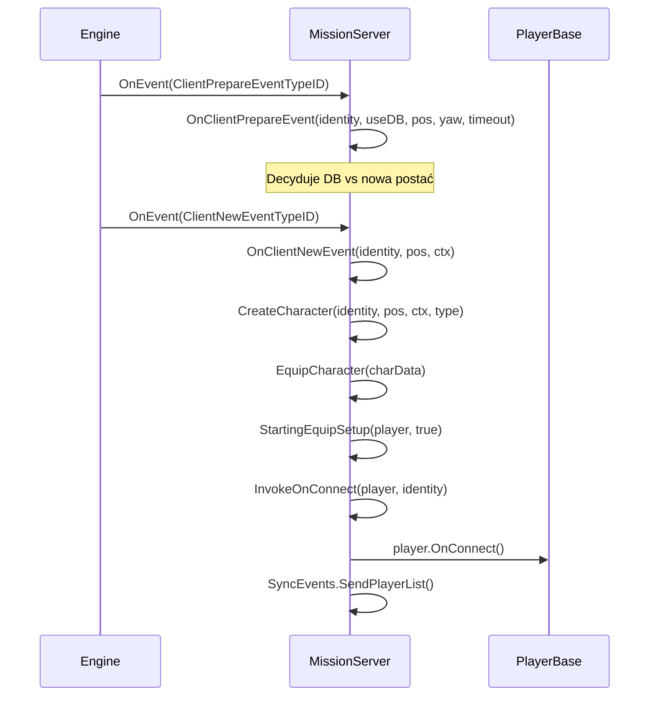
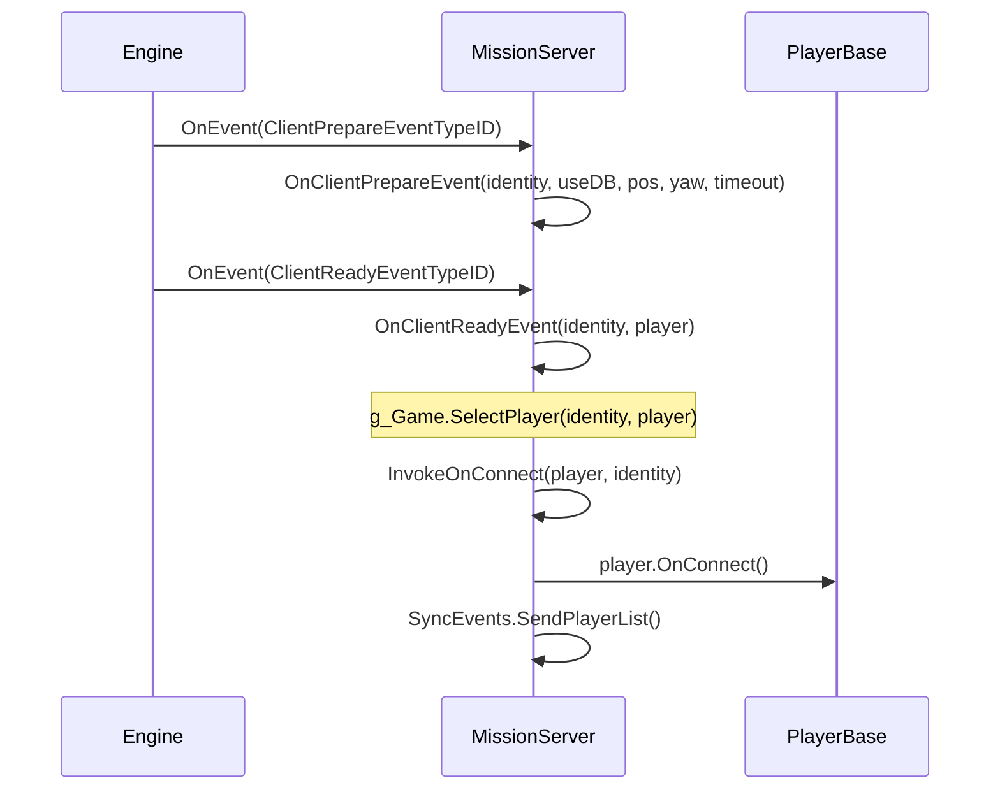
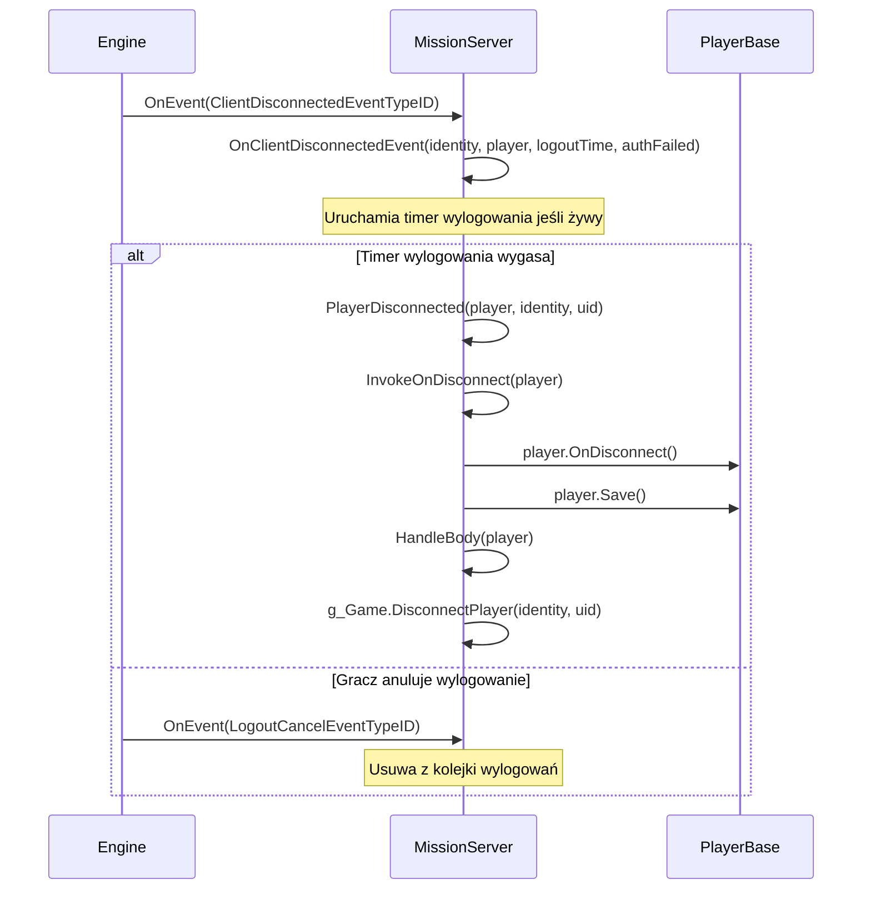

# Rozdział 6.11: Hooki misji

[Strona główna](../../README.md) | [<< Poprzedni: Centralna Ekonomia](10-central-economy.md) | **Hooki misji** | [Następny: System akcji >>](12-action-system.md)

---

## Wprowadzenie

Każdy mod DayZ potrzebuje punktu wejścia --- miejsca, w którym inicjalizuje menedżery, rejestruje handlery RPC, podłącza się do połączeń graczy i sprząta przy zamykaniu. Tym punktem wejścia jest klasa **Mission**. Silnik tworzy dokładnie jedną instancję Mission, gdy scenariusz się wczytuje: `MissionServer` na serwerze dedykowanym, `MissionGameplay` na kliencie lub obie na serwerze listen. Klasy te zapewniają hooki cyklu życia, które uruchamiają się w gwarantowanej kolejności, dając modom niezawodne miejsce do wstrzykiwania zachowania.

Ten rozdział obejmuje pełną hierarchię klas Mission, każdą hookowalną metodę, prawidłowy wzorzec `modded class` do ich rozszerzania oraz przykłady z vanilla DayZ, COT i Expansion.

---

## Hierarchia klas

```
Mission                      // 3_Game/gameplay.c (bazowa, definiuje wszystkie sygnatury hooków)
└── MissionBaseWorld         // 4_World/classes/missionbaseworld.c (minimalny most)
    └── MissionBase          // 5_Mission/mission/missionbase.c (wspólna konfiguracja: HUD, menu, pluginy)
        ├── MissionServer    // 5_Mission/mission/missionserver.c (strona serwera)
        └── MissionGameplay  // 5_Mission/mission/missiongameplay.c (strona klienta)
```

- **Mission** definiuje wszystkie sygnatury hooków jako puste metody: `OnInit()`, `OnUpdate()`, `OnEvent()`, `OnMissionStart()`, `OnMissionFinish()`, `OnKeyPress()`, `OnKeyRelease()` itp.
- **MissionBase** inicjalizuje menedżer pluginów, handler zdarzeń widgetów, dane świata, dynamiczną muzykę, zestawy dźwięków i śledzenie urządzeń wejściowych. Jest wspólnym rodzicem zarówno dla serwera, jak i klienta.
- **MissionServer** obsługuje połączenia graczy, rozłączenia, respawny, zarządzanie ciałami, planowanie ticków i artylerię.
- **MissionGameplay** obsługuje tworzenie HUD, czat, menu akcji, UI głosowe, ekwipunek, wykluczanie wejść i planowanie po stronie klienta.

---

## Przegląd cyklu życia

### Cykl życia MissionServer (strona serwera)



### Cykl życia MissionGameplay (strona klienta)



---

## Metody bazowej klasy Mission

**Plik:** `3_Game/gameplay.c`

Bazowa klasa `Mission` definiuje każdą hookowalną metodę. Wszystkie są wirtualne z pustymi domyślnymi implementacjami, chyba że zaznaczono inaczej.

### Hooki cyklu życia

| Metoda | Sygnatura | Kiedy się uruchamia |
|--------|-----------|---------------------|
| `OnInit` | `void OnInit()` | Po konstruktorze, przed startem misji. Główny punkt konfiguracji. |
| `OnMissionStart` | `void OnMissionStart()` | Po OnInit. Świat misji jest aktywny. |
| `OnMissionLoaded` | `void OnMissionLoaded()` | Po OnMissionStart. Wszystkie systemy vanilla są zainicjalizowane. |
| `OnGameplayDataHandlerLoad` | `void OnGameplayDataHandlerLoad()` | Serwer: po wczytaniu danych rozgrywki (cfggameplay.json). |
| `OnUpdate` | `void OnUpdate(float timeslice)` | Co klatkę. `timeslice` to sekundy od ostatniej klatki (zwykle 0.016-0.033). |
| `OnMissionFinish` | `void OnMissionFinish()` | Przy zamykaniu lub rozłączeniu. Wyczyść wszystko tutaj. |

### Hooki wejścia (strona klienta)

| Metoda | Sygnatura | Kiedy się uruchamia |
|--------|-----------|---------------------|
| `OnKeyPress` | `void OnKeyPress(int key)` | Fizyczny klawisz naciśnięty. `key` to stała `KeyCode`. |
| `OnKeyRelease` | `void OnKeyRelease(int key)` | Fizyczny klawisz zwolniony. |
| `OnMouseButtonPress` | `void OnMouseButtonPress(int button)` | Przycisk myszy naciśnięty. |
| `OnMouseButtonRelease` | `void OnMouseButtonRelease(int button)` | Przycisk myszy zwolniony. |

### Hook zdarzeń

| Metoda | Sygnatura | Kiedy się uruchamia |
|--------|-----------|---------------------|
| `OnEvent` | `void OnEvent(EventType eventTypeId, Param params)` | Zdarzenia silnika: czat, VON, połączenie/rozłączenie gracza, zmiana rozmiaru okna itp. |

### Metody narzędziowe

| Metoda | Sygnatura | Opis |
|--------|-----------|------|
| `GetHud` | `Hud GetHud()` | Zwraca instancję HUD (tylko klient). |
| `GetWorldData` | `WorldData GetWorldData()` | Zwraca dane specyficzne dla świata (krzywe temperatur itp.). |
| `IsPaused` | `bool IsPaused()` | Czy gra jest wstrzymana (pojedynczy gracz / serwer listen). |
| `IsServer` | `bool IsServer()` | `true` dla MissionServer, `false` dla MissionGameplay. |
| `IsMissionGameplay` | `bool IsMissionGameplay()` | `true` dla MissionGameplay, `false` dla MissionServer. |
| `PlayerControlEnable` | `void PlayerControlEnable(bool bForceSuppress)` | Ponownie włącz wejście gracza po wyłączeniu. |
| `PlayerControlDisable` | `void PlayerControlDisable(int mode)` | Wyłącz wejście gracza (np. `INPUT_EXCLUDE_ALL`). |
| `IsControlDisabled` | `bool IsControlDisabled()` | Czy sterowanie gracza jest aktualnie wyłączone. |
| `GetControlDisabledMode` | `int GetControlDisabledMode()` | Zwraca aktualny tryb wykluczania wejść. |

---

## Hooki MissionServer (strona serwera)

**Plik:** `5_Mission/mission/missionserver.c`

MissionServer jest tworzony przez silnik na serwerach dedykowanych. Obsługuje wszystko związane z cyklem życia gracza na serwerze.

### Kluczowe zachowanie vanilla

- **Konstruktor**: Konfiguruje `CallQueue` dla statystyk graczy (interwał 30 sekund), tablicę martwych graczy, mapy śledzenia wylogowań, handler rain procurement.
- **OnInit**: Wczytuje `CfgGameplayHandler`, `PlayerSpawnHandler`, `CfgPlayerRestrictedAreaHandler`, `UndergroundAreaLoader`, pozycje artylerii.
- **OnMissionStart**: Tworzy strefy efektów obszarowych (strefy skażone itp.).
- **OnUpdate**: Uruchamia planista ticków, przetwarza timery wylogowań, aktualizuje bazową temperaturę środowiska, rain procurement, losową artylerię.

### OnEvent --- Zdarzenia połączeń graczy

Serwerowy `OnEvent` jest centralnym dispatcherem dla wszystkich zdarzeń cyklu życia gracza. Silnik wysyła zdarzenia z typowanymi obiektami `Param`. Vanilla obsługuje je przez blok `switch`:

| Zdarzenie | Typ Param | Co się dzieje |
|-----------|-----------|---------------|
| `ClientPrepareEventTypeID` | `ClientPrepareEventParams` | Decyduje DB vs nowa postać |
| `ClientNewEventTypeID` | `ClientNewEventParams` | Tworzy + wyposaża nową postać, wywołuje `InvokeOnConnect` |
| `ClientReadyEventTypeID` | `ClientReadyEventParams` | Istniejąca postać wczytana, wywołuje `OnClientReadyEvent` + `InvokeOnConnect` |
| `ClientRespawnEventTypeID` | `ClientRespawnEventParams` | Żądanie respawnu gracza, zabija starą postać jeśli nieprzytomna |
| `ClientReconnectEventTypeID` | `ClientReconnectEventParams` | Gracz ponownie połączony z żywą postacią |
| `ClientDisconnectedEventTypeID` | `ClientDisconnectedEventParams` | Gracz się rozłącza, uruchamia timer wylogowania |
| `LogoutCancelEventTypeID` | `LogoutCancelEventParams` | Gracz anulował odliczanie wylogowania |

### Metody połączeń graczy

Wywoływane z poziomu `OnEvent` gdy uruchamiają się zdarzenia związane z graczami:

| Metoda | Sygnatura | Zachowanie vanilla |
|--------|-----------|-------------------|
| `InvokeOnConnect` | `void InvokeOnConnect(PlayerBase player, PlayerIdentity identity)` | Wywołuje `player.OnConnect()`. Główny hook "gracz dołączył". |
| `InvokeOnDisconnect` | `void InvokeOnDisconnect(PlayerBase player)` | Wywołuje `player.OnDisconnect()`. Gracz w pełni rozłączony. |
| `OnClientReadyEvent` | `void OnClientReadyEvent(PlayerIdentity identity, PlayerBase player)` | Wywołuje `g_Game.SelectPlayer()`. Istniejąca postać wczytana z DB. |
| `OnClientNewEvent` | `PlayerBase OnClientNewEvent(PlayerIdentity identity, vector pos, ParamsReadContext ctx)` | Tworzy + wyposaża nową postać. Zwraca `PlayerBase`. |
| `OnClientRespawnEvent` | `void OnClientRespawnEvent(PlayerIdentity identity, PlayerBase player)` | Zabija starą postać jeśli nieprzytomna/skrępowana. |
| `OnClientReconnectEvent` | `void OnClientReconnectEvent(PlayerIdentity identity, PlayerBase player)` | Wywołuje `player.OnReconnect()`. |
| `PlayerDisconnected` | `void PlayerDisconnected(PlayerBase player, PlayerIdentity identity, string uid)` | Wywołuje `InvokeOnDisconnect`, zapisuje gracza, opuszcza hive, obsługuje ciało, usuwa z serwera. |

### Konfiguracja postaci

| Metoda | Sygnatura | Opis |
|--------|-----------|------|
| `CreateCharacter` | `PlayerBase CreateCharacter(PlayerIdentity identity, vector pos, ParamsReadContext ctx, string characterName)` | Tworzy encję gracza przez `g_Game.CreatePlayer()` + `g_Game.SelectPlayer()`. |
| `EquipCharacter` | `void EquipCharacter(MenuDefaultCharacterData char_data)` | Iteruje sloty załączników, losuje jeśli niestandardowy respawn wyłączony. Wywołuje `StartingEquipSetup()`. |
| `StartingEquipSetup` | `void StartingEquipSetup(PlayerBase player, bool clothesChosen)` | **Pusta w vanilla** --- twój punkt wejścia dla zestawów startowych. |

---

## Hooki MissionGameplay (strona klienta)

**Plik:** `5_Mission/mission/missiongameplay.c`

MissionGameplay jest tworzony na kliencie podczas łączenia z serwerem lub uruchamiania gry jednoosobowej. Zarządza całym UI i wejściami po stronie klienta.

### Kluczowe zachowanie vanilla

- **Konstruktor**: Niszczy istniejące menu, tworzy Chat, ActionMenu, IngameHud, stan VoN, timery zanikania, rejestrację SyncEvents.
- **OnInit**: Zabezpieczenie przed podwójną inicjalizacją przez `m_Initialized`. Tworzy główny widget HUD z `"gui/layouts/day_z_hud.layout"`, widget czatu, menu akcji, ikonę mikrofonu, widgety poziomu głosu VoN, obszar kanału czatu. Wywołuje `PPEffects.Init()` i `MapMarkerTypes.Init()`.
- **OnMissionStart**: Ukrywa kursor, ustawia stan misji na `MISSION_STATE_GAME`, wczytuje strefy efektów w trybie jednoosobowym.
- **OnUpdate**: Planista ticków dla lokalnego gracza, aktualizacje hologramów, radialny quickbar (konsola), menu gestów, obsługa wejść dla ekwipunku/czatu/VoN, monitor debugowania, zachowanie pauzy.
- **OnMissionFinish**: Ukrywa dialog, niszczy wszystkie menu i czat, kasuje główny widget HUD, zatrzymuje wszystkie efekty PPE, ponownie włącza wszystkie wejścia, ustawia stan misji na `MISSION_STATE_FINNISH`.

### Hooki wejść

```c
override void OnKeyPress(int key)
{
    super.OnKeyPress(key);
    // Vanilla przekazuje do Hud.KeyPress(key)
    // wartości key to stałe KeyCode (np. KeyCode.KC_F1 = 59)
}

override void OnKeyRelease(int key)
{
    super.OnKeyRelease(key);
}
```

### Hook zdarzeń

Vanilla `MissionGameplay.OnEvent()` obsługuje `ChatMessageEventTypeID` (dodaje do widgetu czatu), `ChatChannelEventTypeID` (aktualizuje wskaźnik kanału), `WindowsResizeEventTypeID` (przebudowuje menu/HUD), `SetFreeCameraEventTypeID` (kamera debugowania) i `VONStateEventTypeID` (stan głosu). Nadpisuj go tym samym wzorcem `switch` i zawsze wywołuj `super.OnEvent()`.

### Kontrola wejść

`PlayerControlDisable(int mode)` aktywuje grupę wykluczania wejść (np. `INPUT_EXCLUDE_ALL`, `INPUT_EXCLUDE_INVENTORY`). `PlayerControlEnable(bool bForceSuppress)` ją usuwa. Mapują one do grup wykluczania zdefiniowanych w `specific.xml`. Nadpisuj je, jeśli twój mod potrzebuje niestandardowego zachowania wykluczania wejść (jak Expansion robi dla swoich menu).

---

## Przepływ zdarzeń po stronie serwera: Gracz dołącza

Zrozumienie dokładnej sekwencji zdarzeń, gdy gracz się łączy, jest kluczowe do wiedzy, gdzie hookować swój kod.

### Nowa postać (pierwsze dołączenie lub po śmierci)



### Istniejąca postać (ponowne połączenie po rozłączeniu)



### Rozłączenie gracza



---

## Jak hookować: Wzorzec modded class

Prawidłowy sposób rozszerzania klas Mission to wzorzec `modded class`. Używa on mechanizmu dziedziczenia klas Enforce Script, gdzie `modded class` rozszerza istniejącą klasę bez jej zastępowania, pozwalając wielu modom współistnieć.

### Podstawowy hook serwera

```c
// Twój mod: Scripts/5_Mission/YourMod/MissionServer.c
modded class MissionServer
{
    ref MyServerManager m_MyManager;

    override void OnInit()
    {
        super.OnInit();  // ZAWSZE wywołuj super jako pierwsze

        m_MyManager = new MyServerManager();
        m_MyManager.Init();
        Print("[MyMod] Server manager initialized");
    }

    override void OnMissionFinish()
    {
        if (m_MyManager)
        {
            m_MyManager.Cleanup();
            m_MyManager = null;
        }

        super.OnMissionFinish();  // Wywołaj super (przed lub po twoim czyszczeniu)
    }
}
```

### Podstawowy hook klienta

```c
// Twój mod: Scripts/5_Mission/YourMod/MissionGameplay.c
modded class MissionGameplay
{
    ref MyHudWidget m_MyHud;

    override void OnInit()
    {
        super.OnInit();  // ZAWSZE wywołuj super jako pierwsze

        // Utwórz niestandardowe elementy HUD
        m_MyHud = new MyHudWidget();
        m_MyHud.Init();
    }

    override void OnUpdate(float timeslice)
    {
        super.OnUpdate(timeslice);

        // Aktualizuj niestandardowy HUD co klatkę
        if (m_MyHud)
        {
            m_MyHud.Update(timeslice);
        }
    }

    override void OnMissionFinish()
    {
        if (m_MyHud)
        {
            m_MyHud.Destroy();
            m_MyHud = null;
        }

        super.OnMissionFinish();
    }
}
```

### Hookowanie połączenia gracza

```c
modded class MissionServer
{
    override void InvokeOnConnect(PlayerBase player, PlayerIdentity identity)
    {
        super.InvokeOnConnect(player, identity);

        // Twój kod uruchamia się PO vanilla i wszystkich wcześniejszych modach
        if (player && identity)
        {
            string uid = identity.GetId();
            string name = identity.GetName();
            Print("[MyMod] Player connected: " + name + " (" + uid + ")");

            // Wczytaj dane gracza, wyślij ustawienia itp.
            MyPlayerData.Load(uid);
        }
    }

    override void InvokeOnDisconnect(PlayerBase player)
    {
        // Zapisz dane PRZED super (gracz może zostać usunięty po)
        if (player && player.GetIdentity())
        {
            string uid = player.GetIdentity().GetId();
            MyPlayerData.Save(uid);
        }

        super.InvokeOnDisconnect(player);
    }
}
```

### Hookowanie wiadomości czatu (serwerowe OnEvent)

```c
modded class MissionServer
{
    override void OnEvent(EventType eventTypeId, Param params)
    {
        // Przechwytuj PRZED super, aby potencjalnie blokować zdarzenia
        if (eventTypeId == ClientNewEventTypeID)
        {
            ClientNewEventParams newParams;
            Class.CastTo(newParams, params);
            PlayerIdentity identity = newParams.param1;

            if (IsPlayerBanned(identity))
            {
                // Zablokuj połączenie nie wywołując super
                return;
            }
        }

        super.OnEvent(eventTypeId, params);
    }
}
```

### Hookowanie wejścia klawiatury (strona klienta)

```c
modded class MissionGameplay
{
    override void OnKeyPress(int key)
    {
        super.OnKeyPress(key);

        // Otwórz niestandardowe menu na F6
        if (key == KeyCode.KC_F6)
        {
            if (!GetGame().GetUIManager().GetMenu())
            {
                MyCustomMenu.Open();
            }
        }
    }
}
```

### Gdzie rejestrować handlery RPC

Handlery RPC powinny być rejestrowane w `OnInit`, nie w konstruktorze. Do czasu `OnInit` wszystkie moduły skryptów są wczytane i warstwa sieciowa jest gotowa.

```c
modded class MissionServer
{
    override void OnInit()
    {
        super.OnInit();

        // Rejestruj handlery RPC tutaj
        GetDayZGame().Event_OnRPC.Insert(OnMyRPC);
    }

    override void OnMissionFinish()
    {
        GetDayZGame().Event_OnRPC.Remove(OnMyRPC);
        super.OnMissionFinish();
    }

    void OnMyRPC(PlayerIdentity sender, Object target, int rpc_type,
                 ParamsReadContext ctx)
    {
        // Obsłuż swoje RPC
    }
}
```

---

## Typowe hooki według celu

| Chcę... | Hookuj tę metodę | Na której klasie |
|---------|-------------------|------------------|
| Zainicjalizować mój mod na serwerze | `OnInit()` | `MissionServer` |
| Zainicjalizować mój mod na kliencie | `OnInit()` | `MissionGameplay` |
| Uruchamiać kod co klatkę (serwer) | `OnUpdate(float timeslice)` | `MissionServer` |
| Uruchamiać kod co klatkę (klient) | `OnUpdate(float timeslice)` | `MissionGameplay` |
| Reagować na dołączenie gracza | `InvokeOnConnect(player, identity)` | `MissionServer` |
| Reagować na opuszczenie gracza | `InvokeOnDisconnect(player)` | `MissionServer` |
| Wysłać początkowe dane do nowego klienta | `OnClientReadyEvent(identity, player)` | `MissionServer` |
| Reagować na spawn nowej postaci | `OnClientNewEvent(identity, pos, ctx)` | `MissionServer` |
| Dać ekwipunek startowy | `StartingEquipSetup(player, clothesChosen)` | `MissionServer` |
| Reagować na respawn gracza | `OnClientRespawnEvent(identity, player)` | `MissionServer` |
| Reagować na ponowne połączenie gracza | `OnClientReconnectEvent(identity, player)` | `MissionServer` |
| Obsłużyć logikę rozłączenia/wylogowania | `OnClientDisconnectedEvent(identity, player, logoutTime, authFailed)` | `MissionServer` |
| Przechwycić zdarzenia serwera (połączenie, czat) | `OnEvent(eventTypeId, params)` | `MissionServer` |
| Przechwycić zdarzenia klienta (czat, VON) | `OnEvent(eventTypeId, params)` | `MissionGameplay` |
| Obsłużyć wejście klawiatury | `OnKeyPress(key)` / `OnKeyRelease(key)` | `MissionGameplay` |
| Utworzyć elementy HUD | `OnInit()` | `MissionGameplay` |
| Wyczyścić przy zamykaniu serwera | `OnMissionFinish()` | `MissionServer` |
| Wyczyścić przy rozłączeniu klienta | `OnMissionFinish()` | `MissionGameplay` |
| Uruchomić kod raz po wczytaniu wszystkich systemów | `OnMissionLoaded()` | Dowolna |
| Wyłączyć/włączyć wejście gracza | `PlayerControlDisable(mode)` / `PlayerControlEnable(bForceSuppress)` | `MissionGameplay` |

---

## Serwer vs klient: Które hooki uruchamiają się gdzie

| Hook | Serwer | Klient | Uwagi |
|------|--------|--------|-------|
| Konstruktor | Tak | Tak | Inna klasa po każdej stronie |
| `OnInit()` | Tak | Tak | |
| `OnMissionStart()` | Tak | Tak | |
| `OnMissionLoaded()` | Tak | Tak | |
| `OnGameplayDataHandlerLoad()` | Tak | Nie | Wczytano cfggameplay.json |
| `OnUpdate(timeslice)` | Tak | Tak | Obie strony mają własną pętlę klatek |
| `OnMissionFinish()` | Tak | Tak | |
| `OnEvent()` | Tak | Tak | Różne typy zdarzeń po każdej stronie |
| `InvokeOnConnect()` | Tak | Nie | Tylko serwer |
| `InvokeOnDisconnect()` | Tak | Nie | Tylko serwer |
| `OnClientReadyEvent()` | Tak | Nie | Tylko serwer |
| `OnClientNewEvent()` | Tak | Nie | Tylko serwer |
| `OnClientRespawnEvent()` | Tak | Nie | Tylko serwer |
| `OnClientReconnectEvent()` | Tak | Nie | Tylko serwer |
| `OnClientDisconnectedEvent()` | Tak | Nie | Tylko serwer |
| `PlayerDisconnected()` | Tak | Nie | Tylko serwer |
| `StartingEquipSetup()` | Tak | Nie | Tylko serwer |
| `EquipCharacter()` | Tak | Nie | Tylko serwer |
| `OnKeyPress()` | Nie | Tak | Tylko klient |
| `OnKeyRelease()` | Nie | Tak | Tylko klient |
| `OnMouseButtonPress()` | Nie | Tak | Tylko klient |
| `OnMouseButtonRelease()` | Nie | Tak | Tylko klient |
| `PlayerControlDisable()` | Nie | Tak | Tylko klient |
| `PlayerControlEnable()` | Nie | Tak | Tylko klient |

---

## Referencja stałych EventType

Wszystkie stałe zdarzeń są zdefiniowane w `3_Game/gameplay.c` i dispatchowane przez `OnEvent()`.

| Stała | Strona | Opis |
|-------|--------|------|
| `ClientPrepareEventTypeID` | Serwer | Otrzymano tożsamość gracza, decyzja DB vs nowa |
| `ClientNewEventTypeID` | Serwer | Tworzona jest nowa postać |
| `ClientReadyEventTypeID` | Serwer | Istniejąca postać wczytana z DB |
| `ClientRespawnEventTypeID` | Serwer | Gracz zażądał respawnu |
| `ClientReconnectEventTypeID` | Serwer | Gracz ponownie połączony z żywą postacią |
| `ClientDisconnectedEventTypeID` | Serwer | Gracz się rozłącza |
| `LogoutCancelEventTypeID` | Serwer | Gracz anulował odliczanie wylogowania |
| `ChatMessageEventTypeID` | Klient | Otrzymano wiadomość czatu (`ChatMessageEventParams`) |
| `ChatChannelEventTypeID` | Klient | Zmieniono kanał czatu (`ChatChannelEventParams`) |
| `VONStateEventTypeID` | Klient | Zmieniono stan głosu przez sieć |
| `VONStartSpeakingEventTypeID` | Klient | Gracz zaczął mówić |
| `VONStopSpeakingEventTypeID` | Klient | Gracz przestał mówić |
| `MPSessionStartEventTypeID` | Obie | Rozpoczęto sesję wieloosobową |
| `MPSessionEndEventTypeID` | Obie | Zakończono sesję wieloosobową |
| `MPConnectionLostEventTypeID` | Klient | Utracono połączenie z serwerem |
| `PlayerDeathEventTypeID` | Obie | Gracz zmarł |
| `SetFreeCameraEventTypeID` | Klient | Przełączono wolną kamerę (debug) |

---

## Przykłady z rzeczywistych modów

### Przykład 1: Inicjalizacja menedżera serwera

Typowy wzorzec inicjalizacji menedżera po stronie serwera, który musi uruchamiać okresowe zadania.

```c
modded class MissionServer
{
    ref MyTraderManager m_TraderManager;
    float m_TraderUpdateTimer;
    const float TRADER_UPDATE_INTERVAL = 5.0; // sekundy

    override void OnInit()
    {
        super.OnInit();

        m_TraderManager = new MyTraderManager();
        m_TraderManager.LoadConfig();
        m_TraderManager.SpawnTraders();
        m_TraderUpdateTimer = 0;

        Print("[MyMod] Trader manager initialized");
    }

    override void OnUpdate(float timeslice)
    {
        super.OnUpdate(timeslice);

        // Ogranicz aktualizację handlarzy do co 5 sekund
        m_TraderUpdateTimer += timeslice;
        if (m_TraderUpdateTimer >= TRADER_UPDATE_INTERVAL)
        {
            m_TraderUpdateTimer = 0;
            m_TraderManager.Update();
        }
    }

    override void OnMissionFinish()
    {
        if (m_TraderManager)
        {
            m_TraderManager.SaveState();
            m_TraderManager.DespawnTraders();
            m_TraderManager = null;
        }

        super.OnMissionFinish();
    }
}
```

### Przykład 2: Wczytywanie danych gracza przy połączeniu

```c
modded class MissionServer
{
    override void InvokeOnConnect(PlayerBase player, PlayerIdentity identity)
    {
        super.InvokeOnConnect(player, identity);
        if (!player || !identity)
            return;

        string uid = identity.GetId();
        string path = "$profile:MyMod/Players/" + uid + ".json";
        ref MyPlayerStats stats = new MyPlayerStats();

        if (FileExist(path))
            JsonFileLoader<MyPlayerStats>.JsonLoadFile(path, stats);
        else
            stats.SetDefaults();

        player.m_MyStats = stats;

        // Wyślij początkowe dane do klienta
        ScriptRPC rpc = new ScriptRPC();
        rpc.Write(stats.GetKills());
        rpc.Write(stats.GetDeaths());
        rpc.Send(player, MY_RPC_SYNC_STATS, true, identity);
    }

    override void InvokeOnDisconnect(PlayerBase player)
    {
        if (player && player.GetIdentity() && player.m_MyStats)
        {
            string path = "$profile:MyMod/Players/" + player.GetIdentity().GetId() + ".json";
            JsonFileLoader<MyPlayerStats>.JsonSaveFile(path, player.m_MyStats);
        }
        super.InvokeOnDisconnect(player);
    }
}
```

### Przykład 3: Tworzenie HUD klienta

Tworzenie niestandardowego elementu HUD aktualizowanego co klatkę.

```c
modded class MissionGameplay
{
    ref Widget m_MyHudRoot;
    ref TextWidget m_MyStatusText;
    float m_HudUpdateTimer;

    override void OnInit()
    {
        super.OnInit();

        // Utwórz HUD z pliku layout
        m_MyHudRoot = GetGame().GetWorkspace().CreateWidgets(
            "MyMod/gui/layouts/my_hud.layout"
        );

        if (m_MyHudRoot)
        {
            m_MyStatusText = TextWidget.Cast(
                m_MyHudRoot.FindAnyWidget("StatusText")
            );
            m_MyHudRoot.Show(true);
        }

        m_HudUpdateTimer = 0;
    }

    override void OnUpdate(float timeslice)
    {
        super.OnUpdate(timeslice);

        // Aktualizuj tekst HUD dwa razy na sekundę, nie co klatkę
        m_HudUpdateTimer += timeslice;
        if (m_HudUpdateTimer >= 0.5)
        {
            m_HudUpdateTimer = 0;
            UpdateMyHud();
        }
    }

    void UpdateMyHud()
    {
        PlayerBase player = PlayerBase.Cast(GetGame().GetPlayer());
        if (!player || !m_MyStatusText)
            return;

        string status = "Health: " + player.GetHealth("", "").ToString();
        m_MyStatusText.SetText(status);
    }

    override void OnMissionFinish()
    {
        if (m_MyHudRoot)
        {
            m_MyHudRoot.Unlink();
            m_MyHudRoot = null;
        }

        super.OnMissionFinish();
    }
}
```

### Przykład 4: Przechwytywanie poleceń czatu (strona serwera)

Przechwytywanie połączeń graczy w celu implementacji systemu banów. Ten wzorzec jest używany przez COT.

```c
modded class MissionServer
{
    override void OnEvent(EventType eventTypeId, Param params)
    {
        // Sprawdź bany PRZED super przetworzy połączenie
        if (eventTypeId == ClientNewEventTypeID)
        {
            ClientNewEventParams newParams;
            Class.CastTo(newParams, params);
            PlayerIdentity identity = newParams.param1;

            if (identity && IsBanned(identity.GetId()))
            {
                Print("[MyMod] Blocked banned player: " + identity.GetId());
                // Nie wywołuj super --- połączenie zablokowane
                return;
            }
        }

        super.OnEvent(eventTypeId, params);
    }

    bool IsBanned(string uid)
    {
        string path = "$profile:MyMod/Bans/" + uid + ".json";
        return FileExist(path);
    }
}
```

### Przykład 5: Zestaw startowy przez StartingEquipSetup

Najczystszy sposób na danie nowym graczom ekwipunku bez dotykania `OnClientNewEvent`.

```c
modded class MissionServer
{
    override void StartingEquipSetup(PlayerBase player, bool clothesChosen)
    {
        super.StartingEquipSetup(player, clothesChosen);

        if (!player)
            return;

        // Daj każdej nowej postaci nóż i bandaż
        EntityAI knife = player.GetInventory().CreateInInventory("KitchenKnife");
        EntityAI bandage = player.GetInventory().CreateInInventory("BandageDressing");

        // Daj jedzenie do plecaka (jeśli mają)
        EntityAI backpack = player.FindAttachmentBySlotName("Back");
        if (backpack)
        {
            backpack.GetInventory().CreateInInventory("SardinesCan");
            backpack.GetInventory().CreateInInventory("Canteen");
        }
    }
}
```

### Wzorzec: Delegacja do centralnego menedżera

Zarówno COT, jak i Expansion stosują ten sam wzorzec: ich hooki misji to cienkie wrappery delegujące do menedżera singletona. COT tworzy `g_cotBase = new CommunityOnlineTools` w konstruktorze, a następnie wywołuje `g_cotBase.OnStart()` / `OnUpdate()` / `OnFinish()` z odpowiednich hooków. Expansion robi to samo z `GetDayZExpansion().OnStart()` / `OnLoaded()` / `OnFinish()`. Twój mod powinien stosować ten wzorzec --- utrzymuj kod hooków misji cienki i przenoś logikę do dedykowanych klas menedżerów.

---

## OnInit vs OnMissionStart vs OnMissionLoaded

| Hook | Kiedy | Używaj do |
|------|-------|-----------|
| `OnInit()` | Pierwszy. Moduły skryptów wczytane, świat jeszcze nieaktywny. | Tworzenie menedżerów, rejestracja RPC, wczytywanie konfiguracji. |
| `OnMissionStart()` | Drugi. Świat jest aktywny, encje mogą być spawnowane. | Spawnowanie encji, uruchamianie systemów rozgrywki, tworzenie triggerów. |
| `OnMissionLoaded()` | Trzeci. Wszystkie systemy vanilla w pełni zainicjalizowane. | Zapytania międzymodowe, finalizacja zależna od gotowości wszystkiego. |

Zawsze wywołuj `super` na wszystkich trzech. Używaj `OnInit` jako głównego punktu inicjalizacji. Używaj `OnMissionLoaded` tylko gdy musisz zagwarantować, że inne mody się już zainicjalizowały.

---

## Dostęp do bieżącej misji

```c
Mission mission = GetGame().GetMission();                                    // Klasa bazowa
MissionServer serverMission = MissionServer.Cast(GetGame().GetMission());   // Rzutowanie na serwer
MissionGameplay clientMission = MissionGameplay.Cast(GetGame().GetMission()); // Rzutowanie na klienta
PlayerBase player = PlayerBase.Cast(GetGame().GetPlayer());                  // TYLKO KLIENT (null na serwerze)
```

---

## Typowe błędy

### 1. Zapominanie o super.OnInit()

Każde `override` **musi** wywoływać `super`. Zapomnienie psuje vanilla i każdy inny mod w łańcuchu. To najczęstszy błąd moddingowy.

```c
// ŹLE                                    // DOBRZE
override void OnInit()                      override void OnInit()
{                                           {
    m_MyManager = new MyManager();              super.OnInit();  // Zawsze jako pierwsze!
}                                               m_MyManager = new MyManager();
                                            }
```

### 2. Używanie GetGame().GetPlayer() na serwerze

`GetGame().GetPlayer()` jest **zawsze null** na serwerze dedykowanym. Nie ma "lokalnego" gracza. Użyj `GetGame().GetPlayers(array)` do iteracji wszystkich połączonych graczy.

```c
// POPRAWNY sposób iteracji graczy na serwerze
array<Man> players = new array<Man>();
GetGame().GetPlayers(players);
foreach (Man man : players)
{
    PlayerBase player = PlayerBase.Cast(man);
    if (player) { /* przetwarzaj */ }
}
```

### 3. Brak czyszczenia w OnMissionFinish

Zawsze czyść widgety, callbacki i referencje w `OnMissionFinish()`. Bez czyszczenia widgety wyciekają do następnego wczytania misji (klient), a nieaktualne referencje utrzymują się po restartach serwera.

```c
override void OnMissionFinish()
{
    if (m_MyWidget) { m_MyWidget.Unlink(); m_MyWidget = null; }
    super.OnMissionFinish();
}
```

### 4. OnUpdate bez limitowania klatek

`OnUpdate` uruchamia się co klatkę (15-60+ FPS). Użyj akumulatora timera dla każdej nietrywalnej pracy.

```c
m_Timer += timeslice;
if (m_Timer >= 10.0)  // Co 10 sekund
{
    m_Timer = 0;
    DoExpensiveWork();
}
```

### 5. Rejestracja RPC w konstruktorze

Konstruktor uruchamia się zanim wszystkie moduły skryptów zostaną wczytane. Rejestruj callbacki w `OnInit()` (najwcześniejszy bezpieczny punkt) i wyrejestruj w `OnMissionFinish()`.

### 6. Dostęp do tożsamości rozłączającego się gracza

`player.GetIdentity()` może zwrócić `null` podczas rozłączania. Zawsze sprawdzaj null zarówno `player`, jak i `identity` przed dostępem.

```c
override void InvokeOnDisconnect(PlayerBase player)
{
    if (player)
    {
        PlayerIdentity identity = player.GetIdentity();
        if (identity)
            Print("[MyMod] Disconnected: " + identity.GetId());
    }
    super.InvokeOnDisconnect(player);
}
```

---

## Podsumowanie

| Koncepcja | Kluczowy punkt |
|-----------|----------------|
| Hierarchia misji | `Mission` > `MissionBaseWorld` > `MissionBase` > `MissionServer` / `MissionGameplay` |
| Klasa serwera | `MissionServer` --- obsługuje połączenia graczy, spawny, planowanie ticków |
| Klasa klienta | `MissionGameplay` --- obsługuje HUD, wejścia, czat, menu |
| Kolejność cyklu życia | Konstruktor > `OnInit()` > `OnMissionStart()` > `OnMissionLoaded()` > pętla `OnUpdate()` > `OnMissionFinish()` > Destruktor |
| Dołączenie gracza (serwer) | `OnEvent(ClientNewEventTypeID/ClientReadyEventTypeID)` > `InvokeOnConnect()` |
| Opuszczenie gracza (serwer) | `OnEvent(ClientDisconnectedEventTypeID)` > `PlayerDisconnected()` > `InvokeOnDisconnect()` |
| Wzorzec hookowania | `modded class MissionServer/MissionGameplay` z `override` i wywołaniami `super` |
| Obsługa wejść | `OnKeyPress(key)` / `OnKeyRelease(key)` na `MissionGameplay` (tylko klient) |
| Obsługa zdarzeń | `OnEvent(EventType, Param)` po obu stronach, różne typy zdarzeń na każdej stronie |
| Wywołania super | **Zawsze wywołuj super** przy każdym override, inaczej psujesz cały łańcuch modów |
| Czyszczenie | **Zawsze czyść** w `OnMissionFinish()` --- usuń handlery RPC, zniszcz widgety, wyzeruj referencje |
| Limitowanie klatek | Używaj akumulatorów timerów w `OnUpdate()` dla każdej nietrywalnej pracy |
| GetPlayer() | Działa tylko na kliencie; zawsze zwraca `null` na serwerze dedykowanym |
| Rejestracja RPC | Rejestruj w `OnInit()`, nie w konstruktorze; wyrejestruj w `OnMissionFinish()` |

---

## Dobre praktyki

- **Zawsze wywołuj `super` jako pierwszą linię w każdym nadpisaniu Mission.** To najczęstszy błąd moddingowy DayZ. Zapomnienie `super.OnInit()` cicho psuje inicjalizację vanilla i każdy inny mod w łańcuchu.
- **Utrzymuj kod hooków misji cienkim --- deleguj do klas menedżerów.** Utwórz menedżera singletona (np. `MyModManager`) i wywołuj `manager.Init()` / `manager.Update()` / `manager.Cleanup()` z hooków. To odwzorowuje wzorzec używany przez COT i Expansion.
- **Używaj akumulatorów timerów w `OnUpdate()` dla każdej pracy, która nie musi być uruchamiana co klatkę.** `OnUpdate` uruchamia się 15-60+ razy na sekundę. Uruchamianie zapytań do bazy danych, operacji I/O lub iteracji graczy z częstotliwością klatek marnuje CPU serwera.
- **Rejestruj RPC i handlery zdarzeń w `OnInit()`, nie w konstruktorze.** Konstruktor uruchamia się zanim wszystkie moduły skryptów zostaną wczytane. Warstwa sieciowa nie jest gotowa do `OnInit()`.
- **Zawsze czyść w `OnMissionFinish()`.** Niszcz widgety, usuwaj rejestracje `CallLater`, wyrejestruj handlery RPC i zeruj referencje menedżerów. Brak czyszczenia powoduje nieaktualne referencje po przeładowaniu misji.

---

## Kompatybilność i wpływ

> **Kompatybilność modów:** `MissionServer` i `MissionGameplay` to dwie najczęściej moddowane klasy w DayZ. Każdy mod z logiką serwera lub hookami UI klienta do nich się podłącza.

- **Kolejność ładowania:** Nadpisanie `modded class` ostatnio załadowanego moda uruchamia się najdalej na zewnątrz w łańcuchu wywołań. Jeśli mod zapomni o `super`, cicho blokuje wszystkie mody załadowane przed nim. To przyczyna nr 1 niekompatybilności wielomodowej.
- **Konflikty Modded Class:** `InvokeOnConnect`, `InvokeOnDisconnect`, `OnInit`, `OnUpdate` i `OnMissionFinish` to najbardziej kontestowane punkty nadpisywania. Konflikty są rzadkie, o ile każdy mod wywołuje `super`.
- **Wpływ na wydajność:** Ciężka logika w `OnUpdate()` bez limitowania klatek bezpośrednio obniża FPS serwera/klienta. Pojedynczy mod wykonujący iterację `GetGame().GetPlayers()` co klatkę na serwerze 60-osobowym dodaje mierzalny narzut.
- **Serwer/Klient:** Hooki `MissionServer` uruchamiają się tylko na serwerach dedykowanych. Hooki `MissionGameplay` uruchamiają się tylko na klientach. Na serwerze listen obie klasy istnieją. `GetGame().GetPlayer()` jest zawsze null na serwerach dedykowanych.

---

## Zaobserwowane w prawdziwych modach

> Te wzorce zostały potwierdzone przez badanie kodu źródłowego profesjonalnych modów DayZ.

| Wzorzec | Mod | Plik/Lokalizacja |
|---------|-----|-----------------|
| Cienki `modded class MissionServer.OnInit()` delegujący do menedżera singletona | COT | Init `CommunityOnlineTools` w MissionServer |
| Nadpisanie `InvokeOnConnect` do wczytywania danych JSON per gracz | Expansion | Sync ustawień gracza przy połączeniu |
| Nadpisanie `StartingEquipSetup` dla niestandardowych zestawów startowych | Wiele modów społeczności | Hooki zestawów startowych w MissionServer |
| Przechwycenie `OnEvent` przed `super` do blokowania zbanowanych graczy | COT | System banów w MissionServer |
| Czyszczenie `OnMissionFinish` z `Unlink()` widgetów i zerowaniem przypisań | Expansion | Czyszczenie HUD i menu |

---

[Strona główna](../../README.md) | [<< Poprzedni: Centralna Ekonomia](10-central-economy.md) | **Hooki misji** | [Następny: System akcji >>](12-action-system.md)
