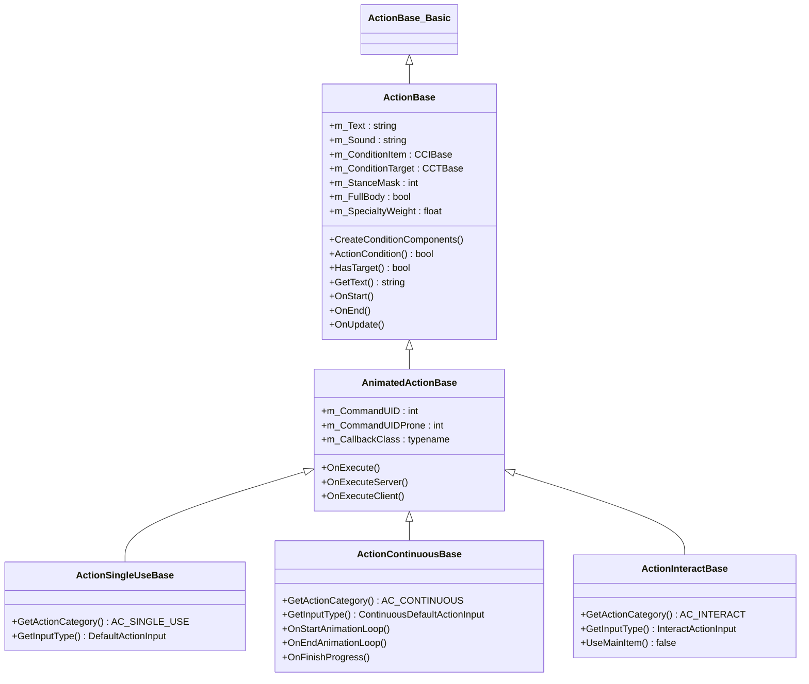
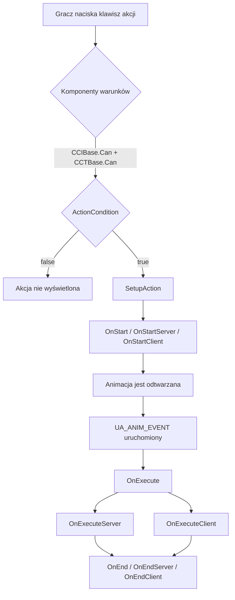
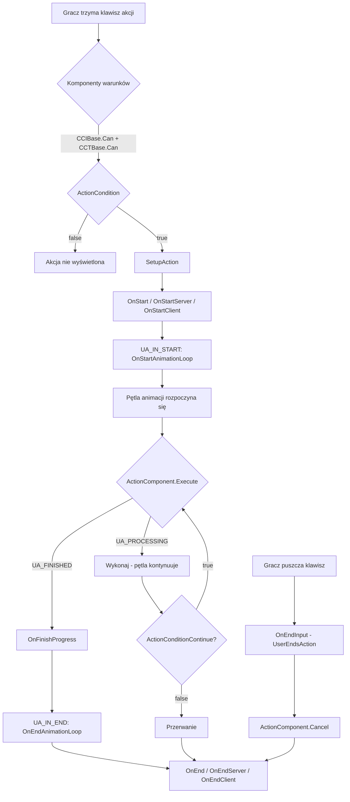
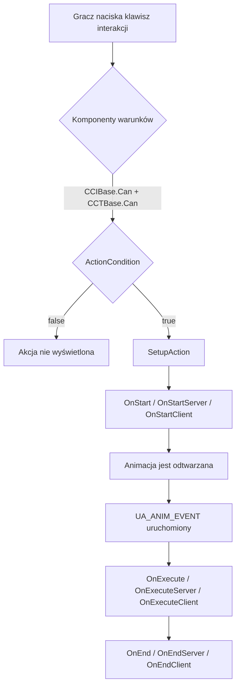

# Rozdział 6.12: System akcji

[Strona główna](../README.md) | [<< Poprzedni: Haki misji](11-mission-hooks.md) | **System akcji** | [Następny: System wejścia >>](13-input-system.md)

---

## Wprowadzenie

System akcji to sposób, w jaki DayZ obsługuje wszystkie interakcje gracza z przedmiotami i światem. Za każdym razem, gdy gracz je jedzenie, otwiera drzwi, bandażuje ranę, naprawia ścianę lub włącza latarkę, silnik przechodzi przez potok akcji. Zrozumienie tego potoku --- od sprawdzania warunków, przez callbacki animacji, po wykonanie na serwerze --- jest fundamentalne do tworzenia jakiegokolwiek interaktywnego moda rozgrywkowego.

System rezyduje głównie w `4_World/classes/useractionscomponent/` i jest zbudowany na trzech filarach:

1. **Klasy akcji**, które definiują co się dzieje (logika, warunki, animacje)
2. **Komponenty warunków**, które kontrolują kiedy akcja może się pojawić (odległość, stan przedmiotu, typ celu)
3. **Komponenty akcji**, które kontrolują jak akcja postępuje (czas, ilość, powtarzające się cykle)

Ten rozdział omawia pełne API, hierarchię klas, cykl życia i praktyczne wzorce tworzenia niestandardowych akcji.

---

## Hierarchia klas

```
ActionBase_Basic                         // 3_Game — pusta powłoka, kotwica kompilacji
└── ActionBase                           // 4_World — główna logika, warunki, zdarzenia
    └── AnimatedActionBase               // 4_World — callbacki animacji, OnExecute
        ├── ActionSingleUseBase          // akcje natychmiastowe (zjedz tabletkę, włącz światło)
        ├── ActionContinuousBase         // akcje z paskiem postępu (bandażowanie, naprawa, jedzenie)
        └── ActionInteractBase           // interakcje ze światem (otwieranie drzwi, przełączanie)
```



### Kluczowe różnice między typami akcji

| Właściwość | SingleUse | Continuous | Interact |
|----------|-----------|------------|----------|
| Stała kategorii | `AC_SINGLE_USE` | `AC_CONTINUOUS` | `AC_INTERACT` |
| Typ wejścia | `DefaultActionInput` | `ContinuousDefaultActionInput` | `InteractActionInput` |
| Pasek postępu | Nie | Tak | Nie |
| Używa głównego przedmiotu | Tak | Tak | Nie (domyślnie) |
| Ma cel | Różnie | Różnie | Tak (domyślnie) |
| Typowe zastosowanie | Zjedz tabletkę, przełącz latarkę | Bandażowanie, naprawa, jedzenie | Otwieranie drzwi, włączanie generatora |
| Klasa callbacku | `ActionSingleUseBaseCB` | `ActionContinuousBaseCB` | `ActionInteractBaseCB` |

---

## Cykl życia akcji

### Stany akcji

Maszyna stanów akcji używa tych stałych zdefiniowanych w `3_Game/constants.c`:

| Stała | Wartość | Znaczenie |
|----------|-------|---------|
| `UA_NONE` | 0 | Brak uruchomionej akcji |
| `UA_PROCESSING` | 2 | Akcja w trakcie |
| `UA_FINISHED` | 4 | Akcja zakończona pomyślnie |
| `UA_CANCEL` | 5 | Akcja anulowana przez gracza |
| `UA_INTERRUPT` | 6 | Akcja przerwana zewnętrznie |
| `UA_INITIALIZE` | 12 | Inicjalizacja akcji ciągłej |
| `UA_ERROR` | 24 | Stan błędu --- akcja przerwana |
| `UA_ANIM_EVENT` | 11 | Zdarzenie wykonania animacji uruchomione |
| `UA_IN_START` | 17 | Zdarzenie początku pętli animacji |
| `UA_IN_END` | 18 | Zdarzenie końca pętli animacji |

### Przepływ akcji SingleUse



### Przepływ akcji Continuous



### Przepływ akcji Interact



### Referencja metod cyklu życia

Te metody są wywoływane w kolejności podczas czasu życia akcji. Nadpisuj je w swoich niestandardowych akcjach:

| Metoda | Wywoływana na | Przeznaczenie |
|--------|-----------|---------|
| `CreateConditionComponents()` | Obu | Ustaw `m_ConditionItem` i `m_ConditionTarget` |
| `ActionCondition()` | Obu | Niestandardowa walidacja (odległość, stan, sprawdzenia typu) |
| `ActionConditionContinue()` | Obu | Tylko ciągłe: ponownie sprawdzane co klatkę podczas postępu |
| `SetupAction()` | Obu | Wewnętrzna: buduje `ActionData`, rezerwuje inwentarz |
| `OnStart()` | Obu | Akcja rozpoczyna się (anuluje umieszczanie jeśli aktywne) |
| `OnStartServer()` | Serwer | Logika startu po stronie serwera |
| `OnStartClient()` | Klient | Efekty startu po stronie klienta |
| `OnExecute()` | Obu | Zdarzenie animacji uruchomione --- główne wykonanie |
| `OnExecuteServer()` | Serwer | Logika wykonania po stronie serwera |
| `OnExecuteClient()` | Klient | Efekty wykonania po stronie klienta |
| `OnFinishProgress()` | Obu | Tylko ciągłe: jeden cykl zakończony |
| `OnFinishProgressServer()` | Serwer | Tylko ciągłe: cykl serwera zakończony |
| `OnFinishProgressClient()` | Klient | Tylko ciągłe: cykl klienta zakończony |
| `OnStartAnimationLoop()` | Obu | Tylko ciągłe: pętla animacji rozpoczyna się |
| `OnEndAnimationLoop()` | Obu | Tylko ciągłe: pętla animacji kończy się |
| `OnEnd()` | Obu | Akcja zakończona (sukces lub anulowanie) |
| `OnEndServer()` | Serwer | Czyszczenie po stronie serwera |
| `OnEndClient()` | Klient | Czyszczenie po stronie klienta |

---

## ActionData

Każda uruchomiona akcja niesie instancję `ActionData`, która przechowuje kontekst uruchomieniowy. Jest przekazywana do każdej metody cyklu życia:

```c
class ActionData
{
    ref ActionBase       m_Action;          // klasa akcji wykonywana
    ItemBase             m_MainItem;        // przedmiot w rękach gracza (lub null)
    ActionBaseCB         m_Callback;        // handler callbacku animacji
    ref CABase           m_ActionComponent;  // komponent postępu (czas, ilość)
    int                  m_State;           // aktualny stan (UA_PROCESSING itp.)
    ref ActionTarget     m_Target;          // obiekt docelowy + info o trafieniu
    PlayerBase           m_Player;          // gracz wykonujący akcję
    bool                 m_WasExecuted;     // true po uruchomieniu OnExecute
    bool                 m_WasActionStarted; // true po rozpoczęciu pętli akcji
}
```

Możesz rozszerzyć `ActionData` o niestandardowe dane. Nadpisz `CreateActionData()` w swojej akcji:

```c
class MyCustomActionData : ActionData
{
    int m_CustomValue;
}

class MyCustomAction : ActionContinuousBase
{
    override ActionData CreateActionData()
    {
        return new MyCustomActionData;
    }

    override void OnFinishProgressServer(ActionData action_data)
    {
        MyCustomActionData data = MyCustomActionData.Cast(action_data);
        data.m_CustomValue = data.m_CustomValue + 1;
        // ... użyj niestandardowych danych
    }
}
```

---

## ActionTarget

Klasa `ActionTarget` reprezentuje to, na co gracz celuje:

**Plik:** `4_World/classes/useractionscomponent/actiontargets.c`

```c
class ActionTarget
{
    Object GetObject();         // bezpośredni obiekt pod kursorem (lub dziecko proxy)
    Object GetParent();         // obiekt nadrzędny (jeśli cel jest proxy/załącznikiem)
    bool   IsProxy();           // true jeśli cel ma rodzica
    int    GetComponentIndex(); // indeks komponentu geometrii (nazwanej selekcji)
    float  GetUtility();        // wynik priorytetu
    vector GetCursorHitPos();   // dokładna pozycja świata trafienia kursora
}
```

### Jak cele są wybierane

Klasa `ActionTargets` uruchamia się co klatkę na kliencie, zbierając potencjalne cele:

1. **Raycast** z pozycji kamery w kierunku kamery (`c_RayDistance`)
2. **Skanowanie otoczenia** w poszukiwaniu pobliskich obiektów wokół gracza
3. Dla każdego kandydata silnik wywołuje `GetActions()` na obiekcie, aby znaleźć zarejestrowane akcje
4. Komponenty warunków każdej akcji (`CCIBase.Can()`, `CCTBase.Can()`) i `ActionCondition()` są testowane
5. Prawidłowe akcje są rankingowane wg użyteczności i wyświetlane w HUD

---

## Komponenty warunków

Każda akcja ma dwa komponenty warunków ustawiane w `CreateConditionComponents()`. Są one sprawdzane **przed** `ActionCondition()` i determinują, czy akcja może się w ogóle pojawić w HUD gracza.

### Warunki przedmiotu (CCIBase)

Kontrolują, czy przedmiot w ręce gracza kwalifikuje się do tej akcji.

**Plik:** `4_World/classes/useractionscomponent/itemconditioncomponents/`

| Klasa | Zachowanie |
|-------|----------|
| `CCINone` | Zawsze przechodzi --- brak wymagania przedmiotu |
| `CCIDummy` | Przechodzi jeśli przedmiot nie jest null (przedmiot musi istnieć) |
| `CCINonRuined` | Przechodzi jeśli przedmiot istnieje I nie jest zniszczony |
| `CCINotPresent` | Przechodzi jeśli przedmiot jest null (ręce muszą być puste) |
| `CCINotRuinedAndEmpty` | Przechodzi jeśli przedmiot istnieje, nie jest zniszczony i nie jest pusty |

```c
// CCINone — nie potrzeba przedmiotu, zawsze true
class CCINone : CCIBase
{
    override bool Can(PlayerBase player, ItemBase item) { return true; }
    override bool CanContinue(PlayerBase player, ItemBase item) { return true; }
}

// CCINotPresent — ręce muszą być puste
class CCINotPresent : CCIBase
{
    override bool Can(PlayerBase player, ItemBase item) { return !item; }
}

// CCINonRuined — przedmiot musi istnieć i nie być zniszczony
class CCINonRuined : CCIBase
{
    override bool Can(PlayerBase player, ItemBase item)
    {
        return (item && !item.IsDamageDestroyed());
    }
}
```

### Warunki celu (CCTBase)

Kontrolują, czy obiekt docelowy (na co gracz patrzy) się kwalifikuje.

**Plik:** `4_World/classes/useractionscomponent/targetconditionscomponents/`

| Klasa | Konstruktor | Zachowanie |
|-------|-------------|----------|
| `CCTNone` | `CCTNone()` | Zawsze przechodzi --- nie potrzeba celu |
| `CCTDummy` | `CCTDummy()` | Przechodzi jeśli obiekt docelowy istnieje |
| `CCTSelf` | `CCTSelf()` | Przechodzi jeśli gracz istnieje i żyje |
| `CCTObject` | `CCTObject(float dist)` | Obiekt docelowy w zasięgu dystansu |
| `CCTCursor` | `CCTCursor(float dist)` | Pozycja trafienia kursora w zasięgu dystansu |
| `CCTNonRuined` | `CCTNonRuined(float dist)` | Cel w zasięgu dystansu I nie zniszczony |
| `CCTCursorParent` | `CCTCursorParent(float dist)` | Kursor na obiekcie nadrzędnym w zasięgu dystansu |

Dystans jest mierzony zarówno od pozycji korzenia gracza, jak i pozycji kości głowy (bliższa wartość). Sprawdzenie `CCTObject`:

```c
class CCTObject : CCTBase
{
    protected float m_MaximalActionDistanceSq;

    void CCTObject(float maximal_target_distance = UAMaxDistances.DEFAULT)
    {
        m_MaximalActionDistanceSq = maximal_target_distance * maximal_target_distance;
    }

    override bool Can(PlayerBase player, ActionTarget target)
    {
        Object targetObject = target.GetObject();
        if (!targetObject || !player)
            return false;

        vector playerHeadPos;
        MiscGameplayFunctions.GetHeadBonePos(player, playerHeadPos);

        float distanceRoot = vector.DistanceSq(targetObject.GetPosition(), player.GetPosition());
        float distanceHead = vector.DistanceSq(targetObject.GetPosition(), playerHeadPos);

        return (distanceRoot <= m_MaximalActionDistanceSq || distanceHead <= m_MaximalActionDistanceSq);
    }
}
```

### Stałe dystansu

**Plik:** `4_World/classes/useractionscomponent/actions/actionconstants.c`

| Stała | Wartość (metry) | Typowe zastosowanie |
|----------|---------------|-------------|
| `UAMaxDistances.SMALL` | 1.3 | Bliskie interakcje, drabiny |
| `UAMaxDistances.DEFAULT` | 2.0 | Standardowe akcje |
| `UAMaxDistances.REPAIR` | 3.0 | Akcje naprawy |
| `UAMaxDistances.LARGE` | 8.0 | Akcje na dużym obszarze |
| `UAMaxDistances.BASEBUILDING` | 20.0 | Budowanie bazy |
| `UAMaxDistances.EXPLOSIVE_REMOTE_ACTIVATION` | 100.0 | Zdalna detonacja |

---

## Rejestrowanie akcji na przedmiotach

Akcje są rejestrowane na encjach przez wzorzec `SetActions()` / `AddAction()` / `RemoveAction()`. Silnik wywołuje `GetActions()` na encji, aby pobrać jej listę akcji; za pierwszym razem `InitializeActions()` buduje mapę przez `SetActions()`.

### Na ItemBase (Przedmioty inwentarza)

Najczęstszy wzorzec. Nadpisz `SetActions()` w `modded class`:

```c
modded class MyCustomItem extends ItemBase
{
    override void SetActions()
    {
        super.SetActions();          // KRYTYCZNE: zachowaj wszystkie vanillowe akcje
        AddAction(MyCustomAction);   // dodaj swoją akcję
    }
}
```

Aby usunąć vanillową akcję i dodać własne zastępstwo:

```c
modded class Bandage_Basic extends ItemBase
{
    override void SetActions()
    {
        super.SetActions();
        RemoveAction(ActionBandageTarget);       // usuń vanillową
        AddAction(MyImprovedBandageAction);      // dodaj zastępstwo
    }
}
```

### Na BuildingBase (Budynki świata)

Budynki używają tego samego wzorca, ale przez `BuildingBase`:

```c
// Przykład z vanilla: Studnia rejestruje akcje wody
class Well extends BuildingSuper
{
    override void SetActions()
    {
        super.SetActions();
        AddAction(ActionWashHandsWell);
        AddAction(ActionDrinkWellContinuous);
    }
}
```

### Na PlayerBase (Akcje gracza)

Akcje na poziomie gracza (picie z kałuż, otwieranie drzwi itp.) są rejestrowane w `PlayerBase.SetActions()`. Istnieją dwa sygnatury:

```c
// Nowoczesne podejście (zalecane) — używa parametru InputActionMap
void SetActions(out TInputActionMap InputActionMap)
{
    AddAction(ActionOpenDoors, InputActionMap);
    AddAction(ActionCloseDoors, InputActionMap);
    // ...
}

// Stare podejście (kompatybilność wsteczna) — niezalecane
void SetActions()
{
    // ...
}
```

Gracz ma również `SetActionsRemoteTarget()` dla akcji wykonywanych **na** graczu przez innego gracza (RKO, sprawdzanie pulsu itp.):

```c
void SetActionsRemoteTarget(out TInputActionMap InputActionMap)
{
    AddAction(ActionCPR, InputActionMap);
    AddAction(ActionCheckPulseTarget, InputActionMap);
}
```

### Jak działa system rejestracji wewnętrznie

Każdy typ encji utrzymuje statyczną `TInputActionMap` (a `map<typename, ref array<ActionBase_Basic>>`) kluczowaną typem wejścia. Gdy wywoływane jest `AddAction()`:

1. Singleton akcji jest pobierany z `ActionManagerBase.GetAction()`
2. Typ wejścia akcji jest odpytywany (`GetInputType()`)
3. Akcja jest wstawiana do tablicy dla tego typu wejścia
4. W czasie wykonania silnik odpytuje wszystkie akcje dla pasującego typu wejścia

Oznacza to, że akcje są współdzielone per **typ** (klasa), nie per instancja. Wszystkie przedmioty tej samej klasy współdzielą tę samą listę akcji.

---

## Tworzenie niestandardowej akcji --- Krok po kroku

### Przykład 1: Prosta akcja jednorazowego użytku

Niestandardowa akcja, która natychmiast leczy gracza gdy używa specjalnego przedmiotu:

```c
// Plik: 4_World/actions/ActionHealInstant.c

class ActionHealInstant : ActionSingleUseBase
{
    void ActionHealInstant()
    {
        m_CommandUID = DayZPlayerConstants.CMD_ACTIONMOD_EAT_PILL;
        m_CommandUIDProne = DayZPlayerConstants.CMD_ACTIONFB_EAT_PILL;
        m_Text = "#heal";  // klucz stringtable, lub zwykły tekst: "Heal"
    }

    override void CreateConditionComponents()
    {
        m_ConditionItem = new CCINonRuined;    // przedmiot nie może być zniszczony
        m_ConditionTarget = new CCTSelf;       // akcja na sobie
    }

    override bool HasTarget()
    {
        return false;  // nie potrzeba zewnętrznego celu
    }

    override bool HasProneException()
    {
        return true;  // pozwól na inną animację w pozycji leżącej
    }

    override bool ActionCondition(PlayerBase player, ActionTarget target, ItemBase item)
    {
        // Pokaż tylko jeśli gracz jest faktycznie ranny
        if (player.GetHealth("GlobalHealth", "Health") >= player.GetMaxHealth("GlobalHealth", "Health"))
            return false;

        return true;
    }

    override void OnExecuteServer(ActionData action_data)
    {
        // Ulecz gracza na serwerze
        PlayerBase player = action_data.m_Player;
        player.SetHealth("GlobalHealth", "Health", player.GetMaxHealth("GlobalHealth", "Health"));

        // Zużyj przedmiot (zmniejsz ilość o 1)
        ItemBase item = action_data.m_MainItem;
        if (item)
        {
            item.AddQuantity(-1);
        }
    }

    override void OnExecuteClient(ActionData action_data)
    {
        // Opcjonalnie: odtwórz efekt po stronie klienta, dźwięk lub powiadomienie
    }
}
```

Zarejestruj na przedmiocie:

```c
// Plik: 4_World/entities/HealingKit.c

modded class HealingKit extends ItemBase
{
    override void SetActions()
    {
        super.SetActions();
        AddAction(ActionHealInstant);
    }
}
```

### Przykład 2: Akcja ciągła z paskiem postępu

Niestandardowa akcja naprawy, która zajmuje czas i zużywa wytrzymałość przedmiotu:

```c
// Plik: 4_World/actions/ActionRepairCustom.c

// Krok 1: Zdefiniuj callback z komponentem akcji
class ActionRepairCustomCB : ActionContinuousBaseCB
{
    override void CreateActionComponent()
    {
        // CAContinuousTime(sekundy) — pojedynczy pasek postępu, który kończy się raz
        m_ActionData.m_ActionComponent = new CAContinuousTime(UATimeSpent.DEFAULT_REPAIR_CYCLE);
    }
}

// Krok 2: Zdefiniuj akcję
class ActionRepairCustom : ActionContinuousBase
{
    void ActionRepairCustom()
    {
        m_CallbackClass = ActionRepairCustomCB;
        m_CommandUID = DayZPlayerConstants.CMD_ACTIONFB_ASSEMBLE;
        m_FullBody = true;  // animacja pełnego ciała (gracz nie może się poruszać)
        m_StanceMask = DayZPlayerConstants.STANCEMASK_ERECT;
        m_SpecialtyWeight = UASoftSkillsWeight.ROUGH_HIGH;
        m_Text = "#repair";
    }

    override void CreateConditionComponents()
    {
        m_ConditionItem = new CCINonRuined;
        m_ConditionTarget = new CCTObject(UAMaxDistances.REPAIR);
    }

    override bool ActionCondition(PlayerBase player, ActionTarget target, ItemBase item)
    {
        Object obj = target.GetObject();
        if (!obj)
            return false;

        // Pozwól na naprawę tylko uszkodzonych (ale nie zniszczonych) obiektów
        EntityAI entity = EntityAI.Cast(obj);
        if (!entity)
            return false;

        float health = entity.GetHealth("", "Health");
        float maxHealth = entity.GetMaxHealth("", "Health");

        // Musi być uszkodzony, ale nie zniszczony
        if (health >= maxHealth || entity.IsDamageDestroyed())
            return false;

        return true;
    }

    override void OnFinishProgressServer(ActionData action_data)
    {
        // Wywoływane gdy pasek postępu się zakończy
        Object target = action_data.m_Target.GetObject();
        if (target)
        {
            EntityAI entity = EntityAI.Cast(target);
            if (entity)
            {
                // Przywróć trochę zdrowia
                float currentHealth = entity.GetHealth("", "Health");
                entity.SetHealth("", "Health", currentHealth + 25);
            }
        }

        // Uszkodź narzędzie
        action_data.m_MainItem.DecreaseHealth(UADamageApplied.REPAIR, false);
    }
}
```

### Przykład 3: Akcja interakcji (Przełączanie obiektu świata)

Akcja interakcji do włączania/wyłączania niestandardowego urządzenia:

```c
// Plik: 4_World/actions/ActionToggleMyDevice.c

class ActionToggleMyDevice : ActionInteractBase
{
    void ActionToggleMyDevice()
    {
        m_CommandUID = DayZPlayerConstants.CMD_ACTIONMOD_INTERACTONCE;
        m_StanceMask = DayZPlayerConstants.STANCEMASK_CROUCH | DayZPlayerConstants.STANCEMASK_ERECT;
        m_Text = "#switch_on";
    }

    override void CreateConditionComponents()
    {
        m_ConditionItem = new CCINone;     // nie potrzeba przedmiotu w rękach
        m_ConditionTarget = new CCTCursor(UAMaxDistances.DEFAULT);
    }

    override bool ActionCondition(PlayerBase player, ActionTarget target, ItemBase item)
    {
        Object obj = target.GetObject();
        if (!obj)
            return false;

        // Sprawdź czy cel to nasz typ niestandardowego urządzenia
        MyCustomDevice device = MyCustomDevice.Cast(obj);
        if (!device)
            return false;

        // Zaktualizuj tekst wyświetlany na podstawie aktualnego stanu
        if (device.IsActive())
            m_Text = "#switch_off";
        else
            m_Text = "#switch_on";

        return true;
    }

    override void OnExecuteServer(ActionData action_data)
    {
        MyCustomDevice device = MyCustomDevice.Cast(action_data.m_Target.GetObject());
        if (device)
        {
            if (device.IsActive())
                device.Deactivate();
            else
                device.Activate();
        }
    }
}
```

Zarejestruj na budynku/urządzeniu:

```c
class MyCustomDevice extends BuildingBase
{
    override void SetActions()
    {
        super.SetActions();
        AddAction(ActionToggleMyDevice);
    }
}
```

### Przykład 4: Akcja z konkretnym wymaganiem przedmiotu

Akcja wymagająca od gracza trzymania konkretnego typu narzędzia przy celowaniu w konkretny obiekt:

```c
class ActionUnlockWithKey : ActionInteractBase
{
    void ActionUnlockWithKey()
    {
        m_CommandUID = DayZPlayerConstants.CMD_ACTIONMOD_INTERACTONCE;
        m_Text = "Unlock";
    }

    override void CreateConditionComponents()
    {
        m_ConditionItem = new CCINonRuined;   // musi trzymać niezniszczony przedmiot
        m_ConditionTarget = new CCTObject(UAMaxDistances.DEFAULT);
    }

    override bool UseMainItem()
    {
        return true;  // akcja wymaga przedmiotu w ręce
    }

    override bool MainItemAlwaysInHands()
    {
        return true;  // przedmiot musi być w rękach, nie tylko w inwentarzu
    }

    override bool ActionCondition(PlayerBase player, ActionTarget target, ItemBase item)
    {
        // Przedmiot musi być kluczem
        if (!item || !item.IsInherited(MyKeyItem))
            return false;

        // Cel musi być zamkniętym kontenerem
        MyLockedContainer container = MyLockedContainer.Cast(target.GetObject());
        if (!container || !container.IsLocked())
            return false;

        return true;
    }

    override void OnExecuteServer(ActionData action_data)
    {
        MyLockedContainer container = MyLockedContainer.Cast(action_data.m_Target.GetObject());
        if (container)
        {
            container.Unlock();
        }
    }
}
```

---

## Komponenty akcji (Kontrola postępu)

Komponenty akcji kontrolują _jak_ akcja postępuje w czasie. Są tworzone w metodzie `CreateActionComponent()` callbacku.

**Plik:** `4_World/classes/useractionscomponent/actioncomponents/`

### Dostępne komponenty

| Komponent | Parametry | Zachowanie |
|-----------|------------|----------|
| `CASingleUse` | brak | Natychmiastowe wykonanie, brak postępu |
| `CAInteract` | brak | Natychmiastowe wykonanie dla akcji interakcji |
| `CAContinuousTime` | `float time` | Pasek postępu, kończy się po `time` sekundach |
| `CAContinuousRepeat` | `float time` | Powtarzające się cykle, uruchamia `OnFinishProgress` przy każdym cyklu |
| `CAContinuousQuantity` | `float quantity, float time` | Zużywa ilość w czasie |
| `CAContinuousQuantityEdible` | `float quantity, float time` | Jak Quantity, ale stosuje modyfikatory jedzenia/picia |

### CAContinuousTime

Pojedynczy pasek postępu, który kończy się raz:

```c
class MyActionCB : ActionContinuousBaseCB
{
    override void CreateActionComponent()
    {
        // 5-sekundowy pasek postępu
        m_ActionData.m_ActionComponent = new CAContinuousTime(UATimeSpent.DEFAULT_CONSTRUCT);
    }
}
```

### CAContinuousRepeat

Powtarzające się cykle --- `OnFinishProgressServer()` jest wywoływane za każdym razem, gdy cykl się kończy, a akcja kontynuuje dopóki gracz nie puści klawisza:

```c
class MyRepeatActionCB : ActionContinuousBaseCB
{
    override void CreateActionComponent()
    {
        // Każdy cykl trwa 5 sekund, powtarza się dopóki gracz nie przestanie
        m_ActionData.m_ActionComponent = new CAContinuousRepeat(UATimeSpent.DEFAULT_REPAIR_CYCLE);
    }
}
```

### Stałe czasu

**Plik:** `4_World/classes/useractionscomponent/actions/actionconstants.c`

| Stała | Wartość (sekundy) | Zastosowanie |
|----------|----------------|-----|
| `UATimeSpent.DEFAULT` | 1.0 | Ogólne |
| `UATimeSpent.DEFAULT_CONSTRUCT` | 5.0 | Budowanie |
| `UATimeSpent.DEFAULT_REPAIR_CYCLE` | 5.0 | Naprawa na cykl |
| `UATimeSpent.DEFAULT_DEPLOY` | 5.0 | Rozmieszczanie przedmiotów |
| `UATimeSpent.BANDAGE` | 4.0 | Bandażowanie |
| `UATimeSpent.RESTRAIN` | 10.0 | Wiązanie |
| `UATimeSpent.SHAVE` | 12.75 | Golenie |
| `UATimeSpent.SKIN` | 10.0 | Skórowanie zwierząt |
| `UATimeSpent.DIG_STASH` | 10.0 | Kopanie skrytki |

---

## Adnotowane przykłady z vanilla

### ActionOpenDoors (Interakcja)

**Plik:** `4_World/classes/useractionscomponent/actions/interact/actionopendoors.c`

```c
class ActionOpenDoors : ActionInteractBase
{
    void ActionOpenDoors()
    {
        m_CommandUID  = DayZPlayerConstants.CMD_ACTIONMOD_OPENDOORFW;
        m_StanceMask  = DayZPlayerConstants.STANCEMASK_CROUCH | DayZPlayerConstants.STANCEMASK_ERECT;
        m_Text        = "#open";   // referencja stringtable
    }

    override void CreateConditionComponents()
    {
        m_ConditionItem   = new CCINone();      // nie potrzeba przedmiotu
        m_ConditionTarget = new CCTCursor();     // kursor musi być na czymś
    }

    override bool ActionCondition(PlayerBase player, ActionTarget target, ItemBase item)
    {
        if (!target)
            return false;

        Building building;
        if (Class.CastTo(building, target.GetObject()))
        {
            int doorIndex = building.GetDoorIndex(target.GetComponentIndex());
            if (doorIndex != -1)
            {
                if (!IsInReach(player, target, UAMaxDistances.DEFAULT))
                    return false;
                return building.CanDoorBeOpened(doorIndex, true);
            }
        }
        return false;
    }

    override void OnStartServer(ActionData action_data)
    {
        super.OnStartServer(action_data);
        Building building;
        if (Class.CastTo(building, action_data.m_Target.GetObject()))
        {
            int doorIndex = building.GetDoorIndex(action_data.m_Target.GetComponentIndex());
            if (doorIndex != -1 && building.CanDoorBeOpened(doorIndex, true))
                building.OpenDoor(doorIndex);
        }
    }
}
```

Kluczowe wnioski:
- Używa `OnStartServer()` (nie `OnExecuteServer()`), ponieważ akcje interakcji uruchamiają się natychmiast
- `GetComponentIndex()` pobiera, na które drzwi gracz patrzy
- Sprawdzenie dystansu robione ręcznie z `IsInReach()` oraz przez `CCTCursor`

### ActionTurnOnPowerGenerator (Interakcja)

**Plik:** `4_World/classes/useractionscomponent/actions/interact/actionturnonpowergenerator.c`

```c
class ActionTurnOnPowerGenerator : ActionInteractBase
{
    void ActionTurnOnPowerGenerator()
    {
        m_CommandUID = DayZPlayerConstants.CMD_ACTIONMOD_INTERACTONCE;
        m_Text = "#switch_on";
    }

    override bool ActionCondition(PlayerBase player, ActionTarget target, ItemBase item)
    {
        PowerGeneratorBase pg = PowerGeneratorBase.Cast(target.GetObject());
        if (pg)
        {
            return pg.HasEnergyManager()
                && pg.GetCompEM().CanSwitchOn()
                && pg.HasSparkplug()
                && pg.GetCompEM().CanWork();
        }
        return false;
    }

    override void OnExecuteServer(ActionData action_data)
    {
        ItemBase target_IB = ItemBase.Cast(action_data.m_Target.GetObject());
        if (target_IB)
        {
            target_IB.GetCompEM().SwitchOn();
            target_IB.GetCompEM().InteractBranch(target_IB);
        }
    }
}
```

Kluczowe wnioski:
- Dziedziczy domyślne `CreateConditionComponents()` z `ActionInteractBase` (`CCINone` + `CCTObject(DEFAULT)`)
- Używa `OnExecuteServer()` do właściwego przełączenia --- uruchamia się na zdarzeniu animacji
- Wiele sprawdzeń warunków połączonych w `ActionCondition()`

### ActionEat (Ciągła)

**Plik:** `4_World/classes/useractionscomponent/actions/continuous/actioneat.c`

```c
class ActionEatBigCB : ActionContinuousBaseCB
{
    override void CreateActionComponent()
    {
        m_ActionData.m_ActionComponent = new CAContinuousQuantityEdible(
            UAQuantityConsumed.EAT_BIG,   // 25 jednostek zużywanych na cykl
            UATimeSpent.DEFAULT            // 1 sekunda na cykl
        );
    }
}

class ActionEatBig : ActionConsume
{
    void ActionEatBig()
    {
        m_CallbackClass = ActionEatBigCB;
        m_Text = "#eat";
    }

    override void CreateConditionComponents()
    {
        m_ConditionItem = new CCINonRuined;
        m_ConditionTarget = new CCTSelf;
    }

    override bool HasTarget()
    {
        return false;
    }
}
```

Kluczowe wnioski:
- Klasa callbacku kontroluje tempo (`CAContinuousQuantityEdible`)
- `ActionConsume` (rodzic) obsługuje całą logikę konsumpcji jedzenia
- `HasTarget()` zwraca false --- jedzenie to akcja na sobie
- Różne rozmiary jedzenia po prostu zamieniają klasę callbacku z różnymi wartościami `UAQuantityConsumed`

---

## Zaawansowane tematy

### Maski warunków akcji

Akcje mogą być ograniczone do konkretnych stanów gracza używając `ActionConditionMask`:

```c
enum ActionConditionMask
{
    ACM_NO_EXEPTION    = 0,     // brak specjalnych warunków
    ACM_IN_VEHICLE     = 1,     // można użyć w pojeździe
    ACM_ON_LADDER      = 2,     // można użyć na drabinie
    ACM_SWIMMING       = 4,     // można użyć podczas pływania
    ACM_RESTRAIN       = 8,     // można użyć będąc skrępowanym
    ACM_RAISED         = 16,    // można użyć z podniesioną bronią
    ACM_ON_BACK        = 32,    // można użyć leżąc na plecach
    ACM_THROWING       = 64,    // można użyć podczas rzucania
    ACM_LEANING        = 128,   // można użyć podczas wychylania
    ACM_BROKEN_LEGS    = 256,   // można użyć ze złamanymi nogami
    ACM_IN_FREELOOK    = 512,   // można użyć w swobodnym rozglądaniu
}
```

Nadpisz odpowiednie metody w swojej akcji, aby je włączyć:

```c
class MyVehicleAction : ActionSingleUseBase
{
    override bool CanBeUsedInVehicle()  { return true; }
    override bool CanBeUsedSwimming()   { return false; }
    override bool CanBeUsedOnLadder()   { return false; }
    override bool CanBeUsedInRestrain() { return false; }
}
```

### Animacje pełnego ciała vs addytywne

Akcje mogą być **addytywne** (gracz może chodzić) lub **pełnego ciała** (gracz jest zablokowany w miejscu):

```c
class MyFullBodyAction : ActionContinuousBase
{
    void MyFullBodyAction()
    {
        m_FullBody = true;   // gracz nie może się poruszać podczas akcji
        m_CommandUID = DayZPlayerConstants.CMD_ACTIONFB_ASSEMBLE;
        m_StanceMask = DayZPlayerConstants.STANCEMASK_ERECT;
    }
}
```

- **Addytywne** (`m_FullBody = false`): Używa UID poleceń `CMD_ACTIONMOD_*`. Gracz może chodzić.
- **Pełnego ciała** (`m_FullBody = true`): Używa UID poleceń `CMD_ACTIONFB_*`. Gracz jest nieruchomy.

### Wyjątek pozycji leżącej

Niektóre akcje potrzebują różnych animacji w pozycji leżącej vs stojącej:

```c
override bool HasProneException()
{
    return true;  // używa m_CommandUIDProne gdy gracz leży
}
```

Gdy `HasProneException()` zwraca true, silnik używa `m_CommandUIDProne` zamiast `m_CommandUID`, jeśli gracz jest w pozycji leżącej.

### Przerywanie akcji

Akcje mogą być przerywane po stronie serwera przez callback:

```c
override void OnFinishProgressServer(ActionData action_data)
{
    // Sprawdź czy akcja powinna być przerwana
    if (SomeConditionFailed())
    {
        if (action_data.m_Callback)
            action_data.m_Callback.Interrupt();
        return;
    }

    // Normalne wykonanie...
}
```

### Wykonanie z inwentarza i paska szybkiego dostępu

Akcje mogą być skonfigurowane do uruchamiania z ekranu inwentarza lub paska szybkiego dostępu:

```c
override bool CanBePerformedFromInventory()
{
    return true;   // akcja pojawia się w menu kontekstowym przedmiotu w inwentarzu
}

override bool CanBePerformedFromQuickbar()
{
    return true;   // akcja może być uruchomiona przez pasek szybkiego dostępu
}
```

### Blokowanie celu przy użyciu

Domyślnie akcje z celami blokują cel, aby tylko jeden gracz mógł wchodzić w interakcję jednocześnie:

```c
override bool IsLockTargetOnUse()
{
    return false;  // pozwól wielu graczom na jednoczesną interakcję
}
```

---

## Stałe kategorii akcji

**Plik:** `4_World/classes/useractionscomponent/_constants.c`

| Stała | Wartość | Opis |
|----------|-------|-------------|
| `AC_UNCATEGORIZED` | 0 | Domyślna --- nie powinna być używana |
| `AC_SINGLE_USE` | 1 | Akcje jednorazowego użytku |
| `AC_CONTINUOUS` | 2 | Akcje ciągłe (pasek postępu) |
| `AC_INTERACT` | 3 | Akcje interakcji |

---

## Częste błędy

### 1. Zapomnienie `super.SetActions()`

**Źle:**
```c
modded class Apple extends ItemBase
{
    override void SetActions()
    {
        // Brak super.SetActions()!
        AddAction(MyCustomEatAction);
    }
}
```

To **usuwa wszystkie vanillowe akcje** z przedmiotu. Gracz nie będzie mógł jeść, upuszczać ani w inny sposób wchodzić w interakcję z jabłkami przez standardowe akcje.

**Dobrze:**
```c
modded class Apple extends ItemBase
{
    override void SetActions()
    {
        super.SetActions();          // zachowaj vanillowe akcje
        AddAction(MyCustomEatAction);
    }
}
```

### 2. Umieszczanie logiki serwera w OnExecuteClient

**Źle:**
```c
override void OnExecuteClient(ActionData action_data)
{
    action_data.m_Player.SetHealth("GlobalHealth", "Health", 100);  // BEZ EFEKTU
    action_data.m_MainItem.Delete();  // tylko po stronie klienta, spowoduje desync
}
```

Zmiany zdrowia i operacje inwentarza muszą się odbywać na serwerze. `OnExecuteClient` służy wyłącznie do wizualnej informacji zwrotnej (dźwięki, efekty cząsteczkowe, aktualizacje UI).

**Dobrze:**
```c
override void OnExecuteServer(ActionData action_data)
{
    action_data.m_Player.SetHealth("GlobalHealth", "Health", 100);
    action_data.m_MainItem.Delete();
}

override void OnExecuteClient(ActionData action_data)
{
    // Tylko wizualna informacja zwrotna
}
```

### 3. Brak sprawdzenia null w ActionCondition

**Źle:**
```c
override bool ActionCondition(PlayerBase player, ActionTarget target, ItemBase item)
{
    return target.GetObject().IsInherited(MyClass);  // AWARIA jeśli target lub obiekt jest null
}
```

**Dobrze:**
```c
override bool ActionCondition(PlayerBase player, ActionTarget target, ItemBase item)
{
    if (!target)
        return false;

    Object obj = target.GetObject();
    if (!obj)
        return false;

    return obj.IsInherited(MyClass);
}
```

### 4. Złe komponenty warunków (Akcja nigdy się nie pojawia)

**Problem:** Akcja nie pokazuje się w HUD.

Częste przyczyny:
- `CCIDummy` wymaga przedmiotu w ręce, ale akcja powinna działać z pustymi rękami --- użyj zamiast tego `CCINone`
- `CCTDummy` wymaga obiektu docelowego, ale akcja to akcja na sobie --- użyj `CCTSelf` lub `CCTNone`
- Dystans `CCTObject` zbyt mały dla typu celu --- zwiększ parametr dystansu
- `HasTarget()` zwraca true, ale nie ma prawidłowego warunku celu --- albo dodaj `CCTCursor`/`CCTObject`, albo ustaw `HasTarget()` na false

### 5. Pomylenie OnStart z OnExecute

- `OnStart` / `OnStartServer`: Wywoływane gdy akcja **rozpoczyna się** (animacja startuje). Użyj do konfiguracji, rezerwacji przedmiotów.
- `OnExecute` / `OnExecuteServer`: Wywoływane gdy **zdarzenie animacji się uruchamia** (moment "zrób"). Użyj do właściwego efektu.

Dla akcji interakcji `OnStartServer` jest powszechnie używane, ponieważ akcja jest natychmiastowa. Dla akcji jednorazowego użytku `OnExecuteServer` uruchamia się na zdarzeniu animacji. Wybierz odpowiedni w zależności od tego, kiedy efekt powinien nastąpić.

### 6. Akcja ciągła nie powtarza się

Jeśli twoja akcja ciągła kończy się raz i zatrzymuje zamiast się powtarzać, używasz `CAContinuousTime` (pojedyncze zakończenie). Przełącz na `CAContinuousRepeat` dla powtarzających się cykli:

```c
// Pojedyncze zakończenie — pasek postępu wypełnia się raz, potem akcja kończy się
m_ActionData.m_ActionComponent = new CAContinuousTime(5.0);

// Powtarzanie — pasek postępu wypełnia się, uruchamia OnFinishProgress, resetuje się, kontynuuje
m_ActionData.m_ActionComponent = new CAContinuousRepeat(5.0);
```

### 7. Akcja pojawia się na złych przedmiotach

Pamiętaj: `SetActions()` jest wywoływane per **typ klasy**, nie per instancja. Jeśli dodasz akcję w klasie nadrzędnej, wszystkie dzieci ją odziedziczą. Jeśli chcesz akcję tylko na konkretnych podklasach:
- Dodaj ją tylko w `SetActions()` konkretnej podklasy
- Dodaj sprawdzenie typu w `ActionCondition()` jako zabezpieczenie

### 8. Zapomnienie nadpisania HasTarget()

Jeśli twoja akcja to akcja na sobie (jedzenie, leczenie, przełączanie trzymanego przedmiotu), musisz nadpisać:

```c
override bool HasTarget()
{
    return false;
}
```

Bez tego silnik oczekuje obiektu docelowego i może nie wyświetlić akcji, lub będzie próbował zsynchronizować nieistniejący cel z serwerem.

---

## Szybka referencja lokalizacji plików

| Plik | Przeznaczenie |
|------|---------|
| `4_World/classes/useractionscomponent/actionbase.c` | `ActionBase` --- główna klasa akcji |
| `4_World/classes/useractionscomponent/animatedactionbase.c` | `AnimatedActionBase` + `ActionBaseCB` |
| `4_World/classes/useractionscomponent/actions/actionsingleusebase.c` | `ActionSingleUseBase` |
| `4_World/classes/useractionscomponent/actions/actioncontinuousbase.c` | `ActionContinuousBase` |
| `4_World/classes/useractionscomponent/actions/actioninteractbase.c` | `ActionInteractBase` |
| `4_World/classes/useractionscomponent/actions/actionconstants.c` | `UATimeSpent`, `UAMaxDistances`, `UAQuantityConsumed` |
| `4_World/classes/useractionscomponent/_constants.c` | `AC_SINGLE_USE`, `AC_CONTINUOUS`, `AC_INTERACT` |
| `4_World/classes/useractionscomponent/actiontargets.c` | `ActionTarget`, `ActionTargets` |
| `4_World/classes/useractionscomponent/itemconditioncomponents/` | Klasy `CCI*` |
| `4_World/classes/useractionscomponent/targetconditionscomponents/` | Klasy `CCT*` |
| `4_World/classes/useractionscomponent/actioncomponents/` | Komponenty postępu `CA*` |
| `3_Game/constants.c` | `UA_NONE`, `UA_PROCESSING`, `UA_FINISHED` itp. |

---

## Podsumowanie

System akcji DayZ podąża za spójnym wzorcem:

1. **Wybierz klasę bazową**: `ActionSingleUseBase` dla natychmiastowych, `ActionContinuousBase` dla czasowych, `ActionInteractBase` dla przełączników świata
2. **Ustaw komponenty warunków** w `CreateConditionComponents()`: CCI dla wymagań przedmiotu, CCT dla wymagań celu
3. **Dodaj niestandardową walidację** w `ActionCondition()`: sprawdzenia typu, stanu, dystansu
4. **Zaimplementuj logikę serwera** w `OnExecuteServer()` lub `OnFinishProgressServer()`
5. **Zarejestruj akcję** przez `AddAction()` w `SetActions()` odpowiedniej encji
6. **Zawsze wywołuj `super.SetActions()`**, aby zachować vanillowe akcje

System jest zaprojektowany jako modularny: komponenty warunków obsługują "czy to może się wydarzyć?", komponenty akcji obsługują "jak długo to trwa?", a twoje nadpisania obsługują "co to robi?". Logikę serwera trzymaj na serwerze, wizualną informację zwrotną na kliencie i zawsze sprawdzaj null swoich celów.

---

## Najlepsze praktyki

- **Zawsze wywołuj `super.SetActions()` przy moddowaniu istniejących przedmiotów.** Pominięcie tego usuwa wszystkie vanillowe akcje (jedz, upuść, zbadaj) z przedmiotu, psując podstawową rozgrywkę.
- **Umieszczaj całą logikę zmieniającą stan w `OnExecuteServer` lub `OnFinishProgressServer`.** Zmiany zdrowia, usuwanie przedmiotów i manipulacja inwentarzem muszą działać po stronie serwera. `OnExecuteClient` służy wyłącznie wizualnej informacji zwrotnej.
- **Używaj `CCTObject` z odpowiednimi stałymi dystansu.** Hardkodowanie sprawdzeń dystansu w `ActionCondition()` jest kruche. Wbudowane komponenty warunków obsługują ograniczanie dystansu, wyrównanie kursora i sprawdzanie stanu przedmiotów w sposób spójny.
- **Sprawdzaj null na każdym obiekcie w `ActionCondition()`.** Metoda jest wywoływana często z potencjalnie nullowymi celami. Dostęp do `.GetObject()` bez zabezpieczenia powoduje awarie trudne do zdiagnozowania.
- **Preferuj `CAContinuousRepeat` nad `CAContinuousTime` dla akcji w stylu naprawy.** Repeat uruchamia `OnFinishProgressServer` przy każdym cyklu i kontynuuje dopóki gracz nie puści klawisza, co jest bardziej naturalne dla trwających zadań.

---

## Kompatybilność i wpływ

- **Wiele modów:** Akcje są rejestrowane per typ klasy przez `SetActions()`. Dwa mody dodające różne akcje do tej samej klasy przedmiotu oba działają -- akcje się kumulują. Jednak jeśli oba mody nadpisują `SetActions()` bez wywołania `super`, przetrwają tylko akcje ostatnio załadowanego moda.
- **Wydajność:** `ActionCondition()` jest ewaluowane co klatkę dla każdej kandydackiej akcji na aktualnym celu gracza. Utrzymuj je lekkie -- unikaj kosztownych raycastów, wyszukiwań konfiguracji lub iteracji tablic wewnątrz sprawdzeń warunków.
- **Serwer/Klient:** Potok akcji jest podzielony: sprawdzenia warunków i wyświetlanie UI działają na kliencie, callbacki wykonania działają na serwerze. Silnik obsługuje synchronizację przez wewnętrzne RPC. Nigdy nie polegaj na stanie po stronie klienta dla autorytarnej logiki gry.
