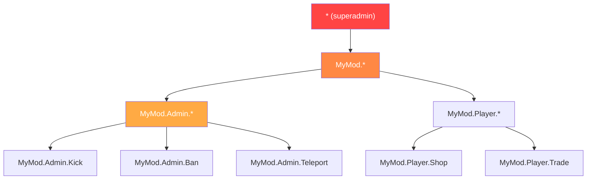

# Rozdział 7.5: Systemy uprawnień

[Strona główna](../README.md) | [<< Poprzedni: Trwałość konfiguracji](04-config-persistence.md) | **Systemy uprawnień** | [Dalej: Architektura zdarzeniowa >>](06-events.md)

---

## Wprowadzenie

Każde narzędzie administracyjne, każda uprzywilejowana akcja i każda funkcja moderacji w DayZ potrzebuje systemu uprawnień. Pytanie nie brzmi czy sprawdzać uprawnienia, ale jak je zorganizować. Społeczność moddingu DayZ ustaliła trzy główne wzorce: hierarchiczne uprawnienia rozdzielone kropkami, przypisanie ról do grup użytkowników (VPP) oraz dostęp oparty na rolach na poziomie frameworku (CF/COT). Każdy ma inne kompromisy w granularności, złożoności i doświadczeniu właściciela serwera.

Ten rozdział obejmuje wszystkie trzy wzorce, przepływ sprawdzania uprawnień, formaty przechowywania oraz obsługę wildcardów i superadmina.

---

## Spis treści

- [Dlaczego uprawnienia mają znaczenie](#dlaczego-uprawnienia-mają-znaczenie)
- [Hierarchiczne rozdzielone kropkami (wzorzec MyMod)](#hierarchiczne-rozdzielone-kropkami-wzorzec-mymod)
- [Wzorzec VPP UserGroup](#wzorzec-vpp-usergroup)
- [Wzorzec CF oparty na rolach (COT)](#wzorzec-cf-oparty-na-rolach-cot)
- [Przepływ sprawdzania uprawnień](#przepływ-sprawdzania-uprawnień)
- [Formaty przechowywania](#formaty-przechowywania)
- [Wzorce wildcardów i superadmina](#wzorce-wildcardów-i-superadmina)
- [Migracja między systemami](#migracja-między-systemami)
- [Dobre praktyki](#dobre-praktyki)

---

## Dlaczego uprawnienia mają znaczenie

Bez systemu uprawnień masz dwie opcje: albo każdy gracz może robić wszystko (chaos), albo zakodujesz na stałe ID Steam64 w skryptach (nie do utrzymania). System uprawnień pozwala właścicielom serwerów definiować kto co może robić, bez modyfikowania kodu.

Trzy zasady bezpieczeństwa:

1. **Nigdy nie ufaj klientowi.** Klient wysyła żądanie; serwer decyduje czy je honorować.
2. **Domyślna odmowa.** Jeśli gracz nie ma jawnie przyznanego uprawnienia, nie ma go.
3. **Zamknięcie przy awarii.** Jeśli samo sprawdzenie uprawnienia zawiedzie (null identity, uszkodzone dane), odmów akcji.

---

## Hierarchiczne rozdzielone kropkami (wzorzec MyMod)

MyMod używa stringów uprawnień rozdzielonych kropkami, zorganizowanych w hierarchię drzewa. Każde uprawnienie to ścieżka jak `"MyMod.Admin.Teleport"` lub `"MyMod.Missions.Start"`. Wildcardy pozwalają przyznawać całe poddrzewa.

### Format uprawnień

```
MyMod                           (główna przestrzeń nazw)
├── Admin                        (narzędzia administracyjne)
│   ├── Panel                    (otwarcie panelu admina)
│   ├── Teleport                 (teleportacja siebie/innych)
│   ├── Kick                     (wyrzucanie graczy)
│   ├── Ban                      (banowanie graczy)
│   └── Weather                  (zmiana pogody)
├── Missions                     (system misji)
│   ├── Start                    (ręczne uruchamianie misji)
│   └── Stop                     (zatrzymywanie misji)
└── AI                           (system AI)
    ├── Spawn                    (ręczne spawnowanie AI)
    └── Config                   (edycja konfiguracji AI)
```

### Model danych

Każdy gracz (identyfikowany przez Steam64 ID) ma tablicę przyznanych stringów uprawnień:

```c
class MyPermissionsData
{
    // klucz: Steam64 ID, wartość: tablica stringów uprawnień
    ref map<string, ref TStringArray> Admins;

    void MyPermissionsData()
    {
        Admins = new map<string, ref TStringArray>();
    }
};
```

### Sprawdzanie uprawnień

Sprawdzenie przechodzi przez przyznane uprawnienia gracza i obsługuje trzy typy dopasowania: dokładne dopasowanie, pełny wildcard (`"*"`) i wildcard prefiksu (`"MyMod.Admin.*"`):

```c
bool HasPermission(string plainId, string permission)
{
    if (plainId == "" || permission == "")
        return false;

    TStringArray perms;
    if (!m_Permissions.Find(plainId, perms))
        return false;

    for (int i = 0; i < perms.Count(); i++)
    {
        string granted = perms[i];

        // Pełny wildcard: superadmin
        if (granted == "*")
            return true;

        // Dokładne dopasowanie
        if (granted == permission)
            return true;

        // Wildcard prefiksu: "MyMod.Admin.*" dopasowuje "MyMod.Admin.Teleport"
        if (granted.IndexOf("*") > 0)
        {
            string prefix = granted.Substring(0, granted.Length() - 1);
            if (permission.IndexOf(prefix) == 0)
                return true;
        }
    }

    return false;
}
```

### Przechowywanie JSON

```json
{
    "Admins": {
        "76561198000000001": ["*"],
        "76561198000000002": ["MyMod.Admin.Panel", "MyMod.Admin.Teleport"],
        "76561198000000003": ["MyMod.Missions.*"],
        "76561198000000004": ["MyMod.Admin.Kick", "MyMod.Admin.Ban"]
    }
}
```

### Mocne strony

- **Drobnoziarniste:** możesz przyznać dokładnie te uprawnienia, których potrzebuje każdy admin
- **Hierarchiczne:** wildcardy przyznają całe poddrzewa bez wymienienia każdego uprawnienia
- **Samodokumentujące:** string uprawnienia mówi co kontroluje
- **Rozszerzalne:** nowe uprawnienia to po prostu nowe stringi --- bez zmian schematu

### Słabe strony

- **Brak nazwanych ról:** jeśli 10 adminów potrzebuje tego samego zestawu, wymieniasz go 10 razy
- **Oparte na stringach:** literówki w stringach uprawnień zawiodą cicho (po prostu się nie dopasują)

---

## Wzorzec VPP UserGroup

VPP Admin Tools używa systemu opartego na grupach. Definiujesz nazwane grupy (role) z zestawami uprawnień, potem przypisujesz graczy do grup.

### Koncepcja

```
Grupy:
  "SuperAdmin"  → [wszystkie uprawnienia]
  "Moderator"   → [kick, ban, mute, teleport]
  "Builder"     → [spawn obiektów, teleport, ESP]

Gracze:
  "76561198000000001" → "SuperAdmin"
  "76561198000000002" → "Moderator"
  "76561198000000003" → "Builder"
```

### Wzorzec implementacji

```c
class VPPUserGroup
{
    string GroupName;
    ref array<string> Permissions;
    ref array<string> Members;  // Steam64 IDs

    bool HasPermission(string permission)
    {
        if (!Permissions) return false;

        for (int i = 0; i < Permissions.Count(); i++)
        {
            if (Permissions[i] == permission)
                return true;
            if (Permissions[i] == "*")
                return true;
        }
        return false;
    }
};

class VPPPermissionManager
{
    ref array<ref VPPUserGroup> m_Groups;

    bool PlayerHasPermission(string plainId, string permission)
    {
        for (int i = 0; i < m_Groups.Count(); i++)
        {
            VPPUserGroup group = m_Groups[i];

            // Sprawdź czy gracz jest w tej grupie
            if (group.Members.Find(plainId) == -1)
                continue;

            if (group.HasPermission(permission))
                return true;
        }
        return false;
    }
};
```

### Przechowywanie JSON

```json
{
    "Groups": [
        {
            "GroupName": "SuperAdmin",
            "Permissions": ["*"],
            "Members": ["76561198000000001"]
        },
        {
            "GroupName": "Moderator",
            "Permissions": [
                "admin.kick",
                "admin.ban",
                "admin.mute",
                "admin.teleport"
            ],
            "Members": [
                "76561198000000002",
                "76561198000000003"
            ]
        },
        {
            "GroupName": "Builder",
            "Permissions": [
                "admin.spawn",
                "admin.teleport",
                "admin.esp"
            ],
            "Members": [
                "76561198000000004"
            ]
        }
    ]
}
```

### Mocne strony

- **Oparte na rolach:** zdefiniuj rolę raz, przypisz ją wielu graczom
- **Znajome:** właściciele serwerów rozumieją systemy grup/ról z innych gier
- **Łatwe zmiany masowe:** zmień uprawnienia grupy i wszyscy członkowie są zaktualizowani

### Słabe strony

- **Mniej granularne bez dodatkowej pracy:** danie jednemu konkretnemu adminowi jednego dodatkowego uprawnienia oznacza stworzenie nowej grupy lub dodanie nadpisań per-gracz
- **Dziedziczenie grup jest złożone:** VPP nie wspiera natywnie hierarchii grup (np. "Admin" dziedziczy wszystkie uprawnienia "Moderatora")

---

## Wzorzec CF oparty na rolach (COT)

Community Framework / COT używa systemu ról i uprawnień, gdzie role są definiowane z jawnymi zestawami uprawnień, a gracze są przypisywani do ról.

### Koncepcja

System uprawnień CF jest podobny do grup VPP, ale zintegrowany na poziomie frameworku, co czyni go dostępnym dla wszystkich modów opartych na CF:

```c
// Wzorzec COT (uproszczony)
// Role są definiowane w AuthFile.json
// Każda rola ma nazwę i tablicę uprawnień
// Gracze są przypisywani do ról po Steam64 ID

class CF_Permission
{
    string m_Name;
    ref array<ref CF_Permission> m_Children;
    int m_State;  // ALLOW, DENY, INHERIT
};
```

### Drzewo uprawnień

CF reprezentuje uprawnienia jako strukturę drzewa, gdzie każdy węzeł może być jawnie dozwolony, zabroniony lub dziedziczyć od rodzica:

```
Root
├── Admin [ALLOW]
│   ├── Kick [INHERIT → ALLOW]
│   ├── Ban [INHERIT → ALLOW]
│   └── Teleport [DENY]        ← Jawnie zabronione mimo że Admin to ALLOW
└── ESP [ALLOW]
```

Ten system trójstanowy (allow/deny/inherit) jest bardziej ekspresyjny niż systemy binarne (przyznane/nieprzyznane) używane przez MyMod i VPP. Pozwala przyznać szeroką kategorię, a potem wyciąć wyjątki.

### Przechowywanie JSON

```json
{
    "Roles": {
        "Moderator": {
            "admin": {
                "kick": 2,
                "ban": 2,
                "teleport": 1
            }
        }
    },
    "Players": {
        "76561198000000001": {
            "Role": "SuperAdmin"
        }
    }
}
```

(Gdzie `2 = ALLOW`, `1 = DENY`, `0 = INHERIT`)

### Mocne strony

- **Trójstanowe uprawnienia:** allow, deny, inherit daje maksymalną elastyczność
- **Struktura drzewa:** odzwierciedla hierarchiczną naturę ścieżek uprawnień
- **Na poziomie frameworku:** wszystkie mody CF współdzielą ten sam system uprawnień

### Słabe strony

- **Złożoność:** trzy stany są trudniejsze do zrozumienia dla właścicieli serwerów niż proste "przyznane"
- **Zależność od CF:** działa tylko z Community Framework

---

## Przepływ sprawdzania uprawnień

Niezależnie od używanego systemu, sprawdzanie uprawnień po stronie serwera podąża za tym samym wzorcem:

```
Klient wysyła żądanie RPC
        │
        ▼
Handler RPC serwera je odbiera
        │
        ▼
    ┌─────────────────────────────────┐
    │ Czy tożsamość nadawcy jest       │
    │ nie-null?                        │
    │ (Walidacja na poziomie sieci)   │
    └───────────┬─────────────────────┘
                │ Nie → return (odrzuć cicho)
                │ Tak ▼
    ┌─────────────────────────────────┐
    │ Czy nadawca ma wymagane         │
    │ uprawnienie do tej akcji?       │
    └───────────┬─────────────────────┘
                │ Nie → loguj ostrzeżenie, opcjonalnie wyślij błąd do klienta, return
                │ Tak ▼
    ┌─────────────────────────────────┐
    │ Zwaliduj dane żądania           │
    │ (odczytaj parametry, sprawdź    │
    │  zakresy)                       │
    └───────────┬─────────────────────┘
                │ Nieprawidłowe → wyślij błąd do klienta, return
                │ Prawidłowe ▼
    ┌─────────────────────────────────┐
    │ Wykonaj uprzywilejowaną akcję   │
    │ Zaloguj akcję z ID admina       │
    │ Wyślij odpowiedź sukcesu        │
    └─────────────────────────────────┘
```

### Implementacja

```c
void OnRPC_KickPlayer(PlayerIdentity sender, Object target, ParamsReadContext ctx)
{
    // Krok 1: Walidacja nadawcy
    if (!sender) return;

    // Krok 2: Sprawdzenie uprawnienia
    if (!MyPermissions.GetInstance().HasPermission(sender.GetPlainId(), "MyMod.Admin.Kick"))
    {
        MyLog.Warning("Admin", "Unauthorized kick attempt: " + sender.GetName());
        return;
    }

    // Krok 3: Odczyt i walidacja danych
    string targetUid;
    if (!ctx.Read(targetUid)) return;

    if (targetUid == sender.GetPlainId())
    {
        // Nie można wyrzucić siebie
        SendError(sender, "Cannot kick yourself");
        return;
    }

    // Krok 4: Wykonanie
    PlayerIdentity targetIdentity = FindPlayerByUid(targetUid);
    if (!targetIdentity)
    {
        SendError(sender, "Player not found");
        return;
    }

    GetGame().DisconnectPlayer(targetIdentity);

    // Krok 5: Logowanie i odpowiedź
    MyLog.Info("Admin", sender.GetName() + " kicked " + targetIdentity.GetName());
    SendSuccess(sender, "Player kicked");
}
```

---

## Formaty przechowywania

Wszystkie trzy systemy przechowują uprawnienia w JSON. Różnice są strukturalne:

### Płaski per-gracz

```json
{
    "Admins": {
        "STEAM64_ID": ["perm.a", "perm.b", "perm.c"]
    }
}
```

**Plik:** Jeden plik dla wszystkich graczy.
**Zalety:** Proste, łatwe do edycji ręcznej.
**Wady:** Redundantne jeśli wielu graczy dzieli te same uprawnienia.

### Plik per-gracz (Expansion / dane gracza)

```json
// Plik: $profile:MyMod/Players/76561198xxxxx.json
{
    "UID": "76561198xxxxx",
    "Permissions": ["perm.a", "perm.b"],
    "LastLogin": "2025-01-15 14:30:00"
}
```

**Zalety:** Każdy gracz jest niezależny; brak problemów z blokowaniem.
**Wady:** Wiele małych plików; szukanie "kto ma uprawnienie X?" wymaga skanowania wszystkich plików.

### Oparte na grupach (VPP)

```json
{
    "Groups": [
        {
            "GroupName": "NazwaRoli",
            "Permissions": ["perm.a", "perm.b"],
            "Members": ["STEAM64_ID_1", "STEAM64_ID_2"]
        }
    ]
}
```

**Zalety:** Zmiany ról propagują do wszystkich członków natychmiast.
**Wady:** Gracz nie może łatwo mieć nadpisań uprawnień per-gracz bez dedykowanej grupy.

### Wybór formatu

| Czynnik | Płaski per-gracz | Plik per-gracz | Oparte na grupach |
|--------|----------------|-----------------|-------------|
| **Mały serwer (1-5 adminów)** | Najlepszy | Przesada | Przesada |
| **Średni serwer (5-20 adminów)** | Dobry | Dobry | Najlepszy |
| **Duża społeczność (20+ ról)** | Redundantny | Pliki się mnożą | Najlepszy |
| **Personalizacja per-gracz** | Natywna | Natywna | Wymaga obejścia |
| **Edycja ręczna** | Łatwa | Łatwa per gracz | Umiarkowana |

---

## Wzorce wildcardów i superadmina



### Pełny wildcard: `"*"`

Przyznaje wszystkie uprawnienia. To wzorzec superadmina. Gracz z `"*"` może zrobić wszystko.

```c
if (granted == "*")
    return true;
```

**Konwencja:** Każdy system uprawnień w społeczności moddingu DayZ używa `"*"` dla superadmina. Nie wymyślaj innej konwencji.

### Wildcard prefiksu: `"MyMod.Admin.*"`

Przyznaje wszystkie uprawnienia zaczynające się od `"MyMod.Admin."`. Pozwala to przyznać cały podsystem bez wymieniania każdego uprawnienia:

```c
// "MyMod.Admin.*" dopasowuje:
//   "MyMod.Admin.Teleport"  ✓
//   "MyMod.Admin.Kick"      ✓
//   "MyMod.Admin.Ban"       ✓
//   "MyMod.Missions.Start"  ✗ (inne poddrzewo)
```

### Implementacja

```c
if (granted.IndexOf("*") > 0)
{
    // "MyMod.Admin.*" → prefix = "MyMod.Admin."
    string prefix = granted.Substring(0, granted.Length() - 1);
    if (permission.IndexOf(prefix) == 0)
        return true;
}
```

### Brak negatywnych uprawnień (kropkowe / VPP)

Zarówno system kropkowy jak i VPP używają uprawnień wyłącznie addytywnych. Możesz przyznawać uprawnienia, ale nie jawnie ich odmawiać. Jeśli uprawnienie nie jest na liście gracza, jest odmówione.

CF/COT jest wyjątkiem ze swoim systemem trójstanowym (ALLOW/DENY/INHERIT), który wspiera jawne odmowy.

### Furtka superadmina

Zapewnij sposób sprawdzenia czy ktoś jest superadminem bez sprawdzania konkretnego uprawnienia. Jest to przydatne dla logiki omijania:

```c
bool IsSuperAdmin(string plainId)
{
    return HasPermission(plainId, "*");
}
```

---

## Migracja między systemami

Jeśli twój mod musi wspierać serwery migrujące z jednego systemu uprawnień do drugiego (np. z płaskiej listy UID adminów do hierarchicznych uprawnień), zaimplementuj automatyczną migrację przy ładowaniu:

```c
void Load()
{
    if (!FileExist(PERMISSIONS_FILE))
    {
        CreateDefaultFile();
        return;
    }

    // Spróbuj nowego formatu najpierw
    if (LoadNewFormat())
        return;

    // Wróć do starego formatu i zmigruj
    LoadLegacyAndMigrate();
}

void LoadLegacyAndMigrate()
{
    // Odczytaj stary format: { "AdminUIDs": ["uid1", "uid2"] }
    LegacyPermissionData legacyData = new LegacyPermissionData();
    JsonFileLoader<LegacyPermissionData>.JsonLoadFile(PERMISSIONS_FILE, legacyData);

    // Migracja: każdy stary admin staje się superadminem w nowym systemie
    for (int i = 0; i < legacyData.AdminUIDs.Count(); i++)
    {
        string uid = legacyData.AdminUIDs[i];
        GrantPermission(uid, "*");
    }

    // Zapisz w nowym formacie
    Save();
    MyLog.Info("Permissions", "Migrated " + legacyData.AdminUIDs.Count().ToString()
        + " admin(s) from legacy format");
}
```

To częsty wzorzec używany do migracji z oryginalnej płaskiej tablicy `AdminUIDs` do hierarchicznej mapy `Admins`.

---

## Dobre praktyki

1. **Domyślna odmowa.** Jeśli uprawnienie nie jest jawnie przyznane, odpowiedź brzmi "nie".

2. **Sprawdzaj na serwerze, nigdy na kliencie.** Sprawdzenia uprawnień po stronie klienta są tylko dla wygody UI (ukrywanie przycisków). Serwer musi zawsze ponownie weryfikować.

3. **Używaj `"*"` dla superadmina.** To uniwersalna konwencja. Nie wymyślaj `"all"`, `"admin"` ani `"root"`.

4. **Loguj każdą odmówioną uprzywilejowaną akcję.** To twoja ścieżka audytu bezpieczeństwa.

5. **Zapewnij domyślny plik uprawnień z placeholderem.** Nowi właściciele serwerów powinni widzieć jasny przykład:

```json
{
    "Admins": {
        "PUT_STEAM64_ID_HERE": ["*"]
    }
}
```

6. **Przestrzeniami nazw oznaczaj uprawnienia.** Używaj `"YourMod.Category.Action"` aby uniknąć kolizji z innymi modami.

7. **Wspieraj wildcardy prefiksu.** Właściciele serwerów powinni móc przyznać `"YourMod.Admin.*"` zamiast wymieniać każde uprawnienie administracyjne indywidualnie.

8. **Utrzymuj plik uprawnień edytowalny ręcznie.** Właściciele serwerów będą go edytować ręcznie. Używaj jasnych nazw kluczy, jednego uprawnienia na linię w JSON i dokumentuj dostępne uprawnienia gdzieś w dokumentacji twojego moda.

9. **Implementuj migrację od pierwszego dnia.** Gdy format uprawnień się zmieni (a zmieni się), automatyczna migracja zapobiega zgłoszeniom wsparcia.

10. **Synchronizuj uprawnienia do klienta przy połączeniu.** Klient musi znać własne uprawnienia do celów UI (pokazywanie/ukrywanie przycisków admina). Wyślij podsumowanie przy połączeniu; nie wysyłaj całego pliku uprawnień serwera.

---

## Kompatybilność i wpływ

- **Wielomodowość:** Każdy mod może definiować własną przestrzeń nazw uprawnień (`"ModA.Admin.Kick"`, `"ModB.Build.Spawn"`). Wildcard `"*"` przyznaje superadmina w *wszystkich* modach współdzielących to samo przechowywanie uprawnień. Jeśli mody używają niezależnych plików uprawnień, `"*"` stosuje się tylko w zakresie tego moda.
- **Kolejność ładowania:** Pliki uprawnień ładowane są raz podczas startu serwera. Brak problemów z kolejnością między modami dopóki każdy mod czyta własny plik. Jeśli współdzielony framework (CF/COT) zarządza uprawnieniami, wszystkie mody używające tego frameworku współdzielą to samo drzewo uprawnień.
- **Listen Server:** Sprawdzenia uprawnień powinny zawsze działać po stronie serwera. Na listen serwerach kod kliencki może wywoływać `HasPermission()` do bramkowania UI (pokazywanie/ukrywanie przycisków admina), ale sprawdzenie po stronie serwera jest autorytatywne.
- **Wydajność:** Sprawdzenia uprawnień to liniowe skanowanie tablicy stringów na gracza. Przy typowej liczbie adminów (1--20 adminów, 5--30 uprawnień każdy), jest to pomijalne. Dla ekstremalnie dużych zestawów uprawnień, rozważ `set<string>` zamiast tablicy dla wyszukiwań O(1).
- **Migracja:** Dodawanie nowych stringów uprawnień jest nieprzerywające --- istniejący admini po prostu nie mają nowego uprawnienia dopóki nie zostanie przyznane. Zmiana nazw uprawnień cicho łamie istniejące przyznania. Użyj wersjonowania konfiguracji do automatycznej migracji przemianowanych stringów uprawnień.

---

## Częste błędy

| Błąd | Skutek | Rozwiązanie |
|---------|--------|-----|
| Ufanie danym uprawnień wysyłanym przez klienta | Exploitowani klienci wysyłają "Jestem adminem" i serwer im wierzy; pełne złamanie serwera | Nigdy nie czytaj uprawnień z danych RPC; zawsze sprawdzaj `sender.GetPlainId()` w serwerowym przechowywaniu uprawnień |
| Brak domyślnej odmowy | Brak sprawdzenia uprawnienia przyznaje dostęp wszystkim; przypadkowa eskalacja uprzywilejowań | Każdy handler RPC dla uprzywilejowanej akcji musi sprawdzać `HasPermission()` i wracać wcześnie przy niepowodzeniu |
| Literówka w stringu uprawnienia zawodzi cicho | `"MyMod.Amin.Kick"` (literówka) nigdy nie dopasuje --- admin nie może kickować, brak logowanego błędu | Definiuj stringi uprawnień jako zmienne `static const`; referencuj stałą, nigdy surowy literał stringowy |
| Wysyłanie pełnego pliku uprawnień do klienta | Ujawnia wszystkie Steam64 ID adminów i ich zestawy uprawnień każdemu połączonemu klientowi | Wysyłaj tylko listę uprawnień żądającego gracza, nigdy pełnego pliku serwera |
| Brak obsługi wildcardów w HasPermission | Właściciele serwerów muszą wymienić każde pojedyncze uprawnienie per admin; żmudne i podatne na błędy | Implementuj wildcardy prefiksu (`"MyMod.Admin.*"`) i pełny wildcard (`"*"`) od pierwszego dnia |

---

## Teoria vs praktyka

| Podręcznik mówi | Rzeczywistość DayZ |
|---------------|-------------|
| Używaj RBAC (kontrola dostępu oparta na rolach) z dziedziczeniem grup | Tylko CF/COT wspiera trójstanowe uprawnienia; większość modów używa płaskich przyznań per-gracz dla prostoty |
| Uprawnienia powinny być przechowywane w bazie danych | Brak dostępu do bazy danych; pliki JSON w `$profile:` to jedyna opcja |
| Używaj kryptograficznych tokenów do autoryzacji | Brak bibliotek kryptograficznych w Enforce Script; zaufanie opiera się na `PlayerIdentity.GetPlainId()` (Steam64 ID) weryfikowanym przez silnik |

---

[Strona główna](../README.md) | [<< Poprzedni: Trwałość konfiguracji](04-config-persistence.md) | **Systemy uprawnień** | [Dalej: Architektura zdarzeniowa >>](06-events.md)
