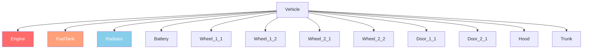

# Chapter 6.2: Vehicle System

[Home](../README.md) | [<< Previous: Entity System](01-entity-system.md) | **Vehicles** | [Next: Weather >>](03-weather.md)

---

## Introdução

Veículos no DayZ são entidades que estendem o sistema de transporte. Carros estendem `CarScript`, barcos estendem `BoatScript`, e ambos herdam de `Transport`. Veículos possuem sistemas de fluidos, peças com vida independente, simulação de marchas e física gerenciada pela engine. Este capítulo cobre os métodos da API que você precisa para interagir com veículos em scripts.

---

## Hierarquia de Classes

```
EntityAI
└── Transport                    // 3_Game - base para todos os veículos
    ├── Car                      // 3_Game - física nativa de carro da engine
    │   └── CarScript            // 4_World - base scriptável de carro
    │       ├── CivilianSedan
    │       ├── OffroadHatchback
    │       ├── Hatchback_02
    │       ├── Sedan_02
    │       ├── Truck_01_Base
    │       └── ...
    └── Boat                     // 3_Game - física nativa de barco da engine
        └── BoatScript           // 4_World - base scriptável de barco
```

---

## Transport (Base)

**Arquivo:** `3_Game/entities/transport.c`

A base abstrata para todos os veículos. Fornece gerenciamento de assentos e acesso à tripulação.

### Gerenciamento de Tripulação

```c
proto native int   CrewSize();                          // Número total de assentos
proto native int   CrewMemberIndex(Human crew_member);  // Obter índice do assento de um humano
proto native Human CrewMember(int posIdx);              // Obter humano no índice do assento
proto native void  CrewGetOut(int posIdx);              // Forçar membro da tripulação a sair
proto native void  CrewDeath(int posIdx);               // Matar membro no assento
```

### Entrada da Tripulação

```c
proto native int  GetAnimInstance();
proto native int  CrewPositionIndex(int componentIdx);  // Componente para índice do assento
proto native vector CrewEntryPoint(int posIdx);         // Posição de entrada no mundo para o assento
```

**Exemplo --- ejetar todos os passageiros:**

```c
void EjectAllCrew(Transport vehicle)
{
    for (int i = 0; i < vehicle.CrewSize(); i++)
    {
        Human crew = vehicle.CrewMember(i);
        if (crew)
        {
            vehicle.CrewGetOut(i);
        }
    }
}
```

---

## Car (Nativo da Engine)

**Arquivo:** `3_Game/entities/car.c`

Física de carro em nível de engine. Todos são métodos `proto native` que controlam a simulação do veículo.

### Motor

```c
proto native bool  EngineIsOn();
proto native void  EngineStart();
proto native void  EngineStop();
proto native float EngineGetRPM();
proto native float EngineGetRPMRedline();
proto native float EngineGetRPMMax();
proto native int   GetGear();
```

### Fluidos

Veículos DayZ possuem quatro tipos de fluido definidos no enum `CarFluid`:

```c
enum CarFluid
{
    FUEL,
    OIL,
    BRAKE,
    COOLANT
}
```

```c
proto native float GetFluidCapacity(CarFluid fluid);
proto native float GetFluidFraction(CarFluid fluid);     // 0.0 - 1.0
proto native void  Fill(CarFluid fluid, float amount);
proto native void  Leak(CarFluid fluid, float amount);
proto native void  LeakAll(CarFluid fluid);
```

**Exemplo --- reabastecer um veículo:**

```c
void RefuelVehicle(Car car)
{
    float capacity = car.GetFluidCapacity(CarFluid.FUEL);
    float current = car.GetFluidFraction(CarFluid.FUEL) * capacity;
    float needed = capacity - current;
    car.Fill(CarFluid.FUEL, needed);
}
```

### Velocidade

```c
proto native float GetSpeedometer();    // Velocidade em km/h (valor absoluto)
```

### Controles (Simulação)

```c
proto native void  SetBrake(float value, int wheel = -1);    // 0.0 - 1.0, -1 = todas as rodas
proto native void  SetHandbrake(float value);                 // 0.0 - 1.0
proto native void  SetSteering(float value, bool analog = true);
proto native void  SetThrust(float value, int wheel = -1);    // 0.0 - 1.0
proto native void  SetClutchState(bool engaged);
```

### Rodas

```c
proto native int   WheelCount();
proto native bool  WheelIsAnyLocked();
proto native float WheelGetSurface(int wheelIdx);
```

### Callbacks (Sobrescreva em CarScript)

```c
void OnEngineStart();
void OnEngineStop();
void OnContact(string zoneName, vector localPos, IEntity other, Contact data);
void OnFluidChanged(CarFluid fluid, float newValue, float oldValue);
void OnGearChanged(int newGear, int oldGear);
void OnSound(CarSoundCtrl ctrl, float oldValue);
```

---

## CarScript

**Arquivo:** `4_World/entities/vehicles/carscript.c`

A classe de carro scriptável que a maioria dos mods de veículos estende. Adiciona peças, portas, luzes e gerenciamento de som.

### Vida das Peças

CarScript usa zonas de dano para representar peças do veículo. Cada peça pode ser danificada independentemente:

```c
// Verificar vida da peça via API padrão do EntityAI
float engineHP = car.GetHealth("Engine", "Health");
float fuelTankHP = car.GetHealth("FuelTank", "Health");

// Definir vida da peça
car.SetHealth("Engine", "Health", 0);       // Destruir o motor
car.SetHealth("FuelTank", "Health", 100);   // Reparar o tanque de combustível
```

Zonas de dano comuns para veículos:

| Zona | Descrição |
|------|-------------|
| `""` (global) | Vida geral do veículo |
| `"Engine"` | Peça do motor |
| `"FuelTank"` | Tanque de combustível |
| `"Radiator"` | Radiador (refrigerante) |
| `"Battery"` | Batéria |
| `"SparkPlug"` | Vela de ignição |
| `"FrontLeft"` / `"FrontRight"` | Rodas dianteiras |
| `"RearLeft"` / `"RearRight"` | Rodas traseiras |
| `"DriverDoor"` / `"CoDriverDoor"` | Portas dianteiras |
| `"Hood"` / `"Trunk"` | Capô e porta-malas |

### Luzes


```c
void SetLightsState(int state);   // 0 = desligado, 1 = ligado
int  GetLightsState();
```

### Controle de Portas

```c
bool IsDoorOpen(string doorSource);
void OpenDoor(string doorSource);
void CloseDoor(string doorSource);
```

### Sobrescritas Importantes para Veículos Personalizados

```c
override void EEInit();                    // Inicializar peças do veículo, fluidos
override void OnEngineStart();             // Comportamento personalizado ao ligar motor
override void OnEngineStop();              // Comportamento personalizado ao desligar motor
override void EOnSimulate(IEntity other, float dt);  // Simulação por tick
override bool CanObjectAttachWeapon(string slot_name);
```

**Exemplo --- criar um veículo com fluidos cheios:**

```c
void SpawnReadyVehicle(vector pos)
{
    Car car = Car.Cast(GetGame().CreateObjectEx("CivilianSedan", pos,
                        ECE_PLACE_ON_SURFACE | ECE_INITAI | ECE_CREATEPHYSICS));
    if (!car)
        return;

    // Encher todos os fluidos
    car.Fill(CarFluid.FUEL, car.GetFluidCapacity(CarFluid.FUEL));
    car.Fill(CarFluid.OIL, car.GetFluidCapacity(CarFluid.OIL));
    car.Fill(CarFluid.BRAKE, car.GetFluidCapacity(CarFluid.BRAKE));
    car.Fill(CarFluid.COOLANT, car.GetFluidCapacity(CarFluid.COOLANT));

    // Spawnar peças necessárias
    EntityAI carEntity = EntityAI.Cast(car);
    carEntity.GetInventory().CreateAttachment("CarBattery");
    carEntity.GetInventory().CreateAttachment("SparkPlug");
    carEntity.GetInventory().CreateAttachment("CarRadiator");
    carEntity.GetInventory().CreateAttachment("HatchbackWheel");
}
```

---

## BoatScript

**Arquivo:** `4_World/entities/vehicles/boatscript.c`

Base scriptável para entidades de barco. API similar ao CarScript mas com física baseada em hélice.

### Motor e Propulsão

```c
proto native bool  EngineIsOn();
proto native void  EngineStart();
proto native void  EngineStop();
proto native float EngineGetRPM();
```

### Fluidos

Barcos usam o mesmo enum `CarFluid` mas típicamente só usam `FUEL`:

```c
float fuel = boat.GetFluidFraction(CarFluid.FUEL);
boat.Fill(CarFluid.FUEL, boat.GetFluidCapacity(CarFluid.FUEL));
```

### Velocidade

```c
proto native float GetSpeedometer();   // Velocidade em km/h
```

**Exemplo --- spawnar um barco:**

```c
void SpawnBoat(vector waterPos)
{
    BoatScript boat = BoatScript.Cast(
        GetGame().CreateObjectEx("Boat_01", waterPos,
                                  ECE_CREATEPHYSICS | ECE_INITAI)
    );
    if (boat)
    {
        boat.Fill(CarFluid.FUEL, boat.GetFluidCapacity(CarFluid.FUEL));
    }
}
```

---

## Verificações de Interação com Veículos

### Verificando se um Jogador Está em um Veículo

```c
PlayerBase player;
if (player.IsInVehicle())
{
    EntityAI vehicle = player.GetDrivingVehicle();
    CarScript car;
    if (Class.CastTo(car, vehicle))
    {
        float speed = car.GetSpeedometer();
        Print(string.Format("Dirigindo a %1 km/h", speed));
    }
}
```

### Encontrando Todos os Veículos no Mundo

```c
void FindAllVehicles(out array<Transport> vehicles)
{
    vehicles = new array<Transport>;
    array<Object> objects = new array<Object>;
    array<CargoBase> proxyCargos = new array<CargoBase>;

    // Usar um raio grande a partir do centro do mapa
    GetGame().GetObjectsAtPosition(Vector(7500, 0, 7500), 15000, objects, proxyCargos);

    foreach (Object obj : objects)
    {
        Transport transport;
        if (Class.CastTo(transport, obj))
        {
            vehicles.Insert(transport);
        }
    }
}
```

---

## Resumo

| Conceito | Ponto-chave |
|---------|-----------|
| Hierarquia | `Transport` > `Car`/`Boat` > `CarScript`/`BoatScript` |
| Motor | `EngineStart()`, `EngineStop()`, `EngineIsOn()`, `EngineGetRPM()` |
| Fluidos | enum `CarFluid`: `FUEL`, `OIL`, `BRAKE`, `COOLANT` |
| Encher/Vazar | `Fill(fluid, amount)`, `Leak(fluid, amount)`, `GetFluidFraction(fluid)` |
| Velocidade | `GetSpeedometer()` retorna km/h |
| Tripulação | `CrewSize()`, `CrewMember(idx)`, `CrewGetOut(idx)` |
| Peças | Zonas de dano padrão: `"Engine"`, `"FuelTank"`, `"Radiator"`, etc. |
| Criação | `CreateObjectEx` com `ECE_PLACE_ON_SURFACE \| ECE_INITAI \| ECE_CREATEPHYSICS` |
| Config 1.28 | `useNewNetworking`, `wheelHubFriction`, valores de torque de freio dobrados |
| Física 1.28 | Bullet Physics atualizado, novos campos na API `Contact`, suspensao sempre ativa |
| 1.29 Experimental | Multithreading de física, sleep de `Transport`, colisao dinamica para todo transporte |

---

## Boas Praticas

- **Sempre inclua `ECE_CREATEPHYSICS | ECE_INITAI` ao spawnar veiculos.** Sem fisica, o veiculo cai atraves do chao. Sem init de AI, a simulacao do motor nao inicia e o veiculo nao pode ser dirigido.
- **Encha todos os quatro fluidos apos spawnar.** Um veiculo sem oleo, fluido de freio ou refrigerante vai se danificar imediatamente quando o motor ligar. Use `GetFluidCapacity()` para obter os valores maximos corretos por tipo de veiculo.
- **Verifique null em `CrewMember()` antes de operar na tripulacao.** Assentos vazios retornam `null`. Iterar `CrewSize()` sem verificar cada indice causa crashes quando assentos estao desocupados.
- **Use `GetSpeedometer()` em vez de calcular velocidade manualmente.** O velocimetro da engine considera contato da roda, estado da transmissao e fisica corretamente. Calculos manuais de velocidade a partir de deltas de posicao nao sao confiaveis.

---

## Compatibilidade e Impacto

> **Compatibilidade de Mods:** Mods de veiculos comumente estendem `CarScript` com modded classes. Conflitos surgem quando multiplos mods sobrescrevem os mesmos callbacks como `OnEngineStart()` ou `EOnSimulate()`.

- **Ordem de Carregamento:** Se dois mods fazem `modded class CarScript` e sobrescrevem `OnEngineStart()`, apenas o ultimo mod carregado roda a menos que ambos chamem `super`. Mods de revisao de veiculos devem sempre chamar `super` em todo callback.
- **Conflitos de Modded Class:** Expansion Vehicles e mods de veiculos vanilla frequentemente conflitam em `EEInit()` e inicializacao de fluidos. Teste com ambos carregados.
- **Impacto de Performance:** `EOnSimulate()` roda a cada tick de fisica para cada veiculo ativo. Mantenha a logica minima neste callback; use acumuladores de timer para operacoes caras.
- **Servidor/Cliente:** `EngineStart()`, `EngineStop()`, `Fill()`, `Leak()` e `CrewGetOut()` sao autoritativos do servidor. `GetSpeedometer()`, `EngineIsOn()` e `GetFluidFraction()` sao seguros para leitura em ambos os lados.

---

## Mudancas de Configuracao de Veiculos (1.28+)

> **Aviso (1.28):** O DayZ 1.28 introduziu mudancas significativas na fisica de veiculos. Se voce esta atualizando um mod de veiculo do 1.27 ou anterior, leia esta secao com atencao.

### Parametro `useNewNetworking`

O DayZ 1.28 adicionou o parametro de config `useNewNetworking` para todas as classes `CarScript`. O valor padrao e **1** (ativado).

```cpp
class CfgVehicles
{
    class CarScript;
    class MyVehicle : CarScript
    {
        // Novo networking melhora rubber-banding com ping alto
        useNewNetworking = 1;  // padrao — deixe ativado para a maioria dos mods

        // Desative APENAS se seu mod modifica a fisica do veiculo
        // fora da config do SimulationModule:
        // useNewNetworking = 0;
    };
};
```

**Quando desativar:** Se seu mod manipula diretamente a fisica do veiculo atraves de script (overrides customizados de `EOnSimulate`, aplicacao direta de forca, logica customizada de rodas) em vez de atraves do `SimulationModule` baseado em config, o novo sistema de reconciliacao pode lutar contra suas mudancas. Defina `useNewNetworking = 0;` nesse caso.

### Parametro `wheelHubFriction` (1.28+)

Nova variavel de config que define o arrasto do eixo quando **nenhuma roda esta conectada**:

```cpp
class SimulationModule
{
    class Axles
    {
        class Front
        {
            wheelHubFriction = 0.5;  // Quao rapido o veiculo desacelera com rodas faltando
        };
    };
};
```

### Migracao de Torque de Freio (1.28)

> **Mudanca Quebrante:** Antes do 1.28, torque de freio e freio de mao eram aplicados **duas vezes** devido a um bug. Isso foi corrigido no 1.28. Se voce esta migrando um mod de veiculo, **dobre** seus valores de `maxBrakeTorque` e `maxHandbrakeTorque` para manter a mesma sensacao de frenagem.

```cpp
// Pre-1.28 (bug: aplicado duas vezes, entao o valor efetivo era 2x)
maxBrakeTorque = 2000;
maxHandbrakeTorque = 3000;

// Pos-1.28 (correcao: aplicado uma vez, entao dobre para igualar o comportamento antigo)
maxBrakeTorque = 4000;
maxHandbrakeTorque = 6000;
```

### Suspensao Sempre Ativa (1.28+)

A suspensao do veiculo agora esta sempre ativa enquanto o veiculo esta acordado. Anteriormente, a suspensao poderia estar inativa em certos estados. Isso melhora a estabilidade mas pode mudar a sensacao de ajustes customizados de suspensao.

### Atualizacao do Bullet Physics (1.28)

A biblioteca Bullet Physics foi atualizada para a versao mais recente do Enfusion. Diferencas sutis na resposta de colisao, friccao e restituicao podem ocorrer. Teste todas as configuracoes customizadas de veiculos detalhadamente.

### Mudancas na API de Contato de Fisica (1.28)

A classe `Contact` foi modificada:

**Removidos:**
- `MaterialIndex1`, `MaterialIndex2`
- `Index1`, `Index2`

**Adicionados:**
- `ShapeIndex1`, `ShapeIndex2` --- identificam qual shape em um corpo composto foi atingido
- `VelocityBefore1`, `VelocityBefore2` --- velocidades pre-colisao
- `VelocityAfter1`, `VelocityAfter2` --- velocidades pos-colisao

**Alterados:**
- `Material1`, `Material2` --- tipo mudou de `dMaterial` para `SurfaceProperties`

Mods que leem dados de `Contact` em `EOnContact` devem atualizar para os novos nomes de variavel e tipos.

---

## Mudancas de Veiculos no 1.29 (Experimental)

> **Nota:** Estas mudancas sao do DayZ 1.29 experimental e podem mudar antes do lancamento estavel.

### Multithreading do Bullet Physics (1.29 Experimental)

Suporte a multithreading foi ativado para a biblioteca Bullet Physics. Testes de estresse no servidor mostraram ate 400% de melhoria de FPS (9 FPS para 50 FPS). Mods de veiculos que dependem de timing especifico de fisica ou fazem chamadas de fisica a partir de callbacks de script devem ser testados extensivamente.

### Sleep de Transport (1.29 Experimental)

Funcoes de fisica foram adicionadas diretamente em `Transport` para permitir que veiculos **durmam** quando em repouso. Corpos inativos nao recebem mais callbacks `EOnSimulate` / `EOnPostSimulate`. Se seu mod de veiculo depende desses callbacks disparando continuamente, teste no 1.29 experimental.

### Colisao Dinamica para Todo Transport (1.29 Experimental)

A classe `Transport` (pai de `CarScript` e `BoatScript`) agora tem resolucao de colisao dinamica. Anteriormente, apenas `CarScript` tinha isso. Mods de barcos se beneficiam do tratamento adequado de colisao.

---

## Observado em Mods Reais

> Estes padroes foram confirmados pelo estudo do codigo-fonte de mods profissionais de DayZ.

| Padrao | Mod | Arquivo/Local |
|---------|-----|---------------|
| Override `EEInit()` para definir capacidades customizadas de fluido e spawnar pecas | Expansion Vehicles | Subclasses de `CarScript` |
| Acumulador `EOnSimulate` para verificacoes periodicas de consumo de combustivel | Mods Vanilla+ de veiculos | Overrides de `CarScript` |
| Loop `CrewGetOut()` em comando admin de ejetar-todos | VPP Admin Tools | Modulo de gerenciamento de veiculos |
| Override customizado de `OnContact()` para ajuste de dano de colisao | Expansion | `ExpansionCarScript` |

---

[<< Anterior: Sistema de Entidades](01-entity-system.md) | **Veículos** | [Próximo: Clima >>](03-weather.md)
