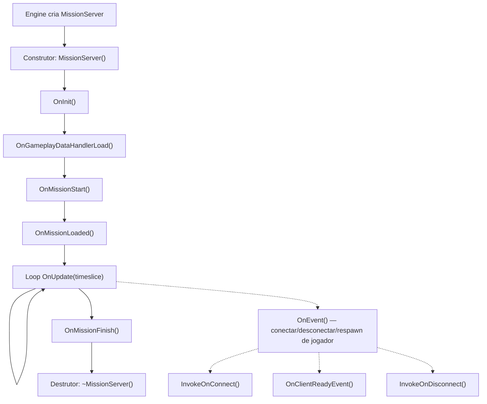
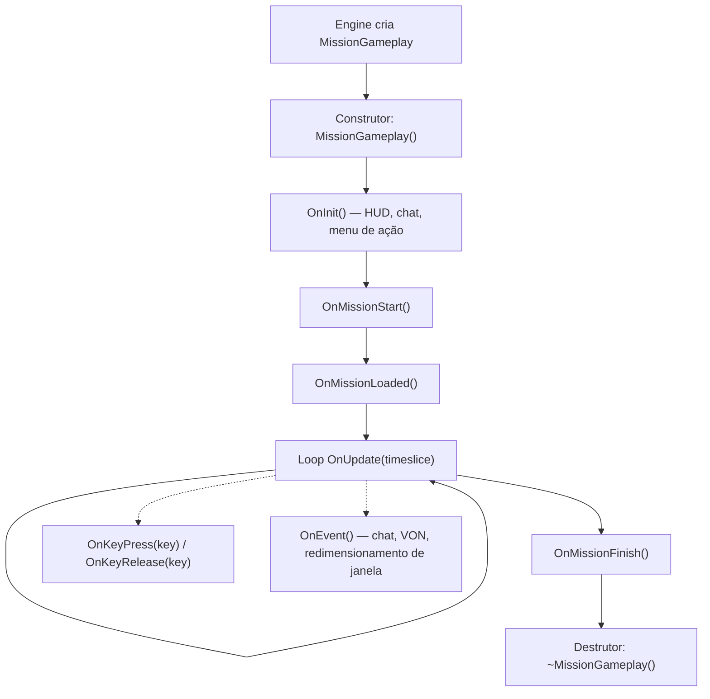
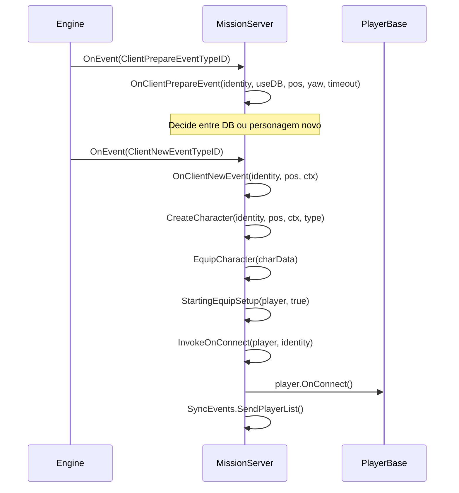
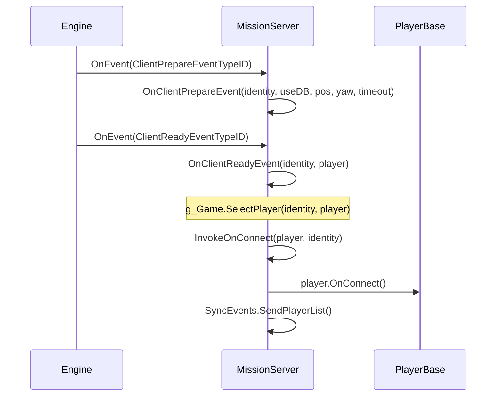
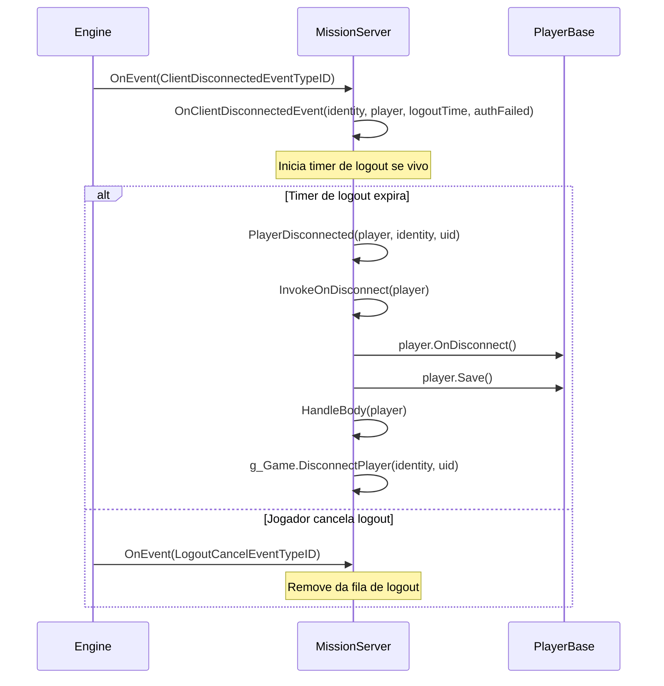

# Capítulo 6.11: Hooks de Missão

[Início](../../README.md) | [<< Anterior: Economia Central](10-central-economy.md) | **Hooks de Missão** | [Próximo: Sistema de Ações >>](12-action-system.md)

---

## Introdução

Todo mod de DayZ precisa de um ponto de entrada --- um lugar onde ele inicializa gerenciadores, registra handlers de RPC, se conecta a conexões de jogadores e limpa recursos ao desligar. Esse ponto de entrada é a classe **Mission**. O engine cria exatamente uma instância de Mission quando um cenário é carregado: `MissionServer` em um servidor dedicado, `MissionGameplay` em um cliente, ou ambos em um listen server. Essas classes fornecem hooks de ciclo de vida que disparam em uma ordem garantida, dando aos mods um lugar confiável para injetar comportamento.

Este capítulo cobre a hierarquia completa da classe Mission, cada método que pode ser hooked, o padrão correto de `modded class` para estendê-los, e exemplos do mundo real do vanilla DayZ, COT e Expansion.

---

## Hierarquia de Classes

```
Mission                      // 3_Game/gameplay.c (base, define todas as assinaturas de hooks)
└── MissionBaseWorld         // 4_World/classes/missionbaseworld.c (ponte mínima)
    └── MissionBase          // 5_Mission/mission/missionbase.c (setup compartilhado: HUD, menus, plugins)
        ├── MissionServer    // 5_Mission/mission/missionserver.c (lado do servidor)
        └── MissionGameplay  // 5_Mission/mission/missiongameplay.c (lado do cliente)
```

- **Mission** define todas as assinaturas de hooks como métodos vazios: `OnInit()`, `OnUpdate()`, `OnEvent()`, `OnMissionStart()`, `OnMissionFinish()`, `OnKeyPress()`, `OnKeyRelease()`, etc.
- **MissionBase** inicializa o gerenciador de plugins, handler de eventos de widget, dados do mundo, música dinâmica, conjuntos de som e rastreamento de dispositivos de input. É o pai comum tanto para o servidor quanto para o cliente.
- **MissionServer** lida com conexões de jogadores, desconexões, respawns, gerenciamento de corpos, agendamento de ticks e artilharia.
- **MissionGameplay** lida com criação de HUD, chat, menus de ação, UI de voz sobre rede, inventário, exclusão de input e agendamento do jogador no lado do cliente.

---

## Visão Geral do Ciclo de Vida

### Ciclo de Vida do MissionServer (Lado do Servidor)



### Ciclo de Vida do MissionGameplay (Lado do Cliente)



---

## Métodos da Classe Base Mission

**Arquivo:** `3_Game/gameplay.c`

A classe base `Mission` define todo método que pode ser hooked. Todos são virtuais com implementações padrão vazias, a menos que seja indicado.

### Hooks de Ciclo de Vida

| Método | Assinatura | Quando Dispara |
|--------|-----------|----------------|
| `OnInit` | `void OnInit()` | Após o construtor, antes da missão começar. Ponto de setup primário. |
| `OnMissionStart` | `void OnMissionStart()` | Após OnInit. O mundo da missão está ativo. |
| `OnMissionLoaded` | `void OnMissionLoaded()` | Após OnMissionStart. Todos os sistemas vanilla estão inicializados. |
| `OnGameplayDataHandlerLoad` | `void OnGameplayDataHandlerLoad()` | Servidor: após os dados de gameplay (cfggameplay.json) serem carregados. |
| `OnUpdate` | `void OnUpdate(float timeslice)` | Todo frame. `timeslice` é segundos desde o último frame (tipicamente 0.016-0.033). |
| `OnMissionFinish` | `void OnMissionFinish()` | No desligamento ou desconexão. Limpe tudo aqui. |

### Hooks de Input (Lado do Cliente)

| Método | Assinatura | Quando Dispara |
|--------|-----------|----------------|
| `OnKeyPress` | `void OnKeyPress(int key)` | Tecla física pressionada. `key` é uma constante `KeyCode`. |
| `OnKeyRelease` | `void OnKeyRelease(int key)` | Tecla física solta. |
| `OnMouseButtonPress` | `void OnMouseButtonPress(int button)` | Botão do mouse pressionado. |
| `OnMouseButtonRelease` | `void OnMouseButtonRelease(int button)` | Botão do mouse solto. |

### Hook de Evento

| Método | Assinatura | Quando Dispara |
|--------|-----------|----------------|
| `OnEvent` | `void OnEvent(EventType eventTypeId, Param params)` | Eventos do engine: chat, VON, conectar/desconectar jogador, redimensionamento de janela, etc. |

### Métodos Utilitários

| Método | Assinatura | Descrição |
|--------|-----------|-----------|
| `GetHud` | `Hud GetHud()` | Retorna a instância do HUD (apenas cliente). |
| `GetWorldData` | `WorldData GetWorldData()` | Retorna dados específicos do mundo (curvas de temperatura, etc.). |
| `IsPaused` | `bool IsPaused()` | Se o jogo está pausado (single player / listen server). |
| `IsServer` | `bool IsServer()` | `true` para MissionServer, `false` para MissionGameplay. |
| `IsMissionGameplay` | `bool IsMissionGameplay()` | `true` para MissionGameplay, `false` para MissionServer. |
| `PlayerControlEnable` | `void PlayerControlEnable(bool bForceSuppress)` | Reabilita o input do jogador após desabilitar. |
| `PlayerControlDisable` | `void PlayerControlDisable(int mode)` | Desabilita o input do jogador (ex: `INPUT_EXCLUDE_ALL`). |
| `IsControlDisabled` | `bool IsControlDisabled()` | Se os controles do jogador estão atualmente desabilitados. |
| `GetControlDisabledMode` | `int GetControlDisabledMode()` | Retorna o modo atual de exclusão de input. |

---

## Hooks do MissionServer (Lado do Servidor)

**Arquivo:** `5_Mission/mission/missionserver.c`

MissionServer é instanciado pelo engine em servidores dedicados. Ele lida com tudo relacionado ao ciclo de vida do jogador no servidor.

### Comportamento Vanilla Principal

- **Construtor**: Configura `CallQueue` para estatísticas do jogador (intervalo de 30 segundos), array de jogadores mortos, mapas de rastreamento de logout, handler de chuva.
- **OnInit**: Carrega `CfgGameplayHandler`, `PlayerSpawnHandler`, `CfgPlayerRestrictedAreaHandler`, `UndergroundAreaLoader`, posições de artilharia.
- **OnMissionStart**: Cria zonas de área de efeito (zonas contaminadas, etc.).
- **OnUpdate**: Executa agendador de ticks, processa timers de logout, atualiza temperatura base do ambiente, chuva, artilharia aleatória.

### OnEvent --- Eventos de Conexão de Jogador

O `OnEvent` do servidor é o despachante central para todos os eventos de ciclo de vida do jogador. O engine envia eventos com objetos `Param` tipados. O vanilla os lida via um bloco `switch`:

| Evento | Tipo de Param | O Que Acontece |
|--------|--------------|----------------|
| `ClientPrepareEventTypeID` | `ClientPrepareEventParams` | Decide entre DB ou personagem novo |
| `ClientNewEventTypeID` | `ClientNewEventParams` | Cria + equipa novo personagem, chama `InvokeOnConnect` |
| `ClientReadyEventTypeID` | `ClientReadyEventParams` | Personagem existente carregado, chama `OnClientReadyEvent` + `InvokeOnConnect` |
| `ClientRespawnEventTypeID` | `ClientRespawnEventParams` | Pedido de respawn do jogador, mata personagem antigo se inconsciente |
| `ClientReconnectEventTypeID` | `ClientReconnectEventParams` | Jogador reconectou a personagem vivo |
| `ClientDisconnectedEventTypeID` | `ClientDisconnectedEventParams` | Jogador desconectando, inicia timer de logout |
| `LogoutCancelEventTypeID` | `LogoutCancelEventParams` | Jogador cancelou contagem regressiva de logout |

### Métodos de Conexão do Jogador

Chamados de dentro de `OnEvent` quando eventos relacionados ao jogador disparam:

| Método | Assinatura | Comportamento Vanilla |
|--------|-----------|----------------------|
| `InvokeOnConnect` | `void InvokeOnConnect(PlayerBase player, PlayerIdentity identity)` | Chama `player.OnConnect()`. Hook primário de "jogador entrou". |
| `InvokeOnDisconnect` | `void InvokeOnDisconnect(PlayerBase player)` | Chama `player.OnDisconnect()`. Jogador totalmente desconectado. |
| `OnClientReadyEvent` | `void OnClientReadyEvent(PlayerIdentity identity, PlayerBase player)` | Chama `g_Game.SelectPlayer()`. Personagem existente carregado do DB. |
| `OnClientNewEvent` | `PlayerBase OnClientNewEvent(PlayerIdentity identity, vector pos, ParamsReadContext ctx)` | Cria + equipa novo personagem. Retorna `PlayerBase`. |
| `OnClientRespawnEvent` | `void OnClientRespawnEvent(PlayerIdentity identity, PlayerBase player)` | Mata personagem antigo se inconsciente/restrito. |
| `OnClientReconnectEvent` | `void OnClientReconnectEvent(PlayerIdentity identity, PlayerBase player)` | Chama `player.OnReconnect()`. |
| `PlayerDisconnected` | `void PlayerDisconnected(PlayerBase player, PlayerIdentity identity, string uid)` | Chama `InvokeOnDisconnect`, salva jogador, sai do hive, lida com corpo, remove do servidor. |

### Setup do Personagem

| Método | Assinatura | Descrição |
|--------|-----------|-----------|
| `CreateCharacter` | `PlayerBase CreateCharacter(PlayerIdentity identity, vector pos, ParamsReadContext ctx, string characterName)` | Cria entidade de jogador via `g_Game.CreatePlayer()` + `g_Game.SelectPlayer()`. |
| `EquipCharacter` | `void EquipCharacter(MenuDefaultCharacterData char_data)` | Itera slots de attachment, randomiza se respawn customizado está desabilitado. Chama `StartingEquipSetup()`. |
| `StartingEquipSetup` | `void StartingEquipSetup(PlayerBase player, bool clothesChosen)` | **Vazio no vanilla** --- seu ponto de entrada para kits iniciais. |

---

## Hooks do MissionGameplay (Lado do Cliente)

**Arquivo:** `5_Mission/mission/missiongameplay.c`

MissionGameplay é instanciado no cliente ao conectar a um servidor ou iniciar single player. Ele gerencia toda a UI e input do lado do cliente.

### Comportamento Vanilla Principal

- **Construtor**: Destroi menus existentes, cria Chat, ActionMenu, IngameHud, estado VoN, timers de fade, registro de SyncEvents.
- **OnInit**: Protege contra init duplo com `m_Initialized`. Cria widget raiz do HUD de `"gui/layouts/day_z_hud.layout"`, widget de chat, menu de ação, ícone de microfone, widgets de nível de voz VoN, área de canal de chat. Chama `PPEffects.Init()` e `MapMarkerTypes.Init()`.
- **OnMissionStart**: Esconde cursor, define estado da missão para `MISSION_STATE_GAME`, carrega áreas de efeito em singleplayer.
- **OnUpdate**: Agendador de tick para jogador local, atualizações de holograma, quickbar radial (console), menu de gestos, handling de input para inventário/chat/VoN, monitor de debug, comportamento de pausa.
- **OnMissionFinish**: Esconde diálogo, destroi todos os menus e chat, deleta widget raiz do HUD, para todos os efeitos PPE, reabilita todos os inputs, define estado da missão para `MISSION_STATE_FINNISH`.

### Hooks de Input

```c
override void OnKeyPress(int key)
{
    super.OnKeyPress(key);
    // Vanilla encaminha para Hud.KeyPress(key)
    // valores de key são constantes KeyCode (ex: KeyCode.KC_F1 = 59)
}

override void OnKeyRelease(int key)
{
    super.OnKeyRelease(key);
}
```

### Hook de Evento

O vanilla `MissionGameplay.OnEvent()` lida com `ChatMessageEventTypeID` (adiciona ao widget de chat), `ChatChannelEventTypeID` (atualiza indicador de canal), `WindowsResizeEventTypeID` (reconstrói menus/HUD), `SetFreeCameraEventTypeID` (câmera de debug) e `VONStateEventTypeID` (estado de voz). Sobrecarregue-o com o mesmo padrão `switch` e sempre chame `super.OnEvent()`.

### Controle de Input

`PlayerControlDisable(int mode)` ativa um grupo de exclusão de input (ex: `INPUT_EXCLUDE_ALL`, `INPUT_EXCLUDE_INVENTORY`). `PlayerControlEnable(bool bForceSuppress)` o remove. Estes mapeiam para grupos de exclusão definidos em `specific.xml`. Sobrecarregue-os se seu mod precisa de comportamento customizado de exclusão de input (como o Expansion faz para seus menus).

---

## Fluxo de Eventos do Lado do Servidor: Jogador Entra

Entender a sequência exata de eventos quando um jogador conecta é crítico para saber onde fazer hook do seu código.

### Novo Personagem (Primeira Entrada ou Após Morte)



### Personagem Existente (Reconexão Após Desconexão)



### Desconexão do Jogador



---

## Como Fazer Hook: O Padrão modded class

A maneira correta de estender classes Mission é o padrão `modded class`. Isto usa o mecanismo de herança de classes do Enforce Script onde `modded class` estende a classe existente sem substituí-la, permitindo que múltiplos mods coexistam.

### Hook Básico de Servidor

```c
// Seu mod: Scripts/5_Mission/SeuMod/MissionServer.c
modded class MissionServer
{
    ref MyServerManager m_MyManager;

    override void OnInit()
    {
        super.OnInit();  // SEMPRE chame super primeiro

        m_MyManager = new MyServerManager();
        m_MyManager.Init();
        Print("[MyMod] Gerenciador de servidor inicializado");
    }

    override void OnMissionFinish()
    {
        if (m_MyManager)
        {
            m_MyManager.Cleanup();
            m_MyManager = null;
        }

        super.OnMissionFinish();  // Chame super (antes ou após sua limpeza)
    }
}
```

### Hook Básico de Cliente

```c
// Seu mod: Scripts/5_Mission/SeuMod/MissionGameplay.c
modded class MissionGameplay
{
    ref MyHudWidget m_MyHud;

    override void OnInit()
    {
        super.OnInit();  // SEMPRE chame super primeiro

        // Cria elementos customizados de HUD
        m_MyHud = new MyHudWidget();
        m_MyHud.Init();
    }

    override void OnUpdate(float timeslice)
    {
        super.OnUpdate(timeslice);

        // Atualiza HUD customizado a cada frame
        if (m_MyHud)
        {
            m_MyHud.Update(timeslice);
        }
    }

    override void OnMissionFinish()
    {
        if (m_MyHud)
        {
            m_MyHud.Destroy();
            m_MyHud = null;
        }

        super.OnMissionFinish();
    }
}
```

### Hookando Conexão de Jogador

```c
modded class MissionServer
{
    override void InvokeOnConnect(PlayerBase player, PlayerIdentity identity)
    {
        super.InvokeOnConnect(player, identity);

        // Seu código roda APÓS o vanilla e todos os mods anteriores
        if (player && identity)
        {
            string uid = identity.GetId();
            string name = identity.GetName();
            Print("[MyMod] Jogador conectou: " + name + " (" + uid + ")");

            // Carrega dados do jogador, envia configurações, etc.
            MyPlayerData.Load(uid);
        }
    }

    override void InvokeOnDisconnect(PlayerBase player)
    {
        // Salva dados ANTES do super (jogador pode ser deletado após)
        if (player && player.GetIdentity())
        {
            string uid = player.GetIdentity().GetId();
            MyPlayerData.Save(uid);
        }

        super.InvokeOnDisconnect(player);
    }
}
```

### Hookando Mensagens de Chat (OnEvent do Servidor)

```c
modded class MissionServer
{
    override void OnEvent(EventType eventTypeId, Param params)
    {
        // Intercepta ANTES do super para potencialmente bloquear eventos
        if (eventTypeId == ClientNewEventTypeID)
        {
            ClientNewEventParams newParams;
            Class.CastTo(newParams, params);
            PlayerIdentity identity = newParams.param1;

            if (IsPlayerBanned(identity))
            {
                // Bloqueia a conexão ao não chamar super
                return;
            }
        }

        super.OnEvent(eventTypeId, params);
    }
}
```

### Hookando Input de Teclado (Lado do Cliente)

```c
modded class MissionGameplay
{
    override void OnKeyPress(int key)
    {
        super.OnKeyPress(key);

        // Abre menu customizado com F6
        if (key == KeyCode.KC_F6)
        {
            if (!GetGame().GetUIManager().GetMenu())
            {
                MyCustomMenu.Open();
            }
        }
    }
}
```

### Onde Registrar Handlers de RPC

Handlers de RPC devem ser registrados no `OnInit`, não no construtor. No momento do `OnInit`, todos os módulos de script estão carregados e a camada de rede está pronta.

```c
modded class MissionServer
{
    override void OnInit()
    {
        super.OnInit();

        // Registra handlers de RPC aqui
        GetDayZGame().Event_OnRPC.Insert(OnMyRPC);
    }

    override void OnMissionFinish()
    {
        GetDayZGame().Event_OnRPC.Remove(OnMyRPC);
        super.OnMissionFinish();
    }

    void OnMyRPC(PlayerIdentity sender, Object target, int rpc_type,
                 ParamsReadContext ctx)
    {
        // Lida com seus RPCs
    }
}
```

---

## Hooks Comuns por Propósito

| Eu quero... | Hook neste método | Em qual classe |
|-------------|-------------------|----------------|
| Inicializar meu mod no servidor | `OnInit()` | `MissionServer` |
| Inicializar meu mod no cliente | `OnInit()` | `MissionGameplay` |
| Rodar código a cada frame (servidor) | `OnUpdate(float timeslice)` | `MissionServer` |
| Rodar código a cada frame (cliente) | `OnUpdate(float timeslice)` | `MissionGameplay` |
| Reagir à entrada de jogador | `InvokeOnConnect(player, identity)` | `MissionServer` |
| Reagir à saída de jogador | `InvokeOnDisconnect(player)` | `MissionServer` |
| Enviar dados iniciais para novo cliente | `OnClientReadyEvent(identity, player)` | `MissionServer` |
| Reagir ao spawn de novo personagem | `OnClientNewEvent(identity, pos, ctx)` | `MissionServer` |
| Dar equipamento inicial | `StartingEquipSetup(player, clothesChosen)` | `MissionServer` |
| Reagir ao respawn do jogador | `OnClientRespawnEvent(identity, player)` | `MissionServer` |
| Reagir à reconexão do jogador | `OnClientReconnectEvent(identity, player)` | `MissionServer` |
| Lidar com lógica de desconexão/logout | `OnClientDisconnectedEvent(identity, player, logoutTime, authFailed)` | `MissionServer` |
| Interceptar eventos do servidor (conexão, chat) | `OnEvent(eventTypeId, params)` | `MissionServer` |
| Interceptar eventos do cliente (chat, VON) | `OnEvent(eventTypeId, params)` | `MissionGameplay` |
| Lidar com input de teclado | `OnKeyPress(key)` / `OnKeyRelease(key)` | `MissionGameplay` |
| Criar elementos de HUD | `OnInit()` | `MissionGameplay` |
| Limpar recursos no desligamento do servidor | `OnMissionFinish()` | `MissionServer` |
| Limpar recursos na desconexão do cliente | `OnMissionFinish()` | `MissionGameplay` |
| Rodar código uma vez após todos os sistemas carregados | `OnMissionLoaded()` | Ambos |
| Desabilitar/habilitar input do jogador | `PlayerControlDisable(mode)` / `PlayerControlEnable(bForceSuppress)` | `MissionGameplay` |

---

## Servidor vs Cliente: Quais Hooks Disparam Onde

| Hook | Servidor | Cliente | Notas |
|------|----------|---------|-------|
| Construtor | Sim | Sim | Classe diferente em cada lado |
| `OnInit()` | Sim | Sim | |
| `OnMissionStart()` | Sim | Sim | |
| `OnMissionLoaded()` | Sim | Sim | |
| `OnGameplayDataHandlerLoad()` | Sim | Não | cfggameplay.json carregado |
| `OnUpdate(timeslice)` | Sim | Sim | Ambos rodam seu próprio loop de frames |
| `OnMissionFinish()` | Sim | Sim | |
| `OnEvent()` | Sim | Sim | Tipos de evento diferentes em cada lado |
| `InvokeOnConnect()` | Sim | Não | Apenas servidor |
| `InvokeOnDisconnect()` | Sim | Não | Apenas servidor |
| `OnClientReadyEvent()` | Sim | Não | Apenas servidor |
| `OnClientNewEvent()` | Sim | Não | Apenas servidor |
| `OnClientRespawnEvent()` | Sim | Não | Apenas servidor |
| `OnClientReconnectEvent()` | Sim | Não | Apenas servidor |
| `OnClientDisconnectedEvent()` | Sim | Não | Apenas servidor |
| `PlayerDisconnected()` | Sim | Não | Apenas servidor |
| `StartingEquipSetup()` | Sim | Não | Apenas servidor |
| `EquipCharacter()` | Sim | Não | Apenas servidor |
| `OnKeyPress()` | Não | Sim | Apenas cliente |
| `OnKeyRelease()` | Não | Sim | Apenas cliente |
| `OnMouseButtonPress()` | Não | Sim | Apenas cliente |
| `OnMouseButtonRelease()` | Não | Sim | Apenas cliente |
| `PlayerControlDisable()` | Não | Sim | Apenas cliente |
| `PlayerControlEnable()` | Não | Sim | Apenas cliente |

---

## Referência de Constantes EventType

Todas as constantes de evento são definidas em `3_Game/gameplay.c` e despachadas através de `OnEvent()`.

| Constante | Lado | Descrição |
|-----------|------|-----------|
| `ClientPrepareEventTypeID` | Servidor | Identidade do jogador recebida, decide DB ou novo |
| `ClientNewEventTypeID` | Servidor | Novo personagem sendo criado |
| `ClientReadyEventTypeID` | Servidor | Personagem existente carregado do DB |
| `ClientRespawnEventTypeID` | Servidor | Jogador solicitou respawn |
| `ClientReconnectEventTypeID` | Servidor | Jogador reconectou a personagem vivo |
| `ClientDisconnectedEventTypeID` | Servidor | Jogador desconectando |
| `LogoutCancelEventTypeID` | Servidor | Jogador cancelou contagem regressiva de logout |
| `ChatMessageEventTypeID` | Cliente | Mensagem de chat recebida (`ChatMessageEventParams`) |
| `ChatChannelEventTypeID` | Cliente | Canal de chat alterado (`ChatChannelEventParams`) |
| `VONStateEventTypeID` | Cliente | Estado de voz sobre rede alterado |
| `VONStartSpeakingEventTypeID` | Cliente | Jogador começou a falar |
| `VONStopSpeakingEventTypeID` | Cliente | Jogador parou de falar |
| `MPSessionStartEventTypeID` | Ambos | Sessão multiplayer iniciada |
| `MPSessionEndEventTypeID` | Ambos | Sessão multiplayer encerrada |
| `MPConnectionLostEventTypeID` | Cliente | Conexão com o servidor perdida |
| `PlayerDeathEventTypeID` | Ambos | Jogador morreu |
| `SetFreeCameraEventTypeID` | Cliente | Câmera livre alternada (debug) |

---

## Exemplos do Mundo Real

### Exemplo 1: Inicialização de Gerenciador de Servidor

Um padrão típico para inicializar um gerenciador do lado do servidor que precisa executar tarefas periódicas.

```c
modded class MissionServer
{
    ref MyTraderManager m_TraderManager;
    float m_TraderUpdateTimer;
    const float TRADER_UPDATE_INTERVAL = 5.0; // segundos

    override void OnInit()
    {
        super.OnInit();

        m_TraderManager = new MyTraderManager();
        m_TraderManager.LoadConfig();
        m_TraderManager.SpawnTraders();
        m_TraderUpdateTimer = 0;

        Print("[MyMod] Gerenciador de traders inicializado");
    }

    override void OnUpdate(float timeslice)
    {
        super.OnUpdate(timeslice);

        // Limita a atualização do trader a cada 5 segundos
        m_TraderUpdateTimer += timeslice;
        if (m_TraderUpdateTimer >= TRADER_UPDATE_INTERVAL)
        {
            m_TraderUpdateTimer = 0;
            m_TraderManager.Update();
        }
    }

    override void OnMissionFinish()
    {
        if (m_TraderManager)
        {
            m_TraderManager.SaveState();
            m_TraderManager.DespawnTraders();
            m_TraderManager = null;
        }

        super.OnMissionFinish();
    }
}
```

### Exemplo 2: Carregamento de Dados do Jogador na Conexão

```c
modded class MissionServer
{
    override void InvokeOnConnect(PlayerBase player, PlayerIdentity identity)
    {
        super.InvokeOnConnect(player, identity);
        if (!player || !identity)
            return;

        string uid = identity.GetId();
        string path = "$profile:MyMod/Players/" + uid + ".json";
        ref MyPlayerStats stats = new MyPlayerStats();

        if (FileExist(path))
            JsonFileLoader<MyPlayerStats>.JsonLoadFile(path, stats);
        else
            stats.SetDefaults();

        player.m_MyStats = stats;

        // Envia dados iniciais para o cliente
        ScriptRPC rpc = new ScriptRPC();
        rpc.Write(stats.GetKills());
        rpc.Write(stats.GetDeaths());
        rpc.Send(player, MY_RPC_SYNC_STATS, true, identity);
    }

    override void InvokeOnDisconnect(PlayerBase player)
    {
        if (player && player.GetIdentity() && player.m_MyStats)
        {
            string path = "$profile:MyMod/Players/" + player.GetIdentity().GetId() + ".json";
            JsonFileLoader<MyPlayerStats>.JsonSaveFile(path, player.m_MyStats);
        }
        super.InvokeOnDisconnect(player);
    }
}
```

### Exemplo 3: Criação de HUD no Cliente

Criando um elemento customizado de HUD que atualiza a cada frame.

```c
modded class MissionGameplay
{
    ref Widget m_MyHudRoot;
    ref TextWidget m_MyStatusText;
    float m_HudUpdateTimer;

    override void OnInit()
    {
        super.OnInit();

        // Cria HUD a partir de arquivo de layout
        m_MyHudRoot = GetGame().GetWorkspace().CreateWidgets(
            "MyMod/gui/layouts/my_hud.layout"
        );

        if (m_MyHudRoot)
        {
            m_MyStatusText = TextWidget.Cast(
                m_MyHudRoot.FindAnyWidget("StatusText")
            );
            m_MyHudRoot.Show(true);
        }

        m_HudUpdateTimer = 0;
    }

    override void OnUpdate(float timeslice)
    {
        super.OnUpdate(timeslice);

        // Atualiza texto do HUD duas vezes por segundo, não a cada frame
        m_HudUpdateTimer += timeslice;
        if (m_HudUpdateTimer >= 0.5)
        {
            m_HudUpdateTimer = 0;
            UpdateMyHud();
        }
    }

    void UpdateMyHud()
    {
        PlayerBase player = PlayerBase.Cast(GetGame().GetPlayer());
        if (!player || !m_MyStatusText)
            return;

        string status = "Saúde: " + player.GetHealth("", "").ToString();
        m_MyStatusText.SetText(status);
    }

    override void OnMissionFinish()
    {
        if (m_MyHudRoot)
        {
            m_MyHudRoot.Unlink();
            m_MyHudRoot = null;
        }

        super.OnMissionFinish();
    }
}
```

### Exemplo 4: Interceptação de Comando de Chat (Lado do Servidor)

Interceptando conexões de jogadores para implementar um sistema de ban. Este padrão é usado pelo COT.

```c
modded class MissionServer
{
    override void OnEvent(EventType eventTypeId, Param params)
    {
        // Verifica bans ANTES do super processar a conexão
        if (eventTypeId == ClientNewEventTypeID)
        {
            ClientNewEventParams newParams;
            Class.CastTo(newParams, params);
            PlayerIdentity identity = newParams.param1;

            if (identity && IsBanned(identity.GetId()))
            {
                Print("[MyMod] Jogador banido bloqueado: " + identity.GetId());
                // Não chama super --- conexão é bloqueada
                return;
            }
        }

        super.OnEvent(eventTypeId, params);
    }

    bool IsBanned(string uid)
    {
        string path = "$profile:MyMod/Bans/" + uid + ".json";
        return FileExist(path);
    }
}
```

### Exemplo 5: Kit Inicial via StartingEquipSetup

A maneira mais limpa de dar equipamentos a novos jogadores sem tocar no `OnClientNewEvent`.

```c
modded class MissionServer
{
    override void StartingEquipSetup(PlayerBase player, bool clothesChosen)
    {
        super.StartingEquipSetup(player, clothesChosen);

        if (!player)
            return;

        // Dá a todo novo personagem uma faca e bandagem
        EntityAI knife = player.GetInventory().CreateInInventory("KitchenKnife");
        EntityAI bandage = player.GetInventory().CreateInInventory("BandageDressing");

        // Dá comida na mochila (se tiver uma)
        EntityAI backpack = player.FindAttachmentBySlotName("Back");
        if (backpack)
        {
            backpack.GetInventory().CreateInInventory("SardinesCan");
            backpack.GetInventory().CreateInInventory("Canteen");
        }
    }
}
```

### Padrão: Delegar para um Gerenciador Central

Tanto o COT quanto o Expansion seguem o mesmo padrão: seus hooks de missão são wrappers finos que delegam para um gerenciador singleton. O COT cria `g_cotBase = new CommunityOnlineTools` no construtor, e então chama `g_cotBase.OnStart()` / `OnUpdate()` / `OnFinish()` dos hooks correspondentes. O Expansion faz o mesmo com `GetDayZExpansion().OnStart()` / `OnLoaded()` / `OnFinish()`. Seu mod deve seguir este padrão --- mantenha o código dos hooks de missão fino e empurre a lógica para classes gerenciadoras dedicadas.

---

## OnInit vs OnMissionStart vs OnMissionLoaded

| Hook | Quando | Use Para |
|------|--------|----------|
| `OnInit()` | Primeiro. Módulos de script carregados, mundo ainda não ativo. | Criar gerenciadores, registrar RPCs, carregar configs. |
| `OnMissionStart()` | Segundo. Mundo está ativo, entidades podem ser spawnadas. | Spawnar entidades, iniciar sistemas de gameplay, criar triggers. |
| `OnMissionLoaded()` | Terceiro. Todos os sistemas vanilla totalmente inicializados. | Consultas cross-mod, finalização que depende de tudo estar pronto. |

Sempre chame `super` nos três. Use `OnInit` como seu ponto de inicialização primário. Use `OnMissionLoaded` apenas quando precisar garantir que outros mods já inicializaram.

---

## Acessando a Missão Atual

```c
Mission mission = GetGame().GetMission();                                    // Classe base
MissionServer serverMission = MissionServer.Cast(GetGame().GetMission());   // Cast para servidor
MissionGameplay clientMission = MissionGameplay.Cast(GetGame().GetMission()); // Cast para cliente
PlayerBase player = PlayerBase.Cast(GetGame().GetPlayer());                  // APENAS CLIENTE (null no servidor)
```

---

## Erros Comuns

### 1. Esquecendo super.OnInit()

Todo `override` **deve** chamar `super`. Esquecer isso quebra o vanilla e todos os outros mods na cadeia. Este é o erro de modding mais comum.

```c
// ERRADO                                   // CORRETO
override void OnInit()                      override void OnInit()
{                                           {
    m_MyManager = new MyManager();              super.OnInit();  // Sempre primeiro!
}                                               m_MyManager = new MyManager();
                                            }
```

### 2. Usando GetGame().GetPlayer() no Servidor

`GetGame().GetPlayer()` é **sempre null** em um servidor dedicado. Não existe jogador "local". Use `GetGame().GetPlayers(array)` para iterar todos os jogadores conectados.

```c
// Maneira CORRETA de iterar jogadores no servidor
array<Man> players = new array<Man>();
GetGame().GetPlayers(players);
foreach (Man man : players)
{
    PlayerBase player = PlayerBase.Cast(man);
    if (player) { /* processa */ }
}
```

### 3. Não Limpando no OnMissionFinish

Sempre limpe widgets, callbacks e referências no `OnMissionFinish()`. Sem limpeza, widgets vazam para o próximo carregamento de missão (cliente), e referências obsoletas persistem entre reinícios do servidor.

```c
override void OnMissionFinish()
{
    if (m_MyWidget) { m_MyWidget.Unlink(); m_MyWidget = null; }
    super.OnMissionFinish();
}
```

### 4. OnUpdate Sem Limitação de Frame

`OnUpdate` dispara a cada frame (15-60+ FPS). Use um acumulador de timer para qualquer trabalho não trivial.

```c
m_Timer += timeslice;
if (m_Timer >= 10.0)  // A cada 10 segundos
{
    m_Timer = 0;
    DoExpensiveWork();
}
```

### 5. Registrando RPCs no Construtor

O construtor roda antes de todos os módulos de script serem carregados. Registre callbacks no `OnInit()` (ponto seguro mais cedo) e desregistre no `OnMissionFinish()`.

### 6. Acessando Identity em um Jogador Desconectando

`player.GetIdentity()` pode retornar `null` durante a desconexão. Sempre verifique null tanto em `player` quanto em `identity` antes de acessar.

```c
override void InvokeOnDisconnect(PlayerBase player)
{
    if (player)
    {
        PlayerIdentity identity = player.GetIdentity();
        if (identity)
            Print("[MyMod] Desconectado: " + identity.GetId());
    }
    super.InvokeOnDisconnect(player);
}
```

---

## Resumo

| Conceito | Ponto Chave |
|----------|-------------|
| Hierarquia de missão | `Mission` > `MissionBaseWorld` > `MissionBase` > `MissionServer` / `MissionGameplay` |
| Classe do servidor | `MissionServer` --- lida com conexões de jogadores, spawns, agendamento de ticks |
| Classe do cliente | `MissionGameplay` --- lida com HUD, input, chat, menus |
| Ordem do ciclo de vida | Construtor > `OnInit()` > `OnMissionStart()` > `OnMissionLoaded()` > loop `OnUpdate()` > `OnMissionFinish()` > Destrutor |
| Entrada de jogador (servidor) | `OnEvent(ClientNewEventTypeID/ClientReadyEventTypeID)` > `InvokeOnConnect()` |
| Saída de jogador (servidor) | `OnEvent(ClientDisconnectedEventTypeID)` > `PlayerDisconnected()` > `InvokeOnDisconnect()` |
| Padrão de hooking | `modded class MissionServer/MissionGameplay` com `override` e chamadas `super` |
| Handling de input | `OnKeyPress(key)` / `OnKeyRelease(key)` no `MissionGameplay` (apenas cliente) |
| Handling de evento | `OnEvent(EventType, Param)` em ambos os lados, tipos de evento diferentes por lado |
| Chamadas super | **Sempre chame super** em todo override, ou você quebra toda a cadeia de mods |
| Limpeza | **Sempre limpe** no `OnMissionFinish()` --- remova handlers de RPC, destrua widgets, anule referências |
| Limitação de frame | Use acumuladores de timer no `OnUpdate()` para qualquer trabalho não trivial |
| GetPlayer() | Funciona apenas no cliente; sempre retorna `null` em servidor dedicado |
| Registro de RPC | Registre no `OnInit()`, não no construtor; desregistre no `OnMissionFinish()` |

---

## Boas Práticas

- **Sempre chame `super` como a primeira linha em todo override de Mission.** Este é o erro de modding de DayZ mais comum. Esquecer `super.OnInit()` silenciosamente quebra a inicialização vanilla e todos os outros mods na cadeia.
- **Mantenha o código dos hooks de missão fino --- delegue para classes gerenciadoras.** Crie um gerenciador singleton (ex: `MyModManager`) e chame `manager.Init()` / `manager.Update()` / `manager.Cleanup()` dos hooks. Isto espelha o padrão usado pelo COT e Expansion.
- **Use acumuladores de timer no `OnUpdate()` para qualquer trabalho que não precise rodar a cada frame.** `OnUpdate` dispara 15-60+ vezes por segundo. Executar queries de banco de dados, I/O de arquivo ou iteração de jogadores na taxa de frames desperdiça CPU do servidor.
- **Registre RPCs e handlers de evento no `OnInit()`, não no construtor.** O construtor roda antes de todos os módulos de script serem carregados. A camada de rede não está pronta até o `OnInit()`.
- **Sempre limpe no `OnMissionFinish()`.** Destrua widgets, remova registros de `CallLater`, desregistre handlers de RPC e anule referências de gerenciadores. Falha na limpeza causa referências obsoletas entre recarregamentos de missão.

---

## Compatibilidade e Impacto

> **Compatibilidade de Mods:** `MissionServer` e `MissionGameplay` são as duas classes mais comumente modificadas no DayZ. Todo mod que tem lógica de servidor ou hooks de UI de cliente se conecta nelas.

- **Ordem de Carregamento:** O override `modded class` do último mod carregado roda mais externamente na cadeia de chamadas. Se um mod esquece o `super`, ele silenciosamente bloqueia todos os mods carregados antes dele. Esta é a causa #1 de incompatibilidade multi-mod.
- **Conflitos de Modded Class:** `InvokeOnConnect`, `InvokeOnDisconnect`, `OnInit`, `OnUpdate` e `OnMissionFinish` são os pontos de override mais disputados. Conflitos são raros desde que todo mod chame `super`.
- **Impacto de Performance:** Lógica pesada no `OnUpdate()` sem limitação de frame reduz diretamente o FPS do servidor/cliente. Um único mod fazendo iteração `GetGame().GetPlayers()` a cada frame em um servidor de 60 jogadores adiciona overhead mensurável.
- **Servidor/Cliente:** Hooks de `MissionServer` só disparam em servidores dedicados. Hooks de `MissionGameplay` só disparam em clientes. Em um listen server, ambas as classes existem. `GetGame().GetPlayer()` é sempre null em servidores dedicados.

---

## Observado em Mods Reais

> Estes padrões foram confirmados estudando o código fonte de mods profissionais de DayZ.

| Padrão | Mod | Arquivo/Localização |
|--------|-----|---------------------|
| `modded class MissionServer.OnInit()` fino delegando para gerenciador singleton | COT | Init de `CommunityOnlineTools` no MissionServer |
| Override de `InvokeOnConnect` para carregar dados JSON por jogador | Expansion | Sincronização de configurações do jogador na conexão |
| Override de `StartingEquipSetup` para kits iniciais customizados | Múltiplos mods da comunidade | Hooks de kit inicial no MissionServer |
| Interceptação de `OnEvent` antes do `super` para bloquear jogadores banidos | COT | Sistema de ban no MissionServer |
| Limpeza no `OnMissionFinish` com `Unlink()` de widget e atribuições null | Expansion | Limpeza de HUD e menus |

---

[Início](../../README.md) | [<< Anterior: Economia Central](10-central-economy.md) | **Hooks de Missão** | [Próximo: Sistema de Ações >>](12-action-system.md)
