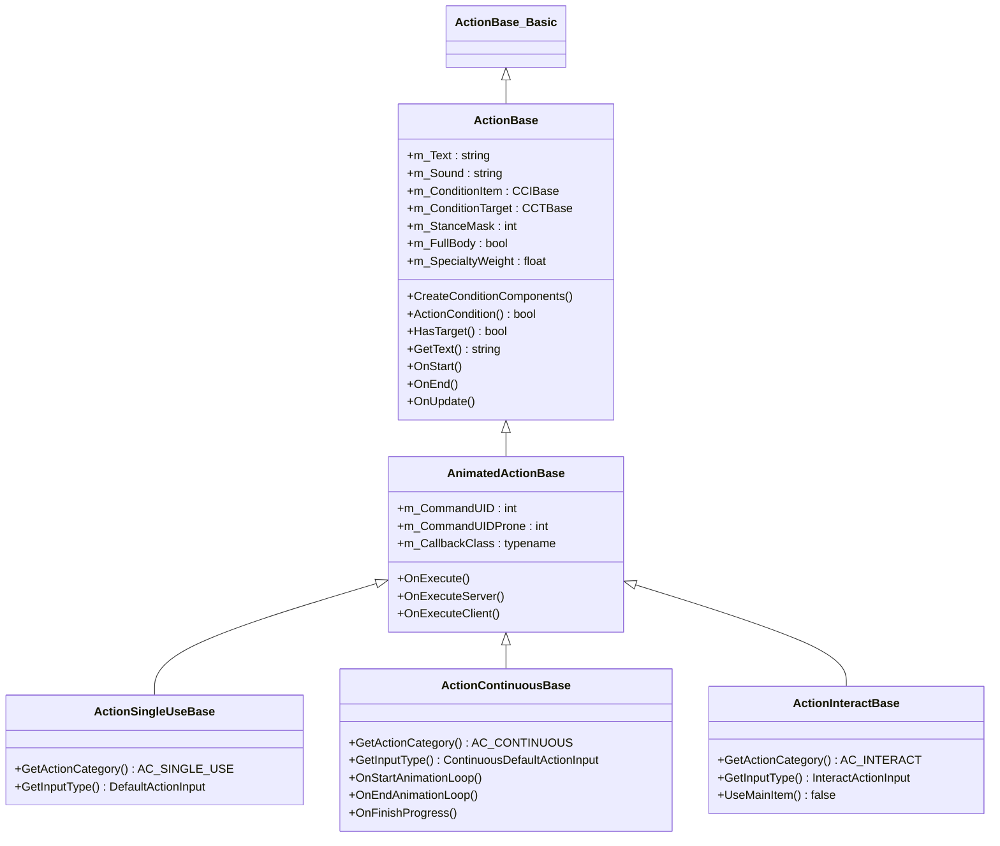
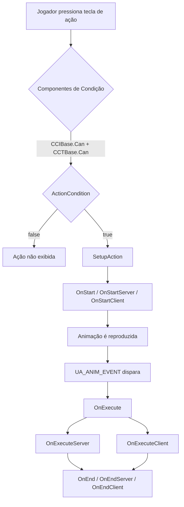
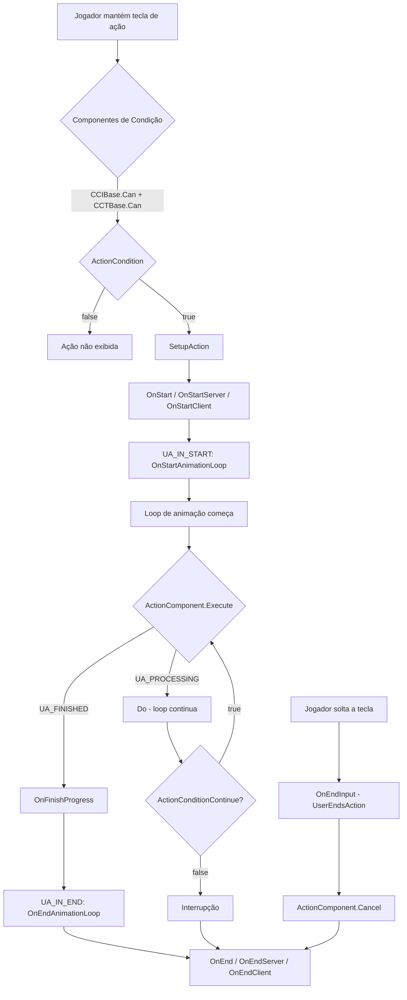
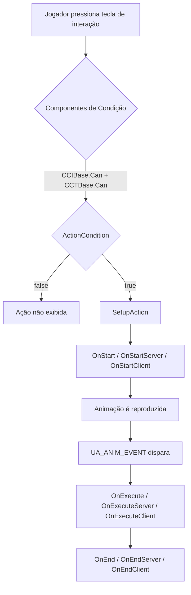

# Capítulo 6.12: Sistema de Ações

[Início](../README.md) | [<< Anterior: Hooks de Missão](11-mission-hooks.md) | **Sistema de Ações** | [Próximo: Sistema de Entrada >>](13-input-system.md)

---

## Introdução

O Sistema de Ações é como o DayZ gerencia todas as interações do jogador com itens e o mundo. Toda vez que um jogador come comida, abre uma porta, faz um curativo, repara uma parede ou liga uma lanterna, o motor executa o pipeline de ações. Entender esse pipeline --- desde verificações de condição até callbacks de animação e execução no servidor --- é fundamental para criar qualquer mod de gameplay interativo.

O sistema reside principalmente em `4_World/classes/useractionscomponent/` e é construído em torno de três pilares:

1. **Classes de ação** que definem o que acontece (lógica, condições, animações)
2. **Componentes de condição** que controlam quando uma ação pode aparecer (distância, estado do item, tipo do alvo)
3. **Componentes de ação** que controlam como a ação progride (tempo, quantidade, ciclos repetidos)

Este capítulo cobre a API completa, hierarquia de classes, ciclo de vida e padrões práticos para criar ações customizadas.

---

## Hierarquia de Classes

```
ActionBase_Basic                         // 3_Game — shell vazio, âncora de compilação
└── ActionBase                           // 4_World — lógica central, condições, eventos
    └── AnimatedActionBase               // 4_World — callbacks de animação, OnExecute
        ├── ActionSingleUseBase          // ações instantâneas (tomar pílula, ligar lanterna)
        ├── ActionContinuousBase         // ações com barra de progresso (curativo, reparo, comer)
        └── ActionInteractBase           // interações com o mundo (abrir porta, alternar interruptor)
```



### Diferenças Principais Entre Tipos de Ação

| Propriedade | SingleUse | Continuous | Interact |
|----------|-----------|------------|----------|
| Constante de categoria | `AC_SINGLE_USE` | `AC_CONTINUOUS` | `AC_INTERACT` |
| Tipo de entrada | `DefaultActionInput` | `ContinuousDefaultActionInput` | `InteractActionInput` |
| Barra de progresso | Não | Sim | Não |
| Usa item principal | Sim | Sim | Não (padrão) |
| Tem alvo | Varia | Varia | Sim (padrão) |
| Uso típico | Tomar pílula, alternar lanterna | Curativo, reparo, comer comida | Abrir porta, ligar gerador |
| Classe de callback | `ActionSingleUseBaseCB` | `ActionContinuousBaseCB` | `ActionInteractBaseCB` |

---

## Ciclo de Vida da Ação

### Constantes de Estado

A máquina de estados da ação usa estas constantes definidas em `3_Game/constants.c`:

| Constante | Valor | Significado |
|----------|-------|---------|
| `UA_NONE` | 0 | Nenhuma ação em execução |
| `UA_PROCESSING` | 2 | Ação em progresso |
| `UA_FINISHED` | 4 | Ação completada com sucesso |
| `UA_CANCEL` | 5 | Ação cancelada pelo jogador |
| `UA_INTERRUPT` | 6 | Ação interrompida externamente |
| `UA_INITIALIZE` | 12 | Ação contínua inicializando |
| `UA_ERROR` | 24 | Estado de erro --- ação abortada |
| `UA_ANIM_EVENT` | 11 | Evento de execução de animação disparado |
| `UA_IN_START` | 17 | Evento de início do loop de animação |
| `UA_IN_END` | 18 | Evento de fim do loop de animação |

### Fluxo de Ação SingleUse



### Fluxo de Ação Continuous



### Fluxo de Ação Interact



### Referência de Métodos do Ciclo de Vida

Esses métodos são chamados em ordem durante o tempo de vida de uma ação. Sobrescreva-os em suas ações customizadas:

| Método | Chamado em | Propósito |
|--------|-----------|---------|
| `CreateConditionComponents()` | Ambos | Definir `m_ConditionItem` e `m_ConditionTarget` |
| `ActionCondition()` | Ambos | Validação customizada (distância, estado, verificações de tipo) |
| `ActionConditionContinue()` | Ambos | Apenas contínuo: re-verificado a cada frame durante o progresso |
| `SetupAction()` | Ambos | Interno: constrói `ActionData`, reserva inventário |
| `OnStart()` | Ambos | Ação começa (cancela posicionamento se ativo) |
| `OnStartServer()` | Servidor | Lógica de início no lado do servidor |
| `OnStartClient()` | Cliente | Efeitos de início no lado do cliente |
| `OnExecute()` | Ambos | Evento de animação disparado --- execução principal |
| `OnExecuteServer()` | Servidor | Lógica de execução no lado do servidor |
| `OnExecuteClient()` | Cliente | Efeitos de execução no lado do cliente |
| `OnFinishProgress()` | Ambos | Apenas contínuo: um ciclo completado |
| `OnFinishProgressServer()` | Servidor | Apenas contínuo: ciclo completo no servidor |
| `OnFinishProgressClient()` | Cliente | Apenas contínuo: ciclo completo no cliente |
| `OnStartAnimationLoop()` | Ambos | Apenas contínuo: loop de animação começa |
| `OnEndAnimationLoop()` | Ambos | Apenas contínuo: loop de animação termina |
| `OnEnd()` | Ambos | Ação finalizada (sucesso ou cancelamento) |
| `OnEndServer()` | Servidor | Limpeza no lado do servidor |
| `OnEndClient()` | Cliente | Limpeza no lado do cliente |

---

## ActionData

Toda ação em execução carrega uma instância de `ActionData` que contém o contexto de tempo de execução. Ela é passada para todo método do ciclo de vida:

```c
class ActionData
{
    ref ActionBase       m_Action;          // a classe de ação sendo executada
    ItemBase             m_MainItem;        // item nas mãos do jogador (ou null)
    ActionBaseCB         m_Callback;        // handler de callback de animação
    ref CABase           m_ActionComponent;  // componente de progresso (tempo, quantidade)
    int                  m_State;           // estado atual (UA_PROCESSING, etc.)
    ref ActionTarget     m_Target;          // objeto alvo + info de acerto
    PlayerBase           m_Player;          // jogador executando a ação
    bool                 m_WasExecuted;     // true após OnExecute disparar
    bool                 m_WasActionStarted; // true após loop de ação iniciar
}
```

Você pode estender `ActionData` para dados customizados. Sobrescreva `CreateActionData()` na sua ação:

```c
class MyCustomActionData : ActionData
{
    int m_CustomValue;
}

class MyCustomAction : ActionContinuousBase
{
    override ActionData CreateActionData()
    {
        return new MyCustomActionData;
    }

    override void OnFinishProgressServer(ActionData action_data)
    {
        MyCustomActionData data = MyCustomActionData.Cast(action_data);
        data.m_CustomValue = data.m_CustomValue + 1;
        // ... usar dados customizados
    }
}
```

---

## ActionTarget

A classe `ActionTarget` representa para o que o jogador está mirando:

**Arquivo:** `4_World/classes/useractionscomponent/actiontargets.c`

```c
class ActionTarget
{
    Object GetObject();         // o objeto direto sob o cursor (ou proxy filho)
    Object GetParent();         // objeto pai (se o alvo é um proxy/anexo)
    bool   IsProxy();           // true se o alvo tem um pai
    int    GetComponentIndex(); // índice do componente de geometria (seleção nomeada)
    float  GetUtility();        // pontuação de prioridade
    vector GetCursorHitPos();   // posição exata do mundo do acerto do cursor
}
```

### Como os Alvos São Selecionados

A classe `ActionTargets` é executada a cada frame no cliente, coletando alvos potenciais:

1. **Raycast** da posição da câmera na direção da câmera (`c_RayDistance`)
2. **Varredura de proximidade** para objetos próximos ao redor do jogador
3. Para cada candidato, o motor chama `GetActions()` no objeto para encontrar ações registradas
4. Os componentes de condição de cada ação (`CCIBase.Can()`, `CCTBase.Can()`) e `ActionCondition()` são testados
5. Ações válidas são classificadas por utilidade e exibidas no HUD

---

## Componentes de Condição

Toda ação tem dois componentes de condição definidos em `CreateConditionComponents()`. Estes são verificados **antes** de `ActionCondition()` e determinam se a ação pode aparecer no HUD do jogador.

### Condições de Item (CCIBase)

Controla se o item na mão do jogador se qualifica para esta ação.

**Arquivo:** `4_World/classes/useractionscomponent/itemconditioncomponents/`

| Classe | Comportamento |
|-------|----------|
| `CCINone` | Sempre passa --- sem requisito de item |
| `CCIDummy` | Passa se o item não é null (item deve existir) |
| `CCINonRuined` | Passa se o item existe E não está arruinado |
| `CCINotPresent` | Passa se o item é null (mãos devem estar vazias) |
| `CCINotRuinedAndEmpty` | Passa se o item existe, não arruinado e não vazio |

```c
// CCINone — sem item necessário, sempre true
class CCINone : CCIBase
{
    override bool Can(PlayerBase player, ItemBase item) { return true; }
    override bool CanContinue(PlayerBase player, ItemBase item) { return true; }
}

// CCINotPresent — mãos devem estar vazias
class CCINotPresent : CCIBase
{
    override bool Can(PlayerBase player, ItemBase item) { return !item; }
}

// CCINonRuined — item deve existir e não estar destruído
class CCINonRuined : CCIBase
{
    override bool Can(PlayerBase player, ItemBase item)
    {
        return (item && !item.IsDamageDestroyed());
    }
}
```

### Condições de Alvo (CCTBase)

Controla se o objeto alvo (para o que o jogador está olhando) se qualifica.

**Arquivo:** `4_World/classes/useractionscomponent/targetconditionscomponents/`

| Classe | Construtor | Comportamento |
|-------|-------------|----------|
| `CCTNone` | `CCTNone()` | Sempre passa --- sem alvo necessário |
| `CCTDummy` | `CCTDummy()` | Passa se o objeto alvo existe |
| `CCTSelf` | `CCTSelf()` | Passa se o jogador existe e está vivo |
| `CCTObject` | `CCTObject(float dist)` | Objeto alvo dentro da distância |
| `CCTCursor` | `CCTCursor(float dist)` | Posição de acerto do cursor dentro da distância |
| `CCTNonRuined` | `CCTNonRuined(float dist)` | Alvo dentro da distância E não arruinado |
| `CCTCursorParent` | `CCTCursorParent(float dist)` | Cursor no objeto pai dentro da distância |

A distância é medida tanto da posição raiz do jogador quanto da posição do bone da cabeça (a que for mais próxima). A verificação de `CCTObject`:

```c
class CCTObject : CCTBase
{
    protected float m_MaximalActionDistanceSq;

    void CCTObject(float maximal_target_distance = UAMaxDistances.DEFAULT)
    {
        m_MaximalActionDistanceSq = maximal_target_distance * maximal_target_distance;
    }

    override bool Can(PlayerBase player, ActionTarget target)
    {
        Object targetObject = target.GetObject();
        if (!targetObject || !player)
            return false;

        vector playerHeadPos;
        MiscGameplayFunctions.GetHeadBonePos(player, playerHeadPos);

        float distanceRoot = vector.DistanceSq(targetObject.GetPosition(), player.GetPosition());
        float distanceHead = vector.DistanceSq(targetObject.GetPosition(), playerHeadPos);

        return (distanceRoot <= m_MaximalActionDistanceSq || distanceHead <= m_MaximalActionDistanceSq);
    }
}
```

### Constantes de Distância

**Arquivo:** `4_World/classes/useractionscomponent/actions/actionconstants.c`

| Constante | Valor (metros) | Uso típico |
|----------|---------------|-------------|
| `UAMaxDistances.SMALL` | 1.3 | Interações próximas, escadas |
| `UAMaxDistances.DEFAULT` | 2.0 | Ações padrão |
| `UAMaxDistances.REPAIR` | 3.0 | Ações de reparo |
| `UAMaxDistances.LARGE` | 8.0 | Ações de área grande |
| `UAMaxDistances.BASEBUILDING` | 20.0 | Construção de base |
| `UAMaxDistances.EXPLOSIVE_REMOTE_ACTIVATION` | 100.0 | Detonação remota |

---

## Registrando Ações em Itens

Ações são registradas em entidades através do padrão `SetActions()` / `AddAction()` / `RemoveAction()`. O motor chama `GetActions()` em uma entidade para recuperar sua lista de ações; na primeira vez que isso acontece, `InitializeActions()` constrói o mapa via `SetActions()`.

### Em ItemBase (Itens de Inventário)

O padrão mais comum. Sobrescreva `SetActions()` em uma `modded class`:

```c
modded class MyCustomItem extends ItemBase
{
    override void SetActions()
    {
        super.SetActions();          // CRÍTICO: manter todas as ações vanilla
        AddAction(MyCustomAction);   // adicionar sua ação
    }
}
```

Para remover uma ação vanilla e adicionar sua própria substituição:

```c
modded class Bandage_Basic extends ItemBase
{
    override void SetActions()
    {
        super.SetActions();
        RemoveAction(ActionBandageTarget);       // remover vanilla
        AddAction(MyImprovedBandageAction);      // adicionar substituição
    }
}
```

### Em BuildingBase (Construções do Mundo)

Construções usam o mesmo padrão, mas através de `BuildingBase`:

```c
// Exemplo vanilla: Poço registra ações de água
class Well extends BuildingSuper
{
    override void SetActions()
    {
        super.SetActions();
        AddAction(ActionWashHandsWell);
        AddAction(ActionDrinkWellContinuous);
    }
}
```

### Em PlayerBase (Ações do Jogador)

Ações no nível do jogador (beber de poças, abrir portas, etc.) são registradas em `PlayerBase.SetActions()`. Existem duas assinaturas:

```c
// Abordagem moderna (recomendada) — usa parâmetro InputActionMap
void SetActions(out TInputActionMap InputActionMap)
{
    AddAction(ActionOpenDoors, InputActionMap);
    AddAction(ActionCloseDoors, InputActionMap);
    // ...
}

// Abordagem legada (compatibilidade retroativa) — não recomendada
void SetActions()
{
    // ...
}
```

O jogador também tem `SetActionsRemoteTarget()` para ações realizadas **em** um jogador por outro jogador (RCP, verificar pulso, etc.):

```c
void SetActionsRemoteTarget(out TInputActionMap InputActionMap)
{
    AddAction(ActionCPR, InputActionMap);
    AddAction(ActionCheckPulseTarget, InputActionMap);
}
```

### Como o Sistema de Registro Funciona Internamente

Cada tipo de entidade mantém um `TInputActionMap` estático (um `map<typename, ref array<ActionBase_Basic>>`) indexado por tipo de entrada. Quando `AddAction()` é chamado:

1. O singleton da ação é obtido de `ActionManagerBase.GetAction()`
2. O tipo de entrada da ação é consultado (`GetInputType()`)
3. A ação é inserida no array para aquele tipo de entrada
4. Em tempo de execução, o motor consulta todas as ações para o tipo de entrada correspondente

Isso significa que ações são compartilhadas por **tipo** (classe), não por instância. Todos os itens da mesma classe compartilham a mesma lista de ações.

---

## Criando uma Ação Customizada --- Passo a Passo

### Exemplo 1: Ação Simples de Uso Único

Uma ação customizada que cura instantaneamente o jogador quando ele usa um item especial:

```c
// Arquivo: 4_World/actions/ActionHealInstant.c

class ActionHealInstant : ActionSingleUseBase
{
    void ActionHealInstant()
    {
        m_CommandUID = DayZPlayerConstants.CMD_ACTIONMOD_EAT_PILL;
        m_CommandUIDProne = DayZPlayerConstants.CMD_ACTIONFB_EAT_PILL;
        m_Text = "#heal";  // chave de stringtable, ou texto simples: "Curar"
    }

    override void CreateConditionComponents()
    {
        m_ConditionItem = new CCINonRuined;    // item não deve estar arruinado
        m_ConditionTarget = new CCTSelf;       // auto-ação
    }

    override bool HasTarget()
    {
        return false;  // sem alvo externo necessário
    }

    override bool HasProneException()
    {
        return true;  // permitir animação diferente quando deitado
    }

    override bool ActionCondition(PlayerBase player, ActionTarget target, ItemBase item)
    {
        // Mostrar apenas se o jogador está realmente ferido
        if (player.GetHealth("GlobalHealth", "Health") >= player.GetMaxHealth("GlobalHealth", "Health"))
            return false;

        return true;
    }

    override void OnExecuteServer(ActionData action_data)
    {
        // Curar o jogador no servidor
        PlayerBase player = action_data.m_Player;
        player.SetHealth("GlobalHealth", "Health", player.GetMaxHealth("GlobalHealth", "Health"));

        // Consumir o item (reduzir quantidade em 1)
        ItemBase item = action_data.m_MainItem;
        if (item)
        {
            item.AddQuantity(-1);
        }
    }

    override void OnExecuteClient(ActionData action_data)
    {
        // Opcional: reproduzir efeito no cliente, som ou notificação
    }
}
```

Registrar em um item:

```c
// Arquivo: 4_World/entities/HealingKit.c

modded class HealingKit extends ItemBase
{
    override void SetActions()
    {
        super.SetActions();
        AddAction(ActionHealInstant);
    }
}
```

### Exemplo 2: Ação Contínua com Barra de Progresso

Uma ação de reparo customizada que leva tempo e consome durabilidade do item:

```c
// Arquivo: 4_World/actions/ActionRepairCustom.c

// Passo 1: Definir o callback com um componente de ação
class ActionRepairCustomCB : ActionContinuousBaseCB
{
    override void CreateActionComponent()
    {
        // CAContinuousTime(segundos) — barra de progresso única que completa uma vez
        m_ActionData.m_ActionComponent = new CAContinuousTime(UATimeSpent.DEFAULT_REPAIR_CYCLE);
    }
}

// Passo 2: Definir a ação
class ActionRepairCustom : ActionContinuousBase
{
    void ActionRepairCustom()
    {
        m_CallbackClass = ActionRepairCustomCB;
        m_CommandUID = DayZPlayerConstants.CMD_ACTIONFB_ASSEMBLE;
        m_FullBody = true;  // animação de corpo inteiro (jogador não pode se mover)
        m_StanceMask = DayZPlayerConstants.STANCEMASK_ERECT;
        m_SpecialtyWeight = UASoftSkillsWeight.ROUGH_HIGH;
        m_Text = "#repair";
    }

    override void CreateConditionComponents()
    {
        m_ConditionItem = new CCINonRuined;
        m_ConditionTarget = new CCTObject(UAMaxDistances.REPAIR);
    }

    override bool ActionCondition(PlayerBase player, ActionTarget target, ItemBase item)
    {
        Object obj = target.GetObject();
        if (!obj)
            return false;

        // Permitir apenas reparar objetos danificados (mas não arruinados)
        EntityAI entity = EntityAI.Cast(obj);
        if (!entity)
            return false;

        float health = entity.GetHealth("", "Health");
        float maxHealth = entity.GetMaxHealth("", "Health");

        // Deve estar danificado mas não arruinado
        if (health >= maxHealth || entity.IsDamageDestroyed())
            return false;

        return true;
    }

    override void OnFinishProgressServer(ActionData action_data)
    {
        // Chamado quando a barra de progresso completa
        Object target = action_data.m_Target.GetObject();
        if (target)
        {
            EntityAI entity = EntityAI.Cast(target);
            if (entity)
            {
                // Restaurar alguma vida
                float currentHealth = entity.GetHealth("", "Health");
                entity.SetHealth("", "Health", currentHealth + 25);
            }
        }

        // Danificar a ferramenta
        action_data.m_MainItem.DecreaseHealth(UADamageApplied.REPAIR, false);
    }
}
```

### Exemplo 3: Ação Interact (Alternância de Objeto do Mundo)

Uma ação de interação para alternar um dispositivo customizado ligado/desligado:

```c
// Arquivo: 4_World/actions/ActionToggleMyDevice.c

class ActionToggleMyDevice : ActionInteractBase
{
    void ActionToggleMyDevice()
    {
        m_CommandUID = DayZPlayerConstants.CMD_ACTIONMOD_INTERACTONCE;
        m_StanceMask = DayZPlayerConstants.STANCEMASK_CROUCH | DayZPlayerConstants.STANCEMASK_ERECT;
        m_Text = "#switch_on";
    }

    override void CreateConditionComponents()
    {
        m_ConditionItem = new CCINone;     // sem item necessário nas mãos
        m_ConditionTarget = new CCTCursor(UAMaxDistances.DEFAULT);
    }

    override bool ActionCondition(PlayerBase player, ActionTarget target, ItemBase item)
    {
        Object obj = target.GetObject();
        if (!obj)
            return false;

        // Verificar se o alvo é nosso tipo de dispositivo customizado
        MyCustomDevice device = MyCustomDevice.Cast(obj);
        if (!device)
            return false;

        // Atualizar texto de exibição baseado no estado atual
        if (device.IsActive())
            m_Text = "#switch_off";
        else
            m_Text = "#switch_on";

        return true;
    }

    override void OnExecuteServer(ActionData action_data)
    {
        MyCustomDevice device = MyCustomDevice.Cast(action_data.m_Target.GetObject());
        if (device)
        {
            if (device.IsActive())
                device.Deactivate();
            else
                device.Activate();
        }
    }
}
```

Registrar na construção/dispositivo:

```c
class MyCustomDevice extends BuildingBase
{
    override void SetActions()
    {
        super.SetActions();
        AddAction(ActionToggleMyDevice);
    }
}
```

### Exemplo 4: Ação com Requisito de Item Específico

Uma ação que requer que o jogador segure um tipo específico de ferramenta enquanto mira em um objeto específico:

```c
class ActionUnlockWithKey : ActionInteractBase
{
    void ActionUnlockWithKey()
    {
        m_CommandUID = DayZPlayerConstants.CMD_ACTIONMOD_INTERACTONCE;
        m_Text = "Destrancar";
    }

    override void CreateConditionComponents()
    {
        m_ConditionItem = new CCINonRuined;   // deve segurar um item não arruinado
        m_ConditionTarget = new CCTObject(UAMaxDistances.DEFAULT);
    }

    override bool UseMainItem()
    {
        return true;  // ação requer um item na mão
    }

    override bool MainItemAlwaysInHands()
    {
        return true;  // item deve estar nas mãos, não apenas no inventário
    }

    override bool ActionCondition(PlayerBase player, ActionTarget target, ItemBase item)
    {
        // Item deve ser uma chave
        if (!item || !item.IsInherited(MyKeyItem))
            return false;

        // Alvo deve ser um contêiner trancado
        MyLockedContainer container = MyLockedContainer.Cast(target.GetObject());
        if (!container || !container.IsLocked())
            return false;

        return true;
    }

    override void OnExecuteServer(ActionData action_data)
    {
        MyLockedContainer container = MyLockedContainer.Cast(action_data.m_Target.GetObject());
        if (container)
        {
            container.Unlock();
        }
    }
}
```

---

## Componentes de Ação (Controle de Progresso)

Componentes de ação controlam _como_ a ação progride ao longo do tempo. Eles são criados no método `CreateActionComponent()` do callback.

**Arquivo:** `4_World/classes/useractionscomponent/actioncomponents/`

### Componentes Disponíveis

| Componente | Parâmetros | Comportamento |
|-----------|------------|----------|
| `CASingleUse` | nenhum | Execução instantânea, sem progresso |
| `CAInteract` | nenhum | Execução instantânea para ações de interação |
| `CAContinuousTime` | `float time` | Barra de progresso, completa após `time` segundos |
| `CAContinuousRepeat` | `float time` | Ciclos repetidos, dispara `OnFinishProgress` a cada ciclo |
| `CAContinuousQuantity` | `float quantity, float time` | Consome quantidade ao longo do tempo |
| `CAContinuousQuantityEdible` | `float quantity, float time` | Como Quantity mas aplica modificadores de comida/bebida |

### CAContinuousTime

Barra de progresso única que completa uma vez:

```c
class MyActionCB : ActionContinuousBaseCB
{
    override void CreateActionComponent()
    {
        // Barra de progresso de 5 segundos
        m_ActionData.m_ActionComponent = new CAContinuousTime(UATimeSpent.DEFAULT_CONSTRUCT);
    }
}
```

### CAContinuousRepeat

Ciclos repetidos --- `OnFinishProgressServer()` é chamado cada vez que um ciclo completa, e a ação continua até o jogador soltar a tecla:

```c
class MyRepeatActionCB : ActionContinuousBaseCB
{
    override void CreateActionComponent()
    {
        // Cada ciclo leva 5 segundos, repete até o jogador parar
        m_ActionData.m_ActionComponent = new CAContinuousRepeat(UATimeSpent.DEFAULT_REPAIR_CYCLE);
    }
}
```

### Constantes de Tempo

**Arquivo:** `4_World/classes/useractionscomponent/actions/actionconstants.c`

| Constante | Valor (segundos) | Uso |
|----------|----------------|-----|
| `UATimeSpent.DEFAULT` | 1.0 | Geral |
| `UATimeSpent.DEFAULT_CONSTRUCT` | 5.0 | Construção |
| `UATimeSpent.DEFAULT_REPAIR_CYCLE` | 5.0 | Reparo por ciclo |
| `UATimeSpent.DEFAULT_DEPLOY` | 5.0 | Implantação de itens |
| `UATimeSpent.BANDAGE` | 4.0 | Curativo |
| `UATimeSpent.RESTRAIN` | 10.0 | Amarrar |
| `UATimeSpent.SHAVE` | 12.75 | Barbear |
| `UATimeSpent.SKIN` | 10.0 | Esfolar animais |
| `UATimeSpent.DIG_STASH` | 10.0 | Cavar esconderijo |

---

## Exemplos Vanilla Anotados

### ActionOpenDoors (Interact)

**Arquivo:** `4_World/classes/useractionscomponent/actions/interact/actionopendoors.c`

```c
class ActionOpenDoors : ActionInteractBase
{
    void ActionOpenDoors()
    {
        m_CommandUID  = DayZPlayerConstants.CMD_ACTIONMOD_OPENDOORFW;
        m_StanceMask  = DayZPlayerConstants.STANCEMASK_CROUCH | DayZPlayerConstants.STANCEMASK_ERECT;
        m_Text        = "#open";   // referência de stringtable
    }

    override void CreateConditionComponents()
    {
        m_ConditionItem   = new CCINone();      // sem item necessário
        m_ConditionTarget = new CCTCursor();     // cursor deve estar em algo
    }

    override bool ActionCondition(PlayerBase player, ActionTarget target, ItemBase item)
    {
        if (!target)
            return false;

        Building building;
        if (Class.CastTo(building, target.GetObject()))
        {
            int doorIndex = building.GetDoorIndex(target.GetComponentIndex());
            if (doorIndex != -1)
            {
                if (!IsInReach(player, target, UAMaxDistances.DEFAULT))
                    return false;
                return building.CanDoorBeOpened(doorIndex, true);
            }
        }
        return false;
    }

    override void OnStartServer(ActionData action_data)
    {
        super.OnStartServer(action_data);
        Building building;
        if (Class.CastTo(building, action_data.m_Target.GetObject()))
        {
            int doorIndex = building.GetDoorIndex(action_data.m_Target.GetComponentIndex());
            if (doorIndex != -1 && building.CanDoorBeOpened(doorIndex, true))
                building.OpenDoor(doorIndex);
        }
    }
}
```

Pontos-chave:
- Usa `OnStartServer()` (não `OnExecuteServer()`) porque ações interact disparam imediatamente
- `GetComponentIndex()` recupera qual porta o jogador está olhando
- Verificação de distância feita manualmente com `IsInReach()` e também via `CCTCursor`

### ActionTurnOnPowerGenerator (Interact)

**Arquivo:** `4_World/classes/useractionscomponent/actions/interact/actionturnonpowergenerator.c`

```c
class ActionTurnOnPowerGenerator : ActionInteractBase
{
    void ActionTurnOnPowerGenerator()
    {
        m_CommandUID = DayZPlayerConstants.CMD_ACTIONMOD_INTERACTONCE;
        m_Text = "#switch_on";
    }

    override bool ActionCondition(PlayerBase player, ActionTarget target, ItemBase item)
    {
        PowerGeneratorBase pg = PowerGeneratorBase.Cast(target.GetObject());
        if (pg)
        {
            return pg.HasEnergyManager()
                && pg.GetCompEM().CanSwitchOn()
                && pg.HasSparkplug()
                && pg.GetCompEM().CanWork();
        }
        return false;
    }

    override void OnExecuteServer(ActionData action_data)
    {
        ItemBase target_IB = ItemBase.Cast(action_data.m_Target.GetObject());
        if (target_IB)
        {
            target_IB.GetCompEM().SwitchOn();
            target_IB.GetCompEM().InteractBranch(target_IB);
        }
    }
}
```

Pontos-chave:
- Herda o `CreateConditionComponents()` padrão de `ActionInteractBase` (`CCINone` + `CCTObject(DEFAULT)`)
- Usa `OnExecuteServer()` para a alternância real --- isso dispara no evento de animação
- Múltiplas verificações de condição encadeadas em `ActionCondition()`

### ActionEat (Continuous)

**Arquivo:** `4_World/classes/useractionscomponent/actions/continuous/actioneat.c`

```c
class ActionEatBigCB : ActionContinuousBaseCB
{
    override void CreateActionComponent()
    {
        m_ActionData.m_ActionComponent = new CAContinuousQuantityEdible(
            UAQuantityConsumed.EAT_BIG,   // 25 unidades consumidas por ciclo
            UATimeSpent.DEFAULT            // 1 segundo por ciclo
        );
    }
}

class ActionEatBig : ActionConsume
{
    void ActionEatBig()
    {
        m_CallbackClass = ActionEatBigCB;
        m_Text = "#eat";
    }

    override void CreateConditionComponents()
    {
        m_ConditionItem = new CCINonRuined;
        m_ConditionTarget = new CCTSelf;
    }

    override bool HasTarget()
    {
        return false;
    }
}
```

Pontos-chave:
- A classe de callback controla o ritmo (`CAContinuousQuantityEdible`)
- `ActionConsume` (o pai) gerencia toda a lógica de consumo de comida
- `HasTarget()` retorna false --- comer é uma auto-ação
- Tamanhos de porção diferentes apenas trocam a classe de callback com valores diferentes de `UAQuantityConsumed`

---

## Tópicos Avançados

### Máscaras de Condição de Ação

Ações podem ser restritas a estados específicos do jogador usando `ActionConditionMask`:

```c
enum ActionConditionMask
{
    ACM_NO_EXEPTION    = 0,     // sem condições especiais
    ACM_IN_VEHICLE     = 1,     // pode usar em veículo
    ACM_ON_LADDER      = 2,     // pode usar em escada
    ACM_SWIMMING       = 4,     // pode usar nadando
    ACM_RESTRAIN       = 8,     // pode usar enquanto amarrado
    ACM_RAISED         = 16,    // pode usar com arma levantada
    ACM_ON_BACK        = 32,    // pode usar de costas
    ACM_THROWING       = 64,    // pode usar enquanto arremessa
    ACM_LEANING        = 128,   // pode usar enquanto inclina
    ACM_BROKEN_LEGS    = 256,   // pode usar com pernas quebradas
    ACM_IN_FREELOOK    = 512,   // pode usar em freelook
}
```

Sobrescreva os métodos correspondentes na sua ação para habilitar estes:

```c
class MyVehicleAction : ActionSingleUseBase
{
    override bool CanBeUsedInVehicle()  { return true; }
    override bool CanBeUsedSwimming()   { return false; }
    override bool CanBeUsedOnLadder()   { return false; }
    override bool CanBeUsedInRestrain() { return false; }
}
```

### Animações de Corpo Inteiro vs Aditivas

Ações podem ser **aditivas** (jogador pode andar) ou **corpo inteiro** (jogador fica travado no lugar):

```c
class MyFullBodyAction : ActionContinuousBase
{
    void MyFullBodyAction()
    {
        m_FullBody = true;   // jogador não pode se mover durante a ação
        m_CommandUID = DayZPlayerConstants.CMD_ACTIONFB_ASSEMBLE;
        m_StanceMask = DayZPlayerConstants.STANCEMASK_ERECT;
    }
}
```

- **Aditiva** (`m_FullBody = false`): Usa UIDs de comando `CMD_ACTIONMOD_*`. Jogador pode andar.
- **Corpo inteiro** (`m_FullBody = true`): Usa UIDs de comando `CMD_ACTIONFB_*`. Jogador fica parado.

### Exceção para Deitado

Algumas ações precisam de animações diferentes quando deitado vs em pé:

```c
override bool HasProneException()
{
    return true;  // usa m_CommandUIDProne quando jogador está deitado
}
```

Quando `HasProneException()` retorna true, o motor usa `m_CommandUIDProne` em vez de `m_CommandUID` se o jogador estiver na postura deitada.

### Interrupção de Ação

Ações podem ser interrompidas no lado do servidor através do callback:

```c
override void OnFinishProgressServer(ActionData action_data)
{
    // Verificar se a ação deve ser interrompida
    if (SomeConditionFailed())
    {
        if (action_data.m_Callback)
            action_data.m_Callback.Interrupt();
        return;
    }

    // Execução normal...
}
```

### Execução via Inventário e Quickbar

Ações podem ser configuradas para executar a partir da tela de inventário ou quickbar:

```c
override bool CanBePerformedFromInventory()
{
    return true;   // ação aparece no menu de contexto do item no inventário
}

override bool CanBePerformedFromQuickbar()
{
    return true;   // ação pode ser acionada via quickbar
}
```

### Travar Alvo ao Usar

Por padrão, ações com alvos travam o alvo para que apenas um jogador possa interagir de cada vez:

```c
override bool IsLockTargetOnUse()
{
    return false;  // permitir múltiplos jogadores interagirem simultaneamente
}
```

---

## Constantes de Categoria de Ação

**Arquivo:** `4_World/classes/useractionscomponent/_constants.c`

| Constante | Valor | Descrição |
|----------|-------|-------------|
| `AC_UNCATEGORIZED` | 0 | Padrão --- não deve ser usado |
| `AC_SINGLE_USE` | 1 | Ações de uso único |
| `AC_CONTINUOUS` | 2 | Ações contínuas (barra de progresso) |
| `AC_INTERACT` | 3 | Ações de interação |

---

## Erros Comuns

### 1. Esquecendo `super.SetActions()`

**Errado:**
```c
modded class Apple extends ItemBase
{
    override void SetActions()
    {
        // Faltando super.SetActions()!
        AddAction(MyCustomEatAction);
    }
}
```

Isso **remove todas as ações vanilla** do item. O jogador não poderá mais comer, soltar ou interagir com maçãs através de ações padrão.

**Correto:**
```c
modded class Apple extends ItemBase
{
    override void SetActions()
    {
        super.SetActions();          // preservar ações vanilla
        AddAction(MyCustomEatAction);
    }
}
```

### 2. Colocando Lógica do Servidor em OnExecuteClient

**Errado:**
```c
override void OnExecuteClient(ActionData action_data)
{
    action_data.m_Player.SetHealth("GlobalHealth", "Health", 100);  // SEM EFEITO
    action_data.m_MainItem.Delete();  // apenas no cliente, vai dessincronizar
}
```

Mudanças de vida e operações de inventário devem acontecer no servidor. `OnExecuteClient` é apenas para feedback visual (sons, efeitos de partículas, atualizações de UI).

**Correto:**
```c
override void OnExecuteServer(ActionData action_data)
{
    action_data.m_Player.SetHealth("GlobalHealth", "Health", 100);
    action_data.m_MainItem.Delete();
}

override void OnExecuteClient(ActionData action_data)
{
    // Apenas feedback visual
}
```

### 3. Não Verificando Null em ActionCondition

**Errado:**
```c
override bool ActionCondition(PlayerBase player, ActionTarget target, ItemBase item)
{
    return target.GetObject().IsInherited(MyClass);  // CRASH se target ou object for null
}
```

**Correto:**
```c
override bool ActionCondition(PlayerBase player, ActionTarget target, ItemBase item)
{
    if (!target)
        return false;

    Object obj = target.GetObject();
    if (!obj)
        return false;

    return obj.IsInherited(MyClass);
}
```

### 4. Componentes de Condição Errados (Ação Nunca Aparece)

**Problema:** A ação não aparece no HUD.

Causas comuns:
- `CCIDummy` requer um item na mão, mas a ação deveria funcionar com mãos vazias --- use `CCINone` em vez disso
- `CCTDummy` requer um objeto alvo, mas a ação é auto-ação --- use `CCTSelf` ou `CCTNone`
- Distância de `CCTObject` muito pequena para o tipo de alvo --- aumente o parâmetro de distância
- `HasTarget()` retorna true mas não há condição de alvo válida --- adicione `CCTCursor`/`CCTObject` ou defina `HasTarget()` para false

### 5. Confundindo OnStart vs OnExecute

- `OnStart` / `OnStartServer`: Chamado quando a ação **começa** (animação inicia). Use para preparação, reservar itens.
- `OnExecute` / `OnExecuteServer`: Chamado quando o **evento de animação dispara** (o momento de "fazer"). Use para o efeito real.

Para ações interact, `OnStartServer` é comumente usado porque a ação é instantânea. Para ações de uso único, `OnExecuteServer` dispara no evento de animação. Escolha o correto baseado em quando você precisa que o efeito aconteça.

### 6. Ação Contínua Não Repetindo

Se sua ação contínua completa uma vez e para em vez de repetir, você está usando `CAContinuousTime` (conclusão única). Troque para `CAContinuousRepeat` para ciclos repetidos:

```c
// Conclusão única — barra de progresso enche uma vez e a ação termina
m_ActionData.m_ActionComponent = new CAContinuousTime(5.0);

// Repetição — barra de progresso enche, dispara OnFinishProgress, reseta, continua
m_ActionData.m_ActionComponent = new CAContinuousRepeat(5.0);
```

### 7. Ação Aparece em Itens Errados

Lembre-se: `SetActions()` é chamado por **tipo de classe**, não por instância. Se você adiciona uma ação em uma classe pai, todos os filhos a herdam. Se você quer a ação apenas em subclasses específicas, ou:
- Adicione apenas no `SetActions()` da subclasse específica
- Adicione uma verificação de tipo em `ActionCondition()` como proteção

### 8. Esquecendo Sobrescrita de HasTarget()

Se sua ação é auto-ação (comer, curar, alternar item segurado), você deve sobrescrever:

```c
override bool HasTarget()
{
    return false;
}
```

Sem isso, o motor espera um objeto alvo e pode não mostrar a ação, ou tentará sincronizar um alvo inexistente para o servidor.

---

## Referência Rápida de Localizações de Arquivo

| Arquivo | Propósito |
|------|---------|
| `4_World/classes/useractionscomponent/actionbase.c` | `ActionBase` --- classe central de ação |
| `4_World/classes/useractionscomponent/animatedactionbase.c` | `AnimatedActionBase` + `ActionBaseCB` |
| `4_World/classes/useractionscomponent/actions/actionsingleusebase.c` | `ActionSingleUseBase` |
| `4_World/classes/useractionscomponent/actions/actioncontinuousbase.c` | `ActionContinuousBase` |
| `4_World/classes/useractionscomponent/actions/actioninteractbase.c` | `ActionInteractBase` |
| `4_World/classes/useractionscomponent/actions/actionconstants.c` | `UATimeSpent`, `UAMaxDistances`, `UAQuantityConsumed` |
| `4_World/classes/useractionscomponent/_constants.c` | `AC_SINGLE_USE`, `AC_CONTINUOUS`, `AC_INTERACT` |
| `4_World/classes/useractionscomponent/actiontargets.c` | `ActionTarget`, `ActionTargets` |
| `4_World/classes/useractionscomponent/itemconditioncomponents/` | Classes `CCI*` |
| `4_World/classes/useractionscomponent/targetconditionscomponents/` | Classes `CCT*` |
| `4_World/classes/useractionscomponent/actioncomponents/` | Componentes de progresso `CA*` |
| `3_Game/constants.c` | `UA_NONE`, `UA_PROCESSING`, `UA_FINISHED`, etc. |

---

## Resumo

O Sistema de Ações do DayZ segue um padrão consistente:

1. **Escolha sua classe base**: `ActionSingleUseBase` para instantâneo, `ActionContinuousBase` para temporizado, `ActionInteractBase` para alternâncias do mundo
2. **Defina componentes de condição** em `CreateConditionComponents()`: CCI para requisitos de item, CCT para requisitos de alvo
3. **Adicione validação customizada** em `ActionCondition()`: verificações de tipo, estado, distância
4. **Implemente lógica do servidor** em `OnExecuteServer()` ou `OnFinishProgressServer()`
5. **Registre a ação** via `AddAction()` no `SetActions()` da entidade apropriada
6. **Sempre chame `super.SetActions()`** para preservar ações vanilla

O sistema é projetado para ser modular: componentes de condição gerenciam "isso pode acontecer?", componentes de ação gerenciam "quanto tempo leva?", e suas sobrescritas gerenciam "o que isso faz?". Mantenha a lógica do servidor no servidor, feedback visual no cliente, e sempre verifique null nos seus alvos.

---

## Boas Práticas

- **Sempre chame `super.SetActions()` ao modificar itens existentes.** Omitir isso remove todas as ações vanilla (comer, soltar, inspecionar) do item, quebrando a jogabilidade central.
- **Coloque toda lógica que altera estado em `OnExecuteServer` ou `OnFinishProgressServer`.** Mudanças de vida, exclusão de itens e manipulação de inventário devem rodar no lado do servidor. `OnExecuteClient` é apenas para feedback visual.
- **Use `CCTObject` com constantes de distância apropriadas.** Codificar verificações de distância em `ActionCondition()` é frágil. Os componentes de condição integrados gerenciam controle de distância, alinhamento de cursor e verificações de estado de item de forma consistente.
- **Verifique null em todo objeto em `ActionCondition()`.** O método é chamado frequentemente com alvos potencialmente null. Acessar `.GetObject()` sem proteção causa crashes difíceis de diagnosticar.
- **Prefira `CAContinuousRepeat` ao invés de `CAContinuousTime` para ações estilo reparo.** Repeat dispara `OnFinishProgressServer` a cada ciclo e continua até o jogador soltar a tecla, o que parece mais natural para tarefas contínuas.

---

## Compatibilidade e Impacto

- **Multi-Mod:** Ações são registradas por tipo de classe via `SetActions()`. Dois mods adicionando ações diferentes ao mesmo item funcionam -- ações se acumulam. Porém, se ambos os mods sobrescrevem `SetActions()` sem chamar `super`, apenas as ações do último mod carregado sobrevivem.
- **Performance:** `ActionCondition()` é avaliado a cada frame para cada ação candidata no alvo atual do jogador. Mantenha-o leve -- evite raycasts caros, consultas de configuração ou iterações de array dentro de verificações de condição.
- **Servidor/Cliente:** O pipeline de ações é dividido: verificações de condição e exibição de UI rodam no cliente, callbacks de execução rodam no servidor. O motor gerencia a sincronização via RPCs internos. Nunca dependa de estado do lado do cliente para lógica autoritativa do jogo.
