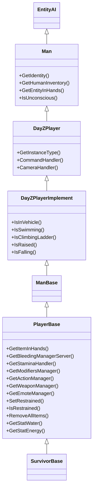

# Capítulo 6.14: Sistema do Jogador

[Início](../README.md) | [<< Anterior: Sistema de Entrada](13-input-system.md) | **Sistema do Jogador** | [Próximo: Sistema de Som >>](15-sound-system.md)

---

## Introdução

`PlayerBase` é a classe mais importante no modding de DayZ. Cada sistema de gameplay --- saúde, fome, sangramento, stamina, inventário, restrições, inconsciência --- vive na entidade do jogador ou em um de seus subsistemas gerenciadores. Seja escrevendo uma ferramenta de administração, uma mecânica de sobrevivência ou um mod PvP, você vai interagir com `PlayerBase` constantemente.

Este capítulo é uma referência de API para a hierarquia de classes do jogador, seu sistema de identidade, pools de saúde, verificações de estado, acesso a equipamentos e os objetos gerenciadores que conduzem os efeitos de status. Todas as assinaturas de métodos são extraídas diretamente do código-fonte vanilla dos scripts.

---

## Hierarquia de Classes

A entidade do jogador fica na base de uma cadeia profunda de herança. Cada nível adiciona capacidades:

```
Class (raiz de todas as classes do Enforce Script)
└── Managed
    └── IEntity                          // 1_Core/proto/enentity.c
        └── Object                       // 3_Game/entities/object.c
            └── ObjectTyped
                └── Entity
                    └── EntityAI         // 3_Game/entities/entityai.c
                        └── Man          // 3_Game/entities/man.c
                            └── DayZPlayer            // 3_Game/dayzplayer.c
                                └── DayZPlayerImplement  // 4_World/entities/dayzplayerimplement.c
                                    └── ManBase        // 4_World/entities/manbase.c
                                        └── PlayerBase // 4_World/entities/manbase/playerbase.c
                                            └── SurvivorBase  // definido na config
```

### Diagrama de Hierarquia



### O Que Cada Nível Fornece

| Classe | Adições Chave |
|--------|---------------|
| **Object** | `GetPosition()`, `SetPosition()`, `GetHealth()`, `SetHealth()`, `IsAlive()`, `SetAllowDamage()` |
| **EntityAI** | Inventário, anexos, zonas de dano, `EEInit()`, `EEKilled()`, `EEHitBy()`, variáveis de sync de rede |
| **Man** | `GetIdentity()`, `GetHumanInventory()`, `GetEntityInHands()`, `IsUnconscious()` |
| **DayZPlayer** | Tipo de instância, sistema de comandos, sistema de câmera, comandos de animação |
| **DayZPlayerImplement** | Verificações de estado de movimento (`IsInVehicle`, `IsSwimming`, `IsRaised`, `IsFalling`) |
| **ManBase** | Implementação base conectando DayZPlayerImplement ao PlayerBase |
| **PlayerBase** | Todos os sistemas de gameplay: sangramento, stamina, modificadores, stats, ações, equipamento |

---

## PlayerIdentity --- Quem É o Jogador?

**Arquivo:** `3_Game/gameplay.c`

`PlayerIdentity` representa a pessoa real por trás de uma entidade de jogador. Ela contém identificadores de rede e plataforma. Acesse-a de qualquer classe derivada de `Man` via `GetIdentity()`.

### Métodos Chave

| Método | Tipo de Retorno | Descrição |
|--------|----------------|-----------|
| `GetName()` | `string` | Nome de exibição (pode conter caracteres especiais) |
| `GetPlainName()` | `string` | Nome sem qualquer processamento |
| `GetFullName()` | `string` | Nome completo do jogador |
| `GetPlainId()` | `string` | Steam64 ID (único, persistente entre sessões) |
| `GetId()` | `string` | GUID do BattlEye (Steam ID hasheado --- seguro para bancos de dados e logs) |
| `GetPlayerId()` | `int` | ID de peer de rede (apenas da sessão, reutilizado após desconexão) |
| `GetPlayer()` | `Man` | A entidade do jogador à qual esta identidade pertence |
| `GetPingAct()` | `int` | Ping atual |
| `GetPingAvg()` | `int` | Ping médio |

### Exemplo de Uso

```c
void LogPlayerInfo(PlayerBase player)
{
    PlayerIdentity identity = player.GetIdentity();
    if (!identity)
        return;

    string name    = identity.GetName();       // "PlayerNick"
    string steamId = identity.GetPlainId();    // "76561198012345678"
    string beGuid  = identity.GetId();         // GUID hasheado do BattlEye
    int peerId     = identity.GetPlayerId();   // 2 (apenas da sessão)

    Print("Player: " + name + " Steam: " + steamId + " GUID: " + beGuid);
}
```

### GetPlainId() vs GetId()

Esta é uma fonte comum de confusão:

| Método | Valor | Caso de Uso |
|--------|-------|-------------|
| `GetPlainId()` | Steam64 ID bruto (`"76561198012345678"`) | Vincular a perfis Steam, identidade cross-server |
| `GetId()` | GUID hasheado do BattlEye | Armazenamento em banco de dados, logs de admin (ID recomendado pela Bohemia para persistência) |

> **Regra prática:** Use `GetPlainId()` quando precisar de um identificador legível para humanos ou busca cross-platform. Use `GetId()` ao armazenar dados em bancos de dados ou logs, pois a Bohemia o projetou para esse propósito.

---

## Sistema de Saúde

A saúde do jogador usa o mesmo sistema baseado em zonas de todas as entidades `Object`, mas com três pools separados que trabalham juntos para determinar a sobrevivência.

### Os Três Pools

| Pool | Zona/Tipo | Máximo Padrão | O Que o Drena |
|------|-----------|---------------|---------------|
| **Health** | `("", "Health")` | 100 | Fome, desidratação, queda, combate corpo a corpo, explosões |
| **Blood** | `("", "Blood")` | 5000 | Ferimentos de bala, sangramento, cortes |
| **Shock** | `("", "Shock")` | 100 | Impactos de bala, golpes corpo a corpo, granadas de flash |

Quando **Health** chega a 0, o jogador morre. Quando **Blood** cai demais, o jogador perde a consciência e eventualmente morre. Quando **Shock** cai para 0, o jogador fica inconsciente.

### Lendo Valores de Saúde

```c
// Pools globais de saúde (string vazia = zona global)
float health = player.GetHealth("", "Health");
float blood  = player.GetHealth("", "Blood");
float shock  = player.GetHealth("", "Shock");

// Valores máximos
float maxHealth = player.GetMaxHealth("", "Health");
float maxBlood  = player.GetMaxHealth("", "Blood");
float maxShock  = player.GetMaxHealth("", "Shock");

// Normalizado (faixa 0..1)
float health01 = player.GetHealth01("", "Health");

// Atalho (equivalente a GetHealth("", ""))
float hp = player.GetHealth();
```

### Modificando Saúde

Toda modificação de saúde é **autoritativa do servidor**. Chame esses métodos apenas no servidor.

```c
// Definir valor absoluto
player.SetHealth("", "Health", 100.0);    // Saúde total
player.SetHealth("", "Blood", 5000.0);    // Sangue total
player.SetHealth("", "Shock", 100.0);     // Choque total

// Adicionar (positivo) ou subtrair (negativo)
player.AddHealth("", "Health", -25.0);    // Causar 25 de dano
player.AddHealth("", "Blood", 500.0);     // Restaurar 500 de sangue

// Atalho (define saúde global)
player.SetHealth(100.0);
```

### Saúde de Zona (Partes do Corpo)

Jogadores têm zonas de dano para partes individuais do corpo. Cada zona tem sua própria propriedade "Health":

```c
float headHp     = player.GetHealth("Head", "Health");
float torsoHp    = player.GetHealth("Torso", "Health");
float leftArmHp  = player.GetHealth("LeftArm", "Health");
float rightArmHp = player.GetHealth("RightArm", "Health");
float leftLegHp  = player.GetHealth("LeftLeg", "Health");
float rightLegHp = player.GetHealth("RightLeg", "Health");
float leftFootHp = player.GetHealth("LeftFoot", "Health");
float rightFootHp = player.GetHealth("RightFoot", "Health");
```

Pernas quebradas são acionadas quando a saúde da zona perna/pé cai para 1 ou abaixo, o que ativa o modificador `MDF_BROKEN_LEGS`.

### Eventos de Morte e Golpe

Esses eventos disparam no servidor e podem ser sobrescritos em classes modded:

```c
// Chamado quando o jogador é morto
override void EEKilled(Object killer)
{
    super.EEKilled(killer);
    // killer pode ser null (morte ambiental), outro jogador ou um zumbi
    Print("Player died!");
}

// Chamado quando o jogador leva um golpe
override void EEHitBy(TotalDamageResult damageResult, int damageType,
    EntityAI source, int component, string dmgZone,
    string ammo, vector modelPos, float speedCoef)
{
    super.EEHitBy(damageResult, damageType, source, component,
        dmgZone, ammo, modelPos, speedCoef);

    float dmgDealt = damageResult.GetDamage(dmgZone, "Health");
    Print("Hit in " + dmgZone + " for " + dmgDealt + " damage");
}
```

---

## Efeitos de Status e Stats

### Sangramento

O sangramento é gerenciado por `BleedingSourcesManagerServer` (servidor) e `BleedingSourcesManagerRemote` (visual no cliente). Cada ferimento é uma "fonte de sangramento" nomeada vinculada a uma seleção do corpo.

```c
// Apenas servidor
BleedingSourcesManagerServer bleedMgr = player.GetBleedingManagerServer();
if (bleedMgr)
{
    // Adicionar uma fonte de sangramento
    bleedMgr.AttemptAddBleedingSourceBySelection("RightForeArmRoll");

    // Remover todo sangramento
    bleedMgr.RemoveAllSources();
}

// Ambos os lados - contagem de fontes ativas
int sourceCount = player.GetBleedingSourceCount();
```

### Comida e Água

Comida (energia) e água são objetos de stat, não zonas de saúde. Eles usam um wrapper `PlayerStat<float>`.

```c
// Lendo valores
float water  = player.GetStatWater().Get();
float energy = player.GetStatEnergy().Get();

// Valores máximos
float waterMax  = player.GetStatWater().GetMax();
float energyMax = player.GetStatEnergy().GetMax();

// Definindo valores (apenas servidor)
player.GetStatWater().Set(waterMax);
player.GetStatEnergy().Set(energyMax);
```

Máximos padrão são definidos em `PlayerConstants`:

| Stat | Constante | Padrão |
|------|-----------|--------|
| Água máx | `PlayerConstants.SL_WATER_MAX` | 5000 |
| Energia máx | `PlayerConstants.SL_ENERGY_MAX` | 20000 |

### Temperatura e Conforto Térmico

```c
// Conforto térmico varia de negativo (congelando) a positivo (quente)
float heatComfort = player.GetStatHeatComfort().Get();

// Buffer de calor (proteção contra frio)
float heatBuffer = player.GetStatHeatBuffer().Get();
```

### Stamina

Stamina é tratada por um `StaminaHandler` dedicado:

```c
StaminaHandler staminaHandler = player.GetStaminaHandler();

// Verificar se o jogador pode realizar uma ação
bool canSprint = staminaHandler.HasEnoughStaminaFor(EStaminaConsumers.SPRINT);
bool canJump   = staminaHandler.HasEnoughStaminaToStart(EStaminaConsumers.JUMP);
```

### Outros Stats

```c
PlayerStat<float> tremor   = player.GetStatTremor();
PlayerStat<float> toxicity = player.GetStatToxicity();
PlayerStat<float> diet     = player.GetStatDiet();
PlayerStat<float> stamina  = player.GetStatStamina();
```

---

## Verificações de Estado do Jogador

DayZPlayerImplement e PlayerBase fornecem um conjunto abrangente de consultas de estado. São seguras para chamar tanto no cliente quanto no servidor.

### Movimento e Postura

```c
bool inVehicle  = player.IsInVehicle();
bool swimming   = player.IsSwimming();
bool climbing   = player.IsClimbing();       // Saltar/escalar obstáculo
bool onLadder   = player.IsClimbingLadder();
bool falling    = player.IsFalling();
bool raised     = player.IsRaised();         // Arma levantada
```

### Estados Vitais

```c
bool alive       = player.IsAlive();         // Health > 0
bool unconscious = player.IsUnconscious();   // Nocauteado por choque
bool restrained  = player.IsRestrained();    // Algemado
```

### Onde Esses Métodos Estão

| Método | Definido Em | Como Funciona |
|--------|-----------|---------------|
| `IsAlive()` | `Object` | Retorna `!IsDamageDestroyed()` |
| `IsUnconscious()` | `PlayerBase` | Verifica tipo de comando ou flag `m_IsUnconscious` |
| `IsRestrained()` | `PlayerBase` | Retorna `m_IsRestrained` (variável sincronizada) |
| `IsInVehicle()` | `DayZPlayerImplement` | Verifica `COMMANDID_VEHICLE` ou pai é `Transport` |
| `IsSwimming()` | `DayZPlayerImplement` | Verifica `COMMANDID_SWIM` |
| `IsClimbing()` | `PlayerBase` | Verifica `COMMANDID_CLIMB` |
| `IsClimbingLadder()` | `DayZPlayerImplement` | Verifica `COMMANDID_LADDER` |
| `IsFalling()` | `PlayerBase` | Verifica `COMMANDID_FALL` |
| `IsRaised()` | `DayZPlayerImplement` | Verifica `m_MovementState.IsRaised()` |

### Exemplo de Verificação de Estado Composta

```c
bool CanPerformAction(PlayerBase player)
{
    if (!player || !player.IsAlive())
        return false;

    if (player.IsUnconscious())
        return false;

    if (player.IsRestrained())
        return false;

    if (player.IsSwimming() || player.IsClimbingLadder())
        return false;

    if (player.IsInVehicle())
        return false;

    return true;
}
```

Esse padrão espelha como o vanilla verifica `CanBeRestrained()`:

```c
// Vanilla PlayerBase.CanBeRestrained() - código real
if (IsInVehicle() || IsRaised() || IsSwimming() || IsClimbing()
    || IsClimbingLadder() || IsRestrained()
    || !GetWeaponManager() || GetWeaponManager().IsRunning()
    || !GetActionManager() || GetActionManager().GetRunningAction() != null
    || IsMapOpen())
{
    return false;
}
```

---

## Equipamento e Inventário

### Item nas Mãos

```c
// Retorna ItemBase (cast de GetEntityInHands())
ItemBase itemInHands = player.GetItemInHands();

// Verificar se está segurando uma arma
if (itemInHands && itemInHands.IsWeapon())
{
    Weapon_Base weapon = Weapon_Base.Cast(itemInHands);
}

// O método de nível inferior (retorna EntityAI)
EntityAI entityInHands = player.GetEntityInHands();
```

### Encontrando Anexos por Slot

Roupas e equipamentos são anexados a slots nomeados na entidade do jogador. Use `FindAttachmentBySlotName()` (definido em `EntityAI`):

```c
EntityAI headgear  = player.FindAttachmentBySlotName("Headgear");
EntityAI vest      = player.FindAttachmentBySlotName("Vest");
EntityAI back      = player.FindAttachmentBySlotName("Back");
EntityAI body      = player.FindAttachmentBySlotName("Body");
EntityAI legs      = player.FindAttachmentBySlotName("Legs");
EntityAI feet      = player.FindAttachmentBySlotName("Feet");
EntityAI gloves    = player.FindAttachmentBySlotName("Gloves");
EntityAI armband   = player.FindAttachmentBySlotName("Armband");
EntityAI eyewear   = player.FindAttachmentBySlotName("Eyewear");
EntityAI mask      = player.FindAttachmentBySlotName("Mask");
EntityAI shoulder  = player.FindAttachmentBySlotName("Shoulder");
EntityAI melee     = player.FindAttachmentBySlotName("Melee");
```

### Acesso ao Inventário

```c
// Interface completa de inventário
HumanInventory inventory = player.GetHumanInventory();

// Iterar todos os anexos
GameInventory gi = player.GetInventory();
for (int i = 0; i < gi.AttachmentCount(); i++)
{
    EntityAI attachment = gi.GetAttachmentFromIndex(i);
    Print("Attachment: " + attachment.GetType());
}
```

---

## Ações do Jogador (Operações do Lado do Servidor)

Essas operações devem ser executadas no servidor. Chamá-las no cliente não terá efeito ou causará desync.

### Modo Deus

```c
// Prevenir todo dano (definido em Object)
player.SetAllowDamage(false);    // Habilitar modo deus
player.SetAllowDamage(true);     // Desabilitar modo deus
```

### Teleporte

```c
// Teleportar para coordenadas
vector destination = Vector(6543.0, 0, 2872.0);
destination[1] = GetGame().SurfaceY(destination[0], destination[2]);
player.SetPosition(destination);
```

### Cura Completa

```c
void HealPlayer(PlayerBase player)
{
    // Restaurar pools de saúde
    player.SetHealth("", "Health", player.GetMaxHealth("", "Health"));
    player.SetHealth("", "Blood", player.GetMaxHealth("", "Blood"));
    player.SetHealth("", "Shock", player.GetMaxHealth("", "Shock"));

    // Restaurar comida e água
    player.GetStatWater().Set(player.GetStatWater().GetMax());
    player.GetStatEnergy().Set(player.GetStatEnergy().GetMax());

    // Parar todo sangramento
    if (player.GetBleedingManagerServer())
        player.GetBleedingManagerServer().RemoveAllSources();

    // Resetar modificadores (doença, infecção, etc.)
    player.GetModifiersManager().ResetAll();
}
```

### Matar

```c
player.SetHealth("", "Health", 0);
```

### Desvestir (Remover Todos os Itens)

```c
player.RemoveAllItems();
```

### Restringir / Desfazer Restrição

```c
player.SetRestrained(true);    // Algemar
player.SetRestrained(false);   // Liberar
```

### Desabilitar Efeitos de Status

```c
player.SetModifiers(false);    // Pausar todos os modificadores
player.SetModifiers(true);     // Retomar modificadores
```

---

## Rede e Sincronização

### Tipo de Instância

Cada entidade de jogador tem um tipo de instância que informa se a máquina atual é o servidor, o cliente controlador ou um observador remoto:

```c
DayZPlayerInstanceType instType = player.GetInstanceType();

// Valores possíveis:
// DayZPlayerInstanceType.INSTANCETYPE_SERVER      - Servidor dedicado
// DayZPlayerInstanceType.INSTANCETYPE_CLIENT      - Cliente controlador
// DayZPlayerInstanceType.INSTANCETYPE_AI_SERVER   - IA no servidor
// DayZPlayerInstanceType.INSTANCETYPE_AI_REMOTE   - IA no cliente
// DayZPlayerInstanceType.INSTANCETYPE_REMOTE      - Outros jogadores (proxy remoto)
// DayZPlayerInstanceType.INSTANCETYPE_AI_SINGLEPLAYER - IA offline
```

### O Que Sincroniza Automaticamente

PlayerBase registra numerosas variáveis para sincronização automática de rede via `RegisterNetSyncVariable*()`. Quando o servidor modifica essas variáveis e chama `SetSynchDirty()`, os clientes recebem atualizações através de `OnVariablesSynchronized()`.

**Variáveis automaticamente sincronizadas incluem:**

| Variável | Tipo | O Que Representa |
|----------|------|-----------------|
| `m_IsUnconscious` | `bool` | Estado de inconsciência |
| `m_IsRestrained` | `bool` | Estado de algemas |
| `m_IsInWater` | `bool` | Estado na água |
| `m_BleedingBits` | `int` | Bitmask de fontes de sangramento ativas |
| `m_ShockSimplified` | `int` | Nível de choque (0..63) |
| `m_HealthLevel` | `int` | Nível de animação de lesão |
| `m_CorpseState` | `int` | Estágio de decomposição do cadáver |
| `m_StaminaState` | `int` | Estado de stamina para animações |
| `m_LifeSpanState` | `int` | Estágio de crescimento de barba |
| `m_HasBloodTypeVisible` | `bool` | Teste de tipo sanguíneo feito |
| `m_HasHeatBuffer` | `bool` | Buffer de calor ativo |

### OnVariablesSynchronized

Este é o callback do lado do cliente que dispara quando variáveis sincronizadas mudam:

```c
// Vanilla PlayerBase.OnVariablesSynchronized()
override void OnVariablesSynchronized()
{
    super.OnVariablesSynchronized();

    // Atualizar visuais de tempo de vida (barba, mãos ensanguentadas)
    if (m_ModuleLifespan)
        m_ModuleLifespan.SynchLifespanVisual(this, m_LifeSpanState,
            m_HasBloodyHandsVisible, m_HasBloodTypeVisible, m_BloodType);

    // Atualizar partículas de sangramento em clientes remotos
    if (GetBleedingManagerRemote() && IsPlayerLoaded())
        GetBleedingManagerRemote().OnVariablesSynchronized(GetBleedingBits());

    // Atualizar visuais do cadáver
    if (m_CorpseStateLocal != m_CorpseState)
        UpdateCorpseState();
}
```

### Variáveis Sincronizadas Personalizadas em Classes Modded

Para adicionar sua própria variável sincronizada a uma `modded class PlayerBase`:

```c
modded class PlayerBase
{
    // 1. Declarar a variável
    private bool m_MyCustomFlag;

    // 2. Registrá-la no construtor (após super())
    void PlayerBase()
    {
        RegisterNetSyncVariableBool("m_MyCustomFlag");
    }

    // 3. Definir no servidor e marcar como dirty
    void SetMyFlag(bool value)
    {
        m_MyCustomFlag = value;
        SetSynchDirty();
    }

    // 4. Ler no cliente em OnVariablesSynchronized
    override void OnVariablesSynchronized()
    {
        super.OnVariablesSynchronized();

        if (m_MyCustomFlag)
            Print("Custom flag is true on client!");
    }
}
```

### Relacionamento entre Identity e PlayerBase

`PlayerIdentity` e `PlayerBase` são objetos separados vinculados pelo motor:

- `PlayerBase.GetIdentity()` retorna a identidade (pode ser null durante conexão/desconexão)
- `PlayerIdentity.GetPlayer()` retorna a entidade `Man` (cast para `PlayerBase`)
- Uma entidade de jogador pode existir brevemente sem uma identidade durante a conexão inicial
- Após desconexão, a identidade é desvinculada antes da entidade ser limpa

---

## Subsistemas Gerenciadores

PlayerBase possui vários objetos gerenciadores que lidam com sistemas específicos de gameplay. Todos são criados no construtor de PlayerBase (lado do servidor).

### ModifiersManager

**Propósito:** Controla todos os modificadores de efeito de status (doença, fome, efeitos de temperatura, pernas quebradas).

```c
ModifiersManager modMgr = player.GetModifiersManager();

// Ativar um modificador específico
modMgr.ActivateModifier(eModifiers.MDF_BROKEN_LEGS);

// Desativar um modificador
modMgr.DeactivateModifier(eModifiers.MDF_BROKEN_LEGS);

// Verificar se está ativo
bool isActive = modMgr.IsModifierActive(eModifiers.MDF_BROKEN_LEGS);

// Resetar todos os modificadores
modMgr.ResetAll();

// Habilitar/desabilitar todo o sistema de modificadores
modMgr.SetModifiers(false);  // Pausar todos
modMgr.SetModifiers(true);   // Retomar todos
```

### PlayerAgentPool

**Propósito:** Gerencia agentes de doença (cólera, influenza, salmonella, etc.).

```c
PlayerAgentPool agentPool = player.m_AgentPool;
```

Agentes são tipicamente adicionados através de comida/água contaminada e removidos pelo sistema imunológico ou medicação.

### BleedingSourcesManagerServer

**Propósito:** Rastreia localizações individuais de ferimentos e sua taxa de sangramento.

```c
BleedingSourcesManagerServer bleedMgr = player.GetBleedingManagerServer();
if (bleedMgr)
{
    bleedMgr.AttemptAddBleedingSourceBySelection("LeftForeArmRoll");
    bleedMgr.RemoveAllSources();
}
```

Fontes de sangramento são vinculadas a seleções de ossos do modelo (ex.: `"RightForeArmRoll"`, `"LeftLeg"`, `"RightFoot"`, `"Head"`). No lado do cliente, `BleedingSourcesManagerRemote` cuida dos efeitos de partículas.

### StaminaHandler

**Propósito:** Gerencia o pool de stamina, consumo e recuperação.

```c
StaminaHandler staminaHandler = player.GetStaminaHandler();
```

### ShockHandler

**Propósito:** Gerencia o pool de dano de choque e o limiar de inconsciência.

```c
// Acessado via variável membro
ShockHandler shockHandler = player.m_ShockHandler;
```

### ActionManagerBase

**Propósito:** Gerencia o sistema de ações (ações contínuas como comer, fazer curativo, crafting).

```c
ActionManagerBase actionMgr = player.GetActionManager();
ActionBase runningAction = actionMgr.GetRunningAction();
if (runningAction)
    Print("Currently doing: " + runningAction.GetType().ToString());
```

### WeaponManager

**Propósito:** Lida com operações de armas (recarregar, carregar câmara, destravar).

```c
WeaponManager weaponMgr = player.GetWeaponManager();
bool isBusy = weaponMgr.IsRunning();
```

### EmoteManager

**Propósito:** Controla reprodução de emotes/gestos.

```c
EmoteManager emoteMgr = player.GetEmoteManager();
bool locked = emoteMgr.IsControllsLocked();
```

### Outros Gerenciadores

| Gerenciador | Variável Membro | Propósito |
|-------------|----------------|-----------|
| `SymptomManager` | `m_SymptomManager` | Sintomas visuais/sonoros (tosse, espirros) |
| `SoftSkillsManager` | `m_SoftSkillsManager` | Progressão de habilidades suaves |
| `Environment` | `m_Environment` | Temperatura, umidade, efeitos de vento |
| `PlayerStomach` | `m_PlayerStomach` | Simulação de digestão de comida/líquido |
| `CraftingManager` | `m_CraftingManager` | Crafting baseado em receitas |
| `InjuryAnimationHandler` | `m_InjuryHandler` | Mancar, animações de lesão |

---

## Padrões Comuns

### Encontrando um Jogador pela Identidade

```c
PlayerBase FindPlayerByPlainId(string plainId)
{
    array<Man> players = new array<Man>();
    GetGame().GetPlayers(players);

    foreach (Man man : players)
    {
        PlayerIdentity identity = man.GetIdentity();
        if (identity && identity.GetPlainId() == plainId)
            return PlayerBase.Cast(man);
    }

    return null;
}
```

### Iterando Todos os Jogadores Online

```c
void DoSomethingToAllPlayers()
{
    array<Man> players = new array<Man>();
    GetGame().GetPlayers(players);

    foreach (Man man : players)
    {
        PlayerBase player = PlayerBase.Cast(man);
        if (!player || !player.IsAlive())
            continue;

        // Fazer algo com cada jogador vivo
        Print("Player: " + player.GetIdentity().GetName());
    }
}
```

### Obtendo a Direção do Olhar do Jogador

```c
// Direção frontal simples (de Object)
vector lookDir = player.GetDirection();

// Vetor de orientação para propósitos de gameplay
vector headingDir = MiscGameplayFunctions.GetHeadingVector(player);

// Direção de mira completa baseada na câmera
vector cameraPos;
vector cameraDir;
GetGame().GetCurrentCameraPosition(cameraPos);
GetGame().GetCurrentCameraDirection(cameraDir);
// Use cameraDir para raycast de mira
```

### Obtendo o Jogador Local com Segurança

```c
// Apenas no CLIENTE - retorna null em servidor dedicado!
PlayerBase GetLocalPlayer()
{
    return PlayerBase.Cast(GetGame().GetPlayer());
}
```

### Busca de Jogador do Lado do Servidor a partir de RPC

```c
// Em um handler de RPC, a identidade do remetente diz quem enviou
void OnRPC(PlayerIdentity sender, Object target, int rpc_type, ParamsReadContext ctx)
{
    if (!sender)
        return;

    // Encontrar a entidade do jogador
    Man playerMan = sender.GetPlayer();
    PlayerBase player = PlayerBase.Cast(playerMan);
    if (!player)
        return;

    // Agora você tem tanto identidade quanto entidade
    string name = sender.GetName();
    vector pos = player.GetPosition();
}
```

---

## Erros Comuns

### 1. GetGame().GetPlayer() Retorna Null no Servidor

`GetGame().GetPlayer()` retorna a entidade do jogador **local**. Em um servidor dedicado, não há jogador local --- sempre retorna `null`.

```c
// ERRADO - vai crashar em servidor dedicado
PlayerBase player = PlayerBase.Cast(GetGame().GetPlayer());
player.SetHealth(100); // ponteiro null!

// CORRETO - usar apenas no cliente
if (!GetGame().IsDedicatedServer())
{
    PlayerBase localPlayer = PlayerBase.Cast(GetGame().GetPlayer());
    if (localPlayer)
    {
        // Operações apenas do lado do cliente
    }
}
```

### 2. PlayerIdentity Pode Ser Null

Durante o handshake de conexão, uma entidade de jogador pode existir brevemente antes de sua identidade ser atribuída. Sempre verifique null.

```c
// ERRADO
string name = player.GetIdentity().GetName(); // crash se identidade for null!

// CORRETO
PlayerIdentity identity = player.GetIdentity();
if (identity)
{
    string name = identity.GetName();
}
```

### 3. Não Verificar IsAlive() Antes de Operações

Entidades de jogadores mortos ainda existem no mundo como cadáveres. Muitas operações são inúteis ou prejudiciais em jogadores mortos.

```c
// ERRADO
player.SetHealth("", "Blood", 5000); // Curar um cadáver não serve para nada

// CORRETO
if (player.IsAlive())
{
    player.SetHealth("", "Blood", 5000);
}
```

### 4. Modificar Saúde no Cliente

Mudanças de saúde são **autoritativas do servidor**. Definir saúde no cliente será sobrescrito pela próxima sincronização do servidor, ou pior, causar desync.

```c
// ERRADO - mudança de saúde no cliente vai causar desync
player.SetHealth("", "Health", 100);

// CORRETO - verificar que estamos no servidor
if (GetGame().IsServer())
{
    player.SetHealth("", "Health", 100);
}
```

### 5. Confundir GetPlainId() e GetId()

```c
// GetPlainId() = Steam64 ID bruto (legível, não hasheado)
// GetId()      = GUID do BattlEye (hasheado, seguro para bancos de dados)

// ERRADO - usando GetId() para buscar perfil Steam
string steamUrl = "https://steamcommunity.com/profiles/" + identity.GetId();
// Isso não funciona - GetId() é um hash, não um Steam64 ID!

// CORRETO
string steamUrl = "https://steamcommunity.com/profiles/" + identity.GetPlainId();
```

### 6. Esquecer SetSynchDirty()

Após modificar uma variável sincronizada, você deve chamar `SetSynchDirty()` para acionar a sincronização de rede. Sem isso, os clientes nunca verão a mudança.

```c
// ERRADO - clientes não verão a mudança de estado de restrição
m_IsRestrained = true;

// CORRETO - como SetRestrained() realmente funciona
void SetRestrained(bool is_restrained)
{
    m_IsRestrained = is_restrained;
    SetSynchDirty();    // Diz ao motor para enviar atualização aos clientes
}
```

### 7. Usar IsAlive() no Tipo Base Object

O método `Object.IsAlive()` existe, mas se você tem uma referência genérica `Object` que suspeita ser um jogador, deve primeiro fazer cast para `EntityAI`. A versão do `Object` apenas verifica `!IsDamageDestroyed()`, o que funciona, mas `EntityAI` adiciona o contexto completo do sistema de dano.

```c
// Quando trabalhando com referências genéricas de Object
Object obj = GetSomeObject();

// Abordagem segura - fazer cast primeiro
EntityAI entity = EntityAI.Cast(obj);
if (entity && entity.IsAlive())
{
    PlayerBase player = PlayerBase.Cast(entity);
    if (player)
    {
        // Agora trabalhe com segurança com o jogador vivo
    }
}
```

---

## Tabela de Referência Rápida

| Tarefa | Código |
|--------|--------|
| Obter identidade | `player.GetIdentity()` |
| Obter Steam ID | `player.GetIdentity().GetPlainId()` |
| Obter saúde | `player.GetHealth("", "Health")` |
| Definir saúde | `player.SetHealth("", "Health", value)` |
| Obter sangue | `player.GetHealth("", "Blood")` |
| Obter choque | `player.GetHealth("", "Shock")` |
| Está vivo | `player.IsAlive()` |
| Está inconsciente | `player.IsUnconscious()` |
| Está restringido | `player.IsRestrained()` |
| Obter item nas mãos | `player.GetItemInHands()` |
| Obter capacete | `player.FindAttachmentBySlotName("Headgear")` |
| Modo deus | `player.SetAllowDamage(false)` |
| Teleportar | `player.SetPosition(vector)` |
| Matar | `player.SetHealth("", "Health", 0)` |
| Desvestir inventário | `player.RemoveAllItems()` |
| Obter todos os jogadores | `GetGame().GetPlayers(array<Man>)` |
| Obter jogador local | `PlayerBase.Cast(GetGame().GetPlayer())` (apenas cliente!) |
| Obter stat de água | `player.GetStatWater().Get()` |
| Obter stat de energia | `player.GetStatEnergy().Get()` |
| Contagem de sangramentos | `player.GetBleedingSourceCount()` |
| Parar sangramento | `player.GetBleedingManagerServer().RemoveAllSources()` |
| Verificar tipo de instância | `player.GetInstanceType()` |
| Restringir | `player.SetRestrained(true)` |

---

*Este capítulo cobre a API do PlayerBase a partir do DayZ 1.26. Assinaturas de métodos são provenientes de arquivos de script vanilla em `3_Game/` e `4_World/`. Para a hierarquia completa de entidades da qual PlayerBase herda, veja [Capítulo 6.1: Sistema de Entidades](01-entity-system.md).*

---

## Boas Práticas

- **Sempre verifique null em `GetIdentity()` antes de acessar campos de identidade do jogador.** Durante o handshake de conexão e teardown de desconexão, uma entidade `PlayerBase` pode existir sem uma identidade. Chamar `GetIdentity().GetName()` sem verificação de null crasha o servidor.
- **Use `GetPlainId()` para buscas no Steam, `GetId()` para armazenamento em banco de dados.** `GetPlainId()` retorna o Steam64 ID bruto adequado para URLs de perfil. `GetId()` retorna o hash GUID do BattlEye, que a Bohemia recomenda para chaves de dados persistentes.
- **Proteja todas as modificações de saúde com `GetGame().IsServer()`.** Saúde, sangue, choque, stats e sangramento são autoritativos do servidor. Mudanças do lado do cliente são sobrescritas na próxima sincronização e causam artefatos de desync.
- **Verifique `IsAlive()` antes de realizar operações em entidades de jogadores.** Entidades de jogadores mortos persistem como cadáveres. Curar, teleportar ou equipar um cadáver desperdiça recursos do servidor e pode causar comportamento inesperado.
- **Chame `SetSynchDirty()` após modificar qualquer campo `RegisterNetSyncVariable*`.** Sem esta chamada, os clientes nunca recebem o valor atualizado. Isso se aplica tanto a variáveis sincronizadas vanilla quanto às suas personalizadas.

---

## Compatibilidade e Impacto

> **Compatibilidade de Mods:** `PlayerBase` é a classe mais modded no DayZ. Ferramentas de admin, mods de sobrevivência, sistemas PvP e mods de UI todos adicionam `modded class PlayerBase` com campos personalizados, sobrescritas e variáveis sincronizadas.

- **Ordem de Carregamento:** Múltiplas declarações de `modded class PlayerBase` coexistem desde que cada uma chame `super` em cada sobrescrita. As sobrescritas do último mod carregado envolvem todas as anteriores.
- **Conflitos de Modded Class:** Pontos comuns de conflito são `OnVariablesSynchronized()` (esquecer `super` esconde a lógica de sync de outros mods), `EEHitBy()` (mods de modificação de dano sobrescrevendo uns aos outros) e o construtor (a ordem de registro de variáveis de sync de rede deve ser consistente).
- **Impacto de Desempenho:** Adicionar muitas chamadas `RegisterNetSyncVariable*` ao PlayerBase aumenta o tráfego de rede por jogador. Cada variável sincronizada é verificada por mudanças toda vez que `SetSynchDirty()` é chamado. Mantenha variáveis sincronizadas personalizadas abaixo de 4-5 por mod.
- **Servidor/Cliente:** `GetGame().GetPlayer()` retorna null em servidores dedicados. Use `GetGame().GetPlayers(array)` para iterar jogadores do lado do servidor. Subsistemas gerenciadores como `GetBleedingManagerServer()` retornam null nos clientes; use `GetBleedingManagerRemote()` para efeitos de partículas do lado do cliente em vez disso.

---

## Observado em Mods Reais

> Estes padrões foram confirmados estudando o código-fonte de mods profissionais de DayZ.

| Padrão | Mod | Arquivo/Localização |
|--------|-----|---------------------|
| `modded class PlayerBase` com `RegisterNetSyncVariableBool` personalizado para pertencimento a grupo | Expansion | Sync de jogador do sistema de grupo |
| Sobrescrita de `EEHitBy` para rastrear fonte de dano para exibição de killfeed | Dabs Framework | Rastreamento de golpe / killfeed |
| `InvokeOnConnect` carregamento de dados do jogador de JSON em `$profile:` por `GetIdentity().GetId()` | COT | Carregamento de permissões do jogador |
| `GetBleedingManagerServer().RemoveAllSources()` no comando de cura de admin | VPP Admin Tools | Módulo de gerenciamento de jogadores |
| Sobrescrita de `OnVariablesSynchronized` para atualizar HUD do lado do cliente a partir de stats sincronizados | Expansion | Notificação e sync de status |
