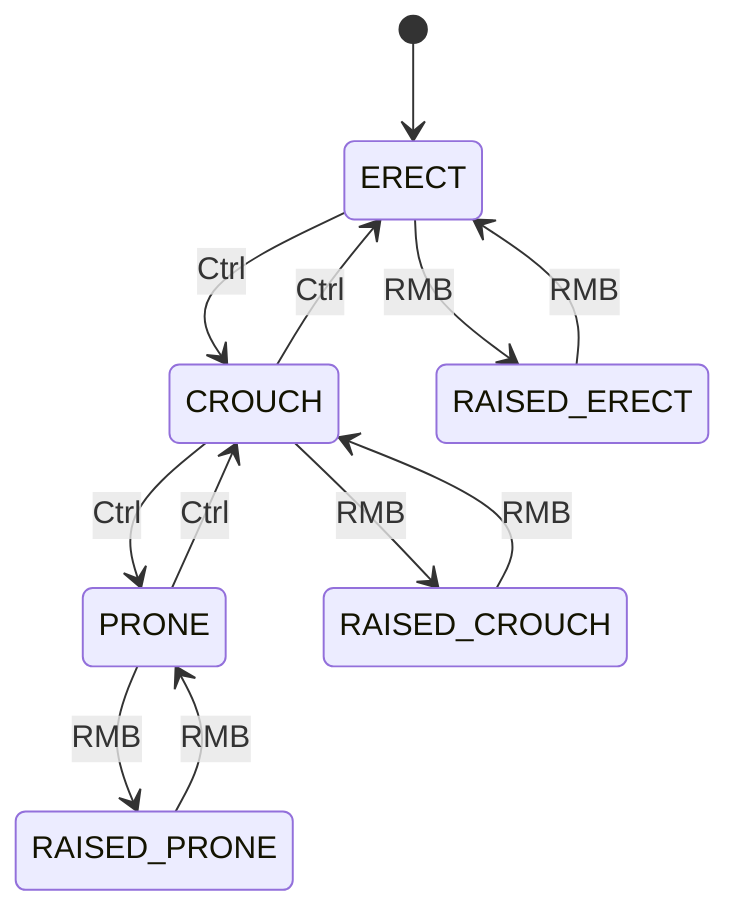

# Capítulo 6.18: Sistema de Animação

[Início](../README.md) | [<< Anterior: Sistema de Construção](17-construction-system.md) | **Sistema de Animação** | [Próximo: Consultas de Terreno e Mundo >>](19-terrain-queries.md)

---

## Introdução

DayZ utiliza um sistema de animação baseado em máquina de estados integrado ao motor Enfusion. As animações do jogador são controladas por uma hierarquia de classes `HumanCommand` -- movimento, ações, escalada, natação, veículos, queda, morte e inconsciência, cada um com seu próprio comando dedicado. Animações de objetos (portas, tampas, construções implantáveis) são controladas por `AnimationSources` no `model.cfg` e gerenciadas via script com `SetAnimationPhase()`.

Este capítulo cobre a API completa de animação: a máquina de estados de movimento do jogador, o sistema de comandos humanos, o pipeline de gestos/emotes, fontes de animação de objetos, callbacks de ação com eventos de animação, e as constantes-chave de `DayZPlayerConstants` com as quais modders interagem diariamente. Todas as assinaturas de métodos e constantes foram extraídas diretamente do código-fonte vanilla.

---

## Máquina de Estados de Movimento do Jogador

### Transições de Postura



### HumanMovementState

O motor expõe o estado atual de animação do jogador através de `HumanMovementState`. Recupere-o chamando `GetMovementState()` em qualquer `Human` (ou subclasse):

```csharp
// Fonte: scripts/3_game/human.c
class HumanMovementState
{
    int     m_CommandTypeId;   // ID do comando atual (COMMANDID_MOVE, COMMANDID_ACTION, etc.)
    int     m_iStanceIdx;      // postura atual (STANCEIDX_ERECT, STANCEIDX_CROUCH, etc.)
    int     m_iMovement;       // 0=parado, 1=andando, 2=correndo, 3=sprint
    float   m_fLeaning;        // deslocamento de inclinação, 0 quando não inclinado

    bool IsRaised();           // true quando postura >= STANCEIDX_RAISEDERECT
    bool IsRaisedInProne();    // true quando STANCEIDX_RAISEDPRONE
    bool IsInProne();          // true quando STANCEIDX_PRONE
    bool IsInRaisedProne();    // true quando STANCEIDX_RAISEDPRONE
    bool IsLeaning();          // true quando m_fLeaning != 0
}
```

Padrão de uso:

```csharp
HumanMovementState state = new HumanMovementState();
player.GetMovementState(state);

if (state.m_iStanceIdx == DayZPlayerConstants.STANCEIDX_PRONE)
{
    // jogador está deitado
}

if (state.m_iMovement >= 2)
{
    // jogador está correndo ou em sprint
}
```

### Índices de Postura

Essas constantes identificam a postura corporal atual do jogador. Definidas em `DayZPlayerConstants` (scripts/3_game/dayzplayer.c):

| Constante | Valor | Descrição |
|----------|-------|-------------|
| `STANCEIDX_ERECT` | 0 | Em pé |
| `STANCEIDX_CROUCH` | 1 | Agachado |
| `STANCEIDX_PRONE` | 2 | Deitado |
| `STANCEIDX_RAISEDERECT` | 3 | Em pé com arma levantada |
| `STANCEIDX_RAISEDCROUCH` | 4 | Agachado com arma levantada |
| `STANCEIDX_RAISEDPRONE` | 5 | Deitado com arma levantada |
| `STANCEIDX_RAISED` | 3 | Offset -- adicione à postura base para obter a variante levantada |

A relação: `STANCEIDX_ERECT + STANCEIDX_RAISED = STANCEIDX_RAISEDERECT`.

### Máscaras de Postura

Flags de bitmask usadas por `IsPlayerInStance()` e `StartCommand_Action()` para especificar quais posturas uma animação suporta:

| Constante | Descrição |
|----------|-------------|
| `STANCEMASK_ERECT` | Em pé |
| `STANCEMASK_CROUCH` | Agachado |
| `STANCEMASK_PRONE` | Deitado |
| `STANCEMASK_RAISEDERECT` | Em pé levantado |
| `STANCEMASK_RAISEDCROUCH` | Agachado levantado |
| `STANCEMASK_RAISEDPRONE` | Deitado levantado |
| `STANCEMASK_ALL` | Todas as posturas combinadas |
| `STANCEMASK_NOTRAISED` | `ERECT \| CROUCH \| PRONE` |
| `STANCEMASK_RAISED` | `RAISEDERECT \| RAISEDCROUCH \| RAISEDPRONE` |

```csharp
// Método de DayZPlayer:
proto native bool IsPlayerInStance(int pStanceMask);

// Exemplo: verificar se está em pé ou agachado (sem arma levantada)
if (player.IsPlayerInStance(DayZPlayerConstants.STANCEMASK_ERECT | DayZPlayerConstants.STANCEMASK_CROUCH))
{
    // jogador está em pé ou agachado, arma abaixada
}
```

### Índices de Movimento

| Constante | Valor | Descrição |
|----------|-------|-------------|
| `MOVEMENTIDX_SLIDE` | -2 | Deslizando |
| `MOVEMENTIDX_IDLE` | 0 | Parado |
| `MOVEMENTIDX_WALK` | 1 | Andando |
| `MOVEMENTIDX_RUN` | 2 | Correndo |
| `MOVEMENTIDX_SPRINT` | 3 | Em sprint |
| `MOVEMENTIDX_CROUCH_RUN` | 4 | Correndo agachado |

O campo `m_iMovement` em `HumanMovementState` usa esses valores.

---

## Sistema de Comandos Humanos

A qualquer momento, exatamente um **comando principal** controla o estado de animação do jogador. O motor fornece métodos getter que retornam `null` quando aquele comando não é o ativo. Apenas o comando atualmente ativo retorna um objeto válido.

### Hierarquia de Comandos

| Getter | Classe | Descrição |
|--------|-------|-------------|
| `GetCommand_Move()` | `HumanCommandMove` | Locomoção normal (parado, andando, correndo, sprint) |
| `GetCommand_Action()` | `HumanCommandActionCallback` | Animações de ação de corpo inteiro |
| `GetCommand_Melee()` | `HumanCommandMelee` | Corpo-a-corpo legado |
| `GetCommand_Melee2()` | `HumanCommandMelee2` | Sistema de corpo-a-corpo leve/pesado |
| `GetCommand_Fall()` | `HumanCommandFall` | Queda/salto |
| `GetCommand_Ladder()` | `HumanCommandLadder` | Subindo escadas |
| `GetCommand_Swim()` | `HumanCommandSwim` | Nadando |
| `GetCommand_Vehicle()` | `HumanCommandVehicle` | Sentado em veículo |
| `GetCommand_Climb()` | `HumanCommandClimb` | Escalando obstáculos |
| `GetCommand_Death()` | `HumanCommandDeathCallback` | Animação de morte |
| `GetCommand_Unconscious()` | `HumanCommandUnconscious` | Estado inconsciente |
| `GetCommand_Damage()` | `HumanCommandFullBodyDamage` | Reação de dano de corpo inteiro |
| `GetCommand_Script()` | `HumanCommandScript` | Comando customizado totalmente scriptável |

Cada comando também possui um método `StartCommand_*()` correspondente na classe `Human`.

### IDs de Comando

Cada tipo de comando possui um ID inteiro único armazenado em `HumanMovementState.m_CommandTypeId`. Também retornado por `GetCurrentCommandID()`:

| Constante | Descrição |
|----------|-------------|
| `COMMANDID_NONE` | Nenhum comando (inválido) |
| `COMMANDID_MOVE` | Movimento normal |
| `COMMANDID_ACTION` | Ação de corpo inteiro |
| `COMMANDID_MELEE` | Corpo-a-corpo (legado) |
| `COMMANDID_MELEE2` | Corpo-a-corpo leve/pesado |
| `COMMANDID_FALL` | Queda |
| `COMMANDID_DEATH` | Morto |
| `COMMANDID_DAMAGE` | Dano de corpo inteiro |
| `COMMANDID_LADDER` | Na escada |
| `COMMANDID_UNCONSCIOUS` | Inconsciente |
| `COMMANDID_SWIM` | Nadando |
| `COMMANDID_VEHICLE` | Em veículo |
| `COMMANDID_CLIMB` | Escalando |
| `COMMANDID_SCRIPT` | Comando scriptado |

IDs de comando modificador (aditivos, sempre ativos):

| Constante | Descrição |
|----------|-------------|
| `COMMANDID_MOD_LOOKAT` | Direção do olhar da cabeça (sempre ativo) |
| `COMMANDID_MOD_WEAPONS` | Manuseio de arma (sempre ativo) |
| `COMMANDID_MOD_ACTION` | Sobreposição de ação aditiva |
| `COMMANDID_MOD_DAMAGE` | Reação de dano aditiva |

### HumanCommandMove

O comando de locomoção padrão. Métodos disponíveis:

```csharp
class HumanCommandMove
{
    proto native float GetCurrentMovementAngle();    // -180..180 graus
    proto bool         GetCurrentInputAngle(out float pAngle);  // entrada bruta
    proto native float GetCurrentMovementSpeed();    // 0=parado, 1=andando, 2=correndo, 3=sprint
    proto native bool  IsChangingStance();
    proto native bool  IsOnBack();                   // deitado de costas
    proto native bool  IsInRoll();                   // rolando
    proto native bool  IsLeavingUncon();
    proto native void  ForceStance(int pStanceIdx);  // forçar postura, -1 para liberar
    proto native void  ForceStanceUp(int pStanceIdx); // forçar levantar
    proto native void  SetMeleeBlock(bool pBlock);
    proto native void  StartMeleeEvade();
}
```

### HumanCommandFall

```csharp
class HumanCommandFall
{
    static const int LANDTYPE_NONE   = 0;
    static const int LANDTYPE_LIGHT  = 1;
    static const int LANDTYPE_MEDIUM = 2;
    static const int LANDTYPE_HEAVY  = 3;

    proto native bool PhysicsLanded();   // true quando tocou fisicamente o chão
    proto native void Land(int pLandType);
    proto native bool IsLanding();       // true durante a animação de aterrissagem
}
```

### HumanCommandVehicle

```csharp
class HumanCommandVehicle
{
    proto native Transport GetTransport();
    proto native int       GetVehicleClass();  // VEHICLECLASS_CAR, HELI, BOAT
    proto native int       GetVehicleSeat();   // VEHICLESEAT_DRIVER, CODRIVER, etc.
    proto native void      GetOutVehicle();
    proto native void      JumpOutVehicle();
    proto native void      SwitchSeat(int pTransportPositionIndex, int pVehicleSeat);
    proto native bool      IsGettingIn();
    proto native bool      IsGettingOut();
    proto native bool      IsSwitchSeat();
}
```

### HumanCommandClimb

```csharp
class HumanCommandClimb
{
    proto native int    GetState();  // retorna valor do enum ClimbStates
    proto native vector GetGrabPointWS();
    proto native vector GetClimbOverStandPointWS();

    // Testes estáticos -- use antes de iniciar uma escalada
    proto native static bool DoClimbTest(Human pHuman, SHumanCommandClimbResult pResult, int pDebugDrawLevel);
    proto native static bool DoPerformClimbTest(Human pHuman, SHumanCommandClimbResult pResult, int pDebugDrawLevel);
}

enum ClimbStates
{
    STATE_MOVE,
    STATE_TAKEOFF,
    STATE_ONTOP,
    STATE_FALLING,
    STATE_FINISH
}
```

### HumanCommandUnconscious

```csharp
class HumanCommandUnconscious
{
    proto native void WakeUp(int targetStance = -1);
    proto native bool IsWakingUp();
    proto native bool IsOnLand();
    proto native bool IsInWater();
}
```

---

## Sistema de Gestos / Emotes

O sistema de gestos do DayZ permite que os jogadores realizem animações sociais (acenar, apontar, sentar, dançar, render-se, suicídio, etc.). Ele é construído em três camadas: `EmoteConstants` (IDs), `EmoteBase` (configuração por emote) e `EmoteManager` (orquestração de reprodução).

### EmoteConstants

Todos os IDs de emotes são definidos em `EmoteConstants` (scripts/3_game/constants.c):

| Constante | ID | Notas |
|----------|----|-------|
| `ID_EMOTE_GREETING` | 1 | Acenar/saudação |
| `ID_EMOTE_SOS` | 2 | Sinal de SOS de corpo inteiro |
| `ID_EMOTE_HEART` | 3 | Gesto de coração |
| `ID_EMOTE_TAUNT` | 4 | Provocação |
| `ID_EMOTE_LYINGDOWN` | 5 | Deitar-se |
| `ID_EMOTE_TAUNTKISS` | 6 | Provocação com beijo |
| `ID_EMOTE_FACEPALM` | 7 | Facepalm |
| `ID_EMOTE_TAUNTELBOW` | 8 | Provocação com cotovelo |
| `ID_EMOTE_THUMB` | 9 | Polegar para cima |
| `ID_EMOTE_THROAT` | 10 | Cortar a garganta |
| `ID_EMOTE_SUICIDE` | 11 | Suicídio (corpo inteiro) |
| `ID_EMOTE_DANCE` | 12 | Dançar |
| `ID_EMOTE_CAMPFIRE` | 13 | Sentar perto da fogueira |
| `ID_EMOTE_SITA` | 14 | Sentar variante A |
| `ID_EMOTE_SITB` | 15 | Sentar variante B |
| `ID_EMOTE_THUMBDOWN` | 16 | Polegar para baixo |
| `ID_EMOTE_DABBING` | 32 | Dab |
| `ID_EMOTE_TIMEOUT` | 35 | Sinal de tempo |
| `ID_EMOTE_CLAP` | 39 | Aplaudir |
| `ID_EMOTE_POINT` | 40 | Apontar para algo |
| `ID_EMOTE_SILENT` | 43 | Gesto de silêncio |
| `ID_EMOTE_SALUTE` | 44 | Saudação militar |
| `ID_EMOTE_RPS` | 45 | Pedra-Papel-Tesoura |
| `ID_EMOTE_WATCHING` | 46 | Gesto de observação |
| `ID_EMOTE_HOLD` | 47 | Manter posição |
| `ID_EMOTE_LISTENING` | 48 | Escutando |
| `ID_EMOTE_POINTSELF` | 49 | Apontar para si mesmo |
| `ID_EMOTE_LOOKATME` | 50 | Olhe para mim |
| `ID_EMOTE_TAUNTTHINK` | 51 | Provocação pensativa |
| `ID_EMOTE_MOVE` | 52 | Sinal de avançar |
| `ID_EMOTE_DOWN` | 53 | Sinal de abaixar |
| `ID_EMOTE_COME` | 54 | Venha aqui |
| `ID_EMOTE_NOD` | 58 | Acenar com a cabeça (sim) |
| `ID_EMOTE_SHAKE` | 59 | Balançar a cabeça (não) |
| `ID_EMOTE_SHRUG` | 60 | Dar de ombros |
| `ID_EMOTE_SURRENDER` | 61 | Render-se |
| `ID_EMOTE_VOMIT` | 62 | Vomitar |

### Classe EmoteBase

Cada emote é uma classe que estende `EmoteBase` (scripts/4_world/classes/emoteclasses/emotebase.c). Ela define requisitos de postura, IDs de callback de animação e condições opcionais:

```csharp
class EmoteBase
{
    protected int    m_ID;                    // ID de EmoteConstants
    protected string m_InputActionName;       // nome da ação de entrada (ex.: "EmoteGreeting")
    protected int    m_StanceMaskAdditive;    // posturas para reprodução aditiva (sobreposição)
    protected int    m_StanceMaskFullbody;    // posturas para reprodução de corpo inteiro
    protected int    m_AdditiveCallbackUID;   // constante CMD_GESTUREMOD_*
    protected int    m_FullbodyCallbackUID;   // constante CMD_GESTUREFB_*
    protected bool   m_HideItemInHands;       // esconder item nas mãos durante o emote

    bool EmoteCondition(int stancemask);      // sobrescreva para pré-condições customizadas
    bool CanBeCanceledNormally(notnull EmoteCB callback);
    bool EmoteFBStanceCheck(int stancemask);  // valida postura de corpo inteiro
    bool DetermineOverride(out int callback_ID, out int stancemask, out bool is_fullbody);
    void OnBeforeStandardCallbackCreated(int callback_ID, int stancemask, bool is_fullbody);
    void OnCallbackEnd();
    bool EmoteStartOverride(typename callbacktype, int id, int mask, bool fullbody);
}
```

Exemplo -- o emote de saudação suporta reprodução aditiva em pé/agachado e corpo inteiro deitado:

```csharp
class EmoteGreeting extends EmoteBase
{
    void EmoteGreeting()
    {
        m_ID = EmoteConstants.ID_EMOTE_GREETING;
        m_InputActionName = "EmoteGreeting";
        m_StanceMaskAdditive = DayZPlayerConstants.STANCEMASK_CROUCH | DayZPlayerConstants.STANCEMASK_ERECT;
        m_StanceMaskFullbody = DayZPlayerConstants.STANCEMASK_PRONE;
        m_AdditiveCallbackUID = DayZPlayerConstants.CMD_GESTUREMOD_GREETING;
        m_FullbodyCallbackUID = DayZPlayerConstants.CMD_GESTUREFB_GREETING;
        m_HideItemInHands = false;
    }
}
```

Alguns emotes requerem mãos vazias (dança, SOS, saudação, aplauso) via `EmoteCondition`:

```csharp
class EmoteDance extends EmoteBase
{
    void EmoteDance()
    {
        m_ID = EmoteConstants.ID_EMOTE_DANCE;
        m_InputActionName = "EmoteDance";
        m_StanceMaskAdditive = 0;                    // sem variante aditiva
        m_StanceMaskFullbody = DayZPlayerConstants.STANCEMASK_ERECT;
        m_FullbodyCallbackUID = DayZPlayerConstants.CMD_GESTUREFB_DANCE;
        m_HideItemInHands = true;
    }

    override bool EmoteCondition(int stancemask)
    {
        if (m_Player.GetBrokenLegs() == eBrokenLegs.BROKEN_LEGS)
            return false;
        return !m_Player.GetItemInHands();
    }
}
```

### Emotes Aditivos vs Corpo Inteiro

Emotes possuem dois modos de reprodução, selecionados automaticamente por `EmoteManager.DetermineEmoteData()`:

- **Aditivo (modificador):** Sobreposto à locomoção. O jogador ainda pode se mover. Usa `AddCommandModifier_Action()`. Ativado quando o jogador está em uma postura que corresponde a `m_StanceMaskAdditive`.
- **Corpo inteiro:** Assume todo o estado de animação. O jogador não pode se mover. Usa `StartCommand_Action()`. Ativado quando o jogador está em uma postura que corresponde a `m_StanceMaskFullbody`.

As constantes `CMD_GESTUREMOD_*` mapeiam para versões aditivas; constantes `CMD_GESTUREFB_*` mapeiam para versões de corpo inteiro.

### EmoteManager

`EmoteManager` (scripts/4_world/classes/emotemanager.c) orquestra a reprodução de emotes. É criado por jogador e atualizado a cada frame pelo `CommandHandler` do jogador:

Responsabilidades principais:
- Registra todos os emotes via `EmoteConstructor.ConstructEmotes()`
- Detecta entrada de emote via `DetermineGestureIndex()` (verifica keybinds)
- Seleciona aditivo vs corpo inteiro baseado na postura atual
- Cria o callback `EmoteCB` e gerencia seu ciclo de vida
- Lida com condições de interrupção (entrada de movimento, profundidade da água, levantar arma)
- Gerencia o estado de rendição e a lógica do emote de suicídio

### EmoteLauncher

`EmoteLauncher` é um objeto de requisição usado para enfileirar emotes via script (por exemplo, do menu de gestos ou forçado pelo servidor):

```csharp
class EmoteLauncher
{
    static const int FORCE_NONE      = 0;  // reprodução normal
    static const int FORCE_DIFFERENT = 1;  // forçar se diferente do atual
    static const int FORCE_ALL       = 2;  // forçar sempre

    void EmoteLauncher(int emoteID, bool interrupts_same);
    void SetForced(int mode);
    void SetStartGuaranteed(bool guaranteed);  // permanece na fila até ser reproduzido
}
```

### Reproduzindo Emotes via Script

Para reproduzir um emote programaticamente, use o `EmoteManager`:

```csharp
// Obter o gerenciador de emotes do jogador
EmoteManager emoteManager = player.GetEmoteManager();

// Criar um launcher para o emote de saudação
EmoteLauncher launcher = new EmoteLauncher(EmoteConstants.ID_EMOTE_GREETING, true);
launcher.SetForced(EmoteLauncher.FORCE_ALL);

// Enfileirar (o gerenciador processa no seu Update)
emoteManager.CreateEmoteCBFromMenu(EmoteConstants.ID_EMOTE_GREETING);
```

Alternativamente, para controle direto no nível de ação (usado em ferramentas de câmera e debug):

```csharp
// Gesto de corpo inteiro diretamente via StartCommand_Action
EmoteCB cb = EmoteCB.Cast(
    player.StartCommand_Action(
        DayZPlayerConstants.CMD_GESTUREFB_DANCE,
        EmoteCB,
        DayZPlayerConstants.STANCEMASK_ALL
    )
);
```

### EmoteConstructor e Registro

`EmoteConstructor` (scripts/4_world/classes/emoteconstructor.c) registra todos os emotes vanilla. Modders podem sobrescrever `RegisterEmotes()` via `modded class` para adicionar entradas customizadas:

```csharp
modded class EmoteConstructor
{
    override void RegisterEmotes(TTypenameArray emotes)
    {
        super.RegisterEmotes(emotes);
        emotes.Insert(MyCustomEmote);
    }
}
```

---

## Animações de Objetos (model.cfg)

Objetos como portas, barris, tendas e construções implantáveis usam um sistema de animação separado definido no `model.cfg`. O script controla essas animações através de `SetAnimationPhase()`.

### API de Animação em Entity

Esses métodos são definidos em `Entity` (scripts/3_game/entities/entity.c) e estão disponíveis em toda entidade do jogo:

```csharp
class Entity extends ObjectTyped
{
    // Obter fase atual (0.0 a 1.0) de uma fonte de animação nomeada
    proto native float GetAnimationPhase(string animation);

    // Definir a fase alvo -- o motor interpola até ela
    proto native void  SetAnimationPhase(string animation, float phase);

    // Definir fase imediatamente, sem interpolação
    void SetAnimationPhaseNow(string animation, float phase);

    // Resetar estado interno de animação
    proto native void  ResetAnimationPhase(string animation, float phase);

    // Enumerar fontes de animação definidas pelo usuário
    proto int    GetNumUserAnimationSourceNames();
    proto string GetUserAnimationSourceName(int index);
}
```

### AnimationSources no model.cfg

No `model.cfg`, cada modelo animado declara `AnimationSources` (os controladores) e `Animations` (o que eles movem). O campo `source` em uma entrada de animação a vincula a uma `AnimationSource` nomeada.

```cpp
// Exemplo de model.cfg para um barril com tampa
class CfgModels
{
    class MyBarrel
    {
        class AnimationSources
        {
            class Lid
            {
                source = "user";     // controlado por script
                animPeriod = 0.5;    // segundos para transição 0->1
                initPhase = 0;       // fase inicial
            };
        };

        class Animations
        {
            class Lid_rot
            {
                type = "rotation";
                source = "Lid";           // vincula à AnimationSource acima
                selection = "lid";        // seleção nomeada no modelo
                axis = "lid_axis";        // eixo do ponto de memória
                minValue = 0;
                maxValue = 1;
                angle0 = 0;              // radianos na fase 0
                angle1 = 1.5708;         // radianos na fase 1 (90 graus)
            };
        };
    };
};
```

### Tipos de Fonte

| Tipo de Fonte | Descrição |
|-------------|-------------|
| `user` | Controlado inteiramente por script via `SetAnimationPhase()` |
| `hit` | Controlado pelo sistema de dano (animações de destruição) |
| `door` | Controlado pelo sistema de abertura de portas |
| `reload` | Ciclo de recarga de arma |

Para modding, `user` é o mais comum. Você o controla pelo Enforce Script.

### Tipos de Animação no model.cfg

| Tipo | Descrição |
|------|-------------|
| `rotation` | Rotaciona uma seleção ao redor de um eixo |
| `rotationX/Y/Z` | Rotaciona ao redor de um eixo mundial específico |
| `translation` | Translada uma seleção ao longo de um eixo |
| `translationX/Y/Z` | Translada ao longo de um eixo mundial específico |
| `hide` | Esconde/mostra uma seleção (baseado em limiar) |

### Exemplo de Animação de Objeto Controlada por Script

Tampa de barril vanilla (scripts/4_world/entities/itembase/barrel_colorbase.c):

```csharp
// Abrir o barril -- seleção Lid rotaciona, Lid2 esconde
SetAnimationPhase("Lid", 1);    // rotaciona a tampa para aberta
SetAnimationPhase("Lid2", 0);   // mostra a geometria do estado aberto

// Fechar o barril
SetAnimationPhase("Lid", 0);    // rotaciona a tampa para fechada
SetAnimationPhase("Lid2", 1);   // esconde a geometria do estado aberto
```

Partes de construção de base (scripts/4_world/entities/itembase/basebuildingbase.c):

```csharp
// Mostrar uma parte construída
SetAnimationPhase(ANIMATION_DEPLOYED, 0);   // fase 0 = visível

// Escondê-la
SetAnimationPhase(ANIMATION_DEPLOYED, 1);   // fase 1 = oculto
```

---

## Callbacks de Ação

### HumanCommandActionCallback

Todas as ações do jogador (comer, bandar, craftar, emotes) usam callbacks de animação. `HumanCommandActionCallback` (scripts/3_game/human.c) é a classe base:

```csharp
class HumanCommandActionCallback
{
    proto native Human GetHuman();
    proto native void  Cancel();
    proto native void  InternalCommand(int pInternalCommandId);  // CMD_ACTIONINT_*
    proto native void  SetAligning(vector pPositionWS, vector pDirectionWS);
    proto native void  ResetAligning();
    proto native void  EnableCancelCondition(bool pEnable);
    proto native bool  DefaultCancelCondition();
    proto native void  RegisterAnimationEvent(string pAnimationEventStr, int pId);
    proto native void  EnableStateChangeCallback();
    proto native int   GetState();  // retorna constante STATE_*

    // Sobrescritas de callback
    void OnAnimationEvent(int pEventID);
    void OnFinish(bool pCanceled);
    void OnStateChange(int pOldState, int pCurrentState);

    // Identificação de tipo
    bool IsUserActionCallback();
    bool IsGestureCallback();
    bool IsSymptomCallback();
}
```

### Estados de Ação

Ações passam por estados definidos acessíveis via `GetState()`:

| Constante | Valor | Descrição |
|----------|-------|-------------|
| `STATE_NONE` | 0 | Não executando |
| `STATE_LOOP_IN` | 1 | Entrando no loop |
| `STATE_LOOP_LOOP` | 2 | No loop principal |
| `STATE_LOOP_END` | 3 | Saindo do loop (fim primário) |
| `STATE_LOOP_END2` | 4 | Saindo do loop (fim secundário) |
| `STATE_LOOP_LOOP2` | 5 | Loop secundário |
| `STATE_LOOP_ACTION` | 6 | Ação dentro do loop |
| `STATE_NORMAL` | 7 | Ação única (sem loop) |

### Comandos Internos de Ação

Use `InternalCommand()` para controlar o fluxo da ação:

| Constante | Valor | Descrição |
|----------|-------|-------------|
| `CMD_ACTIONINT_INTERRUPT` | -2 | Cancelamento forçado, sem animação de saída |
| `CMD_ACTIONINT_FINISH` | -1 | Finalização secundária (ex.: ficou sem água) |
| `CMD_ACTIONINT_END` | 0 | Fim normal (todas as ações suportam) |
| `CMD_ACTIONINT_ACTION` | 1 | Disparar ação secundária (ex.: alternância de polegar para cima/baixo) |
| `CMD_ACTIONINT_ACTIONLOOP` | 2 | Loop de ação secundária |

### Registrando Eventos de Animação

Eventos de animação são gatilhos nomeados embutidos em arquivos de animação. Registre-os para receber callbacks:

```csharp
class EmoteCB extends HumanCommandActionCallback
{
    override void OnAnimationEvent(int pEventID)
    {
        switch (pEventID)
        {
            case EmoteConstants.EMOTE_SUICIDE_DEATH:
                if (g_Game.IsServer())
                    m_Manager.KillPlayer();
                break;

            case EmoteConstants.EMOTE_SUICIDE_BLEED:
                if (g_Game.IsServer())
                    m_Manager.CreateBleedingEffect(m_callbackID);
                break;

            case EmoteConstants.EMOTE_SUICIDE_SIMULATION_END:
                m_player.DeathDropHandEntity();
                m_player.StartDeath();
                break;
        }
    }
}
```

Constantes de eventos de animação customizados para emotes:

| Constante | Valor | Descrição |
|----------|-------|-------------|
| `EMOTE_SUICIDE_DEATH` | 1 | Jogador morre (lado servidor) |
| `EMOTE_SUICIDE_BLEED` | 2 | Efeito de sangramento começa |
| `EMOTE_SUICIDE_SIMULATION_END` | 3 | Simulação termina, física assume |
| `UA_ANIM_EVENT` | 11 | Evento genérico de animação de ação do usuário |

### Iniciando Ações com Animações

Ações de corpo inteiro usam `StartCommand_Action()`, ações aditivas usam `AddCommandModifier_Action()`:

```csharp
// Ação de corpo inteiro (assume toda a animação do personagem)
HumanCommandActionCallback callback = player.StartCommand_Action(
    DayZPlayerConstants.CMD_ACTIONFB_BANDAGE,   // ID da animação
    ActionBandageCB,                             // typename do callback
    DayZPlayerConstants.STANCEMASK_CROUCH        // posturas válidas
);

// Ação aditiva (sobreposta à locomoção)
HumanCommandActionCallback callback = player.AddCommandModifier_Action(
    DayZPlayerConstants.CMD_ACTIONMOD_DRINK,     // ID da animação
    ActionDrinkCB                                // typename do callback
);
```

---

## HumanCommandScript -- Animações Totalmente Customizadas

`HumanCommandScript` (scripts/3_game/human.c) fornece controle completo em nível de script sobre a animação do personagem. É a abordagem mais poderosa, mas também a mais complexa:

```csharp
class HumanCommandScript
{
    // Ciclo de vida
    void OnActivate();
    void OnDeactivate();
    proto native void SetFlagFinished(bool pFinished);

    // Controle de direção
    proto native void SetHeading(float yawAngle, float filterDt, float maxYawSpeed);

    // Sobrescritas para relatório de estado
    int GetCurrentStance();    // padrão: STANCEIDX_ERECT
    int GetCurrentMovement();  // padrão: MOVEMENT_IDLE

    // Fases de atualização de animação
    void PreAnimUpdate(float pDt);        // defina variáveis de animação aqui
    void PrePhysUpdate(float pDt);        // após animação, antes da física
    bool PostPhysUpdate(float pDt);       // após física, retorne false para encerrar

    // Auxiliares de PreAnimUpdate
    proto native void PreAnim_CallCommand(int pCommand, int pParamInt, float pParamFloat);
    proto native void PreAnim_SetFloat(int pVar, float pFlt);
    proto native void PreAnim_SetInt(int pVar, int pInt);
    proto native void PreAnim_SetBool(int pVar, bool pBool);

    // Auxiliares de PrePhysUpdate
    proto native bool PrePhys_IsEvent(int pEvent);
    proto native bool PrePhys_IsTag(int pTag);
    proto native bool PrePhys_GetTranslation(out vector pOutTransl);
    proto native bool PrePhys_GetRotation(out float pOutRot[4]);
    proto native void PrePhys_SetTranslation(vector pInTransl);
    proto native void PrePhys_SetRotation(float pInRot[4]);

    // Auxiliares de PostPhysUpdate
    proto native void PostPhys_GetPosition(out vector pOutTransl);
    proto native void PostPhys_GetRotation(out float pOutRot[4]);
    proto native void PostPhys_SetPosition(vector pInTransl);
    proto native void PostPhys_SetRotation(float pInRot[4]);
    proto native void PostPhys_LockRotation();
}
```

Iniciar um comando scriptado:

```csharp
// A partir do typename (o motor cria a instância)
HumanCommandScript cmd = player.StartCommand_ScriptInst(MyCustomCommand);

// A partir de uma instância (você a cria)
MyCustomCommand cmd = new MyCustomCommand(player);
player.StartCommand_Script(cmd);
```

### HumanAnimInterface

Para interagir com variáveis do grafo de animação a partir de `HumanCommandScript`, use `HumanAnimInterface`:

```csharp
class HumanAnimInterface
{
    proto native TAnimGraphCommand  BindCommand(string pCommandName);
    proto native TAnimGraphVariable BindVariableFloat(string pVariable);
    proto native TAnimGraphVariable BindVariableInt(string pVariable);
    proto native TAnimGraphVariable BindVariableBool(string pVariable);
    proto native TAnimGraphTag      BindTag(string pTagName);
    proto native TAnimGraphEvent    BindEvent(string pEventName);
}
```

Acesso via `player.GetAnimInterface()`.

---

## Modificador de Comando: Aditivos

`HumanCommandAdditives` fornece sobreposições de animação ambiente que executam continuamente junto com o comando principal:

```csharp
class HumanCommandAdditives
{
    proto native void SetInjured(float pValue, bool pInterpolate);    // 0..1
    proto native void SetExhaustion(float pValue, bool pInterpolate); // 0..1
    proto native void SetTalking(bool pValue);
    proto native void StartModifier(int pType);
    proto native void CancelModifier();
    proto native bool IsModifierActive();
}
```

Acesso via `player.GetCommandModifier_Additives()`. Estes estão sempre ativos e se misturam por cima de qualquer comando em execução.

---

## Referência Rápida de DayZPlayerConstants

### IDs de Animação de Ação Comuns

**Aditivos (CMD_ACTIONMOD_*)** -- reproduzidos em pé/agachado:

| Constante | ID | Descrição |
|----------|----|-------------|
| `CMD_ACTIONMOD_DRINK` | 0 | Beber |
| `CMD_ACTIONMOD_EAT` | 1 | Comer |
| `CMD_ACTIONMOD_CRAFTING` | 22 | Craftar |
| `CMD_ACTIONMOD_PICKUP_HANDS` | 500 | Pegar com as mãos |
| `CMD_ACTIONMOD_ITEM_ON` | 509 | Ligar item |
| `CMD_ACTIONMOD_ITEM_OFF` | 510 | Desligar item |
| `CMD_ACTIONMOD_STARTENGINE` | 300 | Ligar motor do veículo |
| `CMD_ACTIONMOD_SHIFTGEAR` | 405 | Trocar marcha do veículo |

**Corpo inteiro (CMD_ACTIONFB_*)** -- reproduzidos deitado ou em posturas especiais:

| Constante | ID | Descrição |
|----------|----|-------------|
| `CMD_ACTIONFB_DRINK` | 0 | Beber (deitado) |
| `CMD_ACTIONFB_BANDAGE` | 58 | Bandar |
| `CMD_ACTIONFB_CRAFTING` | 59 | Craftar (agachado) |
| `CMD_ACTIONFB_DIG` | 88 | Cavar |
| `CMD_ACTIONFB_ANIMALSKINNING` | 66 | Esfolar animal |
| `CMD_ACTIONFB_STARTFIRE` | 65 | Acender fogueira |
| `CMD_ACTIONFB_PICKUP_HEAVY` | 519 | Pegar item pesado |

### IDs de Comando de Gesto

**Gestos aditivos (CMD_GESTUREMOD_*)** -- usados em pé/agachado:

| Constante | ID |
|----------|----|
| `CMD_GESTUREMOD_GREETING` | 1000 |
| `CMD_GESTUREMOD_POINT` | 1001 |
| `CMD_GESTUREMOD_THUMB` | 1002 |
| `CMD_GESTUREMOD_SILENCE` | 1004 |
| `CMD_GESTUREMOD_TAUNT` | 1005 |
| `CMD_GESTUREMOD_HEART` | 1007 |
| `CMD_GESTUREMOD_CLAP` | 1101 |
| `CMD_GESTUREMOD_SURRENDER` | 1112 |

**Gestos de corpo inteiro (CMD_GESTUREFB_*)** -- usados deitado ou em posturas exclusivas:

| Constante | ID | Postura |
|----------|----|--------|
| `CMD_GESTUREFB_SOS` | 1053 | em pé |
| `CMD_GESTUREFB_SALUTE` | 1050 | em pé |
| `CMD_GESTUREFB_CAMPFIRE` | 1051 | agachado |
| `CMD_GESTUREFB_SITA` | 1054 | agachado |
| `CMD_GESTUREFB_SITB` | 1055 | agachado |
| `CMD_GESTUREFB_LYINGDOWN` | 1052 | agachado |
| `CMD_GESTUREFB_DANCE` | 1109 | em pé |
| `CMD_GESTUREFB_SURRENDERIN` | 1113 | agachado/deitado |

---

## Exemplos Práticos

### Verificando Postura do Jogador

```csharp
// Método 1: Via estado de movimento
HumanMovementState hms = new HumanMovementState();
player.GetMovementState(hms);

if (hms.m_iStanceIdx == DayZPlayerConstants.STANCEIDX_CROUCH)
    Print("Jogador está agachado");

if (hms.IsRaised())
    Print("Arma está levantada");

// Método 2: Via máscara de postura (preferido para verificações multi-postura)
if (player.IsPlayerInStance(DayZPlayerConstants.STANCEMASK_PRONE | DayZPlayerConstants.STANCEMASK_RAISEDPRONE))
    Print("Jogador está em alguma postura deitada");

// Método 3: Verificar comando atual
int cmdID = player.GetCurrentCommandID();
if (cmdID == DayZPlayerConstants.COMMANDID_SWIM)
    Print("Jogador está nadando");
```

### Forçando Mudança de Postura

```csharp
HumanCommandMove cmdMove = player.GetCommand_Move();
if (cmdMove)
{
    // Forçar jogador a ficar em pé
    cmdMove.ForceStance(DayZPlayerConstants.STANCEIDX_ERECT);

    // Liberar a força (deixar jogador controlar a postura novamente)
    // cmdMove.ForceStance(-1);
}
```

### Animando um Objeto Customizado (Porta / Alavanca)

```csharp
// Na sua classe de item customizado
class MyLever extends ItemBase
{
    protected bool m_IsActivated;

    void ToggleLever()
    {
        m_IsActivated = !m_IsActivated;

        if (m_IsActivated)
        {
            // Animar alavanca para posição "ligado" (fase 1)
            SetAnimationPhase("lever_source", 1);
        }
        else
        {
            // Animar alavanca para posição "desligado" (fase 0)
            SetAnimationPhase("lever_source", 0);
        }
    }

    float GetLeverState()
    {
        return GetAnimationPhase("lever_source");
    }
}
```

O `model.cfg` correspondente definiria:

```cpp
class AnimationSources
{
    class lever_source
    {
        source = "user";
        animPeriod = 0.3;
        initPhase = 0;
    };
};

class Animations
{
    class lever_rotate
    {
        type = "rotation";
        source = "lever_source";
        selection = "lever";
        axis = "lever_axis";
        minValue = 0;
        maxValue = 1;
        angle0 = 0;
        angle1 = -1.5708;   // -90 graus em radianos
    };
};
```

### Detectando Comando de Animação Ativo

```csharp
// Verificar o que o jogador está fazendo atualmente
if (player.GetCommand_Vehicle())
{
    HumanCommandVehicle vehCmd = player.GetCommand_Vehicle();
    Print("No assento do veículo: " + vehCmd.GetVehicleSeat());
}
else if (player.GetCommand_Swim())
{
    Print("Jogador está nadando");
}
else if (player.GetCommand_Fall())
{
    HumanCommandFall fallCmd = player.GetCommand_Fall();
    if (fallCmd.PhysicsLanded())
        Print("Acabou de aterrissar");
}
else if (player.GetCommand_Action())
{
    HumanCommandActionCallback actionCB = player.GetCommand_Action();
    Print("Estado da ação: " + actionCB.GetStateString());
}
```

---

## Boas Práticas

1. **Sempre verifique null nos getters de comando.** `GetCommand_Move()` retorna `null` quando o jogador não está no comando de movimento. Cada getter de comando pode retornar null.

2. **Use máscaras de postura, não índices de postura, para verificações multi-postura.** `IsPlayerInStance()` com flags de bitmask é mais limpo do que comparar `m_iStanceIdx` contra múltiplos valores.

3. **Prefira `SetAnimationPhase()` ao invés de `SetAnimationPhaseNow()`.** A versão interpolada fica mais suave. Use `SetAnimationPhaseNow()` apenas quando precisar de mudanças de estado instantâneas (carregando da persistência, inicialização).

4. **Mantenha os valores de fase de animação entre 0.0 e 1.0.** O motor interpola entre `minValue` e `maxValue` definidos no `model.cfg`. A fase é sempre normalizada.

5. **Não chame `StartCommand_*()` de código arbitrário.** Comandos devem ser iniciados a partir do `CommandHandler` ou em resposta a condições validadas. Iniciar comandos em momentos errados pode causar corrupção do estado de animação.

6. **Para emotes, use o EmoteManager.** `StartCommand_Action()` direto com IDs de gesto funciona em ferramentas de debug, mas ignora a sincronização, interrupção e lógica de gerenciamento de estado que o `EmoteManager` fornece.

---

## Observado em Mods Reais

- **Mod Expansion** usa `HumanCommandScript` para animações customizadas de entrada/saída de veículos e sincronização de posição de membros de grupo.
- **COT (Community Online Tools)** usa `StartCommand_Action()` diretamente em suas ferramentas de câmera/cinemáticas para forçar animações de gestos em jogadores para capturas de tela.
- **Mods de construção de base** (BuilderItems, BuildAnywhere) fazem uso intenso de `SetAnimationPhase()` para mostrar/ocultar estágios de construção em estruturas customizadas.
- **Barril vanilla** alterna `SetAnimationPhase("Lid", 0/1)` para abrir/fechar, demonstrando o padrão standard para objetos de estado binário.

---

## Teoria vs Prática

**Teoria:** `HumanCommandScript` permite criar comandos de animação totalmente customizados com controle completo de física.
**Prática:** A maioria dos modders nunca precisa dele. O sistema de ações (`StartCommand_Action` / `AddCommandModifier_Action`) com IDs de animação pré-existentes cobre 95% dos casos de uso. `HumanCommandScript` é reservado para casos extremos como tipos de veículos customizados ou modos de movimento inteiramente novos.

**Teoria:** Você pode registrar eventos de animação customizados e recebê-los em callbacks.
**Prática:** Eventos de animação customizados requerem arquivos de animação customizados (`.rtm` / mudanças no grafo de animação), que precisam do Workbench e da cadeia de ferramentas de animação do DayZ. A maioria dos modders reutiliza IDs de animação existentes e conta com callbacks de mudança de estado (`OnStateChange`, `OnFinish`) ao invés de eventos customizados.

**Teoria:** Qualquer emote pode ser reproduzido em qualquer postura.
**Prática:** O sistema de máscara de postura é estrito. Se sua classe de emote declara `m_StanceMaskFullbody = STANCEMASK_ERECT` mas o jogador está agachado, o emote não será reproduzido. O método `DetermineEmoteData()` verifica aditivo primeiro, depois corpo inteiro, e falha silenciosamente se nenhum corresponder.

---

## Erros Comuns

1. **Verificar o comando errado.** Chamar `GetCommand_Move()` enquanto o jogador está em um veículo retorna `null`. Sempre verifique `GetCurrentCommandID()` primeiro ou faça verificação de null no resultado.

2. **Esquecer que comandos de ação substituem o movimento.** `StartCommand_Action()` é de corpo inteiro -- o jogador para de se mover. Se você quer uma animação de sobreposição, use `AddCommandModifier_Action()` em vez disso.

3. **Usar `SetAnimationPhase()` com nomes de fonte errados.** A string deve corresponder exatamente ao nome da classe `AnimationSources` no `model.cfg`. Não há erro se o nome estiver errado -- nada acontece.

4. **Confundir índice de postura e máscara de postura.** `ForceStance()` recebe um valor `STANCEIDX_*` (inteiro 0-5). `StartCommand_Action()` e `IsPlayerInStance()` recebem valores `STANCEMASK_*` (flags de bitmask). Passar um onde o outro é esperado produz comportamento errado silencioso.

5. **Não verificar `EmoteCondition()`.** Tentar reproduzir um emote que requer mãos vazias enquanto segura um item vai falhar. O sistema de emotes verifica condições antes da reprodução, mas não registra um aviso.

6. **Chamar `StartCommand_*()` na máquina errada.** A maioria dos comandos só deve ser iniciada na máquina que possui o jogador (servidor para IA, cliente para jogador controlado). Iniciar comandos no lado errado causa dessincronização.

---

## Compatibilidade e Impacto

- O sistema de comandos de animação é de **nível de motor** e permaneceu estável entre as versões do DayZ. `HumanCommandMove`, `HumanCommandActionCallback` e `DayZPlayerConstants` não mudaram sua API em anos.
- `EmoteManager` e `EmoteBase` são **modificáveis via `modded class`**. Você pode adicionar novos emotes estendendo `EmoteBase` e modificando `EmoteConstructor`.
- Animações de objetos via `SetAnimationPhase()` são o **padrão** usado por todos os itens vanilla e pela maioria dos mods. A API é estável e bem testada.
- `HumanCommandScript` é uma **API para usuários avançados**. Funciona, mas é pouco documentada pela Bohemia. O melhor recurso de aprendizado é ler implementações vanilla em `dayzplayerimplement.c`.
- Adicionar novos IDs de animação (valores CMD_ACTIONFB/MOD) requer entradas correspondentes no grafo de animação do jogo, o que só é possível com acesso ao Workbench e ferramentas de edição de modelos p3d.

---

**Arquivos fonte referenciados neste capítulo:**

| Arquivo | Conteúdo |
|------|---------|
| `scripts/3_game/human.c` | HumanInputController, HumanCommandActionCallback, HumanCommandMove, HumanCommandFall, HumanCommandClimb, HumanCommandSwim, HumanCommandVehicle, HumanCommandScript, HumanMovementState, HumanAnimInterface, classe Human |
| `scripts/3_game/dayzplayer.c` | DayZPlayerConstants (posturas, comandos, IDs de ação/gesto) |
| `scripts/3_game/constants.c` | EmoteConstants (IDs de emote, IDs de evento de suicídio) |
| `scripts/3_game/entities/entity.c` | SetAnimationPhase, GetAnimationPhase |
| `scripts/4_world/classes/emotemanager.c` | EmoteCB, EmoteLauncher, EmoteManager |
| `scripts/4_world/classes/emoteclasses/emotebase.c` | Classe EmoteBase |
| `scripts/4_world/classes/emoteclasses/emoteclasses.c` | Todas as subclasses vanilla de EmoteBase |
| `scripts/4_world/classes/emoteconstructor.c` | EmoteConstructor (registro de emotes) |
