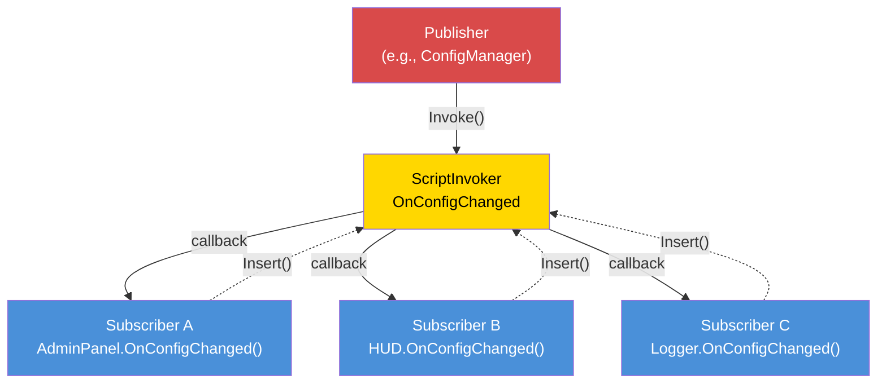

# Chapter 7.6: Event-Driven Architecture

[Home](../README.md) | [<< Previous: Permission Systems](05-permissions.md) | **Event-Driven Architecture** | [Next: Performance Optimization >>](07-performance.md)

---

## Introdução

Arquitetura orientada a eventos desacopla o produtor de um evento de seus consumidores. Quando um jogador conecta, o handler de conexão não precisa saber sobre o killfeed, o painel admin, o sistema de missões ou o módulo de logging --- ele dispara um evento "player connected", e cada sistema interessado se inscreve independentemente. Esta é a fundação do design extensível de mods: novas features se inscrevem em eventos existentes sem modificar o código que os dispara.

DayZ fornece `ScriptInvoker` como sua primitiva de evento integrada. Por cima dele, mods profissionais constroem event buses com tópicos nomeados, handlers tipados e gerenciamento de ciclo de vida. Este capítulo cobre os três padrões principais e a disciplina crítica de prevenção de vazamento de memória.

---

## Padrão ScriptInvoker

`ScriptInvoker` é a primitiva pub/sub integrada da engine. Ela mantém uma lista de callbacks de função e invoca todos quando um evento dispara.

### Criando um Evento

```c
class WeatherManager
{
    // O evento. Qualquer um pode se inscrever para ser notificado quando o clima muda.
    ref ScriptInvoker OnWeatherChanged = new ScriptInvoker();

    protected string m_CurrentWeather;

    void SetWeather(string newWeather)
    {
        m_CurrentWeather = newWeather;

        // Disparar o evento — todos os inscritos são notificados
        OnWeatherChanged.Invoke(newWeather);
    }
};
```

### Inscrevendo-se em um Evento

```c
class WeatherUI
{
    void Init(WeatherManager mgr)
    {
        // Inscrever: quando o clima mudar, chamar nosso handler
        mgr.OnWeatherChanged.Insert(OnWeatherChanged);
    }

    void OnWeatherChanged(string newWeather)
    {
        // Atualizar a UI
        m_WeatherLabel.SetText("Weather: " + newWeather);
    }

    void Cleanup(WeatherManager mgr)
    {
        // CRÍTICO: Desinscrever quando terminar
        mgr.OnWeatherChanged.Remove(OnWeatherChanged);
    }
};
```

### API do ScriptInvoker

| Método | Descrição |
|--------|-------------|
| `Insert(func)` | Adicionar um callback à lista de inscritos |
| `Remove(func)` | Remover um callback específico |
| `Invoke(...)` | Chamar todos os callbacks inscritos com os argumentos dados |
| `Clear()` | Remover todos os inscritos |

---

## Padrão EventBus (Tópicos Roteados por String)

Um `ScriptInvoker` é um único canal de evento. Um EventBus é uma coleção de canais nomeados, fornecendo um hub central onde qualquer módulo pode publicar ou se inscrever em eventos por nome de tópico.

### EventBus do MyMod



MyMod implementa o EventBus como uma classe estática com campos `ScriptInvoker` nomeados para eventos bem conhecidos, mais um canal genérico `OnCustomEvent` para tópicos ad-hoc:

```c
class MyEventBus
{
    // Eventos de ciclo de vida bem conhecidos
    static ref ScriptInvoker OnPlayerConnected;      // void(PlayerIdentity)
    static ref ScriptInvoker OnPlayerDisconnected;    // void(PlayerIdentity)
    static ref ScriptInvoker OnPlayerReady;           // void(PlayerBase, PlayerIdentity)
    static ref ScriptInvoker OnConfigChanged;         // void(string modId, string field, string value)
    static ref ScriptInvoker OnAdminPanelToggled;     // void(bool opened)
    static ref ScriptInvoker OnMissionStarted;        // void(MyInstance)
    static ref ScriptInvoker OnMissionCompleted;      // void(MyInstance, int reason)

    // Canal genérico de evento personalizado
    static ref ScriptInvoker OnCustomEvent;           // void(string eventName, Param params)

    static void Init() { ... }   // Cria todos os invokers
    static void Cleanup() { ... } // Anula todos os invokers
};
```

### Inscrevendo-se no EventBus

```c
class MyMissionModule : MyServerModule
{
    override void OnInit()
    {
        super.OnInit();

        // Inscrever no ciclo de vida do jogador
        MyEventBus.OnPlayerConnected.Insert(OnPlayerJoined);
        MyEventBus.OnPlayerDisconnected.Insert(OnPlayerLeft);
    }

    override void OnMissionFinish()
    {
        // Sempre desinscrever no shutdown
        MyEventBus.OnPlayerConnected.Remove(OnPlayerJoined);
        MyEventBus.OnPlayerDisconnected.Remove(OnPlayerLeft);
    }

    void OnPlayerJoined(PlayerIdentity identity)
    {
        MyLog.Info("Missions", "Player joined: " + identity.GetName());
    }

    void OnPlayerLeft(PlayerIdentity identity)
    {
        MyLog.Info("Missions", "Player left: " + identity.GetName());
    }
};
```

---

## Quando Usar Eventos vs Chamadas Diretas

### Use Eventos Quando:

1. **Múltiplos consumidores independentes** precisam reagir à mesma ocorrência.
2. **O produtor não deve conhecer os consumidores.**
3. **O conjunto de consumidores muda em runtime.**
4. **Comunicação cross-mod.**

### Use Chamadas Diretas Quando:

1. **Há exatamente um consumidor** e é conhecido em tempo de compilação.
2. **Valores de retorno são necessários.** Eventos são fire-and-forget.
3. **A ordem importa.** Se passo B deve acontecer após passo A, chame A depois B explicitamente.
4. **Performance é crítica.** Eventos têm overhead.

---

## Prevenção de Vazamento de Memória

O aspecto mais perigoso da arquitetura orientada a eventos em Enforce Script é **vazamento de inscritos**. Se um objeto se inscreve em um evento e é destruído sem desinscrever, uma de duas coisas acontece:

1. **Se o objeto estende `Managed`:** A referência fraca no invoker é automaticamente anulada. O invoker chamará uma função null --- que não faz nada, mas desperdiça ciclos iterando entradas mortas.

2. **Se o objeto NÃO estende `Managed`:** O invoker mantém um ponteiro de função pendente. Quando o evento dispara, chama em memória liberada. **Crash.**

### A Regra de Ouro

**Todo `Insert()` deve ter um `Remove()` correspondente.** Sem exceções.

### Padrão: Inscrever em OnInit, Desinscrever em OnMissionFinish

```c
class MyModule : MyServerModule
{
    override void OnInit()
    {
        super.OnInit();
        MyEventBus.OnPlayerConnected.Insert(HandlePlayerConnect);
    }

    override void OnMissionFinish()
    {
        MyEventBus.OnPlayerConnected.Remove(HandlePlayerConnect);
    }

    void HandlePlayerConnect(PlayerIdentity identity) { ... }
};
```

### Anti-Padrão: Funções Anônimas

```c
// RUIM: Você não pode Remove uma função anônima
MyEventBus.OnPlayerConnected.Insert(function(PlayerIdentity id) {
    Print("Connected: " + id.GetName());
});
// Como você Remove isso? Você não pode referenciá-la.
```

Sempre use métodos nomeados para poder desinscrever depois.

---

## Melhores Práticas

1. **Todo `Insert()` deve ter um `Remove()` correspondente.** Audite seu código: procure por toda chamada `Insert` e verifique que tem um `Remove` correspondente no caminho de limpeza.
2. **Verifique null no invoker antes de `Remove()` em destrutores.** Durante o shutdown, o EventBus pode já ter sido limpo.
3. **Documente assinaturas de eventos.** Acima de toda declaração de `ScriptInvoker`, escreva um comentário com a assinatura esperada do callback.
4. **Não dependa da ordem de execução dos inscritos.** Se a ordem importa, use chamadas diretas.
5. **Mantenha handlers de eventos rápidos.** Se um handler precisa fazer trabalho caro, agende-o para o próximo tick.
6. **Use eventos nomeados para APIs estáveis, eventos personalizados para experimentos.**
7. **Inicialize o EventBus cedo.** Eventos podem disparar antes de `OnMissionStart()`.
8. **Limpe o EventBus no mission finish.** Anule todos os invokers para prevenir referências obsoletas entre reinícios de missão.
9. **Nunca use funções anônimas como inscritos de eventos.** Você não pode desinscrevê-las.
10. **Prefira eventos a polling.** Ao invés de verificar "a config mudou?" todo frame, inscreva-se em `OnConfigChanged` e reaja apenas quando disparar.

---

## Compatibilidade & Impacto

- **Multi-Mod:** Múltiplos mods podem se inscrever nos mesmos tópicos do EventBus sem conflito. Cada inscrito é chamado independentemente. Porém, se um inscrito lança um erro irrecuperável (ex.: referência null), inscritos subsequentes naquele invoker podem não executar.
- **Ordem de Carregamento:** Ordem de inscrição é igual à ordem de chamada no `Invoke()`. Mods que carregam antes registram primeiro e recebem eventos primeiro. Não dependa desta ordem --- se a ordem de execução importa, use chamadas diretas ao invés.
- **Listen Server:** Em listen servers, eventos disparados do código server-side são visíveis para inscritos client-side se compartilham o mesmo `ScriptInvoker` estático. Use campos separados do EventBus para eventos server-only e client-only, ou proteja handlers com `GetGame().IsServer()` / `GetGame().IsClient()`.
- **Performance:** `ScriptInvoker.Invoke()` itera todos os inscritos linearmente. Com 5--15 inscritos por evento, isso é desprezível. Evite inscrever por entidade (100+ entidades cada uma se inscrevendo no mesmo evento) --- use um padrão de manager ao invés.
- **Migração:** `ScriptInvoker` é uma API vanilla estável improvável de mudar entre versões do DayZ. Wrappers customizados de EventBus são seu próprio código e migram com seu mod.

---

## Erros Comuns

| Erro | Impacto | Correção |
|------|---------|----------|
| Inscrever com `Insert()` mas nunca chamar `Remove()` | Vazamento de memória: o invoker mantém referência ao objeto morto; no `Invoke()`, chama em memória liberada (crash) ou no-ops com iteração desperdiçada | Pareie cada `Insert()` com um `Remove()` em `OnMissionFinish` ou no destrutor |
| Chamar `Remove()` em um invoker null do EventBus durante shutdown | `MyEventBus.Cleanup()` pode já ter anulado o invoker; chamar `.Remove()` em null crasha | Sempre verifique null no invoker antes de `Remove()`: `if (MyEventBus.OnPlayerConnected) MyEventBus.OnPlayerConnected.Remove(handler);` |
| `Insert()` duplo do mesmo handler | Handler é chamado duas vezes por `Invoke()`; um `Remove()` só remove uma entrada, deixando uma inscrição obsoleta | Verifique antes de inserir, ou garanta que `Insert()` é chamado apenas uma vez (ex.: em `OnInit` com uma flag de guarda) |
| Usar funções anônimas/lambda como handlers | Não podem ser removidas porque não há referência para passar ao `Remove()` | Sempre use métodos nomeados como handlers de eventos |
| Disparar eventos com assinaturas de argumento incompatíveis | Inscritos recebem dados lixo ou crasham em runtime; sem verificação em tempo de compilação | Documente a assinatura esperada acima de toda declaração de `ScriptInvoker` e faça match exatamente em todos os handlers |

---

[<< Anterior: Sistemas de Permissão](05-permissions.md) | [Início](../README.md) | [Próximo: Otimização de Performance >>](07-performance.md)
