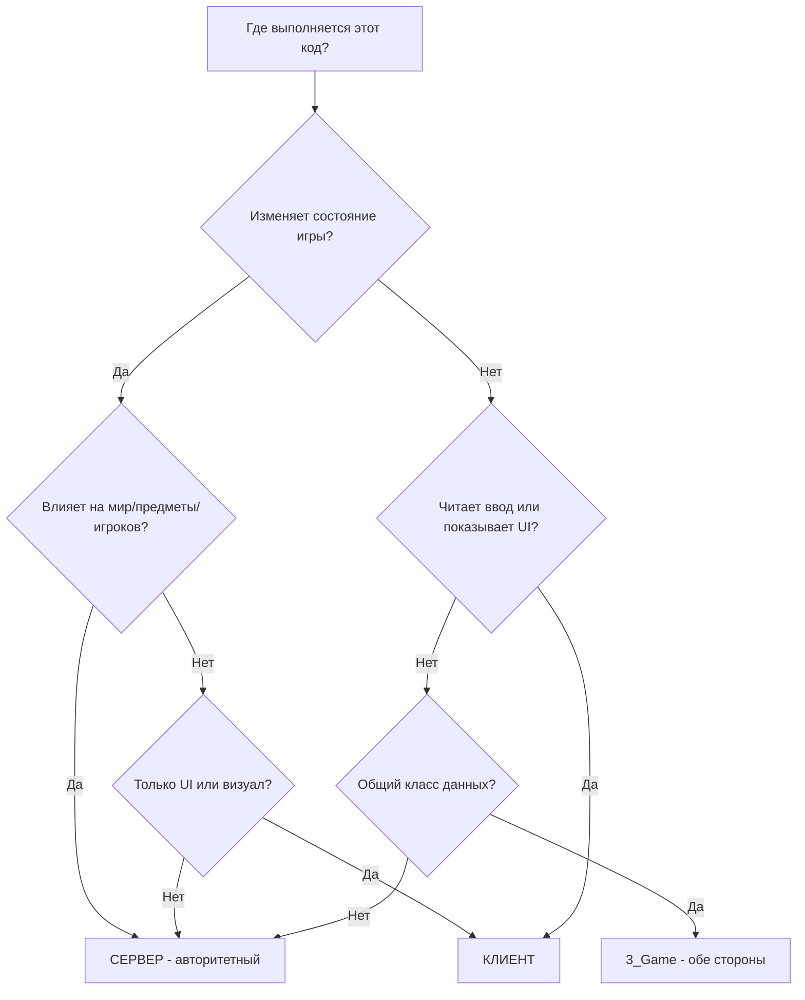

# Глава 2.6: Архитектура сервер-клиент

[Главная](../../README.md) | [<< Назад: Организация файлов](05-file-organization.md) | **Архитектура сервер-клиент**

---

> **Краткое описание:** DayZ -- клиент-серверная игра. Каждая строка кода, которую вы пишете, выполняется в определённом контексте -- сервер, клиент или оба. Понимание этого разделения необходимо для написания безопасных и функциональных модов. Эта глава объясняет, где выполняется код, как определить, на какой стороне вы находитесь, как структурировать моды из нескольких пакетов, и паттерны, которые обеспечивают правильное разделение серверного и клиентского кода.

---

## Содержание

- [Фундаментальное разделение](#фундаментальное-разделение)
- [Три контекста выполнения](#три-контекста-выполнения)
- [Проверка места выполнения кода](#проверка-места-выполнения-кода)
- [Поле type в mod.cpp](#поле-type-в-modcpp)
- [Поле type в config.cpp](#поле-type-в-configcpp)
- [Архитектура мода из нескольких пакетов](#архитектура-мода-из-нескольких-пакетов)
- [Золотые правила](#золотые-правила)
- [Матрица скриптовых слоёв и сторон](#матрица-скриптовых-слоёв-и-сторон)
- [Директивы препроцессора](#директивы-препроцессора)
- [Распространённые паттерны сервер-клиент](#распространённые-паттерны-сервер-клиент)
- [Подводные камни Listen Server](#подводные-камни-listen-server)
- [Зависимости между разделёнными модами](#зависимости-между-разделёнными-модами)
- [Реальные примеры разделения](#реальные-примеры-разделения)
- [Распространённые ошибки](#распространённые-ошибки)
- [Блок-схема принятия решений](#блок-схема-принятия-решений)
- [Контрольный список](#контрольный-список)

---

## Фундаментальное разделение

DayZ использует модель **выделенного сервера**. Сервер и клиент -- это отдельные процессы, запускающие отдельные исполняемые файлы. Они обмениваются данными по сети, а движок обрабатывает синхронизацию сущностей, переменных и RPC.

Это означает, что код вашего мода выполняется в одном из трёх контекстов, и правила для каждого фундаментально различны.

```
+------------------------------------------------------------------+
|                                                                  |
|   ВЫДЕЛЕННЫЙ СЕРВЕР                                              |
|   - Безголовый процесс (без окна, без GPU)                       |
|   - Авторитетный: владеет состоянием игры                        |
|   - Спавнит сущности, наносит урон, сохраняет данные             |
|   - НЕТ игрока, НЕТ UI, НЕТ ввода с клавиатуры                 |
|   - Выполняет: MissionServer                                     |
|                                                                  |
+------------------------------------------------------------------+

          ^                                         ^
          |          СЕТЬ (RPC, синхронизируемые     |
          |          переменные)                     |
          v                                         v

+---------------------------+     +---------------------------+
|                           |     |                           |
|   КЛИЕНТ 1                |     |   КЛИЕНТ 2                |
|   - Имеет окно, GPU       |     |   - Имеет окно, GPU       |
|   - Рендерит мир           |     |   - Рендерит мир           |
|   - Обрабатывает ввод      |     |   - Обрабатывает ввод      |
|   - Показывает UI и HUD    |     |   - Показывает UI и HUD    |
|   - Выполняет:             |     |   - Выполняет:             |
|     MissionGameplay        |     |     MissionGameplay        |
|                           |     |                           |
+---------------------------+     +---------------------------+
```

---

## Три контекста выполнения

### 1. Выделенный сервер

Выделенный сервер -- это **безголовый процесс**. У него нет окна, нет вывода видеокарты, нет монитора, нет клавиатуры, нет мыши. Он существует только для выполнения игровой логики.

Ключевые характеристики:
- **Авторитетный** -- состояние сервера является истиной. Если сервер говорит, что у игрока 50 здоровья, у игрока 50 здоровья.
- **Нет объекта игрока** -- `GetGame().GetPlayer()` всегда возвращает `null` на выделенном сервере. Сервер управляет ВСЕМИ игроками, но не ЯВЛЯЕТСЯ ни одним из них.
- **Нет UI** -- любой код, создающий виджеты, показывающий меню или рендерящий элементы HUD, вызовет вылет или молча не сработает.
- **Нет ввода** -- нет клавиатуры или мыши. Код обработки ввода здесь бессмыслен.
- **Доступ к файловой системе** -- сервер может читать и записывать файлы в свою директорию профиля (`$profile:`), где хранятся конфигурации, данные игроков и логи.
- **Класс миссии** -- сервер создаёт экземпляр `MissionServer`, а не `MissionGameplay`.

### 2. Клиент

Клиент -- это игра игрока. Он имеет окно, рендерит 3D-графику, воспроизводит аудио и обрабатывает ввод.

Ключевые характеристики:
- **Уровень представления** -- клиент рендерит то, что сервер указывает рендерить. Он не решает, что существует в мире.
- **Имеет игрока** -- `GetGame().GetPlayer()` возвращает экземпляр `PlayerBase` локального игрока.
- **UI и HUD** -- всё создание виджетов, загрузка макетов и код меню выполняются здесь.
- **Ввод** -- ввод с клавиатуры, мыши и геймпада обрабатывается здесь.
- **Ограниченная авторитетность** -- клиент может ЗАПРАШИВАТЬ действия (через RPC), но РЕШАЕТ, произойдут ли они, сервер.
- **Класс миссии** -- клиент создаёт экземпляр `MissionGameplay`, а не `MissionServer`.

### 3. Listen Server (разработка/тестирование)

Listen server -- это одновременно и сервер, И клиент в одном процессе. Это то, что вы получаете при запуске DayZ через Workbench или с параметром запуска `-server` для локальной игры.

Ключевые характеристики:
- **И `IsServer()`, и `IsClient()` возвращают true** -- это критическое отличие от выделенных серверов.
- **Имеет игрока И управляет всеми игроками** -- `GetGame().GetPlayer()` возвращает хост-игрока.
- **Выполняются хуки и `MissionServer`, и `MissionGameplay`** -- ваши modded классы для обоих будут выполняться.
- **Используется только для разработки** -- продакшн-серверы всегда выделенные.
- **Может скрывать ошибки** -- код, который работает на listen server, может сломаться на выделенном, потому что listen server имеет доступ к типам и сервера, и клиента.

---

## Проверка места выполнения кода

Глобальная функция `GetGame()` возвращает экземпляр игры, который предоставляет методы для определения контекста выполнения:

```c
// ---------------------------------------------------------------
// Проверки контекста выполнения
// ---------------------------------------------------------------

if (GetGame().IsServer())
{
    // TRUE на: выделенном сервере, listen server
    // FALSE на: клиенте, подключённом к удалённому серверу
    // Используйте для: серверной логики (спавн, урон, сохранение)
}

if (GetGame().IsClient())
{
    // TRUE на: клиенте, подключённом к удалённому серверу, listen server
    // FALSE на: выделенном сервере
    // Используйте для: UI-кода, обработки ввода, визуальных эффектов
}

if (GetGame().IsDedicatedServer())
{
    // TRUE на: только выделенном сервере
    // FALSE на: клиенте, listen server
    // Используйте для: кода, который НИКОГДА не должен выполняться на listen server
}

if (GetGame().IsMultiplayer())
{
    // TRUE на: любой мультиплеерной сессии (выделенный сервер, удалённый клиент)
    // FALSE на: одиночной/офлайн-игре
    // Используйте для: отключения функций в офлайн-тестировании
}
```

### Таблица истинности

| Метод | Выделенный сервер | Клиент (удалённый) | Listen Server |
|--------|:---:|:---:|:---:|
| `IsServer()` | true | false | true |
| `IsClient()` | false | true | true |
| `IsDedicatedServer()` | true | false | false |
| `IsMultiplayer()` | true | true | false |
| `GetPlayer()` возвращает | null | PlayerBase | PlayerBase |

### Распространённые паттерны

```c
// Защита: только серверная логика
void SpawnLoot(vector position)
{
    if (!GetGame().IsServer())
        return;

    // Только сервер создаёт сущности
    EntityAI item = EntityAI.Cast(GetGame().CreateObjectEx("AK101", position, ECE_PLACE_ON_SURFACE));
}

// Защита: только клиентская логика
void ShowNotification(string text)
{
    if (!GetGame().IsClient())
        return;

    // Только клиент может отображать UI
    NotificationSystem.AddNotification(text, "set:dayz_gui image:icon_pin");
}

// Защита: корректная обработка обеих сторон
void OnPlayerAction(PlayerBase player, int actionID)
{
    if (GetGame().IsServer())
    {
        // Проверить и выполнить действие
        ValidateAndApply(player, actionID);
    }

    if (GetGame().IsClient())
    {
        // Воспроизвести локальный звуковой эффект
        PlayActionSound(actionID);
    }
}
```

---

## Поле type в mod.cpp

Файл `mod.cpp` в корне папки вашего мода содержит поле `type`, которое управляет тем, ГДЕ мод загружается:

### type = "mod" (обе стороны)

```
name = "My Mod";
type = "mod";
```

Мод загружается и **на сервере, и на клиенте**. Сервер загружает его, клиенты скачивают и загружают его. Обе стороны компилируют и выполняют скрипты.

**Когда использовать:** Большинство модов используют это. Любой мод, имеющий общие типы (определения сущностей, классы конфигурации, структуры данных RPC), должен быть `type = "mod"`, чтобы обе стороны знали одинаковые типы.

**Пример:** Клиентский мод StarDZ AI использует `type = "mod"`, потому что и серверу, и клиенту нужны определения классов сущностей AI, RPC-константы и структуры данных синхронизации:

```
// StarDZ_AI/mod.cpp
name = "StarDZ AI";
type = "mod";
```

### type = "servermod" (только сервер)

```
name = "My Mod Server";
type = "servermod";
```

Мод загружается **только на сервере**. Клиенты никогда его не видят, не скачивают, не знают о его существовании. Сервер не отправляет его в списке модов.

**Когда использовать:** Серверная логика, к которой клиенты никогда не должны иметь доступ. Это включает:
- Алгоритмы спавна (предотвращает предсказание лута игроками)
- Логику мозга AI (предотвращает анализ эксплойтов)
- Админ-команды и управление сервером
- Подключения к базам данных и внешние API
- Логику валидации античита

**Пример:** Серверный мод StarDZ AI использует `type = "servermod"`, потому что клиенты не должны видеть мозг AI, восприятие, боевую логику или логику спавна:

```
// StarDZ_AI_Server/mod.cpp
name = "StarDZ AI Server";
type = "servermod";
```

### Почему это важно для безопасности

Если ваша логика спавна находится в пакете `type = "mod"`, **каждый игрок скачивает её**. Они могут декомпилировать PBO и прочитать ваши алгоритмы спавна, таблицы лута, пароли администратора или логику античита. Всегда размещайте чувствительную серверную логику в пакете `type = "servermod"`.

---

## Поле type в config.cpp

Внутри `config.cpp` (в секции `CfgMods`) также есть поле `type`. Оно управляет тем, как движок обрабатывает мод внутренне:

```cpp
class CfgMods
{
    class MyMod
    {
        type = "mod";          // или "servermod"
        // ...
    };
};
```

Это поле должно совпадать с полем `type` в вашем `mod.cpp`. Если они не совпадают, вы получите непредсказуемое поведение. Поддерживайте их согласованными.

`config.cpp` также содержит массив `defines[]`, который определяет, как включаются символы препроцессора для межмодового обнаружения:

```cpp
class CfgMods
{
    class StarDZ_AI
    {
        type = "mod";
        defines[] = { "STARDZ_AI" };    // Другие моды могут использовать #ifdef STARDZ_AI
    };
};

class CfgMods
{
    class StarDZ_AIServer
    {
        type = "servermod";
        defines[] = { "STARDZ_AI", "STARDZ_AISERVER" };  // Оба определения доступны
    };
};
```

Обратите внимание, что серверный мод определяет и `STARDZ_AI`, и `STARDZ_AISERVER`. Это позволяет серверному коду определить, загружен ли только клиентский мод или полный серверный пакет.

---

## Архитектура мода из нескольких пакетов

### Зачем разделять на несколько пакетов?

Одна папка мода с `type = "mod"` отправляет всё клиентам. Для многих модов это нормально. Но для модов с чувствительной серверной логикой необходимо разделение:

```
@MyMod/                          <-- Клиентский пакет (type = "mod")
  mod.cpp                        <-- type = "mod"
  Addons/
    MyMod_Scripts.pbo            <-- Общее: RPC, классы конфигурации, определения сущностей
    MyMod_Data.pbo               <-- Общее: модели, текстуры
    MyMod_GUI.pbo                <-- Только клиент: макеты, наборы изображений

@MyModServer/                    <-- Серверный пакет (type = "servermod")
  mod.cpp                        <-- type = "servermod"
  Addons/
    MyModServer_Scripts.pbo      <-- Только сервер: спавн, мозг, админ
```

Сервер загружает ОБА -- `@MyMod` и `@MyModServer`. Клиенты загружают только `@MyMod`.

### Что куда помещать

**Клиентский пакет** (`type = "mod"`) содержит:
- Определения классов сущностей (обе стороны должны знать, что класс существует)
- Константы RPC ID и структуры данных (обе стороны отправляют/получают)
- Классы конфигурации для настроек, влияющих на клиентское отображение
- Макеты GUI, наборы изображений и стили
- Клиентский UI-код (обёрнутый в `#ifndef SERVER`)
- Модели, текстуры, звуки
- `stringtable.csv` для локализации

**Серверный пакет** (`type = "servermod"`) содержит:
- Классы менеджеров/контроллеров (логика спавна, мозги AI)
- Серверную валидацию и античит
- Загрузку конфигураций и файловый I/O (JSON-конфигурации, данные игроков)
- Обработчики админ-команд
- Интеграцию с внешними сервисами (вебхуки, API)
- Хуки `MissionServer`

### Цепочка зависимостей

Серверный пакет зависит от клиентского, никогда наоборот:

```cpp
// Клиентский мод: config.cpp
class CfgPatches
{
    class MyMod_Scripts
    {
        requiredAddons[] = { "DZ_Scripts" };  // Нет зависимости от сервера
    };
};

// Серверный мод: config.cpp
class CfgPatches
{
    class MyModServer_Scripts
    {
        requiredAddons[] = { "DZ_Scripts", "MyMod_Scripts" };  // Зависит от клиента
    };
};
```

Это гарантирует, что клиентский пакет компилируется первым, и серверный пакет может ссылаться на все типы, определённые в клиентском пакете.

---

## Золотые правила

Эти правила управляют каждым решением о том, куда помещать код:

### Правило 1: Сервер АВТОРИТЕТЕН

Сервер владеет состоянием игры. Он решает, что существует, где это существует и что с этим происходит. Никогда не позволяйте клиенту принимать авторитетные решения.

### Правило 2: Клиент обрабатывает ПРЕДСТАВЛЕНИЕ

Клиент рендерит мир, воспроизводит звуки, показывает UI и собирает ввод. Он не решает исходы игры.

### Правило 3: RPC -- это МОСТ

Удалённые вызовы процедур (RPC) -- единственный структурированный способ коммуникации между сервером и клиентом. Клиент отправляет запросы, сервер отправляет ответы и обновления состояния.

### Правило 4: Никогда не доверяйте клиенту

Любые данные от клиента могут быть подделаны. Всегда валидируйте на сервере.

### Дерево решений



### Матрица ответственности

| Задача | Где | Почему |
|------|-------|-----|
| Спавн сущностей | Сервер | Предотвращает дублирование предметов |
| Нанесение урона | Сервер | Предотвращает читы на бессмертие |
| Удаление сущностей | Сервер | Предотвращает эксплойты гриферства |
| Сохранение данных игроков | Сервер | Постоянное серверное хранилище |
| Загрузка конфигурации | Сервер | Сервер контролирует правила игры |
| Валидация действий | Сервер | Обеспечение античита |
| Проверка прав | Сервер | Клиент не может самоавторизоваться |
| Показ панелей UI | Клиент | У сервера нет дисплея |
| Чтение клавиатуры/мыши | Клиент | У сервера нет устройств ввода |
| Воспроизведение звуков | Клиент | У сервера нет аудиовыхода |
| Рендер эффектов | Клиент | У сервера нет GPU |
| Отображение уведомлений | Клиент | Визуальная обратная связь для игрока |
| Отправка сообщений чата | Оба | Клиент отправляет, сервер рассылает |
| Синхронизация конфигурации клиенту | Оба | Сервер отправляет, клиент хранит локально |
| Отслеживание ближайших сущностей | Оба | Сервер спавнит, клиент рендерит |

---

## Матрица скриптовых слоёв и сторон

5-уровневая иерархия (Глава 2.1) пересекается с разделением сервер-клиент. Не все уровни работают на всех сторонах одинаково:

### Полная матрица

| Слой | Выделенный сервер | Клиент | Listen Server | Примечания |
|-------|:---:|:---:|:---:|-------|
| `1_Core` | Компилируется | Компилируется | Компилируется | Идентичен на всех сторонах |
| `2_GameLib` | Компилируется | Компилируется | Компилируется | Идентичен на всех сторонах |
| `3_Game` | Компилируется | Компилируется | Компилируется | Общие типы, конфигурации, RPC |
| `4_World` | Компилируется | Компилируется | Компилируется | Сущности существуют на обеих сторонах |
| `5_Mission` (MissionServer) | Выполняется | Пропускается | Выполняется | Запуск/остановка сервера |
| `5_Mission` (MissionGameplay) | Пропускается | Выполняется | Выполняется | Инициализация клиентского UI/HUD |

### Что это означает на практике

Слои с 1 по 4 компилируются и выполняются на **всех сторонах**. Код одинаковый. Поэтому определения классов сущностей, классы конфигурации и константы RPC находятся в `3_Game` или `4_World` -- обеим сторонам они нужны.

Слой 5 (`5_Mission`) -- это место, где разделение становится явным:
- `MissionServer` -- класс, который существует только на сервере (и listen server). Он обрабатывает серверную инициализацию, циклы обновления и очистку.
- `MissionGameplay` -- класс, который существует только на клиенте (и listen server). Он обрабатывает клиентский UI, HUD и функции, обращённые к игроку.

Когда вы пишете `modded class MissionServer`, этот код выполняется на выделенном сервере. Когда вы пишете `modded class MissionGameplay`, этот код выполняется на клиенте.

```c
// Серверный хук миссии -- выполняется на выделенном сервере и listen server
modded class MissionServer
{
    override void OnInit()
    {
        super.OnInit();
        // Инициализировать серверные менеджеры
        Print("Server starting up");
    }
};

// Клиентский хук миссии -- выполняется на клиенте и listen server
modded class MissionGameplay
{
    override void OnInit()
    {
        super.OnInit();
        // Инициализировать клиентский UI
        Print("Client starting up");
    }
};
```

---

## Директивы препроцессора

Enforce Script поддерживает директивы препроцессора, которые позволяют условно компилировать код на основе контекста выполнения.

### Определение SERVER

Движок автоматически определяет `SERVER` при компиляции для выделенного сервера. Это проверка **времени компиляции**, а не времени выполнения:

```c
#ifdef SERVER
    // Этот код компилируется ТОЛЬКО на сервере
    // Он не существует в клиентском бинарном файле вообще
#endif

#ifndef SERVER
    // Этот код компилируется ТОЛЬКО на клиенте
    // Сервер не увидит этот код
#endif
```

### Когда использовать директивы препроцессора vs проверки времени выполнения

| Подход | Когда использовать | Пример |
|----------|-------------|---------|
| `#ifndef SERVER` | Обёртка целых определений классов, которые должны существовать только на клиенте | `modded class MissionGameplay` в общем моде |
| `#ifdef SERVER` | Обёртка целых определений классов, которые должны существовать только на сервере | Вспомогательные классы только для сервера |
| `GetGame().IsServer()` | Ветвление во время выполнения в коде, работающем на обеих сторонах | Логика обновления сущности, различающаяся на сторонах |
| `GetGame().IsClient()` | Ветвление во время выполнения в коде, работающем на обеих сторонах | Воспроизведение эффектов только на клиенте |

### Реальный пример: клиентский хук миссии в общем моде

Когда ваш клиентский мод (`type = "mod"`) содержит `modded class MissionGameplay`, вы ДОЛЖНЫ обернуть его в `#ifndef SERVER`. Иначе выделенный сервер попытается скомпилировать его и потерпит неудачу, потому что `MissionGameplay` не существует на сервере:

```c
// В общем клиентском моде (type = "mod")
// Этот файл компилируется и на сервере, и на клиенте
// Без защиты сервер вылетит из-за неопределённого класса MissionGameplay

#ifndef SERVER
modded class MissionGameplay
{
    protected ref MyClientUI m_MyUI;

    override void OnInit()
    {
        super.OnInit();
        m_MyUI = new MyClientUI();
    }

    override void OnUpdate(float timeslice)
    {
        super.OnUpdate(timeslice);
        if (m_MyUI)
            m_MyUI.Update(timeslice);
    }
};
#endif
```

### Комбинирование директив для опциональных зависимостей

Вы можете стекировать директивы препроцессора для детального контроля:

```c
// Компилировать только если загружен StarDZ Core И мы на клиенте
#ifdef STARDZ_CORE
#ifndef SERVER
modded class MissionGameplay
{
    override void OnInit()
    {
        super.OnInit();
        // Регистрация в админ-панели Core -- только клиентская сторона
        StarDZCore core = StarDZCore.GetInstance();
        if (core)
        {
            ref StarDZModInfo info = new StarDZModInfo("MyMod", "My Mod", "1.0");
            core.RegisterMod(info);
        }
    }
};
#endif
#endif
```

---

## Распространённые паттерны сервер-клиент

### Паттерн 1: Серверная валидация с обратной связью клиенту

Самый фундаментальный паттерн в мультиплеерном моддинге. Клиент запрашивает действие, сервер валидирует его и отправляет обратно результат.

```c
// ---------------------------------------------------------------
// 3_Game: Общие RPC-константы и данные (обеим сторонам нужны)
// ---------------------------------------------------------------
class MyRPC
{
    static const int REQUEST_ACTION  = 85001;  // Клиент -> Сервер
    static const int ACTION_RESULT   = 85002;  // Сервер -> Клиент
}

class MyActionData
{
    int m_ActionID;
    bool m_Success;
    string m_Message;
}
```

```c
// ---------------------------------------------------------------
// Клиентская сторона: Отправить запрос, обработать ответ
// ---------------------------------------------------------------
class MyClientHandler
{
    void RequestAction(int actionID)
    {
        if (!GetGame().IsClient())
            return;

        // Отправить запрос серверу
        ScriptRPC rpc = new ScriptRPC();
        rpc.Write(actionID);
        rpc.Send(null, MyRPC.REQUEST_ACTION, true);
    }

    void OnActionResult(ParamsReadContext ctx)
    {
        int actionID;
        bool success;
        string message;

        ctx.Read(actionID);
        ctx.Read(success);
        ctx.Read(message);

        if (success)
            ShowSuccessUI(message);
        else
            ShowErrorUI(message);
    }
}
```

```c
// ---------------------------------------------------------------
// Серверная сторона: Валидация и ответ
// ---------------------------------------------------------------
class MyServerHandler
{
    void OnActionRequest(PlayerIdentity sender, ParamsReadContext ctx)
    {
        if (!GetGame().IsServer())
            return;

        int actionID;
        ctx.Read(actionID);

        // ВАЛИДАЦИЯ -- никогда не доверяйте данным клиента
        bool allowed = ValidateAction(sender, actionID);

        // Выполнить если валидно
        if (allowed)
            ExecuteAction(sender, actionID);

        // Отправить результат обратно клиенту
        ScriptRPC rpc = new ScriptRPC();
        rpc.Write(actionID);
        rpc.Write(allowed);
        rpc.Write(allowed ? "Action completed" : "Action denied");
        rpc.Send(null, MyRPC.ACTION_RESULT, true, sender);
    }
}
```

### Паттерн 2: Синхронизация конфигурации (сервер к клиенту)

Сервер владеет конфигурацией. Когда игрок подключается, сервер отправляет соответствующие настройки клиенту, чтобы клиент мог соответствующим образом настроить отображение.

```c
// ---------------------------------------------------------------
// Сервер: Отправить конфигурацию при подключении игрока
// ---------------------------------------------------------------
modded class MissionServer
{
    void OnPlayerConnect(PlayerBase player)
    {
        PlayerIdentity identity = player.GetIdentity();
        if (!identity)
            return;

        // Отправить настройки отображения клиенту
        ScriptRPC rpc = new ScriptRPC();
        rpc.Write(m_Config.m_ShowHUD);
        rpc.Write(m_Config.m_HUDColor);
        rpc.Write(m_Config.m_MaxDistance);
        rpc.Send(null, MyRPC.SYNC_CONFIG, true, identity);
    }
}
```

```c
// ---------------------------------------------------------------
// Клиент: Получить и применить конфигурацию
// ---------------------------------------------------------------
#ifndef SERVER
class MyClientConfig
{
    bool m_ShowHUD;
    int m_HUDColor;
    float m_MaxDistance;

    void OnConfigReceived(ParamsReadContext ctx)
    {
        ctx.Read(m_ShowHUD);
        ctx.Read(m_HUDColor);
        ctx.Read(m_MaxDistance);

        // Применить к локальному UI
        UpdateHUDVisibility();
    }
}
#endif
```

### Паттерн 3: Синхронизация состояния сущности

Сущности, существующие на обеих сторонах, часто нуждаются в синхронизации пользовательского состояния. Сервер вычисляет состояние, затем отправляет его ближайшим клиентам через RPC.

```c
// ---------------------------------------------------------------
// Сервер: Рассылка состояния AI ближайшим игрокам
// ---------------------------------------------------------------
void SyncStateToClients(SDZ_AIEntity ai)
{
    if (!GetGame().IsServer())
        return;

    ScriptRPC rpc = new ScriptRPC();
    rpc.Write(ai.GetID());
    rpc.Write(ai.GetBehaviorState());
    rpc.Write(ai.IsInCombat());

    // Отправить всем клиентам в радиусе 200м
    rpc.Send(ai, MyRPC.SYNC_STATE, true);
}
```

```c
// ---------------------------------------------------------------
// Клиент: Получение и отображение состояния AI
// ---------------------------------------------------------------
void OnStateReceived(SDZ_AIEntity ai, ParamsReadContext ctx)
{
    if (!GetGame().IsClient())
        return;

    int entityID, behaviorState;
    bool inCombat;

    ctx.Read(entityID);
    ctx.Read(behaviorState);
    ctx.Read(inCombat);

    // Обновить клиентское визуальное состояние
    ai.SetClientBehaviorState(behaviorState);
    ai.SetClientCombatIndicator(inCombat);
}
```

### Паттерн 4: Проверка прав

Права всегда проверяются на сервере. Клиент может кэшировать данные о правах для целей UI (например, затемнение кнопок), но сервер является окончательным авторитетом.

```c
// ---------------------------------------------------------------
// Сервер: Проверка прав перед выполнением админ-команды
// ---------------------------------------------------------------
void OnAdminCommand(PlayerIdentity sender, ParamsReadContext ctx)
{
    if (!GetGame().IsServer())
        return;

    string command;
    ctx.Read(command);

    // Серверная проверка прав -- ЕДИНСТВЕННАЯ проверка, которая имеет значение
    if (!HasPermission(sender.GetId(), "admin.commands." + command))
    {
        SendDenied(sender, "Insufficient permissions");
        return;
    }

    ExecuteAdminCommand(command);
}
```

---

## Подводные камни Listen Server

Listen server -- это самая коварная среда, потому что размывает границу между сервером и клиентом. Вот подводные камни:

### 1. И IsServer(), и IsClient() возвращают True

```c
void MyFunction()
{
    if (GetGame().IsServer())
    {
        // Это выполняется на listen server
        DoServerThing();
    }

    if (GetGame().IsClient())
    {
        // Это ТОЖЕ выполняется на listen server
        DoClientThing();
    }

    // На listen server выполняются ОБЕ ветки!
}
```

**Исправление:** Если нужны исключающие ветки, используйте `else if` или проверяйте `IsDedicatedServer()`:

```c
void MyFunction()
{
    if (GetGame().IsDedicatedServer())
    {
        // Только выделенный сервер
        DoServerOnlyThing();
    }
    else if (GetGame().IsClient())
    {
        // Клиент ИЛИ listen server
        DoClientThing();
    }
}
```

### 2. И MissionServer, и MissionGameplay выполняются

На listen server выполняются хуки и `modded class MissionServer`, и `modded class MissionGameplay`. Если вы инициализируете один и тот же менеджер в обоих, получите два экземпляра:

```c
// ПЛОХО: Создаёт два экземпляра на listen server
modded class MissionServer
{
    override void OnInit()
    {
        super.OnInit();
        m_Manager = new MyManager();  // Экземпляр 1
    }
}

modded class MissionGameplay
{
    override void OnInit()
    {
        super.OnInit();
        m_Manager = new MyManager();  // Экземпляр 2 на listen server!
    }
}
```

**Исправление:** Используйте специфичные для сервера/клиента подклассы или защиту проверками контекста:

```c
modded class MissionServer
{
    override void OnInit()
    {
        super.OnInit();
        m_ServerManager = new MyServerManager();  // Только серверная сторона
    }
}

#ifndef SERVER
modded class MissionGameplay
{
    override void OnInit()
    {
        super.OnInit();
        m_ClientUI = new MyClientUI();  // Только клиентская сторона
    }
}
#endif
```

### 3. GetGame().GetPlayer() работает на Listen Server

На выделенном сервере `GetGame().GetPlayer()` всегда возвращает null. На listen server он возвращает хост-игрока. Код, случайно опирающийся на это, будет работать при тестировании, но вылетит на реальном сервере:

```c
// ПЛОХО: Работает на listen server, вылетает на выделенном
void DoServerThing()
{
    PlayerBase player = PlayerBase.Cast(GetGame().GetPlayer());
    // player равен null на выделенном сервере!
    player.SetHealth(100);  // ВЫЛЕТ ИЗ-ЗА NULL-ССЫЛКИ
}

// ХОРОШО: Получить игрока через правильные серверные методы
void DoServerThing(PlayerBase player)
{
    if (!player)
        return;

    player.SetHealth(100);
}
```

### 4. Тестирование на Listen Server маскирует ошибки

Распространённая ловушка: вы тестируете мод на listen server, всё работает, вы публикуете его, и он вылетает на каждом выделенном сервере. Это происходит потому что:

- Типы, существующие только в `MissionGameplay`, доступны на listen server
- `GetPlayer()` возвращает значение на listen server
- Код и серверной, и клиентской стороны выполняется в одном процессе, поэтому отсутствующие RPC не показывают ошибок (данные уже локальные)

**Всегда тестируйте на выделенном сервере перед публикацией.** Тестирование на listen server полезно для быстрой итерации, но не заменяет правильное тестирование на выделенном сервере.

---

## Зависимости между разделёнными модами

### requiredAddons[] управляет порядком загрузки

Когда вы разделяете мод на клиентский и серверный пакеты, серверный пакет ДОЛЖЕН объявить клиентский пакет как зависимость:

```cpp
// Клиентский пакет: config.cpp
class CfgPatches
{
    class SDZ_AI_Scripts
    {
        requiredAddons[] = { "DZ_Scripts", "DZ_Data", "SDZ_Core_Scripts" };
    };
};

// Серверный пакет: config.cpp
class CfgPatches
{
    class SDZA_Scripts
    {
        requiredAddons[] = { "DZ_Scripts", "SDZ_AI_Scripts", "SDZ_Core_Scripts" };
        //                                 ^^^^^^^^^^^^^^^^
        //                     Сервер зависит от клиентского пакета
    };
};
```

Это обеспечивает:
1. Клиентский пакет компилируется первым
2. Серверный пакет может ссылаться на все типы из клиентского пакета
3. Определения классов сущностей из клиентского пакета доступны серверной логике

### defines[] для обнаружения опциональных зависимостей

Массив `defines[]` в `CfgMods` создаёт символы препроцессора, которые другие моды могут проверять с помощью `#ifdef`:

```cpp
// Клиентский мод StarDZ_AI определяет:
defines[] = { "STARDZ_AI" };

// Серверный мод StarDZ_AI определяет:
defines[] = { "STARDZ_AI", "STARDZ_AISERVER" };
```

Другие моды могут условно компилировать код:

```c
// В другом моде, опционально интегрирующемся с StarDZ AI
#ifdef STARDZ_AI
    // Мод AI загружен -- включить функции интеграции
    void OnAIEntitySpawned(SDZ_AIEntity ai)
    {
        // Реагировать на спавн AI
    }
#endif
```

### Мягкие vs жёсткие зависимости

**Жёсткая зависимость:** указана в `requiredAddons[]`. Движок не загрузит ваш мод, если зависимость отсутствует. Используйте для модов, которые ДОЛЖНЫ быть установлены.

```cpp
requiredAddons[] = { "DZ_Scripts", "SDZ_Core_Scripts" };
// Если SDZ_Core_Scripts отсутствует, этот мод не загрузится
```

**Мягкая зависимость:** определяется через `#ifdef` во время компиляции. Мод загружается в любом случае, но включает дополнительные функции, когда зависимость присутствует.

```c
// Мягкая зависимость от StarDZ Core
#ifdef STARDZ_CORE
class SDZ_AIAdminConfig : StarDZConfigBase
{
    // Существует только если Core загружен
};
#endif

// Запасной вариант когда Core недоступен
#ifndef STARDZ_CORE
class SDZ_AIAdminConfig
{
    // Автономная версия без интеграции Core
};
#endif
```

---

## Реальные примеры разделения

### Пример 1: StarDZ AI (клиент + сервер)

StarDZ AI разделён на два пакета с чётким разделением ответственности:

```
StarDZ_AI/                              <-- Корень разработки
  StarDZ_AI/                            <-- Клиентский пакет (type = "mod")
    mod.cpp
    stringtable.csv
    GUI/
      layouts/
        sdz_ai_interact_prompt.layout   <-- Только клиент: UI взаимодействия
        sdz_ai_voice_bubble.layout      <-- Только клиент: пузырёк речи
    Scripts/
      config.cpp                        <-- defines[] = { "STARDZ_AI" }
      3_Game/StarDZ_AI/
        SDZ_AI_Config.c                 <-- Общий класс конфигурации
        SDZ_AIConstants.c               <-- Общие константы
        SDZ_AIRPC.c                     <-- Общие RPC ID + структуры данных
      4_World/StarDZ_AI/
        SDZ_AIEntity.c                  <-- Определение сущности (обе стороны)
        SDZ_AIPlayerPatches.c           <-- Патчи взаимодействия игрока
      5_Mission/StarDZ_AI/
        SDZ_AI_Register.c              <-- Регистрация в Core (с защитой)
        SDZ_AIClientMission.c           <-- Клиентский UI (#ifndef SERVER)
        SDZ_AIClientUI.c               <-- Управление UI

  StarDZ_AI_Server/                     <-- Серверный пакет (type = "servermod")
    mod.cpp
    Scripts/
      config.cpp                        <-- зависит от SDZ_AI_Scripts
      3_Game/StarDZ_AIServer/
        SDZ_AIAdminConfig.c             <-- Мост конфигурации админ-панели
        SDZ_AIConfig.c                  <-- Загрузка серверной конфигурации
        SDZ_AILoadout.c                 <-- Определения экипировки
      4_World/StarDZ_AIServer/
        SDZ_AIAPI.c                     <-- API для разработчиков
        SDZ_AIBrain.c                   <-- Принятие решений AI
        SDZ_AICombat.c                  <-- Боевое поведение
        SDZ_AIEvents.c                  <-- Обработка событий
        SDZ_AIGOAP.c                    <-- Целеориентированное планирование действий
        SDZ_AIGroup.c                   <-- Координация группы
        SDZ_AIInteraction.c             <-- Обработка взаимодействия с игроком
        SDZ_AILogger.c                  <-- Серверное логирование
        SDZ_AIManager.c                 <-- Главный менеджер AI
        SDZ_AIMemory.c                  <-- Память/база знаний
        SDZ_AIMovement.c               <-- Навигация
        SDZ_AINavmesh.c                <-- Поиск пути
        SDZ_AIPerception.c             <-- Зрение/слух/осведомлённость
        SDZ_AISoundPropagation.c       <-- Обнаружение звуков
        SDZ_AISpawner.c                <-- Логика спавна
      5_Mission/StarDZ_AIServer/
        SDZ_AIServerMission.c           <-- Хук MissionServer
```

Обратите внимание на паттерн:
- **Клиентский пакет** содержит 7 файлов скриптов: константы, RPC, определения сущностей, UI
- **Серверный пакет** содержит 19 файлов скриптов: весь мозг AI, восприятие, боевая система
- Основная часть логики находится на серверной стороне и невидима для игроков

### Пример 2: DayZ Expansion AI

Expansion использует другую структуру -- все скрипты в одном дереве директорий, но разделены на несколько PBO:

```
DayZExpansion/AI/
  Animations/config.cpp          <-- PBO переопределений анимаций
  DebugWeapons/config.cpp        <-- PBO отладочного оружия
  Gear/config.cpp                <-- PBO экипировки/одежды AI
  GUI/                           <-- PBO ресурсов GUI
    layouts/
    config.cpp
  Scripts/                       <-- Основной PBO скриптов
    config.cpp
    1_Core/                      <-- Основы AI на уровне движка
    3_Game/                      <-- Общие типы
    4_World/                     <-- Код сущностей и поведения
    5_Mission/                   <-- Хуки миссий
    AI/                          <-- Подпапка, специфичная для AI
    Common/                      <-- Общее для всех слоёв
    Data/                        <-- Файлы данных
    FSM/                         <-- Определения конечных автоматов
    inputs.xml                   <-- Привязки ввода
  Sounds/                        <-- PBO аудио
```

Expansion хранит всё в одном пакете `type = "mod"`, но использует внутренние защиты `#ifdef` для разделения серверного и клиентского путей кода. Это альтернативный подход -- менее безопасный (клиенты могут декомпилировать всё), но проще в управлении.

### Пример 3: StarDZ Missions (клиент + сервер)

```
StarDZ_Missions/
  StarDZ_Missions/                      <-- Клиент (type = "mod")
    Scripts/
      3_Game/StarDZ_Missions/
        SDZ_Constants.c                 <-- Перечисления типов миссий, RPC ID
        SDZ_MissionsConfig.c            <-- Настройки отображения
        SDZ_RPC.c                       <-- Определения RPC
      4_World/StarDZ_Missions/
        SDZ_RadioHelper.c               <-- Помощник по близости радио
      5_Mission/StarDZ_Missions/
        SDZ_ClientHandler.c             <-- Клиентский UI миссий
        SDZ_MissionsAdminModule.c       <-- Модуль админ-панели

  StarDZ_Missions_Server/              <-- Сервер (type = "servermod")
    Scripts/
      3_Game/StarDZ_MissionsServer/
        SDZ_Config.c                    <-- Загрузчик серверной конфигурации
        SDZ_Logger.c                    <-- Серверное логирование миссий
        SDZ_MissionData.c               <-- Структуры данных миссий
      4_World/StarDZ_MissionsServer/
        SDZ_Instance.c                  <-- Экземпляр активной миссии
        SDZ_Spawner.c                   <-- Спавн лута и целей
      5_Mission/StarDZ_MissionsServer/
        SDZ_ServerMission.c             <-- Хук MissionServer
```

---

## Распространённые ошибки

### Ошибка 1: Запуск серверной логики на клиенте

```c
// НЕПРАВИЛЬНО: Выполняется на клиенте -- любой игрок может спавнить предметы!
void OnButtonClick()
{
    GetGame().CreateObjectEx("M4A1", GetGame().GetPlayer().GetPosition(), ECE_PLACE_ON_SURFACE);
}

// ПРАВИЛЬНО: Клиент запрашивает, сервер валидирует и спавнит
void OnButtonClick()
{
    // Клиент отправляет запрос
    ScriptRPC rpc = new ScriptRPC();
    rpc.Write("M4A1");
    rpc.Send(null, MyRPC.SPAWN_REQUEST, true);
}

// Серверный обработчик
void OnSpawnRequest(PlayerIdentity sender, ParamsReadContext ctx)
{
    if (!GetGame().IsServer())
        return;

    // Валидация: является ли этот игрок администратором?
    if (!IsAdmin(sender.GetId()))
        return;

    string className;
    ctx.Read(className);

    // Сервер спавнит предмет
    GetGame().CreateObjectEx(className, GetPlayerPosition(sender), ECE_PLACE_ON_SURFACE);
}
```

### Ошибка 2: UI-код в серверном моде

```c
// НЕПРАВИЛЬНО: Это в пакете type = "servermod"
// У сервера нет дисплея -- создание виджетов молча не сработает или вызовет вылет
class MyServerPanel
{
    Widget m_Root;

    void Show()
    {
        m_Root = GetGame().GetWorkspace().CreateWidgets("MyMod/GUI/layouts/panel.layout");
        // ВЫЛЕТ: GetWorkspace() возвращает null на выделенном сервере
    }
}
```

**Исправление:** Весь UI-код принадлежит клиентскому пакету (`type = "mod"`), обёрнутому в `#ifndef SERVER`.

### Ошибка 3: GetGame().GetPlayer() на сервере

```c
// НЕПРАВИЛЬНО: GetPlayer() ВСЕГДА null на выделенном сервере
modded class MissionServer
{
    override void OnInit()
    {
        super.OnInit();
        PlayerBase player = PlayerBase.Cast(GetGame().GetPlayer());
        // player равен null на выделенном!
        string name = player.GetIdentity().GetName();  // ВЫЛЕТ ИЗ-ЗА NULL
    }
}
```

**Исправление:** На сервере игроки передаются вам через события, RPC или итерацию:

```c
modded class MissionServer
{
    override void InvokeOnConnect(PlayerBase player, PlayerIdentity identity)
    {
        super.InvokeOnConnect(player, identity);
        // 'player' и 'identity' предоставляются движком
        if (identity)
            Print("Player connected: " + identity.GetName());
    }
}
```

### Ошибка 4: Забывание совместимости с Listen Server

```c
// НЕПРАВИЛЬНО: Предполагает, что IsServer() и IsClient() взаимоисключающие
void OnEntityCreated(EntityAI entity)
{
    if (GetGame().IsServer())
    {
        RegisterEntity(entity);
        return;  // Ранний выход пропускает клиентский код
    }

    // На listen server это никогда не выполнится, потому что IsServer() вернул true
    UpdateClientDisplay(entity);
}

// ПРАВИЛЬНО: Обработать обе стороны независимо
void OnEntityCreated(EntityAI entity)
{
    if (GetGame().IsServer())
    {
        RegisterEntity(entity);
    }

    if (GetGame().IsClient())
    {
        UpdateClientDisplay(entity);
    }
}
```

### Ошибка 5: Неиспользование #ifdef для обнаружения опциональных модов

```c
// НЕПРАВИЛЬНО: Вылет если StarDZ Core не загружен
class MyModInit
{
    void Init()
    {
        StarDZCore core = StarDZCore.GetInstance();  // ОШИБКА КОМПИЛЯЦИИ если Core отсутствует
        core.RegisterMod(info);
    }
}

// ПРАВИЛЬНО: Защита директивой препроцессора
class MyModInit
{
    void Init()
    {
        #ifdef STARDZ_CORE
        StarDZCore core = StarDZCore.GetInstance();
        if (core)
        {
            ref StarDZModInfo info = new StarDZModInfo("MyMod", "My Mod", "1.0");
            core.RegisterMod(info);
        }
        #endif
    }
}
```

### Ошибка 6: Размещение общих типов только в серверном пакете

```c
// НЕПРАВИЛЬНО: Класс данных RPC определён только в servermod
// Клиент не может десериализовать RPC, потому что не знает этот класс

// В MyModServer (type = "servermod"):
class MyStateData  // Клиент никогда не слышал об этом классе
{
    int m_State;
    float m_Value;
}
```

**Исправление:** Общие структуры данных (данные RPC, определения сущностей, классы конфигурации) размещаются в клиентском пакете (`type = "mod"`), чтобы обе стороны их имели:

```c
// В MyMod (type = "mod") -- слой 3_Game:
class MyStateData  // Теперь и сервер, и клиент знают этот класс
{
    int m_State;
    float m_Value;
}
```

### Ошибка 7: Жёстко закодированные серверные пути файлов на клиенте

```c
// НЕПРАВИЛЬНО: Клиент не может получить доступ к директории профиля сервера
void LoadConfig()
{
    string path = "$profile:MyMod/config.json";
    // На клиенте $profile: указывает на профиль КЛИЕНТА, а не сервера
    // Файл конфигурации там не существует
}
```

**Исправление:** Сервер загружает конфигурации и отправляет соответствующие данные клиентам через RPC. Клиенты никогда не читают файлы конфигурации сервера напрямую.

---

## Блок-схема принятия решений

Используйте это для определения, куда относится тот или иной код:

```
                Создаёт/уничтожает сущности?
                       /              \
                     ДА               НЕТ
                      |                 |
              Показывает UI?      Показывает UI?
                /        \           /          \
              ДА         НЕТ       ДА            НЕТ
               |          |         |             |
           ОШИБКА!     СЕРВЕР    КЛИЕНТ        Это класс данных
        (сущности =              только        или RPC-константа?
         сервер,                               /          \
         UI = клиент                         ДА           НЕТ
         -- перепроек-                        |             |
         тируйте)                          ОБЩИЙ        Читает/записывает
                                        (клиентский      файлы или
                                           мод)          валидирует?
                                                         /          \
                                                       ДА           НЕТ
                                                        |             |
                                                     СЕРВЕР        ОБЩИЙ
                                                  (servermod)   (клиентский
                                                                 мод,
                                                                 с защитой
                                                                 IsServer/
                                                                 IsClient)
```

---

## Контрольный список

Перед публикацией разделённого мода проверьте:

- [ ] Клиентский пакет использует `type = "mod"` и в `mod.cpp`, и в `config.cpp`
- [ ] Серверный пакет использует `type = "servermod"` и в `mod.cpp`, и в `config.cpp`
- [ ] Серверный `config.cpp` указывает клиентский пакет в `requiredAddons[]`
- [ ] Все общие типы (данные RPC, классы сущностей, перечисления) находятся в клиентском пакете
- [ ] Вся серверная логика (спавн, валидация, мозги AI) находится в серверном пакете
- [ ] Modded-классы `MissionGameplay` обёрнуты в `#ifndef SERVER`
- [ ] Нет вызовов `GetGame().GetPlayer()` на сервере без проверки на null
- [ ] Нет UI/виджетного кода в серверном пакете
- [ ] Опциональные зависимости используют защиту `#ifdef`, а не прямые ссылки
- [ ] Массив `defines[]` согласован между `mod.cpp` и `config.cpp`
- [ ] Протестировано на **выделенном сервере**, а не только на listen server
- [ ] Серверные файлы конфигурации загружаются на серверной стороне и синхронизируются через RPC, а не читаются клиентами

---

**Предыдущая:** [Глава 2.5: Лучшие практики организации файлов](05-file-organization.md)
**Далее:** [Часть 3: Система GUI и макетов](../03-gui-system/01-widget-types.md)
