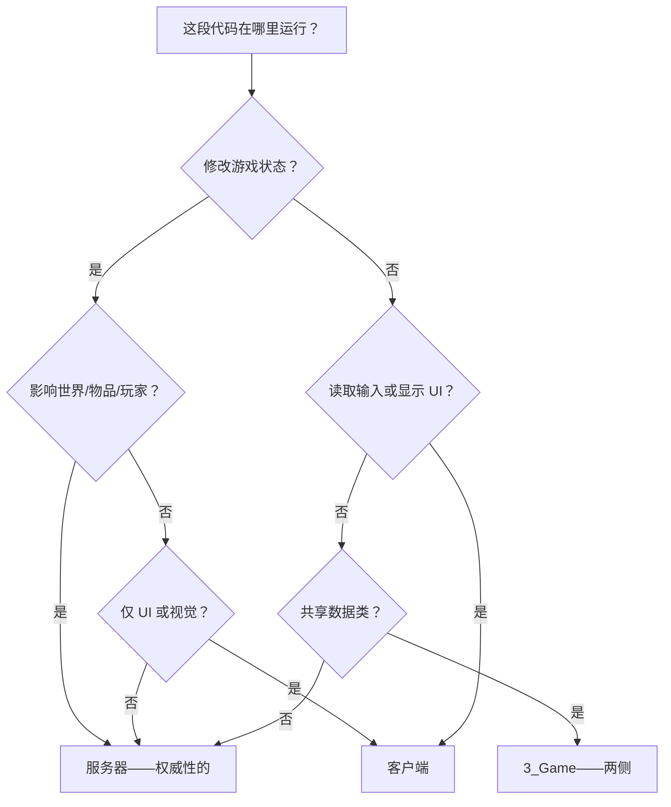

# 第 2.6 章：服务器与客户端架构

[首页](../../README.md) | [<< 上一章：文件组织](05-file-organization.md) | **服务器与客户端架构**

---

> **摘要：**DayZ 是一个客户端-服务器游戏。你编写的每一行代码都在特定的上下文中运行——服务器、客户端或两者都有。理解这种分离对于编写安全、功能正常的模组至关重要。本章解释代码在哪里运行、如何检测你在哪一侧、如何构建多包模组，以及保持服务器和客户端代码正确分离的模式。

---

## 目录

- [基本分离](#基本分离)
- [三种执行上下文](#三种执行上下文)
- [检查代码在哪里运行](#检查代码在哪里运行)
- [mod.cpp 的 type 字段](#modcpp-的-type-字段)
- [config.cpp 的 type 字段](#configcpp-的-type-字段)
- [多包模组架构](#多包模组架构)
- [黄金法则](#黄金法则)
- [脚本层与侧面矩阵](#脚本层与侧面矩阵)
- [预处理器守卫](#预处理器守卫)
- [常见的服务器-客户端模式](#常见的服务器-客户端模式)
- [监听服务器注意事项](#监听服务器注意事项)
- [分离模组之间的依赖](#分离模组之间的依赖)
- [真实分离案例](#真实分离案例)
- [常见错误](#常见错误)
- [决策流程图](#决策流程图)
- [总结清单](#总结清单)

---

## 基本分离

DayZ 使用**专用服务器**模型。服务器和客户端是运行不同可执行文件的独立进程。它们通过网络通信，引擎处理实体、变量和 RPC 的同步。

这意味着你的模组代码在三种上下文之一中运行，每种的规则有根本不同。

```
+------------------------------------------------------------------+
|                                                                  |
|   专用服务器                                                      |
|   - 无头进程（无窗口、无 GPU）                                     |
|   - 权威性的：拥有游戏状态                                         |
|   - 生成实体、施加伤害、保存数据                                    |
|   - 没有玩家、没有 UI、没有键盘输入                                 |
|   - 运行：MissionServer                                          |
|                                                                  |
+------------------------------------------------------------------+

          ^                                         ^
          |          网络（RPC、同步变量）              |
          v                                         v

+---------------------------+     +---------------------------+
|                           |     |                           |
|   客户端 1                |     |   客户端 2                |
|   - 有窗口、GPU          |     |   - 有窗口、GPU          |
|   - 渲染世界              |     |   - 渲染世界              |
|   - 处理玩家输入          |     |   - 处理玩家输入          |
|   - 显示 UI 和 HUD       |     |   - 显示 UI 和 HUD       |
|   - 运行：MissionGameplay |     |   - 运行：MissionGameplay |
|                           |     |                           |
+---------------------------+     +---------------------------+
```

---

## 三种执行上下文

### 1. 专用服务器

专用服务器是一个**无头进程**。没有窗口、没有显卡输出、没有显示器、没有键盘、没有鼠标。它只存在于运行游戏逻辑。

关键特征：
- **权威性的**——服务器的状态是真相。如果服务器说玩家有 50 点生命值，那玩家就有 50 点生命值。
- **没有玩家对象**——`GetGame().GetPlayer()` 在专用服务器上始终返回 `null`。服务器管理所有玩家但本身不是任何玩家。
- **没有 UI**——任何创建控件、显示菜单或渲染 HUD 元素的代码都会崩溃或静默失败。
- **没有输入**——没有键盘或鼠标。输入处理代码在这里毫无意义。
- **文件系统访问**——服务器可以读写其配置文件目录（`$profile:`）中的文件，配置、玩家数据和日志存储在那里。
- **Mission 类**——服务器实例化 `MissionServer`，而不是 `MissionGameplay`。

### 2. 客户端

客户端是玩家的游戏。它有窗口、渲染 3D 图形、播放音频和处理输入。

关键特征：
- **表示层**——客户端渲染服务器告诉它要渲染的内容。它不决定世界中存在什么。
- **有玩家**——`GetGame().GetPlayer()` 返回本地玩家的 `PlayerBase` 实例。
- **UI 和 HUD**——所有控件创建、布局加载和菜单代码在这里运行。
- **输入**——键盘、鼠标和手柄输入在这里处理。
- **有限权限**——客户端可以请求操作（通过 RPC），但服务器决定是否执行。
- **Mission 类**——客户端实例化 `MissionGameplay`，而不是 `MissionServer`。

### 3. 监听服务器（开发/测试）

监听服务器在同一进程中既是服务器又是客户端。这是你通过 Workbench 启动 DayZ 或使用 `-server` 启动参数的本地游戏时得到的。

关键特征：
- **`IsServer()` 和 `IsClient()` 都返回 true**——这是与专用服务器的关键区别。
- **有玩家且管理所有玩家**——`GetGame().GetPlayer()` 返回主机玩家。
- **`MissionServer` 和 `MissionGameplay` 钩子都会运行**——你对两者的 modded 类都会执行。
- **仅用于开发**——生产服务器始终是专用的。
- **可能掩盖错误**——在监听服务器上运行的代码可能在专用服务器上崩溃，因为监听服务器可以访问服务器和客户端类型。

---

## 检查代码在哪里运行

`GetGame()` 全局函数返回游戏实例，它提供检测执行上下文的方法：

```c
// ---------------------------------------------------------------
// 运行时上下文检查
// ---------------------------------------------------------------

if (GetGame().IsServer())
{
    // 在以下情况为 TRUE：专用服务器、监听服务器
    // 在以下情况为 FALSE：连接到远程服务器的客户端
    // 用于：服务器端逻辑（生成、伤害、保存）
}

if (GetGame().IsClient())
{
    // 在以下情况为 TRUE：连接到远程服务器的客户端、监听服务器
    // 在以下情况为 FALSE：专用服务器
    // 用于：UI 代码、输入处理、视觉效果
}

if (GetGame().IsDedicatedServer())
{
    // 仅在专用服务器上为 TRUE
    // 在客户端和监听服务器上为 FALSE
    // 用于：绝不能在监听服务器上运行的代码
}

if (GetGame().IsMultiplayer())
{
    // 在任何多人会话中为 TRUE（专用服务器、远程客户端）
    // 在单人/离线模式中为 FALSE
    // 用于：在离线测试中禁用功能
}
```

### 真值表

| 方法 | 专用服务器 | 客户端（远程） | 监听服务器 |
|--------|:---:|:---:|:---:|
| `IsServer()` | true | false | true |
| `IsClient()` | false | true | true |
| `IsDedicatedServer()` | true | false | false |
| `IsMultiplayer()` | true | true | false |
| `GetPlayer()` 返回 | null | PlayerBase | PlayerBase |

### 常见模式

```c
// 守卫：仅服务器逻辑
void SpawnLoot(vector position)
{
    if (!GetGame().IsServer())
        return;

    // 只有服务器创建实体
    EntityAI item = EntityAI.Cast(GetGame().CreateObjectEx("AK101", position, ECE_PLACE_ON_SURFACE));
}

// 守卫：仅客户端逻辑
void ShowNotification(string text)
{
    if (!GetGame().IsClient())
        return;

    // 只有客户端可以显示 UI
    NotificationSystem.AddNotification(text, "set:dayz_gui image:icon_pin");
}
```

---

## mod.cpp 的 type 字段

模组文件夹根目录的 `mod.cpp` 文件包含一个 `type` 字段，控制模组在**哪里**加载：

### type = "mod"（两侧）

```
name = "My Mod";
type = "mod";
```

模组在**服务器和客户端两侧**加载。服务器加载它，客户端下载并加载它。两侧都编译和执行脚本。

**何时使用：**大多数模组使用这个。任何有共享类型（实体定义、配置类、RPC 数据结构）的模组都需要 `type = "mod"`，这样两侧都知道相同的类型。

### type = "servermod"（仅服务器）

```
name = "My Mod Server";
type = "servermod";
```

模组**仅在服务器上**加载。客户端永远看不到它、永远不会下载它、永远不知道它的存在。

**何时使用：**客户端永远不应访问的服务器端逻辑。包括：
- 生成算法（防止玩家预测战利品）
- AI 大脑逻辑（防止漏洞分析）
- 管理命令和服务器管理
- 数据库连接和外部 API 调用
- 反作弊验证逻辑

### 为什么这对安全很重要

如果你的生成逻辑在 `type = "mod"` 包中，**每个玩家都会下载它**。他们可以反编译 PBO 并阅读你的生成算法、战利品表、管理员密码或反作弊逻辑。始终将敏感的服务器逻辑放在 `type = "servermod"` 包中。

---

## config.cpp 的 type 字段

在 `config.cpp` 中（在 `CfgMods` 部分），也有一个 `type` 字段。这个控制引擎如何在内部处理模组：

```cpp
class CfgMods
{
    class MyMod
    {
        type = "mod";          // 或 "servermod"
        // ...
    };
};
```

这个字段应与你的 `mod.cpp` type 字段匹配。如果它们不一致，你会得到不可预测的行为。保持它们一致。

`config.cpp` 还包含 `defines[]` 数组，这是你启用跨模组检测预处理器符号的方式：

```cpp
class CfgMods
{
    class StarDZ_AI
    {
        type = "mod";
        defines[] = { "STARDZ_AI" };    // 其他模组可以使用 #ifdef STARDZ_AI
    };
};
```

---

## 多包模组架构

### 为什么分成多个包？

单个 `type = "mod"` 的模组文件夹将所有内容发送给客户端。对于许多模组来说，这没问题。但对于有敏感服务器逻辑的模组，你需要分离：

```
@MyMod/                          <-- 客户端包（type = "mod"）
  mod.cpp                        <-- type = "mod"
  Addons/
    MyMod_Scripts.pbo            <-- 共享：RPC、配置类、实体定义
    MyMod_Data.pbo               <-- 共享：模型、纹理
    MyMod_GUI.pbo                <-- 仅客户端：布局、图像集

@MyModServer/                    <-- 服务器包（type = "servermod"）
  mod.cpp                        <-- type = "servermod"
  Addons/
    MyModServer_Scripts.pbo      <-- 仅服务器：生成、大脑、管理
```

服务器加载 `@MyMod` 和 `@MyModServer` 两者。客户端只加载 `@MyMod`。

### 什么放在哪里

**客户端包**（`type = "mod"`）包含：
- 实体类定义（两侧都需要知道类的存在）
- RPC ID 常量和数据结构（两侧发送/接收）
- 影响客户端显示的配置类
- GUI 布局、图像集和样式
- 客户端 UI 代码（包裹在 `#ifndef SERVER` 中）
- 模型、纹理、声音
- `stringtable.csv` 用于本地化

**服务器包**（`type = "servermod"`）包含：
- 管理器/控制器类（生成逻辑、AI 大脑）
- 服务器端验证和反作弊
- 配置加载和文件 I/O（JSON 配置、玩家数据）
- 管理命令处理器
- 外部服务集成（webhook、API）
- `MissionServer` 钩子

### 依赖链

服务器包依赖客户端包，永远不是相反：

```cpp
// 客户端模组：config.cpp
class CfgPatches
{
    class MyMod_Scripts
    {
        requiredAddons[] = { "DZ_Scripts" };  // 不依赖服务器
    };
};

// 服务器模组：config.cpp
class CfgPatches
{
    class MyModServer_Scripts
    {
        requiredAddons[] = { "DZ_Scripts", "MyMod_Scripts" };  // 依赖客户端
    };
};
```

---

## 黄金法则

### 规则 1：服务器是权威的

服务器拥有游戏状态。它决定什么存在、在哪里存在、对它发生什么。永远不要让客户端做权威性决定。

### 规则 2：客户端处理表现

客户端渲染世界、播放声音、显示 UI 和收集输入。它不决定游戏结果。

### 规则 3：RPC 是桥梁

远程过程调用（RPC）是服务器和客户端通信的唯一结构化方式。客户端发送请求，服务器发送响应和状态更新。

### 规则 4：永远不要信任客户端

来自客户端的任何数据都可能被篡改。始终在服务器上验证。

### 决策树



### 职责矩阵

| 任务 | 位置 | 原因 |
|------|-------|-----|
| 生成实体 | 服务器 | 防止物品复制 |
| 施加伤害 | 服务器 | 防止无敌外挂 |
| 删除实体 | 服务器 | 防止恶意利用 |
| 保存玩家数据 | 服务器 | 持久化服务器端存储 |
| 加载配置 | 服务器 | 服务器控制游戏规则 |
| 验证动作 | 服务器 | 反作弊执行 |
| 检查权限 | 服务器 | 客户端不能自我授权 |
| 显示 UI 面板 | 客户端 | 服务器没有显示器 |
| 读取键盘/鼠标 | 客户端 | 服务器没有输入设备 |
| 播放声音 | 客户端 | 服务器没有音频输出 |
| 渲染效果 | 客户端 | 服务器没有 GPU |
| 显示通知 | 客户端 | 给玩家的视觉反馈 |
| 发送聊天消息 | 两者 | 客户端发送，服务器广播 |
| 同步配置到客户端 | 两者 | 服务器发送，客户端本地存储 |

---

## 脚本层与侧面矩阵

5 层层次结构（第 2.1 章）与服务器-客户端分离交叉。

| 层 | 专用服务器 | 客户端 | 监听服务器 | 备注 |
|-------|:---:|:---:|:---:|-------|
| `1_Core` | 编译 | 编译 | 编译 | 所有侧面相同 |
| `2_GameLib` | 编译 | 编译 | 编译 | 所有侧面相同 |
| `3_Game` | 编译 | 编译 | 编译 | 共享类型、配置、RPC |
| `4_World` | 编译 | 编译 | 编译 | 实体存在于两侧 |
| `5_Mission`（MissionServer） | 运行 | 跳过 | 运行 | 服务器启动/关闭 |
| `5_Mission`（MissionGameplay） | 跳过 | 运行 | 运行 | 客户端 UI/HUD 初始化 |

第 1 到 4 层在**所有侧面**编译和运行。代码是相同的。这就是为什么实体类定义、配置类和 RPC 常量都在 `3_Game` 或 `4_World` 中——两侧都需要它们。

第 5 层（`5_Mission`）是分离变得明确的地方：
- `MissionServer` 是一个仅在服务器（和监听服务器）上存在的类。
- `MissionGameplay` 是一个仅在客户端（和监听服务器）上存在的类。

---

## 预处理器守卫

### SERVER 定义

引擎在为专用服务器编译时自动定义 `SERVER`。这是**编译时**检查，不是运行时检查：

```c
#ifdef SERVER
    // 此代码仅在服务器上编译
    // 客户端二进制文件中根本不存在
#endif

#ifndef SERVER
    // 此代码仅在客户端上编译
    // 服务器不会看到此代码
#endif
```

### 何时使用预处理器守卫与运行时检查

| 方法 | 何时使用 | 示例 |
|----------|-------------|---------|
| `#ifndef SERVER` | 包裹应仅在客户端存在的整个类定义 | 共享模组中的 `modded class MissionGameplay` |
| `#ifdef SERVER` | 包裹应仅在服务器存在的整个类定义 | 仅服务器的辅助类 |
| `GetGame().IsServer()` | 在两侧都运行的代码中的运行时分支 | 每侧不同的实体更新逻辑 |
| `GetGame().IsClient()` | 在两侧都运行的代码中的运行时分支 | 仅在客户端播放效果 |

### 真实案例：共享模组中的客户端 Mission 钩子

当你的客户端模组（`type = "mod"`）包含 `modded class MissionGameplay` 时，你**必须**用 `#ifndef SERVER` 包裹它。否则，专用服务器会尝试编译它并失败，因为 `MissionGameplay` 在服务器上不存在：

```c
#ifndef SERVER
modded class MissionGameplay
{
    protected ref MyClientUI m_MyUI;

    override void OnInit()
    {
        super.OnInit();
        m_MyUI = new MyClientUI();
    }

    override void OnUpdate(float timeslice)
    {
        super.OnUpdate(timeslice);
        if (m_MyUI)
            m_MyUI.Update(timeslice);
    }
};
#endif
```

---

## 常见的服务器-客户端模式

### 模式 1：服务器端验证配合客户端反馈

多人游戏模组开发中最基本的模式。客户端请求操作，服务器验证它，然后发回结果。

```c
// ---------------------------------------------------------------
// 3_Game：共享 RPC 常量和数据（两侧都需要这些）
// ---------------------------------------------------------------
class MyRPC
{
    static const int REQUEST_ACTION  = 85001;  // 客户端 -> 服务器
    static const int ACTION_RESULT   = 85002;  // 服务器 -> 客户端
}
```

```c
// ---------------------------------------------------------------
// 客户端：发送请求，处理响应
// ---------------------------------------------------------------
class MyClientHandler
{
    void RequestAction(int actionID)
    {
        if (!GetGame().IsClient())
            return;

        ScriptRPC rpc = new ScriptRPC();
        rpc.Write(actionID);
        rpc.Send(null, MyRPC.REQUEST_ACTION, true);
    }
}
```

```c
// ---------------------------------------------------------------
// 服务器端：验证并响应
// ---------------------------------------------------------------
class MyServerHandler
{
    void OnActionRequest(PlayerIdentity sender, ParamsReadContext ctx)
    {
        if (!GetGame().IsServer())
            return;

        int actionID;
        ctx.Read(actionID);

        // 验证——永远不要信任客户端数据
        bool allowed = ValidateAction(sender, actionID);

        // 如果有效则执行
        if (allowed)
            ExecuteAction(sender, actionID);

        // 将结果发送回客户端
        ScriptRPC rpc = new ScriptRPC();
        rpc.Write(actionID);
        rpc.Write(allowed);
        rpc.Write(allowed ? "Action completed" : "Action denied");
        rpc.Send(null, MyRPC.ACTION_RESULT, true, sender);
    }
}
```

### 模式 2：配置同步（服务器到客户端）

服务器拥有配置。当玩家连接时，服务器发送相关设置给客户端，以便客户端可以相应调整其显示。

### 模式 3：权限检查

权限始终在服务器上检查。客户端可以缓存权限数据用于 UI 目的（例如灰显按钮），但服务器是最终权威。

---

## 监听服务器注意事项

监听服务器是最危险的环境，因为它模糊了服务器和客户端之间的界限。

### 1. IsServer() 和 IsClient() 都为 True

```c
void MyFunction()
{
    if (GetGame().IsServer())
    {
        // 在监听服务器上运行
        DoServerThing();
    }

    if (GetGame().IsClient())
    {
        // 在监听服务器上也运行
        DoClientThing();
    }

    // 在监听服务器上，两个分支都执行！
}
```

**修复：**如果需要互斥分支，使用 `else if` 或检查 `IsDedicatedServer()`。

### 2. MissionServer 和 MissionGameplay 都运行

在监听服务器上，`modded class MissionServer` 和 `modded class MissionGameplay` 都执行其钩子。如果你在两者中初始化相同的管理器，你会得到两个实例。

### 3. GetGame().GetPlayer() 在监听服务器上有效

在专用服务器上，`GetGame().GetPlayer()` 始终返回 null。在监听服务器上，它返回主机玩家。意外依赖这一点的代码在测试时会工作，但在真实服务器上会崩溃。

### 4. 在监听服务器上测试会掩盖错误

**始终在专用服务器上测试后再发布。**监听服务器测试对快速迭代很有用，但不能替代正确的专用服务器测试。

---

## 分离模组之间的依赖

### requiredAddons[] 控制加载顺序

当你将模组分为客户端和服务器包时，服务器包**必须**将客户端包声明为依赖：

```cpp
// 客户端包：config.cpp
class CfgPatches
{
    class SDZ_AI_Scripts
    {
        requiredAddons[] = { "DZ_Scripts", "DZ_Data", "SDZ_Core_Scripts" };
    };
};

// 服务器包：config.cpp
class CfgPatches
{
    class SDZA_Scripts
    {
        requiredAddons[] = { "DZ_Scripts", "SDZ_AI_Scripts", "SDZ_Core_Scripts" };
        //                                 ^^^^^^^^^^^^^^^^
        //                     服务器依赖客户端包
    };
};
```

### defines[] 用于可选依赖检测

`CfgMods` 中的 `defines[]` 数组创建预处理器符号，其他模组可以用 `#ifdef` 检查：

```c
// 在另一个可选集成 StarDZ AI 的模组中
#ifdef STARDZ_AI
    // AI 模组已加载——启用集成功能
    void OnAIEntitySpawned(SDZ_AIEntity ai)
    {
        // 响应 AI 生成
    }
#endif
```

### 软依赖与硬依赖

**硬依赖：**列在 `requiredAddons[]` 中。如果依赖缺失，引擎不会加载你的模组。

**软依赖：**通过 `#ifdef` 在编译时检测。模组无论如何都会加载，但在依赖存在时启用额外功能。

---

## 真实分离案例

### 案例 1：StarDZ AI（客户端 + 服务器）

```
StarDZ_AI/                              <-- 开发根目录
  StarDZ_AI/                            <-- 客户端包（type = "mod"）
    Scripts/
      3_Game/StarDZ_AI/
        SDZ_AI_Config.c                 <-- 共享配置类
        SDZ_AIConstants.c               <-- 共享常量
        SDZ_AIRPC.c                     <-- 共享 RPC ID + 数据结构
      4_World/StarDZ_AI/
        SDZ_AIEntity.c                  <-- 实体定义（两侧）
      5_Mission/StarDZ_AI/
        SDZ_AIClientMission.c           <-- 客户端 UI（#ifndef SERVER）

  StarDZ_AI_Server/                     <-- 服务器包（type = "servermod"）
    Scripts/
      4_World/StarDZ_AIServer/
        SDZ_AIBrain.c                   <-- AI 决策
        SDZ_AICombat.c                  <-- 战斗行为
        SDZ_AIManager.c                 <-- 主 AI 管理器
        SDZ_AIPerception.c             <-- 视觉/听觉/感知
        SDZ_AISpawner.c                <-- 生成逻辑
```

注意模式：
- **客户端包**有 7 个脚本文件：常量、RPC、实体定义、UI
- **服务器包**有 19 个脚本文件：整个 AI 大脑、感知、战斗系统
- 大部分逻辑在服务器端，对玩家不可见

---

## 常见错误

### 错误 1：在客户端运行服务器逻辑

```c
// 错误：这在客户端上运行——任何玩家都可以生成物品！
void OnButtonClick()
{
    GetGame().CreateObjectEx("M4A1", GetGame().GetPlayer().GetPosition(), ECE_PLACE_ON_SURFACE);
}

// 正确：客户端请求，服务器验证并生成
void OnButtonClick()
{
    ScriptRPC rpc = new ScriptRPC();
    rpc.Write("M4A1");
    rpc.Send(null, MyRPC.SPAWN_REQUEST, true);
}
```

### 错误 2：UI 代码在仅服务器模组中

```c
// 错误：这在 type = "servermod" 包中
// 服务器没有显示器——控件创建会静默失败或崩溃
class MyServerPanel
{
    Widget m_Root;

    void Show()
    {
        m_Root = GetGame().GetWorkspace().CreateWidgets("MyMod/GUI/layouts/panel.layout");
        // 崩溃：GetWorkspace() 在专用服务器上返回 null
    }
}
```

**修复：**所有 UI 代码属于客户端包（`type = "mod"`），包裹在 `#ifndef SERVER` 中。

### 错误 3：在服务器上使用 GetGame().GetPlayer()

```c
// 错误：GetPlayer() 在专用服务器上始终为 null
modded class MissionServer
{
    override void OnInit()
    {
        super.OnInit();
        PlayerBase player = PlayerBase.Cast(GetGame().GetPlayer());
        // player 在专用服务器上为 null！
        string name = player.GetIdentity().GetName();  // 空引用崩溃
    }
}
```

**修复：**在服务器上，玩家通过事件、RPC 或迭代传递给你。

### 错误 4：忘记监听服务器兼容性

```c
// 错误：假设 IsServer() 和 IsClient() 互斥
void OnEntityCreated(EntityAI entity)
{
    if (GetGame().IsServer())
    {
        RegisterEntity(entity);
        return;  // 提前返回跳过了客户端代码
    }

    // 在监听服务器上，这永远不会运行，因为 IsServer() 为 true
    UpdateClientDisplay(entity);
}

// 正确：独立处理两侧
void OnEntityCreated(EntityAI entity)
{
    if (GetGame().IsServer())
    {
        RegisterEntity(entity);
    }

    if (GetGame().IsClient())
    {
        UpdateClientDisplay(entity);
    }
}
```

### 错误 5：将共享类型仅放在服务器包中

```c
// 错误：RPC 数据类仅在 servermod 中定义
// 客户端无法反序列化 RPC 因为它不知道这个类

// 在 MyModServer（type = "servermod"）中：
class MyStateData  // 客户端从未听说过这个类
{
    int m_State;
    float m_Value;
}
```

**修复：**共享数据结构（RPC 数据、实体定义、配置类）放在客户端包（`type = "mod"`）中，这样两侧都有。

---

## 决策流程图

使用此图确定一段代码属于哪里：

```
                它是否创建/销毁实体？
                       /              \
                     是                否
                      |                 |
              它是否显示 UI？     它是否显示 UI？
                /        \           /          \
              是          否        是            否
               |          |         |             |
           错误！      服务器    客户端        是数据类
        （实体 =               仅            还是 RPC 常量？
         服务器，                               /          \
         UI = 客户端                          是            否
         ——重新设计）                          |             |
                                          共享          是否读/写
                                       （客户端模组）    文件或验证？
                                                         /          \
                                                       是            否
                                                        |             |
                                                     服务器        共享
                                                  （servermod）  （客户端模组，
                                                                 用 IsServer/
                                                                 IsClient 守卫）
```

---

## 总结清单

在发布分离模组之前，验证：

- [ ] 客户端包在 `mod.cpp` 和 `config.cpp` 中都使用 `type = "mod"`
- [ ] 服务器包在 `mod.cpp` 和 `config.cpp` 中都使用 `type = "servermod"`
- [ ] 服务器 `config.cpp` 在 `requiredAddons[]` 中列出了客户端包
- [ ] 所有共享类型（RPC 数据、实体类、枚举）在客户端包中
- [ ] 所有服务器逻辑（生成、验证、AI 大脑）在服务器包中
- [ ] `MissionGameplay` 的 modded 类包裹在 `#ifndef SERVER` 中
- [ ] 服务器上没有不带空值检查的 `GetGame().GetPlayer()` 调用
- [ ] 服务器包中没有 UI/控件代码
- [ ] 可选依赖使用 `#ifdef` 守卫，而不是直接引用
- [ ] `defines[]` 数组在 `mod.cpp` 和 `config.cpp` 之间匹配
- [ ] 在**专用服务器**上测试过，不仅仅是监听服务器
- [ ] 服务器配置文件在服务器端加载并通过 RPC 同步，而不是由客户端读取

---

**上一章：**[第 2.5 章：文件组织最佳实践](05-file-organization.md)
**下一章：**[第三部分：GUI 与布局系统](../03-gui-system/01-widget-types.md)
