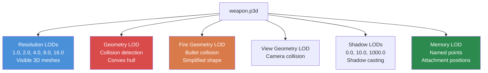

# 第 4.2 章：3D 模型 (.p3d)

[首页](../README.md) | [<< 上一章：纹理](01-textures.md) | **3D 模型** | [下一章：材质 >>](03-materials.md)

---

## 简介

DayZ 中每个物理对象——武器、服装、建筑、车辆、树木、岩石——都是存储在 Bohemia 专有 **P3D** 格式中的 3D 模型。P3D 格式远不止是网格容器：它编码了多个细节级别、碰撞几何体、动画选择、用于附件和效果的记忆点，以及用于可安装物品的代理位置。理解 P3D 文件的工作方式以及如何使用 **Object Builder** 创建它们，对于任何向游戏世界添加物理物品的模组来说都是必不可少的。

本章涵盖 P3D 格式结构、LOD 系统、命名选择、记忆点、代理系统、通过 `model.cfg` 的动画配置，以及从标准 3D 格式的导入工作流程。

---

## 目录

- [P3D 格式概述](#p3d-format-overview)
- [Object Builder](#object-builder)
- [LOD 系统](#the-lod-system)
- [命名选择](#named-selections)
- [记忆点](#memory-points)
- [代理系统](#the-proxy-system)
- [Model.cfg 动画配置](#modelcfg-for-animations)
- [从 FBX/OBJ 导入](#importing-from-fbxobj)
- [常见模型类型](#common-model-types)
- [常见错误](#common-mistakes)
- [最佳实践](#best-practices)

---

## P3D 格式概述

**P3D**（Point 3D）是 Bohemia Interactive 的二进制 3D 模型格式，继承自 Real Virtuality 引擎并延续到 Enfusion。它是一种编译后的、引擎就绪的格式——你不能手动编写 P3D 文件。

### 关键特征

- **二进制格式：** 不可人类阅读。仅使用 Object Builder 创建和编辑。
- **多 LOD 容器：** 单个 P3D 文件包含多个 LOD（细节级别）网格，每个具有不同的用途。
- **引擎原生：** DayZ 引擎直接加载 P3D。不会发生运行时转换。
- **二进制化 vs. 未二进制化：** 来自 Object Builder 的源 P3D 文件是"MLOD"（可编辑的）。Binarize 将它们转换为"ODOL"（优化的、只读的）。游戏可以加载两者，但 ODOL 加载更快且更小。

### 你将遇到的文件类型

| 扩展名 | 说明 |
|-----------|-------------|
| `.p3d` | 3D 模型（MLOD 源文件和 ODOL 二进制化文件） |
| `.rtm` | Runtime Motion —— 动画关键帧数据 |
| `.bisurf` | 表面属性文件（与 P3D 一起使用） |

### MLOD vs. ODOL

| 属性 | MLOD（源文件） | ODOL（二进制化） |
|----------|---------------|-------------------|
| 创建者 | Object Builder | Binarize |
| 可编辑 | 是 | 否 |
| 文件大小 | 较大 | 较小 |
| 加载速度 | 较慢 | 较快 |
| 使用场景 | 开发 | 发布 |
| 包含 | 完整编辑数据、命名选择 | 优化的网格数据 |

> **重要：** 当你使用启用二进制化的方式打包 PBO 时，你的 MLOD P3D 文件会自动转换为 ODOL。如果你使用 `-packonly` 打包，MLOD 文件会按原样包含。两者都能在游戏中工作，但发布版本推荐使用 ODOL。

---

## Object Builder

**Object Builder** 是 Bohemia 提供的用于创建和编辑 P3D 模型的工具。它包含在 Steam 上的 DayZ Tools 套件中。

### 核心功能

- 使用顶点、边和面创建和编辑 3D 网格。
- 在单个 P3D 文件中定义多个 LOD。
- 为动画和纹理控制分配 **命名选择**（顶点/面组）。
- 放置 **记忆点** 用于附件位置、粒子原点和声音来源。
- 为可附加物品（弹匣、瞄准镜等）添加 **代理对象**。
- 将材质（`.rvmat`）和纹理（`.paa`）分配给面。
- 从 FBX、OBJ 和 3DS 格式导入网格。
- 导出经过验证的 P3D 文件供 Binarize 使用。

### 工作空间设置

Object Builder 需要设置 **P: 驱动器**（workdrive）。此虚拟驱动器提供引擎用于定位资产的统一路径前缀。

```
P:\
  DZ\                        <-- 原版 DayZ 数据（已提取）
  DayZ Tools\                <-- 工具安装
  MyMod\                     <-- 你的模组源目录
    data\
      models\
        my_item.p3d
      textures\
        my_item_co.paa
```

P3D 文件和材质中的所有路径都相对于 P: 驱动器根目录。例如，模型内的材质引用将是 `MyMod\data\textures\my_item_co.paa`。

### Object Builder 中的基本工作流程

1. **创建或导入** 你的网格几何体。
2. **定义 LOD** —— 至少创建 Resolution、Geometry 和 Fire Geometry LOD。
3. 在 Resolution LOD 中 **分配材质** 给面。
4. 为任何需要动画、纹理交换或代码交互的部分 **命名选择**。
5. 为附件、枪口闪光位置、弹壳抛出口等 **放置记忆点**。
6. 为可附加的物品（瞄准镜、弹匣、消音器）**添加代理**。
7. 使用 Object Builder 内置验证（Structure --> Validate）进行 **验证**。
8. **保存** 为 P3D。
9. 通过 Binarize 或 AddonBuilder 进行 **构建**。

---

## LOD 系统

P3D 文件包含多个 **LOD**（细节级别），每个服务于特定目的。引擎根据情况选择使用哪个 LOD——与摄像机的距离、物理计算、阴影渲染等。

### LOD 类型

| LOD | 分辨率值 | 用途 |
|-----|-----------------|---------|
| **Resolution 0** | 1.000 | 最高细节视觉网格。物体靠近摄像机时渲染。 |
| **Resolution 1** | 1.100 | 中等细节。中等距离渲染。 |
| **Resolution 2** | 1.200 | 低细节。远距离渲染。 |
| **Resolution 3+** | 1.300+ | 额外的距离 LOD。 |
| **View Geometry** | 特殊 | 确定什么阻挡玩家视野（第一人称）。简化网格。 |
| **Fire Geometry** | 特殊 | 子弹和弹药的碰撞。必须是凸面或由凸面部分组成。 |
| **Geometry** | 特殊 | 物理碰撞。用于移动碰撞、重力、放置。必须是凸面或由凸面分解组成。 |
| **Shadow 0** | 特殊 | 投射阴影的网格（近距离）。 |
| **Shadow 1000** | 特殊 | 投射阴影的网格（远距离）。比 Shadow 0 简单。 |
| **Memory** | 特殊 | 仅包含命名点（无可见几何体）。用于附件位置、声音原点等。 |
| **Roadway** | 特殊 | 定义物体上的可行走表面（车辆、可进入内部的建筑）。 |
| **Paths** | 特殊 | 建筑的 AI 寻路提示。 |

### LOD 分辨率值（视觉 LOD）



引擎使用基于距离和物体大小的公式来确定渲染哪个视觉 LOD：

```
选择的 LOD = (到物体的距离 * LOD 因子) / 物体包围球半径
```

较低的值 = 摄像机更近。引擎找到分辨率值与计算值最接近的 LOD。

### 在 Object Builder 中创建 LOD

1. **File --> New LOD** 或右键点击 LOD 列表。
2. 从下拉菜单中选择 LOD 类型。
3. 对于视觉 LOD（Resolution），输入分辨率值。
4. 为该 LOD 建模几何体。

### 各物品类型的 LOD 要求

| 物品类型 | 必需 LOD | 推荐的额外 LOD |
|-----------|---------------|----------------------------|
| **手持物品** | Resolution 0, Geometry, Fire Geometry, Memory | Shadow 0, Resolution 1 |
| **服装** | Resolution 0, Geometry, Fire Geometry, Memory | Shadow 0, Resolution 1, Resolution 2 |
| **武器** | Resolution 0, Geometry, Fire Geometry, View Geometry, Memory | Shadow 0, Resolution 1, Resolution 2 |
| **建筑** | Resolution 0, Geometry, Fire Geometry, View Geometry, Memory | Shadow 0, Shadow 1000, Roadway, Paths |
| **车辆** | Resolution 0, Geometry, Fire Geometry, View Geometry, Memory | Shadow 0, Roadway, Resolution 1+ |

### Geometry LOD 规则

Geometry 和 Fire Geometry LOD 有严格的要求：

- **必须是凸面的** 或由多个凸面组件组成。引擎的物理系统需要凸面碰撞形状。
- **命名选择必须匹配** Resolution LOD 中的那些（用于动画部分）。
- **必须定义质量。** 选择 Geometry LOD 中的所有顶点，通过 **Structure --> Mass** 分配质量。这决定了物体的物理重量。
- **保持简单。** 更少的三角形 = 更好的物理性能。武器的 Geometry LOD 可能有 20-50 个三角形，而视觉 LOD 有数千个。

---

## 命名选择

命名选择是 LOD 中被标记了名称的顶点、边或面的组。它们充当引擎和脚本用于操作模型部分的句柄。

### 命名选择的功能

| 用途 | 示例选择名称 | 使用者 |
|---------|----------------------|---------|
| **动画** | `bolt`, `trigger`, `magazine` | `model.cfg` 动画源 |
| **纹理交换** | `camo`, `camo1`, `body` | config.cpp 中的 `hiddenSelections[]` |
| **伤害纹理** | `zbytek` | 引擎伤害系统，材质交换 |
| **附件点** | `magazine`, `optics`, `suppressor` | 代理和附件系统 |

### hiddenSelections（纹理交换）

模组制作者最常用的命名选择用途是 **hiddenSelections** —— 通过 config.cpp 在运行时交换纹理的能力。

**在 P3D 模型中（Resolution LOD）：**
1. 选择应可重新纹理化的面。
2. 命名选择（例如 `camo`）。

**在 config.cpp 中：**
```cpp
class MyRifle: Rifle_Base
{
    hiddenSelections[] = {"camo"};
    hiddenSelectionsTextures[] = {"MyMod\data\my_rifle_co.paa"};
    hiddenSelectionsMaterials[] = {"MyMod\data\my_rifle.rvmat"};
};
```

这允许使用不同纹理创建同一模型的不同变体，而无需复制 P3D 文件。

### 创建命名选择

在 Object Builder 中：

1. 选择你想要分组的顶点或面。
2. 进入 **Structure --> Named Selections**（或按 Ctrl+N）。
3. 点击 **New**，输入选择名称。
4. 点击 **Assign** 将选定的几何体标记为该名称。

> **提示：** 选择名称区分大小写。`Camo` 和 `camo` 是不同的选择。约定是使用小写。

### 跨 LOD 的选择

命名选择必须跨 LOD 保持一致才能使动画工作：

- 如果 `bolt` 选择存在于 Resolution 0 中，它也必须存在于 Geometry 和 Fire Geometry LOD 中（覆盖相应的碰撞几何体）。
- 如果动画部分应投射正确的阴影，Shadow LOD 也应有该选择。

---

## 记忆点

记忆点是在 **Memory LOD** 中定义的命名位置。它们在游戏中没有视觉表现——它们定义引擎和脚本引用的空间坐标，用于定位效果、附件、声音等。

### 常用记忆点

| 点名称 | 用途 |
|------------|---------|
| `usti hlavne` | 枪口位置（子弹起源、枪口闪光出现的位置） |
| `konec hlavne` | 枪管末端（与 `usti hlavne` 一起定义枪管方向） |
| `nabojnicestart` | 弹壳抛出口起点（弹壳出现的位置） |
| `nabojniceend` | 弹壳抛出口终点（抛出方向） |
| `handguard` | 护手附件点 |
| `magazine` | 弹匣井位置 |
| `optics` | 瞄准镜导轨位置 |
| `suppressor` | 消音器安装位置 |
| `trigger` | 扳机位置（用于手部 IK） |
| `pistolgrip` | 手枪握把位置（用于手部 IK） |
| `lefthand` | 左手握持位置 |
| `righthand` | 右手握持位置 |
| `eye` | 眼睛位置（用于第一人称视角对齐） |
| `pilot` | 驾驶员/飞行员座位位置（车辆） |
| `light_l` / `light_r` | 左/右前灯位置（车辆） |

### 方向性记忆点

许多效果需要位置和方向两者。这通过成对的记忆点实现：

```
usti hlavne  ------>  konec hlavne
（枪口起点）          （枪口终点）

方向向量为：konec hlavne - usti hlavne
```

### 在 Object Builder 中创建记忆点

1. 在 LOD 列表中切换到 **Memory LOD**。
2. 在所需位置创建一个顶点。
3. 通过 **Structure --> Named Selections** 命名它：用点名称创建一个选择，并将单个顶点分配给它。

> **注意：** Memory LOD 应 **仅** 包含命名点（单独的顶点）。不要在 Memory LOD 中创建面或边。

---

## 代理系统

代理定义了其他 P3D 模型可以附加的位置。当你看到弹匣插入武器、瞄准镜安装在导轨上或消音器拧到枪管上时——那些都是代理附加的模型。

### 代理的工作原理

代理是放置在 Resolution LOD 中的特殊引用，指向另一个 P3D 文件。引擎在代理的位置和方向渲染代理引用的模型。

### 代理命名约定

代理名称遵循模式：`proxy:\path\to\model.p3d`

对于武器上的附件代理，标准名称是：

| 代理路径 | 附件类型 |
|------------|----------------|
| `proxy:\dz\weapons\attachments\magazine\mag_placeholder.p3d` | 弹匣槽 |
| `proxy:\dz\weapons\attachments\optics\optic_placeholder.p3d` | 瞄准镜导轨 |
| `proxy:\dz\weapons\attachments\suppressor\sup_placeholder.p3d` | 消音器安装 |
| `proxy:\dz\weapons\attachments\handguard\handguard_placeholder.p3d` | 护手槽 |
| `proxy:\dz\weapons\attachments\stock\stock_placeholder.p3d` | 枪托槽 |

### 在 Object Builder 中添加代理

1. 在 Resolution LOD 中，将 3D 光标放置在附件应出现的位置。
2. 进入 **Structure --> Proxy --> Create**。
3. 输入代理路径（例如 `dz\weapons\attachments\magazine\mag_placeholder.p3d`）。
4. 代理显示为一个指示位置和方向的小箭头。
5. 旋转和定位代理以正确对齐附件几何体。

### 代理索引

每个代理有一个索引号（从 1 开始）。当模型有多个相同类型的代理时，索引用于区分它们。索引在 config.cpp 中引用：

```cpp
class MyWeapon: Rifle_Base
{
    class Attachments
    {
        class magazine
        {
            type = "magazine";
            proxy = "proxy:\dz\weapons\attachments\magazine\mag_placeholder.p3d";
            proxyIndex = 1;
        };
    };
};
```

---

## Model.cfg 动画配置

`model.cfg` 文件定义 P3D 模型的动画。它将动画源（由游戏逻辑驱动）映射到命名选择上的变换。

### 基本结构

```cpp
class CfgModels
{
    class Default
    {
        sectionsInherit = "";
        sections[] = {};
        skeletonName = "";
    };

    class MyRifle: Default
    {
        skeletonName = "MyRifle_skeleton";
        sections[] = {"camo"};

        class Animations
        {
            class bolt_move
            {
                type = "translation";
                source = "reload";        // 引擎动画源
                selection = "bolt";       // P3D 中的命名选择
                axis = "bolt_axis";       // 轴记忆点对
                memory = 1;               // 轴在 Memory LOD 中定义
                minValue = 0;
                maxValue = 1;
                offset0 = 0;
                offset1 = 0.05;           // 5cm 平移
            };

            class trigger_move
            {
                type = "rotation";
                source = "trigger";
                selection = "trigger";
                axis = "trigger_axis";
                memory = 1;
                minValue = 0;
                maxValue = 1;
                angle0 = 0;
                angle1 = -0.4;            // 弧度
            };
        };
    };
};

class CfgSkeletons
{
    class Default
    {
        isDiscrete = 0;
        skeletonInherit = "";
        skeletonBones[] = {};
    };

    class MyRifle_skeleton: Default
    {
        skeletonBones[] =
        {
            "bolt", "",          // "骨骼名称", "父骨骼"（"" = 根级别）
            "trigger", "",
            "magazine", ""
        };
    };
};
```

### 动画类型

| 类型 | 关键字 | 运动 | 控制方式 |
|------|---------|----------|---------------|
| **平移** | `translation` | 沿轴线性移动 | `offset0` / `offset1`（米） |
| **旋转** | `rotation` | 围绕轴旋转 | `angle0` / `angle1`（弧度） |
| **固定轴旋转** | `rotationX` | 围绕固定世界轴旋转 | `angle0` / `angle1` |
| **隐藏** | `hide` | 显示/隐藏选择 | `hideValue` 阈值 |

### 动画源

动画源是引擎提供的驱动动画的值：

| 源 | 范围 | 说明 |
|--------|-------|-------------|
| `reload` | 0-1 | 武器重新装弹阶段 |
| `trigger` | 0-1 | 扳机扣下 |
| `zeroing` | 0-N | 武器归零设置 |
| `isFlipped` | 0-1 | 机械瞄准具翻转状态 |
| `door` | 0-1 | 门打开/关闭 |
| `rpm` | 0-N | 车辆引擎转速 |
| `speed` | 0-N | 车辆速度 |
| `fuel` | 0-1 | 车辆燃油量 |
| `damper` | 0-1 | 车辆悬挂 |

---

## 从 FBX/OBJ 导入

大多数模组制作者在外部工具（Blender、3ds Max、Maya）中创建 3D 模型，然后导入到 Object Builder 中。

### 支持的导入格式

| 格式 | 扩展名 | 备注 |
|--------|-----------|-------|
| **FBX** | `.fbx` | 最佳兼容性。导出为 FBX 2013 或更高版本（二进制）。 |
| **OBJ** | `.obj` | Wavefront OBJ。仅简单网格数据（无动画）。 |
| **3DS** | `.3ds` | 旧版 3ds Max 格式。每个网格限制为 65K 顶点。 |

### 导入工作流程

**第 1 步：在你的 3D 软件中准备**
- 模型应居中于原点。
- 应用所有变换（位置、旋转、缩放）。
- 缩放：1 单位 = 1 米。DayZ 使用米。
- 三角化网格（Object Builder 使用三角形）。
- UV 展开模型。
- 导出为 FBX（二进制，无动画，Y 轴朝上或 Z 轴朝上——Object Builder 两者都能处理）。

**第 2 步：导入到 Object Builder**
1. 打开 Object Builder。
2. **File --> Import --> FBX**（或 OBJ/3DS）。
3. 检查导入设置：
   - 缩放因子（如果源文件以米为单位，应为 1.0）。
   - 轴转换（如果需要，Z 轴朝上转为 Y 轴朝上）。
4. 网格出现在新的 Resolution LOD 中。

**第 3 步：导入后设置**
1. 将材质分配给面（选择面，右键点击 --> **Face Properties**）。
2. 创建额外的 LOD（Geometry、Fire Geometry、Memory、Shadow）。
3. 简化碰撞 LOD 的几何体（移除小细节，确保凸面性）。
4. 添加命名选择、记忆点和代理。
5. 验证并保存。

### Blender 特定提示

- 如果可用，使用 **Blender DayZ Toolbox** 社区插件——它简化了导出设置。
- 导出时选择：**Apply Modifiers**、**Triangulate Faces**、**Apply Scale**。
- 在 FBX 导出对话框中设置 **Forward: -Z Forward**、**Up: Y Up**。
- 在 Blender 中将网格对象命名为与预期的命名选择匹配——一些导入器会保留对象名称。

---

## 常见模型类型

### 武器

武器是最复杂的 P3D 模型，需要：
- 高多边形 Resolution LOD（5,000-20,000 三角形）
- 多个命名选择（bolt、trigger、magazine、camo 等）
- 完整的记忆点集（枪口、弹壳抛出、握持位置）
- 多个代理（弹匣、瞄准镜、消音器、护手、枪托）
- model.cfg 中的骨骼和动画
- View Geometry 用于第一人称遮挡

### 服装

服装模型绑定到角色骨骼：
- Resolution LOD 遵循角色的骨骼结构
- 用于纹理变体的命名选择（`camo`、`camo1`）
- 较简单的碰撞几何体
- 无代理（通常）
- hiddenSelections 用于颜色/迷彩变体

### 建筑

建筑有独特的要求：
- 大型、详细的 Resolution LOD
- Roadway LOD 用于可行走表面（地板、楼梯）
- Paths LOD 用于 AI 导航
- View Geometry 防止看穿墙壁
- 多个 Shadow LOD 用于不同距离的性能
- 命名选择用于可打开的门和窗户

### 车辆

车辆结合了许多系统：
- 带动画部件（车轮、门、引擎盖）的详细 Resolution LOD
- 包含许多骨骼的复杂骨骼
- Roadway LOD 用于站在卡车货箱中的乘客
- 记忆点用于灯光、排气、驾驶员位置、乘客座位
- 多个代理用于附件（车轮、门）

---

## 常见错误

### 1. 缺少 Geometry LOD

**症状：** 物体没有碰撞。玩家和子弹穿过它。
**修复：** 创建一个带有简化凸面网格的 Geometry LOD。为顶点分配质量。

### 2. 非凸面碰撞形状

**症状：** 物理故障，物体不规则弹跳，物品穿过表面。
**修复：** 将复杂形状分解为 Geometry LOD 中的多个凸面组件。每个组件必须是封闭的凸面实体。

### 3. 命名选择不一致

**症状：** 动画仅在视觉上工作但不影响碰撞，或阴影不动画化。
**修复：** 确保 Resolution LOD 中存在的每个命名选择也存在于 Geometry、Fire Geometry 和 Shadow LOD 中。

### 4. 错误的缩放

**症状：** 物体在游戏中巨大或微小。
**修复：** 验证你的 3D 软件使用米作为单位。DayZ 角色大约 1.8 米高。

### 5. 缺少记忆点

**症状：** 枪口闪光出现在错误的位置，附件漂浮在空中。
**修复：** 创建 Memory LOD 并在正确位置添加所有必需的命名点。

### 6. 未定义质量

**症状：** 物体无法被拾取，或物理交互行为异常。
**修复：** 选择 Geometry LOD 中的所有顶点，通过 **Structure --> Mass** 分配质量。

---

## 最佳实践

1. **从 Geometry LOD 开始。** 先勾画出碰撞形状，然后在其上构建视觉细节。这可以防止创建美丽但无法正确碰撞的模型这一常见错误。

2. **使用参考模型。** 从游戏数据中提取原版 P3D 文件，并在 Object Builder 中研究它们。它们准确显示引擎对每种物品类型的期望。

3. **频繁验证。** 在每次重大更改后使用 Object Builder 的 **Structure --> Validate**。在它们变成神秘的游戏内 bug 之前修复警告。

4. **保持 LOD 三角形数量成比例。** Resolution 0 可能有 10,000 个三角形；Resolution 1 应有约 5,000 个；Geometry 应有约 100-500 个。每个级别大幅减少。

5. **描述性地命名选择。** 使用 `bolt_carrier` 而不是 `sel01`。你未来的自己（和其他模组制作者）会感谢你。

6. **先使用文件补丁测试。** 在提交完整 PBO 构建之前，通过文件补丁模式加载你的未二进制化 P3D。这能更快地发现大多数问题。

7. **记录记忆点。** 保留一个参考图像或文本文件，列出所有记忆点及其预期位置。复杂武器可能有 20 多个点。

---

## 导航

| 上一章 | 上级 | 下一章 |
|----------|----|------|
| [4.1 纹理](01-textures.md) | [第 4 部分：文件格式与 DayZ Tools](01-textures.md) | [4.3 材质](03-materials.md) |
